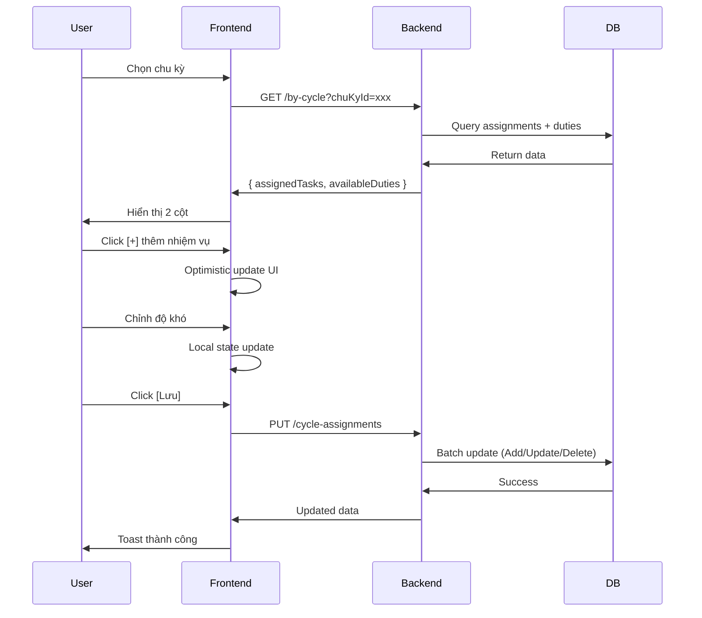

# 🎯 QUICK START GUIDE - Cycle-Based Task Assignment

## 📍 Truy cập trang mới

### URL Pattern:

```
/quanlycongviec/giao-nhiem-vu-chu-ky/{employeeId}
```

### Ví dụ:

```
http://localhost:3000/quanlycongviec/giao-nhiem-vu-chu-ky/66b1dba74f79822a4752d8f8
```

---

## 🚀 Workflow nhanh

### 1️⃣ Chọn chu kỳ

- Dropdown ở đầu trang → Chọn chu kỳ đánh giá (Q1/2025, Q2/2025, ...)
- Dữ liệu sẽ tự động load

### 2️⃣ Gán nhiệm vụ

**Cách 1: Thêm thủ công**

- Click [+] ở cột trái (Danh sách nhiệm vụ)
- Nhiệm vụ tự động chuyển sang cột phải
- Độ khó mặc định được điền sẵn

**Cách 2: Copy từ chu kỳ trước**

- Chọn "Copy từ chu kỳ" dropdown
- Click [Copy]
- Tất cả nhiệm vụ + độ khó được sao chép

### 3️⃣ Điều chỉnh độ khó

- Nhập trực tiếp vào ô "Độ khó thực tế"
- Hoặc dùng mũi tên lên/xuống (bước nhảy 0.5)
- Màu chip tự động đổi:
  - 🟢 Xanh: 1.0 - 3.0 (Dễ)
  - 🟠 Cam: 3.5 - 7.0 (Trung bình)
  - 🔴 Đỏ: 7.5 - 10.0 (Khó)

### 4️⃣ Xóa nhiệm vụ

- Click [X] ở góc phải nhiệm vụ
- Nhiệm vụ tự động quay lại cột trái

### 5️⃣ Lưu thay đổi

- Click [💾 Lưu thay đổi] ở góc phải cột phải
- Chờ spinner xoay → Thông báo thành công

---

## 🎨 Giao diện

```
┌────────────────────────────────────────────────────────┐
│  ← Giao nhiệm vụ theo chu kỳ                          │
│  Nhân viên: Nguyễn Văn A (NV001) - Khoa Nội           │
├────────────────────────────────────────────────────────┤
│  [Chu kỳ: Q1/2025 ▼]  [Copy: Q4/2024 ▼] [Copy]       │
├───────────────────────┬────────────────────────────────┤
│  📚 Nhiệm vụ khả dụng │  📝 Đã gán (3)      [💾 Lưu]  │
├───────────────────────┼────────────────────────────────┤
│  ☐ Báo cáo tuần   [+] │  1. Khám bệnh           [X]   │
│  ☐ Quản lý kho    [+] │     Độ khó: [7.5] 🔴          │
│  ☐ Hướng dẫn SV   [+] │                                │
│                       │  2. Báo cáo tháng        [X]   │
│                       │     Độ khó: [8.0] 🔴          │
│                       │                                │
│                       │  Tổng: 3 nhiệm vụ | Độ khó: 21.5│
└───────────────────────┴────────────────────────────────┘
```

---

## ✅ Validation tự động

### ❌ Không được phép:

- Trùng nhiệm vụ trong cùng chu kỳ
- Độ khó < 1.0 hoặc > 10.0
- Độ khó với > 1 chữ số thập phân (VD: 7.55)
- Copy vào chu kỳ đã có dữ liệu

### ✅ Được phép:

- Cùng nhiệm vụ ở nhiều chu kỳ khác nhau
- Độ khó khác với mặc định
- Xóa và thêm lại nhiệm vụ
- Chỉnh sửa sau khi copy

---

## 🔧 API Endpoints (Backend)

### GET: Lấy danh sách

```
GET /api/workmanagement/giao-nhiem-vu/nhan-vien/:employeeId/by-cycle?chuKyId=xxx
```

### PUT: Lưu thay đổi

```
PUT /api/workmanagement/giao-nhiem-vu/nhan-vien/:employeeId/cycle-assignments
Body: {
  chuKyId: "xxx",
  tasks: [
    { NhiemVuThuongQuyID: "yyy", MucDoKho: 7.5 }
  ]
}
```

### POST: Copy chu kỳ

```
POST /api/workmanagement/giao-nhiem-vu/nhan-vien/:employeeId/copy-cycle
Body: {
  fromChuKyId: "xxx",
  toChuKyId: "yyy"
}
```

---

## 🐛 Troubleshooting

**Q: Không thấy chu kỳ trong dropdown?**

- Kiểm tra backend đang chạy
- Vào `/api/workmanagement/chu-ky-danh-gia` để xem dữ liệu

**Q: Lưu thất bại?**

- Mở Console (F12) → Tab Network
- Xem response error từ API
- Thường do trùng nhiệm vụ hoặc độ khó không hợp lệ

**Q: Copy button bị disable?**

- Phải chọn chu kỳ nguồn trước
- Chu kỳ nguồn ≠ chu kỳ đích
- Chu kỳ nguồn phải có dữ liệu

---

## 📊 Data Flow



---

## ⚡ Tips & Tricks

1. **Nhanh nhất**: Copy từ chu kỳ trước → Chỉnh một vài nhiệm vụ → Lưu
2. **Chính xác nhất**: Thêm từng nhiệm vụ thủ công → Điều chỉnh độ khó cẩn thận
3. **Kiểm tra tổng độ khó**: Footer cột phải hiển thị tổng số
4. **Undo**: Nếu sai → Làm mới trang (F5) → Dữ liệu DB không thay đổi
5. **Mobile**: Cột xếp dọc → Scroll lên xuống để xem

---

## 🎯 Next Steps

1. Test trên môi trường dev
2. Tạo chu kỳ mẫu nếu chưa có
3. Thử copy giữa các chu kỳ
4. Kiểm tra báo cáo KPI có nhận đúng độ khó không
5. Deploy lên production

---

**✨ Happy coding! Thắc mắc liên hệ dev team.**
