# Tổng Quan: Quản Lý Công Việc (Task Management)

> **Module**: QuanLyCongViec/CongViec  
> **Priority**: HIGH  
> **Ngày cập nhật**: 5/1/2026

---

## 📋 Giới Thiệu Module

Module **Quản lý Công việc** (CongViec) là hệ thống quản lý công việc toàn diện với workflow có duyệt, hỗ trợ công việc con (subtasks), bình luận có threading, tích hợp KPI, và cảnh báo deadline tự động.

### Vai Trò Trong Hệ Thống

- 🎯 **Quản lý vòng đời công việc** - Từ tạo mới → giao việc → thực hiện → hoàn thành
- 📊 **Tích hợp KPI** - Liên kết với Nhiệm vụ thường quy và Chu kỳ đánh giá
- 👥 **Phân quyền rõ ràng** - Người giao việc, Người chính, Người phối hợp
- 🔔 **Thông báo tự động** - Deadline warnings, status changes, comments
- 📈 **Theo dõi tiến độ** - Progress tracking với history audit trail
- 🌳 **Cấu trúc cây** - Support công việc con (subtasks) với unlimited nesting

---

## 🎯 Kiến Trúc State Machine

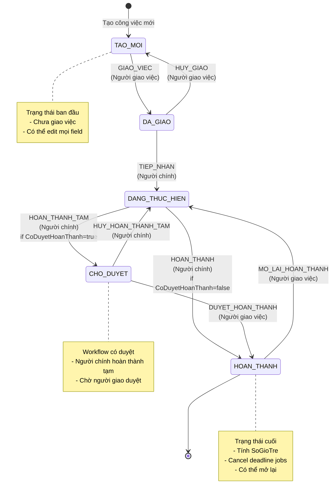

### 5 Trạng Thái (TrangThai)

| Trạng Thái         | Tên Tiếng Việt | Mô Tả                        | Actions Khả Dụng                                       |
| ------------------ | -------------- | ---------------------------- | ------------------------------------------------------ |
| **TAO_MOI**        | Tạo mới        | Công việc mới tạo, chưa giao | GIAO_VIEC, Edit, Delete                                |
| **DA_GIAO**        | Đã giao        | Đã giao việc, chờ tiếp nhận  | HUY_GIAO (Owner), TIEP_NHAN (Main)                     |
| **DANG_THUC_HIEN** | Đang thực hiện | Đang thực hiện công việc     | HOAN_THANH hoặc HOAN_THANH_TAM (Main), Update Progress |
| **CHO_DUYET**      | Chờ duyệt      | Hoàn thành tạm, chờ duyệt    | HUY_HOAN_THANH_TAM (Main), DUYET_HOAN_THANH (Owner)    |
| **HOAN_THANH**     | Hoàn thành     | Đã hoàn thành công việc      | MO_LAI_HOAN_THANH (Owner)                              |

---

## ⚙️ 8 Hành Động Chuyển Trạng Thái

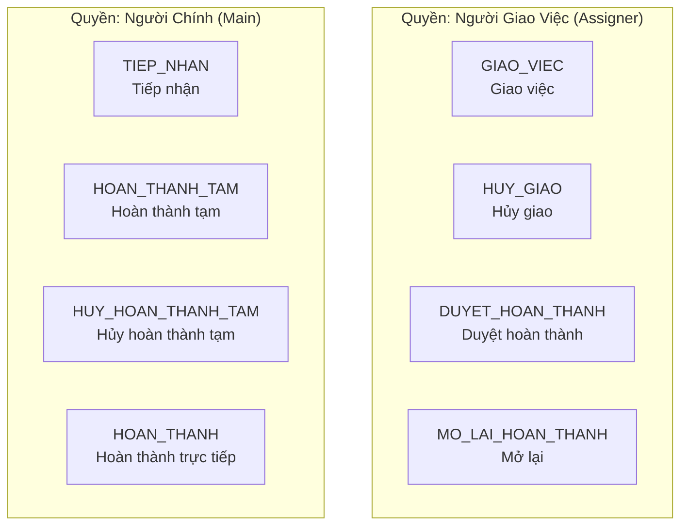

### Chi Tiết Từng Action

| Action                 | Transition                  | Điều Kiện                                                                                           | Side Effects                                                                                                                                   | Quyền       |
| ---------------------- | --------------------------- | --------------------------------------------------------------------------------------------------- | ---------------------------------------------------------------------------------------------------------------------------------------------- | ----------- |
| **GIAO_VIEC**          | TAO_MOI → DA_GIAO           | - TrangThai = TAO_MOI<br/>- Có NgayHetHan                                                           | - Set NgayGiaoViec = now<br/>- Calculate NgayCanhBao<br/>- Schedule deadline jobs                                                              | Người giao  |
| **HUY_GIAO**           | DA_GIAO → TAO_MOI           | - TrangThai = DA_GIAO                                                                               | - Clear NgayGiaoViec<br/>- Clear NgayCanhBao<br/>- Cancel deadline jobs                                                                        | Người giao  |
| **TIEP_NHAN**          | DA_GIAO → DANG_THUC_HIEN    | - TrangThai = DA_GIAO                                                                               | - Set NgayTiepNhanThucTe = now<br/>- Set NgayBatDau = now (if null)                                                                            | Người chính |
| **HOAN_THANH_TAM**     | DANG_THUC_HIEN → CHO_DUYET  | - TrangThai = DANG_THUC_HIEN<br/>- CoDuyetHoanThanh = true                                          | - Set NgayHoanThanhTam = now                                                                                                                   | Người chính |
| **HUY_HOAN_THANH_TAM** | CHO_DUYET → DANG_THUC_HIEN  | - TrangThai = CHO_DUYET                                                                             | - Clear NgayHoanThanhTam                                                                                                                       | Người chính |
| **DUYET_HOAN_THANH**   | CHO_DUYET → HOAN_THANH      | - TrangThai = CHO_DUYET<br/>- Không còn subtask chưa hoàn thành                                     | - Set NgayHoanThanh = now<br/>- Calculate SoGioTre<br/>- Set HoanThanhTreHan flag<br/>- Cancel deadline jobs<br/>- Snapshot to LichSuTrangThai | Người giao  |
| **HOAN_THANH**         | DANG_THUC_HIEN → HOAN_THANH | - TrangThai = DANG_THUC_HIEN<br/>- CoDuyetHoanThanh = false<br/>- Không còn subtask chưa hoàn thành | - Set NgayHoanThanh = now<br/>- Calculate SoGioTre<br/>- Set HoanThanhTreHan flag<br/>- Cancel deadline jobs                                   | Người chính |
| **MO_LAI_HOAN_THANH**  | HOAN_THANH → DANG_THUC_HIEN | - TrangThai = HOAN_THANH                                                                            | - Clear NgayHoanThanh<br/>- Clear SoGioTre<br/>- Clear HoanThanhTreHan<br/>- Reschedule deadline jobs                                          | Người giao  |

---

## 🏗️ Kiến Trúc Hệ Thống

### Technology Stack

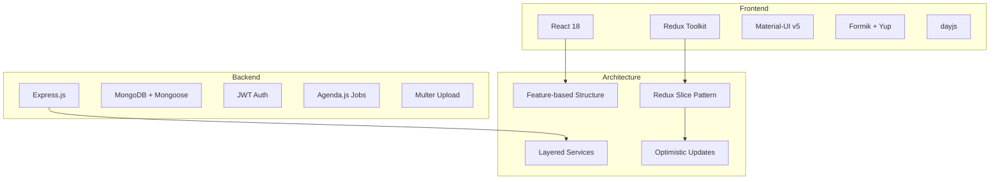

**Frontend**:

- **React 18** - UI framework
- **Redux Toolkit (RTK)** - State management với createSlice
- **Material-UI v5** - Component library
- **Formik + Yup** - Form handling & validation
- **dayjs** - Date manipulation
- **React Hook Form** - Alternative form solution
- **Axios** - HTTP client với interceptors

**Backend**:

- **Express.js** - REST API framework
- **MongoDB** - NoSQL database
- **Mongoose** - ODM với schema validation & hooks
- **JWT** - Token-based authentication
- **Agenda.js** - Background job scheduling
- **Multer** - File upload middleware
- **file-type** - Magic number validation

---

## 📊 Thống Kê Code

### Frontend (React + Redux)

```
fe-bcgiaobanbvt/src/features/QuanLyCongViec/CongViec/
├── congviecSlice.js                    1,832 lines ⭐ Core Redux
├── components/
│   ├── CongViecForm.js                 1,169 lines (Form)
│   ├── CongViecDetailDialog.jsx          ~800 lines (Detail view)
│   ├── CongViecTable.js                  ~600 lines (Table)
│   ├── CommentsList.js                   Comment system
│   ├── RepliesList.js                    Lazy-loaded replies
│   ├── SubtasksSection.jsx               Subtasks management
│   ├── FilesSidebar.js                   File uploads
│   ├── HistoryAccordion.js               Audit trail
│   └── ... 24 components total
├── utils/
│   ├── workActions.js                    Available actions logic
│   ├── permissions.js                    Permission helpers
│   └── textPermission.js                 Permission messages
└── pages/
    ├── CongViecReceivedListPage.js
    └── CongViecAssignedListPage.js
```

**Totals**:

- **29 JavaScript files**
- **24 React components**
- **30 Redux thunk actions**
- **45+ Redux reducers**

### Backend (Express + MongoDB)

```
giaobanbv-be/modules/workmanagement/
├── models/
│   └── CongViec.js                       385 lines (Mongoose schema)
├── controllers/
│   └── congviec.controller.js          4,098 lines ⭐ Business logic
├── services/
│   └── congviec.service.js               751 lines (Core service)
├── helpers/
│   ├── transitionBuilder.js              State machine
│   ├── deadlineScheduler.js              Agenda jobs
│   └── workActions.constants.js          Action definitions
└── routes/
    └── congviec.api.js                   230 lines (32 endpoints)
```

**Totals**:

- **32 API endpoints** (16 GET, 11 POST, 3 PUT, 1 DELETE, 1 PATCH)
- **15+ database indexes**
- **8 transition actions**
- **3 main roles** (Assigner, Main, Participant)

---

## 🎯 8 Tính Năng Cốt Lõi

### 1. State Machine (Máy Trạng Thái) 🔄

**Workflow Có Duyệt vs Không Duyệt**

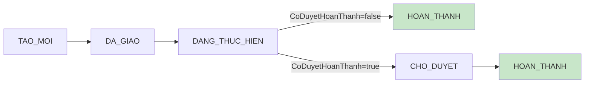

**Features**:

- ✅ 5 trạng thái với transitions được validate
- ✅ Permission matrix cho từng action
- ✅ Available actions tự động tính theo role
- ✅ LichSuTrangThai audit trail
- ✅ Rollback support (HUY_GIAO, HUY_HOAN_THANH_TAM, MO_LAI)

**Xem chi tiết**: [01_STATE_MACHINE_WORKFLOW.md](./01_STATE_MACHINE_WORKFLOW.md)

---

### 2. Optimistic Concurrency Control ⚡

**If-Unmodified-Since Pattern**

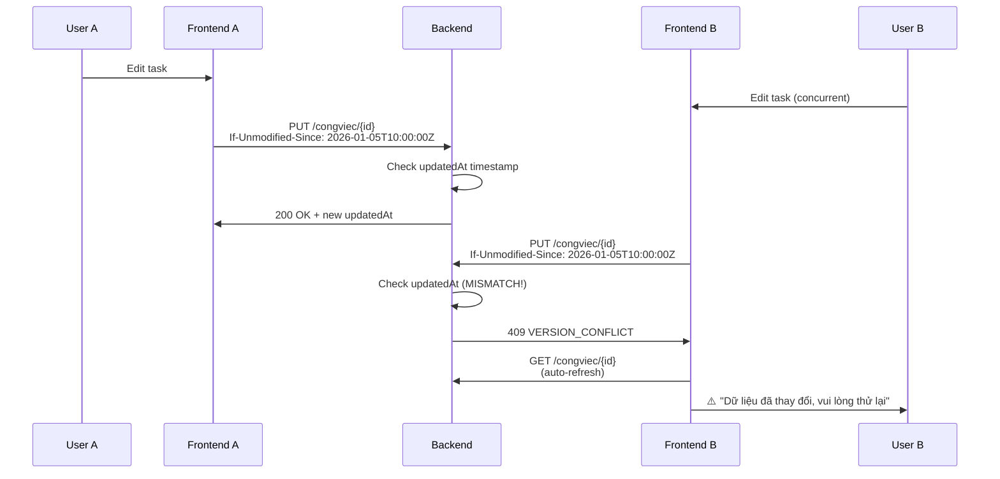

**Features**:

- ✅ Detect race conditions khi nhiều user edit cùng task
- ✅ Auto-refresh on conflict
- ✅ VersionConflictNotice component
- ✅ expectedVersion tracking trong Redux state

**Xem chi tiết**: [02_OPTIMISTIC_CONCURRENCY.md](./02_OPTIMISTIC_CONCURRENCY.md)

---

### 3. Comment Threading System 💬

**Parent Comments + Lazy-Loaded Replies**

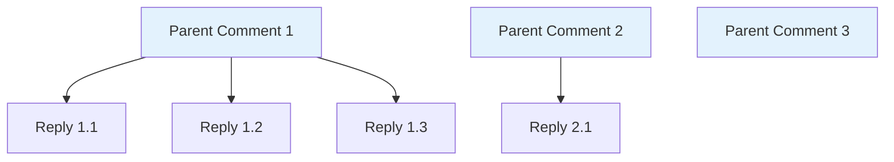

**Features**:

- ✅ 2-level threading (Parent → Replies)
- ✅ Lazy loading replies on demand
- ✅ Cache mechanism (repliesByParent object)
- ✅ Recall options (full delete vs text-only recall)
- ✅ File attachments per comment

**Xem chi tiết**: [03_COMMENT_THREADING_SYSTEM.md](./03_COMMENT_THREADING_SYSTEM.md)

---

### 4. File Management 📁

**Task Files vs Comment Files**

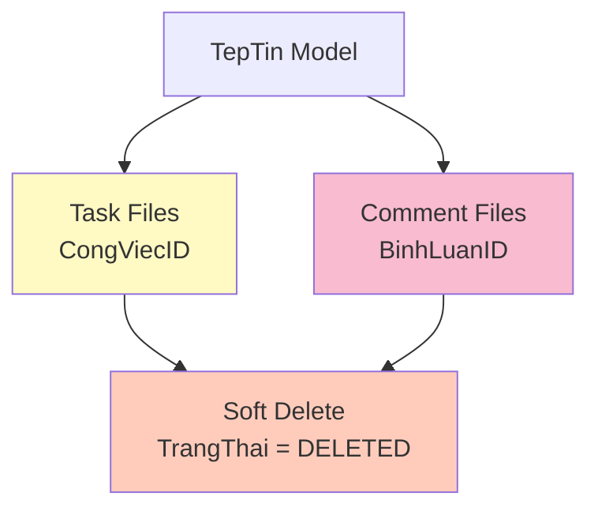

**Features**:

- ✅ Separate storage for task vs comment files
- ✅ Soft delete pattern (không xóa physical files)
- ✅ File upload với Multer + validation
- ✅ Download endpoints (inline/attachment)
- ✅ FilesSidebar component

**Xem chi tiết**: [04_FILE_MANAGEMENT.md](./04_FILE_MANAGEMENT.md)

---

### 5. Subtasks Hierarchy 🌳

**Tree Structure với Path & Depth**

```mermaid
graph TB
    A[Root Task<br/>Depth=0<br/>Path=[]] --> B[Child 1<br/>Depth=1<br/>Path=[rootId]]
    A --> C[Child 2<br/>Depth=1<br/>Path=[rootId]]

    B --> D[Grandchild 1.1<br/>Depth=2<br/>Path=[rootId, child1Id]]
    B --> E[Grandchild 1.2<br/>Depth=2<br/>Path=[rootId, child1Id]]

    C --> F[Grandchild 2.1<br/>Depth=2<br/>Path=[rootId, child2Id]]
```

**Features**:

- ✅ Unlimited nesting depth
- ✅ Auto-calculate Path & Depth (pre-save hook)
- ✅ ChildrenCount tracking (post-save hook)
- ✅ Parent-child constraints (không cho hoàn thành nếu còn con chưa xong)
- ✅ Tree endpoints (getTreeRoot, getTreeChildren, getFullTree)

**Xem chi tiết**: [06_SUBTASKS_HIERARCHY.md](./06_SUBTASKS_HIERARCHY.md)

---

### 6. Deadline Notifications ⏰

**2 Chế Độ Cảnh Báo**

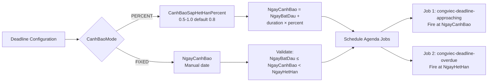

**Features**:

- ✅ PERCENT mode (80% mặc định) hoặc FIXED date
- ✅ Auto-calculate NgayCanhBao
- ✅ Agenda.js job scheduler
- ✅ Notification khi approaching & overdue
- ✅ Tracking fields (LanDauSapQuaHan, ApproachingNotifiedAt, OverdueNotifiedAt)

**Xem chi tiết**: [07_DEADLINE_NOTIFICATIONS.md](./07_DEADLINE_NOTIFICATIONS.md)

---

### 7. Permission System 🔐

**Role-Based Access Control**

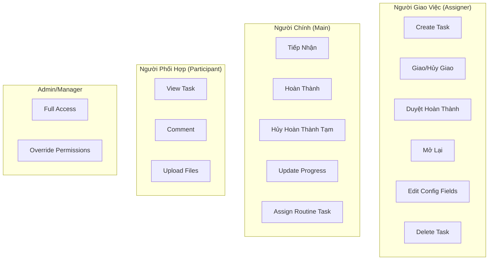

**Features**:

- ✅ 3 vai trò chính (Assigner, Main, Participant)
- ✅ Action-level permissions (ROLE_REQUIREMENTS)
- ✅ Field-level permissions (checkUpdatePermission)
- ✅ View permission check (prevents info leakage)

**Xem chi tiết**: [05_PERMISSION_AUTHORIZATION.md](./05_PERMISSION_AUTHORIZATION.md)

---

### 8. Routine Task Integration 📋

**Liên Kết KPI System**

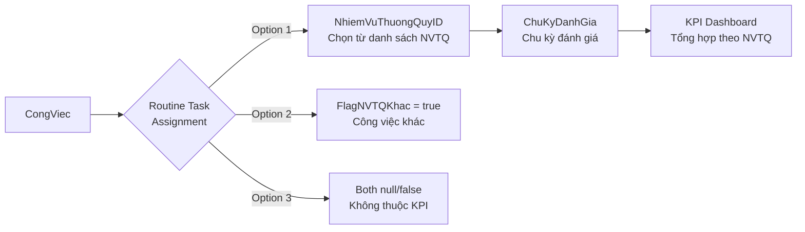

**Features**:

- ✅ Single-select constraint (chỉ 1 NVTQ hoặc flag "Khác")
- ✅ Cycle-aware fetching (theo ChuKyDanhGia)
- ✅ KPI dashboard APIs (by-nhiemvu, summary-other, summary-collab)
- ✅ RoutineTaskSelector component

**Xem chi tiết**: [08_ROUTINE_TASK_INTEGRATION.md](./08_ROUTINE_TASK_INTEGRATION.md)

---

## 🗂️ Cấu Trúc File (File Map)

### Frontend - Key Files

| File                         | Lines | Mô Tả                               |
| ---------------------------- | ----- | ----------------------------------- |
| **congviecSlice.js**         | 1,832 | Redux state, actions, thunks - CORE |
| **CongViecForm.js**          | 1,169 | Form tạo/sửa công việc              |
| **CongViecDetailDialog.jsx** | ~800  | Dialog xem chi tiết                 |
| **CongViecTable.js**         | ~600  | Bảng danh sách với filters          |
| **workActions.js**           | -     | Calculate available actions         |
| **permissions.js**           | -     | Frontend permission checks          |

**Components** (24 components):

- **Comments**: CommentsList.js, CommentComposer.js, RepliesList.js, ReplyComposer.js
- **Subtasks**: SubtasksSection.jsx, SubtasksTable.jsx
- **History**: HistoryAccordion.js, HistorySection.jsx
- **Progress**: ProgressEditDialog.js, ProgressConfirmDialog.jsx
- **Layout**: TaskDialogHeader.jsx, TaskMainContent.jsx, TaskMetaSidebar.js, TaskSidebarPanel.jsx
- **Routine**: RoutineTaskSelector.jsx, RoutineTaskCompactButton.jsx
- **Files**: FilesSidebar.js
- **Misc**: MetricsBlock.js, WarningConfigBlock.js, VersionConflictNotice.jsx, ConfirmActionDialog.jsx, ColorLegendDialog.js

### Backend - Key Files

| File                         | Lines | Mô Tả                             |
| ---------------------------- | ----- | --------------------------------- |
| **congviec.controller.js**   | 4,098 | Business logic, validation - CORE |
| **congviec.service.js**      | 751   | Core service methods              |
| **CongViec.js**              | 385   | Mongoose schema với 15+ indexes   |
| **congviec.api.js**          | 230   | 32 API endpoints                  |
| **transitionBuilder.js**     | -     | State machine logic               |
| **deadlineScheduler.js**     | -     | Agenda job scheduling             |
| **workActions.constants.js** | -     | Action definitions & permissions  |

---

## 🔄 Luồng Dữ Liệu (Data Flow)

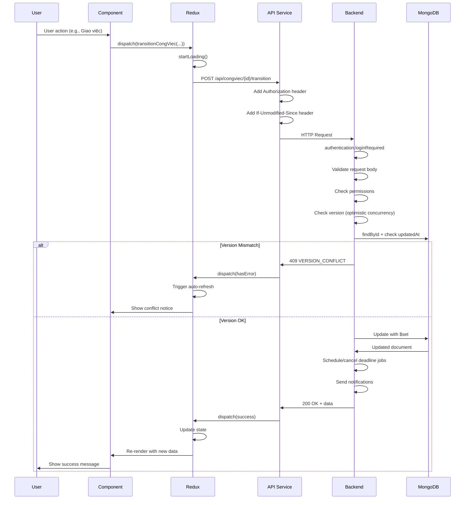

---

## 📡 API Endpoints (32 endpoints)

### Core CRUD

| Method | Endpoint            | Mô Tả                  |
| ------ | ------------------- | ---------------------- |
| POST   | `/api/congviec`     | Tạo công việc mới      |
| GET    | `/api/congviec/:id` | Lấy chi tiết công việc |
| PUT    | `/api/congviec/:id` | Cập nhật công việc     |
| DELETE | `/api/congviec/:id` | Xóa mềm công việc      |

### Lists

| Method | Endpoint                 | Mô Tả                                  |
| ------ | ------------------------ | -------------------------------------- |
| GET    | `/api/congviec/received` | Danh sách công việc được giao (Main)   |
| GET    | `/api/congviec/assigned` | Danh sách công việc đã giao (Assigner) |

### State Transitions

| Method | Endpoint                       | Mô Tả                         |
| ------ | ------------------------------ | ----------------------------- |
| POST   | `/api/congviec/:id/transition` | Chuyển trạng thái (8 actions) |
| POST   | `/api/congviec/:id/giao-viec`  | Giao việc (legacy)            |
| POST   | `/api/congviec/:id/tiep-nhan`  | Tiếp nhận (legacy)            |
| POST   | `/api/congviec/:id/hoan-thanh` | Hoàn thành (legacy)           |

### Progress

| Method | Endpoint                                     | Mô Tả                       |
| ------ | -------------------------------------------- | --------------------------- |
| POST   | `/api/congviec/:id/progress`                 | Cập nhật tiến độ            |
| PUT    | `/api/congviec/:id/progress/:historyId/note` | Sửa ghi chú lịch sử tiến độ |

### Comments

| Method | Endpoint                                        | Mô Tả              |
| ------ | ----------------------------------------------- | ------------------ |
| POST   | `/api/congviec/:id/comments`                    | Thêm comment       |
| POST   | `/api/congviec/comments/:commentId/replies`     | Thêm reply         |
| GET    | `/api/congviec/comments/:commentId/replies`     | Lấy replies (lazy) |
| DELETE | `/api/congviec/comments/:commentId`             | Thu hồi comment    |
| PATCH  | `/api/congviec/comments/:commentId/recall-text` | Thu hồi text only  |

### Subtasks

| Method | Endpoint                      | Mô Tả                  |
| ------ | ----------------------------- | ---------------------- |
| POST   | `/api/congviec/:id/subtasks`  | Tạo công việc con      |
| GET    | `/api/congviec/:id/children`  | Lấy children trực tiếp |
| GET    | `/api/congviec/:id/tree-root` | Lấy root + children    |
| GET    | `/api/congviec/:id/tree`      | Lấy full tree          |

### Routine Tasks

| Method | Endpoint                                 | Mô Tả                         |
| ------ | ---------------------------------------- | ----------------------------- |
| POST   | `/api/congviec/:id/assign-routine-task`  | Gán nhiệm vụ thường quy       |
| GET    | `/api/nhiemvuthuongquy/my`               | Lấy NVTQ của tôi (theo cycle) |
| GET    | `/api/nhiemvuthuongquy/danh-sach-chu-ky` | Lấy danh sách chu kỳ          |

### KPI Dashboards

| Method | Endpoint                                  | Mô Tả                           |
| ------ | ----------------------------------------- | ------------------------------- |
| GET    | `/api/congviec/dashboard-by-nhiemvu`      | Dashboard theo NVTQ             |
| GET    | `/api/congviec/summary-other-tasks`       | Tổng hợp công việc khác         |
| GET    | `/api/congviec/summary-collab-tasks`      | Tổng hợp công việc phối hợp     |
| GET    | `/api/congviec/summary-cross-cycle-tasks` | Tổng hợp công việc xuyên chu kỳ |

**Xem chi tiết**: [09_API_REFERENCE.md](./09_API_REFERENCE.md)

---

## 🎯 Business Rules (Quy Tắc Nghiệp Vụ)

### Validation Cơ Bản

1. ✅ **Required fields**: TieuDe, NgayBatDau, NgayHetHan, NguoiChinhID
2. ✅ **Date validation**: NgayHetHan > NgayBatDau
3. ✅ **Main person**: Phải có đúng 1 người VaiTro=CHINH trong NguoiThamGia
4. ✅ **Unique participants**: Không trùng NhanVienID trong NguoiThamGia
5. ✅ **NguoiChinhID consistency**: Phải khớp với người có VaiTro=CHINH

### Subtask Constraints

1. ✅ **Parent existence**: CongViecChaID phải tồn tại và không bị xóa
2. ✅ **Parent status**: Parent không được ở trạng thái HOAN_THANH
3. ✅ **No self-reference**: CongViecChaID ≠ \_id
4. ✅ **Completion blocking**: Parent không thể hoàn thành nếu còn con chưa HOAN_THANH

### Auto-Calculation

1. ✅ **SoGioTre**: `(NgayHoanThanh - NgayHetHan) / 60` phút → giờ
2. ✅ **HoanThanhTreHan**: `true` nếu SoGioTre > 0
3. ✅ **NgayCanhBao PERCENT**: `NgayBatDau + duration × CanhBaoSapHetHanPercent`
4. ✅ **TinhTrangThoiHan virtual**: DUNG*HAN | SAP_QUA_HAN | QUA_HAN | HOAN_THANH*\*

### Transition Rules

1. ✅ **GIAO_VIEC**: Chỉ từ TAO_MOI, phải có NgayHetHan
2. ✅ **TIEP_NHAN**: Auto-set NgayBatDau = now nếu chưa có
3. ✅ **HOAN_THANH_TAM**: Chỉ khi CoDuyetHoanThanh = true
4. ✅ **HOAN_THANH**: Chỉ khi CoDuyetHoanThanh = false
5. ✅ **DUYET_HOAN_THANH**: Tính SoGioTre, snapshot history
6. ✅ **Rollback actions**: Reset các fields liên quan + reschedule jobs

### Permission Enforcement

1. ✅ **Người giao việc**: Giao/Hủy giao/Duyệt/Mở lại/Delete
2. ✅ **Người chính**: Tiếp nhận/Hoàn thành/Update progress/Assign routine task
3. ✅ **Field-level**: Owner edit config, Main edit routine task only
4. ✅ **Admin override**: Full access to all operations

### Optimistic Concurrency

1. ✅ **Frontend**: Gửi `If-Unmodified-Since` với updatedAt timestamp
2. ✅ **Backend**: So sánh với DB, throw 409 nếu mismatch
3. ✅ **Frontend**: Auto-refresh on conflict, show notice

---

## 🚀 Performance Optimizations

### Database Indexes (15+ indexes)

```javascript
// Compound indexes
{ NguoiGiaoViecID: 1, TrangThai: 1, NgayTao: -1 }
{ NguoiChinhID: 1, TrangThai: 1, NgayTao: -1 }
{ MaCongViec: 1, isDeleted: 1 } // unique + sparse
{ CongViecChaID: 1, isDeleted: 1 }
{ NhiemVuThuongQuyID: 1, isDeleted: 1 }

// Text index for search
{ TieuDe: "text", MoTa: "text" }
```

### Query Optimizations

- ✅ **Aggregation pipeline**: $lookup thay vì populate chain
- ✅ **Lean queries**: `.lean()` cho read-only data
- ✅ **Partial updates**: applyCongViecPatch không replace toàn bộ object
- ✅ **Lazy loading**: Replies chỉ load khi cần
- ✅ **Pagination**: page/limit cho tất cả list endpoints

### Frontend Optimizations

- ✅ **Redux caching**: repliesByParent, subtasksByParent
- ✅ **Optimistic updates**: UI update ngay, rollback nếu lỗi
- ✅ **Incremental refresh**: Chỉ refresh phần thay đổi
- ✅ **Memoization**: useMemo/useCallback cho expensive calculations

---

## 📖 Tài Liệu Liên Quan

### Documentation Suite

1. **[01_STATE_MACHINE_WORKFLOW.md](./01_STATE_MACHINE_WORKFLOW.md)** ⭐ HIGH
   - State machine chi tiết
   - 8 actions với điều kiện & side effects
   - Permission matrix
2. **[02_OPTIMISTIC_CONCURRENCY.md](./02_OPTIMISTIC_CONCURRENCY.md)** ⭐ HIGH

   - If-Unmodified-Since pattern
   - Version conflict resolution
   - Frontend/Backend implementation

3. **[03_COMMENT_THREADING_SYSTEM.md](./03_COMMENT_THREADING_SYSTEM.md)** 📊 MEDIUM

   - Parent/Reply architecture
   - Lazy loading strategy
   - Recall mechanism

4. **[04_FILE_MANAGEMENT.md](./04_FILE_MANAGEMENT.md)** 📊 MEDIUM

   - Task files vs Comment files
   - Upload/Download flow
   - Soft delete pattern

5. **[05_PERMISSION_AUTHORIZATION.md](./05_PERMISSION_AUTHORIZATION.md)** ⭐ HIGH

   - Role-based permissions
   - Action-level & field-level access
   - Security best practices

6. **[06_SUBTASKS_HIERARCHY.md](./06_SUBTASKS_HIERARCHY.md)** 📊 MEDIUM

   - Tree structure (Path & Depth)
   - Parent-child constraints
   - Recursive operations

7. **[07_DEADLINE_NOTIFICATIONS.md](./07_DEADLINE_NOTIFICATIONS.md)** 📊 MEDIUM

   - Deadline calculation logic
   - Agenda.js job scheduling
   - Notification triggers

8. **[08_ROUTINE_TASK_INTEGRATION.md](./08_ROUTINE_TASK_INTEGRATION.md)** 📖 LOW

   - KPI system integration
   - Cycle-based tasks
   - Dashboard APIs

9. **[09_API_REFERENCE.md](./09_API_REFERENCE.md)** 📖 LOW
   - Complete API catalog
   - Request/Response schemas
   - Error codes

### Code References

**Frontend**:

- Redux: [congviecSlice.js](../../../src/features/QuanLyCongViec/CongViec/congviecSlice.js)
- Form: [CongViecForm.js](../../../src/features/QuanLyCongViec/CongViec/components/CongViecForm.js)
- Utils: [workActions.js](../../../src/features/QuanLyCongViec/CongViec/utils/workActions.js)

**Backend**:

- Controller: `giaobanbv-be/modules/workmanagement/controllers/congviec.controller.js`
- Service: `giaobanbv-be/modules/workmanagement/services/congviec.service.js`
- Model: `giaobanbv-be/modules/workmanagement/models/CongViec.js`

---

## 🎓 Hướng Dẫn Đọc

### Cho Người Mới (Beginner) 👶

**Mục tiêu**: Hiểu cơ bản, biết cách sử dụng

1. ✅ **00_OVERVIEW.md** (file này) - 15-20 phút
2. ➡️ **01_STATE_MACHINE_WORKFLOW.md** - Hiểu workflow
3. ➡️ **03_COMMENT_THREADING_SYSTEM.md** - Feature thường dùng
4. ➡️ **09_API_REFERENCE.md** - Tra cứu khi cần

**Thời gian**: ~2 giờ

---

### Cho Developer (Intermediate) 👨‍💻

**Mục tiêu**: Có thể maintain và fix bugs

1. ✅ **00_OVERVIEW.md** (file này)
2. ➡️ **01_STATE_MACHINE_WORKFLOW.md**
3. ⚠️ **02_OPTIMISTIC_CONCURRENCY.md** (CRITICAL)
4. ⚠️ **05_PERMISSION_AUTHORIZATION.md** (SECURITY)
5. ➡️ **06_SUBTASKS_HIERARCHY.md**
6. ➡️ **07_DEADLINE_NOTIFICATIONS.md**
7. ➡️ **03_COMMENT_THREADING_SYSTEM.md**
8. ➡️ **04_FILE_MANAGEMENT.md**
9. ➡️ **08_ROUTINE_TASK_INTEGRATION.md**
10. ➡️ **09_API_REFERENCE.md**

**Thời gian**: ~3.5 giờ

---

### Cho Architect/Lead (Expert) 🏗️

**Mục tiêu**: Hiểu toàn bộ, có thể refactor

- Đọc tất cả 9 files theo thứ tự **00 → 09**
- Focus đặc biệt:
  - State machine design patterns
  - Concurrency control strategies
  - Permission system architecture
  - Scalability considerations
  - Performance optimizations

**Thời gian**: ~4 giờ

---

## 🎯 Next Steps

Sau khi đọc Overview, bạn có thể:

1. **Tìm hiểu chi tiết** - Chọn topic từ danh sách documentation
2. **Xem code** - Follow code references để hiểu implementation
3. **Test features** - Thử các tính năng trên môi trường development
4. **Contribute** - Cải thiện code hoặc documentation

---

**Last Updated**: 5/1/2026  
**Status**: ✅ Complete  
**Next**: [01_STATE_MACHINE_WORKFLOW.md](./01_STATE_MACHINE_WORKFLOW.md)
