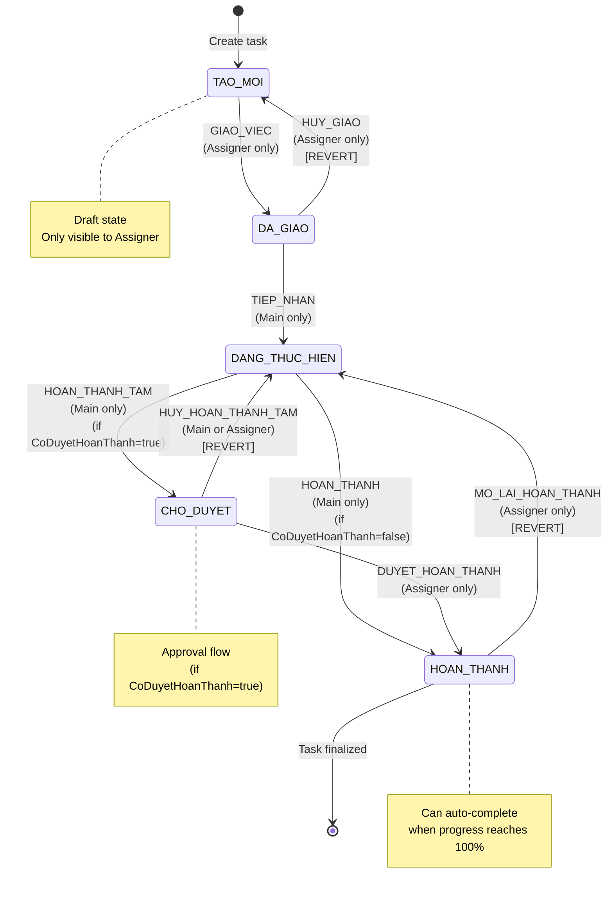
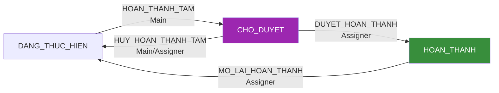
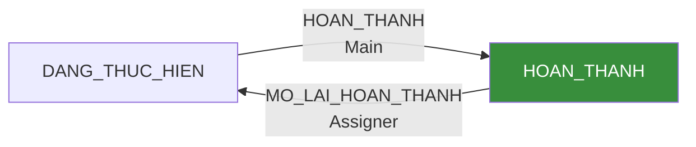
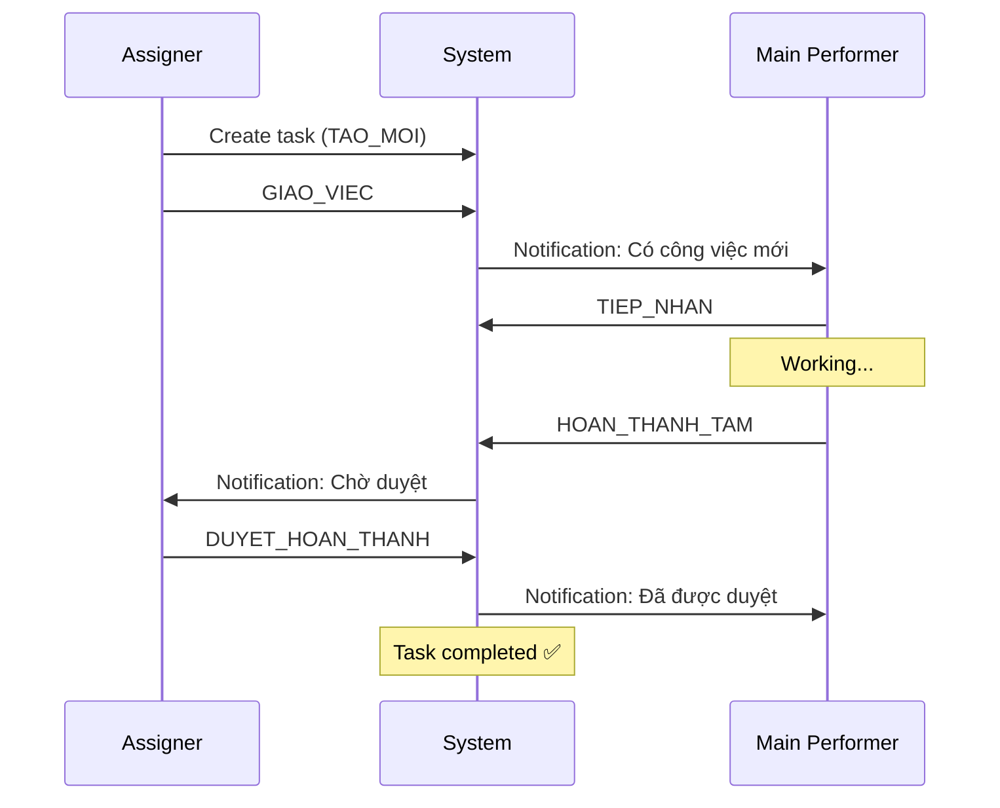
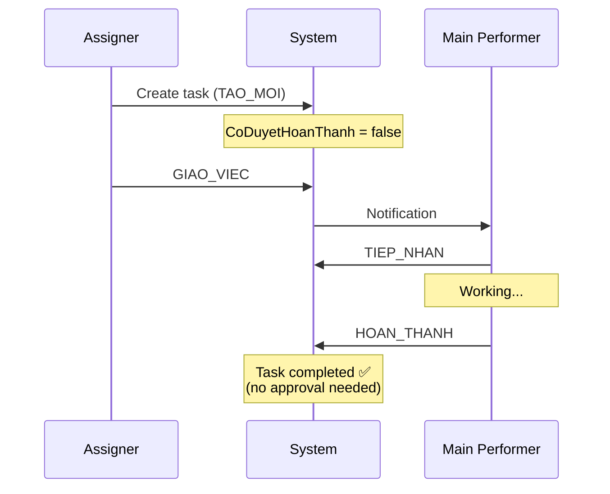
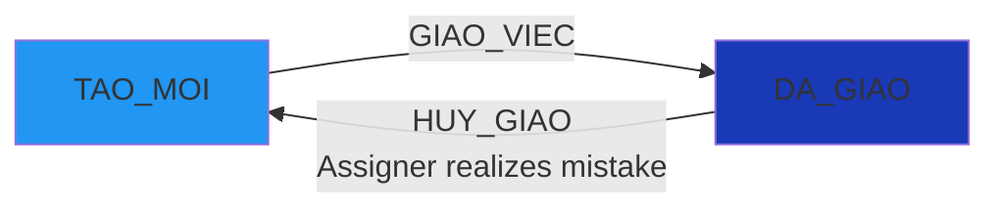
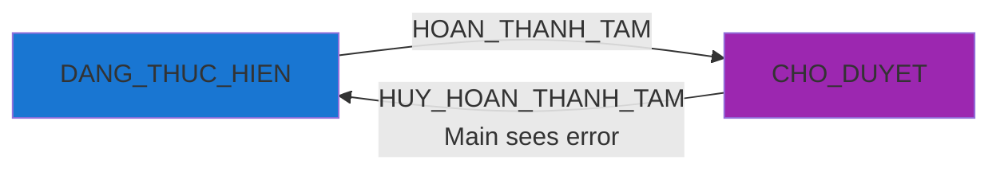

# 📊 STATE MACHINE & WORKFLOW - CongViec Module

> **File**: 01_STATE_MACHINE_WORKFLOW.md  
> **Module**: QuanLyCongViec/CongViec  
> **Mục tiêu**: Hiểu chi tiết về State Machine, 8 actions, và Permission Matrix

---

## 📋 MỤC LỤC

1. [Tổng quan State Machine](#1-tổng-quan-state-machine)
2. [5 Trạng thái (States)](#2-5-trạng-thái-states)
3. [8 Hành động (Actions)](#3-8-hành-động-actions)
4. [State Transition Diagram](#4-state-transition-diagram)
5. [Permission Matrix](#5-permission-matrix)
6. [Workflow Paths](#6-workflow-paths)
7. [Business Rules](#7-business-rules)
8. [Error Handling](#8-error-handling)
9. [Code References](#9-code-references)

---

## 1. TỔNG QUAN STATE MACHINE

### 1.1. Khái niệm

**State Machine** là cơ chế điều khiển lifecycle của một công việc, đảm bảo:

- ✅ **Deterministic**: Mỗi trạng thái chỉ có một số actions hợp lệ
- ✅ **Role-based**: Chỉ người có quyền mới thực hiện action
- ✅ **Atomic**: Mỗi transition là một đơn vị không thể chia cắt
- ✅ **Traceable**: Tất cả transitions đều được ghi lại trong `LichSuTrangThai`

### 1.2. Thành phần

```
┌─────────────────────────────────────────────────────┐
│            CongViec State Machine                    │
├─────────────────────────────────────────────────────┤
│ • 5 States (Trạng thái)                             │
│ • 8 Actions (Hành động)                             │
│ • 3 Roles (Vai trò): Assigner/Main/Participant      │
│ • 2 Approval Modes: CoDuyetHoanThanh (true/false)   │
│ • Subtask Rules: Cannot complete if children active │
└─────────────────────────────────────────────────────┘
```

### 1.3. Code Location

**Frontend**:

- Constants: `src/features/QuanLyCongViec/CongViec/workActions.constants.js`
- Logic: `src/features/QuanLyCongViec/CongViec/congViecSlice.js` (lines 1353-1381)
- Function: `getAvailableActions(cv, { isAssigner, isMain })`

**Backend**:

- Constants: `modules/workmanagement/constants/workActions.constants.js`
- Logic: `modules/workmanagement/services/congViec.service.js` (lines 1930-2013)
- Function: `buildActionMap(cv)` & `service.transition()`

---

## 2. 5 TRẠNG THÁI (STATES)

### 2.1. State Definitions

| Code             | Vietnamese Label | Description                                    | Next States                    |
| ---------------- | ---------------- | ---------------------------------------------- | ------------------------------ |
| `TAO_MOI`        | Tạo mới          | Draft state - chưa giao chính thức             | `DA_GIAO`                      |
| `DA_GIAO`        | Đã giao          | Assigned to main performer, waiting acceptance | `DANG_THUC_HIEN`, `TAO_MOI`    |
| `DANG_THUC_HIEN` | Đang thực hiện   | In progress - người chính đã tiếp nhận         | `CHO_DUYET`, `HOAN_THANH`      |
| `CHO_DUYET`      | Chờ duyệt        | Completed temporarily, waiting for approval    | `HOAN_THANH`, `DANG_THUC_HIEN` |
| `HOAN_THANH`     | Hoàn thành       | Finalized - task completed                     | `DANG_THUC_HIEN`               |

### 2.2. State Colors (Standardized)

```javascript
// src/utils/congViecUtils.js
STATUS_COLOR_MAP = {
  TAO_MOI: "#2196F3", // Xanh nhạt - Draft
  DA_GIAO: "#1939B7", // Xanh đậm brand - Assigned
  DANG_THUC_HIEN: "#1976D2", // Xanh primary - Active
  CHO_DUYET: "#9C27B0", // Tím - Pending approval
  HOAN_THANH: "#388E3C", // Xanh lá đậm - Completed
};
```

### 2.3. State Visibility Rules

**Tab "Công việc nhận được" (Received)**:

- ❌ **KHÔNG hiển thị** `TAO_MOI` - người nhận không thấy draft
- ✅ Hiển thị: `DA_GIAO`, `DANG_THUC_HIEN`, `CHO_DUYET`, `HOAN_THANH`

**Tab "Công việc đã giao" (Assigned)**:

- ✅ Hiển thị: **TẤT CẢ** trạng thái kể cả `TAO_MOI`

```javascript
// Backend: giaobanbv-be/modules/workmanagement/services/congViec.service.js
// Line ~1680
service.getReceivedCongViecs = async (nhanvienid, filters) => {
  const query = { ...filters };

  // ✅ FIX: Loại trừ công việc TAO_MOI cho người nhận việc
  query.TrangThai = { $ne: "TAO_MOI" };

  // ...
};
```

---

## 3. 8 HÀNH ĐỘNG (ACTIONS)

### 3.1. Action Constants

```javascript
// workActions.constants.js
export const WORK_ACTIONS = Object.freeze({
  GIAO_VIEC: "GIAO_VIEC", // 1. Giao việc chính thức
  HUY_GIAO: "HUY_GIAO", // 2. Hủy giao (revert về TAO_MOI)
  TIEP_NHAN: "TIEP_NHAN", // 3. Tiếp nhận công việc
  HOAN_THANH_TAM: "HOAN_THANH_TAM", // 4. Hoàn thành tạm (submit for approval)
  HUY_HOAN_THANH_TAM: "HUY_HOAN_THANH_TAM", // 5. Hủy hoàn thành tạm (pull back)
  DUYET_HOAN_THANH: "DUYET_HOAN_THANH", // 6. Duyệt hoàn thành
  HOAN_THANH: "HOAN_THANH", // 7. Hoàn thành trực tiếp (no approval)
  MO_LAI_HOAN_THANH: "MO_LAI_HOAN_THANH", // 8. Mở lại công việc đã hoàn thành
});
```

### 3.2. Action Details

#### Action 1: GIAO_VIEC (Giao việc chính thức)

**Mục đích**: Giao việc từ draft → chính thức cho người thực hiện

**Preconditions**:

- `TrangThai === "TAO_MOI"`
- `NgayHetHan` phải có (không null)
- Performer phải là **Assigner**

**State Transition**: `TAO_MOI` → `DA_GIAO`

**Side Effects**:

```javascript
// Set NgayGiaoViec nếu chưa có
if (!cv.NgayGiaoViec) cv.NgayGiaoViec = new Date();

// Tính NgayCanhBao dựa theo CanhBaoMode
if (CanhBaoMode === "PERCENT") {
  NgayCanhBao = NgayBatDau + (NgayHetHan - NgayBatDau) * percent
} else if (CanhBaoMode === "FIXED") {
  NgayCanhBao = payload.ngayCanhBao (must be between NgayBatDau and NgayHetHan)
}
```

**Business Rules**:

- ⚠️ **CRITICAL**: Nếu thiếu `NgayHetHan` → throw error "Thiếu NgayHetHan để giao việc"
- ⚠️ **FIXED mode**: Phải validate `NgayCanhBao` nằm trong khoảng `[NgayBatDau, NgayHetHan)`

**Notification**: `congviec-giao-viec` (gửi cho người nhận)

---

#### Action 2: HUY_GIAO (Hủy giao)

**Mục đích**: Revert công việc đã giao về trạng thái draft

**Preconditions**:

- `TrangThai === "DA_GIAO"`
- Performer phải là **Assigner**

**State Transition**: `DA_GIAO` → `TAO_MOI`

**Side Effects**:

```javascript
// Reset các field liên quan đến giao việc
NgayGiaoViec = null;
NgayHoanThanhTam = null;
NgayHoanThanh = null;
```

**Business Rules**:

- ✅ **Revert flag**: `revert: true` → Đánh dấu trong lịch sử là hành động hoàn trả
- ✅ **resetFieldsApplied**: Ghi lại các field đã reset trong `LichSuTrangThai`

---

#### Action 3: TIEP_NHAN (Tiếp nhận)

**Mục đích**: Người thực hiện chính xác nhận tiếp nhận công việc

**Preconditions**:

- `TrangThai === "DA_GIAO"`
- Performer phải là **Main** (NguoiChinhID)

**State Transition**: `DA_GIAO` → `DANG_THUC_HIEN`

**Side Effects**:

```javascript
const now = new Date();

// Set NgayBatDau nếu chưa có (planned start)
if (!cv.NgayBatDau) cv.NgayBatDau = now;

// Set NgayTiepNhanThucTe (actual acceptance time)
if (!cv.NgayTiepNhanThucTe) cv.NgayTiepNhanThucTe = now;
```

**Business Rules**:

- ✅ Không reset `NgayBatDau` nếu đã có (dùng planned date)
- ✅ Luôn set `NgayTiepNhanThucTe` để track actual acceptance time

---

#### Action 4: HOAN_THANH_TAM (Hoàn thành tạm)

**Mục đích**: Submit công việc để chờ duyệt (approval flow)

**Preconditions**:

- `TrangThai === "DANG_THUC_HIEN"`
- `CoDuyetHoanThanh === true`
- Performer phải là **Main**

**State Transition**: `DANG_THUC_HIEN` → `CHO_DUYET`

**Side Effects**:

```javascript
// Set NgayHoanThanhTam (temporary completion time)
if (!cv.NgayHoanThanhTam) cv.NgayHoanThanhTam = new Date();
```

**Business Rules**:

- ⚠️ **Subtask check**: Nếu `ChildrenCount > 0` → kiểm tra tất cả con đã `HOAN_THANH` chưa
  - Nếu còn con chưa hoàn thành → throw error `CHILDREN_INCOMPLETE`
- ✅ Chỉ áp dụng khi `CoDuyetHoanThanh = true`

**Auto-normalization**:

```javascript
// Backend service.transition() - Line ~2015
// Nếu người dùng gửi HOAN_THANH nhưng cần duyệt → tự động chuyển thành HOAN_THANH_TAM
if (
  action === "HOAN_THANH" &&
  cv.CoDuyetHoanThanh &&
  cv.TrangThai === "DANG_THUC_HIEN"
) {
  action = "HOAN_THANH_TAM";
}
```

---

#### Action 5: HUY_HOAN_THANH_TAM (Hủy hoàn thành tạm)

**Mục đích**: Pull back công việc đã submit để sửa lại

**Preconditions**:

- `TrangThai === "CHO_DUYET"`
- Performer phải là **Main** HOẶC **Assigner**

**State Transition**: `CHO_DUYET` → `DANG_THUC_HIEN`

**Side Effects**:

```javascript
// Reset NgayHoanThanhTam
NgayHoanThanhTam = null;
```

**Business Rules**:

- ✅ **Revert flag**: `revert: true`
- ✅ **Dual permission**: Cả người chính VÀ người giao việc đều có thể pull back

```javascript
// Backend ROLE_REQUIREMENTS - Line ~27
HUY_HOAN_THANH_TAM: (ctx, cv) => ctx.isMain || ctx.isAssigner;
```

---

#### Action 6: DUYET_HOAN_THANH (Duyệt hoàn thành)

**Mục đích**: Người giao việc approve công việc đã submit

**Preconditions**:

- `TrangThai === "CHO_DUYET"`
- Performer phải là **Assigner**

**State Transition**: `CHO_DUYET` → `HOAN_THANH`

**Side Effects**:

```javascript
const now = new Date();
cv.NgayHoanThanh = now;

// Tính toán trễ hạn
if (cv.NgayHetHan) {
  const lateMs = now - new Date(cv.NgayHetHan);
  const isLate = lateMs > 0;

  cv.HoanThanhTreHan = isLate;
  cv.SoGioTre = isLate ? Math.round((lateMs / 3600000) * 100) / 100 : 0;
}
```

**Business Rules**:

- ⚠️ **Subtask check**: Phải đảm bảo tất cả subtasks đã `HOAN_THANH`
- ✅ **Snapshot**: Lưu `SoGioTre` và `HoanThanhTreHan` vào `LichSuTrangThai` snapshot

**Calculation Formula**:

```javascript
// SoGioTre tính bằng giờ, làm tròn 2 chữ số thập phân
SoGioTre = Math.round((lateMs / 3600000) * 100) / 100;

// lateMs > 0 → HoanThanhTreHan = true
// lateMs <= 0 → HoanThanhTreHan = false
```

---

#### Action 7: HOAN_THANH (Hoàn thành trực tiếp)

**Mục đích**: Hoàn thành công việc mà không cần duyệt

**Preconditions**:

- `TrangThai === "DANG_THUC_HIEN"`
- `CoDuyetHoanThanh === false`
- Performer phải là **Main**

**State Transition**: `DANG_THUC_HIEN` → `HOAN_THANH`

**Side Effects**: Giống `DUYET_HOAN_THANH` (set `NgayHoanThanh`, tính `SoGioTre`)

**Business Rules**:

- ⚠️ **Business Rule (2024-12)**: Chỉ **NguoiChinh** (Main) được hoàn thành trực tiếp
  - Trước đây: Cả Assigner và Main đều có thể hoàn thành
  - **ĐÃ THAY ĐỔI**: Chỉ Main được phép để tránh bypass approval flow

```javascript
// Backend ROLE_REQUIREMENTS - Line ~32
HOAN_THANH: (ctx, cv) => !cv.CoDuyetHoanThanh && ctx.isMain;
```

**Auto-complete from Progress**:

```javascript
// Khi cập nhật tiến độ lên 100% → tự động chuyển HOAN_THANH
if (value === 100 && cv.TrangThai !== "HOAN_THANH") {
  cv.TrangThai = "HOAN_THANH";
  cv.NgayHoanThanh = new Date();

  // Log trong LichSuTrangThai
  cv.LichSuTrangThai.push({
    HanhDong: "AUTO_COMPLETE_BY_PROGRESS",
    NguoiThucHienID: performerId,
    TuTrangThai: prevStatus,
    DenTrangThai: "HOAN_THANH",
    GhiChu: "Tự động chuyển hoàn thành do tiến độ đạt 100%",
  });
}
```

---

#### Action 8: MO_LAI_HOAN_THANH (Mở lại công việc)

**Mục đích**: Reopen công việc đã hoàn thành để sửa lại

**Preconditions**:

- `TrangThai === "HOAN_THANH"`
- Performer phải là **Assigner**

**State Transition**: `HOAN_THANH` → `DANG_THUC_HIEN`

**Side Effects**:

```javascript
// Reset các field liên quan hoàn thành
NgayHoanThanh = null;
HoanThanhTreHan = null; // hoặc false
SoGioTre = null; // hoặc 0
```

**Business Rules**:

- ✅ **Revert flag**: `revert: true`
- ✅ Chỉ Assigner được mở lại (Main không được phép)
- ✅ **resetFieldsApplied**: Ghi lại trong lịch sử

---

## 4. STATE TRANSITION DIAGRAM

### 4.1. Complete State Machine



### 4.2. Approval Flow vs No-Approval Flow

#### Approval Flow (`CoDuyetHoanThanh = true`)



#### No-Approval Flow (`CoDuyetHoanThanh = false`)



**Business Logic**:

```javascript
// Frontend: congViecSlice.js - Line 1364
if (st === "DANG_THUC_HIEN") {
  if (coDuyet) {
    // Approval flow
    if (isMain) acts.push(A.HOAN_THANH_TAM);
  } else {
    // No-approval flow (BUSINESS RULE: Only Main can complete directly)
    if (isMain) acts.push(A.HOAN_THANH);
  }
}
```

---

## 5. PERMISSION MATRIX

### 5.1. Role Definitions

**3 vai trò chính**:

| Role            | Field                       | Description                          |
| --------------- | --------------------------- | ------------------------------------ |
| **Assigner**    | `NguoiGiaoViecID`           | Người giao việc - task owner         |
| **Main**        | `NguoiChinhID`              | Người thực hiện chính - primary doer |
| **Participant** | `NguoiThamGia[].NhanVienID` | Người tham gia - collaborator        |

**Admin role**: Admin/SuperAdmin có quyền như Assigner trên tất cả tasks

### 5.2. Action Permission Matrix

| Action                 | TAO_MOI | DA_GIAO | DANG_THUC_HIEN | CHO_DUYET | HOAN_THANH | Allowed Roles    | Special Conditions     |
| ---------------------- | ------- | ------- | -------------- | --------- | ---------- | ---------------- | ---------------------- |
| **GIAO_VIEC**          | ✅      | ❌      | ❌             | ❌        | ❌         | Assigner         | Require NgayHetHan     |
| **HUY_GIAO**           | ❌      | ✅      | ❌             | ❌        | ❌         | Assigner         | -                      |
| **TIEP_NHAN**          | ❌      | ✅      | ❌             | ❌        | ❌         | Main             | -                      |
| **HOAN_THANH_TAM**     | ❌      | ❌      | ✅             | ❌        | ❌         | Main             | CoDuyetHoanThanh=true  |
| **HUY_HOAN_THANH_TAM** | ❌      | ❌      | ❌             | ✅        | ❌         | Main OR Assigner | -                      |
| **DUYET_HOAN_THANH**   | ❌      | ❌      | ❌             | ✅        | ❌         | Assigner         | -                      |
| **HOAN_THANH**         | ❌      | ❌      | ✅             | ❌        | ❌         | Main             | CoDuyetHoanThanh=false |
| **MO_LAI_HOAN_THANH**  | ❌      | ❌      | ❌             | ❌        | ✅         | Assigner         | -                      |

### 5.3. Backend Role Check Logic

```javascript
// giaobanbv-be/modules/workmanagement/constants/workActions.constants.js
const ROLE_REQUIREMENTS = Object.freeze({
  [WORK_ACTIONS.GIAO_VIEC]: (ctx, cv) => ctx.isAssigner,
  [WORK_ACTIONS.HUY_GIAO]: (ctx, cv) => ctx.isAssigner,
  [WORK_ACTIONS.TIEP_NHAN]: (ctx, cv) => ctx.isMain,
  [WORK_ACTIONS.HOAN_THANH_TAM]: (ctx, cv) => ctx.isMain,
  [WORK_ACTIONS.HUY_HOAN_THANH_TAM]: (ctx, cv) => ctx.isMain || ctx.isAssigner,
  [WORK_ACTIONS.DUYET_HOAN_THANH]: (ctx, cv) => ctx.isAssigner,
  [WORK_ACTIONS.HOAN_THANH]: (ctx, cv) => !cv.CoDuyetHoanThanh && ctx.isMain,
  [WORK_ACTIONS.MO_LAI_HOAN_THANH]: (ctx, cv) => ctx.isAssigner,
});
```

**Context object**:

```javascript
const ctx = {
  isAssigner: String(cv.NguoiGiaoViecID) === String(req.user.NhanVienID),
  isMain: String(cv.NguoiChinhID) === String(req.user.NhanVienID),
};
```

⚠️ **CRITICAL**: Luôn dùng `req.user.NhanVienID` (NOT `req.userId` - đó là User.\_id)

### 5.4. Frontend getAvailableActions

```javascript
// fe-bcgiaobanbvt/src/features/QuanLyCongViec/CongViec/congViecSlice.js
export function getAvailableActions(cv, { isAssigner, isMain }) {
  if (!cv) return [];
  const st = cv.TrangThai;
  const coDuyet = !!cv.CoDuyetHoanThanh;
  const A = WORK_ACTIONS;
  const acts = [];

  // TAO_MOI state
  if (st === "TAO_MOI" && isAssigner) acts.push(A.GIAO_VIEC);

  // DA_GIAO state
  if (st === "DA_GIAO") {
    if (isMain) acts.push(A.TIEP_NHAN);
    if (isAssigner) acts.push(A.HUY_GIAO);
  }

  // DANG_THUC_HIEN state
  if (st === "DANG_THUC_HIEN") {
    if (coDuyet) {
      if (isMain) acts.push(A.HOAN_THANH_TAM);
    } else {
      if (isMain) acts.push(A.HOAN_THANH);
    }
  }

  // CHO_DUYET state
  if (st === "CHO_DUYET") {
    if (isMain) acts.push(A.HUY_HOAN_THANH_TAM);
    if (isAssigner) acts.push(A.DUYET_HOAN_THANH);
  }

  // HOAN_THANH state
  if (st === "HOAN_THANH" && isAssigner) acts.push(A.MO_LAI_HOAN_THANH);

  return acts;
}
```

**Usage trong component**:

```javascript
const { user } = useAuth();
const isAssigner = cv.NguoiGiaoViecID === user?.NhanVienID;
const isMain = cv.NguoiChinhID === user?.NhanVienID;

const availableActions = getAvailableActions(cv, { isAssigner, isMain });

// Render action buttons
{
  availableActions.includes(WORK_ACTIONS.TIEP_NHAN) && (
    <Button
      onClick={() => dispatch(transition({ id: cv._id, action: "TIEP_NHAN" }))}
    >
      Tiếp nhận
    </Button>
  );
}
```

---

## 6. WORKFLOW PATHS

### 6.1. Happy Path (Với duyệt)



**Timeline**:

1. **Assigner** tạo task → `TAO_MOI`
2. **Assigner** giao việc → `DA_GIAO` (set `NgayGiaoViec`)
3. **Main** tiếp nhận → `DANG_THUC_HIEN` (set `NgayTiepNhanThucTe`)
4. **Main** hoàn thành tạm → `CHO_DUYET` (set `NgayHoanThanhTam`)
5. **Assigner** duyệt → `HOAN_THANH` (set `NgayHoanThanh`, tính `SoGioTre`)

### 6.2. Happy Path (Không duyệt)



**Timeline** (short path):
1-3. Giống approval flow 4. **Main** hoàn thành trực tiếp → `HOAN_THANH`

### 6.3. Revert Scenarios

#### Scenario A: Hủy giao việc



**Use case**:

- Người giao nhận ra giao nhầm người
- Công việc cần sửa lại trước khi giao

#### Scenario B: Pull back công việc đang chờ duyệt



**Use case**:

- Main performer phát hiện lỗi sau khi submit
- Assigner reject và yêu cầu làm lại

#### Scenario C: Reopen completed task


**Use case**:

- Phát hiện lỗi sau khi hoàn thành
- Yêu cầu bổ sung thêm

---

## 7. BUSINESS RULES

### 7.1. Subtask Rules

**Rule**: Không thể hoàn thành task cha nếu còn subtask chưa hoàn thành

```javascript
// Backend check trong service.transition() - Line ~2052
if (
  [WORK_ACTIONS.DUYET_HOAN_THANH, WORK_ACTIONS.HOAN_THANH].includes(action) &&
  congviec.ChildrenCount > 0
) {
  const incomplete = await CongViec.countDocuments({
    CongViecChaID: congviec._id,
    TrangThai: { $ne: "HOAN_THANH" },
    isDeleted: { $ne: true },
  });

  if (incomplete > 0) {
    throw new AppError(
      409,
      "CHILDREN_INCOMPLETE",
      "Còn công việc con chưa hoàn thành"
    );
  }
}
```

**Error Display**:

```javascript
// Frontend error handling
if (error.message === "CHILDREN_INCOMPLETE") {
  toast.error(
    "Không thể hoàn thành. Vui lòng hoàn thành các công việc con trước."
  );
}
```

### 7.2. Auto-normalization Rule

**Rule**: Nếu `CoDuyetHoanThanh=true` mà user gửi `HOAN_THANH` ở `DANG_THUC_HIEN`
→ Tự động chuyển thành `HOAN_THANH_TAM`

```javascript
// Backend service.transition() - Line ~2013
if (
  action === "HOAN_THANH" &&
  congviec.CoDuyetHoanThanh &&
  congviec.TrangThai === "DANG_THUC_HIEN"
) {
  action = "HOAN_THANH_TAM";
  console.log("[transition] Auto-normalized HOAN_THANH → HOAN_THANH_TAM");
}
```

**Lý do**:

- Bảo vệ approval workflow - không cho bypass
- UX improvement - frontend có thể show button "Hoàn thành" thay vì "Hoàn thành tạm"

### 7.3. Progress Auto-complete Rule

**Rule**: Khi `PhanTramTienDoTong = 100` → Tự động chuyển `HOAN_THANH`

```javascript
// Backend service.updateProgress() - Line ~481
if (value === 100 && cv.TrangThai !== "HOAN_THANH") {
  const prevStatus = cv.TrangThai;
  cv.TrangThai = "HOAN_THANH";
  cv.NgayHoanThanh = new Date();

  // Log vào lịch sử
  cv.LichSuTrangThai.push({
    HanhDong: "AUTO_COMPLETE_BY_PROGRESS",
    NguoiThucHienID: performerId,
    TuTrangThai: prevStatus,
    DenTrangThai: "HOAN_THANH",
    GhiChu: "Tự động chuyển hoàn thành do tiến độ đạt 100%",
  });
}
```

⚠️ **NOTE**: Rule này apply ngay cả khi `CoDuyetHoanThanh=true` (có thể cần review)

### 7.4. Deadline Calculation Rule

**Formula**:

```javascript
// Tính trễ hạn (late completion)
const lateMs = NgayHoanThanh - NgayHetHan;

if (lateMs > 0) {
  // Trễ hạn
  HoanThanhTreHan = true;
  SoGioTre = Math.round((lateMs / 3600000) * 100) / 100; // hours, 2 decimal places
} else {
  // Đúng hạn hoặc sớm
  HoanThanhTreHan = false;
  SoGioTre = 0;
}
```

**Example**:

- `NgayHetHan`: 2026-01-05 08:00
- `NgayHoanThanh`: 2026-01-05 10:30
- `lateMs`: 2.5 hours = 9,000,000 ms
- `SoGioTre`: 2.5
- `HoanThanhTreHan`: true

### 7.5. Warning Date Calculation Rules

#### Mode PERCENT (Default)

```javascript
NgayCanhBao = NgayBatDau + (NgayHetHan - NgayBatDau) × CanhBaoSapHetHanPercent
```

**Default percent**: 0.8 (80% of duration)

**Example**:

- `NgayBatDau`: 2026-01-01
- `NgayHetHan`: 2026-01-11 (10 days)
- `CanhBaoSapHetHanPercent`: 0.8
- `NgayCanhBao`: 2026-01-01 + 8 days = 2026-01-09

#### Mode FIXED

```javascript
NgayCanhBao = payload.ngayCanhBao (manually set by user)
```

**Validation**:

- Phải nằm trong khoảng `[NgayBatDau, NgayHetHan)`
- Nếu không hợp lệ → throw error

---

## 8. ERROR HANDLING

### 8.1. Permission Errors

**Backend Error Codes**:

```javascript
// service.transition() - Line ~2034
let code = "FORBIDDEN";

if (action === WORK_ACTIONS.HOAN_THANH && !isMain) code = "NOT_MAIN";
else if (
  [WORK_ACTIONS.TIEP_NHAN, WORK_ACTIONS.HOAN_THANH_TAM].includes(action) &&
  !isMain
)
  code = "NOT_MAIN";

throw new AppError(403, code, "Permission Error");
```

**Frontend Error Messages**:

```javascript
// fe/src/features/QuanLyCongViec/CongViec/workActions.constants.js
export const PERMISSION_ERROR_MESSAGES = {
  NOT_ASSIGNER: "Chỉ người giao việc được thực hiện hành động này",
  NOT_MAIN: "Chỉ người thực hiện chính được thực hiện hành động này",
  FORBIDDEN: "Bạn không có quyền thực hiện hành động này",
};
```

**Usage**:

```javascript
catch (error) {
  const errorCode = error.response?.data?.error?.errorType;
  const message = PERMISSION_ERROR_MESSAGES[errorCode] || error.message;
  toast.error(message);
}
```

### 8.2. State Validation Errors

| Error                       | Code                  | Message                                          | HTTP |
| --------------------------- | --------------------- | ------------------------------------------------ | ---- |
| Invalid action for state    | `BAD_REQUEST`         | "Hành động không hợp lệ cho trạng thái hiện tại" | 400  |
| Missing NgayHetHan for GIAO | `BAD_REQUEST`         | "Thiếu NgayHetHan để giao việc"                  | 400  |
| Invalid NgayCanhBao (FIXED) | `BAD_REQUEST`         | "NgayCanhBao (FIXED) không hợp lệ"               | 400  |
| Children incomplete         | `CHILDREN_INCOMPLETE` | "Còn công việc con chưa hoàn thành"              | 409  |
| Not found                   | `NOT_FOUND`           | "Không tìm thấy công việc"                       | 404  |

### 8.3. Version Conflict Error

**Optimistic Concurrency Control** - Xem chi tiết tại [02_OPTIMISTIC_CONCURRENCY.md](./02_OPTIMISTIC_CONCURRENCY.md)

```javascript
// Backend check
const clientVersion =
  payload.expectedVersion || req.headers["if-unmodified-since"];
if (clientVersion) {
  const serverVersion = cv.updatedAt?.toISOString();
  if (serverVersion && serverVersion !== clientVersion) {
    throw new AppError(409, "VERSION_CONFLICT", "Version mismatch");
  }
}
```

**Frontend handling**:

```javascript
if (error.response?.data?.error?.errorType === "VERSION_CONFLICT") {
  // Show notice to user & auto-refresh data
  dispatch(fetchCongViecDetail(id));
  toast.warning("Dữ liệu đã thay đổi. Vui lòng thử lại.");
}
```

---

## 9. CODE REFERENCES

### 9.1. Frontend Files

| File                       | Lines     | Description                       |
| -------------------------- | --------- | --------------------------------- |
| `workActions.constants.js` | 1-18      | Action constants & error messages |
| `congViecSlice.js`         | 1353-1381 | `getAvailableActions()` function  |
| `CongViecDetailDialog.js`  | 458-460   | Usage of getAvailableActions      |
| `congViecUtils.js`         | 35-42     | Status color map                  |
| `congViecUtils.js`         | 52-59     | Status label map                  |

### 9.2. Backend Files

| File                       | Lines     | Description                              |
| -------------------------- | --------- | ---------------------------------------- |
| `workActions.constants.js` | 1-38      | Action constants & ROLE_REQUIREMENTS     |
| `congViec.service.js`      | 1930-2001 | `buildActionMap()` function              |
| `congViec.service.js`      | 2003-2095 | `service.transition()` main logic        |
| `congViec.service.js`      | 442-515   | `service.updateProgress()` auto-complete |
| `congViec.service.js`      | 1773-1813 | Legacy flow functions (deprecated)       |

### 9.3. Key Functions

**Frontend**:

```javascript
// Get available actions for current state & role
getAvailableActions(cv, { isAssigner, isMain });

// Dispatch transition action
dispatch(transition({ congViecId, action, lyDo, ghiChu, expectedVersion }));
```

**Backend**:

```javascript
// Build action map for current task state
buildActionMap(cv);

// Execute state transition
service.transition(id, { action, lyDo, ghiChu, expectedVersion }, req);

// Legacy flow functions (still available but prefer transition())
service.giaoViec(id, payload, req);
service.tiepNhan(id, req);
service.hoanThanh(id, req);
service.duyetHoanThanh(id, req);
```

---

## 📊 SUMMARY

### Checklist để hiểu State Machine

- [ ] Hiểu 5 trạng thái và lifecycle của công việc
- [ ] Nắm 8 actions và điều kiện của từng action
- [ ] Phân biệt 2 workflows: Có duyệt vs Không duyệt
- [ ] Hiểu permission matrix: Assigner vs Main vs Participant
- [ ] Biết cách dùng `getAvailableActions()` trong UI
- [ ] Hiểu subtask rules và children check logic
- [ ] Nắm auto-normalization và auto-complete rules
- [ ] Biết cách handle errors (permission, state validation, version conflict)

### Key Takeaways

1. **Deterministic**: Mỗi state chỉ có một số action hợp lệ được định nghĩa chặt chẽ
2. **Role-based**: Mỗi action chỉ cho phép role cụ thể thực hiện
3. **Revertable**: 3 actions có revert flag để rollback changes
4. **Traceable**: Tất cả transitions và resets được log trong `LichSuTrangThai`
5. **Subtask-aware**: Không thể complete parent khi còn children active
6. **Auto-safe**: Auto-normalization để bảo vệ approval workflow

---

**Next**: [02_OPTIMISTIC_CONCURRENCY.md](./02_OPTIMISTIC_CONCURRENCY.md) - Xử lý race conditions với If-Unmodified-Since

---

**Ngày tạo**: 5/1/2026  
**Phiên bản**: 1.0  
**Tác giả**: Documentation Team
