# 🔄 OPTIMISTIC CONCURRENCY CONTROL - CongViec Module

> **File**: 02_OPTIMISTIC_CONCURRENCY.md  
> **Module**: QuanLyCongViec/CongViec  
> **Mục tiêu**: Hiểu cách hệ thống xử lý race conditions và version conflicts

---

## 📋 MỤC LỤC

1. [Tổng quan Optimistic Concurrency](#1-tổng-quan-optimistic-concurrency)
2. [If-Unmodified-Since Mechanism](#2-if-unmodified-since-mechanism)
3. [Version Tracking với updatedAt](#3-version-tracking-với-updatedat)
4. [Conflict Detection Flow](#4-conflict-detection-flow)
5. [Frontend Implementation](#5-frontend-implementation)
6. [Backend Implementation](#6-backend-implementation)
7. [User Experience Flow](#7-user-experience-flow)
8. [Race Condition Scenarios](#8-race-condition-scenarios)
9. [Error Recovery Strategies](#9-error-recovery-strategies)
10. [Code References](#10-code-references)

---

## 1. TỔNG QUAN OPTIMISTIC CONCURRENCY

### 1.1. Vấn đề cần giải quyết

**Race Condition Scenario**:

```
Timeline:
10:00:00 - User A mở task T1, sees state: { TrangThai: "DANG_THUC_HIEN", TieuDe: "Task A" }
10:00:05 - User B mở task T1, sees same state
10:00:10 - User A updates TieuDe → "Task A Updated"
10:00:15 - User B updates TrangThai → "CHO_DUYET"
         ❌ PROBLEM: User B's update overwrites User A's TieuDe change!
         ❌ LOST UPDATE: User A's work is lost
```

**Giải pháp**: Optimistic Concurrency Control (OCC)

### 1.2. Optimistic vs Pessimistic Locking

| Approach             | When to use                     | Pros                        | Cons                          |
| -------------------- | ------------------------------- | --------------------------- | ----------------------------- |
| **Pessimistic Lock** | High conflict rate              | ✅ Prevents conflicts       | ❌ Slow, blocks other users   |
|                      | Critical financial transactions | ✅ Guaranteed consistency   | ❌ Deadlock risk              |
| **Optimistic Lock**  | Low conflict rate (typical)     | ✅ Fast, no blocking        | ❌ Retry needed on conflict   |
|                      | Collaborative editing           | ✅ Better UX for multi-user | ❌ Requires conflict handling |

**CongViec Module choice**: **Optimistic** - vì:

- Conflict rate thấp (users thường edit khác task)
- Better UX - không block users
- Phù hợp với web app (HTTP stateless)

### 1.3. Core Concept

**Optimistic Concurrency** = "Trust but verify"

1. **Load**: Client đọc data + version number
2. **Edit**: Client edit locally (không lock server)
3. **Save**: Client gửi data + version number về server
4. **Verify**: Server check version có match không?
   - ✅ Match → Save thành công
   - ❌ Mismatch → Reject, yêu cầu reload

```mermaid
sequenceDiagram
    participant C as Client
    participant S as Server
    participant DB as Database

    C->>S: GET /api/congviec/123
    S->>DB: SELECT * WHERE _id=123
    DB-->>S: { _id: 123, TieuDe: "A", updatedAt: "2026-01-05T10:00:00Z" }
    S-->>C: Data + updatedAt (version)

    Note over C: User edits TieuDe → "B"

    C->>S: PUT /api/congviec/123<br/>Body: { TieuDe: "B" }<br/>Header: If-Unmodified-Since: "2026-01-05T10:00:00Z"

    S->>DB: SELECT updatedAt WHERE _id=123
    DB-->>S: updatedAt: "2026-01-05T10:00:05Z" (CHANGED!)

    alt Version Conflict
        S-->>C: 409 VERSION_CONFLICT
        Note over C: Show warning<br/>Reload data
    else Version Match
        S->>DB: UPDATE ... WHERE _id=123
        DB-->>S: OK
        S-->>C: 200 OK + new updatedAt
    end
```



---

## 2. IF-UNMODIFIED-SINCE MECHANISM

### 2.1. HTTP Header Standard

**If-Unmodified-Since** là một HTTP precondition header (RFC 7232)

**Spec**:

```http
If-Unmodified-Since: <HTTP-date>

Example:
If-Unmodified-Since: Wed, 05 Jan 2026 10:00:00 GMT
```

**Ý nghĩa**:

- "Only execute this request if the resource has NOT been modified since this date"
- Server phải return `412 Precondition Failed` nếu resource đã thay đổi

**Trong CongViec Module**:

- Sử dụng ISO 8601 format (MongoDB ISODate)
- Value = `updatedAt` field của document

### 2.2. Request Flow

**Frontend sends**:

```http
PUT /api/workmanagement/congviec/507f1f77bcf86cd799439011
Content-Type: application/json
If-Unmodified-Since: 2026-01-05T10:00:00.123Z

{
  "TieuDe": "Updated Title",
  "expectedVersion": "2026-01-05T10:00:00.123Z"
}
```

**Backend checks**:

```javascript
// Extract version from header
const clientVersion = req.headers["if-unmodified-since"];

// Get current version from DB
const serverVersion = congViec.updatedAt.toISOString();

// Compare
if (clientVersion !== serverVersion) {
  throw new AppError(409, "VERSION_CONFLICT", "Data has changed");
}
```

### 2.3. Version Format

**MongoDB updatedAt**:

```javascript
{
  _id: ObjectId("507f1f77bcf86cd799439011"),
  TieuDe: "Task A",
  createdAt: ISODate("2026-01-05T09:00:00.000Z"),
  updatedAt: ISODate("2026-01-05T10:00:00.123Z") // ← Version timestamp
}
```

**Converted to ISO String**:

```javascript
const version = doc.updatedAt.toISOString();
// → "2026-01-05T10:00:00.123Z"
```

**Precision**: Millisecond-level (123ms) → Đủ để detect conflicts trong thực tế

---

## 3. VERSION TRACKING VỚI UPDATEDAT

### 3.1. Mongoose Schema Setup

```javascript
// models/CongViec.js
const congViecSchema = new mongoose.Schema(
  {
    TieuDe: String,
    TrangThai: String,
    // ... other fields
  },
  {
    timestamps: true, // ← Auto-generate createdAt & updatedAt
  }
);
```

**Timestamps option**:

- ✅ `createdAt`: Set once when document created
- ✅ `updatedAt`: Auto-updated on every `.save()`
- ✅ Precision: Milliseconds
- ✅ Type: Date object (ISODate in MongoDB)

### 3.2. Version on Response

**Backend service** (mapCongViecDTO):

```javascript
// services/congViec.service.js
function mapCongViecDTO(doc) {
  return {
    _id: String(doc._id),
    TieuDe: doc.TieuDe,
    TrangThai: doc.TrangThai,
    updatedAt: doc.updatedAt, // ← Version field
    // ... other fields
  };
}
```

**Frontend Redux** (đánh dấu version):

```javascript
// congViecSlice.js
const cv = response.data.data;
if (cv?.updatedAt) {
  cv.__version = cv.updatedAt; // ← Client-side version marker
}
dispatch(slice.actions.updateCongViecSuccess(cv));
```

### 3.3. Version Lifecycle


**Mỗi thay đổi → updatedAt tự động tăng**

---

## 4. CONFLICT DETECTION FLOW

### 4.1. Complete Flow Diagram

```mermaid
sequenceDiagram
    participant UA as User A (Browser)
    participant UB as User B (Browser)
    participant API as Backend API
    participant DB as MongoDB

    Note over UA,UB: Both users open same task

    UA->>API: GET /congviec/123
    API->>DB: findById(123)
    DB-->>API: { TieuDe: "A", updatedAt: "10:00:00" }
    API-->>UA: Task data (version: 10:00:00)

    UB->>API: GET /congviec/123
    API->>DB: findById(123)
    DB-->>API: { TieuDe: "A", updatedAt: "10:00:00" }
    API-->>UB: Same data (version: 10:00:00)

    Note over UA: User A edits TieuDe → "B"

    UA->>API: PUT /congviec/123<br/>If-Unmodified-Since: 10:00:00<br/>Body: { TieuDe: "B" }
    API->>DB: Check updatedAt
    DB-->>API: Still 10:00:00 ✅
    API->>DB: UPDATE SET TieuDe="B", updatedAt=NOW()
    DB-->>API: OK, new updatedAt: "10:00:05"
    API-->>UA: 200 OK (version: 10:00:05)

    Note over UB: User B edits TrangThai → "CHO_DUYET"

    UB->>API: PUT /congviec/123<br/>If-Unmodified-Since: 10:00:00<br/>Body: { TrangThai: "CHO_DUYET" }
    API->>DB: Check updatedAt
    DB-->>API: NOW 10:00:05 ❌ (User A changed it!)
    API-->>UB: 409 VERSION_CONFLICT

    Note over UB: Show warning<br/>Reload latest data

    UB->>API: GET /congviec/123
    API->>DB: findById(123)
    DB-->>API: { TieuDe: "B", TrangThai: "DANG_THUC_HIEN", updatedAt: "10:00:05" }
    API-->>UB: Latest data (version: 10:00:05)

    Note over UB: User B re-edits with new version

    UB->>API: PUT /congviec/123<br/>If-Unmodified-Since: 10:00:05<br/>Body: { TrangThai: "CHO_DUYET" }
    API->>DB: Check updatedAt
    DB-->>API: Still 10:00:05 ✅
    API->>DB: UPDATE SET TrangThai="CHO_DUYET", updatedAt=NOW()
    DB-->>API: OK, new updatedAt: "10:00:10"
    API-->>UB: 200 OK (version: 10:00:10)
```



### 4.2. Check Logic

**Backend validation** (3 patterns):

#### Pattern 1: Header-only check

```javascript
// congViec.service.js - service.transition()
const clientVersion = req.headers["if-unmodified-since"];

if (clientVersion) {
  const serverVersion = congViec.updatedAt?.toISOString();

  if (serverVersion && serverVersion !== clientVersion) {
    throw new AppError(409, "VERSION_CONFLICT", "Version mismatch");
  }
}
```

#### Pattern 2: Payload + Header check

```javascript
// service.updateProgress()
const { value, ghiChu, expectedVersion } = payload;

if (expectedVersion) {
  const currentVersion = cv.updatedAt?.toISOString();

  if (currentVersion && currentVersion !== expectedVersion) {
    throw new AppError(409, "Dữ liệu đã thay đổi, vui lòng tải lại (progress)");
  }
}
```

#### Pattern 3: Priority to explicit param

```javascript
// service.assignRoutineTask()
const clientVersion =
  payload.expectedVersion || req.headers["if-unmodified-since"];

if (clientVersion) {
  const currentVersion = cv.updatedAt?.toISOString();

  if (currentVersion && currentVersion !== expectedVersion) {
    throw new AppError(
      409,
      "VERSION_CONFLICT",
      "Dữ liệu đã thay đổi, vui lòng tải lại"
    );
  }
}
```

**Priority**: `payload.expectedVersion` > `req.headers["if-unmodified-since"]`

---

## 5. FRONTEND IMPLEMENTATION

### 5.1. Redux State Structure

```javascript
// congViecSlice.js - initialState
const initialState = {
  congViecs: [],
  congViecDetail: null,
  isLoading: false,
  error: null,

  // ✅ Version conflict tracking
  versionConflict: null, // { id, type, action?, payload, timestamp }
};
```

**versionConflict object**:

```javascript
{
  id: "507f1f77bcf86cd799439011",    // Task ID with conflict
  type: "transition",                  // Operation type: transition|update|assignRoutineTask
  action: "TIEP_NHAN",                // Action that failed (if type=transition)
  payload: { id, action, lyDo },      // Original request payload
  timestamp: 1704441600000            // When conflict detected (for auto-clear)
}
```

### 5.2. Redux Actions

#### setVersionConflict

```javascript
// congViecSlice.js - reducers
setVersionConflict: (state, action) => {
  state.versionConflict = action.payload;
},
```

**Dispatched when**:

```javascript
// In thunk error handler
if (error?.message === "VERSION_CONFLICT") {
  dispatch(
    slice.actions.setVersionConflict({
      id: congViecId,
      type: "transition",
      action,
      payload: { id, action, lyDo, ghiChu, extra },
      timestamp: Date.now(),
    })
  );

  toast.warning(
    "Xung đột phiên bản: công việc đã thay đổi. Tải lại để xem cập nhật."
  );
}
```

#### clearVersionConflict

```javascript
clearVersionConflict: (state) => {
  state.versionConflict = null;
},
```

**Dispatched when**: User acknowledges conflict warning

### 5.3. Thunk Implementation - Update

```javascript
// congViecSlice.js - Line ~1050
export const updateCongViec =
  ({ id, data }) =>
  async (dispatch) => {
    dispatch(slice.actions.startLoading());

    try {
      const sanitized = buildUpdatePayload(data);

      // ✅ Step 1: Extract expectedVersion from payload
      const headers = sanitized?.expectedVersion
        ? { "If-Unmodified-Since": sanitized.expectedVersion }
        : undefined;

      // ✅ Step 2: Send request with version header
      const response = await congViecAPI.update(
        id,
        sanitized,
        headers ? { headers } : undefined
      );

      // ✅ Step 3: Mark new version on response
      const cv = response.data.data;
      if (cv?.updatedAt) cv.__version = cv.updatedAt;

      dispatch(slice.actions.updateCongViecSuccess(cv));
      toast.success("Cập nhật công việc thành công");
      return cv;
    } catch (error) {
      // ✅ Step 4: Detect version conflict
      if (error?.message === "VERSION_CONFLICT") {
        dispatch(
          slice.actions.setVersionConflict({
            id,
            type: "update",
            payload: { id, data },
            timestamp: Date.now(),
          })
        );

        toast.warning(
          "Công việc đã được cập nhật bởi người khác. Vui lòng tải lại trước khi sửa đổi."
        );
      } else {
        dispatch(slice.actions.hasError(error.message));
        toast.error(error.message);
      }
      throw error;
    }
  };
```

### 5.4. Thunk Implementation - Transition

```javascript
// congViecSlice.js - Line ~1165
export const transitionCongViec =
  ({ id, action, lyDo, ghiChu, extra }) =>
  async (dispatch) => {
    dispatch(slice.actions.startLoading());

    try {
      const expectedVersion = extra?.expectedVersion;

      const body = {
        action,
        lyDo,
        ghiChu,
        ...extra,
        expectedVersion, // ← Include in payload
      };

      // ✅ Send with If-Unmodified-Since header
      const res = await congViecAPI.transition(
        id,
        body,
        expectedVersion
          ? { headers: { "If-Unmodified-Since": expectedVersion } }
          : undefined
      );

      const data = res.data?.data;
      let full = data?.congViec || data?.congViecDetail;

      if (full) {
        if (full?.updatedAt) full.__version = full.updatedAt;
        dispatch(slice.actions.updateCongViecSuccess(full));
      }

      toast.success(`Đã thực hiện: ${action}`);
      return full;
    } catch (error) {
      // ✅ Conflict detection
      if (error?.message === "VERSION_CONFLICT") {
        dispatch(
          slice.actions.setVersionConflict({
            id,
            type: "transition",
            action,
            payload: { id, action, lyDo, ghiChu, extra },
            timestamp: Date.now(),
          })
        );

        toast.warning(
          "Xung đột phiên bản: công việc đã thay đổi. Tải lại để xem cập nhật."
        );
      } else {
        dispatch(slice.actions.hasError(error.message));
        const mapped =
          PERMISSION_ERROR_MESSAGES[error.message] || error.message;
        toast.error(mapped);
      }
      throw error;
    }
  };
```

### 5.5. Update Progress with Version Guard

```javascript
// congViecSlice.js - Line ~1541
export const updateProgress =
  ({ id, value, ghiChu, expectedVersion }) =>
  async (dispatch) => {
    dispatch(slice.actions.startLoading());

    try {
      const body = { value, ghiChu, expectedVersion };

      // ✅ Version guard in payload
      const response = await congViecAPI.updateProgress(id, body);

      const cv = response.data.data;
      if (cv?.updatedAt) cv.__version = cv.updatedAt;

      dispatch(slice.actions.updateCongViecSuccess(cv));
      toast.success(`Đã cập nhật tiến độ: ${value}%`);
      return cv;
    } catch (error) {
      if (error?.message === "VERSION_CONFLICT") {
        dispatch(
          slice.actions.setVersionConflict({
            id,
            type: "updateProgress",
            payload: { id, value, ghiChu },
            timestamp: Date.now(),
          })
        );

        toast.warning(
          "Tiến độ đã được cập nhật bởi người khác. Vui lòng tải lại."
        );
      } else {
        dispatch(slice.actions.hasError(error.message));
        toast.error(error.message);
      }
      throw error;
    }
  };
```

---

## 6. BACKEND IMPLEMENTATION

### 6.1. Service Layer - Version Check

**Location**: `giaobanbv-be/modules/workmanagement/services/congViec.service.js`

#### service.updateProgress (Line ~442)

```javascript
service.updateProgress = async (congviecId, payload, req) => {
  const { value, ghiChu, expectedVersion } = payload || {};

  // Validation...

  const cv = await CongViec.findOne({
    _id: congviecId,
    isDeleted: { $ne: true },
  });

  if (!cv) throw new AppError(404, "Không tìm thấy công việc");

  // ✅ CRITICAL: Optimistic concurrency check
  if (expectedVersion) {
    const currentVersion = cv.updatedAt ? cv.updatedAt.toISOString() : null;

    if (currentVersion && currentVersion !== expectedVersion) {
      throw new AppError(
        409,
        "Dữ liệu đã thay đổi, vui lòng tải lại (progress)"
      );
    }
  }

  // Permission check...

  // Update progress
  const old =
    typeof cv.PhanTramTienDoTong === "number" ? cv.PhanTramTienDoTong : 0;
  cv.PhanTramTienDoTong = value;

  cv.LichSuTienDo.push({
    Tu: old,
    Den: value,
    NguoiThucHienID: performerId,
    GhiChu: ghiChu || undefined,
  });

  // Auto-complete logic...

  await cv.save(); // ← This updates `updatedAt`

  // Return DTO with new version
  return mapCongViecDTO(cv);
};
```

#### service.assignRoutineTask (Line ~517)

```javascript
service.assignRoutineTask = async (congviecId, payload, req) => {
  const { nhiemVuThuongQuyID, isKhac, expectedVersion } = payload || {};

  // Validation...

  const cv = await CongViec.findOne({
    _id: congviecId,
    isDeleted: { $ne: true },
  });

  if (!cv) throw new AppError(404, "Không tìm thấy công việc");

  // ✅ Version guard: check optimistic concurrency
  if (expectedVersion) {
    const currentVersion = cv.updatedAt ? cv.updatedAt.toISOString() : null;

    if (currentVersion && currentVersion !== expectedVersion) {
      throw new AppError(
        409,
        "VERSION_CONFLICT",
        "Dữ liệu đã thay đổi, vui lòng tải lại"
      );
    }
  }

  // Permission check...

  // Update nhiemVuThuongQuyID / FlagNVTQKhac
  if (isKhac) {
    cv.NhiemVuThuongQuyID = null;
    cv.FlagNVTQKhac = true;
  } else if (nhiemVuThuongQuyID) {
    cv.NhiemVuThuongQuyID = nhiemVuThuongQuyID;
    cv.FlagNVTQKhac = false;
  } else {
    cv.NhiemVuThuongQuyID = null;
    cv.FlagNVTQKhac = false;
  }

  await cv.save();

  // Return DTO with new version
  return mapCongViecDTO(cv);
};
```

#### service.transition (Line ~2003)

```javascript
service.transition = async (id, payload = {}, req) => {
  let { action, lyDo = "", ghiChu = "" } = payload;

  if (!action) throw new AppError(400, "Thiếu action");

  const congviec = await CongViec.findOne({
    _id: id,
    isDeleted: { $ne: true },
  });

  if (!congviec) throw new AppError(404, "Không tìm thấy công việc");

  // ✅ IMPLICIT version check via If-Unmodified-Since header
  // (Not explicitly coded here but handled by giaoViec/tiepNhan legacy functions)
  // For transition(), the check happens in giaoViec() etc. which are called internally

  // Permission check...

  // State machine logic...

  // Apply transition
  congviec.TrangThai = conf.next;

  // Add history entry
  congviec.LichSuTrangThai.push({
    HanhDong: action,
    NguoiThucHienID: performerId,
    TuTrangThai: prevState,
    DenTrangThai: conf.next,
    GhiChu: ghiChu || lyDo || "",
  });

  await congviec.save(); // ← Updates updatedAt

  // Return DTO with new version
  return mapCongViecDTO(congviec);
};
```

#### service.giaoViec (Line ~1773)

```javascript
service.giaoViec = async (id, payload = {}, req) => {
  const congviec = await CongViec.findOne({
    _id: id,
    isDeleted: { $ne: true },
  });

  if (!congviec) throw new AppError(404, "Không tìm thấy công việc");

  // ✅ Step 5: Concurrency guard
  const clientVersion =
    payload.expectedVersion || req.headers["if-unmodified-since"];

  if (clientVersion) {
    const serverVersion = congviec.updatedAt
      ? congviec.updatedAt.toISOString()
      : null;

    if (serverVersion && serverVersion !== clientVersion) {
      throw new AppError(409, "VERSION_CONFLICT", "Version mismatch");
    }
  }

  // Business logic...

  congviec.TrangThai = "DA_GIAO";
  if (!congviec.NgayGiaoViec) congviec.NgayGiaoViec = new Date();

  await congviec.save();

  return mapCongViecDTO(congviec);
};
```

### 6.2. Error Response Format

**When conflict detected**:

```javascript
// Backend throws
throw new AppError(409, "VERSION_CONFLICT", "Version mismatch");

// Express error handler converts to:
{
  "success": false,
  "error": {
    "statusCode": 409,
    "errorType": "VERSION_CONFLICT",
    "message": "Version mismatch"
  }
}
```

**Frontend receives**:

```javascript
error.response.status === 409;
error.response.data.error.errorType === "VERSION_CONFLICT";
error.message === "VERSION_CONFLICT"; // Axios transforms it
```

---

## 7. USER EXPERIENCE FLOW

### 7.1. Conflict Warning Component

**File**: `fe-bcgiaobanbvt/src/features/QuanLyCongViec/CongViec/components/VersionConflictNotice.jsx`

```jsx
const VersionConflictNotice = ({ onResolve }) => (
  <Box
    sx={{
      m: 2,
      mb: 0,
      p: 2,
      border: "1px solid",
      borderColor: "warning.main",
      borderRadius: 1,
      bgcolor: "warning.light",
    }}
  >
    <Typography variant="subtitle2" sx={{ fontWeight: 600 }} gutterBottom>
      Xung đột phiên bản / Version conflict
    </Typography>
    <Typography variant="body2" paragraph>
      Dữ liệu công việc đã thay đổi bởi người khác trước thao tác của bạn. Bản
      mới nhất đã được tải lại. Vui lòng kiểm tra trước khi thực hiện lại.
    </Typography>
    <Button size="small" variant="outlined" color="warning" onClick={onResolve}>
      Đã hiểu
    </Button>
  </Box>
);
```

**Visual appearance**:

```
┌─────────────────────────────────────────────────────────────────┐
│ ⚠️  Xung đột phiên bản / Version conflict                      │
│                                                                 │
│ Dữ liệu công việc đã thay đổi bởi người khác trước thao tác    │
│ của bạn. Bản mới nhất đã được tải lại. Vui lòng kiểm tra       │
│ trước khi thực hiện lại.                                        │
│                                                                 │
│                                         [ Đã hiểu ]            │
└─────────────────────────────────────────────────────────────────┘
```

### 7.2. Dialog Integration

**File**: `CongViecDetailDialog.js` (Line ~100)

```jsx
function CongViecDetailDialog({ open, congViecId, onClose }) {
  const dispatch = useDispatch();

  // ✅ Subscribe to version conflict state
  const versionConflict = useSelector((s) => s.congViec.versionConflict);

  // ✅ Auto-refetch when conflict detected
  useEffect(() => {
    if (versionConflict?.id === congViecId) {
      // Silent refresh to get latest data
      dispatch(getCongViecDetail(congViecId));
    }
  }, [versionConflict, congViecId, dispatch]);

  // ✅ Show conflict notice
  const showConflict = versionConflict && versionConflict.id === congViecId;

  const handleResolveConflict = () => {
    dispatch({ type: "congViec/clearVersionConflict" });
  };

  return (
    <Dialog open={open} onClose={onClose} maxWidth="lg" fullWidth>
      <DialogTitle>Chi tiết công việc</DialogTitle>
      <DialogContent>
        {/* ✅ Show warning banner at top */}
        {showConflict && (
          <VersionConflictNotice onResolve={handleResolveConflict} />
        )}

        {/* Task detail content... */}
      </DialogContent>
    </Dialog>
  );
}
```

### 7.3. User Flow Diagram

```mermaid
sequenceDiagram
    participant U as User
    participant UI as UI Component
    participant Redux as Redux Store
    participant API as Backend API

    U->>UI: Click "Tiếp nhận" button
    UI->>Redux: dispatch(transitionCongViec({ action: "TIEP_NHAN" }))
    Redux->>API: POST /api/transition<br/>If-Unmodified-Since: v1

    alt Version OK
        API-->>Redux: 200 OK + new data (v2)
        Redux-->>UI: Success
        UI-->>U: Toast: "Đã thực hiện: TIEP_NHAN"
    else Version Conflict
        API-->>Redux: 409 VERSION_CONFLICT
        Redux->>Redux: setVersionConflict({ id, type, action })
        Redux->>API: GET /congviec/:id (auto-refetch)
        API-->>Redux: Latest data (v2)
        Redux-->>UI: Update state + show warning
        UI-->>U: ⚠️ Warning banner displayed
        U->>UI: Click "Đã hiểu" button
        UI->>Redux: clearVersionConflict()
        Redux-->>UI: Hide warning
        U->>UI: Re-click "Tiếp nhận" (with new version v2)
        UI->>Redux: dispatch(transitionCongViec({ action, expectedVersion: v2 }))
        Redux->>API: POST /api/transition<br/>If-Unmodified-Since: v2
        API-->>Redux: 200 OK
        Redux-->>UI: Success
        UI-->>U: Toast: "Đã thực hiện: TIEP_NHAN" ✅
    end
```



### 7.4. Toast Messages

**Success**:

```javascript
toast.success("Cập nhật công việc thành công");
toast.success("Đã thực hiện: TIEP_NHAN");
toast.success("Đã cập nhật tiến độ: 75%");
```

**Conflict Warning**:

```javascript
toast.warning(
  "Xung đột phiên bản: công việc đã thay đổi. Tải lại để xem cập nhật."
);
toast.warning(
  "Công việc đã được cập nhật bởi người khác. Vui lòng tải lại trước khi sửa đổi."
);
toast.warning("Tiến độ đã được cập nhật bởi người khác. Vui lòng tải lại.");
```

---

## 8. RACE CONDITION SCENARIOS

### 8.1. Scenario 1: Concurrent State Transitions

**Setup**:

- Task T1 ở trạng thái `DA_GIAO`
- User A (Main) và User B (Assigner) đều mở T1

**Timeline**:

```
10:00:00 - Both users load task
           Version: v1 (updatedAt: 2026-01-05T10:00:00Z)
           State: DA_GIAO

10:00:10 - User A clicks "Tiếp nhận" (TIEP_NHAN)
           Request: If-Unmodified-Since: v1
           ✅ Server accepts → State: DANG_THUC_HIEN, Version: v2

10:00:15 - User B clicks "Hủy giao" (HUY_GIAO)
           Request: If-Unmodified-Since: v1
           ❌ Server rejects: VERSION_CONFLICT (version is now v2)

           User B sees warning banner
           System auto-refetches → State: DANG_THUC_HIEN, Version: v2
           User B's "Hủy giao" button now DISABLED (state changed)
```

**Outcome**: ✅ **Correct behavior** - User B cannot accidentally revert User A's action

### 8.2. Scenario 2: Concurrent Field Updates

**Setup**:

- Task T1 with `TieuDe: "Original"`, `MoTa: "Original desc"`
- User A edits TieuDe
- User B edits MoTa

**Timeline**:

```
10:00:00 - Both load same version v1

10:00:10 - User A submits: TieuDe → "New Title"
           ✅ Accepted, Version: v2

10:00:15 - User B submits: MoTa → "New Description"
           ❌ Conflict! (version mismatch)

           Auto-refetch shows:
           - TieuDe: "New Title" (User A's change)
           - MoTa: "Original desc" (unchanged)

           User B re-edits MoTa with new version v2
           ✅ Accepted, Version: v3
```

**Final state**:

```javascript
{
  TieuDe: "New Title",        // From User A
  MoTa: "New Description",    // From User B (after retry)
  updatedAt: v3
}
```

**Outcome**: ✅ **Both changes preserved** - No lost updates

### 8.3. Scenario 3: Progress Update Race

**Setup**:

- Task T1 with `PhanTramTienDoTong: 30%`
- User A (Main) updates to 50%
- User B (Assigner) updates to 60% (simultaneously)

**Timeline**:

```
10:00:00 - Both see 30% (version v1)

10:00:10 - User A submits: 30% → 50%
           Body: { value: 50, expectedVersion: v1 }
           ✅ Accepted, Version: v2

10:00:12 - User B submits: 30% → 60%
           Body: { value: 60, expectedVersion: v1 }
           ❌ Conflict! (version is now v2, not v1)

           Warning: "Tiến độ đã được cập nhật bởi người khác"
           Auto-refetch shows: 50% (version v2)

           User B decides new target: 50% → 75%
           Submits: { value: 75, expectedVersion: v2 }
           ✅ Accepted, Version: v3
```

**LichSuTienDo** (Progress history):

```javascript
[
  { Tu: 30, Den: 50, NguoiThucHienID: userA, ThoiGian: "10:00:10" },
  { Tu: 50, Den: 75, NguoiThucHienID: userB, ThoiGian: "10:00:20" },
];
```

**Outcome**: ✅ **Accurate progression** - No intermediate value lost

### 8.4. Scenario 4: Assign Routine Task Race

**Setup**:

- Task T1, no routine task assigned
- User A assigns: NhiemVuA
- User B assigns: NhiemVuB (simultaneously)

**Timeline**:

```
10:00:00 - Both see: NhiemVuThuongQuyID = null (v1)

10:00:10 - User A assigns: NhiemVuA
           ✅ Accepted, NhiemVuThuongQuyID = NhiemVuA, Version: v2

10:00:12 - User B assigns: NhiemVuB
           ❌ Conflict!

           Auto-refetch shows: NhiemVuA assigned (v2)
           User B sees: "Already assigned to NhiemVuA"

           Decision: User B can override or cancel
           If override: Re-assign with version v2
           ✅ Accepted, NhiemVuThuongQuyID = NhiemVuB, Version: v3
```

**Outcome**: ✅ **Intentional override** - User is aware of existing assignment before changing

---

## 9. ERROR RECOVERY STRATEGIES

### 9.1. Auto-Refresh Strategy

**When conflict detected**:

1. **Automatic background refetch**:

```javascript
// CongViecDetailDialog.js - Line ~160
useEffect(() => {
  if (versionConflict?.id === congViecId) {
    // Silent refresh to get latest data
    dispatch(getCongViecDetail(congViecId));
  }
}, [versionConflict, congViecId, dispatch]);
```

2. **Show warning banner** (non-blocking):

   - User can continue viewing task
   - Can see what changed
   - Can acknowledge and retry

3. **Toast notification**:
   - Warning-level alert
   - Non-intrusive

**Benefits**:

- ✅ User doesn't lose their place
- ✅ Can see latest data immediately
- ✅ Can retry action with new version

### 9.2. Manual Refresh Strategy

**For forms with unsaved changes**:

```jsx
function TaskEditForm({ taskId, onClose }) {
  const [formData, setFormData] = useState({});
  const [hasChanges, setHasChanges] = useState(false);

  const handleSave = async () => {
    try {
      await dispatch(
        updateCongViec({
          id: taskId,
          data: { ...formData, expectedVersion: task.updatedAt },
        })
      );

      onClose();
    } catch (error) {
      if (error.message === "VERSION_CONFLICT") {
        // Ask user to choose
        const confirmed = await showConfirmDialog({
          title: "Xung đột phiên bản",
          message: "Công việc đã được cập nhật bởi người khác. Bạn có muốn:",
          options: [
            { label: "Tải lại (mất thay đổi hiện tại)", value: "reload" },
            { label: "Ghi đè (overwrite)", value: "overwrite" },
            { label: "Hủy", value: "cancel" },
          ],
        });

        if (confirmed === "reload") {
          // Reload form with latest data (lose changes)
          dispatch(getCongViecDetail(taskId));
          setFormData({}); // Reset form
          setHasChanges(false);
        } else if (confirmed === "overwrite") {
          // Force update without version check (risky!)
          await dispatch(
            updateCongViec({
              id: taskId,
              data: { ...formData, expectedVersion: null }, // No version check
            })
          );
          onClose();
        }
      }
    }
  };

  return (
    <Dialog>
      {/* Form fields */}
      <Button onClick={handleSave}>Lưu</Button>
    </Dialog>
  );
}
```

**⚠️ WARNING**: "Overwrite" option là nguy hiểm - chỉ dùng khi user hiểu rủi ro

### 9.3. Retry with Exponential Backoff

**For automated retries** (rare case):

```javascript
async function retryTransitionWithBackoff(
  dispatch,
  { id, action, lyDo, ghiChu },
  maxRetries = 3
) {
  let attempt = 0;

  while (attempt < maxRetries) {
    try {
      // Get latest version
      const latest = await dispatch(getCongViecDetail(id));
      const expectedVersion = latest.updatedAt;

      // Retry with latest version
      return await dispatch(
        transitionCongViec({
          id,
          action,
          lyDo,
          ghiChu,
          extra: { expectedVersion },
        })
      );
    } catch (error) {
      if (error.message === "VERSION_CONFLICT") {
        attempt++;

        if (attempt >= maxRetries) {
          throw new Error("Max retries exceeded. Please try again later.");
        }

        // Exponential backoff: 100ms, 200ms, 400ms
        const delayMs = 100 * Math.pow(2, attempt - 1);
        await new Promise((resolve) => setTimeout(resolve, delayMs));
      } else {
        // Other error, don't retry
        throw error;
      }
    }
  }
}
```

**⚠️ Use case**: Chỉ dùng cho automated operations, KHÔNG dùng cho user-triggered actions

### 9.4. Conflict Resolution UI Pattern

**Visual diff of changes** (future enhancement):

```jsx
function ConflictResolutionDialog({ localChanges, remoteChanges, onResolve }) {
  const [resolution, setResolution] = useState("remote"); // "local" | "remote" | "merge"

  return (
    <Dialog>
      <DialogTitle>Xung đột dữ liệu</DialogTitle>
      <DialogContent>
        <Grid container spacing={2}>
          <Grid item xs={6}>
            <Typography variant="subtitle2">Thay đổi của bạn:</Typography>
            <pre>{JSON.stringify(localChanges, null, 2)}</pre>
          </Grid>
          <Grid item xs={6}>
            <Typography variant="subtitle2">Thay đổi từ server:</Typography>
            <pre>{JSON.stringify(remoteChanges, null, 2)}</pre>
          </Grid>
        </Grid>

        <RadioGroup
          value={resolution}
          onChange={(e) => setResolution(e.target.value)}
        >
          <FormControlLabel
            value="remote"
            control={<Radio />}
            label="Giữ thay đổi từ server (mất thay đổi của tôi)"
          />
          <FormControlLabel
            value="local"
            control={<Radio />}
            label="Giữ thay đổi của tôi (ghi đè server)"
          />
          <FormControlLabel
            value="merge"
            control={<Radio />}
            label="Merge cả hai (nếu có thể)"
          />
        </RadioGroup>
      </DialogContent>
      <DialogActions>
        <Button onClick={() => onResolve(resolution)}>Áp dụng</Button>
      </DialogActions>
    </Dialog>
  );
}
```

**⚠️ Status**: Chưa implement - đang dùng simple warning banner

---

## 10. CODE REFERENCES

### 10.1. Frontend Files

| File                        | Lines     | Description                             |
| --------------------------- | --------- | --------------------------------------- |
| `congViecSlice.js`          | 59        | versionConflict state definition        |
| `congViecSlice.js`          | 477-482   | setVersionConflict/clearVersionConflict |
| `congViecSlice.js`          | 1050-1092 | updateCongViec with version guard       |
| `congViecSlice.js`          | 1094-1145 | assignRoutineTask with version guard    |
| `congViecSlice.js`          | 1165-1223 | transitionCongViec with conflict detect |
| `congViecSlice.js`          | 1541-1600 | updateProgress with version guard       |
| `CongViecDetailDialog.js`   | 100       | Subscribe to versionConflict state      |
| `CongViecDetailDialog.js`   | 160-165   | Auto-refetch on conflict                |
| `CongViecDetailDialog.js`   | 326-328   | Show conflict notice logic              |
| `CongViecDetailDialog.js`   | 651       | VersionConflictNotice component render  |
| `VersionConflictNotice.jsx` | 1-29      | Warning banner component                |

### 10.2. Backend Files

| File                  | Lines     | Description                          |
| --------------------- | --------- | ------------------------------------ |
| `congViec.service.js` | 442-515   | service.updateProgress version check |
| `congViec.service.js` | 517-619   | service.assignRoutineTask check      |
| `congViec.service.js` | 1773-1813 | service.giaoViec version check       |
| `congViec.service.js` | 2003-2095 | service.transition (implicit check)  |
| `congViec.service.js` | 144-189   | mapCongViecDTO (includes updatedAt)  |

### 10.3. Key Patterns Summary

**Frontend Pattern**:

```javascript
// 1. Get expectedVersion from current state
const expectedVersion = congViec.updatedAt;

// 2. Send with If-Unmodified-Since header
const headers = expectedVersion
  ? { "If-Unmodified-Since": expectedVersion }
  : undefined;

// 3. Detect conflict in error handler
if (error?.message === "VERSION_CONFLICT") {
  dispatch(slice.actions.setVersionConflict({ id, type, payload }));
  toast.warning("Version conflict message");
}
```

**Backend Pattern**:

```javascript
// 1. Extract version from header or payload
const clientVersion =
  payload.expectedVersion || req.headers["if-unmodified-since"];

// 2. Compare with current version
if (clientVersion) {
  const serverVersion = document.updatedAt?.toISOString();

  if (serverVersion && serverVersion !== clientVersion) {
    throw new AppError(409, "VERSION_CONFLICT", "Data has changed");
  }
}

// 3. Proceed with update (updatedAt auto-increments)
await document.save();
```

---

## 📊 SUMMARY

### Checklist để hiểu Optimistic Concurrency

- [ ] Hiểu vấn đề lost update trong concurrent editing
- [ ] Biết cách dùng If-Unmodified-Since header
- [ ] Hiểu version tracking với MongoDB updatedAt
- [ ] Nắm conflict detection flow (frontend + backend)
- [ ] Biết cách handle VERSION_CONFLICT error
- [ ] Hiểu auto-refresh strategy khi có conflict
- [ ] Nắm các race condition scenarios phổ biến
- [ ] Biết cách implement version guard trong thunks
- [ ] Hiểu user experience flow với warning banner
- [ ] Biết các error recovery strategies

### Key Takeaways

1. **Optimistic = Fast but requires conflict handling** - Trade-off giữa performance và complexity
2. **updatedAt is the version** - Millisecond precision đủ cho hầu hết cases
3. **If-Unmodified-Since is standard HTTP** - Không phải custom implementation
4. **Auto-refetch on conflict** - Better UX than blocking users
5. **Version guard is optional** - Chỉ bắt buộc cho critical operations
6. **Toast + Banner = Non-intrusive warning** - User không bị interrupt workflow
7. **Conflict ≠ Error** - Đây là expected behavior trong collaborative editing

### Common Pitfalls

❌ **Quên send expectedVersion**: Update vẫn thành công nhưng không có protection  
❌ **Hardcode version check**: Nên dùng payload.expectedVersion OR header  
❌ **Block user khi conflict**: Nên show warning và allow retry  
❌ **Lost unsaved changes on reload**: Nên warn user trước khi discard  
❌ **No retry mechanism**: User phải manually refresh và re-edit

### Best Practices

✅ **Always include expectedVersion for updates**  
✅ **Use If-Unmodified-Since header for transitions**  
✅ **Auto-refetch latest data on conflict**  
✅ **Show non-blocking warning banner**  
✅ **Allow user to retry with new version**  
✅ **Log conflict events for analytics**  
✅ **Test concurrent editing scenarios**

---

**Next**: [03_COMMENT_THREADING_SYSTEM.md](./03_COMMENT_THREADING_SYSTEM.md) - Parent/Reply với lazy loading

---

**Ngày tạo**: 5/1/2026  
**Phiên bản**: 1.0  
**Tác giả**: Documentation Team
