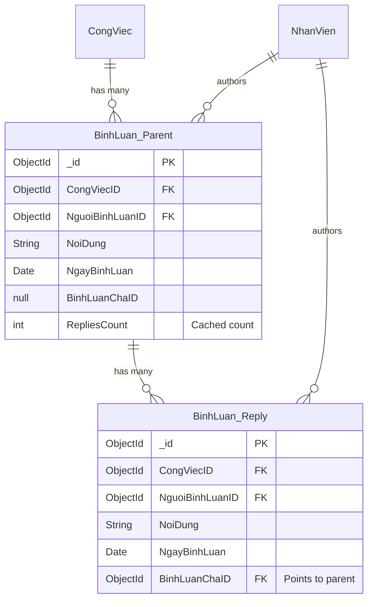
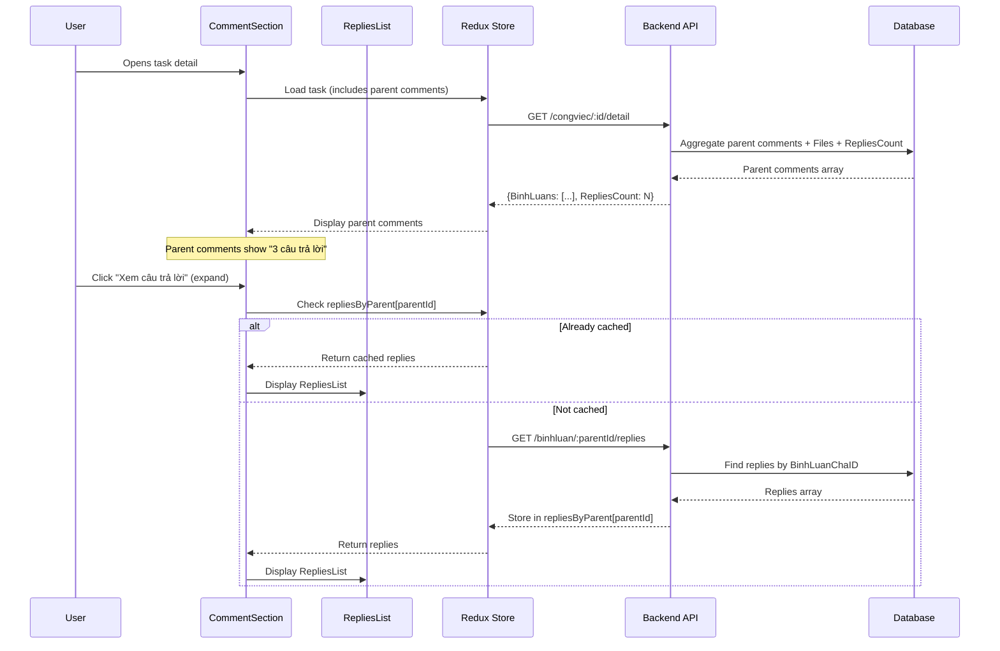

# 💬 COMMENT THREADING SYSTEM - CongViec Module

> **File**: 03_COMMENT_THREADING_SYSTEM.md  
> **Module**: QuanLyCongViec/CongViec  
> **Mục tiêu**: Hiểu hệ thống bình luận parent/reply với lazy loading và cache

---

## 📋 MỤC LỤC

1. [Tổng quan Comment System](#1-tổng-quan-comment-system)
2. [BinhLuan Model & Schema](#2-binhluan-model--schema)
3. [Parent-Reply Architecture](#3-parent-reply-architecture)
4. [Lazy Loading Mechanism](#4-lazy-loading-mechanism)
5. [Redux Cache Strategy](#5-redux-cache-strategy)
6. [Comment CRUD Operations](#6-comment-crud-operations)
7. [Recall Mechanism](#7-recall-mechanism)
8. [File Attachments](#8-file-attachments)
9. [Frontend Components](#9-frontend-components)
10. [Code References](#10-code-references)

---

## 1. TỔNG QUAN COMMENT SYSTEM

### 1.1. System Architecture

```
┌─────────────────────────────────────────────────────────┐
│           Comment Threading System Overview              │
├─────────────────────────────────────────────────────────┤
│                                                          │
│  ┌──────────────┐                                       │
│  │  Parent      │  ← Loaded immediately with task       │
│  │  Comments    │    (BinhLuanChaID = null)            │
│  │  (Root)      │                                       │
│  └──────┬───────┘                                       │
│         │                                                │
│         ├─→ Reply 1  ← Lazy loaded on demand           │
│         ├─→ Reply 2     (BinhLuanChaID = parent._id)   │
│         └─→ Reply 3     (Cached in repliesByParent)    │
│                                                          │
│  Features:                                               │
│  • Two-level threading (parent + replies, no nesting)   │
│  • Lazy loading with cache                              │
│  • File attachments per comment                         │
│  • Recall mechanism (soft delete)                       │
│  • Reply count display                                  │
└─────────────────────────────────────────────────────────┘
```

### 1.2. Design Principles

**1. Two-Level Threading Only**:

- ✅ Parent comments (BinhLuanChaID = null)
- ✅ Direct replies (BinhLuanChaID = parent.\_id)
- ❌ NO nested replies (replies to replies)

**Rationale**: Simplifies UI and prevents infinite nesting complexity

**2. Lazy Loading for Scalability**:

- Parent comments loaded with task detail
- Replies loaded on-demand when user expands
- Prevents performance issues with large comment threads

**3. Cache-First Strategy**:

- Store replies in `repliesByParent[parentId]` bucket
- Once loaded, don't reload unless forced
- Optimistic updates for new replies

**4. Soft Delete Pattern**:

- Comments marked `TrangThai = "DELETED"`
- Display as "Tin nhắn đã được thu hồi"
- Preserve data integrity (no orphaned replies)

---

## 2. BINHLUAN MODEL & SCHEMA

### 2.1. Schema Definition

**File**: `giaobanbv-be/models/BinhLuan.js` - Line 4

```javascript
const binhLuanSchema = Schema(
  {
    // ✅ Content
    NoiDung: {
      type: String,
      required: false, // ← Cho phép bình luận chỉ có file
      maxlength: 5000,
      default: "",
    },

    // ✅ Parent relationship (task OR request)
    CongViecID: {
      type: Schema.ObjectId,
      ref: "CongViec",
    },
    YeuCauID: {
      type: Schema.ObjectId,
      ref: "YeuCau",
    },

    // ✅ Author
    NguoiBinhLuanID: {
      type: Schema.ObjectId,
      required: true,
      ref: "NhanVien", // ← Ref to NhanVien (not User!)
    },

    // ✅ Reply relationship (parent comment)
    BinhLuanChaID: {
      type: Schema.ObjectId,
      ref: "BinhLuan", // ← Self-reference for threading
    },

    // ✅ Type & Status
    LoaiBinhLuan: {
      type: String,
      enum: ["COMMENT", "FEEDBACK", "QUESTION", "SOLUTION"],
      default: "COMMENT",
    },
    TrangThai: {
      type: String,
      enum: ["ACTIVE", "DELETED", "HIDDEN"],
      default: "ACTIVE",
    },

    // ✅ Timestamps
    NgayBinhLuan: {
      type: Date,
      default: Date.now,
    },
    NgayCapNhat: {
      type: Date,
    },
  },
  {
    timestamps: true, // ← Auto createdAt/updatedAt
    collection: "binhluan",
  }
);
```

### 2.2. Field Descriptions

| Field           | Type     | Required | Description                            |
| --------------- | -------- | -------- | -------------------------------------- |
| NoiDung         | String   | No       | Comment text (max 5000 chars)          |
| CongViecID      | ObjectId | No\*     | Task reference (mutually exclusive)    |
| YeuCauID        | ObjectId | No\*     | Request reference (mutually exclusive) |
| NguoiBinhLuanID | ObjectId | Yes      | Author (NhanVien ID, NOT User ID)      |
| BinhLuanChaID   | ObjectId | No       | Parent comment (null = root comment)   |
| LoaiBinhLuan    | Enum     | No       | Comment type (default: COMMENT)        |
| TrangThai       | Enum     | No       | Status (ACTIVE/DELETED/HIDDEN)         |
| NgayBinhLuan    | Date     | No       | Comment timestamp (default: now)       |
| NgayCapNhat     | Date     | No       | Last update timestamp                  |

**\* Note**: Either `CongViecID` OR `YeuCauID` must be present (not both)

### 2.3. Indexes

```javascript
// Performance indexes - Line 55
binhLuanSchema.index({ CongViecID: 1, NgayBinhLuan: -1 });
binhLuanSchema.index({ YeuCauID: 1, NgayBinhLuan: -1 });
binhLuanSchema.index({ NguoiBinhLuanID: 1 });
binhLuanSchema.index({ BinhLuanChaID: 1 }); // ← For reply lookup
binhLuanSchema.index({ TrangThai: 1 });
```

**Optimization**:

- Composite index `(CongViecID, NgayBinhLuan)` for fast parent comment retrieval
- `BinhLuanChaID` index for efficient reply queries

### 2.4. Virtual Fields

```javascript
// Virtual for replies (NOT populated by default) - Line 64
binhLuanSchema.virtual("TraLoi", {
  ref: "BinhLuan",
  localField: "_id",
  foreignField: "BinhLuanChaID",
});

// Virtual for attachments - Line 70
binhLuanSchema.virtual("TepTin", {
  ref: "TepTin",
  localField: "_id",
  foreignField: "BinhLuanID",
});
```

**⚠️ NOT USED in current implementation**:

- Virtuals require `.populate()` which defeats lazy loading
- Instead, use separate API call for replies
- Files loaded via aggregate lookup in `getCongViecDetail()`

---

## 3. PARENT-REPLY ARCHITECTURE

### 3.1. Two-Level Structure



### 3.2. Parent Comments Query

**Backend**: Loaded in `service.getCongViecDetail()` - Line 1556

```javascript
// Aggregate query với Files và RepliesCount
const commentsWithFiles = await BinhLuan.aggregate([
  {
    $match: {
      CongViecID: new mongoose.Types.ObjectId(congviecid),
      TrangThai: "ACTIVE",
      BinhLuanChaID: null,  // ← Only root comments
    },
  },
  { $sort: { NgayBinhLuan: -1, createdAt: -1 } }, // ← Newest first

  // ✅ Lookup author (NhanVien)
  {
    $lookup: {
      from: "nhanviens",
      localField: "NguoiBinhLuanID",
      foreignField: "_id",
      as: "NhanVien",
    },
  },
  { $unwind: { path: "$NhanVien", preserveNullAndEmptyArrays: true } },

  // ✅ Count replies for each parent comment
  {
    $lookup: {
      from: "binhluan",
      let: { parentId: "$_id" },
      pipeline: [
        {
          $match: {
            $expr: { $eq: ["$BinhLuanChaID", "$$parentId"] },
            TrangThai: "ACTIVE",
          },
        },
        { $count: "total" },
      ],
      as: "repliesCount",
    },
  },

  // ✅ Lookup attached files
  {
    $lookup: {
      from: "teptin",
      let: { binhLuanId: "$_id" },
      pipeline: [
        {
          $match: {
            $expr: { $eq: ["$BinhLuanID", "$$binhLuanId"] },
          },
        },
        { $sort: { NgayTaiLen: -1 } },
      ],
      as: "Files",
    },
  },

  // ✅ Project final shape
  {
    $project: {
      _id: 1,
      CongViecID: 1,
      NguoiBinhLuanID: 1,
      NoiDung: 1,
      NgayBinhLuan: 1,
      createdAt: 1,
      TrangThai: 1,
      NguoiBinhLuan: {
        Ten: { $ifNull: ["$NhanVien.Ten", "$NhanVien.HoTen"] },
      },
      Files: 1,
      repliesCount: 1,  // ← Array with [{total: N}]
    },
  },
]);

// ✅ Map to DTO
dto.BinhLuans = commentsWithFiles.map((c) => ({
  _id: String(c._id),
  CongViecID: String(c.CongViecID),
  NguoiBinhLuanID: c.NguoiBinhLuanID ? String(c.NguoiBinhLuanID) : null,
  NoiDung: c.NoiDung,
  NguoiBinhLuan: { Ten: c.NguoiBinhLuan?.Ten || "Người dùng" },
  NgayBinhLuan: c.NgayBinhLuan || c.createdAt,
  TrangThai: c.TrangThai || "ACTIVE",
  RepliesCount: c.repliesCount?.[0]?.total || 0,  // ← Extract count
  Files: [...],  // Mapped separately
}));
```

**Response Structure**:

```json
{
  "BinhLuans": [
    {
      "_id": "64f3cb6035c717ab00d75b8b",
      "CongViecID": "64f3cb6035c717ab00d75b8a",
      "NguoiBinhLuanID": "66b1dba74f79822a4752d90d",
      "NoiDung": "Đây là bình luận gốc",
      "NgayBinhLuan": "2026-01-05T10:30:00Z",
      "NguoiBinhLuan": { "Ten": "Đỗ Trung Kiên" },
      "RepliesCount": 3,
      "TrangThai": "ACTIVE",
      "Files": [...]
    }
  ]
}
```

### 3.3. Reply Comments Query

**NOT in initial load** - loaded separately via API

**Static Method**: `BinhLuan.layTraLoi()` - Line 110

```javascript
binhLuanSchema.methods.layTraLoi = function () {
  return mongoose
    .model("BinhLuan")
    .find({
      BinhLuanChaID: this._id, // ← Match parent ID
      TrangThai: "ACTIVE",
    })
    .populate("NguoiBinhLuanID", "Ten HoTen Email AnhDaiDien MaNhanVien")
    .sort({ NgayBinhLuan: 1 }); // ← Oldest first (chronological)
};
```

**⚠️ NOTE**: Parent comments sorted **newest first**, replies sorted **oldest first**

---

## 4. LAZY LOADING MECHANISM

### 4.1. Loading Flow



### 4.2. Frontend Lazy Load Implementation

**Thunk Action**: `fetchReplies()` - Line 1429

```javascript
export const fetchReplies = (parentId) => async (dispatch, getState) => {
  const state = getState();
  const bucket = state.congViec?.repliesByParent?.[parentId];

  // ✅ Check cache first
  if (bucket?.loaded && !bucket?.error) {
    return bucket.items; // ← Return cached data
  }

  // ✅ Start loading
  dispatch(slice.actions.fetchRepliesStart(parentId));

  try {
    // ✅ API call
    const res = await congViecAPI.listReplies(parentId);
    const items = res?.data?.data || [];

    // ✅ Store in cache
    dispatch(slice.actions.fetchRepliesSuccess({ parentId, items }));
    return items;
  } catch (error) {
    dispatch(
      slice.actions.fetchRepliesError({ parentId, error: error.message })
    );
    toast.error(error?.response?.data?.error?.message || error.message);
    throw error;
  }
};
```

**API Endpoint**: (Not in current routes - likely inline in controller)

```javascript
// Expected API signature:
// GET /api/workmanagement/binhluan/:parentId/replies
// Response: { success: true, data: [...replies...] }
```

### 4.3. Cache Check Logic

```javascript
// Bucket structure in Redux state
repliesByParent: {
  "<parentCommentId>": {
    items: [...],       // Reply comments array
    loading: false,     // Currently fetching?
    loaded: true,       // Has been loaded?
    error: null,        // Error message if failed
  }
}

// Cache hit condition:
const isCached = bucket?.loaded && !bucket?.error;

// If cached, skip API call and return bucket.items
```

---

## 5. REDUX CACHE STRATEGY

### 5.1. State Shape

```javascript
// congViecSlice.js - Line 57
const initialState = {
  // ... other state ...
  repliesByParent: {}, // ← Replies cache
  // Structure:
  // {
  //   "<parentId>": {
  //     items: BinhLuan[],
  //     loading: boolean,
  //     loaded: boolean,
  //     error: string | null
  //   }
  // }
};
```

### 5.2. Cache Reducers

**Start Loading** - Line 416

```javascript
fetchRepliesStart: (state, action) => {
  const parentId = action.payload;
  const existing = state.repliesByParent[parentId] || {
    items: [],
    loading: false,
    loaded: false,
    error: null,
  };
  const updated = { ...existing, loading: true, error: null };
  state.repliesByParent = {
    ...state.repliesByParent,
    [parentId]: updated,
  };
},
```

**Success** - Line 430

```javascript
fetchRepliesSuccess: (state, action) => {
  const { parentId, items } = action.payload;
  const existing = state.repliesByParent[parentId] || {
    items: [],
    loading: false,
    loaded: false,
    error: null,
  };
  const updated = {
    ...existing,
    items,            // ← Replace with fresh data
    loading: false,
    loaded: true,     // ← Mark as loaded
    error: null,
  };
  state.repliesByParent = {
    ...state.repliesByParent,
    [parentId]: updated,
  };
},
```

**Error** - Line 450

```javascript
fetchRepliesError: (state, action) => {
  const { parentId, error } = action.payload;
  const existing = state.repliesByParent[parentId] || {
    items: [],
    loading: false,
    loaded: false,
    error: null,
  };
  const updated = { ...existing, loading: false, error };
  state.repliesByParent = {
    ...state.repliesByParent,
    [parentId]: updated,
  };
},
```

### 5.3. Optimistic Updates

**Add Reply** - Line 283

```javascript
addCommentSuccess: (state, action) => {
  state.isLoading = false;
  state.error = null;
  const { congViecId, comment } = action.payload;
  const parentId = comment?.BinhLuanChaID || comment?.parentId;

  // ✅ Check if this is a reply (has parentId)
  if (parentId && parentId !== "null" && parentId !== "") {
    const existing = state.repliesByParent[parentId] || {
      items: [],
      loading: false,
      loaded: false,
      error: null,
    };

    // ✅ Prepend new reply to existing items
    const updated = {
      ...existing,
      items: [comment, ...(existing.items || [])],
      loaded: true,
      loading: false,
    };
    state.repliesByParent = {
      ...state.repliesByParent,
      [parentId]: updated,
    };

    // ✅ Increment RepliesCount in parent comment
    if (state.congViecDetail && state.congViecDetail._id === congViecId) {
      const parentComment = state.congViecDetail.BinhLuans?.find(
        (c) => c._id === parentId
      );
      if (parentComment) {
        parentComment.RepliesCount = (parentComment.RepliesCount || 0) + 1;
      }
    }
  } else {
    // ✅ This is a parent comment - add to BinhLuans
    if (state.congViecDetail && state.congViecDetail._id === congViecId) {
      state.congViecDetail.BinhLuans = state.congViecDetail.BinhLuans || [];
      state.congViecDetail.BinhLuans.unshift(comment); // ← Newest first
    }
  }
},
```

**Key Optimizations**:

1. **Immediate UI update** - No wait for refetch
2. **RepliesCount increment** - Parent shows correct count instantly
3. **Cache invalidation** - New reply added to cached bucket

### 5.4. Cache Invalidation on Recall

**Recall Comment** - Line 324

```javascript
recallCommentSuccess: (state, action) => {
  state.isLoading = false;
  state.error = null;
  const { congViecId, binhLuanId } = action.payload;

  // ✅ Update parent comments
  if (state.congViecDetail && state.congViecDetail._id === congViecId) {
    const list = state.congViecDetail.BinhLuans || [];
    const idx = list.findIndex((c) => c._id === binhLuanId);
    if (idx !== -1) {
      list[idx] = { ...list[idx], TrangThai: "DELETED", NoiDung: "" };
    }

    // ✅ Also update in repliesByParent cache
    for (const parentId of Object.keys(state.repliesByParent || {})) {
      const bucket = state.repliesByParent[parentId];
      const i = bucket?.items?.findIndex((c) => c._id === binhLuanId);
      if (i != null && i >= 0) {
        const newItems = [...bucket.items];
        newItems[i] = {
          ...newItems[i],
          TrangThai: "DELETED",
          NoiDung: "",
        };
        state.repliesByParent = {
          ...state.repliesByParent,
          [parentId]: { ...bucket, items: newItems },
        };
        break;
      }
    }
  }
},
```

**Why scan all buckets?**

- We don't know which bucket contains the recalled reply
- Must search all cached buckets to update

**Optimization opportunity**: Track `replyId -> parentId` mapping

---

## 6. COMMENT CRUD OPERATIONS

### 6.1. Create Comment

**Frontend API** (assumed from usage pattern):

```javascript
// Expected signature:
congViecAPI.addComment(congViecId, {
  NoiDung: "Comment text",
  BinhLuanChaID: null, // or parentId for reply
  files: FileList, // Optional attachments
});
```

**Backend Logic** (not in congViec.service, likely in separate comment controller):

```javascript
// Pseudo-code based on BinhLuan model
const createComment = async (req, res) => {
  const { congViecId, NoiDung, BinhLuanChaID } = req.body;
  const currentUser = await User.findById(req.userId);

  // ✅ Validate NhanVienID link
  if (!currentUser?.NhanVienID) {
    throw new AppError(400, "Tài khoản chưa liên kết với nhân viên");
  }

  // ✅ Permission check (can user comment on this task?)
  const congViec = await CongViec.findById(congViecId);
  await checkTaskViewPermission(congViec, req);

  // ✅ Create comment
  const comment = await BinhLuan.create({
    CongViecID: congViecId,
    NguoiBinhLuanID: currentUser.NhanVienID,
    NoiDung: NoiDung,
    BinhLuanChaID: BinhLuanChaID || null,
    LoaiBinhLuan: "COMMENT",
    TrangThai: "ACTIVE",
  });

  // ✅ Handle file uploads (if any)
  if (req.files?.length) {
    // Upload to Cloudinary/storage
    // Create TepTin documents with BinhLuanID
  }

  // ✅ Send notification (if not reply to own comment)
  // ... notification logic ...

  return sendResponse(res, 201, true, { comment }, null, "Đã thêm bình luận");
};
```

### 6.2. List Comments

**Parent Comments**: Included in `getCongViecDetail()` response

**Replies**: Separate endpoint (assumed):

```javascript
// GET /api/workmanagement/binhluan/:parentId/replies
const listReplies = async (req, res) => {
  const { parentId } = req.params;

  // ✅ Validate parent exists
  const parent = await BinhLuan.findById(parentId);
  if (!parent) {
    throw new AppError(404, "Không tìm thấy bình luận");
  }

  // ✅ Check permission to view parent's task
  if (parent.CongViecID) {
    const congViec = await CongViec.findById(parent.CongViecID);
    await checkTaskViewPermission(congViec, req);
  }

  // ✅ Get replies
  const replies = await BinhLuan.find({
    BinhLuanChaID: parentId,
    TrangThai: "ACTIVE",
  })
    .populate("NguoiBinhLuanID", "Ten HoTen Email AnhDaiDien MaNhanVien")
    .populate({
      path: "TepTin", // Virtual population (if used)
      match: { TrangThai: "ACTIVE" },
    })
    .sort({ NgayBinhLuan: 1 }); // ← Oldest first

  // ✅ Map to DTO
  const dto = replies.map((r) => ({
    _id: String(r._id),
    CongViecID: String(r.CongViecID),
    NguoiBinhLuanID: String(r.NguoiBinhLuanID),
    BinhLuanChaID: String(r.BinhLuanChaID),
    NoiDung: r.NoiDung,
    NgayBinhLuan: r.NgayBinhLuan,
    NguoiBinhLuan: {
      Ten: r.NguoiBinhLuanID?.Ten || "Người dùng",
    },
    Files: r.TepTin || [],
  }));

  return sendResponse(res, 200, true, dto, null, "Success");
};
```

### 6.3. Update Comment

**Permission**: Only author can update (no Admin override)

```javascript
binhLuanSchema.methods.coTheCapNhat = function (nhanVienId) {
  // Chỉ người tạo comment mới có thể cập nhật
  return this.NguoiBinhLuanID.toString() === nhanVienId.toString();
};
```

**Usage**:

```javascript
const updateComment = async (req, res) => {
  const { commentId } = req.params;
  const { NoiDung } = req.body;

  const comment = await BinhLuan.findById(commentId);
  if (!comment) throw new AppError(404, "Không tìm thấy bình luận");

  const currentUser = await User.findById(req.userId);
  if (!comment.coTheCapNhat(currentUser.NhanVienID)) {
    throw new AppError(403, "Bạn không có quyền chỉnh sửa bình luận này");
  }

  comment.NoiDung = NoiDung;
  comment.NgayCapNhat = new Date();
  await comment.save();

  return sendResponse(res, 200, true, { comment }, null, "Đã cập nhật");
};
```

### 6.4. Delete Comment

**Permission**: Author OR Admin/Manager

```javascript
binhLuanSchema.methods.coTheXoa = function (nhanVienId, vaiTro) {
  const vaiTroNormalized = vaiTro ? vaiTro.toLowerCase() : "";
  return (
    this.NguoiBinhLuanID.toString() === nhanVienId.toString() ||
    ["admin", "manager", "superadmin"].includes(vaiTroNormalized)
  );
};
```

**Soft Delete Method**:

```javascript
binhLuanSchema.methods.xoa = function () {
  this.TrangThai = "DELETED";
  this.NgayCapNhat = new Date();
  return this.save();
};
```

---

## 7. RECALL MECHANISM

### 7.1. Two Recall Modes

**Mode 1: Recall All (Text + Files)**

```javascript
// Frontend: congViecSlice.js - Line ~324
recallCommentSuccess: (state, action) => {
  const { congViecId, binhLuanId } = action.payload;

  // ✅ Mark comment as DELETED
  // Update NoiDung to empty string
  comment.TrangThai = "DELETED";
  comment.NoiDung = "";

  // Display: "Tin nhắn đã được thu hồi"
};
```

**Backend**: `BinhLuan.softDeleteWithFiles()` - Line 123

```javascript
binhLuanSchema.statics.softDeleteWithFiles = async function (binhLuanId) {
  const TepTin = mongoose.model("TepTin");

  // ✅ Soft delete comment
  await this.updateOne(
    { _id: binhLuanId },
    { $set: { TrangThai: "DELETED", NgayCapNhat: new Date() } }
  );

  // ✅ Cascade soft delete all attached files
  await TepTin.updateMany(
    { BinhLuanID: binhLuanId },
    { $set: { TrangThai: "DELETED" } }
  );
};
```

**Mode 2: Recall Text Only (Keep Files)**

```javascript
// Frontend: congViecSlice.js - Line ~355
recallCommentTextSuccess: (state, action) => {
  const { congViecId, binhLuanId } = action.payload;

  // ✅ Clear NoiDung only, keep TrangThai = "ACTIVE"
  comment.NoiDung = "";

  // Display: Empty text bubble, files still visible
};
```

**Backend**: Simple update (no model method):

```javascript
const recallCommentText = async (req, res) => {
  const { commentId } = req.params;
  const comment = await BinhLuan.findById(commentId);

  // ✅ Permission check
  const currentUser = await User.findById(req.userId);
  if (!comment.coTheXoa(currentUser.NhanVienID, currentUser.PhanQuyen)) {
    throw new AppError(403, "Bạn không có quyền thu hồi bình luận này");
  }

  // ✅ Clear text only
  comment.NoiDung = "";
  comment.NgayCapNhat = new Date();
  await comment.save();

  return sendResponse(res, 200, true, { comment }, null, "Đã thu hồi nội dung");
};
```

### 7.2. Permission Check

**Who can recall?**

- ✅ Comment author (always)
- ✅ Admin/Manager (can recall any comment)

```javascript
// Check in frontend before showing recall button
const canRecall = (user, comment) => {
  const isAdmin = ["admin", "superadmin", "manager"].includes(
    user?.PhanQuyen?.toLowerCase()
  );
  const isAuthor = user?.NhanVienID === comment?.NguoiBinhLuanID;

  return isAdmin || isAuthor;
};
```

### 7.3. Cascade Delete on Task Delete

**When task is deleted**, all comments cascade soft-delete:

```javascript
// service.deleteCongViec() - Line 1357
// Step 1: Get root comments
const comments = await BinhLuan.find({
  CongViecID: congviecid,
  TrangThai: { $ne: "DELETED" },
})
  .select("_id")
  .lean();

const commentIds = comments.map((c) => c._id);

// Step 2: Get all replies
const replies = await BinhLuan.find({
  BinhLuanChaID: { $in: commentIds },
  TrangThai: { $ne: "DELETED" },
})
  .select("_id")
  .lean();

const replyIds = replies.map((r) => r._id);

// Step 3: Combine and soft delete
const allCommentIds = [...commentIds, ...replyIds];
const commentUpdate = await BinhLuan.updateMany(
  { _id: { $in: allCommentIds } },
  { $set: { TrangThai: "DELETED", NgayCapNhat: new Date() } }
);

// Step 4: Also cascade delete comment files
await TepTin.updateMany(
  { BinhLuanID: { $in: allCommentIds }, TrangThai: { $ne: "DELETED" } },
  { $set: { TrangThai: "DELETED" } }
);
```

**Why cascade replies?**

- Prevent orphaned replies (replies to deleted comments)
- Maintain data integrity

---

## 8. FILE ATTACHMENTS

### 8.1. File Relationship

```
TepTin (File) Model:
  BinhLuanID: ObjectId  ← Links to comment
  CongViecID: ObjectId  ← Also stores task ID for indexing
  NguoiTaiLenID: ObjectId
  TrangThai: "ACTIVE" | "DELETED"
```

**Note**: Files can belong to:

- **Comment** (`BinhLuanID` set)
- OR **Task directly** (`BinhLuanID` null, `CongViecID` set)

### 8.2. File Loading Strategy

**Parent Comments**: Files loaded with comment in aggregate query - Line 1584

```javascript
{
  $lookup: {
    from: "teptin",
    let: { binhLuanId: "$_id" },
    pipeline: [
      {
        $match: {
          $expr: { $eq: ["$BinhLuanID", "$$binhLuanId"] },
        },
      },
      { $sort: { NgayTaiLen: -1 } },
    ],
    as: "Files",
  },
},
```

**Replies**: Files NOT loaded by default - need separate query OR populate

**Current implementation**: Likely loaded when replies are fetched

### 8.3. File Display in UI

**Images**: Thumbnail preview with click to enlarge

```javascript
// RepliesList.js - Line ~134
if (isImage) {
  return (
    <Box
      sx={{ width: 140, height: 100, position: "relative" }}
      onClick={() => onViewFile(f)}
    >
      
      {canDeleteFile && (
        <Box sx={{ position: "absolute", top: 4, right: 4 }}>Xóa</Box>
      )}
    </Box>
  );
}
```

**PDFs**: Chip with filename, click to view

```javascript
if (isPdf) {
  return (
    <Chip
      label={f.TenGoc}
      variant="outlined"
      onClick={() => onViewFile(f)}
      sx={{ maxWidth: 220 }}
    />
  );
}
```

**Deleted Files**: Show placeholder

```javascript
if (f.TrangThai === "DELETED") {
  return (
    <Chip
      label="Tệp đã được thu hồi"
      variant="outlined"
      sx={{ fontStyle: "italic", opacity: 0.8, pointerEvents: "none" }}
    />
  );
}
```

### 8.4. File Permissions

**View/Download**: Same as comment view permission

- If you can see comment, you can see files

**Delete**: Only uploader OR Admin

```javascript
// filePermissions.js
function canDeleteFile(fileDoc, nhanVienId, isAdmin = false) {
  if (isAdmin) return true; // ← Admin can delete any file

  // ← Only uploader can delete their own files
  return String(fileDoc.NguoiTaiLenID) === String(nhanVienId || "");
}
```

**Frontend UI**:

```javascript
// Only show delete button if permission granted
{
  canDeleteFile && (
    <Box
      onClick={(e) => {
        e.stopPropagation();
        openConfirm("deleteFile", { file: f });
      }}
    >
      Xóa
    </Box>
  );
}
```

---

## 9. FRONTEND COMPONENTS

### 9.1. Component Hierarchy

```
CongViecDetailDialog
  └─ CommentSection (embedded)
       ├─ CommentInput (add parent comment)
       └─ BinhLuanList
            ├─ BinhLuanItem (parent comment)
            │    ├─ Avatar + Name + Date
            │    ├─ NoiDung (text bubble)
            │    ├─ Files (attachments)
            │    ├─ RecallButton (if canRecall)
            │    └─ ExpandRepliesButton ("3 câu trả lời")
            └─ RepliesList (lazy loaded)
                 └─ BinhLuanItem (reply)
                      ├─ Avatar + Name + Date
                      ├─ NoiDung (text bubble)
                      ├─ Files (attachments)
                      └─ RecallButton (if canRecall)
```

### 9.2. RepliesList Component

**File**: `RepliesList.js` - Line 1

```javascript
const RepliesList = React.memo(
  ({
    theme,
    replies, // ← Array of reply comments
    user, // ← Current user (for permission check)
    canRecall, // ← Permission check function
    canRecallText, // ← Permission check function (text only)
    onRecallComment, // ← Handler for recall all
    onRecallCommentText, // ← Handler for recall text only
    onViewFile, // ← Handler for file preview
    onDownloadFile, // ← Handler for file download
    onDeleteFile, // ← Handler for file delete
    openConfirm, // ← Confirmation dialog opener
    formatDateTime, // ← Date formatter
  }) => {
    return (
      <Box sx={{ pl: 6, pt: 1 }}>
        {" "}
        {/* ← Indented for visual hierarchy */}
        {replies.map((rep) => (
          <Box key={rep._id} sx={{ mb: 1 }}>
            <Stack spacing={0.5}>
              {/* Author info */}
              <Box sx={{ display: "flex", alignItems: "center", gap: 1 }}>
                <EmployeeAvatar size="xs" sx={{ width: 28, height: 28 }} />
                <Typography variant="subtitle2">
                  {rep.NguoiBinhLuan?.Ten || "Người dùng"}
                </Typography>
                <Typography variant="caption" color="text.secondary">
                  {formatDateTime(rep.NgayBinhLuan || rep.createdAt)}
                </Typography>

                {/* Recall button (if permitted) */}
                {canRecall(user, rep) && (
                  <Tooltip title="Thu hồi bình luận">
                    <IconButton
                      size="small"
                      color="warning"
                      onClick={() =>
                        openConfirm("recallAll", { commentId: rep._id })
                      }
                    >
                      <UndoIcon fontSize="small" />
                    </IconButton>
                  </Tooltip>
                )}
              </Box>

              {/* Content or recall placeholder */}
              {rep.TrangThai === "DELETED" ? (
                <Typography
                  variant="body1"
                  color="text.secondary"
                  sx={{ fontStyle: "italic" }}
                >
                  Tin nhắn đã được thu hồi
                </Typography>
              ) : (
                <>
                  {/* Text content */}
                  {!!rep.NoiDung && (
                    <Paper variant="outlined" sx={{ px: 1.5, py: 1, pr: 4 }}>
                      <Typography variant="body1">{rep.NoiDung}</Typography>

                      {/* Recall text only button */}
                      {onRecallCommentText && canRecallText(user, rep) && (
                        <Tooltip title="Thu hồi nội dung (chỉ xóa text, giữ tệp)">
                          <IconButton
                            size="small"
                            onClick={(e) => {
                              e.stopPropagation();
                              openConfirm("recallText", { commentId: rep._id });
                            }}
                            sx={{ position: "absolute", top: 4, right: 4 }}
                          >
                            <FormatClearIcon fontSize="small" />
                          </IconButton>
                        </Tooltip>
                      )}
                    </Paper>
                  )}

                  {/* File attachments */}
                  {!!(rep.Files && rep.Files.length) && (
                    <Stack direction="row" spacing={1} flexWrap="wrap">
                      {rep.Files.map((f) => {
                        if (f.TrangThai === "DELETED") {
                          return <Chip label="Tệp đã được thu hồi" />;
                        }
                        // ... image/pdf rendering ...
                      })}
                    </Stack>
                  )}
                </>
              )}
            </Stack>
          </Box>
        ))}
      </Box>
    );
  }
);
```

**Props Interface**:

```typescript
interface RepliesListProps {
  theme: Theme;
  replies: BinhLuan[];
  user: User;
  canRecall: (user: User, comment: BinhLuan) => boolean;
  canRecallText: (user: User, comment: BinhLuan) => boolean;
  onRecallComment: (commentId: string) => void;
  onRecallCommentText: (commentId: string) => void;
  onViewFile: (file: TepTin) => void;
  onDownloadFile: (file: TepTin) => void;
  onDeleteFile: (file: TepTin) => void;
  openConfirm: (action: string, data: any) => void;
  formatDateTime: (date: Date) => string;
}
```

### 9.3. Expand/Collapse Behavior

**Parent Comment Footer**:

```javascript
// Show expand button if RepliesCount > 0
{
  comment.RepliesCount > 0 && (
    <Button
      size="small"
      onClick={() => handleToggleReplies(comment._id)}
      startIcon={isExpanded ? <ExpandLessIcon /> : <ExpandMoreIcon />}
    >
      {isExpanded
        ? "Ẩn câu trả lời"
        : `Xem ${comment.RepliesCount} câu trả lời`}
    </Button>
  );
}
```

**Toggle Handler**:

```javascript
const [expandedReplies, setExpandedReplies] = useState(new Set());

const handleToggleReplies = async (parentId) => {
  const isExpanded = expandedReplies.has(parentId);

  if (isExpanded) {
    // ✅ Collapse - just remove from Set
    setExpandedReplies((prev) => {
      const next = new Set(prev);
      next.delete(parentId);
      return next;
    });
  } else {
    // ✅ Expand - fetch replies if not cached
    await dispatch(fetchReplies(parentId));
    setExpandedReplies((prev) => new Set([...prev, parentId]));
  }
};
```

**Conditional Rendering**:

```javascript
{
  expandedReplies.has(comment._id) && (
    <RepliesList
      replies={repliesByParent[comment._id]?.items || []}
      // ... other props ...
    />
  );
}
```

---

## 10. CODE REFERENCES

### 10.1. Backend Files

| File                  | Lines     | Description                              |
| --------------------- | --------- | ---------------------------------------- |
| `BinhLuan.js`         | 4-55      | Schema definition with indexes           |
| `BinhLuan.js`         | 64-76     | Virtual fields (TraLoi, TepTin)          |
| `BinhLuan.js`         | 78-89     | Instance methods (xoa, an, coTheCapNhat) |
| `BinhLuan.js`         | 91-96     | coTheXoa method (permission check)       |
| `BinhLuan.js`         | 98-110    | layTraLoi method (get replies)           |
| `BinhLuan.js`         | 115-123   | softDeleteWithFiles static method        |
| `BinhLuan.js`         | 125-151   | timTheoCongViec static method (parents)  |
| `congViec.service.js` | 1516-1650 | getCongViecDetail - aggregate query      |
| `congViec.service.js` | 1357-1400 | deleteCongViec - cascade comments        |

### 10.2. Frontend Files

| File               | Lines     | Description                       |
| ------------------ | --------- | --------------------------------- |
| `congViecSlice.js` | 57        | repliesByParent initial state     |
| `congViecSlice.js` | 283-319   | addCommentSuccess reducer         |
| `congViecSlice.js` | 324-353   | recallCommentSuccess reducer      |
| `congViecSlice.js` | 355-380   | recallCommentTextSuccess reducer  |
| `congViecSlice.js` | 416-428   | fetchRepliesStart reducer         |
| `congViecSlice.js` | 430-448   | fetchRepliesSuccess reducer       |
| `congViecSlice.js` | 450-461   | fetchRepliesError reducer         |
| `congViecSlice.js` | 1429-1448 | fetchReplies thunk action         |
| `RepliesList.js`   | 1-239     | RepliesList component (full file) |

### 10.3. Permission Check Summary

**Can Create Comment**:

```javascript
// Anyone with task view permission can comment
await checkTaskViewPermission(congViec, req);
```

**Can Update Comment**:

```javascript
// Only author
comment.coTheCapNhat(currentUser.NhanVienID);
```

**Can Delete/Recall Comment**:

```javascript
// Author OR Admin/Manager
comment.coTheXoa(currentUser.NhanVienId, currentUser.PhanQuyen);
```

**Can Delete File**:

```javascript
// Uploader OR Admin
canDeleteFile(fileDoc, currentUser.NhanVienId, isAdmin);
```

---

## 📊 SUMMARY

### Checklist để hiểu Comment System

- [ ] Hiểu two-level threading (parent + replies, no nesting)
- [ ] Nắm lazy loading pattern (parent first, replies on demand)
- [ ] Biết cache strategy (`repliesByParent` bucket structure)
- [ ] Hiểu BinhLuanChaID relationship (null = parent, ID = reply)
- [ ] Nắm aggregation query cho parent comments + Files + RepliesCount
- [ ] Biết optimistic updates (addCommentSuccess increments RepliesCount)
- [ ] Hiểu recall mechanism (soft delete vs text-only recall)
- [ ] Nắm file attachment relationship (BinhLuanID field)
- [ ] Biết permission checks (coTheCapNhat, coTheXoa)
- [ ] Hiểu cascade deletion on task delete

### Key Takeaways

1. **Two-level only** - No nested replies for simplicity
2. **Lazy loading** - Replies fetched on expand to optimize performance
3. **Cache-first** - Replies stored in Redux bucket, no refetch
4. **Optimistic UI** - New replies appear instantly + RepliesCount updates
5. **Soft delete** - Comments marked DELETED, display placeholder
6. **Permission-aware** - Only author/admin can recall
7. **File support** - Images/PDFs attached per comment
8. **Cascade delete** - Task delete removes all comments + replies + files

### Performance Optimizations

✅ **Parent comments loaded once** with task detail  
✅ **Replies lazy loaded** only when expanded  
✅ **Cache prevents redundant API calls**  
✅ **Aggregate query** reduces N+1 queries  
✅ **Indexes on CongViecID + BinhLuanChaID**  
✅ **Optimistic updates** for instant UI feedback  
✅ **Virtual fields NOT used** (prevent populate overhead)

### Common Pitfalls

❌ **Populate virtuals** - Defeats lazy loading purpose  
❌ **Forget RepliesCount increment** - UI shows stale count  
❌ **Hard delete comments** - Orphans replies  
❌ **Not cascade on task delete** - Orphaned data  
❌ **Use User.\_id instead of NhanVienID** - Wrong context  
❌ **Allow nested replies** - UI complexity explosion

---

**Next**: [04_FILE_MANAGEMENT.md](./04_FILE_MANAGEMENT.md) - Task files vs comment files, storage, access control

---

**Ngày tạo**: 5/1/2026  
**Phiên bản**: 1.0  
**Tác giả**: Documentation Team
