# 📎 FILE MANAGEMENT - CongViec Module

> **File**: 04_FILE_MANAGEMENT.md  
> **Module**: QuanLyCongViec/CongViec  
> **Mục tiêu**: Hiểu hệ thống quản lý file attachments cho tasks và comments

---

## 📋 MỤC LỤC

1. [Tổng quan File System](#1-tổng-quan-file-system)
2. [TepTin Model & Schema](#2-teptin-model--schema)
3. [File Categorization](#3-file-categorization)
4. [Storage Architecture](#4-storage-architecture)
5. [Upload Flow](#5-upload-flow)
6. [Download & Streaming](#6-download--streaming)
7. [File Permissions](#7-file-permissions)
8. [Soft Delete Pattern](#8-soft-delete-pattern)
9. [Notification Integration](#9-notification-integration)
10. [Code References](#10-code-references)

---

## 1. TỔNG QUAN FILE SYSTEM

### 1.1. System Architecture

```
┌─────────────────────────────────────────────────────────┐
│              File Management Overview                    │
├─────────────────────────────────────────────────────────┤
│                                                          │
│  ┌──────────────┐           ┌──────────────┐           │
│  │ Task Files   │           │Comment Files │           │
│  │              │           │              │           │
│  │ CongViecID   │           │ BinhLuanID   │           │
│  │ BinhLuanID=  │           │ CongViecID   │           │
│  │    null      │           │    (copy)    │           │
│  └──────┬───────┘           └──────┬───────┘           │
│         │                          │                    │
│         └──────────┬───────────────┘                    │
│                    ↓                                     │
│           ┌─────────────────┐                           │
│           │   TepTin Model  │                           │
│           │   (Unified)     │                           │
│           └─────────────────┘                           │
│                    │                                     │
│         ┌──────────┼──────────┐                        │
│         ↓          ↓          ↓                        │
│    ┌────────┐ ┌────────┐ ┌────────┐                  │
│    │ Disk   │ │ Multer │ │ Sharp  │                  │
│    │Storage │ │Upload  │ │Thumb   │                  │
│    └────────┘ └────────┘ └────────┘                  │
│                                                          │
│  Features:                                               │
│  • Unified storage model (TepTin)                       │
│  • Separate folders (task vs comment)                   │
│  • Local disk storage (no Cloudinary)                   │
│  • Thumbnail generation (Sharp)                         │
│  • Soft delete (TrangThai = DELETED)                    │
│  • Permission-based access control                      │
└─────────────────────────────────────────────────────────┘
```

### 1.2. Design Principles

**1. Unified Model**:

- Single `TepTin` model cho tất cả file types
- Flexible linking: CongViec, YeuCau, BinhLuan
- Generic OwnerType/OwnerID fields for future extensions

**2. Disk-Based Storage**:

- ✅ NO Cloudinary (unlike patient images in other modules)
- ✅ Local disk với organized folder structure
- ✅ Relative paths for portability

**3. File Categorization**:

- Task files: `BinhLuanID = null, CongViecID = set`
- Comment files: `BinhLuanID = set, CongViecID = copy`
- Physical separation in folder structure

**4. Security Layers**:

- Authentication required (except thumbnail endpoint)
- Task permission checks (canAccessCongViec)
- Uploader/Admin-only deletion

---

## 2. TEPTIN MODEL & SCHEMA

### 2.1. Schema Definition

**File**: `giaobanbv-be/models/TepTin.js` - Line 4

```javascript
const tepTinSchema = Schema(
  {
    // ✅ File metadata
    TenFile: {
      type: String,
      required: true,
      maxlength: 255, // Unique filename on disk
    },
    TenGoc: {
      type: String,
      required: true,
      maxlength: 255, // Original uploaded filename (UTF-8)
    },
    LoaiFile: {
      type: String,
      required: true,
      maxlength: 100, // MIME type (image/jpeg, application/pdf, etc.)
    },
    KichThuoc: {
      type: Number,
      required: true,
      min: 0, // Bytes
    },
    DuongDan: {
      type: String,
      required: true,
      maxlength: 500, // Relative path from UPLOAD_DIR
    },

    // ✅ Generic owner system (for future expansion)
    OwnerType: {
      type: String,
      maxlength: 100,
      default: null, // "CongViec", "YeuCau", "BinhLuan", etc.
    },
    OwnerID: {
      type: String,
      maxlength: 100,
      default: null, // ObjectId as string
    },
    OwnerField: {
      type: String,
      maxlength: 100,
      default: "default", // Field name for multi-field attachments
    },

    // ✅ Specific entity references (legacy, still used)
    CongViecID: {
      type: Schema.ObjectId,
      ref: "CongViec",
    },
    YeuCauID: {
      type: Schema.ObjectId,
      ref: "YeuCau",
    },
    BinhLuanID: {
      type: Schema.ObjectId,
      ref: "BinhLuan", // ← Links to comment
    },

    // ✅ Uploader & metadata
    NguoiTaiLenID: {
      type: Schema.ObjectId,
      required: true,
      ref: "NhanVien", // ← NOT User!
    },
    MoTa: {
      type: String,
      maxlength: 1000,
    },

    // ✅ Soft delete
    TrangThai: {
      type: String,
      enum: ["ACTIVE", "DELETED"],
      default: "ACTIVE",
    },
    NgayTaiLen: {
      type: Date,
      default: Date.now,
    },
  },
  {
    timestamps: true, // Auto createdAt/updatedAt
    collection: "teptin",
  }
);
```

### 2.2. Field Descriptions

| Field         | Type     | Required | Description                                 |
| ------------- | -------- | -------- | ------------------------------------------- |
| TenFile       | String   | Yes      | Unique filename on disk (timestamp + hash)  |
| TenGoc        | String   | Yes      | Original filename from user (UTF-8 decoded) |
| LoaiFile      | String   | Yes      | MIME type (auto-detected from extension)    |
| KichThuoc     | Number   | Yes      | File size in bytes                          |
| DuongDan      | String   | Yes      | Relative path from UPLOAD_DIR               |
| CongViecID    | ObjectId | No       | Task reference (if task file)               |
| YeuCauID      | ObjectId | No       | Request reference (if request file)         |
| BinhLuanID    | ObjectId | No       | Comment reference (if comment file)         |
| NguoiTaiLenID | ObjectId | Yes      | Uploader (NhanVien ID, NOT User ID)         |
| MoTa          | String   | No       | Optional description                        |
| TrangThai     | Enum     | No       | ACTIVE / DELETED (soft delete)              |
| NgayTaiLen    | Date     | No       | Upload timestamp (default: now)             |

### 2.3. Indexes

```javascript
// Performance indexes - Line 90
tepTinSchema.index({ CongViecID: 1 });
tepTinSchema.index({ YeuCauID: 1, TrangThai: 1, NgayTaiLen: -1 });
tepTinSchema.index({ NguoiTaiLenID: 1 });
tepTinSchema.index({ NgayTaiLen: -1 });
tepTinSchema.index({ TrangThai: 1 });
tepTinSchema.index({ BinhLuanID: 1 }); // ← For comment files

// Generic owner indexes (future)
tepTinSchema.index({ OwnerType: 1, OwnerID: 1 });
tepTinSchema.index({
  OwnerType: 1,
  OwnerID: 1,
  OwnerField: 1,
  TrangThai: 1,
  NgayTaiLen: -1,
});

// Composite for most common query
tepTinSchema.index({ CongViecID: 1, TrangThai: 1, NgayTaiLen: -1 });
```

**Query Optimization**:

- Task file list: Uses `(CongViecID, TrangThai, NgayTaiLen)` composite
- Comment file list: Uses `BinhLuanID` index

### 2.4. Virtual Fields

```javascript
// Virtual for formatted file size - Line 109
tepTinSchema.virtual("KichThuocFormat").get(function () {
  const size = this.KichThuoc;
  if (size < 1024) return size + " B";
  if (size < 1024 * 1024) return (size / 1024).toFixed(2) + " KB";
  if (size < 1024 * 1024 * 1024)
    return (size / (1024 * 1024)).toFixed(2) + " MB";
  return (size / (1024 * 1024 * 1024)).toFixed(2) + " GB";
});

// Virtual for file extension - Line 118
tepTinSchema.virtual("DuoiFile").get(function () {
  return this.TenGoc.split(".").pop().toLowerCase();
});
```

**NOT used in current API responses** - Calculations done on frontend if needed

### 2.5. Auto MIME Type Detection

```javascript
// Pre-save middleware - Line 219
tepTinSchema.pre("save", function (next) {
  if (!this.LoaiFile && this.TenGoc) {
    const extension = this.TenGoc.split(".").pop().toLowerCase();
    const imageTypes = ["jpg", "jpeg", "png", "gif", "bmp", "svg"];
    const documentTypes = ["pdf", "doc", "docx", "xls", "xlsx", "ppt", "pptx"];
    const videoTypes = ["mp4", "avi", "mov", "wmv", "flv", "mkv"];
    const audioTypes = ["mp3", "wav", "flac", "aac", "ogg"];

    if (imageTypes.includes(extension)) {
      this.LoaiFile = "image";
    } else if (documentTypes.includes(extension)) {
      this.LoaiFile = "document";
    } else if (videoTypes.includes(extension)) {
      this.LoaiFile = "video";
    } else if (audioTypes.includes(extension)) {
      this.LoaiFile = "audio";
    } else {
      this.LoaiFile = "other";
    }
  }
  next();
});
```

**Fallback mechanism**: Nếu MIME type không set, auto-detect từ extension

---

## 3. FILE CATEGORIZATION

### 3.1. Task Files vs Comment Files

```mermaid
erDiagram
    CongViec ||--o{ TepTin_Task : "has task files"
    CongViec ||--o{ BinhLuan : "has comments"
    BinhLuan ||--o{ TepTin_Comment : "has comment files"

    TepTin_Task {
        ObjectId CongViecID FK
        null BinhLuanID
        String DuongDan "uploads/congviec/{id}/YYYY/MM/"
    }

    TepTin_Comment {
        ObjectId CongViecID FK "← Copied for indexing"
        ObjectId BinhLuanID FK "← Link to comment"
        String DuongDan "uploads/congviec/{id}/comments/{commentId}/"
    }
```



### 3.2. Identification Rules

**Task File**:

```javascript
// BinhLuanID = null OR undefined
{
  CongViecID: "64f3cb6035c717ab00d75b8a",
  BinhLuanID: null,  // ← No comment link
  DuongDan: "congviec/64f3cb6035c717ab00d75b8a/2026/01/..."
}
```

**Comment File**:

```javascript
// BinhLuanID set, CongViecID copied
{
  CongViecID: "64f3cb6035c717ab00d75b8a",  // ← Copied for queries
  BinhLuanID: "64f3cb6035c717ab00d75b8b", // ← Comment link
  DuongDan: "congviec/64f3cb6035c717ab00d75b8a/comments/64f3cb6035c717ab00d75b8b/2026/01/..."
}
```

**Why copy CongViecID for comment files?**

- ✅ Faster queries: List all files for task (includes task + comment files)
- ✅ Permission checks: Use CongViecID directly without JOIN
- ✅ Cascade delete: Easy to find all files when task deleted

### 3.3. Query Patterns

**List Task Files Only**:

```javascript
// service.listByTask() - Line 342
TepTin.find({
  CongViecID: congViecId,
  TrangThai: "ACTIVE",
  // NO BinhLuanID filter - includes ALL task-related files
});
```

**List Comment Files Only**:

```javascript
// service.listByComment() - Line 356
TepTin.find({
  BinhLuanID: binhLuanId,
  TrangThai: "ACTIVE",
});
```

**List ALL Files (Task + Comments)**:

```javascript
// Used in detail view - aggregate query in getCongViecDetail()
TepTin.find({
  CongViecID: congViecId,
  TrangThai: "ACTIVE",
  // NO BinhLuanID filter - includes task files AND comment files
});
```

---

## 4. STORAGE ARCHITECTURE

### 4.1. Folder Structure

```
UPLOAD_DIR/
├── congviec/
│   └── {CongViecID}/
│       ├── 2026/                     ← Task files organized by date
│       │   ├── 01/
│       │   │   └── {timestamp}-{hash}-{name}.ext
│       │   └── 02/
│       │       └── {timestamp}-{hash}-{name}.ext
│       └── comments/                 ← Comment files in subfolders
│           └── {BinhLuanID}/
│               └── 2026/
│                   └── 01/
│                       └── {timestamp}-{hash}-{name}.ext
├── yeucau/                           ← Request module (separate)
│   └── {YeuCauID}/...
└── attachments/                      ← Generic owner system (future)
    └── {ownerType}/
        └── {ownerId}/
            └── {field}/...
```

**Benefits**:

- ✅ Physical separation prevents accidental conflicts
- ✅ Easy backup/restore by entity ID
- ✅ Date-based organization for archival
- ✅ Easy to locate files manually

### 4.2. Filename Generation

**Algorithm**: `upload.middleware.js` - Line 93

```javascript
const filename = async (req, file, cb) => {
  // ✅ Step 1: Decode UTF-8 (handle Vietnamese names)
  const originalUtf8 = decodeOriginalNameToUtf8(file.originalname || "file");

  // ✅ Step 2: Extract extension and base name
  const ext = path.extname(originalUtf8) || "";
  const base = path.basename(originalUtf8, ext) || "file";

  // ✅ Step 3: Generate unique prefix
  const unique = `${Date.now()}-${shortId(6)}`; // e.g., 1735980123456-a3f9b2

  // ✅ Step 4: Sanitize base name (keep Unicode, remove dangerous chars)
  const safeBase = (sanitize(base).trim() || "file")
    .slice(0, 160) // Limit length
    .replace(/\s+/g, "-"); // Replace spaces with dash

  // ✅ Step 5: Combine
  const safeExt = sanitize(ext) || "";
  const finalName = `${unique}-${safeBase}${safeExt}`;

  cb(null, finalName);
};

// Example outputs:
// "1735980123456-a3f9b2-bao-cao-tuan.pdf"
// "1735980123456-a3f9b2-hinh-anh-benh-nhan.jpg"
```

**Design Goals**:

- ✅ Unique: Timestamp + random hash prevents collisions
- ✅ Vietnamese support: Preserve Unicode characters
- ✅ Security: Sanitize dangerous chars (path traversal prevention)
- ✅ Readable: Original name included for debugging

### 4.3. Path Storage Strategy

**Relative Paths** (current implementation):

```javascript
// service.uploadForTask() - Line 144
let relPath;
try {
  const root = path.resolve(config.UPLOAD_DIR);
  const abs = path.resolve(f.path);
  const candidate = path.relative(root, abs);

  // ✅ Store relative path if valid
  relPath =
    candidate && !candidate.startsWith("..")
      ? candidate
      : f.filename || path.basename(abs);
} catch {
  relPath = f.filename || path.basename(f.path);
}

// Stored in DB:
// DuongDan: "congviec/64f3cb6035c717ab00d75b8a/2026/01/1735980123456-a3f9b2-file.pdf"
```

**Why relative paths?**

- ✅ **Portability**: Move UPLOAD_DIR without DB migration
- ✅ **Docker-friendly**: Different mount points in containers
- ✅ **Backup/restore**: Simpler path reconstruction

**Reconstruction**:

```javascript
// When streaming file
const fullPath = path.join(config.UPLOAD_DIR, doc.DuongDan);
```

---

## 5. UPLOAD FLOW

### 5.1. Complete Upload Sequence

```mermaid
sequenceDiagram
    participant C as Client
    participant M as Multer
    participant V as Magic Validator
    participant S as File Service
    participant DB as Database
    participant FS as FileSystem
    participant N as Notification

    C->>M: POST /congviec/:id/files<br/>(multipart/form-data)
    M->>M: Check MIME type whitelist
    alt Invalid MIME
        M-->>C: 400 "Loại file không được phép"
    end

    M->>FS: Write to disk<br/>(organized by date)
    M->>V: verifyMagicAndTotalSize()
    V->>FS: Read file magic bytes
    V->>V: Detect actual file type
    alt Magic mismatch
        V->>FS: Delete uploaded file
        V-->>C: 400 "File không đúng định dạng"
    end

    V->>S: uploadForTask()
    S->>DB: Check task exists & permission
    alt No permission
        S-->>C: 403 "Không có quyền"
    end

    S->>DB: Create TepTin document
    DB-->>S: File metadata
    S->>S: Populate uploader (NhanVien)
    S->>N: Fire notification<br/>(congviec-upload-file)
    S-->>C: 201 { files: [...] }
```



### 5.2. Backend Upload Implementation

**Controller**: `file.controller.js` - Line 6

```javascript
controller.uploadForTask = catchAsync(async (req, res) => {
  const { congViecId } = req.params;
  const { moTa } = req.body || {};

  // ✅ Delegate to service
  const dtos = await fileService.uploadForTask(
    congViecId,
    req.files || [], // ← Multer array
    { moTa },
    req
  );

  return sendResponse(res, 201, true, dtos, null, "Tải tệp thành công");
});
```

**Service**: `file.service.js` - Line 122

```javascript
service.uploadForTask = async (
  congViecId,
  files,
  { moTa },
  req,
  binhLuanId = null // ← Optional: for comment files
) => {
  // ✅ 1. Validate task exists & user has permission
  if (!mongoose.Types.ObjectId.isValid(congViecId))
    throw new AppError(400, "CongViecID không hợp lệ");

  const cv = await CongViec.findById(congViecId);
  if (!cv || cv.isDeleted) throw new AppError(404, "Không tìm thấy công việc");

  const { nhanVienId } = await assertAccess(congViecId, req);

  // ✅ 2. Process each uploaded file
  const items = [];
  for (const f of files || []) {
    // Decode UTF-8 filename
    const tenGocUtf8 = decodeOriginalNameToUtf8(
      f.originalnameUtf8 || f.originalname
    );

    // Calculate relative path
    let relPath;
    try {
      const root = path.resolve(config.UPLOAD_DIR);
      const abs = path.resolve(f.path);
      const candidate = path.relative(root, abs);
      relPath =
        candidate && !candidate.startsWith("..")
          ? candidate
          : f.filename || path.basename(abs);
    } catch {
      relPath = f.filename || path.basename(f.path);
    }

    // ✅ 3. Create TepTin document
    let doc = await TepTin.create({
      TenFile: path.basename(f.filename || f.path),
      TenGoc: (tenGocUtf8 || "file").trim(),
      LoaiFile: f.mimetype,
      KichThuoc: f.size,
      DuongDan: relPath, // ← Relative path
      CongViecID: toObjectId(congViecId),
      BinhLuanID: binhLuanId ? toObjectId(binhLuanId) : undefined,
      NguoiTaiLenID: toObjectId(nhanVienId),
      MoTa: moTa || "",
    });

    // ✅ 4. Populate uploader for immediate display
    doc = await doc.populate(
      "NguoiTaiLenID",
      "Ten HoTen MaNhanVien AnhDaiDien"
    );

    items.push(doc);
  }

  // ✅ 5. Fire notification (if any files uploaded)
  if (items.length > 0) {
    // ... notification logic (see section 9) ...
  }

  return items.map((d) => service.toDTO(d));
};
```

### 5.3. Multer Configuration

**Middleware**: `upload.middleware.js` - Line 35

```javascript
const storage = multer.diskStorage({
  // ✅ Determine destination folder
  destination: async (req, file, cb) => {
    const now = new Date();
    const yyyy = String(now.getFullYear());
    const mm = String(now.getMonth() + 1).padStart(2, "0");

    const congViecId = req.params.congViecId || req.params.id;
    const binhLuanId = req.params.binhLuanId || req.body.BinhLuanID || null;

    let dest = path.join(
      config.UPLOAD_DIR,
      "congviec",
      String(congViecId),
      yyyy,
      mm
    );

    // ✅ Comment files in subfolder
    if (binhLuanId) {
      dest = path.join(
        config.UPLOAD_DIR,
        "congviec",
        String(congViecId),
        "comments",
        String(binhLuanId),
        yyyy,
        mm
      );
    }

    await fs.ensureDir(dest);  // ← Create if not exists
    cb(null, dest);
  },

  filename: // ... (see section 4.2) ...
});

const upload = multer({
  storage,
  limits: { fileSize: config.MAX_FILE_SIZE },  // Default: 10MB per file
  fileFilter: (req, file, cb) => {
    if (!isMimeAllowed(file.mimetype)) {
      return cb(new Error("Loại file không được phép"));
    }
    cb(null, true);
  },
});
```

**Allowed MIME Types**: `uploadConfig.js`

```javascript
const ALLOWED_MIME = [
  "image/*", // ← Wildcard for all images
  "application/pdf",
  "application/msword",
  "application/vnd.openxmlformats-officedocument.wordprocessingml.document",
  "application/vnd.ms-excel",
  "application/vnd.openxmlformats-officedocument.spreadsheetml.sheet",
  "application/vnd.ms-powerpoint",
  "application/vnd.openxmlformats-officedocument.presentationml.presentation",
  "text/plain",
  "application/zip",
];

const MAX_FILE_SIZE = 10 * 1024 * 1024; // 10MB per file
const MAX_TOTAL_UPLOAD = 50 * 1024 * 1024; // 50MB total per request
```

### 5.4. Magic Number Validation

**Purpose**: Prevent file extension spoofing (e.g., `.exe` renamed to `.pdf`)

**Implementation**: `upload.middleware.js` - Line 128

```javascript
async function verifyMagicAndTotalSize(req, res, next) {
  try {
    const files = req.files || [];

    // ✅ Check total upload size
    const totalSize = files.reduce((s, f) => s + (f.size || 0), 0);
    if (totalSize > config.MAX_TOTAL_UPLOAD) {
      return next(new Error("Tổng dung lượng vượt giới hạn"));
    }

    // ✅ Verify magic number for each file
    for (const f of files) {
      const fp = f.path;

      // Dynamic import for ESM-only module
      const { fileTypeFromFile } = await import("file-type");
      const detected = await fileTypeFromFile(fp);

      // ✅ Verify detected MIME matches whitelist
      if (detected && !isMimeAllowed(detected.mime)) {
        return next(new Error("File không đúng định dạng nội dung"));
      }
    }

    next();
  } catch (err) {
    next(err);
  }
}
```

**Security Benefits**:

- ✅ Prevents malware disguised as images
- ✅ Catches accidental wrong extension uploads
- ✅ Validates after Multer writes to disk

---

## 6. DOWNLOAD & STREAMING

### 6.1. Three Download Modes

**Mode 1: Inline (Browser Preview)**

```javascript
// GET /files/:id/inline
// Content-Disposition: inline; filename="file.pdf"
// Opens in browser tab (PDFs, images)
```

**Mode 2: Download (Force Save)**

```javascript
// GET /files/:id/download
// Content-Disposition: attachment; filename*=UTF-8''file.pdf
// Triggers browser download dialog
```

**Mode 3: Thumbnail (Public, No Auth)**

```javascript
// GET /files/:id/thumb
// Returns 200x200 thumbnail (for images only)
// Public endpoint with rate limiting
```

### 6.2. Streaming Implementation

**Service**: `file.service.js` - Line 411

```javascript
service.streamInline = async (fileId, req, res) => {
  // ✅ 1. Get file metadata
  const doc = await TepTin.findById(fileId);
  if (!doc || doc.TrangThai === "DELETED")
    throw new AppError(404, "Không tìm thấy tệp");

  // ✅ 2. Permission check
  await assertAccessForFile(doc, req);

  // ✅ 3. Resolve full path
  const fullPath = path.join(config.UPLOAD_DIR, doc.DuongDan);

  // ✅ 4. Check file exists
  const exists = await fs.pathExists(fullPath);
  if (!exists) throw new AppError(404, "File không tồn tại trên server");

  // ✅ 5. Determine MIME type
  const mimeType = mime.lookup(fullPath) || "application/octet-stream";

  // ✅ 6. Set headers for inline display
  res.setHeader("Content-Type", mimeType);
  res.setHeader(
    "Content-Disposition",
    `inline; filename="${toAsciiFilename(doc.TenGoc)}"`
  );

  // ✅ 7. Stream file
  return fs.createReadStream(fullPath);
};
```

**Download Mode Difference**:

```javascript
service.streamDownload = async (fileId, req, res) => {
  // ... same as inline until headers ...

  // ✅ Force download with RFC 5987 encoding (supports UTF-8)
  const asciiName = toAsciiFilename(doc.TenGoc);
  const utf8Name = encodeRFC5987ValueChars(doc.TenGoc);

  res.setHeader(
    "Content-Disposition",
    `attachment; filename="${asciiName}"; filename*=UTF-8''${utf8Name}`
  );

  return fs.createReadStream(fullPath);
};
```

**RFC 5987 Encoding**:

- Fallback to ASCII for old browsers
- UTF-8 encoded filename for modern browsers (preserves Vietnamese)

### 6.3. Thumbnail Generation

**Implementation**: `file.service.js` - Line 460

```javascript
service.streamThumbnail = async (fileId, res) => {
  // ✅ NO AUTHENTICATION - public endpoint
  const doc = await TepTin.findById(fileId);
  if (!doc || doc.TrangThai === "DELETED") {
    // Return placeholder image instead of 404
    return res.redirect("/assets/file-placeholder.png");
  }

  const fullPath = path.join(config.UPLOAD_DIR, doc.DuongDan);
  const exists = await fs.pathExists(fullPath);
  if (!exists) {
    return res.redirect("/assets/file-placeholder.png");
  }

  // ✅ Check if image
  const isImage = /^image\//i.test(doc.LoaiFile);
  if (!isImage) {
    // Return icon for non-images
    return res.redirect("/assets/file-icon.png");
  }

  // ✅ Generate thumbnail with Sharp
  const thumbBuffer = await sharp(fullPath)
    .resize(200, 200, {
      fit: "cover", // ← Crop to fill 200x200
      position: "center",
    })
    .jpeg({ quality: 80 }) // ← Always convert to JPEG
    .toBuffer();

  // ✅ Set cache headers (24 hours)
  res.setHeader("Content-Type", "image/jpeg");
  res.setHeader("Cache-Control", "public, max-age=86400");
  res.send(thumbBuffer);
};
```

**Benefits**:

- ✅ Fast loading for file lists
- ✅ Uniform size (200x200)
- ✅ Cached by browser
- ✅ No auth required (safe to embed in comments)

**Security Note**: Thumbnails don't leak sensitive info (already visible to users with task access)

---

## 7. FILE PERMISSIONS

### 7.1. Permission Layers

```
┌─────────────────────────────────────────────────────────┐
│            File Permission Hierarchy                     │
├─────────────────────────────────────────────────────────┤
│                                                          │
│  Layer 1: Authentication                                │
│    → All endpoints require JWT (except /thumb)          │
│                                                          │
│  Layer 2: Task Permission                               │
│    → Can user ACCESS the task?                          │
│    → canAccessCongViec(taskId, nhanVienId, isAdmin)    │
│    → Assigner | Main | Participant | Admin             │
│                                                          │
│  Layer 3: File Permission                               │
│    → Can user DELETE this specific file?                │
│    → canDeleteFile(fileDoc, nhanVienId, isAdmin)       │
│    → Uploader | Admin ONLY                             │
│                                                          │
└─────────────────────────────────────────────────────────┘
```

### 7.2. View/Download Permission

**Rule**: Same as task view permission

**Implementation**: `filePermissions.js` - Line 4

```javascript
async function canAccessCongViec(congViecId, nhanVienId, isAdmin = false) {
  // ✅ Admin bypass
  if (!mongoose.Types.ObjectId.isValid(congViecId)) return false;
  if (isAdmin) return true;

  // ✅ Check task exists
  const cv = await CongViec.findById(congViecId).lean();
  if (!cv || cv.isDeleted) return false;

  const nvId = String(nhanVienId || "");
  if (!nvId) return false;

  // ✅ Check relationships
  if (String(cv.NguoiGiaoViecID) === nvId) return true; // Assigner
  if (String(cv.NguoiChinhID) === nvId) return true; // Main

  // ✅ Check participants
  const thamGia = (cv.NguoiThamGia || []).some(
    (x) => String(x.NhanVienID) === nvId
  );

  return thamGia;
}
```

**Usage in service**:

```javascript
// file.service.js - Line 30
async function assertAccess(congViecId, req) {
  const user = await User.findById(req.userId).lean();
  if (!user) throw new AppError(401, "Không xác thực người dùng");

  const isAdmin = user.PhanQuyen === "admin" || user.PhanQuyen === "manager";
  const nhanVienId = user.NhanVienID;

  const ok = await canAccessCongViec(congViecId, nhanVienId, isAdmin);
  if (!ok) throw new AppError(403, "Không có quyền truy cập công việc này");

  return { user, isAdmin, nhanVienId };
}
```

### 7.3. Delete Permission

**Rule**: Only uploader OR admin can delete

**Implementation**: `filePermissions.js` - Line 21

```javascript
function canDeleteFile(fileDoc, nhanVienId, isAdmin = false) {
  // ✅ Admin can delete any file
  if (isAdmin) return true;

  // ✅ Only uploader can delete their own files
  return String(fileDoc.NguoiTaiLenID) === String(nhanVienId || "");
}
```

**Usage in delete service**:

```javascript
// file.service.js - Line 367
service.softDelete = async (fileId, req) => {
  const doc = await TepTin.findById(fileId);
  if (!doc || doc.TrangThai === "DELETED")
    throw new AppError(404, "Không tìm thấy tệp");

  // ✅ Get user info
  const user = await User.findById(req.userId).lean();
  const isAdmin =
    user && (user.PhanQuyen === "admin" || user.PhanQuyen === "manager");
  const nhanVienId = user && user.NhanVienID;

  // ✅ Permission check
  if (!canDeleteFile(doc, nhanVienId, isAdmin)) {
    throw new AppError(403, "Không có quyền xóa");
  }

  // ✅ Soft delete
  doc.TrangThai = "DELETED";
  await doc.save();

  return service.toDTO(doc);
};
```

### 7.4. Upload Permission

**Current rule**: Anyone with task view permission can upload

**Future consideration**: Restrict to Assigner + Main + Admin only (exclude Participants)

---

## 8. SOFT DELETE PATTERN

### 8.1. Why Soft Delete?

**Benefits**:

- ✅ **Audit trail**: Know what files existed before
- ✅ **Accidental deletion recovery**: Can restore if needed
- ✅ **Referential integrity**: Comments can reference deleted files
- ✅ **Legal compliance**: Some regulations require retention

**Tradeoff**: Disk space not reclaimed (periodic cleanup needed)

### 8.2. Soft Delete Implementation

**Model Method**: `TepTin.js` - Line 124

```javascript
tepTinSchema.methods.xoa = function () {
  this.TrangThai = "DELETED";
  return this.save();
};
```

**Service Usage**:

```javascript
// service.softDelete() - Line 386
doc.TrangThai = "DELETED";
await doc.save();

// Physical file NOT deleted from disk
```

**Query Filtering**:

```javascript
// Always filter by TrangThai
TepTin.find({
  CongViecID: congViecId,
  TrangThai: "ACTIVE", // ← Exclude deleted files
});
```

### 8.3. Display in UI

**File status badges**:

```javascript
// Frontend display logic
if (file.TrangThai === "DELETED") {
  return (
    <Chip
      label="Tệp đã được thu hồi"
      variant="outlined"
      sx={{
        fontStyle: "italic",
        opacity: 0.8,
        pointerEvents: "none",
      }}
    />
  );
}
```

**Why show deleted files?**

- Context: User sees file was there (not hidden)
- Audit: Who deleted it and when (if logged)

### 8.4. Cascade Delete on Task Delete

**When task deleted**, cascade soft-delete files:

```javascript
// congViec.service.deleteCongViec() - Line 1389
// ✅ Task files
const taskFileUpdate = await TepTin.updateMany(
  { CongViecID: congviecid, TrangThai: { $ne: "DELETED" } },
  { $set: { TrangThai: "DELETED" } }
);

// ✅ Comment files (via comment IDs)
const commentFileUpdate = await TepTin.updateMany(
  { BinhLuanID: { $in: allCommentIds }, TrangThai: { $ne: "DELETED" } },
  { $set: { TrangThai: "DELETED" } }
);
```

**Ensures**:

- No orphaned files
- Consistent state (deleted task → deleted files)

### 8.5. Hard Delete Strategy

**Manual cleanup script** (run periodically):

```javascript
// Pseudo-code for cleanup job
async function cleanupDeletedFiles() {
  const cutoffDate = new Date();
  cutoffDate.setDate(cutoffDate.getDate() - 90); // 90 days retention

  const oldDeletedFiles = await TepTin.find({
    TrangThai: "DELETED",
    updatedAt: { $lt: cutoffDate },
  });

  for (const file of oldDeletedFiles) {
    // ✅ Delete physical file
    const fullPath = path.join(config.UPLOAD_DIR, file.DuongDan);
    await fs.remove(fullPath);

    // ✅ Delete DB document
    await TepTin.deleteOne({ _id: file._id });
  }
}
```

**Run frequency**: Weekly or monthly (via cron job)

---

## 9. NOTIFICATION INTEGRATION

### 9.1. Notification Triggers

**Upload Notification**:

```javascript
// service.uploadForTask() - Line 194
if (items.length > 0) {
  try {
    const cv = await CongViec.findById(congViecId).lean();
    const uploader = await NhanVien.findById(nhanVienId).select("Ten").lean();

    // ✅ Get all related users (except uploader)
    const arrNguoiLienQuanID = [
      cv?.NguoiGiaoViecID?.toString(),
      cv?.NguoiChinhID?.toString(),
      ...(cv?.NguoiThamGia || []).map((p) => p.NhanVienID?.toString()),
    ].filter((id) => id && id !== nhanVienId?.toString());

    // ✅ Send notification
    await notificationService.send({
      type: "congviec-upload-file",
      data: {
        _id: cv?._id?.toString(),
        arrNguoiLienQuanID: [...new Set(arrNguoiLienQuanID)],
        MaCongViec: cv?.MaCongViec,
        TieuDe: cv?.TieuDe || "Công việc",
        TenNguoiTaiLen: uploader?.Ten || "Người tải lên",
        SoLuongFile: items.length,
        TenFile: items[0]?.TenGoc || "Tệp tin",
      },
    });
    console.log(
      `[FileService] ✅ Sent notification: congviec-upload-file (${items.length} files)`
    );
  } catch (error) {
    console.error(
      "[FileService] ❌ File upload notification failed:",
      error.message
    );
  }
}
```

**Delete Notification**:

```javascript
// service.softDelete() - Line 393
if (doc.CongViecID) {
  try {
    const cv = await CongViec.findById(doc.CongViecID).lean();
    const deleter = await NhanVien.findById(nhanVienId).select("Ten").lean();

    const arrNguoiLienQuanID = [
      cv?.NguoiGiaoViecID?.toString(),
      cv?.NguoiChinhID?.toString(),
      ...(cv?.NguoiThamGia || []).map((p) => p.NhanVienID?.toString()),
    ].filter((id) => id && id !== nhanVienId?.toString());

    await notificationService.send({
      type: "congviec-xoa-file",
      data: {
        _id: cv?._id?.toString(),
        arrNguoiLienQuanID: [...new Set(arrNguoiLienQuanID)],
        MaCongViec: cv?.MaCongViec || "",
        TieuDe: cv?.TieuDe || "Công việc",
        TenNguoiXoa: deleter?.Ten || "Người xóa",
        TenFile: doc.TenGoc,
      },
    });
    console.log("[FileService] ✅ Sent notification: congviec-xoa-file");
  } catch (error) {
    console.error(
      "[FileService] ❌ File delete notification failed:",
      error.message
    );
  }
}
```

### 9.2. Notification Types

| Event              | Type                   | Recipients                        | Data                              |
| ------------------ | ---------------------- | --------------------------------- | --------------------------------- |
| File uploaded      | `congviec-upload-file` | All task members (excl. uploader) | File name, count, uploader name   |
| File deleted       | `congviec-xoa-file`    | All task members (excl. deleter)  | File name, deleter name           |
| Comment with files | `congviec-binh-luan`   | All task members (excl. author)   | Comment text, file count, isReply |

**Error Handling**: Notifications failures are logged but don't block file operations

---

## 10. CODE REFERENCES

### 10.1. Backend Files

| File                   | Lines   | Description                                |
| ---------------------- | ------- | ------------------------------------------ |
| `TepTin.js`            | 4-89    | Schema definition with indexes             |
| `TepTin.js`            | 109-122 | Virtual fields (KichThuocFormat, DuoiFile) |
| `TepTin.js`            | 124-142 | Instance methods (xoa, coTheXoa)           |
| `TepTin.js`            | 144-200 | Static methods (timTheoCongViec, etc.)     |
| `TepTin.js`            | 219-245 | Pre-save middleware (auto MIME detect)     |
| `upload.middleware.js` | 35-92   | Multer storage configuration               |
| `upload.middleware.js` | 93-113  | Filename generation logic                  |
| `upload.middleware.js` | 128-150 | Magic number validation                    |
| `file.service.js`      | 30-50   | assertAccess function                      |
| `file.service.js`      | 122-220 | uploadForTask implementation               |
| `file.service.js`      | 222-310 | createCommentWithFiles                     |
| `file.service.js`      | 342-366 | listByTask, listByComment, countByTask     |
| `file.service.js`      | 367-420 | softDelete with notification               |
| `file.service.js`      | 411-445 | streamInline, streamDownload               |
| `file.service.js`      | 460-495 | streamThumbnail (Sharp)                    |
| `file.controller.js`   | 6-100   | All controller endpoints                   |
| `files.api.js`         | 1-67    | Route definitions                          |
| `filePermissions.js`   | 4-27    | canAccessCongViec, canDeleteFile           |

### 10.2. Frontend Files

| File                   | Lines   | Description                     |
| ---------------------- | ------- | ------------------------------- |
| `RepliesList.js`       | 134-200 | File display in comments        |
| `FilesSidebar.jsx`     | (TBD)   | Task file management UI         |
| `quanlyteptinSlice.js` | (TBD)   | Redux state for file operations |

### 10.3. Permission Check Summary

**Can View/Download File**:

```javascript
// Same as task view permission
await assertAccess(congViecId, req);
// OR
const ok = await canAccessCongViec(congViecId, nhanVienId, isAdmin);
```

**Can Delete File**:

```javascript
// Only uploader or admin
if (!canDeleteFile(doc, nhanVienId, isAdmin)) {
  throw new AppError(403, "Không có quyền xóa");
}
```

**Can Upload File**:

```javascript
// Same as task view permission (for now)
await assertAccess(congViecId, req);
```

---

## 📊 SUMMARY

### Checklist để hiểu File Management

- [ ] Hiểu TepTin unified model (CongViec + YeuCau + BinhLuan)
- [ ] Nắm task files vs comment files distinction (BinhLuanID field)
- [ ] Biết folder structure (date-organized with comment subfolders)
- [ ] Hiểu filename generation (timestamp + hash + sanitized original)
- [ ] Nắm relative path storage strategy (portability)
- [ ] Biết 3 download modes (inline, download, thumbnail)
- [ ] Hiểu permission layers (auth → task access → file delete)
- [ ] Nắm soft delete pattern (TrangThai = DELETED)
- [ ] Biết magic number validation (prevent spoofing)
- [ ] Hiểu notification integration (upload, delete, comment)

### Key Takeaways

1. **Unified Model** - Single TepTin for all file types
2. **Disk Storage** - NO Cloudinary, local disk with organized structure
3. **Two Categories** - Task files (BinhLuanID = null) vs Comment files (BinhLuanID set)
4. **Relative Paths** - Portability and Docker-friendly
5. **Security Layers** - Auth + Task permission + Uploader check
6. **Soft Delete** - Audit trail, no physical deletion
7. **Magic Validation** - Prevent file extension spoofing
8. **Thumbnail Generation** - Public endpoint with Sharp
9. **Vietnamese Support** - UTF-8 decoding for filenames
10. **Notification Integration** - Real-time updates for file ops

### Performance Optimizations

✅ **Composite indexes** for fast queries  
✅ **Relative paths** for portability  
✅ **Thumbnail caching** (24hr browser cache)  
✅ **Streaming** (no full file buffering)  
✅ **Magic check** only after Multer writes  
✅ **Soft delete** (no disk I/O on delete)  
✅ **Date-organized folders** (no single huge directory)

### Common Pitfalls

❌ **Use absolute paths** - Breaks portability  
❌ **Trust MIME from client** - Validate with magic numbers  
❌ **Hard delete files** - Lose audit trail  
❌ **No permission check** - Security vulnerability  
❌ **Store UTF-8 as latin1** - Breaks Vietnamese names  
❌ **Buffer entire file** - Memory issues with large files  
❌ **Forget BinhLuanID copy** - Slow comment file queries

---

**Next**: [06_SUBTASKS_HIERARCHY.md](./06_SUBTASKS_HIERARCHY.md) - Path & Depth fields, parent-child constraints

---

**Ngày tạo**: 5/1/2026  
**Phiên bản**: 1.0  
**Tác giả**: Documentation Team
