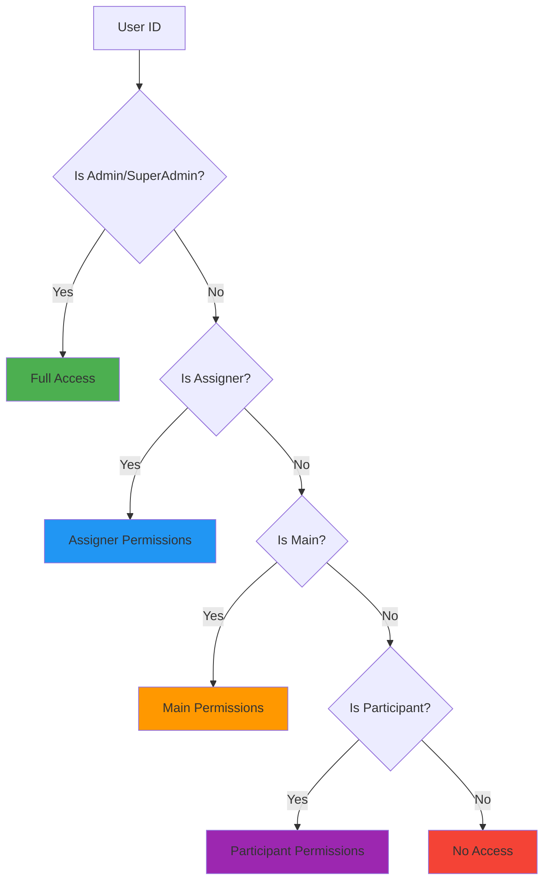
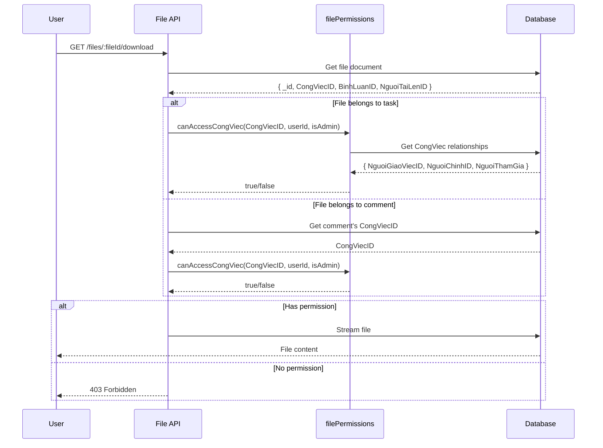
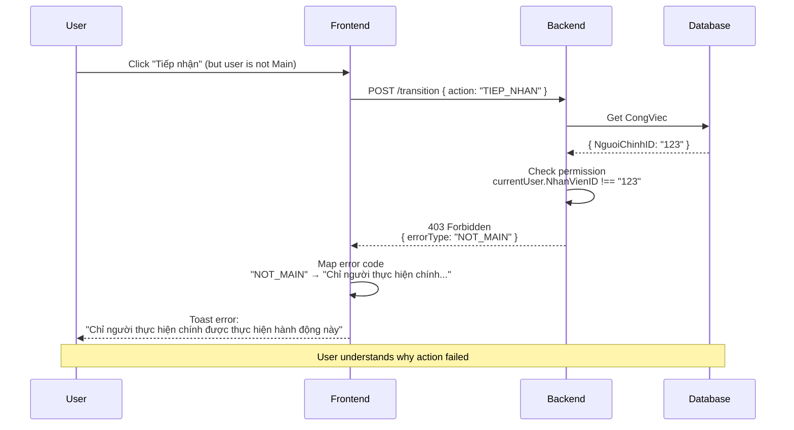

# 🔐 PERMISSION & AUTHORIZATION - CongViec Module

> **File**: 05_PERMISSION_AUTHORIZATION.md  
> **Module**: QuanLyCongViec/CongViec  
> **Mục tiêu**: Hiểu hệ thống phân quyền role-based và field-level access control

---

## 📋 MỤC LỤC

1. [Tổng quan Permission System](#1-tổng-quan-permission-system)
2. [Role Hierarchy](#2-role-hierarchy)
3. [View Permission](#3-view-permission)
4. [Action Permission (State Transitions)](#4-action-permission-state-transitions)
5. [Update Permission (Field-Level)](#5-update-permission-field-level)
6. [Delete Permission](#6-delete-permission)
7. [File Access Permission](#7-file-access-permission)
8. [Frontend Authorization](#8-frontend-authorization)
9. [Permission Error Handling](#9-permission-error-handling)
10. [Code References](#10-code-references)

---

## 1. TỔNG QUAN PERMISSION SYSTEM

### 1.1. Layered Authorization Model

```
┌────────────────────────────────────────────────────────┐
│              CongViec Permission Layers                 │
├────────────────────────────────────────────────────────┤
│ Layer 1: VIEW Permission (Relationship-based)          │
│   → Can user see this task?                            │
│   → Assigner | Main | Participant | Admin             │
│                                                         │
│ Layer 2: ACTION Permission (Role + State-based)        │
│   → Can user perform workflow action?                  │
│   → TIEP_NHAN (Main only), GIAO_VIEC (Assigner only)  │
│                                                         │
│ Layer 3: UPDATE Permission (Field-level)               │
│   → Can user edit specific fields?                     │
│   → TieuDe/MoTa (Assigner+Admin), Progress (Main)     │
│                                                         │
│ Layer 4: DELETE Permission (Role + State-based)        │
│   → Can user soft-delete task?                         │
│   → Assigner+Admin (+ restrict if HOAN_THANH)         │
│                                                         │
│ Layer 5: FILE ACCESS (Task-relationship-based)         │
│   → Can user view/download/delete files?               │
│   → Same as VIEW + Uploader for delete                │
└────────────────────────────────────────────────────────┘
```

### 1.2. Design Principles

**1. Relationship-based access** (not department-based):

- ✅ User thấy tasks mà họ liên quan (Assigner/Main/Participant)
- ❌ User KHÔNG thấy tất cả tasks trong department

**2. Principle of Least Privilege**:

- Mỗi role chỉ có quyền minimum cần thiết
- Field-level restrictions cho updates

**3. Defense in Depth**:

- Frontend: UI disable/hide (UX)
- Backend: Strict validation (Security)
- Không tin tưởng frontend

**4. Audit Trail**:

- Log tất cả failed permission checks
- Track who modified what

---

## 2. ROLE HIERARCHY

### 2.1. System Roles (Global)

Defined in `User.PhanQuyen`:

| Role       | Code         | Scope                        | Special Powers                  |
| ---------- | ------------ | ---------------------------- | ------------------------------- |
| SuperAdmin | `superadmin` | Toàn hệ thống                | Full access tất cả resources    |
| Admin      | `admin`      | Toàn hệ thống                | Full access tất cả resources    |
| Manager    | `manager`    | Department-level (potential) | View + limited edit (not impl.) |
| User       | `user`       | Personal tasks only          | Standard permissions            |

**Access check**:

```javascript
// Backend: normalize role for comparison
const role = (currentUser.PhanQuyen || "").toLowerCase();
const isAdmin = role === "admin" || role === "superadmin";
```

**⚠️ CRITICAL**: Case-insensitive comparison required (database có thể có "Admin", "ADMIN", "admin")

### 2.2. Task-Specific Roles (Context)

Defined by relationships in `CongViec` document:

| Role            | Field             | Description                     | Count      |
| --------------- | ----------------- | ------------------------------- | ---------- |
| **Assigner**    | `NguoiGiaoViecID` | Task owner - người giao việc    | 1 (single) |
| **Main**        | `NguoiChinhID`    | Primary performer - người chính | 1 (single) |
| **Participant** | `NguoiThamGia[]`  | Collaborators - người tham gia  | N (array)  |

**Context computation**:

```javascript
// Backend service
const currentNhanVienId = String(req.user.NhanVienID);

const isAssigner = String(congViec.NguoiGiaoViecID) === currentNhanVienId;
const isMain = String(congViec.NguoiChinhID) === currentNhanVienId;
const isParticipant = congViec.NguoiThamGia?.some(
  (p) => String(p.NhanVienID || p.NhanVienID?._id) === currentNhanVienId
);
```

**Frontend computation**:

```javascript
// CongViecDetailDialog.js - Line ~445
const { user } = useAuth();
const currentNhanVienId = user?.NhanVienID;

const isMain = !!(
  currentNhanVienId &&
  congViec?.NguoiChinhID &&
  String(congViec.NguoiChinhID) === String(currentNhanVienId)
);

const isAssigner = !!(
  currentNhanVienId &&
  String(congViec?.NguoiGiaoViecID) === String(currentNhanVienId)
);
```

### 2.3. Role Priority Matrix

**When multiple roles apply** (e.g., user is both Assigner AND Main):



**Priority order**: Admin > Assigner > Main > Participant > None

**Example**:

```javascript
// User là cả Assigner VÀ Main
if (isAssigner) {
  // Can GIAO_VIEC, HUY_GIAO, DUYET_HOAN_THANH, MO_LAI_HOAN_THANH
  // + All Main actions below
}
if (isMain) {
  // Can TIEP_NHAN, HOAN_THANH_TAM, HOAN_THANH
}
```

---

## 3. VIEW PERMISSION

### 3.1. Relationship-Based View Access

**Rule**: User có thể XEM task nếu:

- ✅ Là Assigner (người giao việc)
- ✅ Là Main (người thực hiện chính)
- ✅ Là Participant (người tham gia)
- ✅ Là Admin/SuperAdmin

**Backend Check Function**:

```javascript
// giaobanbv-be/services/congViec.service.js - Line 27
async function checkTaskViewPermission(congviec, req) {
  const currentUser = await User.findById(req.userId).lean();

  // ✅ Step 1: Validate user has NhanVienID
  if (!currentUser?.NhanVienID) {
    throw new AppError(
      400,
      "Tài khoản chưa liên kết với nhân viên. Vui lòng liên hệ quản trị viên."
    );
  }

  const currentNhanVienId = String(currentUser.NhanVienID);

  // ✅ Step 2: Check task relationships
  const isAssigner = String(congviec.NguoiGiaoViecID) === currentNhanVienId;
  const isMain = String(congviec.NguoiChinhID) === currentNhanVienId;
  const isParticipant = congviec.NguoiThamGia?.some(
    (p) => String(p.NhanVienID || p.NhanVienID?._id) === currentNhanVienId
  );

  // ✅ Step 3: Check admin role
  const vaiTro = currentUser.PhanQuyen?.toLowerCase();
  const isAdmin = ["admin", "superadmin"].includes(vaiTro);

  // ✅ Step 4: Allow if any condition matches
  const hasPermission = isAssigner || isMain || isParticipant || isAdmin;

  if (!hasPermission) {
    throw new AppError(403, "Bạn không có quyền xem công việc này");
  }

  return true;
}
```

**Called in**:

- `service.getCongViecDetail()` - Line 1462
- `service.deleteCongViec()` - Line 1275 (before revealing task info)
- Subtask operations - Lines 2401, 2503

### 3.2. Information Leakage Prevention

**Security Issue**: User không được biết task có tồn tại hay không nếu không có quyền

**❌ BAD PATTERN**:

```javascript
// Check exists first (leaks info)
const task = await CongViec.findById(id);
if (!task) throw new AppError(404, "Not found");

// THEN check permission (TOO LATE!)
await checkTaskViewPermission(task, req);
```

**✅ GOOD PATTERN**:

```javascript
// Get task first (no error yet)
const task = await CongViec.findById(id);
if (!task) throw new AppError(404, "Not found");

// Check permission BEFORE revealing any info
await checkTaskViewPermission(task, req); // ← Returns generic 403 if unauthorized

// Only after permission check, return task details
return mapCongViecDTO(task);
```

**Applied in `deleteCongViec()`** - Line 1275:

```javascript
// ✅ 2. Exists check
const congviec = await CongViec.findById(congviecid);
if (!congviec) {
  throw new AppError(404, "Không tìm thấy công việc");
}

// 🔥 P0 FIX: Permission check BEFORE revealing any information
// Prevents information leakage - user cannot probe for task existence by attempting delete
await checkTaskViewPermission(congviec, req);
```

### 3.3. List Query Filtering

**Received Tasks** (user is Main or Participant):

```javascript
// service.getReceivedCongViecs() - Line ~1673
query.$or = [
  { NguoiChinhID: userObjectId },
  { "NguoiThamGia.NhanVienID": userObjectId },
];
```

**Assigned Tasks** (user is Assigner):

```javascript
// service.getAssignedCongViecs() - Line ~1848
query.NguoiGiaoViecID = targetNhanVienId;
```

**⚠️ NOTE**: No cross-department visibility - user chỉ thấy tasks mà họ liên quan

---

## 4. ACTION PERMISSION (STATE TRANSITIONS)

### 4.1. Action Permission Matrix

Được định nghĩa trong `ROLE_REQUIREMENTS`:

```javascript
// giaobanbv-be/constants/workActions.constants.js - Line ~21
const ROLE_REQUIREMENTS = Object.freeze({
  [WORK_ACTIONS.GIAO_VIEC]: (ctx, cv) => ctx.isAssigner,
  [WORK_ACTIONS.HUY_GIAO]: (ctx, cv) => ctx.isAssigner,
  [WORK_ACTIONS.TIEP_NHAN]: (ctx, cv) => ctx.isMain,
  [WORK_ACTIONS.HOAN_THANH_TAM]: (ctx, cv) => ctx.isMain,
  [WORK_ACTIONS.HUY_HOAN_THANH_TAM]: (ctx, cv) => ctx.isMain || ctx.isAssigner,
  [WORK_ACTIONS.DUYET_HOAN_THANH]: (ctx, cv) => ctx.isAssigner,
  [WORK_ACTIONS.HOAN_THANH]: (ctx, cv) => !cv.CoDuyetHoanThanh && ctx.isMain,
  [WORK_ACTIONS.MO_LAI_HOAN_THANH]: (ctx, cv) => ctx.isAssigner,
});
```

**Permission Table**:

| Action             | Assigner | Main | Participant | Admin | Special Condition      |
| ------------------ | -------- | ---- | ----------- | ----- | ---------------------- |
| GIAO_VIEC          | ✅       | ❌   | ❌          | ✅    | -                      |
| HUY_GIAO           | ✅       | ❌   | ❌          | ✅    | -                      |
| TIEP_NHAN          | ❌       | ✅   | ❌          | ✅    | -                      |
| HOAN_THANH_TAM     | ❌       | ✅   | ❌          | ✅    | CoDuyetHoanThanh=true  |
| HUY_HOAN_THANH_TAM | ✅       | ✅   | ❌          | ✅    | -                      |
| DUYET_HOAN_THANH   | ✅       | ❌   | ❌          | ✅    | -                      |
| HOAN_THANH         | ❌       | ✅   | ❌          | ✅    | CoDuyetHoanThanh=false |
| MO_LAI_HOAN_THANH  | ✅       | ❌   | ❌          | ✅    | -                      |

**Admin override**: Admin có tất cả permissions như Assigner

### 4.2. Backend Permission Check

**Location**: `service.transition()` - Line ~2019

```javascript
service.transition = async (id, payload = {}, req) => {
  let { action, lyDo = "", ghiChu = "" } = payload;

  // ... get congviec ...

  // ✅ CRITICAL: Permission check by req.user.NhanVienID
  const performerIdCtx = req.user?.NhanVienID || null;

  const isAssigner =
    performerIdCtx &&
    String(congviec.NguoiGiaoViecID) === String(performerIdCtx);
  const isMain =
    performerIdCtx && String(congviec.NguoiChinhID) === String(performerIdCtx);

  const ctx = { isAssigner, isMain };

  // ✅ Check role requirement for this action
  const actorCheck = ROLE_REQUIREMENTS[action];

  if (!actorCheck || !actorCheck(ctx, congviec)) {
    console.warn(
      "[transition] Permission denied",
      JSON.stringify({
        action,
        performerIdCtx,
        isAssigner,
        isMain,
        NguoiGiaoViecID: congviec.NguoiGiaoViecID,
        NguoiChinhID: congviec.NguoiChinhID,
      })
    );

    // ✅ Granular error codes
    let code = "FORBIDDEN";
    if (action === WORK_ACTIONS.HOAN_THANH && !isMain) code = "NOT_MAIN";
    else if (
      [WORK_ACTIONS.TIEP_NHAN, WORK_ACTIONS.HOAN_THANH_TAM].includes(action) &&
      !isMain
    )
      code = "NOT_MAIN";

    throw new AppError(403, code, "Permission Error");
  }

  // ... proceed with transition ...
};
```

**Error Codes**:

- `NOT_MAIN` - Action requires Main role
- `NOT_ASSIGNER` - Action requires Assigner role (implied)
- `FORBIDDEN` - Generic permission denial

### 4.3. Frontend Permission UI

**Hide unavailable actions**:

```javascript
// CongViecDetailDialog.js - Line ~458
const availableActions = useMemo(
  () => getAvailableActions(congViec, { isAssigner, isMain }),
  [congViec, isAssigner, isMain]
);

// Only render buttons for available actions
{
  availableActions.includes(WORK_ACTIONS.TIEP_NHAN) && (
    <Button onClick={() => handleTransition(WORK_ACTIONS.TIEP_NHAN)}>
      Tiếp nhận
    </Button>
  );
}
```

**Tooltip for unavailable actions**:

```javascript
// If action not available, show tooltip explaining why
const actionTooltip = !availableActions.includes(WORK_ACTIONS.TIEP_NHAN)
  ? "Chỉ người thực hiện chính được tiếp nhận công việc"
  : "";
```

---

## 5. UPDATE PERMISSION (FIELD-LEVEL)

### 5.1. Field-Level Access Control

**Problem**: Khác nhau giữa "view" và "edit" - một số người có thể xem nhưng không được sửa

**Solution**: Field-level restrictions based on role

### 5.2. Update Permission Rules

**Backend Function**: `checkUpdatePermission()` - Line ~59

```javascript
function checkUpdatePermission(congViec, nhanVienId, vaiTro, updateFields) {
  const normalizedRole = (vaiTro || "").toLowerCase();
  const isAdmin = ["admin", "superadmin"].includes(normalizedRole);
  const isOwner = String(congViec.NguoiGiaoViecID) === String(nhanVienId);
  const isMain = String(congViec.NguoiChinhID) === String(nhanVienId);

  // ✅ Admin: Can edit ALL config fields (except auto-calculated)
  if (isAdmin) {
    return { allowed: true, role: "admin" };
  }

  // ✅ Owner (Assigner): Can edit main config fields
  const ownerAllowedFields = [
    "TieuDe",
    "MoTa",
    "NgayBatDau",
    "NgayHetHan",
    "MucDoUuTien",
    "CoDuyetHoanThanh",
    "CanhBaoMode",
    "CanhBaoSapHetHanPercent",
    "NgayCanhBao",
    "NguoiChinhID",
    "NguoiThamGia",
    "NhomViecUserID",
  ];

  if (isOwner) {
    const invalidFields = updateFields.filter(
      (f) => !ownerAllowedFields.includes(f)
    );
    if (invalidFields.length > 0) {
      return {
        allowed: false,
        role: "owner",
        invalidFields,
        message: `Người giao việc không được sửa các trường: ${invalidFields.join(
          ", "
        )}`,
      };
    }
    return { allowed: true, role: "owner" };
  }

  // ✅ Main: ONLY can edit 2 fields (routine task assignment)
  const mainAllowedFields = ["NhiemVuThuongQuyID", "FlagNVTQKhac"];

  if (isMain) {
    const invalidFields = updateFields.filter(
      (f) => !mainAllowedFields.includes(f)
    );
    if (invalidFields.length > 0) {
      return {
        allowed: false,
        role: "main",
        invalidFields,
        message: `Người chính chỉ có thể sửa: Nhiệm vụ thường quy (NhiemVuThuongQuyID), Cờ NVTQ khác (FlagNVTQKhac). Không được sửa: ${invalidFields.join(
          ", "
        )}`,
      };
    }
    return { allowed: true, role: "main" };
  }

  // ✅ Others: No update permission
  return {
    allowed: false,
    role: "none",
    message: "Bạn không có quyền cập nhật công việc này",
  };
}
```

### 5.3. Field Permission Matrix

| Field                   | Admin | Assigner | Main | Participant | Auto-Calculated |
| ----------------------- | ----- | -------- | ---- | ----------- | --------------- |
| **Basic Info**          |       |          |      |             |                 |
| TieuDe                  | ✅    | ✅       | ❌   | ❌          | ❌              |
| MoTa                    | ✅    | ✅       | ❌   | ❌          | ❌              |
| MaCongViec              | ❌    | ❌       | ❌   | ❌          | ✅ (Counter)    |
| SoThuTu                 | ❌    | ❌       | ❌   | ❌          | ✅ (Counter)    |
| **Dates**               |       |          |      |             |                 |
| NgayBatDau              | ✅    | ✅       | ❌   | ❌          | ❌              |
| NgayHetHan              | ✅    | ✅       | ❌   | ❌          | ❌              |
| NgayCanhBao             | ✅    | ✅       | ❌   | ❌          | ❌              |
| NgayGiaoViec            | ❌    | ❌       | ❌   | ❌          | ✅ (GIAO_VIEC)  |
| NgayHoanThanh           | ❌    | ❌       | ❌   | ❌          | ✅ (Transition) |
| **Config**              |       |          |      |             |                 |
| MucDoUuTien             | ✅    | ✅       | ❌   | ❌          | ❌              |
| CoDuyetHoanThanh        | ✅    | ✅       | ❌   | ❌          | ❌              |
| CanhBaoMode             | ✅    | ✅       | ❌   | ❌          | ❌              |
| CanhBaoSapHetHanPercent | ✅    | ✅       | ❌   | ❌          | ❌              |
| **People**              |       |          |      |             |                 |
| NguoiGiaoViecID         | ❌    | ❌       | ❌   | ❌          | ✅ (Create)     |
| NguoiChinhID            | ✅    | ✅       | ❌   | ❌          | ❌              |
| NguoiThamGia            | ✅    | ✅       | ❌   | ❌          | ❌              |
| **Status & Progress**   |       |          |      |             |                 |
| TrangThai               | ❌    | ❌       | ❌   | ❌          | ✅ (Transition) |
| PhanTramTienDoTong      | ❌    | ❌       | ✅\* | ❌          | Special API     |
| **Routine Task**        |       |          |      |             |                 |
| NhiemVuThuongQuyID      | ✅    | ✅       | ✅   | ❌          | ❌              |
| FlagNVTQKhac            | ✅    | ✅       | ✅   | ❌          | ❌              |
| **Subtask**             |       |          |      |             |                 |
| CongViecChaID           | ❌    | ❌       | ❌   | ❌          | ✅ (Create)     |
| Path                    | ❌    | ❌       | ❌   | ❌          | ✅ (Auto)       |
| Depth                   | ❌    | ❌       | ❌   | ❌          | ✅ (Auto)       |
| ChildrenCount           | ❌    | ❌       | ❌   | ❌          | ✅ (Auto)       |

**Legend**:

- ✅ Can edit via standard update API
- ✅\* Requires special permission check + dedicated API
- ❌ Cannot edit (ignored if sent)
- ✅ (Auto) System auto-calculates, cannot be manually set

### 5.4. Special Update APIs

**Progress Update** - Dedicated endpoint with special permission:

```javascript
// service.updateProgress() - Line ~383
service.updateProgress = async (congviecId, payload, req) => {
  // ... validation ...

  const cv = await CongViec.findOne({
    _id: congviecId,
    isDeleted: { $ne: true },
  });

  const performerId = req.user?.NhanVienID;

  // ✅ CRITICAL: Only Main can update progress
  if (String(cv.NguoiChinhID) !== String(performerId)) {
    throw new AppError(403, "Chỉ Người Chính được cập nhật tiến độ");
  }

  // ... update progress ...
};
```

**Routine Task Assignment** - Special permission:

```javascript
// service.assignRoutineTask() - Line ~517
service.assignRoutineTask = async (congviecId, payload, req) => {
  // ... validation ...

  const performerId = String(currentUser.NhanVienID);
  const isMain = String(cv.NguoiChinhID) === performerId;
  const isOwner = String(cv.NguoiGiaoViecID) === performerId;
  const isAdmin = ["admin", "superadmin"].includes(normalizedRole);

  // ✅ Main OR Owner OR Admin can assign routine task
  if (!isMain && !isOwner && !isAdmin) {
    throw new AppError(
      403,
      "Chỉ người thực hiện chính, người giao việc hoặc admin được gán nhiệm vụ thường quy"
    );
  }

  // ... assign routine task ...
};
```

### 5.5. Frontend Edit Controls

**File**: `congViecPermissions.js` - Line 22

```javascript
export const canEditCongViec = ({
  congViec,
  currentUserRole,
  currentUserNhanVienId,
}) => {
  if (!congViec) return false;

  const isAdmin =
    currentUserRole === "admin" || currentUserRole === "superadmin";
  const isOwner =
    currentNhanVienId &&
    congViec?.NguoiGiaoViecID &&
    String(currentNhanVienId) === String(congViec.NguoiGiaoViecID);

  // ✅ Only Owner or Admin can open CongViecFormDialog
  return isAdmin || isOwner;
};

export const getEditDisabledReason = ({
  congViec,
  currentUserRole,
  currentUserNhanVienId,
}) => {
  // ... validation ...

  if (isAdmin || isOwner) return null; // có quyền

  return "Chỉ người giao việc hoặc quản trị viên mới có quyền chỉnh sửa cấu hình công việc";
};
```

**Usage in table**:

```javascript
// CongViecTable.js - Line ~89
const canEdit = (cv) =>
  canEditCongViec({
    congViec: cv,
    currentUserRole: user?.PhanQuyen,
    currentUserNhanVienId: user?.NhanVienID,
  });

// Disable edit button if no permission
const editDisabled = !canEdit(congViec);
const tooltip = editDisabled
  ? getEditDisabledReason({ congViec, currentUserRole, currentUserNhanVienId })
  : "";

<Tooltip title={tooltip}>
  <span>
    <IconButton disabled={editDisabled} onClick={handleEdit}>
      <EditIcon />
    </IconButton>
  </span>
</Tooltip>;
```

---

## 6. DELETE PERMISSION

### 6.1. Delete Permission Rules

**Who can delete**:

- ✅ **Admin/SuperAdmin**: Always (even HOAN_THANH tasks)
- ✅ **Assigner (Owner)**: Only if NOT HOAN_THANH
- ❌ **Main**: Cannot delete
- ❌ **Participant**: Cannot delete

**Backend Check** - `service.deleteCongViec()` Line ~1295:

```javascript
service.deleteCongViec = async (congviecid, req) => {
  // ... exists check ...
  // ... permission check ...

  const currentUser = await User.findById(req.userId).select(
    "PhanQuyen NhanVienID"
  );

  // ✅ Role authorization with normalization
  const role = (currentUser.PhanQuyen || "").toLowerCase();
  const isAdmin = role === "admin" || role === "superadmin";
  const isOwner =
    String(currentUser.NhanVienID) === String(congviec.NguoiGiaoViecID);

  // ✅ Completed status restriction
  if (congviec.TrangThai === "HOAN_THANH" && !isAdmin) {
    throw new AppError(
      403,
      "Chỉ quản trị viên (admin) mới được xóa công việc đã hoàn thành"
    );
  }

  // ✅ Authorization check
  if (!(isAdmin || isOwner)) {
    throw new AppError(
      403,
      "Bạn không có quyền xóa công việc này (chỉ người giao việc hoặc admin)"
    );
  }

  // ... soft delete logic ...
};
```

### 6.2. Additional Delete Restrictions

**Children check**:

```javascript
// Cannot delete if has children
const childCount = await CongViec.countDocuments({
  CongViecChaID: congviecid,
  isDeleted: { $ne: true },
});

if (childCount > 0) {
  throw new AppError(
    400,
    `Không thể xóa vì còn ${childCount} công việc con. Vui lòng xóa các công việc con trước.`
  );
}
```

### 6.3. Cascade Deletion

When deleting task, also soft-delete:

1. **All comments** (root + replies)
2. **All files** (task files + comment files)
3. **Decrement parent's ChildrenCount** (if subtask)

**Audit trail**:

```javascript
congviec.isDeleted = true;
congviec.deletedAt = new Date();
congviec.deletedBy = currentUser.NhanVienID; // Track who deleted
await congviec.save();
```

### 6.4. Frontend Delete Controls

```javascript
// congViecPermissions.js - Line 5
export const canDeleteCongViec = ({
  congViec,
  currentUserRole,
  currentUserNhanVienId,
}) => {
  if (!congViec) return false;

  const isAdmin =
    currentUserRole === "admin" || currentUserRole === "superadmin";
  const isOwner =
    currentUserNhanVienId &&
    congViec?.NguoiGiaoViecID &&
    String(currentUserNhanVienId) === String(congViec.NguoiGiaoViecID);
  const completed = congViec.TrangThai === "HOAN_THANH";

  // ✅ Only admin may delete completed tasks
  if (completed && !isAdmin) return false;

  return isAdmin || isOwner;
};

export const getDeleteDisabledReason = ({
  congViec,
  currentUserRole,
  currentUserNhanVienId,
}) => {
  // ... validation ...

  const completed = congViec.TrangThai === "HOAN_THANH";

  if (completed && !isAdmin) {
    return "Chỉ quản trị viên mới có quyền xóa công việc đã hoàn thành";
  }

  if (!(isAdmin || isOwner)) {
    return "Chỉ người giao việc hoặc quản trị viên mới có quyền xóa";
  }

  return null;
};
```

---

## 7. FILE ACCESS PERMISSION

### 7.1. File Permission Model

**File belongs to**:

- Task (`CongViecID`)
- OR Comment (`BinhLuanID`)

**Access rules**:

- ✅ **View/Download**: Same as task view permission (Assigner/Main/Participant/Admin)
- ✅ **Delete**: Only uploader OR Admin

### 7.2. Backend File Permission Check

**File**: `giaobanbv-be/helpers/filePermissions.js`

```javascript
async function canAccessCongViec(congViecId, nhanVienId, isAdmin = false) {
  if (!mongoose.Types.ObjectId.isValid(congViecId)) return false;

  // ✅ Admin bypass
  if (isAdmin) return true;

  const cv = await CongViec.findById(congViecId).lean();
  if (!cv || cv.isDeleted) return false;

  const nvId = String(nhanVienId || "");
  if (!nvId) return false;

  // ✅ Check relationships
  if (String(cv.NguoiGiaoViecID) === nvId) return true;
  if (String(cv.NguoiChinhID) === nvId) return true;

  const thamGia = (cv.NguoiThamGia || []).some(
    (x) => String(x.NhanVienID) === nvId
  );

  return thamGia;
}

function canDeleteFile(fileDoc, nhanVienId, isAdmin = false) {
  // ✅ Admin can always delete
  if (isAdmin) return true;

  // ✅ Only uploader can delete their own files
  return String(fileDoc.NguoiTaiLenID) === String(nhanVienId || "");
}

module.exports = { canAccessCongViec, canDeleteFile };
```

### 7.3. File Permission Flow



### 7.4. File Upload Permission

**Current rule**: Anyone with task view permission can upload files

**Future enhancement**: Consider restricting upload to:

- Only Assigner + Main + Admin (not Participants)
- Or configurable per task

---

## 8. FRONTEND AUTHORIZATION

### 8.1. UI Permission Patterns

**Pattern 1: Hide UI elements**

```javascript
// Don't render if no permission
{
  canEdit && <Button>Edit</Button>;
}
```

**Pattern 2: Disable with tooltip**

```javascript
const reason = getEditDisabledReason({ congViec, ... });

<Tooltip title={reason || ""}>
  <span>
    <Button disabled={!!reason}>Edit</Button>
  </span>
</Tooltip>
```

**Pattern 3: Computed available actions**

```javascript
const availableActions = getAvailableActions(congViec, { isAssigner, isMain });

{
  availableActions.includes(WORK_ACTIONS.TIEP_NHAN) && (
    <Button>Tiếp nhận</Button>
  );
}
```

### 8.2. Permission-Aware Components

**CongViecDetailDialog**:

```javascript
// Line ~445
const isMain = !!(
  currentNhanVienId &&
  congViecNguoiChinhId &&
  String(congViecNguoiChinhId) === String(currentNhanVienId)
);

const isAssigner = !!(
  currentNhanVienId &&
  String(congViec?.NguoiGiaoViecID) === String(currentNhanVienId)
);

// Line ~455
const canEditProgress = congViec.TrangThai === "DANG_THUC_HIEN" && isMain;

// Pass to child components
<ProgressSection
  congViec={congViec}
  canEditProgress={canEditProgress}
  onUpdate={handleUpdateProgress}
/>;
```

**HistoryAccordion**:

```javascript
// Line ~127
const canEdit =
  currentNhanVienId &&
  entry.NguoiThucHienID &&
  String(entry.NguoiThucHienID._id || entry.NguoiThucHienID) ===
    String(currentNhanVienId);

// Only show edit icon if user owns this history entry
{
  canEdit && (
    <IconButton size="small" onClick={() => handleEditNote(index)}>
      <EditIcon fontSize="small" />
    </IconButton>
  );
}
```

### 8.3. Frontend vs Backend Permission

**⚠️ CRITICAL**: Frontend permission checks are for UX ONLY

```
┌─────────────────────────────────────────┐
│         Frontend (UX Layer)             │
│  - Hide/disable UI elements             │
│  - Show tooltips explaining why         │
│  - Prevent unnecessary API calls        │
│  - NOT for security!                    │
└─────────────────────────────────────────┘
                   ↓
┌─────────────────────────────────────────┐
│        Backend (Security Layer)         │
│  - ALWAYS validate permissions          │
│  - Never trust frontend                 │
│  - Return 403 if unauthorized           │
│  - Log failed attempts                  │
└─────────────────────────────────────────┘
```

**Bad actor can bypass frontend**:

- Modify JS code in browser
- Use Postman/curl to call API directly
- ⚠️ Backend MUST still validate!

---

## 9. PERMISSION ERROR HANDLING

### 9.1. Backend Error Codes

**Standard permission errors**:

```javascript
// 401 Unauthorized - Not authenticated
throw new AppError(401, "Không xác thực được người dùng");

// 400 Bad Request - Missing NhanVienID link
throw new AppError(
  400,
  "Tài khoản chưa liên kết với nhân viên. Vui lòng liên hệ quản trị viên."
);

// 403 Forbidden - Not authorized
throw new AppError(403, "Bạn không có quyền xem công việc này");
throw new AppError(403, "NOT_MAIN", "Permission Error");
throw new AppError(403, "FORBIDDEN", "Permission Error");

// 404 Not Found - Resource doesn't exist OR no view permission (ambiguous for security)
throw new AppError(404, "Không tìm thấy công việc");
```

**Error Response Format**:

```javascript
{
  "success": false,
  "error": {
    "statusCode": 403,
    "errorType": "NOT_MAIN",
    "message": "Permission Error"
  }
}
```

### 9.2. Frontend Error Messages

**File**: `workActions.constants.js`

```javascript
export const PERMISSION_ERROR_MESSAGES = {
  NOT_ASSIGNER: "Chỉ người giao việc được thực hiện hành động này",
  NOT_MAIN: "Chỉ người thực hiện chính được thực hiện hành động này",
  FORBIDDEN: "Bạn không có quyền thực hiện hành động này",
};
```

**Error Handling in Thunk**:

```javascript
// transitionCongViec() - Line ~1210
catch (error) {
  if (error?.message === "VERSION_CONFLICT") {
    // ... version conflict handling ...
  } else {
    dispatch(slice.actions.hasError(error.message));

    // ✅ Map error code to user-friendly message
    const raw = error?.response?.data?.errors?.message ||
                error?.response?.data?.error?.message;
    const mapped = PERMISSION_ERROR_MESSAGES[raw] || raw;

    toast.error(mapped || error.message);
  }
  throw error;
}
```

### 9.3. Permission Error Flow



### 9.4. Error Logging & Audit

**Backend logging** (for security monitoring):

```javascript
// service.transition() - Line ~2032
console.warn(
  "[transition] Permission denied",
  JSON.stringify({
    action,
    performerIdCtx,
    isAssigner,
    isMain,
    NguoiGiaoViecID: congviec.NguoiGiaoViecID,
    NguoiChinhID: congviec.NguoiChinhID,
  })
);
```

**Future enhancements**:

- Log to security audit table
- Alert on repeated permission violations
- Track attempted unauthorized access patterns

---

## 10. CODE REFERENCES

### 10.1. Backend Files

| File                       | Lines     | Description                          |
| -------------------------- | --------- | ------------------------------------ |
| `congViec.service.js`      | 27-52     | checkTaskViewPermission() function   |
| `congViec.service.js`      | 59-115    | checkUpdatePermission() function     |
| `congViec.service.js`      | 1260-1370 | deleteCongViec() permission checks   |
| `congViec.service.js`      | 1462      | getCongViecDetail() permission check |
| `congViec.service.js`      | 383-410   | updateProgress() Main-only check     |
| `congViec.service.js`      | 517-570   | assignRoutineTask() permission check |
| `congViec.service.js`      | 2019-2050 | transition() permission check        |
| `workActions.constants.js` | 21-38     | ROLE_REQUIREMENTS matrix             |
| `filePermissions.js`       | 1-22      | canAccessCongViec() function         |
| `filePermissions.js`       | 24-27     | canDeleteFile() function             |

### 10.2. Frontend Files

| File                       | Lines   | Description                        |
| -------------------------- | ------- | ---------------------------------- |
| `congViecPermissions.js`   | 5-18    | canDeleteCongViec() function       |
| `congViecPermissions.js`   | 22-36   | canEditCongViec() function         |
| `congViecPermissions.js`   | 40-62   | getEditDisabledReason() function   |
| `congViecPermissions.js`   | 66-88   | getDeleteDisabledReason() function |
| `CongViecDetailDialog.js`  | 445-460 | isMain/isAssigner/availableActions |
| `CongViecTable.js`         | 89-95   | canEdit() usage                    |
| `HistoryAccordion.js`      | 127-135 | canEdit history entry check        |
| `workActions.constants.js` | 8-13    | PERMISSION_ERROR_MESSAGES          |

### 10.3. Permission Check Summary

**View Permission**:

```javascript
// Backend
await checkTaskViewPermission(congviec, req);

// Returns true or throws 403
```

**Action Permission**:

```javascript
// Backend
const actorCheck = ROLE_REQUIREMENTS[action];
if (!actorCheck(ctx, congviec)) {
  throw new AppError(403, "NOT_MAIN", "Permission Error");
}

// Frontend
const availableActions = getAvailableActions(cv, { isAssigner, isMain });
if (!availableActions.includes(action)) {
  // Hide/disable button
}
```

**Update Permission**:

```javascript
// Backend
const result = checkUpdatePermission(cv, nhanVienId, vaiTro, updateFields);
if (!result.allowed) {
  throw new AppError(403, result.message);
}

// Frontend
const canEdit = canEditCongViec({
  congViec,
  currentUserRole,
  currentUserNhanVienId,
});
if (!canEdit) {
  // Disable edit button + show tooltip
}
```

**Delete Permission**:

```javascript
// Backend
if (!(isAdmin || isOwner)) {
  throw new AppError(403, "Chỉ người giao việc hoặc admin");
}

// Frontend
const canDelete = canDeleteCongViec({
  congViec,
  currentUserRole,
  currentUserNhanVienId,
});
if (!canDelete) {
  // Hide delete button
}
```

---

## 📊 SUMMARY

### Checklist để hiểu Permission System

- [ ] Hiểu 4 system roles: SuperAdmin, Admin, Manager, User
- [ ] Hiểu 3 task-specific roles: Assigner, Main, Participant
- [ ] Nắm view permission rules (relationship-based)
- [ ] Hiểu action permission matrix (8 actions × roles)
- [ ] Nắm field-level update permissions
- [ ] Biết delete permission rules (+ completed restriction)
- [ ] Hiểu file access permission model
- [ ] Biết cách implement frontend permission checks
- [ ] Hiểu defense in depth (frontend UX + backend security)
- [ ] Nắm error handling và user-friendly messages

### Key Takeaways

1. **Relationship-based, not department-based** - User chỉ thấy tasks mà họ liên quan
2. **Layered authorization** - View → Action → Update → Delete
3. **Field-level restrictions** - Owner có thể sửa config, Main chỉ sửa routine task
4. **Admin override** - Admin có full permissions như Assigner
5. **Frontend = UX, Backend = Security** - Never trust frontend
6. **Information leakage prevention** - Check permission before revealing existence
7. **Granular error codes** - NOT_MAIN, NOT_ASSIGNER, FORBIDDEN
8. **Audit trail** - Log permission checks và failed attempts

### Security Best Practices

✅ **Always validate permissions on backend**  
✅ **Check permission BEFORE revealing data**  
✅ **Use granular error codes for debugging**  
✅ **Log failed permission attempts**  
✅ **Normalize role strings (case-insensitive)**  
✅ **Validate NhanVienID link exists**  
✅ **Use field-level restrictions for updates**  
✅ **Restrict delete of completed tasks**

### Common Pitfalls

❌ **Trust frontend permission checks** - Luôn validate backend  
❌ **Reveal task existence before permission check** - Information leakage  
❌ **Use User.\_id instead of NhanVienID** - Wrong context  
❌ **Case-sensitive role comparison** - DB có thể có "Admin"/"admin"  
❌ **Allow Main to edit config fields** - Field-level violation  
❌ **Allow anyone to delete completed tasks** - Business rule violation

---

**Next**: [03_COMMENT_THREADING_SYSTEM.md](./03_COMMENT_THREADING_SYSTEM.md) - Parent/Reply với lazy loading

---

**Ngày tạo**: 5/1/2026  
**Phiên bản**: 1.0  
**Tác giả**: Documentation Team
