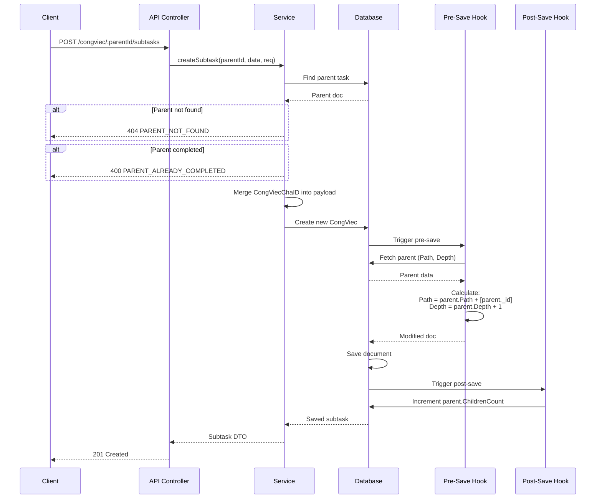
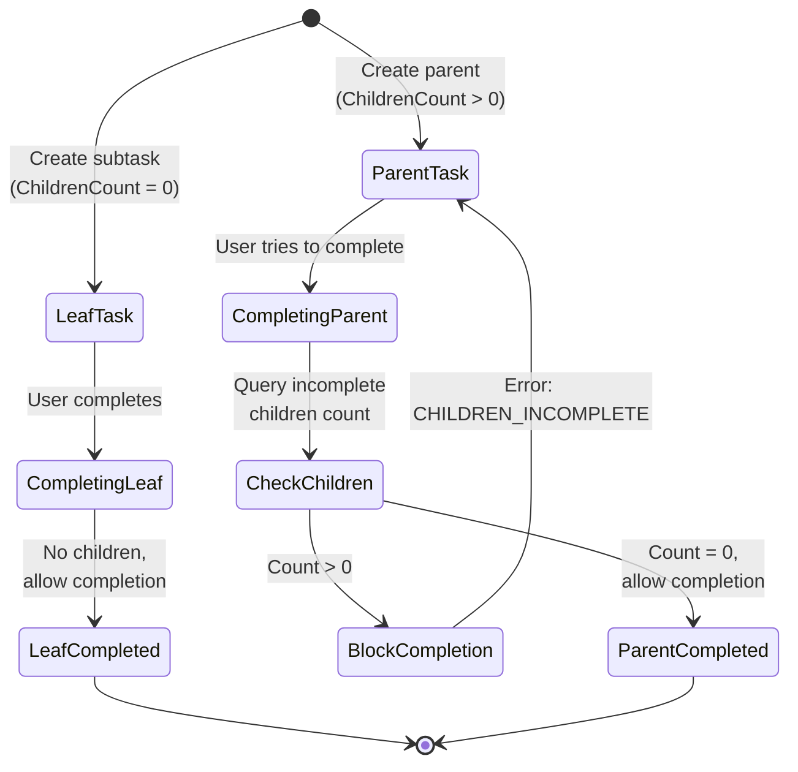

# 🌳 SUBTASKS HIERARCHY - CongViec Module

> **File**: 06_SUBTASKS_HIERARCHY.md  
> **Module**: QuanLyCongViec/CongViec  
> **Mục tiêu**: Hiểu hệ thống cây công việc con (subtasks) với Path & Depth fields

---

## 📋 MỤC LỤC

1. [Tổng quan Tree Structure](#1-tổng-quan-tree-structure)
2. [Materialized Path Pattern](#2-materialized-path-pattern)
3. [Subtask Creation Flow](#3-subtask-creation-flow)
4. [Parent-Child Constraints](#4-parent-child-constraints)
5. [Tree Query Patterns](#5-tree-query-patterns)
6. [Completion Rules](#6-completion-rules)
7. [Permission Inheritance](#7-permission-inheritance)
8. [Code References](#8-code-references)

---

## 1. TỔNG QUAN TREE STRUCTURE

### 1.1. System Architecture

```
┌─────────────────────────────────────────────────────────┐
│           Subtask Hierarchy Architecture                 │
├─────────────────────────────────────────────────────────┤
│                                                          │
│  Root Task (CV-001)                                     │
│  ├─ CongViecChaID: null                                 │
│  ├─ Path: []                                            │
│  ├─ Depth: 0                                            │
│  └─ ChildrenCount: 2                                    │
│      │                                                   │
│      ├─── Subtask A (CV-002)                           │
│      │    ├─ CongViecChaID: CV-001                      │
│      │    ├─ Path: [CV-001]                             │
│      │    ├─ Depth: 1                                   │
│      │    └─ ChildrenCount: 1                           │
│      │         │                                         │
│      │         └─── Subtask A1 (CV-004)                 │
│      │              ├─ CongViecChaID: CV-002            │
│      │              ├─ Path: [CV-001, CV-002]           │
│      │              ├─ Depth: 2                         │
│      │              └─ ChildrenCount: 0                 │
│      │                                                   │
│      └─── Subtask B (CV-003)                           │
│           ├─ CongViecChaID: CV-001                      │
│           ├─ Path: [CV-001]                             │
│           ├─ Depth: 1                                   │
│           └─ ChildrenCount: 0                           │
│                                                          │
│  Key Features:                                           │
│  • Unlimited depth (no hard limit)                      │
│  • Materialized path for efficient queries              │
│  • Parent completion blocked if children incomplete     │
│  • Automatic ChildrenCount increment                    │
└─────────────────────────────────────────────────────────┘
```

### 1.2. Design Principles

**1. Materialized Path Pattern**:

- Store full ancestor chain in `Path` array
- O(1) lookup for direct children
- Efficient ancestor/descendant queries

**2. Redundant Counters**:

- `ChildrenCount` field for quick checks
- Auto-increment on child creation (post-save hook)
- Used for completion validation

**3. Status Constraints**:

- Cannot complete parent if children incomplete
- Cannot create subtask under completed parent
- Circular reference prevention

**4. No Hard Depth Limit**:

- ✅ Unlimited nesting supported
- ✅ Guard loops prevent infinite recursion
- ⚠️ Deep trees may impact performance

---

## 2. MATERIALIZED PATH PATTERN

### 2.1. Schema Fields

**File**: `giaobanbv-be/models/CongViec.js` - Line 161

```javascript
{
  CongViecChaID: {
    type: Schema.ObjectId,
    ref: "CongViec",
    default: null,
    index: true,          // ← Fast lookup of direct children
  },

  // Materialized path: Array of ancestor ObjectIds
  Path: {
    type: [Schema.ObjectId],
    default: [],
    index: false,         // ← No index (rarely queried by full path)
  },

  // Tree depth (0 = root, 1 = direct child, etc.)
  Depth: {
    type: Number,
    default: 0,
    min: 0,
    index: true,          // ← Useful for filtering by depth
  },

  // Count of direct children (redundant counter)
  ChildrenCount: {
    type: Number,
    default: 0,
    min: 0,
  },
}
```

### 2.2. Path Field Examples

**Root Task** (no parent):

```javascript
{
  _id: "64f3cb6035c717ab00d75b8a",
  CongViecChaID: null,
  Path: [],                    // ← Empty array
  Depth: 0,
  ChildrenCount: 2
}
```

**Level 1 Subtask**:

```javascript
{
  _id: "64f3cb6035c717ab00d75b8b",
  CongViecChaID: "64f3cb6035c717ab00d75b8a",  // ← Parent
  Path: ["64f3cb6035c717ab00d75b8a"],         // ← Path = [Parent]
  Depth: 1,
  ChildrenCount: 1
}
```

**Level 2 Subtask**:

```javascript
{
  _id: "64f3cb6035c717ab00d75b8c",
  CongViecChaID: "64f3cb6035c717ab00d75b8b",  // ← Parent
  Path: [
    "64f3cb6035c717ab00d75b8a",              // ← Grandparent
    "64f3cb6035c717ab00d75b8b"               // ← Parent
  ],
  Depth: 2,
  ChildrenCount: 0
}
```

### 2.3. Path Calculation Algorithm

```mermaid
graph TD
    A[New Subtask Created] --> B{Has CongViecChaID?}
    B -->|No| C[Root Task<br/>Path = []<br/>Depth = 0]
    B -->|Yes| D[Fetch Parent Task]
    D --> E{Parent Exists<br/>& Not Deleted?}
    E -->|No| F[Throw Error:<br/>PARENT_NOT_FOUND]
    E -->|Yes| G{Parent Status<br/>== HOAN_THANH?}
    G -->|Yes| H[Throw Error:<br/>PARENT_ALREADY_COMPLETED]
    G -->|No| I[Calculate Path]
    I --> J[Path = parent.Path + [parent._id]]
    J --> K[Depth = parent.Depth + 1]
    K --> L[Save Subtask]
    L --> M[Post-Save Hook:<br/>Increment parent.ChildrenCount]
```

**Implementation**: `CongViec.js` - Line 318

```javascript
// PRE-SAVE: Thiết lập Path / Depth cho subtask mới
congViecSchema.pre("save", async function (next) {
  try {
    // Mark if this is a new document (for post-save hook)
    this._wasNew = this.isNew;

    // Only process new subtasks (not updates)
    if (!this.isNew || !this.CongViecChaID) return next();

    // ✅ Step 1: Fetch parent with minimal fields
    const parent = await this.constructor
      .findById(this.CongViecChaID)
      .select("_id TrangThai Path Depth isDeleted");

    // ✅ Step 2: Validate parent exists
    if (!parent || parent.isDeleted) {
      return next(new Error("PARENT_NOT_FOUND"));
    }

    // ✅ Step 3: Validate parent not completed
    if (parent.TrangThai === "HOAN_THANH") {
      return next(new Error("PARENT_ALREADY_COMPLETED"));
    }

    // ✅ Step 4: Calculate Path (add parent to ancestor list)
    this.Path = Array.isArray(parent.Path)
      ? [...parent.Path, parent._id]
      : [parent._id];

    // ✅ Step 5: Calculate Depth (parent + 1)
    this.Depth = (parent.Depth || 0) + 1;

    return next();
  } catch (err) {
    return next(err);
  }
});
```

**POST-SAVE Hook** (auto-increment ChildrenCount):

```javascript
// Line 343
congViecSchema.post("save", async function (doc, next) {
  try {
    // Only increment on new document creation
    if (this._wasNew && doc && doc.CongViecChaID) {
      await doc.constructor.updateOne(
        { _id: doc.CongViecChaID },
        { $inc: { ChildrenCount: 1 } }
      );
    }
  } catch (_) {
    // Swallow error (can recount manually if needed)
  }
  next();
});
```

**Error Handling**:

- Silent failure on ChildrenCount increment
- Can run manual recount script if counter drifts

---

## 3. SUBTASK CREATION FLOW

### 3.1. API Endpoint

**Route**: `POST /api/workmanagement/congviec/:parentId/subtasks`

**Controller**: `congViec.controller.js`

```javascript
controller.createSubtask = catchAsync(async (req, res) => {
  const { parentId } = req.params;
  const result = await service.createSubtask(parentId, req.body, req);
  return sendResponse(
    res,
    201,
    true,
    result,
    null,
    "Tạo công việc con thành công"
  );
});
```

### 3.2. Service Layer Implementation

**File**: `congViec.service.js` - Line 2376

```javascript
service.createSubtask = async (parentId, data, req) => {
  // ✅ 1. Validate parent ID format
  if (!mongoose.Types.ObjectId.isValid(parentId))
    throw new AppError(400, "PARENT_ID_INVALID");

  // ✅ 2. Check parent exists and not deleted
  const parent = await CongViec.findOne({
    _id: parentId,
    isDeleted: { $ne: true },
  }).select("_id TrangThai");

  if (!parent) throw new AppError(404, "PARENT_NOT_FOUND");

  // ✅ 3. Check parent not already completed
  if (parent.TrangThai === "HOAN_THANH")
    throw new AppError(400, "PARENT_ALREADY_COMPLETED");

  // ✅ 4. Merge parent ID into payload
  const payload = {
    ...data,
    CongViecChaID: parentId,
  };

  // ✅ 5. Delegate to standard createCongViec
  // (which will trigger pre-save hook to set Path & Depth)
  return await service.createCongViec(payload, req);
};
```

**Key Flow**:

1. Validate parent ID & existence
2. Check parent status (must not be HOAN_THANH)
3. Add `CongViecChaID` to payload
4. Call `createCongViec()` (triggers pre-save hook)
5. Pre-save hook calculates Path & Depth
6. Post-save hook increments parent's ChildrenCount

### 3.3. Sequence Diagram



---

## 4. PARENT-CHILD CONSTRAINTS

### 4.1. Constraint Matrix

| Constraint                    | Rule                                   | Enforcement Layer |
| ----------------------------- | -------------------------------------- | ----------------- |
| **Self-reference prevention** | `CongViecChaID != _id`                 | Pre-validation    |
| **Parent existence**          | Parent must exist & not deleted        | Pre-save hook     |
| **Parent status**             | Cannot add subtask to completed parent | Pre-save hook     |
| **Completion blocking**       | Cannot complete if children incomplete | Transition logic  |
| **Circular reference**        | No cycles (not explicitly checked)     | Implicit (Path)   |
| **Date inheritance**          | NO automatic inheritance (manual copy) | Application logic |

### 4.2. Self-Reference Prevention

**File**: `CongViec.js` - Line 228

```javascript
congViecSchema.pre("validate", function (next) {
  // ✅ Prevent task from being its own parent
  if (this.CongViecChaID && this._id && this.CongViecChaID.equals(this._id)) {
    return next(new Error("CongViecChaID không được trỏ đến chính nó"));
  }

  // ... other validations ...

  next();
});
```

### 4.3. Parent Existence Check

**Implemented in**: Pre-save hook (line 318)

```javascript
const parent = await this.constructor
  .findById(this.CongViecChaID)
  .select("_id TrangThai Path Depth isDeleted");

if (!parent || parent.isDeleted) {
  return next(new Error("PARENT_NOT_FOUND"));
}
```

### 4.4. Parent Completion Status

**Two enforcement points**:

**1. Pre-save hook** (line 330):

```javascript
if (parent.TrangThai === "HOAN_THANH") {
  return next(new Error("PARENT_ALREADY_COMPLETED"));
}
```

**2. Service layer** (line 2383):

```javascript
if (parent.TrangThai === "HOAN_THANH")
  throw new AppError(400, "PARENT_ALREADY_COMPLETED");
```

**Why two checks?**

- Service layer: User-friendly error messages
- Pre-save hook: Last line of defense (data integrity)

### 4.5. Children Completion Check

**Rule**: Cannot complete parent while children incomplete

**File**: `congViec.service.js` - Line 2056

```javascript
// In transitionCongViec() function
if (
  [WORK_ACTIONS.DUYET_HOAN_THANH, WORK_ACTIONS.HOAN_THANH].includes(action) &&
  congviec.ChildrenCount > 0
) {
  // ✅ Count incomplete children
  const incomplete = await CongViec.countDocuments({
    CongViecChaID: congviec._id,
    TrangThai: { $ne: "HOAN_THANH" },
    isDeleted: { $ne: true },
  });

  if (incomplete > 0) {
    throw new AppError(
      409,
      "CHILDREN_INCOMPLETE",
      "Còn công việc con chưa hoàn thành"
    );
  }
}
```

**Benefits**:

- ✅ Prevents premature parent completion
- ✅ Enforces bottom-up completion order
- ✅ User-friendly error message

### 4.6. Circular Reference Prevention

**Current approach**: No explicit cycle detection

**Why safe?**

- Path calculated on **creation only** (isNew check)
- Pre-save hook validates parent exists **before** adding to Path
- Cannot create task A → B → A cycle (would require updating existing tasks)

**Future consideration**: Add cycle detection for manual Path updates

```javascript
// Pseudo-code for cycle detection
function detectCycle(taskId, proposedParentId) {
  const visited = new Set();
  let currentId = proposedParentId;

  while (currentId && !visited.has(currentId)) {
    if (currentId.equals(taskId)) {
      throw new Error("CIRCULAR_REFERENCE_DETECTED");
    }
    visited.add(currentId);
    const parent = await CongViec.findById(currentId).select("CongViecChaID");
    currentId = parent?.CongViecChaID;
  }
}
```

---

## 5. TREE QUERY PATTERNS

### 5.1. Direct Children Query

**Query**: Get all immediate children of a task

```javascript
// service.listChildren() - Line 2392
const rows = await CongViec.find({
  CongViecChaID: parentId, // ← Direct children only
  isDeleted: { $ne: true },
})
  .sort({ createdAt: -1 })
  .skip((page - 1) * limit)
  .limit(limit)
  .select("MaCongViec TieuDe TrangThai PhanTramTienDoTong ...")
  .populate("NguoiChinh")
  .lean();
```

**Performance**: Uses `CongViecChaID` index (O(log n))

### 5.2. All Descendants Query

**Query**: Get all subtasks at any depth (NOT directly implemented)

**Possible implementation**:

```javascript
// Option 1: Query by Path prefix (requires index)
const descendants = await CongViec.find({
  Path: parentId, // ← Match if parentId is in Path array
  isDeleted: { $ne: true },
});

// Option 2: Recursive fetch (for small trees)
async function getAllDescendants(rootId) {
  const children = await CongViec.find({
    CongViecChaID: rootId,
    isDeleted: { $ne: true },
  });

  const descendants = [...children];
  for (const child of children) {
    const grandchildren = await getAllDescendants(child._id);
    descendants.push(...grandchildren);
  }

  return descendants;
}
```

**Trade-offs**:

- Option 1: Single query, but requires Path index (large for deep trees)
- Option 2: Multiple queries, but no extra index

### 5.3. Find Root Ancestor

**Query**: Traverse up to find top-most parent

**File**: `congViec.service.js` - Line 2523

```javascript
service.findRootNode = async (id) => {
  let current = await CongViec.findOne({ _id: id, isDeleted: { $ne: true } })
    .select("CongViecChaID")
    .lean();

  if (!current) throw new AppError(404, "NOT_FOUND");

  // ✅ Traverse up with guard loop (max 50 levels)
  let guard = 0;
  let rootId = id;

  while (current.CongViecChaID && guard < 50) {
    const parentId = current.CongViecChaID;
    const parent = await CongViec.findOne({
      _id: parentId,
      isDeleted: { $ne: true },
    })
      .select("CongViecChaID")
      .lean();

    if (!parent) break; // ← Parent deleted, stop here

    rootId = parentId;
    current = parent;
    guard++;
  }

  // ✅ Fetch full root document
  const rootDoc = await CongViec.findOne({
    _id: rootId,
    isDeleted: { $ne: true },
  })
    .select("MaCongViec TieuDe TrangThai ...")
    .populate("NguoiChinh")
    .lean();

  return mapTreeNode(rootDoc);
};
```

**Guard Loop**: Prevents infinite loop (max 50 levels)

### 5.4. Tree View API

**Endpoint**: `GET /api/workmanagement/congviec/:id/tree-root`

**Purpose**: Get minimal tree node data for frontend tree view

**File**: `congViec.service.js` - Line 2474

```javascript
service.getTreeRoot = async (id) => {
  const doc = await CongViec.findOne({ _id: id, isDeleted: { $ne: true } })
    .select(
      "MaCongViec TieuDe TrangThai MucDoUuTien PhanTramTienDoTong " +
        "NgayBatDau NgayHetHan NgayHoanThanh " +
        "ChildrenCount CongViecChaID Depth " +
        "NguoiChinhID NguoiGiaoViecID NguoiThamGia"
    )
    .populate({ path: "NguoiChinh", select: "Ten HoTen TenNhanVien" })
    .populate({ path: "NguoiGiaoViec", select: "Ten HoTen TenNhanVien" })
    .lean();

  if (!doc) throw new AppError(404, "NOT_FOUND");

  return mapTreeNode(doc);
};

service.getTreeChildren = async (parentId, req) => {
  // Permission check
  const parent = await CongViec.findOne({
    _id: parentId,
    isDeleted: { $ne: true },
  }).lean();

  if (!parent) throw new AppError(404, "Không tìm thấy công việc cha");
  await checkTaskViewPermission(parent, req);

  // Get direct children
  const children = await CongViec.find({
    CongViecChaID: parentId,
    isDeleted: { $ne: true },
  })
    .select("MaCongViec TieuDe TrangThai ...")
    .populate("NguoiChinh")
    .lean();

  return children.map(mapTreeNode);
};
```

**Tree Node DTO**:

```javascript
function mapTreeNode(doc) {
  return {
    _id: String(doc._id),
    TenCongViec: doc.TieuDe,
    MaCongViec: doc.MaCongViec || null,
    TrangThai: doc.TrangThai,
    DoUuTien: priorityOrder[doc.MucDoUuTien] || 2,
    PhanTramTienDoTong: doc.PhanTramTienDoTong ?? 0,
    HanHoanThanh: doc.NgayHetHan || doc.NgayHoanThanh || null,
    NguoiGiaoViecID: String(doc.NguoiGiaoViecID),
    NguoiThamGiaIds: [...],  // Extracted from NguoiThamGia array
    ChildrenCount: doc.ChildrenCount || 0,
    PhuTrach: [{ _id, TenNhanVien }],
    ParentID: doc.CongViecChaID ? String(doc.CongViecChaID) : null,
    Depth: doc.Depth || 0,
  };
}
```

---

## 6. COMPLETION RULES

### 6.1. Bottom-Up Completion Enforcement

```
┌─────────────────────────────────────────────────────────┐
│            Completion Order Rules                        │
├─────────────────────────────────────────────────────────┤
│                                                          │
│  Root Task (DANG_THUC_HIEN)                             │
│  └─ ❌ Cannot complete (has incomplete children)        │
│      │                                                   │
│      ├─── Subtask A (HOAN_THANH)                        │
│      │    └─ ✅ Completed                                │
│      │                                                   │
│      └─── Subtask B (DANG_THUC_HIEN)                    │
│           └─ ⏳ In progress                              │
│                                                          │
│  When Subtask B completes:                              │
│  1. Check: Root has ChildrenCount = 2                   │
│  2. Query: Count incomplete children                    │
│  3. Result: 0 incomplete → Root can complete           │
│                                                          │
└─────────────────────────────────────────────────────────┘
```

### 6.2. Implementation

**File**: `congViec.service.js` - Line 2056

```javascript
// ✅ Check before HOAN_THANH or DUYET_HOAN_THANH transitions
if (
  [WORK_ACTIONS.DUYET_HOAN_THANH, WORK_ACTIONS.HOAN_THANH].includes(action) &&
  congviec.ChildrenCount > 0
) {
  // Count children not yet completed
  const incomplete = await CongViec.countDocuments({
    CongViecChaID: congviec._id,
    TrangThai: { $ne: "HOAN_THANH" },
    isDeleted: { $ne: true },
  });

  if (incomplete > 0) {
    throw new AppError(
      409,
      "CHILDREN_INCOMPLETE",
      "Còn công việc con chưa hoàn thành"
    );
  }
}
```

**Optimization**: Uses `ChildrenCount` to skip query if no children

### 6.3. Completion Workflow



### 6.4. Edge Cases

**Case 1: Deleted children**

```javascript
// ✅ Correctly excluded from count
const incomplete = await CongViec.countDocuments({
  CongViecChaID: congviec._id,
  TrangThai: { $ne: "HOAN_THANH" },
  isDeleted: { $ne: true }, // ← Excludes soft-deleted children
});
```

**Case 2: ChildrenCount drift**

- Post-save hook may fail silently
- Manual recount script needed periodically

**Case 3: Concurrent completion**

- Two siblings complete simultaneously
- Both trigger parent completion check
- Both see 0 incomplete children
- Race condition possible (but harmless)

---

## 7. PERMISSION INHERITANCE

### 7.1. Permission Model

**Rule**: Subtasks **DO NOT inherit** parent permissions

**Rationale**:

- Subtasks may have different assignees
- Allows delegation to different team members
- Explicit permission assignment per task

### 7.2. View Permission Check

**File**: `congViec.service.js` - listChildren() - Line 2392

```javascript
// ✅ Check permission on PARENT, not children
const parent = await CongViec.findOne({
  _id: parentId,
  isDeleted: { $ne: true },
}).lean();

if (!parent) throw new AppError(404, "Không tìm thấy công việc cha");

// ✅ User must have view permission on parent
await checkTaskViewPermission(parent, req);

// Then return children (no individual permission checks)
const rows = await CongViec.find({
  CongViecChaID: parentId,
  isDeleted: { $ne: true },
});
```

**Implication**: If user can view parent, they can see **list** of children (but may not view child details)

### 7.3. Field Inheritance (Creation)

**Fields that CAN be inherited** (optional, via frontend):

- `NguoiGiaoViecID` (same assigner)
- `NhomViecUserID` (same project group)

**Fields that MUST be specified** (no automatic inheritance):

- `NguoiChinhID` (main person)
- `NguoiThamGia` (participants)
- `NgayBatDau`, `NgayHetHan` (dates)
- `MucDoUuTien` (priority)

**Example**: Frontend can copy parent fields but user must review

---

## 8. CODE REFERENCES

### 8.1. Backend Files

| File                  | Lines     | Description                        |
| --------------------- | --------- | ---------------------------------- |
| `CongViec.js`         | 161-171   | Schema: CongViecChaID, Path, Depth |
| `CongViec.js`         | 228-232   | Pre-validate: Self-reference check |
| `CongViec.js`         | 318-342   | Pre-save: Path & Depth calculation |
| `CongViec.js`         | 343-357   | Post-save: ChildrenCount increment |
| `congViec.service.js` | 2056-2074 | Completion blocking logic          |
| `congViec.service.js` | 2376-2391 | createSubtask() wrapper            |
| `congViec.service.js` | 2392-2422 | listChildren() with pagination     |
| `congViec.service.js` | 2423-2473 | mapTreeNode() DTO mapper           |
| `congViec.service.js` | 2474-2488 | getTreeRoot() API                  |
| `congViec.service.js` | 2490-2522 | getTreeChildren() API              |
| `congViec.service.js` | 2523-2568 | findRootNode() traversal           |

### 8.2. API Endpoints

| Method | Endpoint                            | Description              |
| ------ | ----------------------------------- | ------------------------ |
| POST   | `/congviec/:parentId/subtasks`      | Create subtask           |
| GET    | `/congviec/:parentId/children`      | List direct children     |
| GET    | `/congviec/:id/tree-root`           | Get tree root node       |
| GET    | `/congviec/:parentId/tree-children` | Get tree children (lazy) |
| GET    | `/congviec/:id/find-root`           | Find top-most ancestor   |

### 8.3. Key Functions

**Path Calculation**:

```javascript
// Pre-save hook - CongViec.js:334
this.Path = Array.isArray(parent.Path)
  ? [...parent.Path, parent._id]
  : [parent._id];
this.Depth = (parent.Depth || 0) + 1;
```

**Children Completion Check**:

```javascript
// congViec.service.js:2061
const incomplete = await CongViec.countDocuments({
  CongViecChaID: congviec._id,
  TrangThai: { $ne: "HOAN_THANH" },
  isDeleted: { $ne: true },
});
if (incomplete > 0) throw new AppError(409, "CHILDREN_INCOMPLETE", ...);
```

**Root Traversal**:

```javascript
// congViec.service.js:2531
while (current.CongViecChaID && guard < 50) {
  const parent = await CongViec.findById(current.CongViecChaID);
  if (!parent) break;
  rootId = parentId;
  current = parent;
  guard++;
}
```

---

## 📊 SUMMARY

### Checklist để hiểu Subtasks Hierarchy

- [ ] Hiểu materialized path pattern (Path = ancestor chain)
- [ ] Nắm Path & Depth calculation (pre-save hook)
- [ ] Biết ChildrenCount auto-increment (post-save hook)
- [ ] Hiểu parent-child constraints (status, existence)
- [ ] Nắm completion rules (bottom-up enforcement)
- [ ] Biết tree query patterns (direct children, root traversal)
- [ ] Hiểu permission model (no inheritance)
- [ ] Nắm API endpoints (create, list, tree view)

### Key Takeaways

1. **Materialized Path** - Efficient ancestor/descendant queries
2. **Path Calculation** - Automatic on creation (pre-save hook)
3. **Unlimited Depth** - No hard limit, guard loops for safety
4. **Bottom-Up Completion** - Cannot complete parent if children incomplete
5. **Redundant Counters** - ChildrenCount for quick validation
6. **No Permission Inheritance** - Explicit assignment per subtask
7. **Self-Reference Prevention** - Pre-validation catches cycles
8. **Lazy Tree Loading** - Frontend fetches children on-demand

### Performance Characteristics

✅ **Fast queries**:

- Direct children: O(log n) via CongViecChaID index
- Completion check: O(log n) count query with compound index

⚠️ **Slow queries**:

- All descendants: O(n) if using Path array match (no index)
- Root traversal: O(depth) sequential queries (guard loop at 50)

### Design Trade-offs

**✅ Pros**:

- Simple schema (3 fields: Parent, Path, Depth)
- Efficient direct children queries
- Flexible depth (no hard limit)
- Completion integrity enforced

**⚠️ Cons**:

- No explicit cycle detection (safe via creation flow)
- ChildrenCount can drift (silent failure on increment)
- No index on Path (inefficient descendant queries)
- Root traversal requires multiple queries

### Future Enhancements

1. **Path indexing** for descendant queries
2. **Cycle detection** on manual parent updates
3. **Batch operations** for bulk subtask creation
4. **ChildrenCount repair** script for drift correction
5. **Max depth limit** configuration per organization

---

**Next**: [07_DEADLINE_NOTIFICATIONS.md](./07_DEADLINE_NOTIFICATIONS.md) - Deadline calculation, Agenda scheduler, notification triggers

---

**Ngày tạo**: 5/1/2026  
**Phiên bản**: 1.0  
**Tác giả**: Documentation Team
