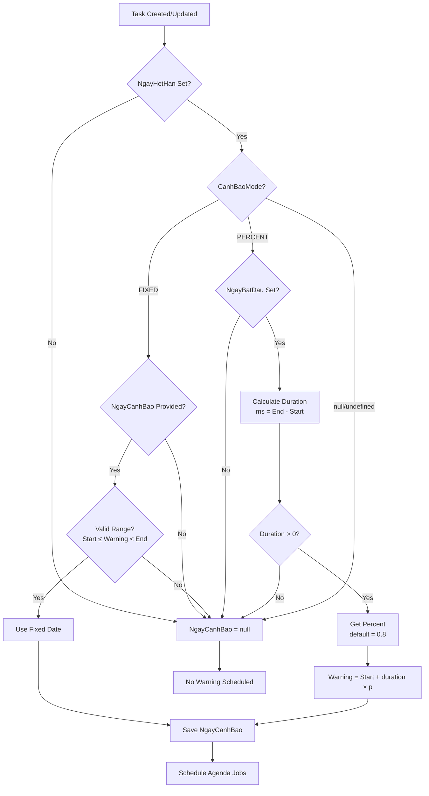
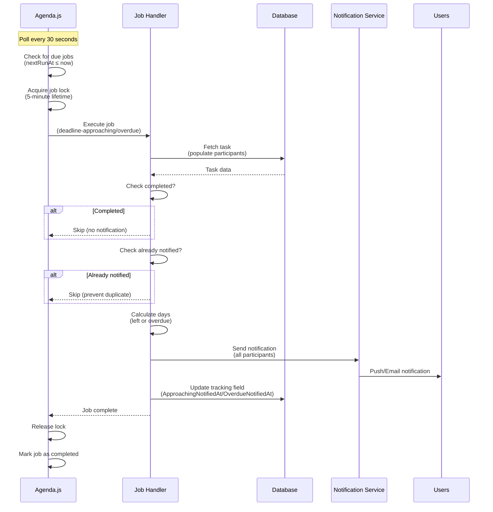

# ⏰ DEADLINE NOTIFICATIONS - CongViec Module

> **File**: 07_DEADLINE_NOTIFICATIONS.md  
> **Module**: QuanLyCongViec/CongViec  
> **Mục tiêu**: Hiểu hệ thống tính toán deadline và notifications tự động với Agenda.js

---

## 📋 MỤC LỤC

1. [Tổng quan Deadline System](#1-tổng-quan-deadline-system)
2. [NgayCanhBao Calculation](#2-ngaycanhbao-calculation)
3. [Agenda.js Scheduler](#3-agendajs-scheduler)
4. [Deadline Jobs](#4-deadline-jobs)
5. [Notification Triggers](#5-notification-triggers)
6. [Deadline Status Virtual](#6-deadline-status-virtual)
7. [Job Lifecycle Management](#7-job-lifecycle-management)
8. [Code References](#8-code-references)

---

## 1. TỔNG QUAN DEADLINE SYSTEM

### 1.1. System Architecture

```
┌─────────────────────────────────────────────────────────┐
│          Deadline Notification Architecture              │
├─────────────────────────────────────────────────────────┤
│                                                          │
│  Task Creation/Update                                   │
│  └─ Compute NgayCanhBao                                 │
│      ├─ Mode: FIXED (user-specified date)              │
│      └─ Mode: PERCENT (80% of duration)                │
│           │                                              │
│           ├─→ Schedule Agenda jobs                      │
│           │   ├─ deadline-approaching (at NgayCanhBao) │
│           │   └─ deadline-overdue (at NgayHetHan)      │
│           │                                              │
│           └─→ Agenda.js Scheduler                       │
│               ├─ Poll every 30 seconds                  │
│               ├─ Execute jobs at scheduled time         │
│               └─ Lock jobs (5 min) to prevent duplicates│
│                   │                                      │
│                   ├─→ Job: deadline-approaching         │
│                   │   ├─ Check task not completed       │
│                   │   ├─ Check not already notified     │
│                   │   ├─ Send notification              │
│                   │   └─ Mark ApproachingNotifiedAt     │
│                   │                                      │
│                   └─→ Job: deadline-overdue             │
│                       ├─ Check task not completed       │
│                       ├─ Check not already notified     │
│                       ├─ Send notification              │
│                       └─ Mark OverdueNotifiedAt         │
│                                                          │
└─────────────────────────────────────────────────────────┘
```

### 1.2. Design Principles

**1. Two-Mode Warning System**:

- **FIXED**: User specifies exact warning date (manual control)
- **PERCENT**: Auto-calculate at % of duration (default 80%)

**2. Job-Based Scheduling**:

- Persistent jobs stored in MongoDB (`agendaJobs` collection)
- Survives server restarts
- Distributed execution with job locking

**3. Duplicate Prevention**:

- `ApproachingNotifiedAt` / `OverdueNotifiedAt` tracking fields
- Check before sending notification
- Job-level locks (5-minute timeout)

**4. Graceful Handling**:

- Skip completed tasks
- Skip already-notified tasks
- Log errors without blocking other jobs

---

## 2. NGAYCANHBAO CALCULATION

### 2.1. Calculation Modes

```
┌─────────────────────────────────────────────────────────┐
│            NgayCanhBao Calculation Modes                 │
├─────────────────────────────────────────────────────────┤
│                                                          │
│  Mode 1: FIXED (Manual Date)                            │
│  ┌────────────────────────────────────────────────┐    │
│  │ User Input: NgayCanhBao = "2026-01-10"        │    │
│  │                                                 │    │
│  │ Validation:                                     │    │
│  │ ✅ NgayBatDau ≤ NgayCanhBao < NgayHetHan       │    │
│  │                                                 │    │
│  │ Timeline:                                       │    │
│  │ [Start]────[Warning]────────[Deadline]         │    │
│  │  1/5        1/10             1/15              │    │
│  └────────────────────────────────────────────────┘    │
│                                                          │
│  Mode 2: PERCENT (Auto Calculation)                     │
│  ┌────────────────────────────────────────────────┐    │
│  │ Input: CanhBaoSapHetHanPercent = 0.8 (80%)    │    │
│  │                                                 │    │
│  │ Formula:                                        │    │
│  │ duration = NgayHetHan - NgayBatDau             │    │
│  │ NgayCanhBao = NgayBatDau + (duration × 0.8)   │    │
│  │                                                 │    │
│  │ Example:                                        │    │
│  │ Start: 1/1, End: 1/11 → Duration: 10 days     │    │
│  │ Warning: 1/1 + (10 × 0.8) = 1/9               │    │
│  │                                                 │    │
│  │ Timeline:                                       │    │
│  │ [Start]─────────[80%]─────[Deadline]          │    │
│  │  1/1            1/9        1/11                │    │
│  └────────────────────────────────────────────────┘    │
│                                                          │
└─────────────────────────────────────────────────────────┘
```

### 2.2. Implementation

**File**: `congViec.service.js` - Line 639

```javascript
function computeNgayCanhBao({
  mode,
  ngayBatDau,
  ngayHetHan,
  fixedNgayCanhBao,
  percent,
}) {
  const DEFAULT_PERCENT = 0.8;
  const start = ngayBatDau ? new Date(ngayBatDau) : null;
  const end = ngayHetHan ? new Date(ngayHetHan) : null;

  // ✅ Cannot calculate without deadline
  if (!end) return null;

  // ✅ FIXED MODE: Use user-provided date with validation
  if (mode === "FIXED") {
    if (!fixedNgayCanhBao) return null;
    const fixed = new Date(fixedNgayCanhBao);

    // Validate: must be in [start, end) range
    if (start && !(fixed >= start && fixed < end)) return null;

    return fixed;
  }

  // ✅ PERCENT MODE: Calculate from duration
  const p = typeof percent === "number" ? percent : DEFAULT_PERCENT;

  // Require start date for percent calculation
  if (!start) return null;

  const ms = end.getTime() - start.getTime();
  if (ms <= 0) return null; // Invalid: end before start

  // Calculate warning time
  const t = start.getTime() + Math.floor(ms * p);
  return new Date(t);
}
```

### 2.3. Recompute Logic

**Triggered when**: NgayBatDau, NgayHetHan, or mode changes

**File**: `congViec.service.js` - Line 666

```javascript
function recomputeWarningIfNeeded(cv, changed = {}) {
  try {
    const mode = cv.CanhBaoMode;
    const start = cv.NgayBatDau;
    const end = cv.NgayHetHan;

    // ✅ Cannot compute without deadline
    if (!end) return;

    // ✅ PERCENT MODE: Recalculate on date changes
    if (mode === "PERCENT") {
      if (!start) return;

      const p =
        typeof cv.CanhBaoSapHetHanPercent === "number"
          ? cv.CanhBaoSapHetHanPercent
          : 0.8;

      cv.NgayCanhBao = computeNgayCanhBao({
        mode: "PERCENT",
        ngayBatDau: start,
        ngayHetHan: end,
        percent: p,
      });
    }

    // ✅ FIXED MODE: Validate still in valid range
    else if (mode === "FIXED") {
      if (!cv.NgayCanhBao) return;

      const fixed = new Date(cv.NgayCanhBao);

      // Check if fixed date is now out of range → nullify
      if (start && !(fixed >= start && fixed < end)) {
        cv.NgayCanhBao = null;
      } else if (!start && fixed >= end) {
        cv.NgayCanhBao = null;
      }
    }
  } catch (_) {
    // Swallow error (non-critical)
  }
}
```

**Called in**:

- `transitionCongViec()` - After GIAO_VIEC action
- `updateCongViec()` - When dates change

### 2.4. Calculation Flow



### 2.5. Edge Cases

**Case 1: No start date with PERCENT mode**

```javascript
// Result: NgayCanhBao = null (cannot calculate)
{
  CanhBaoMode: "PERCENT",
  NgayBatDau: null,
  NgayHetHan: "2026-01-15",
}
```

**Case 2: Warning date after deadline**

```javascript
// Result: NgayCanhBao = null (invalid)
{
  CanhBaoMode: "FIXED",
  NgayBatDau: "2026-01-01",
  NgayCanhBao: "2026-01-20",  // ❌ After deadline
  NgayHetHan: "2026-01-15",
}
```

**Case 3: Dates change after warning calculated**

```javascript
// recomputeWarningIfNeeded() will:
// - PERCENT mode: Recalculate automatically
// - FIXED mode: Validate range, nullify if out-of-bounds
```

---

## 3. AGENDA.JS SCHEDULER

### 3.1. Initialization

**File**: `agendaService.js` - Line 1

```javascript
const Agenda = require("agenda");

class AgendaService {
  constructor() {
    this.agenda = null;
    this.isReady = false;
  }

  async init(mongoUri) {
    const uri = mongoUri || process.env.MONGODB_URI;

    this.agenda = new Agenda({
      db: {
        address: uri,
        collection: "agendaJobs", // ← MongoDB collection for job persistence
        options: { useUnifiedTopology: true },
      },
      processEvery: "30 seconds", // ← Poll interval
      maxConcurrency: 10, // ← Max concurrent jobs across all types
      defaultConcurrency: 5, // ← Default per job type
    });

    // Event handlers
    this.agenda.on("ready", () => {
      console.log("[AgendaService] ✅ Connected to MongoDB");
      this.isReady = true;
    });

    this.agenda.on("error", (err) => {
      console.error("[AgendaService] ❌ Error:", err.message);
    });

    this.agenda.on("start", (job) => {
      console.log(`[AgendaService] Job started: ${job.attrs.name}`);
    });

    this.agenda.on("complete", (job) => {
      console.log(`[AgendaService] Job completed: ${job.attrs.name}`);
    });

    this.agenda.on("fail", (err, job) => {
      console.error(
        `[AgendaService] Job failed: ${job.attrs.name}`,
        err.message
      );
    });

    // Define jobs before starting
    this._defineJobs();

    // Start processing
    await this.agenda.start();
    console.log("[AgendaService] ✅ Started processing jobs");

    // Schedule recurring jobs (cleanup)
    await this._scheduleRecurringJobs();
  }
}
```

**Key Configuration**:

- **processEvery**: How often to check for due jobs (30 sec)
- **maxConcurrency**: Prevent server overload (10 jobs max)
- **Job persistence**: Stored in MongoDB, survives restarts

### 3.2. Job Definition

**File**: `agendaService.js` - Line 84

```javascript
_defineJobs() {
  try {
    const { defineDeadlineJobs } = require("../jobs/deadlineJobs");
    defineDeadlineJobs(this.agenda);  // ← Define approaching/overdue jobs

    this._defineCleanupJob();         // ← Define cleanup job
  } catch (error) {
    console.error("[AgendaService] Error defining jobs:", error.message);
  }
}
```

**File**: `deadlineJobs.js` - Line 13

```javascript
function defineDeadlineJobs(agenda) {
  // ✅ Job 1: deadline-approaching
  agenda.define(
    "deadline-approaching",
    {
      lockLifetime: 5 * 60 * 1000, // ← 5-minute lock
      concurrency: 5, // ← Max 5 concurrent
    },
    async (job) => {
      const { taskId, taskCode } = job.attrs.data;
      console.log(`[DeadlineJob] ⏰ Processing APPROACHING: ${taskCode}`);

      await processDeadlineApproaching(taskId);
    }
  );

  // ✅ Job 2: deadline-overdue
  agenda.define(
    "deadline-overdue",
    {
      lockLifetime: 5 * 60 * 1000,
      concurrency: 5,
    },
    async (job) => {
      const { taskId, taskCode } = job.attrs.data;
      console.log(`[DeadlineJob] ⚠️ Processing OVERDUE: ${taskCode}`);

      await processDeadlineOverdue(taskId);
    }
  );

  console.log(
    "[DeadlineJobs] ✅ Defined: deadline-approaching, deadline-overdue"
  );
}
```

**Job Options**:

- **lockLifetime**: Prevents duplicate execution (distributed lock)
- **concurrency**: Max concurrent executions per job type

### 3.3. Job Scheduling

**Triggered in**: `congViec.service.js` - After creating/updating task

```javascript
// Pseudo-code (actual implementation varies)
async function scheduleDeadlineJobs(congviecId) {
  const cv = await CongViec.findById(congviecId);

  // ✅ Cancel existing jobs (when dates change)
  await agendaService.cancel({
    "data.taskId": congviecId.toString(),
  });

  // ✅ Schedule approaching notification
  if (cv.NgayCanhBao) {
    await agendaService.schedule(cv.NgayCanhBao, "deadline-approaching", {
      taskId: cv._id.toString(),
      taskCode: cv.MaCongViec,
    });
  }

  // ✅ Schedule overdue notification
  if (cv.NgayHetHan) {
    await agendaService.schedule(cv.NgayHetHan, "deadline-overdue", {
      taskId: cv._id.toString(),
      taskCode: cv.MaCongViec,
    });
  }
}
```

### 3.4. Cleanup Job

**Purpose**: Remove completed jobs to prevent database bloat

**File**: `agendaService.js` - Line 98

```javascript
_defineCleanupJob() {
  this.agenda.define(
    "cleanup-completed-jobs",
    { priority: "low", concurrency: 1 },
    async (job) => {
      console.log("[AgendaService] 🧹 Starting cleanup of completed jobs...");

      try {
        const result = await this.agenda.cancel({
          lastFinishedAt: { $exists: true },  // ← Job completed
          nextRunAt: null,                    // ← No next run scheduled
          name: { $ne: "cleanup-completed-jobs" },  // ← Don't delete self
        });

        console.log(`[AgendaService] 🧹 Cleanup complete: removed ${result} old job(s)`);
      } catch (err) {
        console.error("[AgendaService] 🧹 Cleanup error:", err.message);
      }
    }
  );
}

async _scheduleRecurringJobs() {
  // Run cleanup daily at 3:00 AM
  await this.agenda.every("0 3 * * *", "cleanup-completed-jobs");
  console.log("[AgendaService] 🧹 Cleanup job scheduled (daily at 3:00 AM)");
}
```

---

## 4. DEADLINE JOBS

### 4.1. Approaching Job Handler

**File**: `deadlineJobs.js` - Line 64

```javascript
async function processDeadlineApproaching(taskId) {
  // ✅ 1. Fetch task with populated fields
  const task = await CongViec.findById(taskId)
    .populate("NguoiChinhID", "_id HoTen")
    .populate("NguoiGiaoViecID", "_id HoTen")
    .populate("NguoiThamGia.NhanVienID", "_id HoTen");

  if (!task) {
    console.log(`[DeadlineJob] Task ${taskId} not found, skipping`);
    return;
  }

  // ✅ 2. Check if task is already completed
  if (task.TrangThai === "HOAN_THANH") {
    console.log(`[DeadlineJob] Task ${task.MaCongViec} completed, skipping`);
    return;
  }

  // ✅ 3. Check if already notified (prevent duplicate)
  if (task.ApproachingNotifiedAt) {
    console.log(
      `[DeadlineJob] Task ${task.MaCongViec} already notified APPROACHING, skipping`
    );
    return;
  }

  // ✅ 4. Calculate days left
  const now = new Date();
  const deadline = new Date(task.NgayHetHan);
  const msLeft = deadline - now;
  const daysLeft = Math.ceil(msLeft / (1000 * 60 * 60 * 24));

  // ✅ 5. Fire notification via notificationService
  const arrNguoiLienQuanID = [
    task.NguoiChinhID?._id?.toString(),
    task.NguoiGiaoViecID?._id?.toString(),
    ...(task.NguoiThamGia || []).map((p) => p.NhanVienID?._id?.toString()),
  ].filter((id) => id);

  await notificationService.send({
    type: "congviec-deadline-approaching",
    data: {
      _id: task._id.toString(),
      arrNguoiLienQuanID: [...new Set(arrNguoiLienQuanID)],
      MaCongViec: task.MaCongViec,
      TieuDe: task.TieuDe,
      NgayHetHan: task.NgayHetHan,
      SoNgayConLai: Math.max(0, daysLeft),
    },
  });

  // ✅ 6. Mark as notified to prevent duplicates
  await CongViec.findByIdAndUpdate(taskId, {
    ApproachingNotifiedAt: new Date(),
  });

  console.log(
    `[DeadlineJob] ✅ APPROACHING notification sent for ${task.MaCongViec} (${daysLeft} days left)`
  );
}
```

**Key Steps**:

1. Fetch task with relationships
2. Skip if completed
3. Skip if already notified
4. Calculate remaining days
5. Send notification to all participants
6. Mark ApproachingNotifiedAt

### 4.2. Overdue Job Handler

**File**: `deadlineJobs.js` - Line 130

```javascript
async function processDeadlineOverdue(taskId) {
  // ✅ 1. Fetch task
  const task = await CongViec.findById(taskId)
    .populate("NguoiChinhID", "_id HoTen")
    .populate("NguoiGiaoViecID", "_id HoTen")
    .populate("NguoiThamGia.NhanVienID", "_id HoTen");

  if (!task) {
    console.log(`[DeadlineJob] Task ${taskId} not found, skipping`);
    return;
  }

  // ✅ 2. Check if task is already completed
  if (task.TrangThai === "HOAN_THANH") {
    console.log(`[DeadlineJob] Task ${task.MaCongViec} completed, skipping`);
    return;
  }

  // ✅ 3. Check if already notified
  if (task.OverdueNotifiedAt) {
    console.log(
      `[DeadlineJob] Task ${task.MaCongViec} already notified OVERDUE, skipping`
    );
    return;
  }

  // ✅ 4. Calculate days overdue
  const now = new Date();
  const deadline = new Date(task.NgayHetHan);
  const msOverdue = now - deadline;
  const daysOverdue = Math.floor(msOverdue / (1000 * 60 * 60 * 24));

  // ✅ 5. Fire notification via notificationService
  const arrNguoiLienQuanID = [
    task.NguoiChinhID?._id?.toString(),
    task.NguoiGiaoViecID?._id?.toString(),
    ...(task.NguoiThamGia || []).map((p) => p.NhanVienID?._id?.toString()),
  ].filter((id) => id);

  await notificationService.send({
    type: "congviec-deadline-overdue",
    data: {
      _id: task._id.toString(),
      arrNguoiLienQuanID: [...new Set(arrNguoiLienQuanID)],
      MaCongViec: task.MaCongViec,
      TieuDe: task.TieuDe,
      NgayHetHan: task.NgayHetHan,
      SoNgayQuaHan: Math.max(0, daysOverdue),
    },
  });

  // ✅ 6. Mark as notified
  await CongViec.findByIdAndUpdate(taskId, {
    OverdueNotifiedAt: new Date(),
  });

  console.log(
    `[DeadlineJob] ✅ OVERDUE notification sent for ${task.MaCongViec} (${daysOverdue} days overdue)`
  );
}
```

**Differences from Approaching**:

- Calculates days **overdue** (past deadline)
- Different notification type (`deadline-overdue`)
- Updates `OverdueNotifiedAt` field

### 4.3. Job Execution Flow



---

## 5. NOTIFICATION TRIGGERS

### 5.1. Notification Types

| Type                            | Trigger Time | Recipients       | Data Fields                      |
| ------------------------------- | ------------ | ---------------- | -------------------------------- |
| `congviec-deadline-approaching` | NgayCanhBao  | All participants | MaCongViec, TieuDe, SoNgayConLai |
| `congviec-deadline-overdue`     | NgayHetHan   | All participants | MaCongViec, TieuDe, SoNgayQuaHan |

### 5.2. Recipient Calculation

**Always includes**:

- NguoiChinhID (main person)
- NguoiGiaoViecID (assigner)
- All NguoiThamGia (participants)

**Code**:

```javascript
const arrNguoiLienQuanID = [
  task.NguoiChinhID?._id?.toString(),
  task.NguoiGiaoViecID?._id?.toString(),
  ...(task.NguoiThamGia || []).map((p) => p.NhanVienID?._id?.toString()),
].filter((id) => id);

// Remove duplicates
const uniqueRecipients = [...new Set(arrNguoiLienQuanID)];
```

### 5.3. Tracking Fields

**Purpose**: Prevent duplicate notifications

**Schema**: `CongViec.js` - Line 121

```javascript
{
  ApproachingNotifiedAt: {
    type: Date,
    default: null,
    description: "Thời điểm đã gửi thông báo sắp đến hạn",
  },
  OverdueNotifiedAt: {
    type: Date,
    default: null,
    description: "Thời điểm đã gửi thông báo quá hạn",
  },
}
```

**Usage**:

```javascript
// Check before sending
if (task.ApproachingNotifiedAt) {
  console.log("Already notified, skipping");
  return;
}

// Mark after sending
await CongViec.findByIdAndUpdate(taskId, {
  ApproachingNotifiedAt: new Date(),
});
```

### 5.4. Notification Content

**Approaching Example**:

```javascript
{
  type: "congviec-deadline-approaching",
  data: {
    _id: "64f3cb6035c717ab00d75b8a",
    arrNguoiLienQuanID: ["64f3cb60...", "64f3cb61..."],
    MaCongViec: "CV-00123",
    TieuDe: "Hoàn thành báo cáo tháng 1",
    NgayHetHan: "2026-01-15T00:00:00.000Z",
    SoNgayConLai: 3,  // ← Days until deadline
  }
}
```

**Overdue Example**:

```javascript
{
  type: "congviec-deadline-overdue",
  data: {
    _id: "64f3cb6035c717ab00d75b8a",
    arrNguoiLienQuanID: ["64f3cb60...", "64f3cb61..."],
    MaCongViec: "CV-00123",
    TieuDe: "Hoàn thành báo cáo tháng 1",
    NgayHetHan: "2026-01-15T00:00:00.000Z",
    SoNgayQuaHan: 2,  // ← Days past deadline
  }
}
```

---

## 6. DEADLINE STATUS VIRTUAL

### 6.1. Virtual Field

**Purpose**: Calculate deadline status on-the-fly (not stored in DB)

**File**: `CongViec.js` - Line 294

```javascript
// Virtual field: TinhTrangThoiHan
congViecSchema.virtual("TinhTrangThoiHan").get(function () {
  try {
    if (!this) return null;

    const now = new Date();
    const hetHan = this.NgayHetHan ? new Date(this.NgayHetHan) : null;
    const canhBao = this.NgayCanhBao ? new Date(this.NgayCanhBao) : null;

    // ✅ Cannot calculate without deadline
    if (!hetHan) return null;

    // ✅ Completed tasks
    if (this.TrangThai === "HOAN_THANH") {
      if (this.NgayHoanThanh && hetHan) {
        return this.NgayHoanThanh > hetHan
          ? "HOAN_THANH_TRE_HAN"
          : "HOAN_THANH_DUNG_HAN";
      }
      return "HOAN_THANH_DUNG_HAN";
    }

    // ✅ Active tasks
    if (now > hetHan) return "QUA_HAN";
    if (canhBao && now >= canhBao && now < hetHan) return "SAP_QUA_HAN";
    return "DUNG_HAN";
  } catch (_) {
    return null;
  }
});
```

### 6.2. Status Values

| Status                | Condition                        | Display              |
| --------------------- | -------------------------------- | -------------------- |
| `null`                | No NgayHetHan set                | No deadline          |
| `DUNG_HAN`            | now < NgayCanhBao                | On time (green)      |
| `SAP_QUA_HAN`         | NgayCanhBao ≤ now < NgayHetHan   | Approaching (yellow) |
| `QUA_HAN`             | now ≥ NgayHetHan (not completed) | Overdue (red)        |
| `HOAN_THANH_DUNG_HAN` | Completed before deadline        | Completed on time    |
| `HOAN_THANH_TRE_HAN`  | Completed after deadline         | Completed late       |

### 6.3. Status Diagram

```
Timeline:
────────────────────────────────────────────────────────────►
[Start]        [NgayCanhBao]          [NgayHetHan]     [Now]
  │                  │                      │
  │◄─ DUNG_HAN ────►│◄─ SAP_QUA_HAN ─────►│◄─ QUA_HAN ──►

Completed Before:
  │                  │                      │ [Complete]
  └──────────────────┴──────────────────────┴─────┘
                 HOAN_THANH_DUNG_HAN

Completed After:
  │                  │                      │        [Complete]
  └──────────────────┴──────────────────────┴───────────┘
                                           HOAN_THANH_TRE_HAN
```

### 6.4. Frontend Usage

```javascript
// Virtual field accessible in toJSON
const task = await CongViec.findById(id).lean();

// ❌ Virtual NOT in lean() result
console.log(task.TinhTrangThoiHan); // undefined

// ✅ Virtual available without lean()
const taskWithVirtual = await CongViec.findById(id);
console.log(taskWithVirtual.TinhTrangThoiHan); // "SAP_QUA_HAN"

// ✅ Or convert to JSON
const json = taskWithVirtual.toJSON();
console.log(json.TinhTrangThoiHan); // "SAP_QUA_HAN"
```

**DTO Mapping**: Service layer calculates status manually for lean queries

---

## 7. JOB LIFECYCLE MANAGEMENT

### 7.1. Job Creation

**When**: Task created/updated with NgayCanhBao or NgayHetHan

```javascript
// Pseudo-code
async function onTaskSaved(taskId) {
  const task = await CongViec.findById(taskId);

  // ✅ 1. Cancel existing jobs (dates may have changed)
  await agendaService.cancel({
    "data.taskId": taskId.toString(),
  });

  // ✅ 2. Schedule approaching notification
  if (task.NgayCanhBao && task.TrangThai !== "HOAN_THANH") {
    await agendaService.schedule(task.NgayCanhBao, "deadline-approaching", {
      taskId: taskId.toString(),
      taskCode: task.MaCongViec,
    });
  }

  // ✅ 3. Schedule overdue notification
  if (task.NgayHetHan && task.TrangThai !== "HOAN_THANH") {
    await agendaService.schedule(task.NgayHetHan, "deadline-overdue", {
      taskId: taskId.toString(),
      taskCode: task.MaCongViec,
    });
  }
}
```

### 7.2. Job Cancellation

**When**: Task completed or deleted

```javascript
// Pseudo-code
async function onTaskCompleted(taskId) {
  // Cancel all pending deadline jobs
  await agendaService.cancel({
    "data.taskId": taskId.toString(),
  });

  console.log(`[Jobs] Cancelled deadline jobs for task ${taskId}`);
}
```

### 7.3. Job Persistence

**MongoDB Collection**: `agendaJobs`

**Schema**:

```javascript
{
  _id: ObjectId("..."),
  name: "deadline-approaching",
  data: {
    taskId: "64f3cb6035c717ab00d75b8a",
    taskCode: "CV-00123"
  },
  nextRunAt: ISODate("2026-01-10T00:00:00.000Z"),
  lastRunAt: null,
  lastFinishedAt: null,
  lockedAt: null,
  failCount: 0,
  failedAt: null,
  priority: 0
}
```

**Benefits**:

- Survives server restarts
- Visible in MongoDB for debugging
- Can manually reschedule if needed

### 7.4. Error Handling

**Job-level**:

```javascript
agenda.define("deadline-approaching", async (job) => {
  try {
    await processDeadlineApproaching(taskId);
  } catch (error) {
    console.error(`[DeadlineJob] ❌ Error:`, error.message);
    throw error; // ← Let Agenda handle retry
  }
});
```

**Agenda retries**: Automatic retry with exponential backoff

**Manual intervention**: Check `agendaJobs` collection for failed jobs

---

## 8. CODE REFERENCES

### 8.1. Backend Files

| File                  | Lines   | Description                           |
| --------------------- | ------- | ------------------------------------- |
| `CongViec.js`         | 107-133 | Schema: NgayCanhBao, tracking fields  |
| `CongViec.js`         | 294-316 | Virtual: TinhTrangThoiHan calculation |
| `congViec.service.js` | 639-664 | computeNgayCanhBao() function         |
| `congViec.service.js` | 666-694 | recomputeWarningIfNeeded() function   |
| `agendaService.js`    | 1-237   | Agenda initialization, job scheduling |
| `deadlineJobs.js`     | 1-206   | Job definitions & handlers            |
| `deadlineJobs.js`     | 64-128  | processDeadlineApproaching()          |
| `deadlineJobs.js`     | 130-194 | processDeadlineOverdue()              |

### 8.2. Key Functions

**NgayCanhBao Calculation**:

```javascript
// PERCENT mode
const ms = end.getTime() - start.getTime();
const t = start.getTime() + Math.floor(ms * percent);
return new Date(t);

// FIXED mode (with validation)
if (start && !(fixed >= start && fixed < end)) return null;
return fixed;
```

**Job Scheduling**:

```javascript
await agendaService.schedule(task.NgayCanhBao, "deadline-approaching", {
  taskId,
  taskCode,
});
```

**Duplicate Prevention**:

```javascript
if (task.ApproachingNotifiedAt) return; // Skip
await CongViec.findByIdAndUpdate(taskId, {
  ApproachingNotifiedAt: new Date(),
});
```

---

## 📊 SUMMARY

### Checklist để hiểu Deadline Notifications

- [ ] Hiểu NgayCanhBao calculation (FIXED vs PERCENT)
- [ ] Nắm Agenda.js initialization (MongoDB persistence)
- [ ] Biết job definition (approaching, overdue)
- [ ] Hiểu job execution flow (poll, lock, execute)
- [ ] Nắm duplicate prevention (tracking fields)
- [ ] Biết TinhTrangThoiHan virtual calculation
- [ ] Hiểu job lifecycle (create, cancel, cleanup)
- [ ] Nắm notification data structure

### Key Takeaways

1. **Two-Mode Warning** - FIXED (manual) vs PERCENT (auto-calculated)
2. **Persistent Jobs** - Stored in MongoDB, survive restarts
3. **Duplicate Prevention** - ApproachingNotifiedAt/OverdueNotifiedAt tracking
4. **Job Locking** - 5-minute lock prevents race conditions
5. **Graceful Handling** - Skip completed/notified tasks
6. **Virtual Status** - TinhTrangThoiHan calculated on-the-fly
7. **Automatic Cleanup** - Daily removal of completed jobs
8. **Notification Integration** - Uses notificationService for delivery

### Performance Characteristics

✅ **Efficient**:

- Poll interval: 30 seconds (configurable)
- Job locking prevents duplicates
- Concurrent execution (5 jobs per type)
- Cleanup prevents database bloat

⚠️ **Considerations**:

- Job latency: Up to 30 seconds after trigger time
- Lock timeout: 5 minutes (failed job may rerun)
- No retry backoff configuration (uses Agenda defaults)

### Design Trade-offs

**✅ Pros**:

- Persistent jobs (survive server crashes)
- Distributed lock (multi-server safe)
- Flexible warning modes (manual/auto)
- Built-in retry mechanism

**⚠️ Cons**:

- 30-second poll interval (not real-time)
- MongoDB dependency (jobs stored in DB)
- No manual trigger for testing
- Cleanup at fixed time only (3:00 AM)

### Future Enhancements

1. **Manual trigger endpoint** for testing
2. **Configurable poll interval** per environment
3. **Retry backoff configuration** for failed jobs
4. **Dashboard** to monitor job status
5. **Webhook support** for external systems
6. **Multiple notification channels** (SMS, Slack)

---

**Next**: [08_ROUTINE_TASK_INTEGRATION.md](./08_ROUTINE_TASK_INTEGRATION.md) - KPI system integration, NhiemVuThuongQuy relationships

---

**Ngày tạo**: 5/1/2026  
**Phiên bản**: 1.0  
**Tác giả**: Documentation Team
