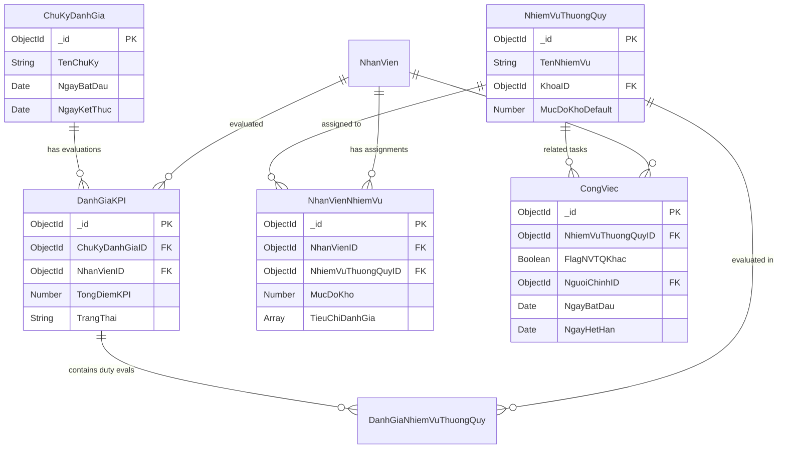
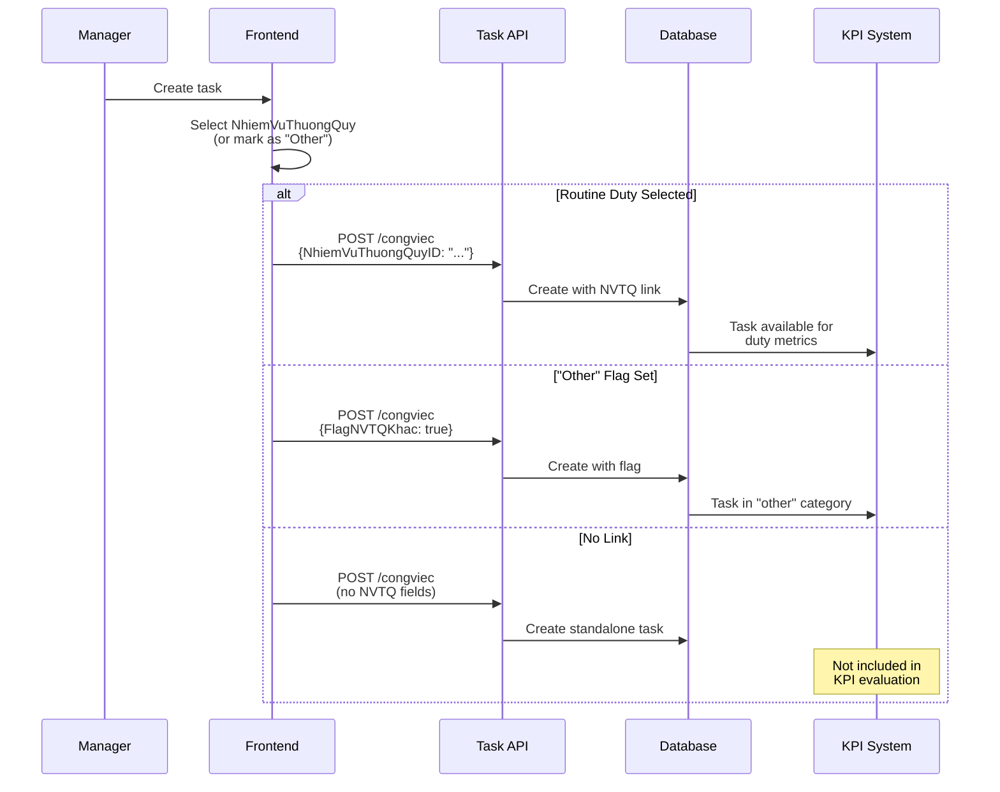
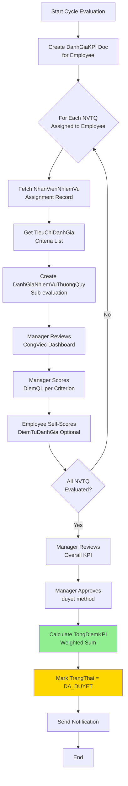

# 🔗 ROUTINE TASK INTEGRATION - CongViec Module

> **File**: 08_ROUTINE_TASK_INTEGRATION.md  
> **Module**: QuanLyCongViec/CongViec  
> **Mục tiêu**: Hiểu mối quan hệ giữa CongViec và KPI system (NhiemVuThuongQuy)

---

## 📋 MỤC LỤC

1. [Tổng quan KPI System](#1-tổng-quan-kpi-system)
2. [NVTQ-CongViec Relationship](#2-nvtq-congviec-relationship)
3. [Cycle-Based Filtering](#3-cycle-based-filtering)
4. [Dashboard Metrics](#4-dashboard-metrics)
5. [KPI Evaluation Flow](#5-kpi-evaluation-flow)
6. ["Other" Tasks Category](#6-other-tasks-category)
7. [Code References](#7-code-references)

---

## 1. TỔNG QUAN KPI SYSTEM

### 1.1. System Architecture

```
┌─────────────────────────────────────────────────────────┐
│         KPI System Architecture Overview                 │
├─────────────────────────────────────────────────────────┤
│                                                          │
│  ChuKyDanhGia (Evaluation Cycle)                        │
│  ├─ NgayBatDau: 2026-01-01                              │
│  ├─ NgayKetThuc: 2026-03-31                             │
│  └─ TenChuKy: "Q1 2026"                                 │
│      │                                                   │
│      └─→ DanhGiaKPI (Employee KPI Evaluation)           │
│          ├─ NhanVienID: Employee                        │
│          ├─ NguoiDanhGiaID: Manager                     │
│          ├─ TongDiemKPI: 85.5 (calculated)              │
│          └─ TrangThai: CHUA_DUYET | DA_DUYET            │
│              │                                           │
│              └─→ DanhGiaNhiemVuThuongQuy (Duty Eval)    │
│                  ├─ NhiemVuThuongQuyID: Routine Duty    │
│                  ├─ DiemQL: Manager score               │
│                  ├─ DiemTuDanhGia: Self score           │
│                  └─ ChiTietDiem: Score breakdown        │
│                      │                                   │
│                      └─→ NhanVienNhiemVu (Assignment)   │
│                          ├─ NhiemVuThuongQuyID          │
│                          ├─ NhanVienID                  │
│                          ├─ MucDoKho: 5.0               │
│                          └─ TieuChiDanhGia: Criteria    │
│                              │                           │
│                              └─→ CongViec (Tasks)        │
│                                  ├─ NhiemVuThuongQuyID  │
│                                  ├─ FlagNVTQKhac        │
│                                  ├─ NguoiChinhID        │
│                                  └─ NgayBatDau/HetHan   │
│                                                          │
│  Key Concepts:                                           │
│  • Tasks linked to routine duties via NhiemVuThuongQuyID│
│  • Cycle-based filtering (overlap logic)               │
│  • KPI calculation from task metrics                   │
│  • "Other" tasks (FlagNVTQKhac = true)                 │
└─────────────────────────────────────────────────────────┘
```

### 1.2. Entity Relationships



### 1.3. Design Principles

**1. Single Routine Duty Selection**:

- Each task links to ONE NhiemVuThuongQuy (or none)
- Cannot link to multiple duties simultaneously
- "Other" flag (FlagNVTQKhac) for non-routine tasks

**2. Cycle-Based Evaluation**:

- Tasks filtered by cycle date range
- Overlap logic: Task period intersects cycle period
- Metrics calculated per cycle, per employee, per duty

**3. Bottom-Up Metrics**:

- Task metrics (completion, lateness) → Duty evaluation → KPI score
- Real-time dashboard data from CongViec collection
- Snapshot on KPI approval (TongDiemKPI calculated)

**4. Flexible Categorization**:

- Routine tasks: NhiemVuThuongQuyID set, FlagNVTQKhac = false
- "Other" tasks: FlagNVTQKhac = true (for misc work)
- No link: Both null (administrative tasks)

---

## 2. NVTQ-CONGVIEC RELATIONSHIP

### 2.1. Schema Fields

**File**: `CongViec.js` - Line 151

```javascript
{
  // Link to routine duty (single-select)
  NhiemVuThuongQuyID: {
    type: Schema.ObjectId,
    ref: "NhiemVuThuongQuy",
    default: null,
    index: true,
  },

  // Flag for "other" tasks (not linked to specific duty)
  FlagNVTQKhac: {
    type: Boolean,
    default: false,
    index: true,
  },
}
```

**Indexed for**: Fast filtering in KPI dashboard queries

### 2.2. Link Patterns

**Pattern 1: Routine Task**

```javascript
{
  _id: "64f3cb6035c717ab00d75b8a",
  TieuDe: "Kiểm tra hồ sơ bệnh án",
  NhiemVuThuongQuyID: "64f3cb6035c717ab00d75b8b",  // ← Linked to duty
  FlagNVTQKhac: false,
  NguoiChinhID: "64f3cb6035c717ab00d75b8c",
}
```

**Pattern 2: "Other" Task**

```javascript
{
  _id: "64f3cb6035c717ab00d75b8d",
  TieuDe: "Tham gia hội thảo khoa học",
  NhiemVuThuongQuyID: null,       // ← No specific duty
  FlagNVTQKhac: true,              // ← Flagged as "other"
  NguoiChinhID: "64f3cb6035c717ab00d75b8c",
}
```

**Pattern 3: No Link**

```javascript
{
  _id: "64f3cb6035c717ab00d75b8e",
  TieuDe: "Meeting nội bộ",
  NhiemVuThuongQuyID: null,
  FlagNVTQKhac: false,             // ← Neither routine nor "other"
  NguoiChinhID: "64f3cb6035c717ab00d75b8c",
}
```

### 2.3. Assignment Flow



### 2.4. Validation Rules

**Cannot have both**:

```javascript
// ❌ INVALID: Both NVTQ and "Other" flag
{
  NhiemVuThuongQuyID: "64f3cb6035c717ab00d75b8b",
  FlagNVTQKhac: true,  // Conflict!
}

// ✅ VALID: One or the other (or neither)
{
  NhiemVuThuongQuyID: "64f3cb6035c717ab00d75b8b",
  FlagNVTQKhac: false,
}
```

**Current enforcement**: No explicit validation (left to frontend logic)

---

## 3. CYCLE-BASED FILTERING

### 3.1. Date Range Overlap Logic

**Concept**: Task included in cycle if work period overlaps cycle period

```
Cycle:   [─────────────────────]
         1/1                  3/31

Task 1:      [────]              ✅ Fully inside
             1/15  1/20

Task 2:  [────────]              ✅ Starts before, ends inside
        12/15     2/1

Task 3:            [────────]    ✅ Starts inside, ends after
                  3/1      4/15

Task 4:  [────────────────────]  ✅ Spans entire cycle
        12/1                 4/30

Task 5:                       [────]  ❌ Fully outside
                             4/1   4/15
```

### 3.2. Query Implementation

**File**: `congViec.service.js` - Line 3394

```javascript
const baseFilter = {
  NhiemVuThuongQuyID: toObjectId(nhiemVuThuongQuyID),
  NguoiChinhID: toObjectId(nhanVienID),
  isDeleted: { $ne: true },

  // ✅ OVERLAP LOGIC with fallback
  $or: [
    // Case 1: Both dates exist - use overlap logic
    {
      NgayBatDau: { $ne: null, $lte: denNgay }, // Start ≤ cycle end
      NgayHetHan: { $ne: null, $gte: tuNgay }, // End ≥ cycle start
    },

    // Case 2: Only NgayHetHan exists (no start date)
    {
      NgayBatDau: null,
      NgayHetHan: { $ne: null, $gte: tuNgay, $lte: denNgay },
    },

    // Case 3: Fallback to createdAt when no work dates
    {
      NgayBatDau: null,
      NgayHetHan: null,
      createdAt: { $gte: tuNgay, $lte: denNgay },
    },
  ],
};
```

**Benefits**:

- ✅ Captures tasks spanning cycle boundaries
- ✅ Handles missing date fields gracefully
- ✅ Fallback to creation date for undated tasks

### 3.3. Index Optimization

**Compound indexes** for fast cycle filtering:

**File**: `CongViec.js` - Line 362

```javascript
// For getDashboardByNhiemVu
congViecSchema.index({
  NhiemVuThuongQuyID: 1,
  NguoiChinhID: 1,
  NgayBatDau: -1,
  NgayHetHan: -1,
});

// For getOtherTasksSummary
congViecSchema.index({
  NguoiChinhID: 1,
  FlagNVTQKhac: 1,
  NgayBatDau: -1,
  NgayHetHan: -1,
});

// For getCollabTasksSummary
congViecSchema.index({
  "NguoiThamGia.NhanVienID": 1,
  "NguoiThamGia.VaiTro": 1,
  NgayBatDau: -1,
  NgayHetHan: -1,
});
```

---

## 4. DASHBOARD METRICS

### 4.1. getDashboardByNhiemVu API

**Purpose**: Get metrics for ONE routine duty in ONE cycle for ONE employee

**Endpoint**: `GET /api/workmanagement/congviec/dashboard-by-nhiemvu`

**Parameters**:

```javascript
{
  nhiemVuThuongQuyID: "64f3cb6035c717ab00d75b8b",
  nhanVienID: "64f3cb6035c717ab00d75b8c",
  chuKyDanhGiaID: "64f3cb6035c717ab00d75b8d"
}
```

**File**: `congViec.service.js` - Line 3360

### 4.2. Parallel Aggregations

**5 metrics calculated in parallel**:

```javascript
const [
  statusDistribution,
  timeMetrics,
  collaborationMetrics,
  priorityBreakdown,
  taskList,
] = await Promise.all([
  // 1. Status distribution
  CongViec.aggregate([
    { $match: baseFilter },
    {
      $group: {
        _id: "$TrangThai",
        count: { $sum: 1 },
      },
    },
  ]),

  // 2. Time-based metrics (completed tasks only)
  CongViec.aggregate([
    { $match: { ...baseFilter, TrangThai: "HOAN_THANH" } },
    {
      $group: {
        _id: null,
        total: { $sum: 1 },
        onTime: {
          $sum: { $cond: [{ $eq: ["$HoanThanhTreHan", false] }, 1, 0] },
        },
        late: { $sum: { $cond: [{ $eq: ["$HoanThanhTreHan", true] }, 1, 0] } },
        totalLateHours: {
          $sum: { $cond: ["$HoanThanhTreHan", "$SoGioTre", 0] },
        },
        maxLateHours: { $max: "$SoGioTre" },
        avgCompletionDays: {
          $avg: {
            $divide: [
              { $subtract: ["$NgayHoanThanh", "$NgayTiepNhanThucTe"] },
              1000 * 60 * 60 * 24,
            ],
          },
        },
      },
    },
  ]),

  // 3. Collaboration metrics
  CongViec.aggregate([
    { $match: baseFilter },
    {
      $lookup: {
        from: "binhluans",
        localField: "_id",
        foreignField: "CongViecID",
        as: "comments",
      },
    },
    {
      $group: {
        _id: null,
        avgTeamSize: { $avg: { $size: "$NguoiThamGia" } },
        totalComments: { $sum: { $size: "$comments" } },
        totalTasks: { $sum: 1 },
        multiPersonTasks: {
          $sum: { $cond: [{ $gt: [{ $size: "$NguoiThamGia" }, 1] }, 1, 0] },
        },
      },
    },
  ]),

  // 4. Priority breakdown
  CongViec.aggregate([
    { $match: baseFilter },
    {
      $group: {
        _id: "$MucDoUuTien",
        count: { $sum: 1 },
      },
    },
  ]),

  // 5. Task list (limited, sorted by recent)
  CongViec.find(baseFilter)
    .sort({ createdAt: -1 })
    .limit(50)
    .select("MaCongViec TieuDe TrangThai NgayHetHan PhanTramTienDoTong")
    .lean(),
]);
```

### 4.3. Response Structure

```javascript
{
  success: true,
  data: {
    // Basic info
    nhiemVuThuongQuyID: "...",
    nhanVienID: "...",
    chuKyDanhGiaID: "...",
    tuNgay: "2026-01-01",
    denNgay: "2026-03-31",

    // Status distribution
    totalTasks: 45,
    byStatus: {
      TAO_MOI: 2,
      DA_GIAO: 5,
      DANG_THUC_HIEN: 15,
      CHO_DUYET: 3,
      HOAN_THANH: 20,
    },

    // Time metrics
    completedTasks: 20,
    onTimeTasks: 18,
    lateTasks: 2,
    onTimeRate: 0.90,        // 90%
    lateRate: 0.10,          // 10%
    avgCompletionDays: 3.5,
    totalLateHours: 48,
    maxLateHours: 24,

    // Collaboration metrics
    avgTeamSize: 2.5,
    totalComments: 120,
    avgCommentsPerTask: 2.67,
    multiPersonTasks: 30,
    collaborationRate: 0.67,  // 67% have team

    // Priority breakdown
    byPriority: {
      THAP: 5,
      BINH_THUONG: 30,
      CAO: 8,
      KHAN_CAP: 2,
    },

    // Current status
    inProgress: 15,
    pending: 8,              // TAO_MOI + DA_GIAO + CHO_DUYET
    overdue: 3,              // Currently past deadline

    // Sample tasks
    recentTasks: [
      {
        MaCongViec: "CV-00123",
        TieuDe: "Kiểm tra hồ sơ bệnh án",
        TrangThai: "HOAN_THANH",
        NgayHetHan: "2026-01-15",
        PhanTramTienDoTong: 100,
      },
      // ... up to 50 tasks
    ],
  }
}
```

### 4.4. "Other" Tasks Summary

**Purpose**: Get metrics for FlagNVTQKhac tasks

**File**: `congViec.service.js` - Line 3673

```javascript
service.getOtherTasksSummary = async (nhanVienID, chuKyDanhGiaID) => {
  // Similar filter with FlagNVTQKhac = true
  const baseFilter = {
    NguoiChinhID: toObjectId(nhanVienID),
    FlagNVTQKhac: true, // ← "Other" tasks only
    isDeleted: { $ne: true },
    // ... same overlap logic
  };

  // Same aggregations as getDashboardByNhiemVu
  // Returns similar metrics structure
};
```

---

## 5. KPI EVALUATION FLOW

### 5.1. Complete Evaluation Process



### 5.2. Key Models

**DanhGiaKPI** (KPI Evaluation Document):

```javascript
{
  _id: ObjectId("..."),
  ChuKyDanhGiaID: ObjectId("..."),
  NhanVienID: ObjectId("..."),         // Employee being evaluated
  NguoiDanhGiaID: ObjectId("..."),     // Manager doing evaluation
  TongDiemKPI: 85.5,                   // Calculated on approval
  TrangThai: "DA_DUYET",               // CHUA_DUYET | DA_DUYET
  NgayDuyet: Date("2026-04-01"),
  NguoiDuyet: ObjectId("..."),
  LichSuDuyet: [...],                  // Audit trail
}
```

**DanhGiaNhiemVuThuongQuy** (Duty Sub-Evaluation):

```javascript
{
  _id: ObjectId("..."),
  DanhGiaKPIID: ObjectId("..."),       // Parent evaluation
  NhiemVuThuongQuyID: ObjectId("..."), // Routine duty
  DiemQL: 8.5,                         // Manager score
  DiemTuDanhGia: 8.0,                  // Self score (optional)
  ChiTietDiem: [                       // Score breakdown
    {
      TenTieuChi: "Hoàn thành đúng hạn",
      DiemQL: 9.0,
      DiemTuDanhGia: 8.5,
      TrongSo: 0.3,
    },
    {
      TenTieuChi: "Chất lượng công việc",
      DiemQL: 8.0,
      DiemTuDanhGia: 7.5,
      TrongSo: 0.7,
    },
  ],
}
```

**NhanVienNhiemVu** (Assignment Record):

```javascript
{
  _id: ObjectId("..."),
  NhanVienID: ObjectId("..."),
  NhiemVuThuongQuyID: ObjectId("..."),
  MucDoKho: 5.0,                       // Difficulty (1-10)
  TieuChiDanhGia: [                    // Evaluation criteria
    {
      TenTieuChi: "Hoàn thành đúng hạn",
      MoTa: "Tỷ lệ công việc hoàn thành đúng hạn",
      TrongSo: 0.3,
    },
    {
      TenTieuChi: "Chất lượng công việc",
      MoTa: "Đánh giá chất lượng đầu ra",
      TrongSo: 0.7,
    },
  ],
}
```

### 5.3. Calculation Formula

**Step 1**: Calculate DiemNhiemVu (per duty)

**If criteria has "Mức độ hoàn thành"**:

```javascript
DiemNhiemVu = (DiemQL × 2 + DiemTuDanhGia) / 3
```

**Otherwise** (no self-assessment):

```javascript
DiemNhiemVu = DiemQL;
```

**Step 2**: Calculate TongDiemKPI (weighted sum)

```javascript
TongDiemKPI = Σ (DiemNhiemVu × MucDoKho) / Σ MucDoKho
```

**Example**:

```
Duty 1: DiemNhiemVu = 8.5, MucDoKho = 5.0 → Weighted = 42.5
Duty 2: DiemNhiemVu = 9.0, MucDoKho = 3.0 → Weighted = 27.0
Duty 3: DiemNhiemVu = 7.5, MucDoKho = 4.0 → Weighted = 30.0

TongDiemKPI = (42.5 + 27.0 + 30.0) / (5.0 + 3.0 + 4.0)
            = 99.5 / 12.0
            = 8.29
```

### 5.4. Approval Method

**File**: `DanhGiaKPI.js` - Line 143

```javascript
danhGiaKPISchema.methods.duyet = async function (nhanXet, nguoiDuyetId) {
  // 1. Validate not already approved
  if (this.TrangThai === "DA_DUYET") {
    throw new Error("KPI đã được duyệt");
  }

  // 2. Fetch all duty evaluations
  const danhGiaNVs = await DanhGiaNhiemVuThuongQuy.find({
    DanhGiaKPIID: this._id,
  }).populate("NhiemVuThuongQuyID");

  // 3. Fetch assignment records (for MucDoKho)
  const nhanVienNhiemVus = await NhanVienNhiemVu.find({
    NhanVienID: this.NhanVienID,
    NhiemVuThuongQuyID: { $in: danhGiaNVs.map((d) => d.NhiemVuThuongQuyID) },
  });

  // 4. Calculate TongDiemKPI
  let tongTichLuy = 0;
  let tongTrongSo = 0;

  for (const dgNV of danhGiaNVs) {
    const nvnv = nhanVienNhiemVus.find((n) =>
      n.NhiemVuThuongQuyID.equals(dgNV.NhiemVuThuongQuyID)
    );

    if (!nvnv) continue;

    const mucDoKho = nvnv.MucDoKho || 1.0;

    // Calculate DiemNhiemVu (see calculation formula)
    const diemNhiemVu = calculateDiemNhiemVu(dgNV);

    tongTichLuy += diemNhiemVu * mucDoKho;
    tongTrongSo += mucDoKho;
  }

  const tongDiem = tongTrongSo > 0 ? tongTichLuy / tongTrongSo : 0;

  // 5. Update status
  this.TongDiemKPI = tongDiem;
  this.TrangThai = "DA_DUYET";
  this.NgayDuyet = new Date();
  this.NguoiDuyet = nguoiDuyetId;
  this.NhanXetNguoiDanhGia = nhanXet || "";

  // 6. Add to approval history
  this.LichSuDuyet.push({
    NguoiDuyet: nguoiDuyetId,
    NgayDuyet: new Date(),
    TongDiemLucDuyet: tongDiem,
    GhiChu: nhanXet || "",
  });

  await this.save();

  return this;
};
```

---

## 6. "OTHER" TASKS CATEGORY

### 6.1. Purpose

**Use case**: Tasks that don't fit specific routine duties but should count in KPI

**Examples**:

- Ad-hoc administrative tasks
- Special projects
- Cross-department collaboration
- Training/conferences

### 6.2. Schema Flag

```javascript
{
  FlagNVTQKhac: {
    type: Boolean,
    default: false,
    index: true,
  },
}
```

**Index purpose**: Fast filtering for "other" task summaries

### 6.3. Query Pattern

**File**: `congViec.service.js` - Line 3673

```javascript
service.getOtherTasksSummary = async (nhanVienID, chuKyDanhGiaID) => {
  const chuKy = await ChuKyDanhGia.findById(chuKyDanhGiaID);
  const tuNgay = chuKy.NgayBatDau;
  const denNgay = chuKy.NgayKetThuc;

  const baseFilter = {
    NguoiChinhID: toObjectId(nhanVienID),
    FlagNVTQKhac: true, // ← Only "other" tasks
    isDeleted: { $ne: true },
    // Same overlap logic as getDashboardByNhiemVu
  };

  // Return same metrics structure
  const totalTasks = await CongViec.countDocuments(baseFilter);
  const completed = await CongViec.countDocuments({
    ...baseFilter,
    TrangThai: "HOAN_THANH",
  });

  return {
    totalTasks,
    completed,
    completionRate: totalTasks > 0 ? completed / totalTasks : 0,
    // ... other metrics
  };
};
```

### 6.4. KPI Integration

**Evaluated separately** from routine duties:

- Has own summary API endpoint
- Displayed in separate section of KPI report
- May have separate scoring criteria
- Does NOT contribute to NhiemVuThuongQuy scores

---

## 7. CODE REFERENCES

### 7.1. Backend Files

| File                  | Lines     | Description                              |
| --------------------- | --------- | ---------------------------------------- |
| `CongViec.js`         | 151-159   | Schema: NhiemVuThuongQuyID, FlagNVTQKhac |
| `CongViec.js`         | 362-386   | Indexes for KPI overlap filtering        |
| `NhiemVuThuongQuy.js` | 1-138     | Routine duty model definition            |
| `DanhGiaKPI.js`       | 1-344     | KPI evaluation model                     |
| `DanhGiaKPI.js`       | 143-200   | duyet() approval method                  |
| `congViec.service.js` | 3360-3670 | getDashboardByNhiemVu implementation     |
| `congViec.service.js` | 3673-3780 | getOtherTasksSummary implementation      |
| `congViec.service.js` | 3784-3890 | getCollabTasksSummary implementation     |

### 7.2. API Endpoints

| Method | Endpoint                         | Description            |
| ------ | -------------------------------- | ---------------------- |
| GET    | `/congviec/dashboard-by-nhiemvu` | Metrics per duty/cycle |
| GET    | `/congviec/other-tasks-summary`  | "Other" tasks metrics  |
| GET    | `/congviec/collab-tasks-summary` | Collaboration metrics  |
| GET    | `/kpi/:id`                       | Get KPI evaluation     |
| POST   | `/kpi/:id/duyet`                 | Approve KPI            |
| POST   | `/kpi/:id/huy-duyet`             | Undo approval          |

### 7.3. Key Queries

**Cycle-based task filter**:

```javascript
{
  NhiemVuThuongQuyID: ObjectId("..."),
  NguoiChinhID: ObjectId("..."),
  isDeleted: { $ne: true },
  $or: [
    {
      NgayBatDau: { $ne: null, $lte: denNgay },
      NgayHetHan: { $ne: null, $gte: tuNgay },
    },
    // ... fallback cases
  ],
}
```

**"Other" tasks filter**:

```javascript
{
  NguoiChinhID: ObjectId("..."),
  FlagNVTQKhac: true,
  isDeleted: { $ne: true },
  // ... same date logic
}
```

---

## 📊 SUMMARY

### Checklist để hiểu Routine Task Integration

- [ ] Hiểu KPI system hierarchy (Cycle → KPI → Duty Eval → Tasks)
- [ ] Nắm NVTQ-CongViec relationship (NhiemVuThuongQuyID field)
- [ ] Biết FlagNVTQKhac flag for "other" tasks
- [ ] Hiểu cycle-based filtering (overlap logic)
- [ ] Nắm dashboard metrics calculation (parallel aggregations)
- [ ] Biết KPI calculation formula (weighted sum)
- [ ] Hiểu approval flow (duyet method)
- [ ] Nắm compound indexes for performance

### Key Takeaways

1. **Single Duty Link** - Each task links to ONE routine duty (or none)
2. **Cycle Filtering** - Overlap logic captures tasks spanning cycle boundaries
3. **"Other" Category** - FlagNVTQKhac for miscellaneous work
4. **Real-Time Metrics** - Dashboard data from CongViec collection
5. **Snapshot on Approval** - TongDiemKPI calculated when manager approves
6. **Weighted Scoring** - MucDoKho (difficulty) weights duty scores
7. **Parallel Aggregations** - 5 metrics calculated simultaneously
8. **Compound Indexes** - Optimize cycle-based queries

### Performance Characteristics

✅ **Efficient**:

- Compound indexes for fast cycle filtering
- Parallel aggregations reduce latency
- Indexed FlagNVTQKhac for "other" tasks
- Lean queries with limited fields

⚠️ **Considerations**:

- Overlap logic requires $or with 3 cases
- Comment lookup adds JOIN overhead
- No pagination on recent tasks (limit 50)

### Design Trade-offs

**✅ Pros**:

- Flexible categorization (routine/other/none)
- Real-time dashboard data (no stale cache)
- Graceful handling of missing dates
- Audit trail via LichSuDuyet

**⚠️ Cons**:

- No multi-duty task support
- Recalculation on every dashboard load
- No caching strategy for metrics
- TongDiemKPI only updated on approval

### Future Enhancements

1. **Multi-duty support** for cross-functional tasks
2. **Metric caching** with invalidation on task changes
3. **Historical trends** (cycle-over-cycle comparison)
4. **Automated scoring** based on task metrics
5. **Dashboard pagination** for large task lists
6. **Export to Excel/PDF** for KPI reports

---

**Next**: [09_API_REFERENCE.md](./09_API_REFERENCE.md) - Complete API catalog with request/response schemas

---

**Ngày tạo**: 5/1/2026  
**Phiên bản**: 1.0  
**Tác giả**: Documentation Team
