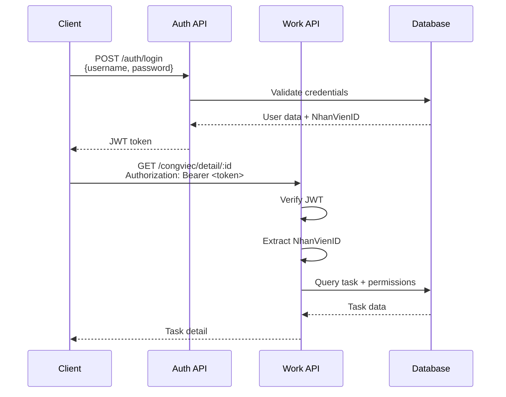
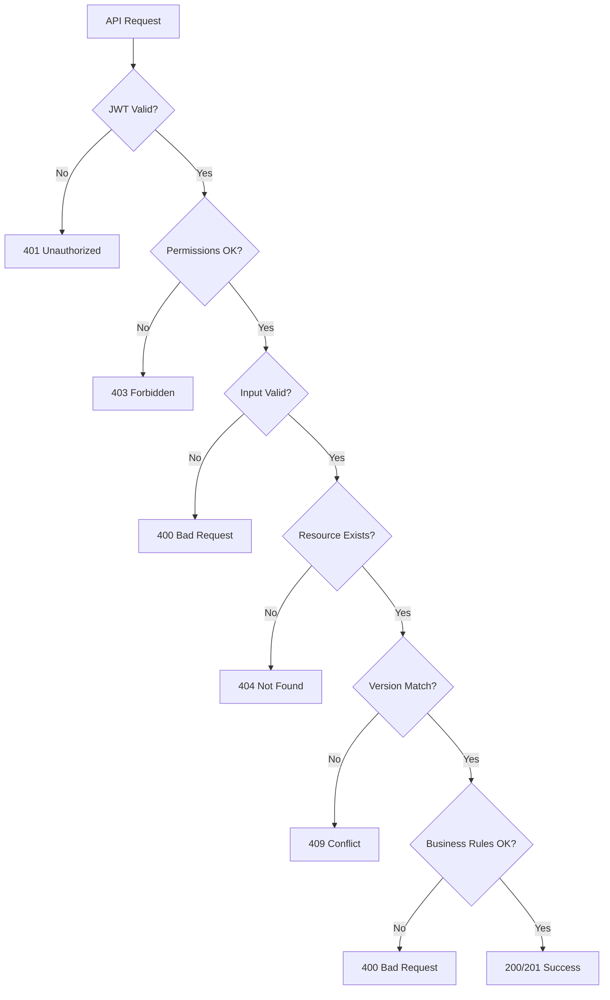

# 📚 API REFERENCE - CongViec Module

> **File**: 09_API_REFERENCE.md  
> **Module**: QuanLyCongViec/CongViec  
> **Mục tiêu**: Complete API catalog với request/response schemas

---

## 📋 MỤC LỤC

1. [Authentication](#1-authentication)
2. [Base Endpoints](#2-base-endpoints)
3. [CRUD Operations](#3-crud-operations)
4. [Workflow Actions](#4-workflow-actions)
5. [Progress Tracking](#5-progress-tracking)
6. [Tree Operations](#6-tree-operations)
7. [Comments System](#7-comments-system)
8. [KPI Integration](#8-kpi-integration)
9. [Error Handling](#9-error-handling)
10. [Query Parameters](#10-query-parameters)

---

## 1. AUTHENTICATION

### 1.1. Authentication Middleware

**Tất cả endpoints yêu cầu authentication**

```javascript
// Header cần gửi
Authorization: Bearer <JWT_TOKEN>
```

**Response khi không authenticated**:

```json
{
  "success": false,
  "message": "Login required",
  "errors": {
    "type": "AUTHENTICATION_ERROR"
  }
}
```

### 1.2. Token Format

```javascript
// JWT payload structure
{
  _id: "64f3cb6035c717ab00d75b8b",        // User ID
  UserName: "kiendt",
  PhanQuyen: "manager",                    // Role
  KhoaID: "64f3cb6035c717ab00d75b8c",     // Department
  NhanVienID: "66b1dba74f79822a4752d90d", // ⚠️ Employee ID (for work management)
  iat: 1704412800,
  exp: 1704499200
}
```

**⚠️ CRITICAL**:

- Use `req.user.NhanVienID` for work management APIs
- NOT `req.user._id` (User ID ≠ NhanVien ID)

---

## 2. BASE ENDPOINTS

### 2.1. Base URL

```
Production: https://api.bvt.vn/api/workmanagement
Development: http://localhost:8020/api/workmanagement
```

### 2.2. Common Response Structure

**Success Response**:

```json
{
  "success": true,
  "data": {
    // Response data object/array
  },
  "message": "Vietnamese success message"
}
```

**Error Response**:

```json
{
  "success": false,
  "errors": {
    "type": "ERROR_TYPE",
    "details": "Error details"
  },
  "message": "Vietnamese error message"
}
```

### 2.3. Standard HTTP Status Codes

| Code | Meaning             | Usage                                     |
| ---- | ------------------- | ----------------------------------------- |
| 200  | OK                  | Successful GET/PUT/DELETE                 |
| 201  | Created             | Successful POST (create)                  |
| 400  | Bad Request         | Invalid input data                        |
| 401  | Unauthorized        | Missing/invalid token                     |
| 403  | Forbidden           | Insufficient permissions                  |
| 404  | Not Found           | Resource doesn't exist                    |
| 409  | Conflict            | Version conflict (optimistic concurrency) |
| 412  | Precondition Failed | If-Unmodified-Since check failed          |
| 500  | Server Error        | Unexpected server error                   |

---

## 3. CRUD OPERATIONS

### 3.1. Create Task

**Endpoint**: `POST /congviec`

**Request Body**:

```json
{
  "TieuDe": "Kiểm tra hồ sơ bệnh án",
  "MoTa": "<p>Detailed description in HTML</p>",
  "NgayBatDau": "2026-01-15T00:00:00.000Z",
  "NgayHetHan": "2026-01-20T23:59:59.999Z",
  "MucDoUuTien": "CAO",
  "NguoiChinh": {
    "NhanVienID": "64f3cb6035c717ab00d75b8b",
    "VaiTro": "XU_LY_CHINH"
  },
  "NguoiThamGia": [
    {
      "NhanVienID": "64f3cb6035c717ab00d75b8c",
      "VaiTro": "PHOI_HOP"
    }
  ],
  "Tags": ["ho-so-benh-an", "kiem-tra"],
  "NhiemVuThuongQuyID": "64f3cb6035c717ab00d75b8d",
  "FlagNVTQKhac": false,

  // Optional: Subtask creation
  "CongViecChaID": "64f3cb6035c717ab00d75b8e"
}
```

**Response (201 Created)**:

```json
{
  "success": true,
  "data": {
    "_id": "64f3cb6035c717ab00d75b8f",
    "MaCongViec": "CV-00123",
    "TieuDe": "Kiểm tra hồ sơ bệnh án",
    "TrangThai": "TAO_MOI",
    "NgayTao": "2026-01-15T08:00:00.000Z",
    "NguoiGiaoViecID": {
      "_id": "64f3cb6035c717ab00d75b90",
      "HoTen": "Đỗ Trung Kiên"
    },
    "NguoiChinh": {
      "NhanVienID": {
        "_id": "64f3cb6035c717ab00d75b8b",
        "HoTen": "Nguyễn Văn A"
      },
      "VaiTro": "XU_LY_CHINH"
    }
    // ... full task object
  },
  "message": "Tạo công việc thành công"
}
```

**Field Constraints**:

| Field              | Type     | Required | Constraints                      |
| ------------------ | -------- | -------- | -------------------------------- |
| TieuDe             | String   | ✅ Yes   | 3-200 characters                 |
| MoTa               | String   | ❌ No    | HTML content                     |
| NgayBatDau         | Date     | ❌ No    | ISO 8601 format                  |
| NgayHetHan         | Date     | ❌ No    | Must be ≥ NgayBatDau             |
| MucDoUuTien        | Enum     | ✅ Yes   | THAP, BINH_THUONG, CAO, KHAN_CAP |
| NguoiChinh         | Object   | ✅ Yes   | Must have NhanVienID + VaiTro    |
| NguoiThamGia       | Array    | ❌ No    | Array of {NhanVienID, VaiTro}    |
| Tags               | Array    | ❌ No    | Array of strings                 |
| NhiemVuThuongQuyID | ObjectId | ❌ No    | Link to routine duty             |
| FlagNVTQKhac       | Boolean  | ❌ No    | "Other" task flag                |

---

### 3.2. Get Task Detail

**Endpoint**: `GET /congviec/detail/:id`

**Request**:

```
GET /congviec/detail/64f3cb6035c717ab00d75b8f
```

**Response (200 OK)**:

```json
{
  "success": true,
  "data": {
    "_id": "64f3cb6035c717ab00d75b8f",
    "MaCongViec": "CV-00123",
    "TieuDe": "Kiểm tra hồ sơ bệnh án",
    "MoTa": "<p>Detailed description</p>",
    "TrangThai": "DANG_THUC_HIEN",
    "NgayBatDau": "2026-01-15T00:00:00.000Z",
    "NgayHetHan": "2026-01-20T23:59:59.999Z",
    "NgayTiepNhanThucTe": "2026-01-15T09:30:00.000Z",
    "MucDoUuTien": "CAO",
    "PhanTramTienDoTong": 45,

    // Populated fields
    "NguoiGiaoViecID": {
      "_id": "64f3cb6035c717ab00d75b90",
      "HoTen": "Đỗ Trung Kiên",
      "Email": "kiendt@bvt.vn"
    },
    "NguoiChinh": {
      "NhanVienID": {
        "_id": "64f3cb6035c717ab00d75b8b",
        "HoTen": "Nguyễn Văn A",
        "PhongBanID": { "TenPhongBan": "Khoa Nội" }
      },
      "VaiTro": "XU_LY_CHINH"
    },
    "NguoiThamGia": [
      {
        "NhanVienID": {
          "_id": "64f3cb6035c717ab00d75b8c",
          "HoTen": "Trần Thị B"
        },
        "VaiTro": "PHOI_HOP"
      }
    ],

    // History arrays
    "LichSuTrangThai": [
      {
        "TrangThaiCu": "TAO_MOI",
        "TrangThaiMoi": "DA_GIAO",
        "NguoiThayDoi": "Đỗ Trung Kiên",
        "ThoiGian": "2026-01-15T08:00:00.000Z",
        "GhiChu": "Giao việc cho Nguyễn Văn A"
      }
    ],
    "LichSuTienDo": [
      {
        "PhanTramCu": 0,
        "PhanTramMoi": 45,
        "NguoiCapNhat": "Nguyễn Văn A",
        "ThoiGian": "2026-01-16T10:00:00.000Z",
        "GhiChu": "Đã hoàn thành 3/5 hồ sơ"
      }
    ],

    // Virtual fields
    "TinhTrangThoiHan": "TRONG_HAN",
    "SoGioConLai": 96.5,

    // Metadata
    "Tags": ["ho-so-benh-an", "kiem-tra"],
    "NhiemVuThuongQuyID": {
      "_id": "64f3cb6035c717ab00d75b8d",
      "TenNhiemVu": "Kiểm tra chất lượng hồ sơ"
    },
    "createdAt": "2026-01-15T08:00:00.000Z",
    "updatedAt": "2026-01-16T10:00:00.000Z"
  }
}
```

---

### 3.3. Update Task

**Endpoint**: `PUT /congviec/:id`

**Headers**:

```
Authorization: Bearer <token>
If-Unmodified-Since: 2026-01-16T10:00:00.000Z  ⚠️ Required for concurrency control
```

**Request Body** (all fields optional):

```json
{
  "TieuDe": "Updated title",
  "MoTa": "<p>Updated description</p>",
  "NgayBatDau": "2026-01-15T00:00:00.000Z",
  "NgayHetHan": "2026-01-22T23:59:59.999Z",
  "MucDoUuTien": "KHAN_CAP",
  "NguoiChinh": {
    "NhanVienID": "64f3cb6035c717ab00d75b91",
    "VaiTro": "XU_LY_CHINH"
  },
  "NguoiThamGia": [
    {
      "NhanVienID": "64f3cb6035c717ab00d75b8c",
      "VaiTro": "PHOI_HOP"
    }
  ],
  "Tags": ["urgent", "quality-check"]
}
```

**Response (200 OK)**:

```json
{
  "success": true,
  "data": {
    // Updated task object with new updatedAt timestamp
  },
  "message": "Cập nhật công việc thành công"
}
```

**Error (409 Conflict)** - Version conflict:

```json
{
  "success": false,
  "errors": {
    "type": "VERSION_CONFLICT",
    "currentData": {
      // Latest task data from server
    }
  },
  "message": "Công việc đã được cập nhật bởi người khác"
}
```

---

### 3.4. Delete Task (Soft Delete)

**Endpoint**: `DELETE /congviec/:id`

**Request**:

```
DELETE /congviec/64f3cb6035c717ab00d75b8f
```

**Response (200 OK)**:

```json
{
  "success": true,
  "message": "Xóa công việc thành công"
}
```

**Business Rules**:

- Soft delete only (sets `isDeleted: true`)
- Cannot delete if status is `HOAN_THANH` (completed)
- Only `NguoiGiaoViec` or admin can delete
- Subtasks remain intact (not cascading delete)

---

### 3.5. Get Received Tasks

**Endpoint**: `GET /congviec/:nhanvienid/received`

**Query Parameters**:

```
?page=1
&limit=20
&search=kiểm tra
&TrangThai=DANG_THUC_HIEN,CHO_DUYET
&MucDoUuTien=CAO,KHAN_CAP
&NgayBatDau=2026-01-01
&NgayHetHan=2026-01-31
```

**Response (200 OK)**:

```json
{
  "success": true,
  "data": {
    "congViecs": [
      {
        "_id": "64f3cb6035c717ab00d75b8f",
        "MaCongViec": "CV-00123",
        "TieuDe": "Kiểm tra hồ sơ bệnh án",
        "TrangThai": "DANG_THUC_HIEN",
        "MucDoUuTien": "CAO",
        "NgayHetHan": "2026-01-20T23:59:59.999Z",
        "PhanTramTienDoTong": 45,
        "NguoiGiaoViecID": {
          "HoTen": "Đỗ Trung Kiên"
        },
        "TinhTrangThoiHan": "TRONG_HAN",
        "SoGioConLai": 96.5
      }
      // ... more tasks
    ],
    "pagination": {
      "total": 156,
      "page": 1,
      "limit": 20,
      "totalPages": 8
    }
  }
}
```

---

### 3.6. Get Assigned Tasks

**Endpoint**: `GET /congviec/:nhanvienid/assigned`

**Same structure as Get Received Tasks**

**Difference**: Returns tasks where employee is `NguoiGiaoViec` (assigner)

---

## 4. WORKFLOW ACTIONS

### 4.1. Unified Transition Endpoint

**Endpoint**: `POST /congviec/:id/transition`

**Request Body**:

```json
{
  "action": "TIEP_NHAN",
  "note": "Đã tiếp nhận và bắt đầu xử lý"
}
```

**Actions (8 available)**:

| Action           | From State     | To State       | Permission                |
| ---------------- | -------------- | -------------- | ------------------------- |
| GIAO_VIEC        | TAO_MOI        | DA_GIAO        | Assigner only             |
| TIEP_NHAN        | DA_GIAO        | DANG_THUC_HIEN | Main person only          |
| HOAN_THANH       | DANG_THUC_HIEN | HOAN_THANH\*   | Main person only          |
| DUYET_HOAN_THANH | CHO_DUYET      | HOAN_THANH     | Assigner only             |
| TU_CHOI          | CHO_DUYET      | DANG_THUC_HIEN | Assigner only             |
| GUI_LAI          | DANG_THUC_HIEN | DA_GIAO        | Main person (return task) |
| TAM_DUNG         | DANG_THUC_HIEN | DA_GIAO        | Assigner only             |
| HUY_BO           | ANY            | CANCELLED      | Admin only                |

**\* Note**: HOAN_THANH goes to CHO_DUYET if approval required

**Response (200 OK)**:

```json
{
  "success": true,
  "data": {
    // Updated task with new TrangThai
    "TrangThai": "DANG_THUC_HIEN",
    "NgayTiepNhanThucTe": "2026-01-15T09:30:00.000Z",
    "LichSuTrangThai": [
      // ... previous history
      {
        "TrangThaiCu": "DA_GIAO",
        "TrangThaiMoi": "DANG_THUC_HIEN",
        "NguoiThayDoi": "Nguyễn Văn A",
        "ThoiGian": "2026-01-15T09:30:00.000Z",
        "GhiChu": "Đã tiếp nhận và bắt đầu xử lý",
        "Action": "TIEP_NHAN"
      }
    ]
  },
  "message": "Tiếp nhận công việc thành công"
}
```

**Error (403 Forbidden)** - Insufficient permission:

```json
{
  "success": false,
  "errors": {
    "type": "PERMISSION_DENIED",
    "action": "TIEP_NHAN",
    "requiredRole": "main_person",
    "userRole": "participant"
  },
  "message": "Bạn không có quyền tiếp nhận công việc này"
}
```

**Error (400 Bad Request)** - Invalid transition:

```json
{
  "success": false,
  "errors": {
    "type": "INVALID_TRANSITION",
    "currentState": "HOAN_THANH",
    "attemptedAction": "TIEP_NHAN"
  },
  "message": "Không thể tiếp nhận công việc đã hoàn thành"
}
```

---

### 4.2. Legacy Action Endpoints

**Still supported for backward compatibility**:

```javascript
POST /congviec/:id/giao-viec        // Same as transition({action: "GIAO_VIEC"})
POST /congviec/:id/tiep-nhan        // Same as transition({action: "TIEP_NHAN"})
POST /congviec/:id/hoan-thanh       // Same as transition({action: "HOAN_THANH"})
POST /congviec/:id/duyet-hoan-thanh // Same as transition({action: "DUYET_HOAN_THANH"})
```

**Recommendation**: Use `/transition` endpoint for all new implementations

---

## 5. PROGRESS TRACKING

### 5.1. Update Progress

**Endpoint**: `POST /congviec/:id/progress`

**Headers**:

```
Authorization: Bearer <token>
If-Unmodified-Since: 2026-01-16T10:00:00.000Z  ⚠️ Required
```

**Request Body**:

```json
{
  "PhanTramTienDo": 65,
  "GhiChu": "Đã hoàn thành 5/8 hồ sơ, đang kiểm tra hồ sơ thứ 6"
}
```

**Response (200 OK)**:

```json
{
  "success": true,
  "data": {
    "_id": "64f3cb6035c717ab00d75b8f",
    "PhanTramTienDoTong": 65,
    "LichSuTienDo": [
      // ... previous history
      {
        "PhanTramCu": 45,
        "PhanTramMoi": 65,
        "NguoiCapNhat": {
          "_id": "64f3cb6035c717ab00d75b8b",
          "HoTen": "Nguyễn Văn A"
        },
        "ThoiGian": "2026-01-16T14:30:00.000Z",
        "GhiChu": "Đã hoàn thành 5/8 hồ sơ"
      }
    ]
  },
  "message": "Cập nhật tiến độ thành công"
}
```

**Business Rules**:

- Progress value: 0-100 (integer)
- Only main person or participants can update
- Automatic PhanTramTienDoTong calculation if has subtasks
- Adds entry to LichSuTienDo array

---

### 5.2. Update History Note (Inline Edit)

**Endpoint**: `PUT /congviec/:id/history/:index/note`

**Request Body**:

```json
{
  "GhiChu": "Updated note text"
}
```

**Response (200 OK)**:

```json
{
  "success": true,
  "data": {
    // Updated task with modified LichSuTrangThai[index].GhiChu
  },
  "message": "Cập nhật ghi chú thành công"
}
```

**Permission**: Only note creator can edit

---

### 5.3. Update Progress History Note

**Endpoint**: `PUT /congviec/:id/progress-history/:index/note`

**Same structure as Update History Note**

**Target**: LichSuTienDo array instead of LichSuTrangThai

---

## 6. TREE OPERATIONS

### 6.1. Create Subtask

**Endpoint**: `POST /congviec/:id/subtasks`

**Request Body** (same as create task):

```json
{
  "TieuDe": "Subtask title",
  "MoTa": "Subtask description",
  "NgayHetHan": "2026-01-18T23:59:59.999Z",
  "MucDoUuTien": "CAO",
  "NguoiChinh": {
    "NhanVienID": "64f3cb6035c717ab00d75b8b",
    "VaiTro": "XU_LY_CHINH"
  }
  // Note: CongViecChaID is set automatically by server
}
```

**Response (201 Created)**:

```json
{
  "success": true,
  "data": {
    "_id": "64f3cb6035c717ab00d75b92",
    "MaCongViec": "CV-00123-01",
    "TieuDe": "Subtask title",
    "CongViecChaID": "64f3cb6035c717ab00d75b8f", // ← Parent ID
    "DuongDan": "64f3cb6035c717ab00d75b8f", // ← Materialized path
    "CapDo": 1 // ← Depth level
  },
  "message": "Tạo công việc con thành công"
}
```

**Business Rules**:

- Inherits NguoiGiaoViec from parent
- Auto-calculates DuongDan (materialized path)
- CapDo = parent.CapDo + 1
- MaCongViec suffix: parent-01, parent-02, etc.

---

### 6.2. Get Tree Root

**Endpoint**: `GET /congviec/:id/tree-root`

**Response (200 OK)**:

```json
{
  "success": true,
  "data": {
    "_id": "64f3cb6035c717ab00d75b8a",
    "MaCongViec": "CV-00100",
    "TieuDe": "Root task title",
    "DuongDan": "",
    "CapDo": 0
  }
}
```

**Use case**: Navigate to root task from any subtask

---

### 6.3. Get Tree Children

**Endpoint**: `GET /congviec/:id/tree-children`

**Response (200 OK)**:

```json
{
  "success": true,
  "data": [
    {
      "_id": "64f3cb6035c717ab00d75b92",
      "MaCongViec": "CV-00123-01",
      "TieuDe": "First subtask",
      "TrangThai": "DANG_THUC_HIEN",
      "PhanTramTienDoTong": 30,
      "CapDo": 1
    },
    {
      "_id": "64f3cb6035c717ab00d75b93",
      "MaCongViec": "CV-00123-02",
      "TieuDe": "Second subtask",
      "TrangThai": "HOAN_THANH",
      "PhanTramTienDoTong": 100,
      "CapDo": 1
    }
  ]
}
```

**Use case**: Lazy-load children for tree view

---

### 6.4. Get Full Tree

**Endpoint**: `GET /congviec/:id/full-tree`

**Response (200 OK)**:

```json
{
  "success": true,
  "data": {
    "_id": "64f3cb6035c717ab00d75b8f",
    "MaCongViec": "CV-00123",
    "TieuDe": "Parent task",
    "TrangThai": "DANG_THUC_HIEN",
    "PhanTramTienDoTong": 45,
    "children": [
      {
        "_id": "64f3cb6035c717ab00d75b92",
        "MaCongViec": "CV-00123-01",
        "TieuDe": "Subtask 1",
        "PhanTramTienDoTong": 30,
        "children": [
          {
            "_id": "64f3cb6035c717ab00d75b94",
            "MaCongViec": "CV-00123-01-01",
            "TieuDe": "Sub-subtask",
            "children": []
          }
        ]
      },
      {
        "_id": "64f3cb6035c717ab00d75b93",
        "MaCongViec": "CV-00123-02",
        "TieuDe": "Subtask 2",
        "children": []
      }
    ]
  }
}
```

**Use case**: Load entire tree at once for visualization

---

### 6.5. List Children (Direct Only)

**Endpoint**: `GET /congviec/:id/children`

**Same as Get Tree Children** - Returns only direct children (CapDo = parent.CapDo + 1)

---

## 7. COMMENTS SYSTEM

### 7.1. Add Comment

**Endpoint**: `POST /congviec/:id/comment`

**Request Body**:

```json
{
  "NoiDung": "Comment text content",
  "ParentCommentID": null, // Optional: for reply
  "files": [] // Optional: File uploads via FormData
}
```

**With File Upload** (multipart/form-data):

```
Content-Type: multipart/form-data

NoiDung: "Comment with attachment"
ParentCommentID: 64f3cb6035c717ab00d75b95
files: [file1.pdf, file2.jpg]  ← Multiple files
```

**Response (201 Created)**:

```json
{
  "success": true,
  "data": {
    "_id": "64f3cb6035c717ab00d75b96",
    "CongViecID": "64f3cb6035c717ab00d75b8f",
    "NguoiBinhLuan": {
      "_id": "64f3cb6035c717ab00d75b8b",
      "HoTen": "Nguyễn Văn A"
    },
    "NoiDung": "Comment text content",
    "ParentCommentID": null,
    "TepDinhKem": [],
    "isDeleted": false,
    "isRecalled": false,
    "createdAt": "2026-01-16T15:00:00.000Z"
  },
  "message": "Thêm bình luận thành công"
}
```

**File Attachment Format**:

```json
{
  "TepDinhKem": [
    {
      "_id": "64f3cb6035c717ab00d75b97",
      "TenFile": "report.pdf",
      "DuongDan": "/uploads/comments/64f3cb6035c717ab00d75b96/report.pdf",
      "KichThuoc": 2048576,
      "LoaiFile": "application/pdf",
      "NguoiTai": {
        "_id": "64f3cb6035c717ab00d75b8b",
        "HoTen": "Nguyễn Văn A"
      },
      "NgayTai": "2026-01-16T15:00:00.000Z"
    }
  ]
}
```

---

### 7.2. Delete Comment (Soft Delete)

**Endpoint**: `DELETE /binhluan/:id`

**Response (200 OK)**:

```json
{
  "success": true,
  "message": "Thu hồi bình luận thành công"
}
```

**Effect**:

- Sets `isDeleted: true`
- Sets `NoiDung: "[Bình luận đã bị xóa]"`
- **Keeps TepDinhKem** (files remain accessible)
- Replies remain visible

---

### 7.3. Recall Comment Text

**Endpoint**: `PATCH /binhluan/:id/text`

**Response (200 OK)**:

```json
{
  "success": true,
  "message": "Thu hồi nội dung bình luận thành công"
}
```

**Effect**:

- Sets `isRecalled: true`
- Sets `NoiDung: "[Nội dung đã được thu hồi]"`
- **Keeps TepDinhKem** intact (files still accessible)
- Replies remain visible

**Difference from Delete**:

- Delete: `isDeleted=true`, affects comment + files
- Recall Text: `isRecalled=true`, only affects text content

---

### 7.4. List Replies

**Endpoint**: `GET /binhluan/:id/replies`

**Query Parameters**:

```
?page=1
&limit=20
```

**Response (200 OK)**:

```json
{
  "success": true,
  "data": {
    "replies": [
      {
        "_id": "64f3cb6035c717ab00d75b98",
        "ParentCommentID": "64f3cb6035c717ab00d75b96",
        "NoiDung": "Reply text",
        "NguoiBinhLuan": {
          "HoTen": "Trần Thị B"
        },
        "createdAt": "2026-01-16T15:30:00.000Z"
      }
    ],
    "pagination": {
      "total": 5,
      "page": 1,
      "limit": 20,
      "totalPages": 1
    }
  }
}
```

**Use case**: Lazy-load replies for 2-level comment threading

---

## 8. KPI INTEGRATION

### 8.1. Get Dashboard by Routine Duty

**Endpoint**: `GET /congviec/dashboard-by-nhiemvu`

**Query Parameters**:

```
?nhiemVuThuongQuyID=64f3cb6035c717ab00d75b8d
&nhanVienID=64f3cb6035c717ab00d75b8b
&chuKyDanhGiaID=64f3cb6035c717ab00d75b8e
```

**Response (200 OK)**:

```json
{
  "success": true,
  "data": {
    "nhiemVuThuongQuyID": "64f3cb6035c717ab00d75b8d",
    "nhanVienID": "64f3cb6035c717ab00d75b8b",
    "chuKyDanhGiaID": "64f3cb6035c717ab00d75b8e",
    "tuNgay": "2026-01-01T00:00:00.000Z",
    "denNgay": "2026-03-31T23:59:59.999Z",

    // Status distribution
    "totalTasks": 45,
    "byStatus": {
      "TAO_MOI": 2,
      "DA_GIAO": 5,
      "DANG_THUC_HIEN": 15,
      "CHO_DUYET": 3,
      "HOAN_THANH": 20
    },

    // Time metrics (completed tasks only)
    "completedTasks": 20,
    "onTimeTasks": 18,
    "lateTasks": 2,
    "onTimeRate": 0.9,
    "lateRate": 0.1,
    "avgCompletionDays": 3.5,
    "totalLateHours": 48,
    "maxLateHours": 24,

    // Collaboration metrics
    "avgTeamSize": 2.5,
    "totalComments": 120,
    "avgCommentsPerTask": 2.67,
    "multiPersonTasks": 30,
    "collaborationRate": 0.67,

    // Priority breakdown
    "byPriority": {
      "THAP": 5,
      "BINH_THUONG": 30,
      "CAO": 8,
      "KHAN_CAP": 2
    },

    // Current status
    "inProgress": 15,
    "pending": 8,
    "overdue": 3,

    // Recent tasks (up to 50)
    "recentTasks": [
      {
        "MaCongViec": "CV-00123",
        "TieuDe": "Kiểm tra hồ sơ bệnh án",
        "TrangThai": "HOAN_THANH",
        "NgayHetHan": "2026-01-15T23:59:59.999Z",
        "PhanTramTienDoTong": 100
      }
      // ... more tasks
    ]
  }
}
```

**Use case**: Display metrics for manager during KPI evaluation

---

### 8.2. Get "Other" Tasks Summary

**Endpoint**: `GET /congviec/summary-other-tasks`

**Query Parameters**:

```
?nhanVienID=64f3cb6035c717ab00d75b8b
&chuKyDanhGiaID=64f3cb6035c717ab00d75b8e
```

**Response**: Similar structure to dashboard-by-nhiemvu

**Filter**: Tasks where `FlagNVTQKhac = true`

---

### 8.3. Get Collaboration Tasks Summary

**Endpoint**: `GET /congviec/summary-collab-tasks`

**Query Parameters**: Same as "Other" tasks

**Filter**: Tasks where employee is participant (not main person)

**Response**: Same structure with collaboration metrics

---

### 8.4. Get Cross-Cycle Tasks Summary

**Endpoint**: `GET /congviec/summary-cross-cycle-tasks`

**Query Parameters**: Same as above

**Filter**: Tasks assigned to NVTQ from previous cycles but completed in current cycle

**Use case**: Track carryover work in KPI evaluation

---

### 8.5. Get My Routine Tasks

**Endpoint**: `GET /nhiemvuthuongquy/my`

**Query Parameters**:

```
?chuKyId=64f3cb6035c717ab00d75b8e  // Optional: filter by cycle
```

**Response (200 OK)**:

```json
{
  "success": true,
  "data": [
    {
      "_id": "64f3cb6035c717ab00d75b8d",
      "TenNhiemVu": "Kiểm tra chất lượng hồ sơ",
      "MoTa": "Kiểm tra và đánh giá chất lượng hồ sơ bệnh án",
      "MucDoKho": 5.0,
      "TieuChiDanhGia": [
        {
          "TenTieuChi": "Hoàn thành đúng hạn",
          "TrongSo": 0.3
        },
        {
          "TenTieuChi": "Chất lượng công việc",
          "TrongSo": 0.7
        }
      ]
    }
  ]
}
```

**Use case**: Display assigned routine duties in task creation form

---

### 8.6. Get Evaluation Cycles List

**Endpoint**: `GET /chu-ky-danh-gia/list`

**Response (200 OK)**:

```json
{
  "success": true,
  "data": [
    {
      "_id": "64f3cb6035c717ab00d75b8e",
      "TenChuKy": "Q1 2026",
      "NgayBatDau": "2026-01-01T00:00:00.000Z",
      "NgayKetThuc": "2026-03-31T23:59:59.999Z",
      "TrangThai": "DANG_DIEN_RA"
    },
    {
      "_id": "64f3cb6035c717ab00d75b8f",
      "TenChuKy": "Q4 2025",
      "NgayBatDau": "2025-10-01T00:00:00.000Z",
      "NgayKetThuc": "2025-12-31T23:59:59.999Z",
      "TrangThai": "DA_HOAN_THANH"
    }
  ]
}
```

**Use case**: Dropdown filter for KPI dashboard

---

### 8.7. Assign Routine Task

**Endpoint**: `POST /congviec/:id/assign-routine-task`

**Headers**:

```
If-Unmodified-Since: 2026-01-16T10:00:00.000Z  ⚠️ Required
```

**Request Body**:

```json
{
  "NhiemVuThuongQuyID": "64f3cb6035c717ab00d75b8d"
}
```

**Response (200 OK)**:

```json
{
  "success": true,
  "data": {
    "_id": "64f3cb6035c717ab00d75b8f",
    "NhiemVuThuongQuyID": "64f3cb6035c717ab00d75b8d",
    "FlagNVTQKhac": false
  },
  "message": "Gán nhiệm vụ thường quy thành công"
}
```

**Business Rules**:

- Clears FlagNVTQKhac when assigning NVTQ
- Only one NVTQ per task
- Requires version check (If-Unmodified-Since)

---

## 9. ERROR HANDLING

### 9.1. Error Response Structure

```json
{
  "success": false,
  "errors": {
    "type": "ERROR_TYPE",
    "field": "fieldName", // Optional: validation errors
    "details": "Error details"
  },
  "message": "Vietnamese error message"
}
```

### 9.2. Common Error Types

| Error Type              | Status | Meaning                         | Example                        |
| ----------------------- | ------ | ------------------------------- | ------------------------------ |
| VALIDATION_ERROR        | 400    | Invalid input                   | Missing required field         |
| AUTHENTICATION_ERROR    | 401    | Not authenticated               | Missing/invalid token          |
| PERMISSION_DENIED       | 403    | Insufficient permissions        | Not task owner                 |
| NOT_FOUND               | 404    | Resource not found              | Task ID doesn't exist          |
| VERSION_CONFLICT        | 409    | Optimistic concurrency conflict | If-Unmodified-Since mismatch   |
| INVALID_TRANSITION      | 400    | Invalid state transition        | Can't TIEP_NHAN completed task |
| BUSINESS_RULE_VIOLATION | 400    | Business logic constraint       | Can't delete completed task    |
| SERVER_ERROR            | 500    | Unexpected server error         | Database connection failure    |

### 9.3. Validation Errors

**Example**: Missing required field

```json
{
  "success": false,
  "errors": {
    "type": "VALIDATION_ERROR",
    "field": "TieuDe",
    "details": "TieuDe is required"
  },
  "message": "Tiêu đề công việc không được để trống"
}
```

**Example**: Invalid enum value

```json
{
  "success": false,
  "errors": {
    "type": "VALIDATION_ERROR",
    "field": "MucDoUuTien",
    "details": "Invalid priority value",
    "allowedValues": ["THAP", "BINH_THUONG", "CAO", "KHAN_CAP"]
  },
  "message": "Mức độ ưu tiên không hợp lệ"
}
```

### 9.4. Permission Errors

```json
{
  "success": false,
  "errors": {
    "type": "PERMISSION_DENIED",
    "action": "DUYET_HOAN_THANH",
    "requiredRole": "assigner",
    "userRole": "main_person"
  },
  "message": "Chỉ người giao việc mới có quyền duyệt hoàn thành"
}
```

### 9.5. Version Conflict Handling

**Request with stale version**:

```
PUT /congviec/64f3cb6035c717ab00d75b8f
If-Unmodified-Since: 2026-01-16T10:00:00.000Z  ← Stale
```

**Server has newer version** (updatedAt: 2026-01-16T11:00:00.000Z)

**Response (409 Conflict)**:

```json
{
  "success": false,
  "errors": {
    "type": "VERSION_CONFLICT",
    "clientVersion": "2026-01-16T10:00:00.000Z",
    "serverVersion": "2026-01-16T11:00:00.000Z",
    "currentData": {
      // Latest task data from server
      "_id": "64f3cb6035c717ab00d75b8f",
      "TieuDe": "Updated title by another user",
      "updatedAt": "2026-01-16T11:00:00.000Z"
    }
  },
  "message": "Công việc đã được cập nhật bởi người khác. Vui lòng tải lại trang."
}
```

**Frontend handling**:

1. Show warning banner with conflict message
2. Offer "Reload" button to fetch latest data
3. Option to view changes side-by-side

---

## 10. QUERY PARAMETERS

### 10.1. Pagination

**Standard pagination parameters**:

| Parameter | Type    | Default | Description              |
| --------- | ------- | ------- | ------------------------ |
| page      | Integer | 1       | Page number (1-indexed)  |
| limit     | Integer | 20      | Items per page (max 100) |

**Response format**:

```json
{
  "pagination": {
    "total": 156,
    "page": 1,
    "limit": 20,
    "totalPages": 8
  }
}
```

---

### 10.2. Filtering

**Common filters** (for list endpoints):

| Parameter   | Type   | Format          | Example                               |
| ----------- | ------ | --------------- | ------------------------------------- |
| search      | String | Keyword         | `?search=kiểm tra`                    |
| TrangThai   | String | Comma-separated | `?TrangThai=DANG_THUC_HIEN,CHO_DUYET` |
| MucDoUuTien | String | Comma-separated | `?MucDoUuTien=CAO,KHAN_CAP`           |
| NgayBatDau  | Date   | ISO 8601        | `?NgayBatDau=2026-01-01`              |
| NgayHetHan  | Date   | ISO 8601        | `?NgayHetHan=2026-01-31`              |

**Example combined**:

```
GET /congviec/:nhanvienid/received?page=1&limit=20&search=hồ sơ&TrangThai=DANG_THUC_HIEN,CHO_DUYET&MucDoUuTien=CAO
```

---

### 10.3. Sorting

**Standard sort parameter**:

```
?sort=-createdAt    // Descending by createdAt
?sort=NgayHetHan    // Ascending by NgayHetHan
```

**Multiple sort fields**:

```
?sort=-MucDoUuTien,NgayHetHan  // Priority DESC, then Deadline ASC
```

**Supported sort fields**:

- `createdAt` - Creation date
- `updatedAt` - Last update
- `NgayHetHan` - Deadline
- `MucDoUuTien` - Priority (enum order)
- `TrangThai` - Status (enum order)
- `PhanTramTienDoTong` - Progress percentage

---

### 10.4. Field Selection

**Select specific fields only** (reduces payload size):

```
?fields=MaCongViec,TieuDe,TrangThai,NgayHetHan
```

**Response**:

```json
{
  "success": true,
  "data": [
    {
      "MaCongViec": "CV-00123",
      "TieuDe": "Task title",
      "TrangThai": "DANG_THUC_HIEN",
      "NgayHetHan": "2026-01-20T23:59:59.999Z"
    }
  ]
}
```

---

### 10.5. Population Control

**Control populated fields**:

```
?populate=NguoiGiaoViecID,NguoiChinh.NhanVienID
```

**No population** (lean query):

```
?populate=none
```

**Response** (lean):

```json
{
  "NguoiGiaoViecID": "64f3cb6035c717ab00d75b90", // ← Just ID
  "NguoiChinh": {
    "NhanVienID": "64f3cb6035c717ab00d75b8b" // ← Just ID
  }
}
```

---

## 📊 SUMMARY

### API Endpoint Groups

| Group        | Endpoints | Description                                    |
| ------------ | --------- | ---------------------------------------------- |
| **CRUD**     | 6         | Create, Read, Update, Delete, List tasks       |
| **Workflow** | 8         | State transitions (GIAO_VIEC, TIEP_NHAN, etc.) |
| **Progress** | 3         | Update progress, edit history notes            |
| **Tree**     | 5         | Subtask operations, hierarchy navigation       |
| **Comments** | 4         | Add, delete, recall, list replies              |
| **KPI**      | 7         | Dashboard metrics, routine tasks, cycles       |
| **Utility**  | 1         | Get employee info                              |

**Total**: ~34 endpoints

---

### Best Practices

✅ **Do**:

- Always send `Authorization` header
- Use `If-Unmodified-Since` for updates
- Handle 409 VERSION_CONFLICT gracefully
- Paginate large lists (limit ≤ 100)
- Use `/transition` endpoint for workflow actions
- Check permissions before calling action endpoints

❌ **Don't**:

- Mix User.\_id and NhanVien.\_id (use NhanVienID for work management)
- Ignore VERSION_CONFLICT errors (data loss risk)
- Cascade delete subtasks (not supported)
- Update completed tasks without permission
- Send both NhiemVuThuongQuyID and FlagNVTQKhac=true

---

### Rate Limiting

**Current**: No rate limiting implemented

**Recommendation**: Implement per-user rate limiting in production

---

### Versioning

**Current**: v1 (implicit, no version prefix)

**Future**: Consider `/api/v2/workmanagement/...` for breaking changes

---

### Authentication Flow



---

### Error Handling Flow



---

**Ngày tạo**: 5/1/2026  
**Phiên bản**: 1.0  
**Tác giả**: Documentation Team  
**Trạng thái**: ✅ Complete - All 9 documentation files finished!
