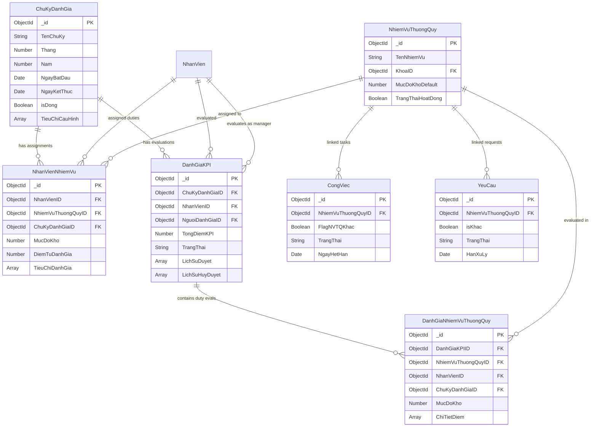
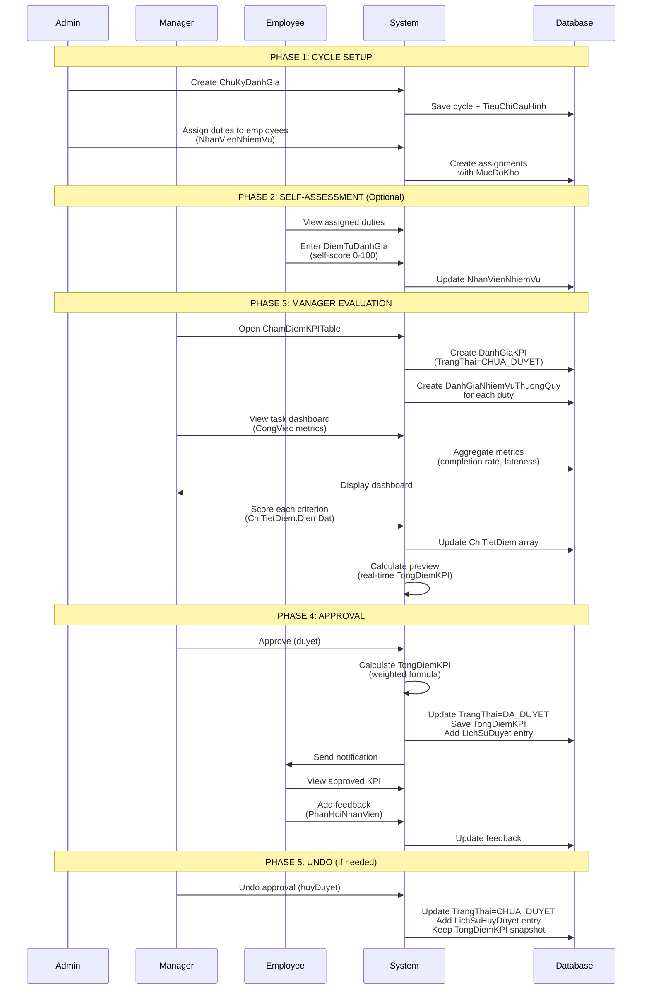

# 🎯 OVERVIEW - KPI Module

> **File**: 00_OVERVIEW.md  
> **Module**: QuanLyCongViec/KPI (Performance Evaluation System)  
> **Mục tiêu**: Hiểu tổng quan kiến trúc và core concepts của hệ thống KPI

---

## 📋 MỤC LỤC

1. [System Purpose](#1-system-purpose)
2. [Architecture Overview](#2-architecture-overview)
3. [Core Data Models](#3-core-data-models)
4. [Evaluation Flow](#4-evaluation-flow)
5. [Key Features](#5-key-features)
6. [Technology Stack](#6-technology-stack)
7. [Module Structure](#7-module-structure)

---

## 1. SYSTEM PURPOSE

### 1.1. Mục Đích Hệ Thống

**KPI Module** là hệ thống đánh giá hiệu suất làm việc theo chu kỳ (monthly/quarterly) dựa trên:

- **Criteria-Based Evaluation**: Đánh giá theo tiêu chí định lượng
- **Routine Duties**: Nhiệm vụ thường quy được giao cho từng nhân viên
- **Task Metrics**: Dữ liệu từ CongViec và YeuCau modules
- **Weighted Scoring**: Công thức tính điểm có trọng số (MucDoKho)

### 1.2. Use Cases

```
Manager Perspective:
├─ Thiết lập chu kỳ đánh giá (monthly cycle)
├─ Gán nhiệm vụ thường quy cho nhân viên
├─ Review task metrics (completion rate, lateness)
├─ Chấm điểm theo tiêu chí (criteria-based scoring)
├─ Duyệt đánh giá (approve with audit trail)
└─ Export reports (PowerPoint, PDF)

Employee Perspective:
├─ Xem nhiệm vụ được giao trong chu kỳ
├─ Tự đánh giá (self-assessment for "Mức độ hoàn thành")
├─ Xem dashboard công việc/yêu cầu đã xử lý
├─ Nhận thông báo khi được đánh giá
└─ Phản hồi sau khi duyệt
```

### 1.3. Key Metrics Tracked

- **Task Completion Rate**: % công việc hoàn thành đúng hạn
- **Task Quality**: Điểm quản lý chấm cho từng tiêu chí
- **Self-Assessment**: Điểm tự đánh giá của nhân viên (optional)
- **Difficulty Weight**: MucDoKho (1-10) cho từng nhiệm vụ
- **Overall KPI Score**: TongDiemKPI tự động tính

---

## 2. ARCHITECTURE OVERVIEW

### 2.1. System Architecture

```
┌────────────────────────────────────────────────────────────┐
│                  KPI SYSTEM ARCHITECTURE                    │
├────────────────────────────────────────────────────────────┤
│                                                             │
│  ChuKyDanhGia (Evaluation Cycle)                           │
│  ├─ TenChuKy: "Tháng 1/2026"                               │
│  ├─ NgayBatDau: 2026-01-01                                 │
│  ├─ NgayKetThuc: 2026-01-31                                │
│  ├─ isDong: false                                          │
│  └─ TieuChiCauHinh: [                                      │
│      {TenTieuChi, LoaiTieuChi, GiaTriMax, IsMucDoHoanThanh}│
│    ]                                                        │
│      │                                                      │
│      ├──→ NhanVienNhiemVu (Assignment)                     │
│      │    ├─ NhanVienID: Employee                          │
│      │    ├─ NhiemVuThuongQuyID: Routine Duty              │
│      │    ├─ ChuKyDanhGiaID: Cycle                         │
│      │    ├─ MucDoKho: 7.5                                 │
│      │    ├─ DiemTuDanhGia: 85 (self-score)               │
│      │    └─ TieuChiDanhGia: [...]                         │
│      │                                                      │
│      └──→ DanhGiaKPI (KPI Evaluation)                      │
│           ├─ ChuKyDanhGiaID: Cycle                         │
│           ├─ NhanVienID: Employee                          │
│           ├─ NguoiDanhGiaID: Manager                       │
│           ├─ TongDiemKPI: 68.5 (calculated)                │
│           ├─ TrangThai: CHUA_DUYET | DA_DUYET              │
│           ├─ LichSuDuyet: [...]                            │
│           └─ LichSuHuyDuyet: [...]                         │
│               │                                             │
│               └──→ DanhGiaNhiemVuThuongQuy (Duty Eval)     │
│                    ├─ DanhGiaKPIID: Parent                 │
│                    ├─ NhiemVuThuongQuyID: Duty             │
│                    ├─ MucDoKho: 7.5                        │
│                    └─ ChiTietDiem: [                       │
│                        {                                    │
│                          TenTieuChi: "Hoàn thành đúng hạn",│
│                          LoaiTieuChi: "TANG_DIEM",         │
│                          DiemDat: 90,                       │
│                          IsMucDoHoanThanh: true            │
│                        },                                   │
│                        {                                    │
│                          TenTieuChi: "Vi phạm quy định",   │
│                          LoaiTieuChi: "GIAM_DIEM",         │
│                          DiemDat: 0                         │
│                        }                                    │
│                      ]                                      │
│                                                             │
│  Key Integration Points:                                    │
│  • CongViec → Dashboard metrics (completion, lateness)     │
│  • YeuCau → Request handling metrics                       │
│  • NhanVien → Employee master data                         │
└─────────────────────────────────────────────────────────────┘
```

### 2.2. Entity Relationship Diagram



### 2.3. Three-Layer Architecture

**Layer 1: Cycle Configuration**

- ChuKyDanhGia: Defines evaluation period and criteria template
- TieuChiCauHinh: Global criteria for all employees in cycle

**Layer 2: Assignment**

- NhanVienNhiemVu: Links employee to specific routine duties
- Per-employee customization: MucDoKho, TieuChiDanhGia
- DiemTuDanhGia: Self-assessment score

**Layer 3: Evaluation**

- DanhGiaKPI: Overall KPI evaluation per employee per cycle
- DanhGiaNhiemVuThuongQuy: Sub-evaluation per assigned duty
- ChiTietDiem: Score breakdown per criterion

---

## 3. CORE DATA MODELS

### 3.1. ChuKyDanhGia (Evaluation Cycle)

**Purpose**: Định nghĩa chu kỳ đánh giá và cấu hình tiêu chí chung

**File**: `ChuKyDanhGia.js` - 219 lines

**Schema**:

```javascript
{
  TenChuKy: "Tháng 1/2026",                // Cycle name
  Thang: 1,                                 // Month (1-12)
  Nam: 2026,                                // Year
  NgayBatDau: Date("2026-01-01"),          // Start date
  NgayKetThuc: Date("2026-01-31"),         // End date
  isDong: false,                            // Closed flag
  MoTa: "Đánh giá KPI tháng 1",            // Description
  NguoiTaoID: ObjectId("..."),             // Creator

  // Criteria template for this cycle
  TieuChiCauHinh: [
    {
      TenTieuChi: "Hoàn thành đúng hạn",
      LoaiTieuChi: "TANG_DIEM",            // TANG_DIEM | GIAM_DIEM
      GiaTriMin: 0,
      GiaTriMax: 100,
      DonVi: "%",
      ThuTu: 1,
      IsMucDoHoanThanh: true,              // ← FIXED criterion (allows self-assessment)
      GhiChu: "Tỷ lệ công việc hoàn thành đúng deadline"
    },
    {
      TenTieuChi: "Chất lượng công việc",
      LoaiTieuChi: "TANG_DIEM",
      GiaTriMax: 100,
      IsMucDoHoanThanh: false,             // ← Variable criterion (manager only)
      // ...
    },
    {
      TenTieuChi: "Vi phạm quy định",
      LoaiTieuChi: "GIAM_DIEM",            // ← Penalty criterion
      GiaTriMax: 100,
      IsMucDoHoanThanh: false,
      // ...
    }
  ],

  isDeleted: false,
  createdAt: Date,
  updatedAt: Date
}
```

**Key Constraints**:

- Unique: (Thang, Nam)
- NgayKetThuc must be ≥ NgayBatDau
- Cannot delete if has evaluations
- Cannot edit TieuChiCauHinh after evaluations created

---

### 3.2. NhanVienNhiemVu (Duty Assignment)

**Purpose**: Gán nhiệm vụ thường quy cho nhân viên trong chu kỳ cụ thể

**File**: Backend không có dedicated model (embedded in workflow)

**Schema** (from reference):

```javascript
{
  _id: ObjectId("..."),
  NhanVienID: ObjectId("..."),                // Employee
  NhiemVuThuongQuyID: ObjectId("..."),        // Routine duty
  ChuKyDanhGiaID: ObjectId("..."),            // Cycle
  MucDoKho: 7.5,                              // Difficulty (1-10, can be decimal)
  DiemTuDanhGia: 85,                          // Self-assessment score (0-100)

  // Per-employee criteria (copy from ChuKyDanhGia.TieuChiCauHinh)
  TieuChiDanhGia: [
    {
      TenTieuChi: "Hoàn thành đúng hạn",
      LoaiTieuChi: "TANG_DIEM",
      GiaTriMax: 100,
      IsMucDoHoanThanh: true,
      TrongSo: 0.6,                           // Weight for this criterion
      ThuTu: 1
    },
    {
      TenTieuChi: "Chất lượng công việc",
      LoaiTieuChi: "TANG_DIEM",
      GiaTriMax: 100,
      IsMucDoHoanThanh: false,
      TrongSo: 0.4,
      ThuTu: 2
    }
    // ...
  ],

  createdAt: Date,
  updatedAt: Date
}
```

**Key Features**:

- One employee can have multiple duties in one cycle
- MucDoKho inherited from NhiemVuThuongQuy.MucDoKhoDefault (can override)
- DiemTuDanhGia editable by employee
- TieuChiDanhGia copied from cycle, customizable per assignment

---

### 3.3. DanhGiaKPI (KPI Evaluation)

**Purpose**: Đánh giá KPI tổng thể của nhân viên trong chu kỳ

**File**: `DanhGiaKPI.js` - 344 lines

**Schema**:

```javascript
{
  _id: ObjectId("..."),
  ChuKyDanhGiaID: ObjectId("..."),            // Evaluation cycle
  NhanVienID: ObjectId("..."),                // Employee being evaluated
  NguoiDanhGiaID: ObjectId("..."),            // Manager evaluator

  // ✅ CALCULATED: Auto-calculated on approval
  TongDiemKPI: 68.5,                          // Total KPI score (0-N, no upper limit)

  // Status: Only 2 states
  TrangThai: "DA_DUYET",                      // CHUA_DUYET | DA_DUYET

  // Comments
  NhanXetNguoiDanhGia: "Hoàn thành tốt...",  // Manager comment
  PhanHoiNhanVien: "Cảm ơn...",              // Employee feedback (optional)

  // Approval tracking
  NgayDuyet: Date("2026-02-01"),             // Approval date
  NguoiDuyet: ObjectId("..."),               // Current approver

  // ✅ AUDIT TRAIL: Approval history
  LichSuDuyet: [
    {
      NguoiDuyet: ObjectId("..."),
      NgayDuyet: Date("2026-02-01"),
      TongDiemLucDuyet: 68.5,                 // Snapshot of score
      GhiChu: "Đánh giá tốt"
    }
  ],

  // ✅ AUDIT TRAIL: Undo history
  LichSuHuyDuyet: [
    {
      NguoiHuyDuyet: ObjectId("..."),
      NgayHuyDuyet: Date("2026-02-05"),
      LyDoHuyDuyet: "Cần rà soát lại",
      DiemTruocKhiHuy: 68.5,
      NgayDuyetTruocDo: Date("2026-02-01")
    }
  ],

  isDeleted: false,
  createdAt: Date,
  updatedAt: Date
}
```

**Unique Index**: `(ChuKyDanhGiaID, NhanVienID)` - One evaluation per employee per cycle

**Key Methods**:

- `duyet(nhanXet, nguoiDuyetId)` - Approve and calculate TongDiemKPI
- `huyDuyet(nguoiHuyId, lyDo)` - Undo approval with reason

---

### 3.4. DanhGiaNhiemVuThuongQuy (Duty Evaluation)

**Purpose**: Đánh giá chi tiết từng nhiệm vụ thường quy

**File**: `DanhGiaNhiemVuThuongQuy.js` - 310 lines

**Schema**:

```javascript
{
  _id: ObjectId("..."),
  DanhGiaKPIID: ObjectId("..."),              // Parent KPI evaluation
  NhiemVuThuongQuyID: ObjectId("..."),        // Routine duty
  NhanVienID: ObjectId("..."),                // Employee
  ChuKyDanhGiaID: ObjectId("..."),            // Cycle (for filtering)

  MucDoKho: 7.5,                              // Difficulty (1-10)

  // ✅ SCORE BREAKDOWN: Per-criterion scores
  ChiTietDiem: [
    {
      TenTieuChi: "Hoàn thành đúng hạn",
      LoaiTieuChi: "TANG_DIEM",
      DiemDat: 90,                            // Manager score (0-100)
      IsMucDoHoanThanh: true,                 // Allow self-assessment
      GiaTriMin: 0,
      GiaTriMax: 100,
      DonVi: "%",
      MoTa: "...",
      ThuTu: 1,
      GhiChu: "..."
    },
    {
      TenTieuChi: "Chất lượng công việc",
      LoaiTieuChi: "TANG_DIEM",
      DiemDat: 85,
      IsMucDoHoanThanh: false,                // Manager only
      // ...
    },
    {
      TenTieuChi: "Vi phạm quy định",
      LoaiTieuChi: "GIAM_DIEM",               // Penalty
      DiemDat: 0,                             // No violations
      IsMucDoHoanThanh: false,
      // ...
    }
  ],

  // ❌ V2 REMOVED: TongDiemTieuChi (calculated field)
  // ❌ V2 REMOVED: DiemNhiemVu (calculated field)
  // → Calculated real-time in frontend, snapshot on approval

  TrangThai: "DA_DUYET",                      // CHUA_DUYET | DA_DUYET
  GhiChu: "",
  NgayDuyet: Date,
  NguoiDuyetID: ObjectId("..."),

  isDeleted: false,
  createdAt: Date,
  updatedAt: Date
}
```

**Key Design Change (V2)**:

- **No pre-calculated fields** (TongDiemTieuChi, DiemNhiemVu removed)
- **Real-time calculation** in frontend for preview
- **Snapshot on approval** via `duyet()` method

---

### 3.5. NhiemVuThuongQuy (Routine Duty)

**Purpose**: Định nghĩa nhiệm vụ thường quy của phòng/khoa

**File**: `NhiemVuThuongQuy.js` - 138 lines

**Schema**:

```javascript
{
  _id: ObjectId("..."),
  TenNhiemVu: "Kiểm tra chất lượng hồ sơ bệnh án",
  MoTa: "Detailed description",
  KhoaID: ObjectId("..."),                    // Department
  MucDoKhoDefault: 5.0,                       // Default difficulty (1-10)
  TrangThaiHoatDong: true,                    // Active status

  isDeleted: false,
  createdAt: Date,
  updatedAt: Date
}
```

**Virtual Fields**:

- `DanhSachNhanVien`: Employees assigned to this duty
- `CacCongViecLienQuan`: Tasks linked to this duty
- `CacTicketLienQuan`: Requests linked to this duty

---

## 4. EVALUATION FLOW

### 4.1. Complete Evaluation Process



### 4.2. State Transitions

**DanhGiaKPI Status**:

```
CHUA_DUYET (Draft)
    ↓ duyet()
DA_DUYET (Approved)
    ↓ huyDuyet()
CHUA_DUYET (Undone)
```

**Business Rules**:

- Can only approve once scores are entered
- Cannot edit scores after approval
- Undo requires reason (LyDoHuyDuyet)
- Audit trail preserved forever

---

## 5. KEY FEATURES

### 5.1. Criteria-Based Evaluation

**Two Types of Criteria**:

**TANG_DIEM (Positive Scoring)**:

- Hoàn thành đúng hạn (completion rate)
- Chất lượng công việc (quality)
- Thái độ làm việc (attitude)
- Score range: 0-100

**GIAM_DIEM (Penalty)**:

- Vi phạm quy định (violations)
- Khiếu nại từ bệnh nhân (complaints)
- Đi muộn/về sớm (tardiness)
- Score range: 0-100 (deducted from total)

**IsMucDoHoanThanh Flag**:

- `true`: FIXED criterion "Mức độ hoàn thành công việc"
  - Allows employee self-assessment
  - Combined formula: `(DiemQL × 2 + DiemTuDanhGia) / 3`
- `false`: Variable criteria (manager-defined)
  - Manager score only
  - Direct formula: `DiemQL`

---

### 5.2. Weighted Calculation

**Formula** (see [03_CALCULATION_FORMULAS.md](./03_CALCULATION_FORMULAS.md)):

**Step 1**: Calculate per-criterion score

```javascript
// For IsMucDoHoanThanh = true
DiemCuoiCung = (DiemQL × 2 + DiemTuDanhGia) / 3

// For IsMucDoHoanThanh = false
DiemCuoiCung = DiemQL

// Scale to 0-1
DiemScaled = DiemCuoiCung / 100
```

**Step 2**: Aggregate criteria per duty

```javascript
DiemTang = Σ (DiemScaled for TANG_DIEM criteria)
DiemGiam = Σ (DiemScaled for GIAM_DIEM criteria)
TongDiemTieuChi = DiemTang - DiemGiam  // Can be > 1.0 or < 0
```

**Step 3**: Weight by difficulty

```javascript
DiemNhiemVu = MucDoKho × TongDiemTieuChi
```

**Step 4**: Calculate total KPI

```javascript
TongDiemKPI = Σ (DiemNhiemVu for all duties)
```

**Example**:

```
Duty 1: MucDoKho = 7.5, DiemTang = 0.9, DiemGiam = 0
  → DiemNhiemVu = 7.5 × 0.9 = 6.75

Duty 2: MucDoKho = 5.0, DiemTang = 1.2, DiemGiam = 0.1
  → DiemNhiemVu = 5.0 × (1.2 - 0.1) = 5.5

TongDiemKPI = 6.75 + 5.5 = 12.25
```

---

### 5.3. Task Integration

**Dashboard Endpoints** (from CongViec module):

- `/congviec/dashboard-by-nhiemvu` - Metrics per routine duty
- `/congviec/summary-other-tasks` - "Other" tasks (FlagNVTQKhac)
- `/congviec/summary-collab-tasks` - Collaboration tasks
- `/congviec/summary-cross-cycle-tasks` - Carryover tasks

**Metrics Tracked**:

- Total tasks, completed tasks, completion rate
- On-time vs late completion
- Average completion days
- Collaboration metrics (team size, comments)
- Priority breakdown

**YeuCau Integration**:

- Similar dashboard structure for requests
- Counts grouped by NhiemVuThuongQuy
- Badge display in KPI table

---

### 5.4. Approval Workflow

**Two-State System**:

- `CHUA_DUYET`: Draft, editable
- `DA_DUYET`: Approved, read-only

**Audit Trail**:

- **LichSuDuyet**: Array of approval records
  - NguoiDuyet, NgayDuyet, TongDiemLucDuyet, GhiChu
- **LichSuHuyDuyet**: Array of undo records
  - NguoiHuyDuyet, NgayHuyDuyet, LyDoHuyDuyet, DiemTruocKhiHuy

**Benefits**:

- Complete history of score changes
- Accountability (who approved/undid)
- Reason tracking for undos
- Score snapshots preserved

---

### 5.5. Batch Operations

**Batch Approve** (See [07_BATCH_OPERATIONS.md](./07_BATCH_OPERATIONS.md)):

- Select multiple employees
- Validate all CHUA_DUYET
- Single transaction
- Parallel notifications

**Performance Optimization**:

- MongoDB bulk operations
- Notification queue batching
- Calculated fields cached

---

## 6. TECHNOLOGY STACK

### 6.1. Frontend

**Framework & State Management**:

- React 18.x
- Redux Toolkit
- React Hook Form + Yup validation

**UI Components**:

- Material-UI v5
- Mermaid (diagrams)
- React Table v8

**Key Files**:

```
KPI/
├── kpiEvaluationSlice.js         (~1200 lines - V2 Redux)
├── v2/
│   ├── pages/
│   │   └── DanhGiaKPIDashboard.js
│   └── components/
│       ├── ChamDiemKPITable.js    (~1700 lines - Main table)
│       ├── NhiemVuAccordion.js    (Duty accordion)
│       ├── TieuChiGrid.js         (Criteria grid)
│       └── ChamDiemKPIDialog.js   (Evaluation dialog)
└── utils/
    └── kpiCalculation.js          (Frontend calculation mirror)
```

---

### 6.2. Backend

**Runtime & Database**:

- Node.js + Express.js
- MongoDB + Mongoose

**Key Files**:

```
models/
├── DanhGiaKPI.js                  (344 lines)
├── DanhGiaNhiemVuThuongQuy.js     (310 lines)
├── ChuKyDanhGia.js                (219 lines)
└── NhanVienNhiemVu.js

controllers/
├── kpi.controller.js              (CRUD & approval)
├── chuKyDanhGia.controller.js     (Cycle management)
└── nhiemVuThuongQuy.controller.js

services/
├── kpi.service.js                 (Business logic)
├── kpiCalculation.service.js      (Formula calculations)
└── baoCaoKPI.service.js           (Reports)
```

---

### 6.3. Calculation Mirror

**Frontend** (`kpiCalculation.js` - 187 lines):

- Real-time preview before approval
- Same formula as backend
- No server roundtrip

**Backend** (`DanhGiaKPI.duyet()` method):

- Authoritative calculation on approval
- Snapshot TongDiemKPI to database
- Audit trail generation

**Consistency**: Both use identical formula to avoid discrepancies

---

## 7. MODULE STRUCTURE

### 7.1. Frontend Organization

```
src/features/QuanLyCongViec/KPI/
├── kpiSlice.js                     (V1 legacy - phased out)
├── kpiEvaluationSlice.js          (V2 active)
│
├── v2/                             (Active V2 implementation)
│   ├── pages/
│   │   ├── DanhGiaKPIDashboard.js  (Main dashboard page)
│   │   └── index.js                (Route exports)
│   │
│   └── components/
│       ├── ChamDiemKPITable.js     (Main scoring table)
│       ├── ChamDiemKPIDialog.js    (Dialog with 3 tabs)
│       ├── NhiemVuAccordion.js     (Duty accordion)
│       ├── TieuChiGrid.js          (Criteria grid layout)
│       ├── QuickScoreDialog.js     (Quick scoring popup)
│       ├── CongViecCompactCard.js  (Task metrics card)
│       ├── YeuCauCompactCard.js    (Request metrics card)
│       ├── CrossCycleTasksCompactCard.js
│       ├── KPIHistoryDialog.js     (Approval history)
│       ├── StatCard.js             (Summary stat cards)
│       └── dashboard/
│           └── YeuCauDashboard.js
│
├── components/                     (V1 legacy - deprecated)
├── pages/                          (V1 legacy - deprecated)
├── docs/                           (Implementation notes)
└── _archive_2025-10-24/            (Old V1 code)
```

**V1 vs V2 Differences**:

- V1: Pre-calculated fields in database
- V2: Real-time calculation, snapshot on approval
- V1: Complex pre-save hooks
- V2: Simpler models, cleaner logic

---

### 7.2. Backend Organization

```
giaobanbv-be/modules/workmanagement/
├── models/
│   ├── DanhGiaKPI.js               (Main evaluation)
│   ├── DanhGiaNhiemVuThuongQuy.js  (Duty evaluation)
│   ├── ChuKyDanhGia.js             (Cycle)
│   ├── TieuChiDanhGia.js           (Criteria - legacy?)
│   ├── NhiemVuThuongQuy.js         (Routine duties)
│   └── NhanVienNhiemVu.js          (Assignment)
│
├── controllers/
│   ├── kpi.controller.js           (KPI CRUD)
│   ├── chuKyDanhGia.controller.js  (Cycle mgmt)
│   └── nhiemVuThuongQuy.controller.js
│
├── services/
│   ├── kpi.service.js              (Business logic)
│   ├── kpiCalculation.service.js   (Formulas)
│   ├── congviec.service.js         (Dashboard metrics)
│   ├── yeuCau.service.js           (Request metrics)
│   └── baoCaoKPI.service.js        (Reports)
│
├── routes/
│   ├── kpi.api.js                  (KPI endpoints)
│   ├── chuKyDanhGia.api.js         (Cycle endpoints)
│   └── nhiemVuThuongQuy.api.js
│
└── helpers/
    ├── kpiCalculation.js           (Shared utils)
    └── kpiNotification.js          (Notifications)
```

---

### 7.3. Key Endpoints

**KPI Evaluation**:

```
POST   /api/workmanagement/kpi                      - Create KPI
GET    /api/workmanagement/kpi/:id                  - Get detail
PUT    /api/workmanagement/kpi/:id                  - Update scores
POST   /api/workmanagement/kpi/:id/duyet            - Approve
POST   /api/workmanagement/kpi/:id/huy-duyet        - Undo
DELETE /api/workmanagement/kpi/:id                  - Delete (soft)
```

**Cycle Management**:

```
POST   /api/workmanagement/chu-ky-danh-gia          - Create cycle
GET    /api/workmanagement/chu-ky-danh-gia          - List cycles
PUT    /api/workmanagement/chu-ky-danh-gia/:id      - Update
POST   /api/workmanagement/chu-ky-danh-gia/:id/dong - Close cycle
```

**Duty Management**:

```
POST   /api/workmanagement/nhiem-vu-thuong-quy      - Create duty
GET    /api/workmanagement/nhiem-vu-thuong-quy      - List duties
PUT    /api/workmanagement/nhiem-vu-thuong-quy/:id  - Update
```

**Dashboard Integration**:

```
GET    /api/workmanagement/congviec/dashboard-by-nhiemvu
GET    /api/workmanagement/congviec/summary-other-tasks
GET    /api/workmanagement/yeucau/dashboard-by-nhiemvu
```

---

## 📊 SUMMARY

### System Characteristics

✅ **Strengths**:

- Criteria-based evaluation (objective)
- Weighted formula (MucDoKho)
- Self-assessment option
- Complete audit trail
- Task integration (real metrics)
- Batch operations support

⚠️ **Considerations**:

- Complex calculation formulas
- Multiple data layers (cycle → assignment → evaluation)
- V1/V2 migration in progress
- Real-time preview requires calculation mirror

### Key Metrics

- **Models**: 5 core models (ChuKyDanhGia, NhanVienNhiemVu, DanhGiaKPI, DanhGiaNhiemVuThuongQuy, NhiemVuThuongQuy)
- **States**: 2 states only (CHUA_DUYET, DA_DUYET)
- **Criteria Types**: 2 types (TANG_DIEM, GIAM_DIEM)
- **Frontend LOC**: ~5,000+ lines (V2 only)
- **Backend LOC**: ~2,000+ lines

### Design Principles

1. **Single Source of Truth**: TongDiemKPI calculated once on approval
2. **Real-Time Preview**: Frontend calculation for immediate feedback
3. **Audit Trail**: Complete history of approvals/undos
4. **Task Integration**: Dashboard metrics from actual work
5. **Flexible Criteria**: Configurable per cycle, customizable per employee

---

**Next**: [01_EVALUATION_CYCLE.md](./01_EVALUATION_CYCLE.md) - Cycle lifecycle and management

---

**Ngày tạo**: 5/1/2026  
**Phiên bản**: 1.0  
**Tác giả**: Documentation Team
