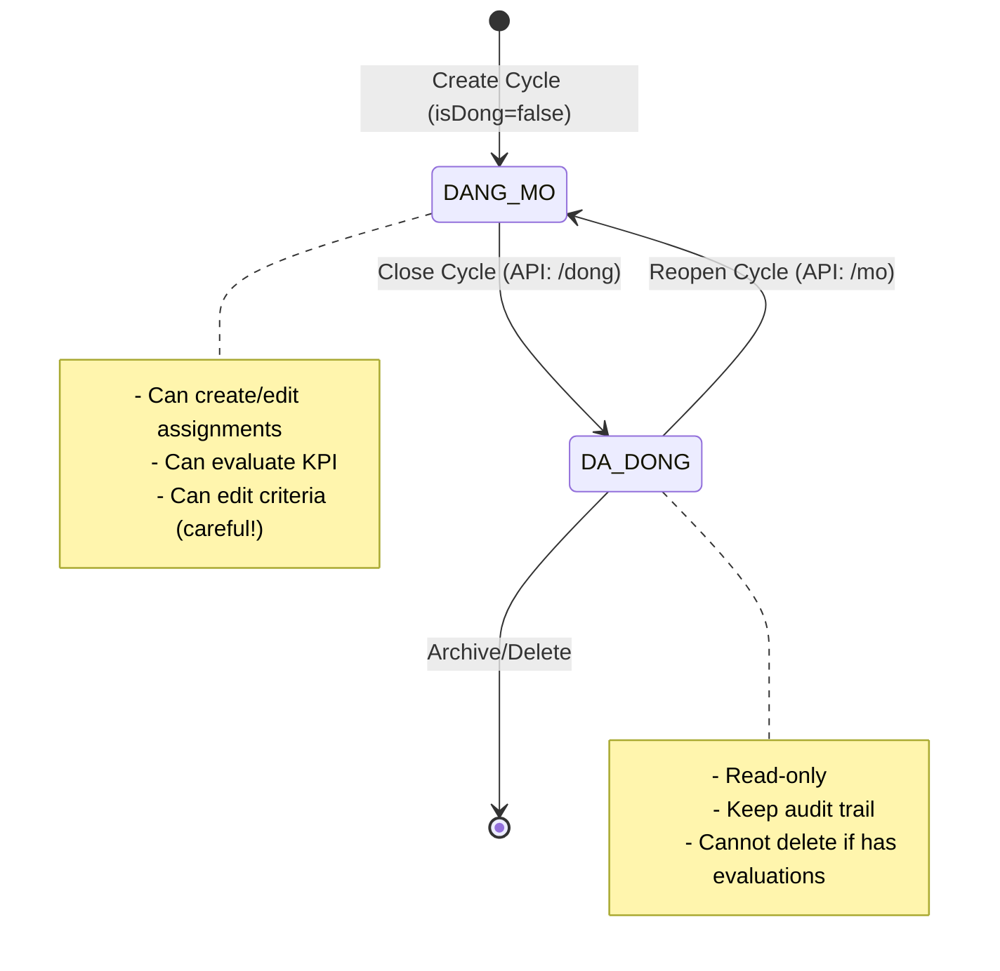
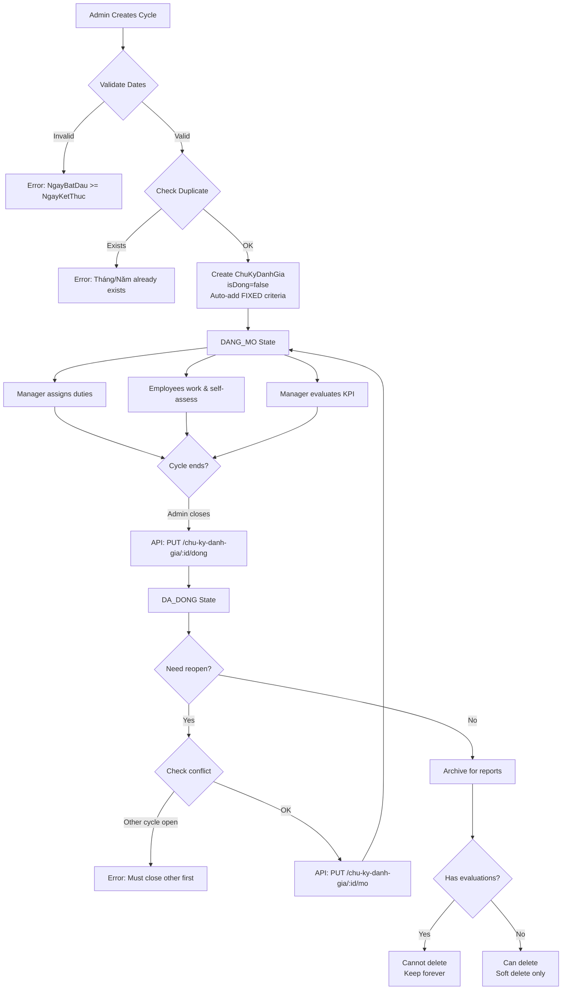
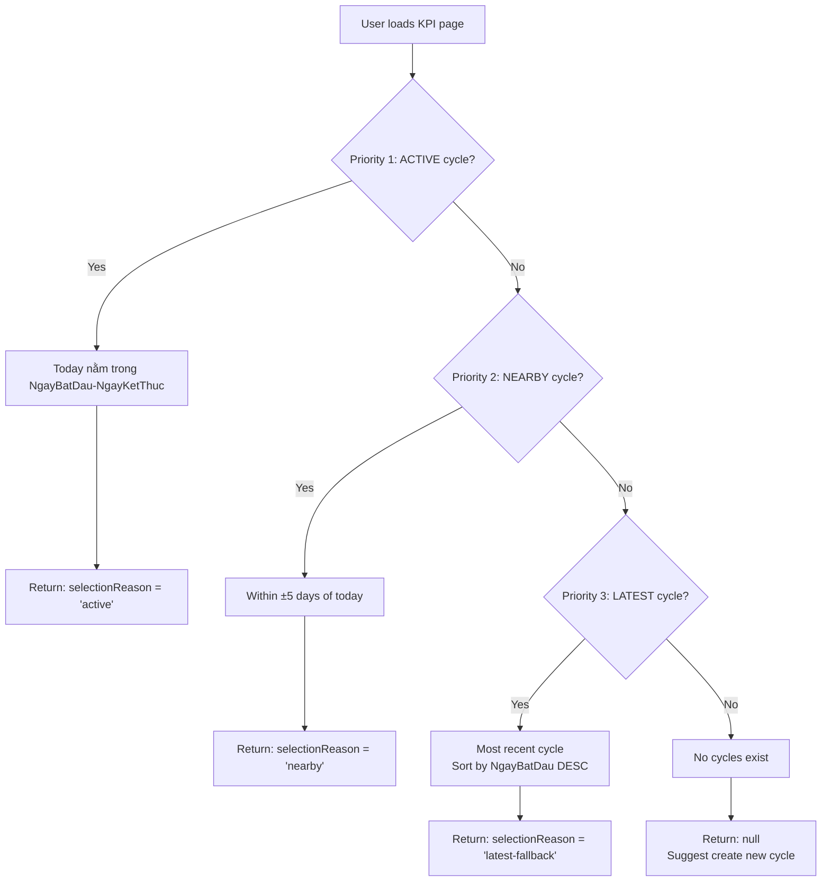

# 🔄 EVALUATION CYCLE - Chu Kỳ Đánh Giá

> **File**: 01_EVALUATION_CYCLE.md  
> **Module**: QuanLyCongViec/KPI (Performance Evaluation System)  
> **Mục tiêu**: Hiểu lifecycle và quản lý chu kỳ đánh giá KPI

---

## 📋 MỤC LỤC

1. [Khái Niệm Chu Kỳ](#1-khái-niệm-chu-kỳ)
2. [Cycle States & Lifecycle](#2-cycle-states--lifecycle)
3. [Period Management](#3-period-management)
4. [Cycle Operations](#4-cycle-operations)
5. [Auto-Selection Logic](#5-auto-selection-logic)
6. [Criteria Configuration](#6-criteria-configuration)
7. [Validation Rules](#7-validation-rules)
8. [Frontend Integration](#8-frontend-integration)

---

## 1. KHÁI NIỆM CHU KỲ

### 1.1. ChuKyDanhGia Model

**Model**: `ChuKyDanhGia` (Evaluation Cycle)  
**Purpose**: Định nghĩa khoảng thời gian đánh giá KPI (monthly/quarterly)

```javascript
{
  _id: ObjectId,
  TenChuKy: "Tháng 1/2026",           // Cycle name
  Thang: 1,                            // Month (1-12)
  Nam: 2026,                           // Year (>= 2020)
  NgayBatDau: Date("2026-01-01"),     // Start date
  NgayKetThuc: Date("2026-01-31"),    // End date
  isDong: false,                       // false = Open, true = Closed
  MoTa: "Đánh giá tháng đầu năm",     // Description (optional)
  NguoiTaoID: ObjectId,                // Creator (NhanVien)
  TieuChiCauHinh: [                    // Criteria config (array)
    {
      TenTieuChi: "Mức độ hoàn thành công việc",
      LoaiTieuChi: "TANG_DIEM",        // TANG_DIEM | GIAM_DIEM
      GiaTriMin: 0,
      GiaTriMax: 100,
      DonVi: "%",
      ThuTu: 0,
      GhiChu: "Tiêu chí cố định",
      IsMucDoHoanThanh: true           // FIXED criteria flag
    },
    // ... user-defined criteria
  ],
  isDeleted: false,                    // Soft delete flag
  createdAt: Date,
  updatedAt: Date
}
```

### 1.2. Scope & Duration

**Typical Cycle Duration**:

- **Monthly**: 1 tháng (most common)
- **Quarterly**: 3 tháng
- **Custom**: Tùy chỉnh theo nhu cầu

**Cycle Overlap**: ❌ **KHÔNG được phép**

- Chỉ 1 chu kỳ có thể `isDong = false` tại 1 thời điểm
- Validation khi mở lại chu kỳ cũ

---

## 2. CYCLE STATES & LIFECYCLE

### 2.1. State Machine

**ChuKyDanhGia có 2 states đơn giản**:



### 2.2. State Definitions

#### **DANG_MO** (Open) - `isDong = false`

**Characteristics**:

- ✅ Có thể gán nhiệm vụ cho nhân viên
- ✅ Có thể tạo/chỉnh sửa đánh giá KPI
- ✅ Có thể cập nhật tiêu chí (⚠️ Impact existing evaluations)
- ✅ Tự động chọn cho dropdown (default selection)

**UI Indicators**:

- Badge: `Đang mở` (success color)
- Icons: 🟢 hoặc ✅

#### **DA_DONG** (Closed) - `isDong = true`

**Characteristics**:

- 🔒 Read-only mode
- ❌ Không thể tạo đánh giá mới
- ❌ Không thể sửa tiêu chí
- ❌ Không thể xóa nếu có DanhGiaKPI liên quan
- ✅ Giữ audit trail cho báo cáo

**UI Indicators**:

- Badge: `Đã đóng` (default color)
- Icons: 🔴 hoặc 🔒

### 2.3. Lifecycle Flowchart



---

## 3. PERIOD MANAGEMENT

### 3.1. Date Fields

**NgayBatDau & NgayKetThuc**:

```javascript
// Example: January 2026 cycle
{
  NgayBatDau: new Date("2026-01-01T00:00:00Z"),
  NgayKetThuc: new Date("2026-01-31T23:59:59Z"),
  Thang: 1,
  Nam: 2026
}
```

**Validation Rules**:

- ✅ `NgayBatDau < NgayKetThuc`
- ✅ No date overlap with existing open cycle
- ❌ Cannot change dates if evaluations exist (integrity)

### 3.2. Thang/Nam Uniqueness

**Constraint**: `(Thang, Nam)` must be unique (per active cycles)

```javascript
// Backend validation
const existing = await ChuKyDanhGia.findOne({
  Thang: parseInt(Thang),
  Nam: parseInt(Nam),
  isDeleted: false,
});

if (existing) {
  throw new AppError(400, `Chu kỳ tháng ${Thang}/${Nam} đã tồn tại`);
}
```

**Purpose**:

- Tránh duplicate cycles
- Dễ tra cứu theo tháng/năm
- Support dropdown filtering

### 3.3. TenChuKy Auto-Generation

**Auto-generated if not provided**:

```javascript
// Model pre-save hook
if (!this.TenChuKy) {
  this.TenChuKy = `Tháng ${this.Thang}/${this.Nam}`;
}
```

**Custom names allowed**:

- "Q1 2026" (quarterly)
- "Đánh giá nửa đầu năm 2026"
- "Tháng 1/2026 - Khởi động năm mới"

---

## 4. CYCLE OPERATIONS

### 4.1. Create Cycle (POST)

**Endpoint**: `POST /api/workmanagement/chu-ky-danh-gia`

**Request Body**:

```json
{
  "TenChuKy": "Tháng 1/2026",
  "Thang": 1,
  "Nam": 2026,
  "NgayBatDau": "2026-01-01",
  "NgayKetThuc": "2026-01-31",
  "MoTa": "Đánh giá tháng đầu năm",
  "TieuChiCauHinh": [
    {
      "TenTieuChi": "Tỷ lệ hoàn thành đúng hạn",
      "LoaiTieuChi": "TANG_DIEM",
      "GiaTriMin": 0,
      "GiaTriMax": 100,
      "DonVi": "%",
      "GhiChu": "Số công việc hoàn thành / Tổng số"
    }
  ]
}
```

**Business Logic**:

1. **Validate required fields**: Thang, Nam, NgayBatDau, NgayKetThuc
2. **Check duplicate**: (Thang, Nam) uniqueness
3. **Validate dates**: NgayBatDau < NgayKetThuc
4. **Auto-add FIXED criteria**: "Mức độ hoàn thành công việc"
5. **Set ThuTu**: FIXED = 0, others = 1, 2, 3...
6. **Create document**: isDong = false (default)

**Response**:

```json
{
  "success": true,
  "data": {
    "chuKy": {
      "_id": "678abc...",
      "TenChuKy": "Tháng 1/2026",
      "isDong": false,
      "TieuChiCauHinh": [
        {
          "TenTieuChi": "Mức độ hoàn thành công việc",
          "IsMucDoHoanThanh": true,
          "ThuTu": 0
        },
        {
          "TenTieuChi": "Tỷ lệ hoàn thành đúng hạn",
          "IsMucDoHoanThanh": false,
          "ThuTu": 1
        }
      ]
    }
  },
  "message": "Tạo chu kỳ đánh giá thành công"
}
```

### 4.2. Update Cycle (PUT)

**Endpoint**: `PUT /api/workmanagement/chu-ky-danh-gia/:id`

**Request Body**: (similar to Create, all fields optional)

**Special Rules**:

- ✅ **Giữ FIXED criteria**: IsMucDoHoanThanh = true không bị xóa
- ⚠️ **Impact warning**: Changing criteria affects existing evaluations
- ❌ **Cannot change Thang/Nam** if conflicts with another cycle

**FIXED Criteria Protection**:

```javascript
// Backend logic
const tieuChiFixed = chuKy.TieuChiCauHinh.find(
  (tc) => tc.IsMucDoHoanThanh === true
);

if (!tieuChiFixed) {
  throw new AppError(500, "Thiếu tiêu chí 'Mức độ hoàn thành'");
}

// Merge: FIXED + user-defined
chuKy.TieuChiCauHinh = [
  { ...tieuChiFixed, ThuTu: 0 },
  ...TieuChiCauHinh.filter((tc) => !tc.IsMucDoHoanThanh).map((tc, i) => ({
    ...tc,
    ThuTu: i + 1,
  })),
];
```

### 4.3. Close Cycle (PUT)

**Endpoint**: `PUT /api/workmanagement/chu-ky-danh-gia/:id/dong`

**Request Body**: None (only :id param)

**Effect**:

- `isDong: false → true`
- Read-only mode activated
- Cannot create new evaluations

**Validation**:

- ❌ Already closed → Error: "Đã đóng"

**Use Case**:

- End of evaluation period
- Archive for historical reports
- Prevent new data entry

### 4.4. Reopen Cycle (PUT)

**Endpoint**: `PUT /api/workmanagement/chu-ky-danh-gia/:id/mo`

**Request Body**: None

**Effect**:

- `isDong: true → false`
- Writable mode restored

**Validation**:

1. ❌ Already open → Error
2. ⚠️ **Check other open cycles**:

```javascript
const chuKyDangMo = await ChuKyDanhGia.findOne({
  isDong: false,
  isDeleted: false,
  _id: { $ne: id }, // Exclude current
});

if (chuKyDangMo) {
  throw new AppError(
    400,
    `Đã có chu kỳ ${chuKyDangMo.TenChuKy} đang mở. Đóng chu kỳ đó trước.`
  );
}
```

**Use Case**:

- Fix missing evaluations
- Extend evaluation period
- Undo accidental close

### 4.5. Delete Cycle (DELETE)

**Endpoint**: `DELETE /api/workmanagement/chu-ky-danh-gia/:id`

**Soft Delete**: `isDeleted: false → true`

**Business Rules** (3 tiers):

1. ❌ **Cannot delete closed cycles**: Giữ audit trail

```javascript
if (chuKy.isDong === true) {
  throw new AppError(400, "Không thể xóa chu kỳ đã hoàn thành");
}
```

2. ❌ **Cannot delete if has evaluations**:

```javascript
const soDanhGia = await DanhGiaKPI.countDocuments({
  ChuKyDanhGiaID: id,
  isDeleted: { $ne: true },
});

if (soDanhGia > 0) {
  throw new AppError(400, `Không thể xóa vì đã có ${soDanhGia} bản đánh giá`);
}
```

3. ✅ **Auto-close before delete** (if open):

```javascript
if (chuKy.isDong === false) {
  chuKy.isDong = true;
  await chuKy.save();
}
```

**Why Soft Delete?**:

- Database integrity
- Potential recovery
- Audit trail preservation

---

## 5. AUTO-SELECTION LOGIC

### 5.1. Problem Statement

**User Experience Issue**:

- Dropdown có nhiều chu kỳ (12 tháng gần nhất)
- User phải chọn thủ công → Slow workflow
- **Solution**: Auto-select chu kỳ phù hợp nhất

### 5.2. 3-Tier Priority Logic

**Endpoint**: `GET /api/workmanagement/chu-ky-danh-gia/auto-select`

**Logic** (Priority 1 → 2 → 3):



### 5.3. Implementation Details

**Step 1: Active Cycle**

```javascript
const today = new Date();
today.setHours(0, 0, 0, 0); // Midnight for accurate comparison

let chuKy = await ChuKyDanhGia.findOne({
  isDeleted: false,
  NgayBatDau: { $lte: today },
  NgayKetThuc: { $gte: today },
})
  .sort({ isDong: 1, NgayBatDau: -1 }) // Open cycles first
  .populate("NguoiTaoID", "HoTen MaNhanVien");
```

**Step 2: Nearby Cycle (±5 days)**

```javascript
if (!chuKy) {
  const fiveDaysBefore = new Date(today);
  fiveDaysBefore.setDate(today.getDate() - 5);

  const fiveDaysLater = new Date(today);
  fiveDaysLater.setDate(today.getDate() + 5);

  chuKy = await ChuKyDanhGia.findOne({
    isDeleted: false,
    $or: [
      // Recently ended (within 5 days)
      { NgayKetThuc: { $gte: fiveDaysBefore, $lt: today } },
      // Starting soon (within 5 days)
      { NgayBatDau: { $gt: today, $lte: fiveDaysLater } },
    ],
  }).sort({ isDong: 1, NgayBatDau: -1 });
}
```

**Step 3: Latest Fallback**

```javascript
if (!chuKy) {
  chuKy = await ChuKyDanhGia.findOne({
    isDeleted: false,
  }).sort({ isDong: 1, NgayBatDau: -1 });
}
```

**Step 4: Suggest New Cycle**

```javascript
if (!chuKy) {
  return {
    chuKy: null,
    suggestion: {
      message: "Vui lòng tạo chu kỳ mới",
      suggestedDates: {
        NgayBatDau: new Date(today.getFullYear(), today.getMonth(), 1), // First day of month
        NgayKetThuc: new Date(today.getFullYear(), today.getMonth() + 1, 0), // Last day of month
      },
    },
  };
}
```

### 5.4. Response Format

**Success Response**:

```json
{
  "success": true,
  "data": {
    "chuKy": {
      "_id": "678abc...",
      "TenChuKy": "Tháng 1/2026",
      "NgayBatDau": "2026-01-01",
      "NgayKetThuc": "2026-01-31",
      "isDong": false
    },
    "info": {
      "today": "2026-01-15T00:00:00.000Z",
      "selectionReason": "active",
      "message": "Đã chọn chu kỳ: Tháng 1/2026"
    }
  },
  "message": "Tự động chọn chu kỳ thành công"
}
```

**No Cycle Response**:

```json
{
  "success": true,
  "data": {
    "chuKy": null,
    "suggestion": {
      "message": "Không tìm thấy chu kỳ. Vui lòng tạo mới.",
      "suggestedDates": {
        "NgayBatDau": "2026-01-01",
        "NgayKetThuc": "2026-01-31"
      }
    }
  },
  "message": "Không tìm thấy chu kỳ"
}
```

---

## 6. CRITERIA CONFIGURATION

### 6.1. TieuChiCauHinh Array

**Structure**: Mỗi chu kỳ có 1 array tiêu chí riêng

```javascript
TieuChiCauHinh: [
  {
    TenTieuChi: "Mức độ hoàn thành công việc",
    LoaiTieuChi: "TANG_DIEM", // TANG_DIEM | GIAM_DIEM
    GiaTriMin: 0,
    GiaTriMax: 100,
    DonVi: "%",
    ThuTu: 0,
    GhiChu: "Tiêu chí cố định",
    IsMucDoHoanThanh: true, // ✅ FIXED criteria
  },
  {
    TenTieuChi: "Tỷ lệ hoàn thành đúng hạn",
    LoaiTieuChi: "TANG_DIEM",
    GiaTriMin: 0,
    GiaTriMax: 100,
    DonVi: "%",
    ThuTu: 1,
    GhiChu: "",
    IsMucDoHoanThanh: false, // User-defined
  },
  // ... more criteria
];
```

### 6.2. FIXED vs User-Defined Criteria

**FIXED Criteria** (IsMucDoHoanThanh = true):

- ✅ Auto-created on cycle creation
- ✅ Cannot be deleted
- ✅ Name cannot change: "Mức độ hoàn thành công việc"
- ✅ Always ThuTu = 0 (first position)
- ✅ Allows self-assessment (DiemTuDanhGia)

**User-Defined Criteria** (IsMucDoHoanThanh = false):

- ✅ Admin creates custom criteria
- ✅ Can add/edit/delete freely
- ✅ ThuTu = 1, 2, 3... (after FIXED)
- ❌ No self-assessment (manager only)

### 6.3. LoaiTieuChi (Criteria Type)

**TANG_DIEM** (Positive):

- Higher score = Better performance
- Examples: Completion rate, quality score

**GIAM_DIEM** (Negative):

- Higher score = Worse performance (penalty)
- Examples: Late tasks, error count

**Impact**: Affects calculation (see 03_CALCULATION_FORMULAS.md)

### 6.4. Copy from Previous Cycle

**Endpoint**: `GET /api/workmanagement/chu-ky-danh-gia/previous-criteria`

**Use Case**: Quickly create new cycle with same criteria structure

**Logic**:

```javascript
const previousChuKy = await ChuKyDanhGia.findOne({
  isDeleted: false,
  TieuChiCauHinh: { $exists: true, $ne: [] },
})
  .sort({ NgayKetThuc: -1 }) // Most recent
  .select("TenChuKy TieuChiCauHinh")
  .lean();
```

**Response**:

```json
{
  "success": true,
  "data": {
    "chuKyName": "Tháng 12/2025",
    "tieuChi": [
      {
        "TenTieuChi": "Mức độ hoàn thành công việc",
        "LoaiTieuChi": "TANG_DIEM",
        "GiaTriMax": 100,
        "IsMucDoHoanThanh": true
      }
      // ... other criteria
    ]
  },
  "message": "Lấy tiêu chí từ 'Tháng 12/2025' thành công"
}
```

---

## 7. VALIDATION RULES

### 7.1. Model-Level Validation (Mongoose)

**Pre-Save Hook**:

```javascript
chuKyDanhGiaSchema.pre("save", function (next) {
  // Rule 1: NgayBatDau < NgayKetThuc
  if (this.NgayBatDau >= this.NgayKetThuc) {
    return next(new Error("Ngày kết thúc phải lớn hơn ngày bắt đầu"));
  }

  // Rule 2: Auto-generate TenChuKy
  if (!this.TenChuKy) {
    this.TenChuKy = `Tháng ${this.Thang}/${this.Nam}`;
  }

  // Rule 3: Must have exactly 1 FIXED criteria
  const tieuChiFixed = this.TieuChiCauHinh.filter(
    (tc) => tc.IsMucDoHoanThanh === true
  );

  if (tieuChiFixed.length === 0) {
    return next(
      new Error("Chu kỳ phải có tiêu chí 'Mức độ hoàn thành công việc'")
    );
  }

  if (tieuChiFixed.length > 1) {
    return next(new Error("Chỉ được có 1 tiêu chí FIXED"));
  }

  // Rule 4: FIXED criteria name cannot change
  if (tieuChiFixed[0].TenTieuChi !== "Mức độ hoàn thành công việc") {
    return next(new Error("Tên tiêu chí FIXED không được thay đổi"));
  }

  next();
});
```

### 7.2. Controller-Level Validation

**Business Rules**:

```javascript
// 1. Unique (Thang, Nam)
const existing = await ChuKyDanhGia.findOne({
  Thang,
  Nam,
  isDeleted: false,
  _id: { $ne: currentId }, // Exclude self when updating
});

// 2. Only one open cycle at a time
const openCycle = await ChuKyDanhGia.findOne({
  isDong: false,
  isDeleted: false,
  _id: { $ne: id },
});

// 3. Cannot delete if has evaluations
const evaluationCount = await DanhGiaKPI.countDocuments({
  ChuKyDanhGiaID: id,
  isDeleted: { $ne: true },
});
```

### 7.3. Validation Summary Table

| Rule                           | Level      | Error Message                                  |
| ------------------------------ | ---------- | ---------------------------------------------- |
| NgayBatDau < NgayKetThuc       | Model      | "Ngày kết thúc phải lớn hơn ngày bắt đầu"      |
| (Thang, Nam) unique            | Controller | "Chu kỳ tháng X/Y đã tồn tại"                  |
| 1 FIXED criteria required      | Model      | "Phải có tiêu chí 'Mức độ hoàn thành'"         |
| FIXED criteria name immutable  | Model      | "Tên tiêu chí FIXED không được thay đổi"       |
| Only 1 open cycle              | Controller | "Đã có chu kỳ X đang mở. Đóng chu kỳ đó trước" |
| Cannot delete closed cycles    | Controller | "Không thể xóa chu kỳ đã hoàn thành"           |
| Cannot delete with evaluations | Controller | "Không thể xóa vì đã có N bản đánh giá"        |

---

## 8. FRONTEND INTEGRATION

### 8.1. Redux State Management

**Slice**: `kpiSlice.js` & `kpiEvaluationSlice.js`

**State Structure**:

```javascript
{
  chuKyDanhGias: [
    { _id: "678abc", TenChuKy: "Tháng 1/2026", isDong: false },
    // ... more cycles
  ],
  selectedChuKyId: "678abc",      // Currently selected cycle
  isLoading: false,
  error: null
}
```

**Thunks** (Async Actions):

```javascript
// Get list for dropdown
export const getChuKyDanhGias = (filters) => async (dispatch) => {
  dispatch(slice.actions.startLoading());
  try {
    const response = await apiService.get("/workmanagement/chu-ky-danh-gia", {
      params: filters, // { isDong, thang, nam }
    });
    dispatch(slice.actions.getChuKyDanhGiasSuccess(response.data.data));
  } catch (error) {
    dispatch(slice.actions.hasError(error.message));
  }
};

// Auto-select best cycle
export const autoSelectChuKy = () => async (dispatch) => {
  const response = await apiService.get(
    "/workmanagement/chu-ky-danh-gia/auto-select"
  );
  return response.data.data.chuKy; // Return for immediate use
};
```

### 8.2. Cycle Selector Component

**Component**: Dropdown in KPI pages

```javascript
// pages/TuDanhGiaKPIPage.js (example)
const [selectedChuKyId, setSelectedChuKyId] = useState(null);
const chuKyDanhGias = useSelector((state) => state.kpi.chuKyDanhGias);

useEffect(() => {
  dispatch(getChuKyDanhGias({})); // Load all cycles
}, []);

useEffect(() => {
  if (chuKyDanhGias.length > 0 && !selectedChuKyId) {
    // Auto-select open cycle
    const openCycle = chuKyDanhGias.find((ck) => !ck.isDong);
    const defaultCycle = openCycle || chuKyDanhGias[0];
    setSelectedChuKyId(defaultCycle._id);
  }
}, [chuKyDanhGias, selectedChuKyId]);

const selectedChuKy = useMemo(() => {
  return chuKyDanhGias.find((ck) => ck._id === selectedChuKyId);
}, [chuKyDanhGias, selectedChuKyId]);

const canEdit = selectedChuKy && !selectedChuKy.isDong;
```

**UI Example**:

```jsx
<Autocomplete
  options={chuKyDanhGias}
  value={selectedChuKy}
  onChange={(e, newValue) => setSelectedChuKyId(newValue?._id)}
  getOptionLabel={(option) => option.TenChuKy}
  renderOption={(props, option) => (
    <Box component="li" {...props}>
      <Typography>{option.TenChuKy}</Typography>
      <Chip
        label={option.isDong ? "Đã đóng" : "Đang mở"}
        color={option.isDong ? "default" : "success"}
        size="small"
      />
    </Box>
  )}
/>
```

### 8.3. Conditional UI Based on isDong

**Read-Only Mode for Closed Cycles**:

```jsx
{
  selectedChuKy && selectedChuKy.isDong && (
    <Alert severity="info" sx={{ mb: 2 }}>
      Chu kỳ này đã đóng. Bạn chỉ có thể xem thông tin, không thể chỉnh sửa.
    </Alert>
  );
}

<Button
  variant="contained"
  disabled={!canEdit} // canEdit = !selectedChuKy.isDong
  onClick={handleSave}
>
  Lưu Tự Đánh Giá
</Button>;
```

### 8.4. Dashboard Integration

**Fetch data by cycle**:

```javascript
// v2/components/ChamDiemKPITable.js
useEffect(() => {
  if (nhanVienID && chuKyDanhGiaID && nhiemVuList.length > 0) {
    nhiemVuList.forEach((nv) => {
      const key = `${nv._id}_${chuKyDanhGiaID}`;
      if (!dashboardData[key]) {
        dispatch(
          fetchCongViecDashboardByNhiemVu({
            nhiemVuId: nv._id,
            nhanVienId: nhanVienID,
            chuKyDanhGiaID,
          })
        );
      }
    });
  }
}, [nhanVienID, chuKyDanhGiaID, nhiemVuList, dispatch, dashboardData]);
```

---

## 9. BEST PRACTICES

### 9.1. When to Close a Cycle

**✅ Close when**:

- Evaluation period ends (e.g., end of month)
- All evaluations are approved
- Ready to archive for reports

**❌ Don't close if**:

- Some evaluations are incomplete
- Need to add more criteria
- Employees haven't self-assessed

### 9.2. When to Reopen a Cycle

**✅ Reopen when**:

- Missed some evaluations
- Need to adjust scores
- Found errors in criteria

**⚠️ Careful**:

- Check no other cycle is open
- Notify employees about changes
- Re-close when done

### 9.3. Cycle Planning

**Monthly Cycles**:

- Create on 1st day of month
- Close on 5th day of next month (grace period)
- Archive after 6 months

**Quarterly Cycles**:

- Create at start of Q1/Q2/Q3/Q4
- Close 1 week after quarter ends
- Keep indefinitely (strategic data)

### 9.4. Data Migration Strategy

**When changing criteria structure**:

- ❌ **Don't** edit existing cycles with evaluations
- ✅ **Do** create new cycle with updated criteria
- 📊 Compare cycles for trend analysis

---

## 10. TROUBLESHOOTING

### 10.1. Common Issues

**Issue**: "Chu kỳ tháng X/Y đã tồn tại"

- **Cause**: Duplicate (Thang, Nam)
- **Fix**: Change month/year or delete old cycle

**Issue**: "Đã có chu kỳ X đang mở"

- **Cause**: Trying to open 2nd cycle
- **Fix**: Close other cycle first via `/chu-ky-danh-gia/:id/dong`

**Issue**: "Không thể xóa vì đã có N bản đánh giá"

- **Cause**: Cycle has DanhGiaKPI records
- **Fix**: Delete evaluations first (not recommended) or keep cycle

**Issue**: No cycle selected in dropdown

- **Cause**: All cycles are closed
- **Fix**: Reopen most recent cycle or create new one

### 10.2. Debug Checklist

**Cycle not appearing in dropdown?**

- [ ] Check `isDeleted = false`
- [ ] Check query filters (isDong, thang, nam)
- [ ] Check sort order (NgayBatDau DESC)

**Auto-select not working?**

- [ ] Verify today's date calculation
- [ ] Check if any cycle is active (today within period)
- [ ] Check ±5 days window for nearby cycles

**Cannot create evaluation in open cycle?**

- [ ] Verify `isDong = false`
- [ ] Check NhanVienNhiemVu assignments exist
- [ ] Check TieuChiCauHinh not empty

---

## 11. RELATED FILES

**Backend**:

- [ChuKyDanhGia.js](../../giaobanbv-be/modules/workmanagement/models/ChuKyDanhGia.js) - Model (219 lines)
- [chuKyDanhGia.controller.js](../../giaobanbv-be/modules/workmanagement/controllers/chuKyDanhGia.controller.js) - Controller (614 lines)
- [chuKyDanhGia.api.js](../../giaobanbv-be/modules/workmanagement/routes/chuKyDanhGia.api.js) - Routes

**Frontend**:

- [kpiSlice.js](../../src/features/QuanLyCongViec/KPI/kpiSlice.js) - Redux state (~800 lines)
- [TuDanhGiaKPIPage.js](../../src/features/QuanLyCongViec/KPI/pages/TuDanhGiaKPIPage.js) - Cycle selector UI
- [DanhGiaKPIDashboard.js](../../src/features/QuanLyCongViec/KPI/v2/pages/DanhGiaKPIDashboard.js) - Main dashboard

---

## 12. NEXT STEPS

**Continue to**:

- [02_CRITERIA_SYSTEM.md](./02_CRITERIA_SYSTEM.md) - TieuChiDanhGia structure & configuration
- [03_CALCULATION_FORMULAS.md](./03_CALCULATION_FORMULAS.md) - How cycle criteria affect scoring

**Related Topics**:

- [04_APPROVAL_WORKFLOW.md](./04_APPROVAL_WORKFLOW.md) - Cycle close triggers approval flow
- [05_TASK_INTEGRATION.md](./05_TASK_INTEGRATION.md) - Dashboard metrics filtered by cycle

---

**Ngày tạo**: 5/1/2026  
**Phiên bản**: 1.0  
**Tác giả**: Documentation Team  
**Status**: ✅ Complete
