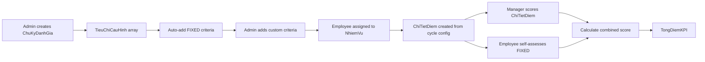
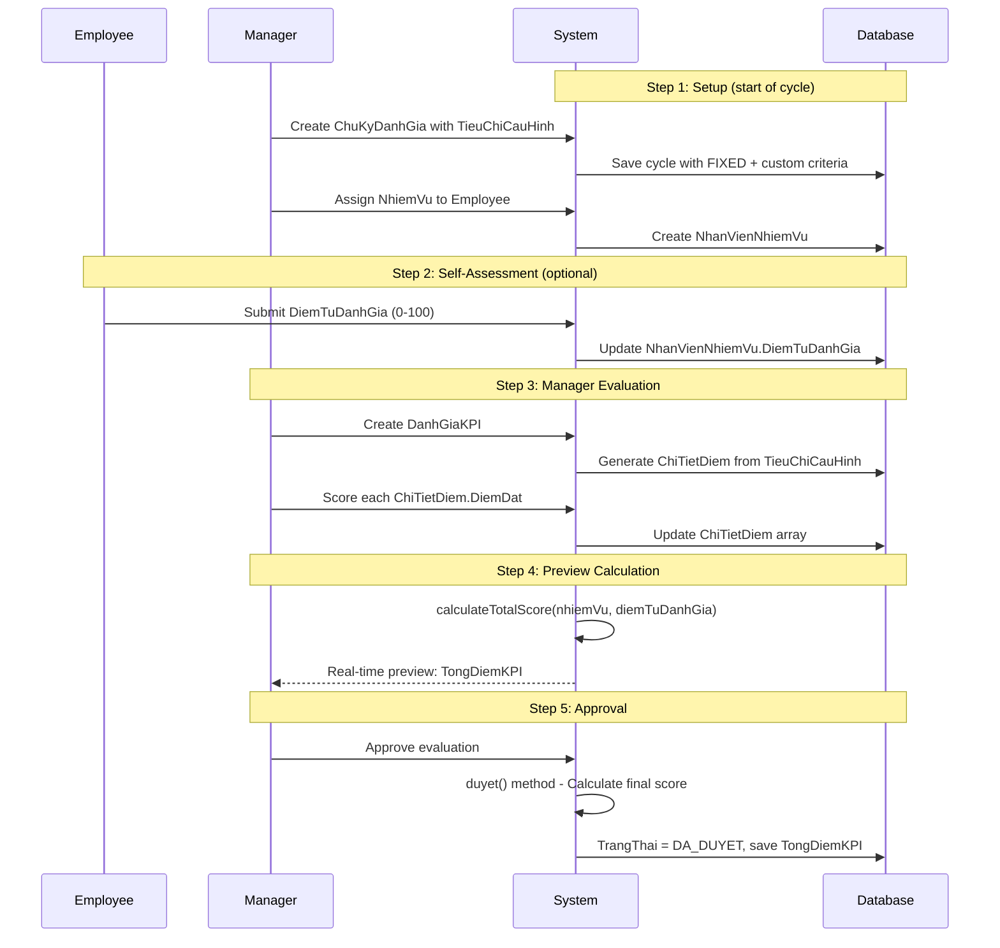

# 📊 CRITERIA SYSTEM - Hệ Thống Tiêu Chí Đánh Giá

> **File**: 02_CRITERIA_SYSTEM.md  
> **Module**: QuanLyCongViec/KPI (Performance Evaluation System)  
> **Mục tiêu**: Hiểu cấu trúc tiêu chí, scoring rubrics, và weight calculation

---

## 📋 MỤC LỤC

1. [Criteria Overview](#1-criteria-overview)
2. [Criteria Configuration per Cycle](#2-criteria-configuration-per-cycle)
3. [FIXED vs User-Defined Criteria](#3-fixed-vs-user-defined-criteria)
4. [LoaiTieuChi (Criteria Type)](#4-loaitieuchi-criteria-type)
5. [ChiTietDiem Structure](#5-chitietdiem-structure)
6. [Customization per Employee](#6-customization-per-employee)
7. [Scoring Workflow](#7-scoring-workflow)
8. [Weight Calculation (MucDoKho)](#8-weight-calculation-muckdokho)
9. [Validation & Edge Cases](#9-validation--edge-cases)

---

## 1. CRITERIA OVERVIEW

### 1.1. What are Criteria?

**TieuChiDanhGia** (Evaluation Criteria) là các chỉ số được sử dụng để đánh giá hiệu suất công việc của nhân viên.

**Key Concepts**:

- **Cycle-Level Config**: Tiêu chí được cấu hình trong `ChuKyDanhGia.TieuChiCauHinh` (array)
- **Employee-Level Scoring**: Điểm được ghi trong `DanhGiaNhiemVuThuongQuy.ChiTietDiem` (array)
- **TANG_DIEM/GIAM_DIEM**: 2 loại tiêu chí (positive/negative scoring)
- **FIXED Criteria**: "Mức độ hoàn thành công việc" (required, allows self-assessment)

### 1.2. Criteria Lifecycle



### 1.3. Three-Level Hierarchy

**Level 1: ChuKyDanhGia.TieuChiCauHinh** (Cycle Template)

- Định nghĩa tiêu chí cho toàn bộ chu kỳ
- Áp dụng cho tất cả employees trong chu kỳ đó
- Có thể copy từ chu kỳ trước

**Level 2: NhanVienNhiemVu.TieuChiDanhGia** (Employee Assignment)

- Customize tiêu chí cho từng employee cụ thể (optional)
- Override cycle template nếu cần
- Thêm/bớt tiêu chí per employee

**Level 3: DanhGiaNhiemVuThuongQuy.ChiTietDiem** (Scoring Data)

- Lưu điểm thực tế cho từng tiêu chí
- `DiemDat` (manager score) + `DiemTuDanhGia` (self-score)
- Read-only sau khi duyệt

---

## 2. CRITERIA CONFIGURATION PER CYCLE

### 2.1. TieuChiCauHinh Schema

**Location**: `ChuKyDanhGia.TieuChiCauHinh` (embedded array)

```javascript
{
  TenTieuChi: "Mức độ hoàn thành công việc",  // Criteria name
  LoaiTieuChi: "TANG_DIEM",                   // TANG_DIEM | GIAM_DIEM
  GiaTriMin: 0,                                // Min score (default 0)
  GiaTriMax: 100,                              // Max score (default 100)
  DonVi: "%",                                  // Unit (%, điểm, số lượng)
  ThuTu: 0,                                    // Display order (0 = first)
  GhiChu: "Tiêu chí cố định",                  // Notes
  IsMucDoHoanThanh: true                       // FIXED flag
}
```

**Field Descriptions**:

| Field            | Type    | Required | Description                               |
| ---------------- | ------- | -------- | ----------------------------------------- |
| TenTieuChi       | String  | ✅       | Tên hiển thị (max 255 chars)              |
| LoaiTieuChi      | String  | ✅       | `TANG_DIEM` hoặc `GIAM_DIEM`              |
| GiaTriMin        | Number  | ❌       | Giá trị tối thiểu (default 0)             |
| GiaTriMax        | Number  | ✅       | Giá trị tối đa (default 100)              |
| DonVi            | String  | ❌       | Đơn vị (%, điểm, tasks)                   |
| ThuTu            | Number  | ❌       | Thứ tự hiển thị (0-N)                     |
| GhiChu           | String  | ❌       | Ghi chú/hướng dẫn chấm điểm               |
| IsMucDoHoanThanh | Boolean | ✅       | `true` = FIXED criteria, `false` = custom |

### 2.2. Example Cycle Configuration

**Cycle**: "Tháng 1/2026"

```javascript
{
  TenChuKy: "Tháng 1/2026",
  TieuChiCauHinh: [
    // ✅ FIXED Criteria (auto-added)
    {
      TenTieuChi: "Mức độ hoàn thành công việc",
      LoaiTieuChi: "TANG_DIEM",
      GiaTriMin: 0,
      GiaTriMax: 100,
      DonVi: "%",
      ThuTu: 0,
      IsMucDoHoanThanh: true,
      GhiChu: "Nhân viên tự đánh giá, quản lý chấm điểm"
    },
    // ✅ Custom Criteria (admin-defined)
    {
      TenTieuChi: "Tỷ lệ hoàn thành đúng hạn",
      LoaiTieuChi: "TANG_DIEM",
      GiaTriMin: 0,
      GiaTriMax: 100,
      DonVi: "%",
      ThuTu: 1,
      IsMucDoHoanThanh: false,
      GhiChu: "Số công việc đúng hạn / Tổng số công việc"
    },
    {
      TenTieuChi: "Số công việc trễ hạn",
      LoaiTieuChi: "GIAM_DIEM",
      GiaTriMin: 0,
      GiaTriMax: 10,
      DonVi: "tasks",
      ThuTu: 2,
      IsMucDoHoanThanh: false,
      GhiChu: "Mỗi công việc trễ = -10 điểm"
    },
    {
      TenTieuChi: "Chất lượng công việc",
      LoaiTieuChi: "TANG_DIEM",
      GiaTriMin: 0,
      GiaTriMax: 100,
      DonVi: "%",
      ThuTu: 3,
      IsMucDoHoanThanh: false,
      GhiChu: "Đánh giá chủ quan của quản lý"
    }
  ]
}
```

### 2.3. Auto-Create FIXED Criteria

**Backend Logic** (Create Cycle):

```javascript
// Auto-create FIXED criteria
const tieuChiMucDoHoanThanh = {
  TenTieuChi: "Mức độ hoàn thành công việc",
  LoaiTieuChi: "TANG_DIEM",
  GiaTriMin: 0,
  GiaTriMax: 100,
  DonVi: "%",
  ThuTu: 0, // Always first
  GhiChu: "Tiêu chí cố định, nhân viên tự đánh giá",
  IsMucDoHoanThanh: true,
};

// Merge with user-defined criteria
const allTieuChi = [
  tieuChiMucDoHoanThanh,
  ...TieuChiCauHinh.map((tc, index) => ({
    ...tc,
    IsMucDoHoanThanh: false,
    ThuTu: index + 1, // Start from 1
  })),
];
```

**Why Auto-Create?**:

- Ensures consistency across all cycles
- Self-assessment feature always available
- Cannot be accidentally deleted

---

## 3. FIXED VS USER-DEFINED CRITERIA

### 3.1. FIXED Criteria

**Definition**: Tiêu chí "Mức độ hoàn thành công việc" (`IsMucDoHoanThanh = true`)

**Characteristics**:

- ✅ Auto-created khi tạo chu kỳ
- ✅ **Cannot be deleted** (validation error)
- ✅ **Name is immutable**: Must be "Mức độ hoàn thành công việc"
- ✅ **Always ThuTu = 0** (first position)
- ✅ **Allows self-assessment**: Employee can input `DiemTuDanhGia`
- ✅ **Combined scoring**: `(DiemQL × 2 + DiemTuDanhGia) / 3`

**Validation Rules**:

```javascript
// Model pre-save hook
const tieuChiFixed = this.TieuChiCauHinh.filter(
  (tc) => tc.IsMucDoHoanThanh === true
);

if (tieuChiFixed.length === 0) {
  throw new Error("Chu kỳ phải có tiêu chí 'Mức độ hoàn thành'");
}

if (tieuChiFixed.length > 1) {
  throw new Error("Chỉ được có 1 tiêu chí FIXED");
}

if (tieuChiFixed[0].TenTieuChi !== "Mức độ hoàn thành công việc") {
  throw new Error("Tên tiêu chí FIXED không được thay đổi");
}
```

**Why FIXED?**:

- Core metric for all evaluations
- Self-assessment improves employee engagement
- Consistent across all cycles for reporting

### 3.2. User-Defined Criteria

**Definition**: Tiêu chí custom do admin tạo (`IsMucDoHoanThanh = false`)

**Characteristics**:

- ✅ Admin can add/edit/delete freely
- ✅ Name can be customized
- ✅ ThuTu = 1, 2, 3... (after FIXED)
- ❌ **No self-assessment**: Manager only
- ✅ **Direct scoring**: `DiemNhiemVu = DiemQL`

**Examples**:

- "Tỷ lệ hoàn thành đúng hạn" (TANG_DIEM)
- "Số lỗi trong công việc" (GIAM_DIEM)
- "Chất lượng báo cáo" (TANG_DIEM)
- "Số lần vi phạm quy định" (GIAM_DIEM)

### 3.3. Comparison Table

| Feature                | FIXED Criteria                | User-Defined Criteria |
| ---------------------- | ----------------------------- | --------------------- |
| **Name**               | "Mức độ hoàn thành công việc" | Custom                |
| **IsMucDoHoanThanh**   | `true`                        | `false`               |
| **ThuTu**              | Always `0`                    | `1`, `2`, `3`...      |
| **Self-Assessment**    | ✅ Yes (`DiemTuDanhGia`)      | ❌ No                 |
| **Manager Score**      | ✅ Yes (`DiemDat`)            | ✅ Yes (`DiemDat`)    |
| **Combined Formula**   | `(DiemQL × 2 + DiemTD) / 3`   | `DiemQL`              |
| **Can Delete?**        | ❌ No                         | ✅ Yes                |
| **Can Rename?**        | ❌ No                         | ✅ Yes                |
| **Required in Cycle?** | ✅ Yes (validation)           | ❌ No (optional)      |

---

## 4. LOAITIEUCHI (CRITERIA TYPE)

### 4.1. Two Types

**TANG_DIEM** (Positive Scoring):

- Higher score = Better performance
- Examples: Completion rate, quality score, customer satisfaction

**GIAM_DIEM** (Negative Scoring):

- Higher score = Worse performance (penalty)
- Examples: Late tasks, errors, complaints

### 4.2. Scoring Logic

**Formula Impact**:

```javascript
// Tính điểm nhiệm vụ
let diemTang = 0; // Sum of TANG_DIEM (0-N)
let diemGiam = 0; // Sum of GIAM_DIEM (0-N)

ChiTietDiem.forEach((tc) => {
  const diemScaled = tc.DiemDat / 100; // Scale 0-1

  if (tc.LoaiTieuChi === "TANG_DIEM") {
    diemTang += diemScaled;
  } else {
    diemGiam += diemScaled;
  }
});

// TongDiemTieuChi = Tăng - Giảm (can be negative!)
const tongDiemTieuChi = diemTang - diemGiam;

// DiemNhiemVu = MucDoKho × TongDiem
const diemNhiemVu = mucDoKho * tongDiemTieuChi;
```

### 4.3. Visual Examples

**Example 1: All TANG_DIEM**

```
Criteria:
- Mức độ hoàn thành: 80% (TANG_DIEM) → 0.8
- Chất lượng: 90% (TANG_DIEM) → 0.9

TongDiemTieuChi = 0.8 + 0.9 = 1.7
DiemNhiemVu = 7.0 (MucDoKho) × 1.7 = 11.9
```

**Example 2: Mixed TANG_DIEM + GIAM_DIEM**

```
Criteria:
- Mức độ hoàn thành: 80% (TANG_DIEM) → +0.8
- Tỷ lệ đúng hạn: 70% (TANG_DIEM) → +0.7
- Số lỗi: 20% (GIAM_DIEM) → -0.2

TongDiemTieuChi = (0.8 + 0.7) - 0.2 = 1.3
DiemNhiemVu = 6.5 (MucDoKho) × 1.3 = 8.45
```

**Example 3: Negative Score (Poor Performance)**

```
Criteria:
- Mức độ hoàn thành: 30% (TANG_DIEM) → +0.3
- Số công việc trễ: 80% (GIAM_DIEM) → -0.8

TongDiemTieuChi = 0.3 - 0.8 = -0.5 (negative!)
DiemNhiemVu = 5.0 (MucDoKho) × (-0.5) = -2.5
```

### 4.4. UI Indicators

**Color Coding**:

```jsx
// Frontend: TieuChiGrid.js
const chipColor =
  tc.LoaiTieuChi === "TANG_DIEM"
    ? "success" // Green
    : "error"; // Red

const icon = tc.LoaiTieuChi === "TANG_DIEM" ? "↑" : "↓";
```

**Display**:

- 🟢 **↑ TANG_DIEM** (green chip)
- 🔴 **↓ GIAM_DIEM** (red chip)

---

## 5. CHITIETDIEM STRUCTURE

### 5.1. Schema Definition

**Location**: `DanhGiaNhiemVuThuongQuy.ChiTietDiem` (embedded array)

```javascript
{
  TenTieuChi: "Mức độ hoàn thành công việc",
  LoaiTieuChi: "TANG_DIEM",

  // ✅ Manager score (primary)
  DiemDat: 85,                    // 0-100

  // ✅ Self-assessment (FIXED criteria only)
  IsMucDoHoanThanh: true,         // Flag for self-assessment

  // Metadata (copied from cycle config)
  GiaTriMin: 0,
  GiaTriMax: 100,
  DonVi: "%",
  MoTa: "",
  ThuTu: 0,
  GhiChu: ""
}
```

### 5.2. Field Mapping

**Copy Flow**: `ChuKyDanhGia.TieuChiCauHinh` → `ChiTietDiem`

```javascript
// Backend: Create evaluation
const chiTietDiem = chuKy.TieuChiCauHinh.map((tc) => ({
  TenTieuChi: tc.TenTieuChi,
  LoaiTieuChi: tc.LoaiTieuChi,
  GiaTriMin: tc.GiaTriMin || 0,
  GiaTriMax: tc.GiaTriMax || 100,
  DonVi: tc.DonVi || "%",
  MoTa: tc.MoTa || "",
  ThuTu: tc.ThuTu || 0,
  GhiChu: tc.GhiChu || "",
  IsMucDoHoanThanh: tc.IsMucDoHoanThanh || false,
  DiemDat: null, // Manager will score later
}));
```

### 5.3. Scoring Fields

**DiemDat** (Manager Score):

- Input by manager via UI
- Range: `GiaTriMin` to `GiaTriMax`
- Required for approval
- Can be 0 (valid score)

**DiemTuDanhGia** (Self-Assessment):

- ⚠️ **Not stored in ChiTietDiem!**
- Stored in `NhanVienNhiemVu.DiemTuDanhGia`
- Only for FIXED criteria (`IsMucDoHoanThanh = true`)
- Range: 0-100
- Optional (default 0 if null)

### 5.4. Why Separate Self-Assessment Storage?

**Design Decision**:

```
ChiTietDiem (per criteria) → DiemDat (manager score)
NhanVienNhiemVu (per assignment) → DiemTuDanhGia (employee score)
```

**Reasons**:

1. **Single Self-Score**: Employee chấm 1 điểm cho toàn bộ nhiệm vụ, không phải từng tiêu chí
2. **Backward Compatibility**: Existing assignments have `DiemTuDanhGia`
3. **Simpler UI**: Employee sees one input field, not multiple
4. **Calculation**: Self-score chỉ áp dụng cho FIXED criteria

---

## 6. CUSTOMIZATION PER EMPLOYEE

### 6.1. NhanVienNhiemVu.TieuChiDanhGia

**Purpose**: Override cycle template với tiêu chí custom cho nhân viên cụ thể

**Schema** (optional field):

```javascript
{
  NhanVienID: "66b1dba74f79822a4752d90d",
  NhiemVuThuongQuyID: "64f8abc...",
  ChuKyDanhGiaID: "678abc...",

  // ✅ Optional: Custom criteria for this employee
  TieuChiDanhGia: [
    {
      TenTieuChi: "Custom Criteria 1",
      LoaiTieuChi: "TANG_DIEM",
      GiaTriMax: 100,
      TrongSo: 0.3,        // Optional weight
      GhiChu: "Special focus area"
    }
  ],

  MucDoKho: 7.5,
  DiemTuDanhGia: 85
}
```

### 6.2. When to Use Custom Criteria?

**Use Cases**:

1. **Different Job Roles**: Developer vs Designer có tiêu chí khác nhau
2. **Probation Period**: Nhân viên mới có tiêu chí đào tạo thêm
3. **Special Projects**: Tiêu chí riêng cho dự án đặc biệt
4. **Performance Improvement Plan**: Focus vào weak areas

**Example**:

```
Cycle Criteria (default):
- Mức độ hoàn thành công việc
- Tỷ lệ đúng hạn
- Chất lượng code

Employee A (Senior Dev) - Custom:
- Mức độ hoàn thành công việc
- Tỷ lệ đúng hạn
- Chất lượng code
- ✅ Mentor junior developers (TANG_DIEM)
- ✅ Technical leadership (TANG_DIEM)

Employee B (Junior Dev) - Custom:
- Mức độ hoàn thành công việc
- Tỷ lệ đúng hạn
- Chất lượng code
- ✅ Learning progress (TANG_DIEM)
```

### 6.3. Priority Order

**Criteria Resolution**:

1. **Check `NhanVienNhiemVu.TieuChiDanhGia`** → Use if exists
2. **Fallback to `ChuKyDanhGia.TieuChiCauHinh`** → Default template

```javascript
// Backend: Get criteria for evaluation
const assignment = await NhanVienNhiemVu.findOne({
  NhanVienID,
  NhiemVuThuongQuyID,
  ChuKyDanhGiaID,
});

const tieuChiToUse =
  assignment.TieuChiDanhGia && assignment.TieuChiDanhGia.length > 0
    ? assignment.TieuChiDanhGia // Custom per employee
    : chuKy.TieuChiCauHinh; // Cycle template
```

---

## 7. SCORING WORKFLOW

### 7.1. End-to-End Flow



### 7.2. Manager Scoring UI

**Component**: `ChamDiemKPITable.js` (~1700 lines)

**Features**:

- Grid layout với columns per criteria
- Slider inputs (0-100)
- Color-coded by LoaiTieuChi
- Real-time calculation preview
- Bulk approve checkbox

**Example UI**:

```
┌────────────────────────────────────────────────────────────┐
│  Nhiệm Vụ      │ ↑ Hoàn thành │ ↑ Đúng hạn │ ↓ Số lỗi │ Điểm │
├────────────────────────────────────────────────────────────┤
│  Support khách │  [====85===] │ [====70==] │ [=20=]   │ 8.5  │
│  Xử lý bug     │  [====90===] │ [====80==] │ [=10=]   │ 10.2 │
└────────────────────────────────────────────────────────────┘
```

### 7.3. Self-Assessment UI

**Component**: `TuDanhGiaKPIPage.js`

**Features**:

- Single input field per nhiemVu
- Range: 0-100
- Tooltip: "Đánh giá mức độ hoàn thành công việc của bạn"
- Save immediately on change

**Example**:

```jsx
<TextField
  label="Mức độ hoàn thành (%)"
  type="number"
  value={diemTuDanhGia}
  onChange={(e) => handleSelfScore(nhiemVuId, e.target.value)}
  InputProps={{
    endAdornment: <InputAdornment position="end">%</InputAdornment>,
  }}
  helperText="Bạn tự đánh giá mình hoàn thành được bao nhiêu % công việc này"
/>
```

---

## 8. WEIGHT CALCULATION (MUCKDOKHO)

### 8.1. MucDoKho Definition

**Purpose**: Độ khó/trọng số của nhiệm vụ (1.0-10.0)

**Storage**: `NhanVienNhiemVu.MucDoKho` & `DanhGiaNhiemVuThuongQuy.MucDoKho`

**Range**:

- Min: 1.0 (very easy)
- Max: 10.0 (very hard)
- Precision: 1 decimal place (e.g., 5.5, 7.2)

**Examples**:

- 1.0-3.0: Routine tasks (answering emails, simple reports)
- 4.0-6.0: Normal tasks (bug fixes, standard features)
- 7.0-8.0: Complex tasks (architecture design, critical bugs)
- 9.0-10.0: Expert tasks (system migration, major refactoring)

### 8.2. Weight Formula

**Impact on Final Score**:

```javascript
// Step 1: Tính điểm tiêu chí (scaled 0-1)
TongDiemTieuChi = (diemTang - diemGiam) / số_tiêu_chí

// Step 2: Nhân với MucDoKho
DiemNhiemVu = MucDoKho × TongDiemTieuChi

// Step 3: Cộng dồn tất cả nhiệm vụ
TongDiemKPI = SUM(DiemNhiemVu)
```

**Why MucDoKho?**:

- Fair comparison between easy/hard tasks
- Encourages taking challenging work
- Reflects actual workload

### 8.3. Weighted Average Example

**Employee A - 3 nhiệm vụ**:

```
NhiemVu 1 (Easy):
  MucDoKho = 3.0
  TongDiemTieuChi = 0.9 (90% completion)
  DiemNhiemVu = 3.0 × 0.9 = 2.7

NhiemVu 2 (Normal):
  MucDoKho = 5.0
  TongDiemTieuChi = 0.8 (80% completion)
  DiemNhiemVu = 5.0 × 0.8 = 4.0

NhiemVu 3 (Hard):
  MucDoKho = 8.0
  TongDiemTieuChi = 0.7 (70% completion)
  DiemNhiemVu = 8.0 × 0.7 = 5.6

TongDiemKPI = 2.7 + 4.0 + 5.6 = 12.3
```

**Interpretation**: Higher `MucDoKho` → More contribution to final score (even with lower completion %)

### 8.4. How is MucDoKho Set?

**Option 1: Manual Input (Current)**

- Manager inputs when assigning nhiemVu
- Based on subjective assessment
- Can be adjusted per employee

**Option 2: Template-Based (Future)**

- `NhiemVuThuongQuy` has default `MucDoKho`
- Auto-populate when assigning
- Manager can override

**Validation**:

```javascript
MucDoKho: {
  type: Number,
  required: true,
  min: 1.0,
  max: 10.0,
  validate: {
    validator: (v) => Math.round(v * 10) === v * 10,
    message: "MucDoKho phải có tối đa 1 chữ số thập phân (VD: 5.5, 7.2)"
  }
}
```

---

## 9. VALIDATION & EDGE CASES

### 9.1. Criteria Validation Rules

**At Cycle Level**:

```javascript
// 1. Must have exactly 1 FIXED criteria
const fixedCount = TieuChiCauHinh.filter(
  (tc) => tc.IsMucDoHoanThanh === true
).length;
if (fixedCount !== 1) {
  throw new Error("Chu kỳ phải có đúng 1 tiêu chí FIXED");
}

// 2. FIXED name is immutable
if (fixedCriteria.TenTieuChi !== "Mức độ hoàn thành công việc") {
  throw new Error("Tên tiêu chí FIXED không được thay đổi");
}

// 3. GiaTriMax > GiaTriMin
if (tc.GiaTriMax <= tc.GiaTriMin) {
  throw new Error("GiaTriMax phải lớn hơn GiaTriMin");
}

// 4. LoaiTieuChi valid enum
if (!["TANG_DIEM", "GIAM_DIEM"].includes(tc.LoaiTieuChi)) {
  throw new Error("LoaiTieuChi không hợp lệ");
}
```

**At Scoring Level**:

```javascript
// 1. DiemDat within range
if (diemDat < giaTriMin || diemDat > giaTriMax) {
  throw new Error(`Điểm phải từ ${giaTriMin} đến ${giaTriMax}`);
}

// 2. DiemTuDanhGia within 0-100
if (diemTuDanhGia < 0 || diemTuDanhGia > 100) {
  throw new Error("Điểm tự đánh giá phải từ 0-100");
}

// 3. Cannot score approved evaluation
if (evaluation.TrangThai === "DA_DUYET") {
  throw new Error("Không thể chấm điểm đánh giá đã duyệt");
}
```

### 9.2. Edge Cases

**Case 1: Missing Criteria**

**Scenario**: Employee assigned before cycle created criteria

```javascript
// Solution: Use cycle's TieuChiCauHinh as fallback
const criteria =
  assignment.TieuChiDanhGia?.length > 0
    ? assignment.TieuChiDanhGia
    : chuKy.TieuChiCauHinh;
```

**Case 2: Zero Weights (All GIAM_DIEM)**

**Scenario**: TongDiemTieuChi = negative → DiemNhiemVu = negative

```javascript
// This is VALID! Negative score = poor performance
TongDiemTieuChi = 0.2 - 0.8 = -0.6
DiemNhiemVu = 5.0 × (-0.6) = -3.0
```

**Case 3: Incomplete Scoring**

**Scenario**: Manager chỉ chấm 1 trong 3 tiêu chí

```javascript
// Other criteria = 0 (not null) → affects calculation
ChiTietDiem = [
  { DiemDat: 80 }, // Scored
  { DiemDat: null }, // Not scored → treated as 0
  { DiemDat: null },
];

// Solution: Require all criteria before approval
const allScored = ChiTietDiem.every((tc) => tc.DiemDat !== null);
if (!allScored) {
  throw new Error("Vui lòng chấm điểm tất cả tiêu chí");
}
```

**Case 4: Self-Score without Manager Score**

**Scenario**: Employee tự chấm 85%, manager chưa chấm

```javascript
// Formula: (DiemQL × 2 + DiemTD) / 3
// If DiemQL = null → treated as 0
diemCuoiCung = (0 × 2 + 85) / 3 = 28.33

// Solution: Validate manager scored FIXED criteria
if (fixedCriteria.DiemDat === null) {
  throw new Error("Quản lý chưa chấm điểm tiêu chí 'Mức độ hoàn thành'");
}
```

**Case 5: Criteria Changed After Evaluation Created**

**Scenario**: Admin edits cycle criteria sau khi đã tạo evaluations

```javascript
// ⚠️ IMPACT: Existing evaluations có ChiTietDiem cũ
// → Không sync automatically

// Solution: Frontend warning when editing cycle
if (evaluationCount > 0) {
  showWarning(
    "Chu kỳ này đã có đánh giá. Thay đổi tiêu chí sẽ không ảnh hưởng các đánh giá đã tạo."
  );
}
```

### 9.3. Validation Summary Table

| Validation                      | Level      | When           | Error Message                                      |
| ------------------------------- | ---------- | -------------- | -------------------------------------------------- |
| 1 FIXED criteria required       | Cycle      | Create/Update  | "Chu kỳ phải có đúng 1 tiêu chí FIXED"             |
| FIXED name immutable            | Cycle      | Update         | "Tên tiêu chí FIXED không được thay đổi"           |
| GiaTriMax > GiaTriMin           | Cycle      | Create/Update  | "GiaTriMax phải lớn hơn GiaTriMin"                 |
| DiemDat within range            | Scoring    | Input          | "Điểm phải từ {min} đến {max}"                     |
| All criteria scored             | Approval   | Before approve | "Vui lòng chấm điểm tất cả tiêu chí"               |
| Cannot edit approved evaluation | Scoring    | After approve  | "Không thể chấm điểm đánh giá đã duyệt"            |
| MucDoKho range                  | Assignment | Create         | "MucDoKho phải từ 1.0-10.0 với 1 chữ số thập phân" |
| DiemTuDanhGia range             | Self-score | Input          | "Điểm tự đánh giá phải từ 0-100"                   |

---

## 10. BEST PRACTICES

### 10.1. Criteria Design

**✅ Do**:

- Keep criteria count reasonable (3-7 criteria)
- Use clear, measurable names
- Balance TANG_DIEM and GIAM_DIEM
- Provide GhiChu with scoring guidelines

**❌ Don't**:

- Create too many criteria (cognitive overload)
- Use vague names ("Performance", "Quality")
- All GIAM_DIEM (demotivating)
- Change criteria mid-cycle

### 10.2. MucDoKho Assignment

**Guidelines**:

- **1-3**: Routine, predictable tasks
- **4-6**: Standard workload
- **7-8**: Complex, requires expertise
- **9-10**: Exceptional difficulty, rare

**Tips**:

- Calibrate across team (consistency)
- Review quarterly (adjust if needed)
- Document rationale for >8.0 scores

### 10.3. Scoring Best Practices

**Manager**:

- Score regularly (don't wait until end of cycle)
- Use GhiChu field for feedback
- Calibrate scores across employees
- Review self-assessment before scoring FIXED

**Employee**:

- Self-assess honestly (builds trust)
- Update regularly as work progresses
- Provide evidence (completed tasks, metrics)

---

## 11. RELATED FILES

**Backend**:

- [ChuKyDanhGia.js](../../giaobanbv-be/modules/workmanagement/models/ChuKyDanhGia.js) - Cycle model with TieuChiCauHinh (219 lines)
- [NhanVienNhiemVu.js](../../giaobanbv-be/modules/workmanagement/models/NhanVienNhiemVu.js) - Assignment model with MucDoKho & DiemTuDanhGia (201 lines)
- [DanhGiaNhiemVuThuongQuy.js](../../giaobanbv-be/modules/workmanagement/models/DanhGiaNhiemVuThuongQuy.js) - Evaluation with ChiTietDiem (310 lines)
- [TieuChiDanhGia.js](../../giaobanbv-be/modules/workmanagement/models/TieuChiDanhGia.js) - Standalone criteria model (legacy, 93 lines)

**Frontend**:

- [kpiCalculation.js](../../src/utils/kpiCalculation.js) - Calculation utilities (187 lines)
- [ChamDiemKPITable.js](../../src/features/QuanLyCongViec/KPI/v2/components/ChamDiemKPITable.js) - Scoring table (~1700 lines)
- [TieuChiGrid.js](../../src/features/QuanLyCongViec/KPI/v2/components/TieuChiGrid.js) - Criteria grid component
- [TuDanhGiaKPIPage.js](../../src/features/QuanLyCongViec/KPI/pages/TuDanhGiaKPIPage.js) - Self-assessment page

---

## 12. NEXT STEPS

**Continue to**:

- [03_CALCULATION_FORMULAS.md](./03_CALCULATION_FORMULAS.md) - Detailed calculation logic with examples

**Related Topics**:

- [01_EVALUATION_CYCLE.md](./01_EVALUATION_CYCLE.md) - Cycle configuration affects criteria
- [06_SELF_ASSESSMENT.md](./06_SELF_ASSESSMENT.md) - DiemTuDanhGia workflow

---

**Ngày tạo**: 5/1/2026  
**Phiên bản**: 1.0  
**Tác giả**: Documentation Team  
**Status**: ✅ Complete
