# 🧮 CALCULATION FORMULAS - Công Thức Tính Điểm KPI

> **File**: 03_CALCULATION_FORMULAS.md  
> **Module**: QuanLyCongViec/KPI (Performance Evaluation System)  
> **Mục tiêu**: Hiểu chi tiết công thức tính điểm với examples từng bước

---

## 📋 MỤC LỤC

1. [Formula Overview](#1-formula-overview)
2. [Step-by-Step Calculation](#2-step-by-step-calculation)
3. [DiemNhiemVu Formula](#3-diemnhiemvu-formula)
4. [TongDiemKPI Weighted Sum](#4-tongdiemkpi-weighted-sum)
5. [Edge Cases & Special Scenarios](#5-edge-cases--special-scenarios)
6. [Real-World Examples](#6-real-world-examples)
7. [Frontend vs Backend Calculation](#7-frontend-vs-backend-calculation)
8. [Rounding & Precision](#8-rounding--precision)
9. [Calculation Workflow](#9-calculation-workflow)

---

## 1. FORMULA OVERVIEW

### 1.1. Three-Layer Calculation

**KPI System có 3 tầng tính toán**:

```
Level 1: Tiêu Chí (ChiTietDiem)
  ├─ DiemQuanLy (manager score: 0-100)
  ├─ DiemTuDanhGia (self score: 0-100, optional)
  └─ DiemCuoiCung = f(DiemQL, DiemTD, IsMucDoHoanThanh)

Level 2: Nhiệm Vụ (DanhGiaNhiemVuThuongQuy)
  ├─ TongDiemTieuChi = Σ(DiemTang) - Σ(DiemGiam)
  └─ DiemNhiemVu = MucDoKho × TongDiemTieuChi

Level 3: Tổng KPI (DanhGiaKPI)
  └─ TongDiemKPI = Σ(DiemNhiemVu)
```

### 1.2. Core Formula Summary

**Formula 1: Combined Score (FIXED Criteria)**

```javascript
if (IsMucDoHoanThanh) {
  DiemCuoiCung = (DiemQuanLy × 2 + DiemTuDanhGia) / 3;
} else {
  DiemCuoiCung = DiemQuanLy;
}
```

**Formula 2: Nhiệm Vụ Score**

```javascript
// Scale về 0-1
DiemScaled = DiemCuoiCung / 100;

// Classify
if (LoaiTieuChi === "TANG_DIEM") {
  DiemTang += DiemScaled;
} else {
  DiemGiam += DiemScaled;
}

// Aggregate
TongDiemTieuChi = DiemTang - DiemGiam;
DiemNhiemVu = MucDoKho × TongDiemTieuChi;
```

**Formula 3: Total KPI**

```javascript
TongDiemKPI = Σ DiemNhiemVu; // Sum all nhiemVu
```

### 1.3. Key Constants

| Constant           | Value      | Description                              |
| ------------------ | ---------- | ---------------------------------------- |
| **DiemQL Weight**  | `2`        | Manager score weight in combined formula |
| **DiemTD Weight**  | `1`        | Self score weight in combined formula    |
| **Scale Factor**   | `100`      | Convert 0-100 → 0-1                      |
| **MucDoKho Range** | `1.0-10.0` | Difficulty/weight multiplier             |

---

## 2. STEP-BY-STEP CALCULATION

### 2.1. Complete Calculation Flow


### 2.2. Example Walkthrough

**Setup**:

```javascript
Employee: Nguyễn Văn A
Cycle: Tháng 1/2026
Nhiemvu: "Hỗ trợ khách hàng"
  MucDoKho: 6.5
  DiemTuDanhGia: 80 (employee self-score)

Criteria:
1. Mức độ hoàn thành (FIXED, TANG_DIEM)
   - DiemQL: 85
   - IsMucDoHoanThanh: true

2. Tỷ lệ đúng hạn (TANG_DIEM)
   - DiemQL: 75

3. Số lỗi (GIAM_DIEM)
   - DiemQL: 15
```

**Step 1: Calculate Criteria 1 (FIXED)**

```javascript
DiemQL = 85;
DiemTD = 80;
IsMucDoHoanThanh = true;

// ✅ Combined formula
DiemCuoiCung = (85 × 2 + 80) / 3;
DiemCuoiCung = (170 + 80) / 3;
DiemCuoiCung = 250 / 3;
DiemCuoiCung = 83.33;

// Scale to 0-1
DiemScaled = 83.33 / 100 = 0.8333;

// Classify
LoaiTieuChi = "TANG_DIEM";
DiemTang += 0.8333;
```

**Step 2: Calculate Criteria 2 (User-Defined)**

```javascript
DiemQL = 75;
IsMucDoHoanThanh = false;

// ✅ Direct score
DiemCuoiCung = 75;

// Scale
DiemScaled = 75 / 100 = 0.75;

// Classify
LoaiTieuChi = "TANG_DIEM";
DiemTang += 0.75;
```

**Step 3: Calculate Criteria 3 (Penalty)**

```javascript
DiemQL = 15;
IsMucDoHoanThanh = false;

DiemCuoiCung = 15;
DiemScaled = 15 / 100 = 0.15;

// Classify as penalty
LoaiTieuChi = "GIAM_DIEM";
DiemGiam += 0.15;
```

**Step 4: Aggregate Nhiemvu Score**

```javascript
// Sum all criteria
DiemTang = 0.8333 + 0.75 = 1.5833;
DiemGiam = 0.15;

// Net score
TongDiemTieuChi = 1.5833 - 0.15 = 1.4333;

// Weighted by difficulty
DiemNhiemVu = 6.5 × 1.4333;
DiemNhiemVu = 9.32;
```

**Step 5: Total KPI (if only 1 nhiemvu)**

```javascript
TongDiemKPI = 9.32;
```

---

## 3. DIEMNHIEMVU FORMULA

### 3.1. Formula Breakdown

**Purpose**: Tính điểm cho 1 nhiệm vụ dựa trên tất cả tiêu chí

**Input**:

- `ChiTietDiem[]` - Array of criteria scores
- `MucDoKho` - Difficulty weight (1.0-10.0)
- `DiemTuDanhGia` - Self-assessment (0-100)

**Output**:

- `DiemNhiemVu` - Weighted task score (can be negative!)

### 3.2. Formula Components

**Component 1: Criteria Score (per criteria)**

```javascript
// For FIXED criteria (IsMucDoHoanThanh = true)
DiemCuoiCung = (DiemQL × 2 + DiemTD) / 3;

// For other criteria
DiemCuoiCung = DiemQL;

// Example:
// DiemQL = 90, DiemTD = 80
// → DiemCuoiCung = (90×2 + 80)/3 = 260/3 = 86.67

// DiemQL = 75 (no self-score)
// → DiemCuoiCung = 75
```

**Component 2: Scale to 0-1**

```javascript
DiemScaled = DiemCuoiCung / 100;

// Example:
// 86.67 / 100 = 0.8667
// 75 / 100 = 0.75
```

**Component 3: Classify & Aggregate**

```javascript
let diemTang = 0;
let diemGiam = 0;

ChiTietDiem.forEach((tc) => {
  const scaled = tc.DiemCuoiCung / 100;

  if (tc.LoaiTieuChi === "TANG_DIEM") {
    diemTang += scaled;
  } else {
    diemGiam += scaled;
  }
});

TongDiemTieuChi = diemTang - diemGiam;

// Example:
// diemTang = 0.8667 + 0.75 = 1.6167
// diemGiam = 0.15
// → TongDiemTieuChi = 1.4667
```

**Component 4: Weight by Difficulty**

```javascript
DiemNhiemVu = MucDoKho × TongDiemTieuChi;

// Example:
// MucDoKho = 7.0
// TongDiemTieuChi = 1.4667
// → DiemNhiemVu = 7.0 × 1.4667 = 10.27
```

### 3.3. Why (DiemQL × 2 + DiemTD) / 3?

**Rationale**: Manager's score has **2x weight** vs self-assessment

**Comparison**:

```
Scenario 1: Manager strict, Employee generous
  DiemQL = 70
  DiemTD = 90
  → Result = (70×2 + 90)/3 = 230/3 = 76.67
  → Closer to manager's view

Scenario 2: Manager generous, Employee harsh
  DiemQL = 90
  DiemTD = 70
  → Result = (90×2 + 90)/3 = 270/3 = 90
  → Reflects manager's confidence

Scenario 3: Agreement
  DiemQL = 85
  DiemTD = 85
  → Result = (85×2 + 85)/3 = 255/3 = 85
  → No change

Scenario 4: Self-score missing (DiemTD = 0)
  DiemQL = 80
  DiemTD = 0
  → Result = (80×2 + 0)/3 = 160/3 = 53.33
  → Significant penalty for no self-assessment!
```

**Alternative Formulas (NOT used)**:

```javascript
// Simple average (equal weight)
DiemCuoiCung = (DiemQL + DiemTD) / 2;
// ❌ Problem: Self-score can manipulate too much

// Manager only (ignore self)
DiemCuoiCung = DiemQL;
// ❌ Problem: No employee engagement

// Weighted 70-30
DiemCuoiCung = DiemQL × 0.7 + DiemTD × 0.3;
// ✅ Similar to current (2:1 ratio ≈ 0.67:0.33)
```

### 3.4. Code Implementation

**Frontend** (`kpiCalculation.js`):

```javascript
export const calculateNhiemVuScore = (nhiemVu, diemTuDanhGia = 0) => {
  let diemTang = 0;
  let diemGiam = 0;

  nhiemVu.ChiTietDiem.forEach((tc) => {
    let diemCuoiCung = 0;

    // ✅ Single formula
    if (tc.IsMucDoHoanThanh) {
      const diemQL = tc.DiemDat || 0;
      diemCuoiCung = (diemQL * 2 + diemTuDanhGia) / 3;
    } else {
      diemCuoiCung = tc.DiemDat || 0;
    }

    const diemScaled = diemCuoiCung / 100;

    if (tc.LoaiTieuChi === "TANG_DIEM") {
      diemTang += diemScaled;
    } else {
      diemGiam += diemScaled;
    }
  });

  const tongDiemTieuChi = diemTang - diemGiam;
  const diemNhiemVu = (nhiemVu.MucDoKho || 5) * tongDiemTieuChi;

  return {
    diemTang,
    diemGiam,
    tongDiemTieuChi,
    diemNhiemVu,
  };
};
```

**Backend** (`DanhGiaKPI.js` - duyet() method):

```javascript
evaluations.forEach((nv) => {
  const nvIdStr = nv.NhiemVuThuongQuyID.toString();
  const diemTuDanhGia = diemTuDanhGiaMap[nvIdStr] || 0;

  let diemTang = 0;
  let diemGiam = 0;

  nv.ChiTietDiem.forEach((tc) => {
    let diemCuoiCung = 0;

    if (tc.IsMucDoHoanThanh) {
      const diemQuanLy = tc.DiemDat || 0;
      diemCuoiCung = (diemQuanLy * 2 + diemTuDanhGia) / 3;
    } else {
      diemCuoiCung = tc.DiemDat || 0;
    }

    const diemScaled = diemCuoiCung / 100;

    if (tc.LoaiTieuChi === "TANG_DIEM") {
      diemTang += diemScaled;
    } else {
      diemGiam += diemScaled;
    }
  });

  const tongDiemTieuChi = diemTang - diemGiam;
  const diemNhiemVu = nv.MucDoKho * tongDiemTieuChi;

  tongDiemKPI += diemNhiemVu;
});
```

---

## 4. TONGDIEMKPI WEIGHTED SUM

### 4.1. Formula

**Simple Summation**:

```javascript
TongDiemKPI = Σ DiemNhiemVu;
```

**Why Simple Sum (not weighted average)?**:

- **Reflects total workload**: More nhiemVu → Higher score
- **Encourages taking tasks**: No penalty for multiple assignments
- **Fair comparison**: Difficulty weight already applied at nhiemVu level

### 4.2. Example Calculation

**Employee B - 3 nhiemvu**:

```javascript
NhiemVu 1: DiemNhiemVu = 8.5
NhiemVu 2: DiemNhiemVu = 12.3
NhiemVu 3: DiemNhiemVu = 6.7

TongDiemKPI = 8.5 + 12.3 + 6.7 = 27.5
```

**No normalization** - Score scales with:

- Number of tasks
- Difficulty of tasks
- Performance quality

### 4.3. Comparison Scenarios

**Scenario A: Few Hard Tasks**

```
Employee A:
  Task 1 (MucDoKho=9.0, TongDiemTieuChi=0.85) → 7.65
  Task 2 (MucDoKho=8.5, TongDiemTieuChi=0.90) → 7.65
  TongDiemKPI = 15.3
```

**Scenario B: Many Easy Tasks**

```
Employee B:
  Task 1 (MucDoKho=3.0, TongDiemTieuChi=0.95) → 2.85
  Task 2 (MucDoKho=4.0, TongDiemTieuChi=0.92) → 3.68
  Task 3 (MucDoKho=3.5, TongDiemTieuChi=0.88) → 3.08
  Task 4 (MucDoKho=4.0, TongDiemTieuChi=0.90) → 3.60
  TongDiemKPI = 13.21
```

**Analysis**: Employee A scores higher despite fewer tasks (due to difficulty weight)

### 4.4. Alternative Formulas (NOT used)

**Weighted Average (Normalized)**:

```javascript
TongDiemKPI = Σ DiemNhiemVu / Σ MucDoKho;

// ❌ Problem: Penalizes employees with many tasks
```

**Simple Average**:

```javascript
TongDiemKPI = Σ DiemNhiemVu / count(NhiemVu);

// ❌ Problem: Ignores difficulty, encourages cherry-picking easy tasks
```

**Max Score Normalization**:

```javascript
TongDiemKPI = (Σ DiemNhiemVu / Σ(MucDoKho × maxPossible)) × 100;

// ❌ Problem: Loses absolute scale, hard to compare across cycles
```

---

## 5. EDGE CASES & SPECIAL SCENARIOS

### 5.1. Edge Case 1: All GIAM_DIEM → Negative Score

**Scenario**: Poor performance, all penalty criteria

```javascript
ChiTietDiem = [
  { LoaiTieuChi: "TANG_DIEM", DiemDat: 30 }, // Low completion
  { LoaiTieuChi: "GIAM_DIEM", DiemDat: 80 }, // Many errors
  { LoaiTieuChi: "GIAM_DIEM", DiemDat: 60 }, // Late tasks
];

diemTang = 0.30;
diemGiam = 0.80 + 0.60 = 1.40;
TongDiemTieuChi = 0.30 - 1.40 = -1.10; // ✅ NEGATIVE!

DiemNhiemVu = 5.0 × (-1.10) = -5.5; // ✅ NEGATIVE SCORE VALID
```

**Handling**: Negative scores are **intentional** - indicate serious performance issues

### 5.2. Edge Case 2: DiemTuDanhGia = 0 (No Self-Assessment)

**Scenario**: Employee did not self-assess

```javascript
DiemQL = 85;
DiemTD = 0; // No self-score
IsMucDoHoanThanh = true;

DiemCuoiCung = (85 × 2 + 0) / 3;
DiemCuoiCung = 170 / 3;
DiemCuoiCung = 56.67; // ✅ Significant drop from 85!
```

**Impact**: Strong incentive to self-assess (score penalty ~33%)

**Alternative Handling** (NOT implemented):

```javascript
// Treat null as "same as manager"
if (DiemTD === null || DiemTD === 0) {
  DiemCuoiCung = DiemQL; // No penalty
}
```

### 5.3. Edge Case 3: All Criteria Scored 0

**Scenario**: Manager scores all criteria as 0 (no work done)

```javascript
ChiTietDiem = [
  { DiemDat: 0 },
  { DiemDat: 0 },
  { DiemDat: 0 },
];

diemTang = 0;
diemGiam = 0;
TongDiemTieuChi = 0;
DiemNhiemVu = 5.0 × 0 = 0; // ✅ Valid zero score
```

**Handling**: Zero score is **valid** - reflects no progress

### 5.4. Edge Case 4: Missing ChiTietDiem

**Scenario**: Evaluation created but not scored yet

```javascript
ChiTietDiem = [{ DiemDat: null }, { DiemDat: null }];

// ⚠️ Treated as 0
diemTang = 0;
TongDiemTieuChi = 0;
DiemNhiemVu = 0;
```

**Solution**: Validate before approval

```javascript
const allScored = ChiTietDiem.every((tc) => tc.DiemDat !== null);
if (!allScored) {
  throw new Error("Vui lòng chấm điểm tất cả tiêu chí trước khi duyệt");
}
```

### 5.5. Edge Case 5: MucDoKho = 10.0 (Maximum Difficulty)

**Scenario**: Expert-level task, high weight

```javascript
MucDoKho = 10.0;
TongDiemTieuChi = 0.8; // 80% completion

DiemNhiemVu = 10.0 × 0.8 = 8.0;

// Compare to easy task:
// MucDoKho = 2.0
// TongDiemTieuChi = 0.95 (95% completion)
// DiemNhiemVu = 2.0 × 0.95 = 1.9

// Expert task scores 4.2x higher!
```

**Impact**: Strong incentive to take challenging work

### 5.6. Edge Case 6: TongDiemTieuChi > 1.0 (Excellent Performance)

**Scenario**: Multiple TANG_DIEM criteria, all scored high

```javascript
ChiTietDiem = [
  { LoaiTieuChi: "TANG_DIEM", DiemDat: 90 },
  { LoaiTieuChi: "TANG_DIEM", DiemDat: 95 },
  { LoaiTieuChi: "TANG_DIEM", DiemDat: 85 },
];

diemTang = 0.90 + 0.95 + 0.85 = 2.70; // ✅ Can exceed 1.0
diemGiam = 0;
TongDiemTieuChi = 2.70; // ✅ Valid!

DiemNhiemVu = 7.0 × 2.70 = 18.9; // ✅ High score reflects excellence
```

**Why No Cap?**: Reward excellent performance across multiple dimensions

---

## 6. REAL-WORLD EXAMPLES

### 6.1. Example 1: Average Performance

**Setup**:

```
Employee: Trần Thị B
Nhiemvu: "Phát triển tính năng" (MucDoKho: 6.0)
DiemTuDanhGia: 75

Criteria:
1. Mức độ hoàn thành (FIXED, TANG_DIEM) → DiemQL: 80
2. Code quality (TANG_DIEM) → DiemQL: 70
3. Bugs found (GIAM_DIEM) → DiemQL: 25
```

**Calculation**:

```javascript
// Criteria 1 (FIXED)
DiemCuoiCung = (80 × 2 + 75) / 3 = 235 / 3 = 78.33;
diemTang += 0.7833;

// Criteria 2
DiemCuoiCung = 70;
diemTang += 0.70;

// Criteria 3 (penalty)
DiemCuoiCung = 25;
diemGiam += 0.25;

// Aggregate
TongDiemTieuChi = (0.7833 + 0.70) - 0.25 = 1.2333;
DiemNhiemVu = 6.0 × 1.2333 = 7.40;
```

**Result**: `7.40 points` - Solid performance

### 6.2. Example 2: High Performer with Multiple Tasks

**Setup**:

```
Employee: Lê Văn C
Total Tasks: 3

Task 1: "System design" (MucDoKho: 9.0, DiemTD: 90)
  - Mức độ hoàn thành: 95
  - Technical quality: 92

Task 2: "Code review" (MucDoKho: 5.5, DiemTD: 88)
  - Mức độ hoàn thành: 90
  - Review thoroughness: 85

Task 3: "Mentoring" (MucDoKho: 6.5, DiemTD: 85)
  - Mức độ hoàn thành: 88
  - Junior progress: 80
  - Errors by juniors (GIAM): 15
```

**Calculation**:

```javascript
// Task 1
DiemCuoiCung1 = (95 × 2 + 90) / 3 = 93.33;
diemTang = 0.9333 + 0.92 = 1.8533;
diemGiam = 0;
TongDiemTieuChi1 = 1.8533;
DiemNhiemVu1 = 9.0 × 1.8533 = 16.68;

// Task 2
DiemCuoiCung2 = (90 × 2 + 88) / 3 = 89.33;
diemTang = 0.8933 + 0.85 = 1.7433;
TongDiemTieuChi2 = 1.7433;
DiemNhiemVu2 = 5.5 × 1.7433 = 9.59;

// Task 3
DiemCuoiCung3 = (88 × 2 + 85) / 3 = 87;
diemTang = 0.87 + 0.80 = 1.67;
diemGiam = 0.15;
TongDiemTieuChi3 = 1.67 - 0.15 = 1.52;
DiemNhiemVu3 = 6.5 × 1.52 = 9.88;

// Total
TongDiemKPI = 16.68 + 9.59 + 9.88 = 36.15;
```

**Result**: `36.15 points` - Excellent performer

### 6.3. Example 3: Low Performance with Penalties

**Setup**:

```
Employee: Phạm Văn D
Nhiemvu: "Customer support" (MucDoKho: 4.5)
DiemTuDanhGia: 50 (honest self-assessment)

Criteria:
1. Mức độ hoàn thành (FIXED, TANG_DIEM) → DiemQL: 55
2. Response time (TANG_DIEM) → DiemQL: 45
3. Customer complaints (GIAM_DIEM) → DiemQL: 70
4. Mistakes (GIAM_DIEM) → DiemQL: 60
```

**Calculation**:

```javascript
// Criteria 1 (FIXED)
DiemCuoiCung = (55 × 2 + 50) / 3 = 160 / 3 = 53.33;
diemTang += 0.5333;

// Criteria 2
diemTang += 0.45;

// Criteria 3 (penalty)
diemGiam += 0.70;

// Criteria 4 (penalty)
diemGiam += 0.60;

// Aggregate
diemTang = 0.9833;
diemGiam = 1.30;
TongDiemTieuChi = 0.9833 - 1.30 = -0.3167; // NEGATIVE!
DiemNhiemVu = 4.5 × (-0.3167) = -1.43; // NEGATIVE SCORE
```

**Result**: `-1.43 points` - Performance improvement needed

### 6.4. Example 4: Single Excellent Task vs Multiple Average Tasks

**Scenario A**: One expert task, excellent performance

```
Employee A:
  Task: "Database migration" (MucDoKho: 9.5, DiemTD: 95)
    - Hoàn thành: 98 → (98×2+95)/3 = 97
    - Quality: 96
    - Downtime (GIAM): 5

  TongDiemTieuChi = (0.97 + 0.96) - 0.05 = 1.88
  DiemNhiemVu = 9.5 × 1.88 = 17.86
  TongDiemKPI = 17.86
```

**Scenario B**: Three average tasks

```
Employee B:
  Task 1 (MucDoKho: 5.0, DiemTD: 80)
    - Hoàn thành: 82 → (82×2+80)/3 = 81.33
    - Quality: 78
    TongDiemTieuChi = 1.5933
    DiemNhiemVu = 5.0 × 1.5933 = 7.97

  Task 2 (MucDoKho: 4.5, DiemTD: 75)
    - Hoàn thành: 77 → 76.33
    - Quality: 72
    TongDiemTieuChi = 1.4833
    DiemNhiemVu = 4.5 × 1.4833 = 6.67

  Task 3 (MucDoKho: 5.5, DiemTD: 78)
    - Hoàn thành: 80 → 79.33
    - Quality: 75
    TongDiemTieuChi = 1.5433
    DiemNhiemVu = 5.5 × 1.5433 = 8.49

  TongDiemKPI = 7.97 + 6.67 + 8.49 = 23.13
```

**Analysis**: Employee B scores higher (more total work), but Employee A has better per-task performance

---

## 7. FRONTEND VS BACKEND CALCULATION

### 7.1. Two Calculation Points

**Frontend** (Real-Time Preview):

- Function: `calculateTotalScore()` in `kpiCalculation.js`
- When: While manager is scoring, before approval
- Purpose: Instant feedback, preview final score
- State: Uses current form state (not saved yet)

**Backend** (Official Snapshot):

- Method: `danhGiaKPI.duyet()` in `DanhGiaKPI.js`
- When: On approval (TrangThai → DA_DUYET)
- Purpose: Save final score to database
- State: Reads from DB, writes TongDiemKPI

### 7.2. Formula Consistency

**✅ MUST BE IDENTICAL**:

```javascript
// Frontend (kpiCalculation.js)
export const calculateTotalScore = (nhiemVuList, diemTuDanhGiaMap) => {
  let tongDiemKPI = 0;

  nhiemVuList.forEach((nv) => {
    const diemTuDanhGia = diemTuDanhGiaMap[nvId] || 0;

    let diemTang = 0;
    let diemGiam = 0;

    nv.ChiTietDiem.forEach((tc) => {
      let diemCuoiCung = tc.IsMucDoHoanThanh
        ? (tc.DiemDat * 2 + diemTuDanhGia) / 3
        : tc.DiemDat;

      const scaled = diemCuoiCung / 100;
      tc.LoaiTieuChi === "TANG_DIEM"
        ? (diemTang += scaled)
        : (diemGiam += scaled);
    });

    tongDiemKPI += nv.MucDoKho * (diemTang - diemGiam);
  });

  return { tongDiem: tongDiemKPI };
};

// Backend (DanhGiaKPI.js)
danhGiaKPISchema.methods.duyet = async function (nhanXet, nguoiDuyetId) {
  let tongDiemKPI = 0;

  evaluations.forEach((nv) => {
    const diemTuDanhGia = diemTuDanhGiaMap[nvId] || 0;

    let diemTang = 0;
    let diemGiam = 0;

    nv.ChiTietDiem.forEach((tc) => {
      let diemCuoiCung = tc.IsMucDoHoanThanh
        ? (tc.DiemDat * 2 + diemTuDanhGia) / 3
        : tc.DiemDat;

      const scaled = diemCuoiCung / 100;
      tc.LoaiTieuChi === "TANG_DIEM"
        ? (diemTang += scaled)
        : (diemGiam += scaled);
    });

    tongDiemKPI += nv.MucDoKho * (diemTang - diemGiam);
  });

  this.TongDiemKPI = tongDiemKPI;
  // ...
};
```

### 7.3. Sync Issues & Solutions

**Problem**: Formula mismatch → Preview ≠ Final score

**Solution**:

1. **Single Source of Truth**: Copy-paste formula between files
2. **Unit Tests**: Verify frontend/backend produce same results
3. **Integration Tests**: Compare preview vs saved score
4. **Documentation**: This file! Reference for both teams

**Test Case**:

```javascript
// Test data
const testData = {
  nhiemVu: {
    MucDoKho: 6.5,
    ChiTietDiem: [
      {
        IsMucDoHoanThanh: true,
        DiemDat: 85,
        LoaiTieuChi: "TANG_DIEM",
      },
      { DiemDat: 75, LoaiTieuChi: "TANG_DIEM" },
      { DiemDat: 15, LoaiTieuChi: "GIAM_DIEM" },
    ],
  },
  diemTuDanhGia: 80,
};

// Frontend result
const frontendScore = calculateNhiemVuScore(
  testData.nhiemVu,
  testData.diemTuDanhGia
);

// Backend result (mock)
const backendScore = mockDuyetMethod(testData);

// Assert
assert.equal(frontendScore.diemNhiemVu, backendScore.diemNhiemVu);
// Expected: 9.32 (both)
```

---

## 8. ROUNDING & PRECISION

### 8.1. Precision Rules

**Storage** (Database):

- `TongDiemKPI`: `Number` (no decimal limit)
- `MucDoKho`: `Number` (1 decimal: 5.5, 7.2)
- `DiemDat`: `Number` (0-100, integers preferred)

**Calculation** (Intermediate):

- Use full precision (no rounding)
- Example: `83.333333...` kept as-is

**Display** (UI):

- Round to 2 decimals: `formatScore(diem, 2)`
- Example: `9.324567 → 9.32`

### 8.2. Rounding Functions

**Frontend**:

```javascript
export const formatScore = (diem, decimals = 2) => {
  if (diem === null || diem === undefined) {
    return "--";
  }
  return Number(diem).toFixed(decimals);
};

// Usage
<Typography>{formatScore(tongDiemKPI, 2)}</Typography>;
// Output: "9.32"
```

**Why 2 Decimals?**:

- Readable for users
- Precise enough for comparison
- Avoids floating-point noise (0.000001)

### 8.3. Rounding Edge Cases

**Case 1: Banker's Rounding (NOT used)**

```javascript
// JavaScript default: round-half-up
(9.325).toFixed(2); // "9.33" (rounds up)
(9.315).toFixed(2); // "9.32" (rounds up)

// Banker's rounding: round-half-to-even
// NOT implemented in JavaScript by default
```

**Case 2: Display vs Storage**

```javascript
// Stored: 9.32456789
TongDiemKPI = 9.32456789;

// Displayed: "9.32"
const displayed = formatScore(TongDiemKPI, 2);

// Sorting: Uses full precision
evaluations.sort((a, b) => b.TongDiemKPI - a.TongDiemKPI);
// Correct order even if display shows same "9.32"
```

### 8.4. Comparison Tolerance

**Floating-Point Comparison**:

```javascript
// ❌ BAD: Direct comparison
if (score1 === score2) {
  // May fail due to 0.1 + 0.2 !== 0.3
}

// ✅ GOOD: Tolerance-based
const EPSILON = 0.01; // 1 cent tolerance
if (Math.abs(score1 - score2) < EPSILON) {
  // Considered equal
}
```

---

## 9. CALCULATION WORKFLOW

### 9.1. Complete Flow (Manager Perspective)

```mermaid
sequenceDiagram
    participant M as Manager
    participant UI as Frontend
    participant API as Backend
    participant DB as Database

    M->>UI: Open evaluation dialog
    UI->>API: GET /kpi/evaluations/:id
    API->>DB: Load DanhGiaKPI + ChiTietDiem
    DB-->>API: Return data
    API-->>UI: Evaluation data

    loop For each criteria
        M->>UI: Input DiemQL score
        UI->>UI: calculateNhiemVuScore() [PREVIEW]
        UI-->>M: Show real-time DiemNhiemVu
    end

    UI->>UI: calculateTotalScore() [PREVIEW]
    UI-->>M: Show TongDiemKPI preview

    M->>UI: Click "Duyệt" button
    UI->>API: PUT /kpi/evaluations/:id/approve
    API->>DB: Load NhanVienNhiemVu (DiemTuDanhGia)
    API->>API: danhGiaKPI.duyet() [OFFICIAL]
    API->>DB: Save TongDiemKPI + LichSuDuyet
    DB-->>API: Success
    API-->>UI: Updated evaluation
    UI-->>M: "Duyệt thành công: TongDiemKPI = X.XX"
```



### 9.2. Calculation Timing

**Phase 1: Data Entry** (CHUA_DUYET)

- Manager scores ChiTietDiem
- Frontend calculates preview immediately
- Nothing saved to TongDiemKPI (still 0)

**Phase 2: Preview** (Before Approve)

```javascript
// Real-time calculation on every score change
useEffect(() => {
  const { tongDiem } = calculateTotalScore(nhiemVuList, diemTuDanhGiaMap);
  setPreviewScore(tongDiem);
}, [nhiemVuList, diemTuDanhGiaMap]);
```

**Phase 3: Approval** (DA_DUYET)

```javascript
// Backend calculates and saves official score
await danhGiaKPI.duyet(nhanXet, nguoiDuyetId);
// → TongDiemKPI = 9.32 (saved to DB)
// → LichSuDuyet.push({ TongDiemLucDuyet: 9.32 })
```

**Phase 4: Display** (Read-Only)

- Show formatted score: `formatScore(9.32456, 2) → "9.32"`
- No recalculation (use saved TongDiemKPI)

### 9.3. Recalculation Triggers

**When is score recalculated?**

| Event                    | Recalculate? | Type     | Impact                |
| ------------------------ | ------------ | -------- | --------------------- |
| Manager changes DiemQL   | ✅ Yes       | Preview  | Real-time update      |
| Employee updates DiemTD  | ✅ Yes       | Preview  | If CHUA_DUYET         |
| Manager approves         | ✅ Yes       | Official | Snapshot to DB        |
| Admin edits after duyet  | ❌ No        | -        | TongDiemKPI frozen    |
| Undo approval (huyDuyet) | ❌ No        | -        | Reset to 0            |
| View historical cycle    | ❌ No        | -        | Use saved TongDiemKPI |

---

## 10. VALIDATION & CONSTRAINTS

### 10.1. Input Validation

**DiemDat (Manager Score)**:

```javascript
const validateDiemDat = (diem, giaTriMin, giaTriMax) => {
  if (diem === null || diem === undefined) {
    return "Vui lòng nhập điểm";
  }

  const num = parseFloat(diem);
  if (Number.isNaN(num)) {
    return "Điểm phải là số";
  }

  if (num < giaTriMin || num > giaTriMax) {
    return `Điểm phải từ ${giaTriMin} đến ${giaTriMax}`;
  }

  return null; // Valid
};
```

**DiemTuDanhGia (Self-Score)**:

```javascript
const validateDiemTuDanhGia = (diem) => {
  if (diem === null || diem === 0) {
    return null; // Optional (treated as 0)
  }

  const num = parseFloat(diem);
  if (num < 0 || num > 100) {
    return "Điểm tự đánh giá phải từ 0-100";
  }

  return null;
};
```

**MucDoKho**:

```javascript
const validateMucDoKho = (kho) => {
  if (kho < 1.0 || kho > 10.0) {
    return "Mức độ khó phải từ 1.0-10.0";
  }

  // Check 1 decimal place
  if (Math.round(kho * 10) !== kho * 10) {
    return "Mức độ khó phải có tối đa 1 chữ số thập phân (VD: 5.5, 7.2)";
  }

  return null;
};
```

### 10.2. Pre-Approval Validation

**Backend** (duyet() method):

```javascript
// 1. Check all criteria scored
evaluations.forEach((nv) => {
  const unscored = nv.ChiTietDiem.filter((tc) => tc.DiemDat === null);
  if (unscored.length > 0) {
    throw new Error(
      `Nhiệm vụ "${nv.TenNhiemVu}" còn ${unscored.length} tiêu chí chưa chấm điểm`
    );
  }
});

// 2. Check at least 1 nhiemVu
if (evaluations.length === 0) {
  throw new Error("Không có nhiệm vụ nào để đánh giá");
}

// 3. Check not already approved
if (this.TrangThai === "DA_DUYET") {
  throw new Error("Đánh giá KPI đã được duyệt");
}
```

---

## 11. BEST PRACTICES

### 11.1. For Managers

**Scoring Guidelines**:

- ✅ Score all criteria before previewing
- ✅ Review employee self-assessment first
- ✅ Use GhiChu field for feedback
- ✅ Compare across team for consistency
- ❌ Don't wait until last day of cycle

**Calibration**:

- Hold calibration sessions with peer managers
- Define score bands (0-50: Poor, 51-75: Average, 76-90: Good, 91-100: Excellent)
- Document rationale for extreme scores (<30 or >95)

### 11.2. For Employees

**Self-Assessment**:

- ✅ Be honest (formula weights manager 2:1)
- ✅ Provide evidence (completed tasks, metrics)
- ✅ Update regularly (not just at deadline)
- ❌ Don't over-inflate (erodes trust)

### 11.3. For Admins

**Cycle Setup**:

- Keep criteria count reasonable (3-7)
- Balance TANG_DIEM and GIAM_DIEM
- Test calculation with sample data
- Document scoring guidelines

**MucDoKho Assignment**:

- Calibrate across employees
- Review quarterly for consistency
- Avoid inflation (not all tasks are 8.0+)

---

## 12. RELATED FILES

**Backend**:

- [DanhGiaKPI.js](../../giaobanbv-be/modules/workmanagement/models/DanhGiaKPI.js) - Main model with duyet() method (344 lines)
- [DanhGiaNhiemVuThuongQuy.js](../../giaobanbv-be/modules/workmanagement/models/DanhGiaNhiemVuThuongQuy.js) - Task evaluation (310 lines)
- [NhanVienNhiemVu.js](../../giaobanbv-be/modules/workmanagement/models/NhanVienNhiemVu.js) - Assignment with DiemTuDanhGia (201 lines)

**Frontend**:

- [kpiCalculation.js](../../src/utils/kpiCalculation.js) - Calculation utilities (187 lines)
- [ChamDiemKPITable.js](../../src/features/QuanLyCongViec/KPI/v2/components/ChamDiemKPITable.js) - Scoring table with preview (~1700 lines)
- [ChamDiemKPIDialog.js](../../src/features/QuanLyCongViec/KPI/v2/components/ChamDiemKPIDialog.js) - Evaluation dialog

---

## 13. NEXT STEPS

**Continue to**:

- [04_APPROVAL_WORKFLOW.md](./04_APPROVAL_WORKFLOW.md) - Duyet/HuyDuyet process with audit trail

**Related Topics**:

- [02_CRITERIA_SYSTEM.md](./02_CRITERIA_SYSTEM.md) - ChiTietDiem structure
- [06_SELF_ASSESSMENT.md](./06_SELF_ASSESSMENT.md) - DiemTuDanhGia flow

---

**Ngày tạo**: 5/1/2026  
**Phiên bản**: 1.0  
**Tác giả**: Documentation Team  
**Status**: ✅ Complete
