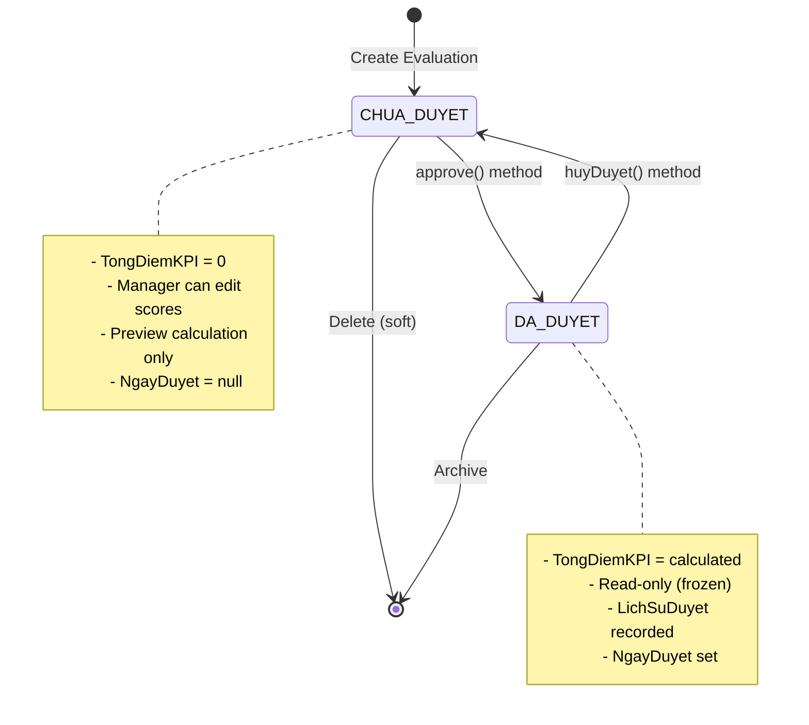
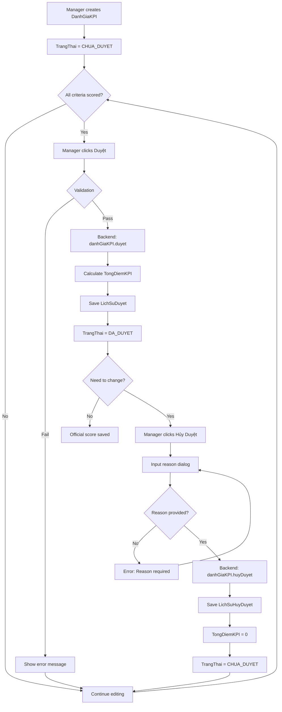

# ✅ APPROVAL WORKFLOW - Quy Trình Phê Duyệt KPI

> **File**: 04_APPROVAL_WORKFLOW.md  
> **Module**: QuanLyCongViec/KPI (Performance Evaluation System)  
> **Mục tiêu**: Hiểu workflow phê duyệt, audit trail, và undo mechanism

---

## 📋 MỤC LỤC

1. [Approval States](#1-approval-states)
2. [State Transitions](#2-state-transitions)
3. [Approve Process (duyet)](#3-approve-process-duyet)
4. [Undo Approval (huyDuyet)](#4-undo-approval-huyduyet)
5. [Audit Trail System](#5-audit-trail-system)
6. [Batch Approval](#6-batch-approval)
7. [Permissions & Validation](#7-permissions--validation)
8. [Frontend Integration](#8-frontend-integration)
9. [Notification System](#9-notification-system)

---

## 1. APPROVAL STATES

### 1.1. Two States Only

**KPI System has 2 simple states** (not 3+):

```javascript
TrangThai: {
  type: String,
  enum: ["CHUA_DUYET", "DA_DUYET"],
  default: "CHUA_DUYET"
}
```

**CHUA_DUYET** (Not Approved):

- ✅ **Editable**: Manager can change scores
- ✅ **No TongDiemKPI**: Score = 0 (not calculated yet)
- ✅ **Preview mode**: Real-time calculation via frontend
- ❌ **Not official**: Not counted in reports

**DA_DUYET** (Approved):

- 🔒 **Read-only**: Cannot edit scores
- ✅ **TongDiemKPI saved**: Official score snapshot
- ✅ **Audit trail**: LichSuDuyet recorded
- ✅ **Official**: Counted in reports, rankings
- ⚠️ **Can undo**: Via `huyDuyet()` with reason

### 1.2. Why Only 2 States?

**Design Decision**: Keep workflow simple

**Alternative (NOT used)**:

```javascript
// ❌ Complex 4-state system (rejected)
enum: ["DRAFT", "SUBMITTED", "APPROVED", "REJECTED"];
```

**Problems with complex states**:

- Confusing for users (when to submit vs approve?)
- Requires additional permissions per state
- More validation logic
- Harder to undo (which state to revert to?)

**Current 2-state benefits**:

- ✅ Clear distinction: Working vs Official
- ✅ Single action: Approve (no submit step)
- ✅ Easy undo: Always back to CHUA_DUYET
- ✅ Simple permissions: Can approve or not

---

## 2. STATE TRANSITIONS

### 2.1. State Machine



### 2.2. Transition Rules

**Rule 1: Can only approve if CHUA_DUYET**

```javascript
if (this.TrangThai === "DA_DUYET") {
  throw new Error("Đánh giá KPI đã được duyệt");
}
```

**Rule 2: Can only undo if DA_DUYET**

```javascript
if (this.TrangThai !== "DA_DUYET") {
  throw new Error("KPI chưa được duyệt, không thể hủy duyệt");
}
```

**Rule 3: Cannot edit scores if DA_DUYET**

```javascript
// Frontend validation
const canEdit = currentDanhGiaKPI?.TrangThai === "CHUA_DUYET";

if (!canEdit) {
  return <Alert severity="warning">Đã duyệt - chỉ xem</Alert>;
}
```

**Rule 4: All criteria must be scored before approval**

```javascript
evaluations.forEach((nv) => {
  const unscored = nv.ChiTietDiem.filter((tc) => tc.DiemDat === null);
  if (unscored.length > 0) {
    throw new Error(`Nhiệm vụ "${nv.TenNhiemVu}" còn tiêu chí chưa chấm`);
  }
});
```

### 2.3. Transition Diagram (Detailed)



---

## 3. APPROVE PROCESS (DUYET)

### 3.1. Method Signature

**Backend** (`DanhGiaKPI.js`):

```javascript
/**
 * ✅ V2: Duyệt KPI - Tự động tính TongDiemKPI
 * @param {String} nhanXet - Nhận xét của người duyệt (optional)
 * @param {ObjectId} nguoiDuyetId - ID người duyệt (required)
 * @returns {Promise<DanhGiaKPI>} Updated evaluation
 */
danhGiaKPISchema.methods.duyet = async function (nhanXet, nguoiDuyetId) {
  // ... implementation
};
```

### 3.2. Approval Steps (Backend)

**Step 1: Validate State**

```javascript
if (this.TrangThai === "DA_DUYET") {
  throw new Error("Đánh giá KPI đã được duyệt");
}
```

**Step 2: Load DiemTuDanhGia**

```javascript
const assignments = await NhanVienNhiemVu.find({
  NhanVienID: this.NhanVienID,
  ChuKyDanhGiaID: this.ChuKyDanhGiaID,
  isDeleted: false,
});

// Build map: NhiemVuThuongQuyID → DiemTuDanhGia
const diemTuDanhGiaMap = {};
assignments.forEach((a) => {
  const nvIdStr = a.NhiemVuThuongQuyID.toString();
  diemTuDanhGiaMap[nvIdStr] = a.DiemTuDanhGia || 0;
});
```

**Step 3: Load Evaluations**

```javascript
const evaluations = await DanhGiaNhiemVuThuongQuy.find({
  DanhGiaKPIID: this._id,
  isDeleted: false,
});

if (evaluations.length === 0) {
  throw new Error("Không có nhiệm vụ nào để đánh giá");
}
```

**Step 4: Calculate TongDiemKPI**

```javascript
let tongDiemKPI = 0;

evaluations.forEach((nv) => {
  const nvIdStr = nv.NhiemVuThuongQuyID.toString();
  const diemTuDanhGia = diemTuDanhGiaMap[nvIdStr] || 0;

  let diemTang = 0;
  let diemGiam = 0;

  nv.ChiTietDiem.forEach((tc) => {
    let diemCuoiCung = tc.IsMucDoHoanThanh
      ? (tc.DiemDat * 2 + diemTuDanhGia) / 3
      : tc.DiemDat;

    const scaled = diemCuoiCung / 100;
    tc.LoaiTieuChi === "TANG_DIEM"
      ? (diemTang += scaled)
      : (diemGiam += scaled);
  });

  tongDiemKPI += nv.MucDoKho * (diemTang - diemGiam);
});
```

**Step 5: Snapshot State**

```javascript
this.TongDiemKPI = tongDiemKPI;
this.TrangThai = "DA_DUYET";
this.NgayDuyet = new Date();

if (nguoiDuyetId) {
  this.NguoiDuyet = nguoiDuyetId;
}

if (nhanXet) {
  this.NhanXetNguoiDanhGia = nhanXet;
}
```

**Step 6: Save Audit Trail**

```javascript
this.LichSuDuyet = this.LichSuDuyet || [];
this.LichSuDuyet.push({
  NguoiDuyet: nguoiDuyetId || this.NguoiDuyet,
  NgayDuyet: this.NgayDuyet,
  TongDiemLucDuyet: this.TongDiemKPI, // ← Snapshot
  GhiChu: nhanXet || undefined,
});

await this.save();
return this;
```

### 3.3. Approval Example

**Scenario**: Manager approves evaluation

```javascript
// Frontend
const handleApprove = async () => {
  try {
    await dispatch(approveKPI(currentDanhGiaKPI._id));
    toast.success("Duyệt KPI thành công!");
  } catch (error) {
    toast.error(error.message);
  }
};

// Redux thunk
export const approveKPI = (danhGiaKPIId) => async (dispatch) => {
  const response = await apiService.put(
    `/workmanagement/kpi/${danhGiaKPIId}/approve`
  );
  dispatch(slice.actions.approveKPISuccess(response.data.data));
};

// Backend controller
controller.approve = catchAsync(async (req, res) => {
  const { id } = req.params;
  const { nhanXet } = req.body;

  const danhGiaKPI = await DanhGiaKPI.findById(id);
  if (!danhGiaKPI) throw new AppError(404, "Không tìm thấy đánh giá KPI");

  await danhGiaKPI.duyet(nhanXet, req.userId);

  return sendResponse(
    res,
    200,
    true,
    { danhGiaKPI },
    null,
    "Duyệt KPI thành công"
  );
});
```

**Result**:

```javascript
{
  _id: "678abc...",
  TongDiemKPI: 36.15,          // ← Calculated & saved
  TrangThai: "DA_DUYET",       // ← Changed
  NgayDuyet: "2026-01-05T10:30:00Z",
  NguoiDuyet: "66b1dba74f79822a4752d90d",
  LichSuDuyet: [
    {
      NguoiDuyet: "66b1dba74f79822a4752d90d",
      NgayDuyet: "2026-01-05T10:30:00Z",
      TongDiemLucDuyet: 36.15,  // ← Snapshot
      GhiChu: "Hoàn thành tốt"
    }
  ]
}
```

---

## 4. UNDO APPROVAL (HUYDUYET)

### 4.1. Method Signature

```javascript
/**
 * ✅ V2: Hủy duyệt KPI với audit trail đầy đủ
 * @param {ObjectId} nguoiHuyId - ID người hủy duyệt (required)
 * @param {String} lyDo - Lý do hủy duyệt (required)
 * @returns {Promise<DanhGiaKPI>} Updated evaluation
 */
danhGiaKPISchema.methods.huyDuyet = async function (nguoiHuyId, lyDo) {
  // ... implementation
};
```

### 4.2. Undo Steps

**Step 1: Validate State**

```javascript
if (this.TrangThai !== "DA_DUYET") {
  throw new Error("KPI chưa được duyệt, không thể hủy duyệt");
}
```

**Step 2: Validate Reason**

```javascript
if (!lyDo || lyDo.trim().length === 0) {
  throw new Error("Vui lòng nhập lý do hủy duyệt");
}
```

**Step 3: Save Undo History (with snapshot)**

```javascript
this.LichSuHuyDuyet = this.LichSuHuyDuyet || [];
this.LichSuHuyDuyet.push({
  NguoiHuyDuyet: nguoiHuyId,
  NgayHuyDuyet: new Date(),
  LyDoHuyDuyet: lyDo.trim(),
  DiemTruocKhiHuy: this.TongDiemKPI || 0, // ← Snapshot old score
  NgayDuyetTruocDo: this.NgayDuyet, // ← Snapshot old approval date
});
```

**Step 4: Reset State**

```javascript
this.TrangThai = "CHUA_DUYET";
this.TongDiemKPI = 0; // ← Reset to 0 (critical!)
this.NgayDuyet = null;
this.NguoiDuyet = null;

await this.save();
return this;
```

### 4.3. Why Reset TongDiemKPI to 0?

**Design Decision**: Force recalculation on next approval

**Reasons**:

1. **Prevent stale data**: Manager may change scores after undo
2. **Clear state**: 0 = "not calculated" (consistent with CHUA_DUYET)
3. **Recalculation trigger**: Next approve will calculate fresh score
4. **Audit trail**: Old score preserved in `LichSuHuyDuyet.DiemTruocKhiHuy`

**Alternative (NOT used)**:

```javascript
// Keep TongDiemKPI unchanged
this.TongDiemKPI = this.TongDiemKPI; // ❌ Problem: Misleading if scores change
```

### 4.4. Undo Example

**Frontend Flow**:

```javascript
const handleUndoApprove = async () => {
  const reason = await showReasonDialog(); // Custom dialog
  if (!reason) return;

  try {
    await dispatch(
      undoApproveKPI({
        danhGiaKPIId: currentDanhGiaKPI._id,
        lyDo: reason,
      })
    );
    toast.success("Hủy duyệt thành công!");
  } catch (error) {
    toast.error(error.message);
  }
};
```

**Backend**:

```javascript
controller.undoApprove = catchAsync(async (req, res) => {
  const { id } = req.params;
  const { lyDo } = req.body;

  if (!lyDo) throw new AppError(400, "Vui lòng nhập lý do hủy duyệt");

  const danhGiaKPI = await DanhGiaKPI.findById(id);
  await danhGiaKPI.huyDuyet(req.userId, lyDo);

  return sendResponse(
    res,
    200,
    true,
    { danhGiaKPI },
    null,
    "Hủy duyệt thành công"
  );
});
```

**Result**:

```javascript
{
  _id: "678abc...",
  TongDiemKPI: 0,              // ← Reset
  TrangThai: "CHUA_DUYET",     // ← Back to draft
  NgayDuyet: null,
  NguoiDuyet: null,
  LichSuHuyDuyet: [
    {
      NguoiHuyDuyet: "66b1dba74f79822a4752d90d",
      NgayHuyDuyet: "2026-01-05T14:20:00Z",
      LyDoHuyDuyet: "Cần điều chỉnh điểm tiêu chí 'Chất lượng'",
      DiemTruocKhiHuy: 36.15,   // ← Old score saved
      NgayDuyetTruocDo: "2026-01-05T10:30:00Z"
    }
  ]
}
```

---

## 5. AUDIT TRAIL SYSTEM

### 5.1. LichSuDuyet (Approval History)

**Structure**:

```javascript
LichSuDuyet: [
  {
    NguoiDuyet: ObjectId, // Who approved
    NgayDuyet: Date, // When approved
    TongDiemLucDuyet: Number, // Score snapshot
    GhiChu: String, // Optional note
    _id: false, // No subdocument ID
  },
];
```

**Purpose**:

- 📊 **Track all approvals** (can approve multiple times if undone)
- 📸 **Snapshot score** at approval time
- 📝 **Record notes/comments** from approver
- 🔍 **Audit trail** for compliance

**Example**:

```javascript
LichSuDuyet: [
  {
    NguoiDuyet: "66b1dba74f79822a4752d90d",
    NgayDuyet: "2026-01-05T10:00:00Z",
    TongDiemLucDuyet: 35.8,
    GhiChu: "Hoàn thành tốt",
  },
  // After undo & re-approve with changes
  {
    NguoiDuyet: "66b1dba74f79822a4752d90d",
    NgayDuyet: "2026-01-05T15:00:00Z",
    TongDiemLucDuyet: 36.15,
    GhiChu: "Đã điều chỉnh điểm chất lượng",
  },
];
```

### 5.2. LichSuHuyDuyet (Undo History)

**Structure**:

```javascript
LichSuHuyDuyet: [
  {
    NguoiHuyDuyet: ObjectId, // Who undid
    NgayHuyDuyet: Date, // When undid
    LyDoHuyDuyet: String, // Reason (required)
    DiemTruocKhiHuy: Number, // Score before undo
    NgayDuyetTruocDo: Date, // Previous approval date
    _id: false,
  },
];
```

**Purpose**:

- 🔙 **Track all undos** with reasons
- 📸 **Snapshot old score** before resetting
- 📝 **Mandatory reason** for accountability
- 🔍 **Compliance** - why was approval reversed?

**Example**:

```javascript
LichSuHuyDuyet: [
  {
    NguoiHuyDuyet: "66b1dba74f79822a4752d90d",
    NgayHuyDuyet: "2026-01-05T14:30:00Z",
    LyDoHuyDuyet: "Phát hiện sai sót trong điểm tiêu chí 'Tỷ lệ đúng hạn'",
    DiemTruocKhiHuy: 35.8,
    NgayDuyetTruocDo: "2026-01-05T10:00:00Z",
  },
];
```

### 5.3. Timeline Reconstruction

**Goal**: Rebuild complete history from audit trails

```javascript
function reconstructTimeline(danhGiaKPI) {
  const events = [];

  // Add approvals
  danhGiaKPI.LichSuDuyet?.forEach((a) => {
    events.push({
      type: "APPROVE",
      date: a.NgayDuyet,
      by: a.NguoiDuyet,
      score: a.TongDiemLucDuyet,
      note: a.GhiChu,
    });
  });

  // Add undos
  danhGiaKPI.LichSuHuyDuyet?.forEach((u) => {
    events.push({
      type: "UNDO",
      date: u.NgayHuyDuyet,
      by: u.NguoiHuyDuyet,
      score: u.DiemTruocKhiHuy,
      reason: u.LyDoHuyDuyet,
    });
  });

  // Sort chronologically
  return events.sort((a, b) => new Date(a.date) - new Date(b.date));
}
```

**Timeline Example**:

```
10:00 - APPROVE by Manager A (Score: 35.8) "Hoàn thành tốt"
14:30 - UNDO by Manager A (Old score: 35.8) Reason: "Sai sót điểm"
15:00 - APPROVE by Manager A (Score: 36.15) "Đã điều chỉnh"
```

### 5.4. Audit Trail Best Practices

**DO**:

- ✅ Always provide reason for undo
- ✅ Snapshot scores before changes
- ✅ Include timestamps in UTC
- ✅ Store approver/undoer ID

**DON'T**:

- ❌ Delete old history
- ❌ Allow undo without reason
- ❌ Modify historical records
- ❌ Allow approval without validation

---

## 6. BATCH APPROVAL

### 6.1. Use Case

**Scenario**: Manager needs to approve 20+ evaluations at once

**Current Flow** (manual):

- Click each evaluation → Approve → Repeat 20x
- ⏱️ Time: ~5 minutes
- 😫 Tedious, error-prone

**Batch Flow** (automated):

- Select all → Click "Duyệt hàng loạt" → Confirm
- ⏱️ Time: ~10 seconds
- ✅ Efficient, consistent

### 6.2. Batch Approve Implementation

**Frontend**:

```javascript
const [selectedIds, setSelectedIds] = useState([]);

const handleBatchApprove = async () => {
  if (selectedIds.length === 0) {
    toast.error("Vui lòng chọn ít nhất 1 đánh giá");
    return;
  }

  try {
    await dispatch(batchApproveKPI(selectedIds));
    toast.success(`Đã duyệt ${selectedIds.length} đánh giá`);
    setSelectedIds([]);
  } catch (error) {
    toast.error(error.message);
  }
};
```

**Backend**:

```javascript
controller.batchApprove = catchAsync(async (req, res) => {
  const { danhGiaKPIIds, nhanXet } = req.body;

  if (!Array.isArray(danhGiaKPIIds) || danhGiaKPIIds.length === 0) {
    throw new AppError(400, "Vui lòng chọn ít nhất 1 đánh giá");
  }

  const results = {
    success: [],
    failed: [],
  };

  for (const id of danhGiaKPIIds) {
    try {
      const danhGiaKPI = await DanhGiaKPI.findById(id);
      if (!danhGiaKPI) {
        results.failed.push({ id, reason: "Không tìm thấy" });
        continue;
      }

      if (danhGiaKPI.TrangThai === "DA_DUYET") {
        results.failed.push({ id, reason: "Đã duyệt rồi" });
        continue;
      }

      await danhGiaKPI.duyet(nhanXet, req.userId);
      results.success.push(id);
    } catch (error) {
      results.failed.push({ id, reason: error.message });
    }
  }

  return sendResponse(
    res,
    200,
    true,
    results,
    null,
    `Duyệt thành công ${results.success.length}/${danhGiaKPIIds.length} đánh giá`
  );
});
```

### 6.3. Batch Validation

**Pre-Flight Checks**:

```javascript
// 1. All selected must be CHUA_DUYET
const invalidStates = selectedEvaluations.filter(
  (e) => e.TrangThai === "DA_DUYET"
);
if (invalidStates.length > 0) {
  throw new Error(`${invalidStates.length} đánh giá đã được duyệt rồi`);
}

// 2. All criteria must be scored
const incompleteScores = selectedEvaluations.filter((e) =>
  e.DanhSachNhiemVu.some((nv) =>
    nv.ChiTietDiem.some((tc) => tc.DiemDat === null)
  )
);
if (incompleteScores.length > 0) {
  throw new Error(`${incompleteScores.length} đánh giá chưa chấm điểm đầy đủ`);
}

// 3. User has permission
if (!hasPermission(user, "approve_kpi")) {
  throw new Error("Bạn không có quyền duyệt KPI");
}
```

### 6.4. Transaction Pattern

**Use MongoDB Transaction** for batch operations:

```javascript
const session = await mongoose.startSession();
session.startTransaction();

try {
  for (const id of danhGiaKPIIds) {
    const danhGiaKPI = await DanhGiaKPI.findById(id).session(session);
    await danhGiaKPI.duyet(nhanXet, req.userId);
  }

  await session.commitTransaction();
} catch (error) {
  await session.abortTransaction();
  throw error;
} finally {
  session.endSession();
}
```

**Why Transaction?**:

- ✅ **All-or-nothing**: Either all succeed or all rollback
- ✅ **Data consistency**: No partial approvals
- ⚠️ **Performance cost**: Slower than individual saves

**When to Use**:

- Use for critical batch operations (< 100 items)
- Skip for large batches (>100) - too slow, accept partial success

---

## 7. PERMISSIONS & VALIDATION

### 7.1. Permission Matrix

| Action            | User | Manager  | Admin | SuperAdmin |
| ----------------- | ---- | -------- | ----- | ---------- |
| **Create KPI**    | ❌   | ✅       | ✅    | ✅         |
| **Edit scores**   | ❌   | ✅ (Own) | ✅    | ✅         |
| **Approve KPI**   | ❌   | ✅ (Own) | ✅    | ✅         |
| **Undo approval** | ❌   | ✅ (Own) | ✅    | ✅         |
| **Batch approve** | ❌   | ✅       | ✅    | ✅         |
| **View history**  | ✅   | ✅       | ✅    | ✅         |
| **Delete KPI**    | ❌   | ❌       | ✅    | ✅         |

**Notes**:

- **(Own)**: Manager can only approve evaluations they created
- Admin can approve any evaluation
- User (employee) can only view their own evaluations

### 7.2. Validation Rules

**Rule 1: Cannot approve own evaluation**

```javascript
if (danhGiaKPI.NhanVienID.toString() === req.userId) {
  throw new AppError(403, "Bạn không thể tự duyệt đánh giá của mình");
}
```

**Rule 2: Must be manager or admin**

```javascript
if (!["manager", "admin", "superadmin"].includes(req.user.PhanQuyen)) {
  throw new AppError(403, "Chỉ quản lý mới có quyền duyệt KPI");
}
```

**Rule 3: Cannot approve if cycle is closed**

```javascript
const chuKy = await ChuKyDanhGia.findById(danhGiaKPI.ChuKyDanhGiaID);
if (chuKy.isDong) {
  throw new AppError(400, "Chu kỳ đánh giá đã đóng");
}
```

**Rule 4: All criteria scored**

```javascript
const evaluations = await DanhGiaNhiemVuThuongQuy.find({
  DanhGiaKPIID: danhGiaKPI._id,
});

evaluations.forEach((nv) => {
  const unscored = nv.ChiTietDiem.filter((tc) => tc.DiemDat === null);
  if (unscored.length > 0) {
    throw new Error(`Nhiệm vụ "${nv.TenNhiemVu}" còn tiêu chí chưa chấm`);
  }
});
```

### 7.3. Validation Errors

| Error Code | Message                              | HTTP Status |
| ---------- | ------------------------------------ | ----------- |
| 400        | "Đánh giá KPI đã được duyệt"         | 400         |
| 400        | "Vui lòng nhập lý do hủy duyệt"      | 400         |
| 400        | "Chu kỳ đánh giá đã đóng"            | 400         |
| 403        | "Bạn không thể tự duyệt của mình"    | 403         |
| 403        | "Chỉ quản lý mới có quyền duyệt KPI" | 403         |
| 404        | "Không tìm thấy đánh giá KPI"        | 404         |
| 500        | "Lỗi khi tính TongDiemKPI"           | 500         |

---

## 8. FRONTEND INTEGRATION

### 8.1. Approval Button Component

```javascript
function ApproveButton({ danhGiaKPI, onSuccess }) {
  const dispatch = useDispatch();
  const [loading, setLoading] = useState(false);

  const canApprove = useMemo(() => {
    return danhGiaKPI?.TrangThai === "CHUA_DUYET" && !danhGiaKPI?.isDeleted;
  }, [danhGiaKPI]);

  const handleApprove = async () => {
    const confirmed = await showConfirmDialog({
      title: "Xác nhận duyệt KPI",
      message: "Bạn có chắc muốn duyệt đánh giá này?",
    });

    if (!confirmed) return;

    setLoading(true);
    try {
      await dispatch(approveKPI(danhGiaKPI._id));
      toast.success("Duyệt KPI thành công!");
      onSuccess?.();
    } catch (error) {
      toast.error(error.message);
    } finally {
      setLoading(false);
    }
  };

  if (!canApprove) return null;

  return (
    <Button
      variant="contained"
      color="success"
      onClick={handleApprove}
      disabled={loading}
      startIcon={<CheckCircleIcon />}
    >
      {loading ? "Đang duyệt..." : "Duyệt KPI"}
    </Button>
  );
}
```

### 8.2. Undo Button with Reason Dialog

```javascript
function UndoApproveButton({ danhGiaKPI, onSuccess }) {
  const [reasonDialogOpen, setReasonDialogOpen] = useState(false);
  const [reason, setReason] = useState("");

  const canUndo = danhGiaKPI?.TrangThai === "DA_DUYET";

  const handleUndo = async () => {
    if (!reason.trim()) {
      toast.error("Vui lòng nhập lý do hủy duyệt");
      return;
    }

    try {
      await dispatch(
        undoApproveKPI({
          danhGiaKPIId: danhGiaKPI._id,
          lyDo: reason,
        })
      );
      toast.success("Hủy duyệt thành công!");
      setReasonDialogOpen(false);
      onSuccess?.();
    } catch (error) {
      toast.error(error.message);
    }
  };

  if (!canUndo) return null;

  return (
    <>
      <Button
        variant="outlined"
        color="warning"
        onClick={() => setReasonDialogOpen(true)}
        startIcon={<UndoIcon />}
      >
        Hủy duyệt
      </Button>

      <Dialog
        open={reasonDialogOpen}
        onClose={() => setReasonDialogOpen(false)}
      >
        <DialogTitle>Lý do hủy duyệt</DialogTitle>
        <DialogContent>
          <TextField
            autoFocus
            multiline
            rows={4}
            fullWidth
            value={reason}
            onChange={(e) => setReason(e.target.value)}
            placeholder="Nhập lý do hủy duyệt (bắt buộc)..."
          />
        </DialogContent>
        <DialogActions>
          <Button onClick={() => setReasonDialogOpen(false)}>Hủy</Button>
          <Button onClick={handleUndo} variant="contained" color="warning">
            Xác nhận
          </Button>
        </DialogActions>
      </Dialog>
    </>
  );
}
```

### 8.3. History Dialog Component

```javascript
function KPIHistoryDialog({ danhGiaKPI }) {
  const timeline = useMemo(() => {
    const events = [];

    danhGiaKPI?.LichSuDuyet?.forEach((a) => {
      events.push({
        type: "APPROVE",
        date: a.NgayDuyet,
        by: a.NguoiDuyet,
        score: a.TongDiemLucDuyet,
        note: a.GhiChu,
      });
    });

    danhGiaKPI?.LichSuHuyDuyet?.forEach((u) => {
      events.push({
        type: "UNDO",
        date: u.NgayHuyDuyet,
        by: u.NguoiHuyDuyet,
        score: u.DiemTruocKhiHuy,
        reason: u.LyDoHuyDuyet,
      });
    });

    return events.sort((a, b) => new Date(a.date) - new Date(b.date));
  }, [danhGiaKPI]);

  return (
    <Dialog open={open} onClose={onClose}>
      <DialogTitle>Lịch sử duyệt/hủy duyệt</DialogTitle>
      <DialogContent>
        {timeline.map((event, idx) => (
          <Box key={idx} sx={{ mb: 2 }}>
            <Chip
              label={event.type === "APPROVE" ? "Duyệt" : "Hủy duyệt"}
              color={event.type === "APPROVE" ? "success" : "warning"}
              size="small"
            />
            <Typography variant="body2">
              {dayjs(event.date).format("DD/MM/YYYY HH:mm")}
            </Typography>
            <Typography variant="body2">Bởi: {event.by?.HoTen}</Typography>
            <Typography variant="body2">
              Điểm: {event.score?.toFixed(2)}
            </Typography>
            {event.note && (
              <Typography variant="caption">{event.note}</Typography>
            )}
            {event.reason && (
              <Typography variant="caption" color="warning.main">
                Lý do: {event.reason}
              </Typography>
            )}
          </Box>
        ))}
      </DialogContent>
    </Dialog>
  );
}
```

---

## 9. NOTIFICATION SYSTEM

### 9.1. Notification Events

**Event 1: KPI Approved**

```javascript
// Recipient: Employee being evaluated
{
  type: "KPI_APPROVED",
  recipientId: danhGiaKPI.NhanVienID,
  title: "Đánh giá KPI đã được duyệt",
  message: `Quản lý đã duyệt đánh giá KPI chu kỳ ${chuKy.TenChuKy}. Tổng điểm: ${TongDiemKPI}`,
  link: `/kpi/view/${danhGiaKPI._id}`,
  metadata: {
    danhGiaKPIId: danhGiaKPI._id,
    tongDiem: danhGiaKPI.TongDiemKPI
  }
}
```

**Event 2: KPI Undo**

```javascript
// Recipient: Employee
{
  type: "KPI_UNDONE",
  recipientId: danhGiaKPI.NhanVienID,
  title: "Đánh giá KPI đã bị hủy duyệt",
  message: `Quản lý đã hủy duyệt đánh giá KPI. Lý do: ${lyDo}`,
  link: `/kpi/view/${danhGiaKPI._id}`,
  metadata: {
    danhGiaKPIId: danhGiaKPI._id,
    lyDo: lyDo
  }
}
```

### 9.2. Email Notification Template

**Approved Email**:

```
Subject: [KPI] Đánh giá KPI tháng {TenChuKy} đã được duyệt

Xin chào {TenNhanVien},

Đánh giá KPI của bạn cho chu kỳ {TenChuKy} đã được duyệt.

Tổng điểm KPI: {TongDiemKPI}
Người duyệt: {TenNguoiDuyet}
Ngày duyệt: {NgayDuyet}

Nhận xét: {NhanXet}

Xem chi tiết tại: {Link}
```

---

## 10. BEST PRACTICES

### 10.1. For Managers

**Approval**:

- ✅ Review all scores before approving
- ✅ Add meaningful notes/comments
- ✅ Approve regularly (weekly vs end-of-cycle rush)
- ✅ Use batch approve for large teams

**Undo**:

- ✅ Always provide clear reason
- ✅ Notify employee about changes
- ✅ Minimize undos (get scores right first time)

### 10.2. For System Admins

**Audit**:

- ✅ Monitor approval patterns
- ✅ Check for excessive undos
- ✅ Review approval times (late approvals?)
- ✅ Export audit trails quarterly

**Data Integrity**:

- ✅ Regular backups of LichSuDuyet/HuyDuyet
- ✅ Archive old evaluations (>2 years)
- ✅ Validate calculated scores match formulas

---

## 11. TROUBLESHOOTING

### 11.1. Common Issues

**Issue 1**: "Đánh giá KPI đã được duyệt"

- **Cause**: Trying to approve already-approved evaluation
- **Fix**: Check TrangThai, undo first if needed

**Issue 2**: "Nhiệm vụ X còn tiêu chí chưa chấm"

- **Cause**: Missing DiemDat for some criteria
- **Fix**: Complete scoring before approval

**Issue 3**: TongDiemKPI = 0 after undo

- **Expected**: This is by design (see 4.3)
- **Fix**: Re-approve to recalculate

**Issue 4**: Preview score ≠ final score

- **Cause**: Formula mismatch between frontend/backend
- **Fix**: Verify calculateTotalScore() matches duyet() logic

---

## 12. RELATED FILES

**Backend**:

- [DanhGiaKPI.js](../../giaobanbv-be/modules/workmanagement/models/DanhGiaKPI.js) - Model with duyet/huyDuyet methods (344 lines)
- [kpi.controller.js](../../giaobanbv-be/modules/workmanagement/controllers/kpi.controller.js) - Approval endpoints

**Frontend**:

- [kpiSlice.js](../../src/features/QuanLyCongViec/KPI/kpiSlice.js) - approveKPI/undoApproveKPI thunks
- [ChamDiemKPIDialog.js](../../src/features/QuanLyCongViec/KPI/v2/components/ChamDiemKPIDialog.js) - Approval buttons
- [KPIHistoryDialog.js](../../src/features/QuanLyCongViec/KPI/v2/components/KPIHistoryDialog.js) - History viewer (223 lines)

---

## 13. NEXT STEPS

**Continue to**:

- [05_TASK_INTEGRATION.md](./05_TASK_INTEGRATION.md) - CongViec/YeuCau dashboard integration
- [07_BATCH_OPERATIONS.md](./07_BATCH_OPERATIONS.md) - Advanced batch approval features

**Related Topics**:

- [03_CALCULATION_FORMULAS.md](./03_CALCULATION_FORMULAS.md) - TongDiemKPI calculation in duyet()
- [01_EVALUATION_CYCLE.md](./01_EVALUATION_CYCLE.md) - Cycle close affects approval

---

**Ngày tạo**: 5/1/2026  
**Phiên bản**: 1.0  
**Tác giả**: Documentation Team  
**Status**: ✅ Complete
