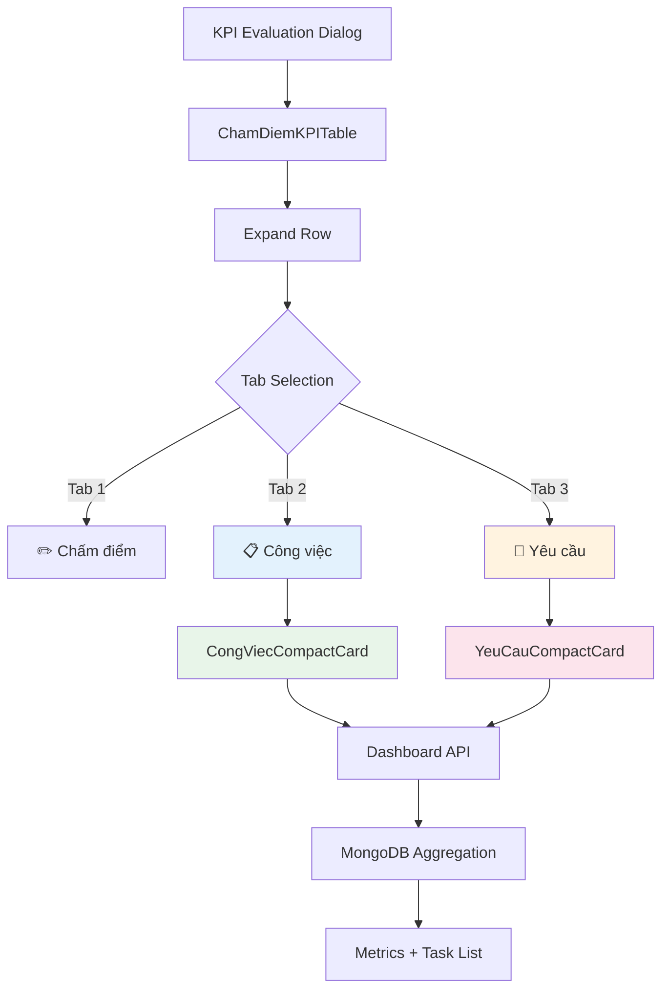
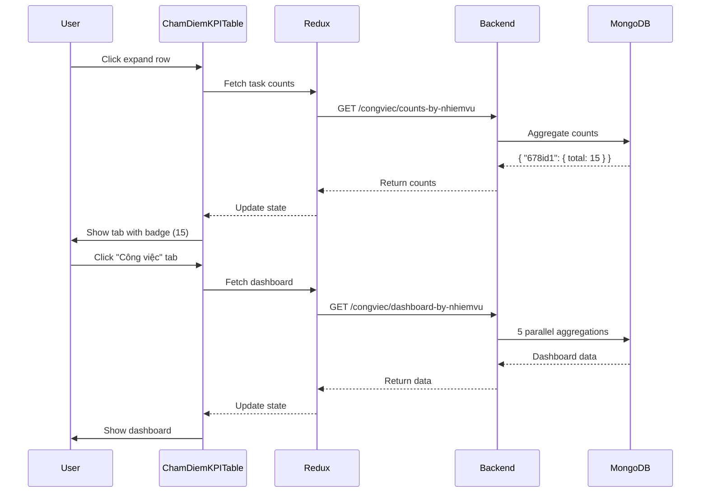

# 📋 TASK INTEGRATION - Tích Hợp Dashboard Công Việc & Yêu Cầu

> **File**: 05_TASK_INTEGRATION.md  
> **Module**: QuanLyCongViec/KPI (Performance Evaluation System)  
> **Mục tiêu**: Hiểu cách KPI tích hợp với CongViec/YeuCau để đánh giá hiệu suất dựa trên dữ liệu thực tế

---

## 📋 MỤC LỤC

1. [Integration Overview](#1-integration-overview)
2. [CongViec Dashboard](#2-congviec-dashboard)
3. [YeuCau Dashboard](#3-yeucau-dashboard)
4. [Cross-Cycle Tasks](#4-cross-cycle-tasks)
5. [Badge Display](#5-badge-display)
6. [Backend API](#6-backend-api)
7. [Frontend Components](#7-frontend-components)
8. [Data Flow](#8-data-flow)

---

## 1. INTEGRATION OVERVIEW

### 1.1. Why Integrate Tasks?

**Problem**: Chấm điểm KPI chỉ dựa vào điểm số (DiemQL, DiemTD) thiếu **context**

**Solution**: Hiển thị dashboard công việc/yêu cầu thực tế trong KPI evaluation

**Benefits**:

- ✅ **Objective Assessment**: Đánh giá dựa trên dữ liệu (completion rate, late tasks...)
- ✅ **Transparency**: Nhân viên thấy rõ công việc được tính vào KPI
- ✅ **Traceability**: Link trực tiếp từ KPI đến task detail
- ✅ **Context-Aware Scoring**: Manager có thêm thông tin để chấm điểm công bằng

### 1.2. Integration Points



### 1.3. Data Relationship

**NhiemVuThuongQuy** (Routine Duty) connects to:

- **CongViec** (Tasks): Via `NhiemVuThuongQuyID` field
  - Filter: `{ NhiemVuThuongQuyID: "678...", NguoiChinhID: "66b1...", ChuKyDanhGiaID: "678..." }`
- **YeuCau** (Requests): Via `NhiemVuThuongQuyID` field
  - Filter: `{ NhiemVuThuongQuyID: "678...", NguoiXuLyID: "66b1...", ChuKyDanhGiaID: "678..." }`

**Key**: Tasks tagged with `NhiemVuThuongQuyID` during **KPI cycle period** count toward evaluation

---

## 2. CONGVIEC DASHBOARD

### 2.1. Dashboard Structure

**3 Categories** of tasks:

1. **Thuộc nhiệm vụ** - Tasks linked to current routine duty
2. **Công việc khác** - Tasks NOT linked to any routine duty (`FlagNVTQKhac: true`)
3. **Công việc phối hợp** - Tasks where employee is participant (`VaiTro: PHOI_HOP`)

### 2.2. Metrics Breakdown

**8 Metrics Cards**:

| Metric               | Label          | Calculation                | Color Logic          |
| -------------------- | -------------- | -------------------------- | -------------------- |
| **Total**            | Tổng số CV     | Count(CongViec)            | Info (blue)          |
| **Completion Rate**  | Hoàn thành     | HOAN_THANH / Total × 100%  | Dynamic (>80%=green) |
| **Late Completion**  | Hoàn thành trễ | HoanThanhTreHan=true count | Dynamic (<10%=green) |
| **Active**           | Đang thực hiện | DANG_THUC_HIEN count       | Warning if overdue   |
| **On-Time Rate**     | Tỷ lệ đúng hạn | On-time / Total × 100%     | Dynamic (>75%=green) |
| **Average Progress** | Tiến độ TB     | AVG(PhanTramTienDoTong)    | Dynamic (>75%=green) |
| **Team Size Avg**    | Số người TB    | AVG(NguoiThamGia.length)   | Info                 |
| **Comments Avg**     | Bình luận TB   | AVG(BinhLuan.count)        | Info                 |

### 2.3. Query Structure

**Backend Endpoint**: `GET /workmanagement/congviec/dashboard-by-nhiemvu`

**Query Parameters**:

```javascript
{
  nhiemVuThuongQuyID: "678nhiemvu1",  // Routine duty ID
  nhanVienID: "66b1dba7...",          // Employee ID
  chuKyDanhGiaID: "678chuky123"       // Evaluation cycle ID
}
```

**MongoDB Filter**:

```javascript
{
  NhiemVuThuongQuyID: ObjectId("678nhiemvu1"),
  NguoiChinhID: ObjectId("66b1dba7..."),
  isDeleted: { $ne: true },
  $or: [
    // Tasks created during cycle
    {
      createdAt: {
        $gte: cycle.NgayBatDau,
        $lte: cycle.NgayKetThuc
      }
    },
    // OR tasks completed during cycle
    {
      NgayHoanThanh: {
        $gte: cycle.NgayBatDau,
        $lte: cycle.NgayKetThuc
      }
    }
  ]
}
```

### 2.4. Response Example

```json
{
  "success": true,
  "data": {
    "summary": {
      "total": 15,
      "completed": 12,
      "completionRate": 80,
      "late": 3,
      "lateRate": 20,
      "active": 2,
      "overdue": 1,
      "avgProgress": 85,
      "onTimeRate": 75
    },
    "timeMetrics": {
      "avgLateHours": 24.5,
      "maxLateHours": 72,
      "avgCompletionDays": 5.2,
      "onTimeCount": 9,
      "lateCount": 3
    },
    "statusDistribution": [
      { "status": "HOAN_THANH", "count": 12, "percentage": 80 },
      { "status": "DANG_THUC_HIEN", "count": 2, "percentage": 13.3 }
    ],
    "priorityDistribution": [
      {
        "priority": "CAO",
        "total": 5,
        "completed": 4,
        "late": 1,
        "active": 1
      }
    ],
    "collaboration": {
      "avgTeamSize": 2.3,
      "avgComments": 5.8,
      "multiPersonTasks": 8,
      "multiPersonRate": 53.3
    },
    "tasks": [
      {
        "_id": "...",
        "MaCongViec": "CV001",
        "TieuDe": "Chuẩn bị báo cáo tháng",
        "TrangThai": "HOAN_THANH",
        "PhanTramTienDoTong": 100,
        "NgayHetHan": "2024-01-15",
        "SoGioTre": 0,
        "HoanThanhTreHan": false
      }
    ]
  }
}
```

### 2.5. Frontend Component: CongViecCompactCard

**File**: `src/features/QuanLyCongViec/KPI/v2/components/CongViecCompactCard.js`

**Props**:

```javascript
{
  title: "Thuộc nhiệm vụ",            // Card title
  icon: "📌",                          // Emoji icon
  color: "primary.main",               // Theme color
  total: 15,                           // Total count
  completed: 12,                       // Completed count
  late: 3,                             // Late count
  active: 2,                           // Active count
  tasks: [...],                        // Task array
  onViewTask: (taskId) => {},          // View task callback
  onOpenNewTab: (taskId) => {},        // Open in new tab
  isLoading: false,                    // Loading state
  error: null,                         // Error message
  showNguoiChinh: false                // Show main person column
}
```

**Features**:

- 🎨 **Collapsible card** - Click header to expand/collapse
- 🔍 **Filter by status** - All/Late/Active/Completed
- 📄 **Pagination** - 5/10/25 rows per page
- 👁️ **View button** - Opens task detail dialog
- 🆕 **New tab button** - Opens task in new browser tab
- 📊 **Summary badges** - Quick metrics in header
- 📅 **Date tooltips** - Hover to see full datetime

**UI Example**:

```
┌─────────────────────────────────────────┐
│ 📌 Thuộc nhiệm vụ                       │
│ ─────────────────────────────────────── │
│ Total: 15 │ Done: 12 │ Late: 3 │ Active: 2│  ← Summary
│ ▼ Expand                                │
├─────────────────────────────────────────┤
│ Filter: [All] Late Active Completed     │  ← Filters
│ ─────────────────────────────────────── │
│ Mã CV  │ Tiêu đề  │ Trạng thái │ Hạn    │  ← Table Header
│ ─────────────────────────────────────── │
│ CV001  │ Báo cáo  │ ✅ Hoàn    │ 15/01  │ 👁️ 🆕
│ CV002  │ Kiểm tra │ 🟡 Đang    │ 20/01  │ 👁️ 🆕
│ ─────────────────────────────────────── │
│ Rows per page: [5] 10 25  Page: 1/3    │  ← Pagination
└─────────────────────────────────────────┘
```

---

## 3. YEUCAU DASHBOARD

### 3.1. Dashboard Structure

**Similar to CongViec**, but for **Requests** (YeuCau):

1. **Thuộc nhiệm vụ** - Requests linked to current routine duty
2. **Yêu cầu khác** - Requests NOT linked to any routine duty
3. **Yêu cầu nhận xử lý** - Requests assigned to employee

### 3.2. Metrics Breakdown

**6 Metrics Cards**:

| Metric              | Label         | Calculation              | Color Logic          |
| ------------------- | ------------- | ------------------------ | -------------------- |
| **Total**           | Tổng số YC    | Count(YeuCau)            | Info (blue)          |
| **Completed**       | Hoàn thành    | HOAN_THANH count         | Success (green)      |
| **Processing**      | Đang xử lý    | DANG_XU_LY count         | Warning (orange)     |
| **Pending**         | Chờ tiếp nhận | DA_TIEP_NHAN count       | Default (gray)       |
| **Completion Rate** | Tỷ lệ hoàn    | Completed / Total × 100% | Dynamic (>80%=green) |
| **Average Rating**  | Đánh giá TB   | AVG(DanhGia.SoSao)       | Warning (star icon)  |

### 3.3. Query Structure

**Backend Endpoint**: `GET /workmanagement/yeucau/dashboard-by-nhiemvu`

**Query Parameters**:

```javascript
{
  nhiemVuThuongQuyID: "678nhiemvu1",
  nhanVienID: "66b1dba7...",
  chuKyDanhGiaID: "678chuky123"
}
```

**MongoDB Filter**:

```javascript
{
  NhiemVuThuongQuyID: ObjectId("678nhiemvu1"),
  NguoiXuLyID: ObjectId("66b1dba7..."),
  TrangThai: { $ne: "XOA" },
  $or: [
    // Created during cycle
    { createdAt: { $gte: cycle.NgayBatDau, $lte: cycle.NgayKetThuc } },
    // OR completed during cycle
    { NgayHoanThanh: { $gte: cycle.NgayBatDau, $lte: cycle.NgayKetThuc } }
  ]
}
```

### 3.4. Response Example

```json
{
  "success": true,
  "data": {
    "summary": {
      "total": 25,
      "completed": 20,
      "processing": 3,
      "pending": 2,
      "completionRate": 80,
      "avgRating": 4.5
    },
    "statusDistribution": [
      { "status": "HOAN_THANH", "count": 20, "percentage": 80 },
      { "status": "DANG_XU_LY", "count": 3, "percentage": 12 },
      { "status": "DA_TIEP_NHAN", "count": 2, "percentage": 8 }
    ],
    "yeuCau": [
      {
        "_id": "...",
        "MaYeuCau": "YC001",
        "TieuDe": "Sửa máy in",
        "TrangThai": "HOAN_THANH",
        "DanhGia": { "SoSao": 5 },
        "NgayTao": "2024-01-10",
        "NgayHoanThanh": "2024-01-12"
      }
    ]
  }
}
```

### 3.5. Frontend Component: YeuCauCompactCard

**File**: `src/features/QuanLyCongViec/KPI/v2/components/YeuCauCompactCard.js`

**Props**:

```javascript
{
  title: "Thuộc nhiệm vụ",              // Card title
  icon: "🎫",                            // Emoji icon
  color: "info.main",                    // Theme color
  total: 25,                             // Total count
  completed: 20,                         // Completed count
  avgRating: 4.5,                        // Average star rating
  yeuCau: [...],                         // YeuCau array
  onViewYeuCau: (yeuCauId) => {},        // View callback
  isLoading: false,                      // Loading state
  error: null                            // Error message
}
```

**Features**:

- 🎨 **Collapsible card** - Click header to expand/collapse
- ⭐ **Rating display** - Star icons with average rating
- 📊 **Status chips** - Color-coded status badges
- 👁️ **View button** - Opens request detail dialog
- 🆕 **New tab button** - Opens request in new browser tab
- 📅 **Date formatting** - Vietnamese date format

---

## 4. CROSS-CYCLE TASKS

### 4.1. What Are Cross-Cycle Tasks?

**Definition**: Tasks **started in previous cycle** but **completed in current cycle**

**Example**:

```
Cycle Q4/2025: 01/10/2025 - 31/12/2025
Cycle Q1/2026: 01/01/2026 - 31/03/2026

Task CV123:
- Created: 15/12/2025 (Q4/2025) ← Started in previous cycle
- Completed: 10/01/2026 (Q1/2026) ← Finished in current cycle
```

**Should this task count in Q1/2026 KPI?**

- ❓ **Problem**: Task not created during Q1/2026 cycle
- ✅ **Solution**: Count if `NgayHoanThanh` falls in Q1/2026
- 🎯 **Business Rule**: Completion matters more than creation date

### 4.2. Query Logic

**MongoDB Query** (part of dashboard-by-nhiemvu):

```javascript
{
  NhiemVuThuongQuyID: ObjectId("..."),
  NguoiChinhID: ObjectId("..."),
  $or: [
    // Option 1: Created during cycle (normal tasks)
    {
      createdAt: {
        $gte: cycle.NgayBatDau,
        $lte: cycle.NgayKetThuc
      }
    },
    // Option 2: Completed during cycle (cross-cycle tasks)
    {
      NgayHoanThanh: {
        $gte: cycle.NgayBatDau,
        $lte: cycle.NgayKetThuc
      }
    }
  ]
}
```

**Why `$or` Logic?**:

- ✅ Captures normal tasks (created in cycle)
- ✅ Captures cross-cycle tasks (completed in cycle)
- ❌ Excludes tasks created but not completed (incomplete work)

### 4.3. Frontend Component: CrossCycleTasksCompactCard

**File**: `src/features/QuanLyCongViec/KPI/v2/components/CrossCycleTasksCompactCard.js`

**Purpose**: Display tasks that span multiple cycles

**Props**:

```javascript
{
  title: "Công việc kéo dài",             // Card title
  icon: "🔄",                              // Emoji icon
  color: "warning.main",                   // Theme color (yellow)
  total: 5,                                // Total cross-cycle count
  tasks: [...],                            // Task array
  cycleInfo: {                             // Current cycle info
    TenChuKy: "Q1/2026",
    NgayBatDau: "2026-01-01",
    NgayKetThuc: "2026-03-31"
  },
  onViewTask: (taskId) => {},              // View callback
  isLoading: false
}
```

**Visual Indicator**:

```
┌─────────────────────────────────────────┐
│ 🔄 Công việc kéo dài (5)                │  ← Warning color
│ ─────────────────────────────────────── │
│ ⚠️ Công việc bắt đầu từ chu kỳ trước   │  ← Alert message
│ ─────────────────────────────────────── │
│ Mã CV  │ Bắt đầu   │ Hoàn thành │ Trạng │
│ ─────────────────────────────────────── │
│ CV099  │ 15/12/25  │ 10/01/26   │ ✅    │  ← Started Q4, done Q1
│ CV103  │ 20/12/25  │ 15/01/26   │ ✅    │
└─────────────────────────────────────────┘
```

**Key Information Displayed**:

- 📅 **NgayBatDau**: When task was created (previous cycle)
- 📅 **NgayHoanThanh**: When task was completed (current cycle)
- ⏱️ **Duration**: Total days from start to finish
- 🎯 **Completion Status**: Always HOAN_THANH (only completed tasks cross cycles)

---

## 5. BADGE DISPLAY

### 5.1. Tab Badge Pattern

**Purpose**: Show task count in tab label **without opening tab**

**Example**:

```
┌──────────────────────────────────────┐
│ KPI Evaluation Dialog                │
│ ──────────────────────────────────── │
│ Tab 1: ✏️ Chấm điểm                  │  ← No badge (always accessible)
│ Tab 2: 📋 Công việc (15)             │  ← Badge shows total count
│ Tab 3: 🎫 Yêu cầu (23)               │  ← Badge shows total count
└──────────────────────────────────────┘
```

### 5.2. Badge API Endpoint

**Endpoint**: `GET /workmanagement/congviec/counts-by-nhiemvu`

**Query Parameters**:

```javascript
{
  nhiemVuThuongQuyIDs: "678id1,678id2,678id3",  // Comma-separated IDs
  nhanVienID: "66b1dba7...",
  chuKyDanhGiaID: "678chuky123"
}
```

**Response**:

```json
{
  "success": true,
  "data": {
    "678id1": { "total": 15, "completed": 12 },
    "678id2": { "total": 8, "completed": 7 },
    "678id3": { "total": 0, "completed": 0 }
  }
}
```

### 5.3. Frontend Implementation

**Redux Slice**: `kpiSlice.js`

```javascript
// Thunk
export const fetchTaskCounts = (params) => async (dispatch) => {
  const response = await apiService.get("/workmanagement/congviec/counts-by-nhiemvu", { params });
  dispatch(slice.actions.setTaskCounts(response.data.data));
};

// Reducer
setTaskCounts(state, action) {
  state.taskCountsByNhiemVu = action.payload;
}
```

**Component Usage**:

```javascript
const ChamDiemKPITable = ({ nhiemVuList, nhanVienID, chuKyDanhGiaID }) => {
  // Fetch task counts on mount
  useEffect(() => {
    const nhiemVuIDs = nhiemVuList
      .map((nv) => nv.NhiemVuThuongQuyID._id)
      .join(",");
    dispatch(
      fetchTaskCounts({
        nhiemVuThuongQuyIDs: nhiemVuIDs,
        nhanVienID,
        chuKyDanhGiaID,
      })
    );
  }, [nhiemVuList, nhanVienID, chuKyDanhGiaID]);

  // Map counts to each row
  const taskCountMap = useSelector((state) => state.kpi.taskCountsByNhiemVu);

  return nhiemVuList.map((nv) => {
    const count = taskCountMap[nv.NhiemVuThuongQuyID._id]?.total || 0;
    return <Tab label={`📋 Công việc (${count})`} />;
  });
};
```

### 5.4. Badge Update Behavior

**When to update**:

- ✅ **On page load** - Fetch counts immediately
- ✅ **After task creation** - Invalidate cache, refetch
- ✅ **After task deletion** - Invalidate cache, refetch
- ❌ **Real-time updates** - Not implemented (requires WebSocket)

**Caching Strategy**:

```javascript
// Cache in Redux store for session
taskCountsByNhiemVu: {
  "678id1": { total: 15, completed: 12, fetchedAt: "2026-01-05T10:00:00Z" },
  "678id2": { total: 8, completed: 7, fetchedAt: "2026-01-05T10:00:00Z" }
}

// Invalidate after 5 minutes
const isCacheStale = (fetchedAt) => {
  return Date.now() - new Date(fetchedAt).getTime() > 5 * 60 * 1000;
};
```

---

## 6. BACKEND API

### 6.1. API Endpoints Summary

| Endpoint                         | Method | Purpose                                          |
| -------------------------------- | ------ | ------------------------------------------------ |
| `/congviec/dashboard-by-nhiemvu` | GET    | Full dashboard data for routine duty             |
| `/congviec/summary-other-tasks`  | GET    | Summary of "other" tasks (FlagNVTQKhac=true)     |
| `/congviec/summary-collab-tasks` | GET    | Summary of collaboration tasks (VaiTro=PHOI_HOP) |
| `/yeucau/dashboard-by-nhiemvu`   | GET    | Full dashboard data for requests                 |
| `/yeucau/counts-by-nhiemvu`      | GET    | Batch counts for multiple routine duties         |
| `/congviec/counts-by-nhiemvu`    | GET    | Batch counts for multiple routine duties         |

### 6.2. Aggregation Pipeline Strategy

**Backend uses 5 parallel aggregations** to optimize performance:

```javascript
const [
  statusDistribution,
  timeMetrics,
  collaborationMetrics,
  priorityBreakdown,
  taskList,
] = await Promise.all([
  // 1. Status distribution
  CongViec.aggregate([
    { $match: baseMatch },
    { $group: { _id: "$TrangThai", count: { $sum: 1 } } },
  ]),

  // 2. Time metrics
  CongViec.aggregate([
    { $match: { ...baseMatch, TrangThai: "HOAN_THANH" } },
    {
      $group: {
        _id: null,
        avgLateHours: { $avg: "$SoGioTre" },
        maxLateHours: { $max: "$SoGioTre" },
      },
    },
  ]),

  // 3. Collaboration metrics
  CongViec.aggregate([
    { $match: baseMatch },
    {
      $group: {
        _id: null,
        avgTeamSize: { $avg: { $size: "$NguoiThamGia" } },
      },
    },
  ]),

  // 4. Priority breakdown
  CongViec.aggregate([
    { $match: baseMatch },
    {
      $group: {
        _id: "$MucDoUuTien",
        total: { $sum: 1 },
        completed: {
          $sum: { $cond: [{ $eq: ["$TrangThai", "HOAN_THANH"] }, 1, 0] },
        },
      },
    },
  ]),

  // 5. Task list (full documents)
  CongViec.find(baseMatch)
    .populate("NguoiChinh", "Ten")
    .sort({ SoGioTre: -1 }) // Prioritize late tasks
    .limit(100)
    .lean(),
]);
```

**Why Parallel?**:

- ⚡ **Performance**: 5 aggregations run simultaneously (~200ms total vs ~1000ms sequential)
- 🎯 **Specialized**: Each aggregation optimized for specific metrics
- 📦 **Cacheable**: Results can be cached separately (future improvement)

### 6.3. Response Caching (Future)

**Current**: No caching - queries run on every request

**Planned** (Phase 2):

```javascript
// Redis cache key pattern
const cacheKey = `kpi:dashboard:${nhiemVuThuongQuyID}:${nhanVienID}:${chuKyDanhGiaID}`;

// Cache for 5 minutes
await redis.setex(cacheKey, 300, JSON.stringify(dashboardData));

// Invalidate on task create/update/delete
await redis.del(`kpi:dashboard:${nhiemVuThuongQuyID}:*`);
```

---

## 7. FRONTEND COMPONENTS

### 7.1. Component Tree

```
ChamDiemKPIDialog (Main)
└── ChamDiemKPITable
    └── TableRow (Expandable)
        └── TabPanel
            ├── Tab 1: Chấm điểm (Criteria Grid)
            ├── Tab 2: Công việc
            │   ├── CongViecDashboard (Container)
            │   │   ├── OverviewCards (8 metrics)
            │   │   ├── StatusChart (Recharts)
            │   │   ├── TaskListMini (Table)
            │   │   └── InsightsPanel (Accordion)
            │   ├── CongViecCompactCard ("Khác")
            │   └── CongViecCompactCard ("Phối hợp")
            └── Tab 3: Yêu cầu
                ├── YeuCauDashboard (Container)
                ├── YeuCauCompactCard ("Khác")
                └── YeuCauCompactCard ("Phối hợp")
```

### 7.2. Lazy Loading Pattern

**Goal**: Only fetch dashboard data when tab is opened

**Implementation**:

```javascript
const CongViecDashboard = ({
  nhiemVuThuongQuyID,
  nhanVienID,
  chuKyDanhGiaID,
  open,
}) => {
  const dispatch = useDispatch();

  useEffect(() => {
    if (open) {
      // Only fetch when tab is visible
      dispatch(
        fetchCongViecDashboard({
          nhiemVuThuongQuyID,
          nhanVienID,
          chuKyDanhGiaID,
        })
      );
    }
  }, [open, nhiemVuThuongQuyID, nhanVienID, chuKyDanhGiaID]);

  // ...render dashboard
};
```

**Benefits**:

- ⚡ **Faster initial load**: Don't fetch data for hidden tabs
- 💾 **Reduced server load**: Only query when needed
- 🎯 **Better UX**: Tab opens instantly with skeleton loaders

### 7.3. Skeleton Loaders

**Pattern**: Show placeholder UI while data loads

```javascript
{
  isLoading ? (
    <>
      <Skeleton variant="rectangular" height={100} />
      <Skeleton variant="text" />
      <Skeleton variant="text" />
    </>
  ) : (
    <OverviewCards summary={summary} />
  );
}
```

---

## 8. DATA FLOW

### 8.1. Complete Flow Diagram



### 8.2. Redux State Structure

```javascript
{
  kpi: {
    currentDanhGiaKPI: { ... },
    taskCountsByNhiemVu: {
      "678id1": { total: 15, completed: 12 },
      "678id2": { total: 8, completed: 7 }
    },
    dashboardData: {
      "678id1_678chuky1": {
        isLoading: false,
        error: null,
        data: {
          summary: { ... },
          timeMetrics: { ... },
          tasks: [ ... ]
        },
        fetchedAt: "2026-01-05T10:00:00Z"
      }
    }
  }
}
```

**Key Pattern**: Use composite key `${nhiemVuID}_${chuKyID}` for caching

### 8.3. Error Handling

**Backend Errors**:

```javascript
try {
  const dashboard = await service.getDashboardByNhiemVu(params);
  return sendResponse(res, 200, true, dashboard);
} catch (error) {
  // Log to server console
  console.error("[Dashboard Error]", error);

  // Return friendly error to client
  return sendResponse(
    res,
    500,
    false,
    null,
    { message: "Lỗi khi tải dashboard" },
    "Vui lòng thử lại sau"
  );
}
```

**Frontend Error Display**:

```javascript
{
  error ? (
    <Alert severity="error" sx={{ mb: 2 }}>
      {error}
      <Button size="small" onClick={handleRetry}>
        Thử lại
      </Button>
    </Alert>
  ) : (
    <Dashboard data={data} />
  );
}
```

---

## 9. BUSINESS RULES

### 9.1. Task Eligibility

**Which tasks count toward KPI?**

| Condition                | Include? | Reason                                     |
| ------------------------ | -------- | ------------------------------------------ |
| NhiemVuThuongQuyID set   | ✅       | Tagged to routine duty                     |
| Created during cycle     | ✅       | Work done in cycle                         |
| Completed during cycle   | ✅       | Cross-cycle completion counts              |
| Started but not finished | ✅       | Shows incomplete work (penalty in scoring) |
| isDeleted = true         | ❌       | Excluded from metrics                      |
| TrangThai = TAO_MOI      | ✅       | Counts as incomplete (not yet assigned)    |

### 9.2. Metric Interpretation

**Completion Rate** (`completionRate`):

- 📊 **Formula**: `HOAN_THANH / Total × 100%`
- 🎯 **Good**: ≥ 80%
- ⚠️ **Warning**: 60-80%
- 🔴 **Poor**: < 60%
- 💡 **Insight**: High completion rate = good planning + execution

**Late Rate** (`lateRate`):

- 📊 **Formula**: `HoanThanhTreHan / Total × 100%`
- 🎯 **Good**: < 10%
- ⚠️ **Warning**: 10-20%
- 🔴 **Poor**: > 20%
- 💡 **Insight**: Low late rate = good time management

**On-Time Rate** (`onTimeRate`):

- 📊 **Formula**: `(Completed - Late) / Total × 100%`
- 🎯 **Good**: ≥ 75%
- ⚠️ **Warning**: 50-75%
- 🔴 **Poor**: < 50%
- 💡 **Insight**: High on-time rate = quality + speed

### 9.3. Scoring Guidelines (Manager Reference)

**How to use dashboard metrics when scoring**:

**Scenario 1**: High completion (90%) + Low late rate (5%)

- ✅ **Recommendation**: Score 90-100 points
- 💡 **Reason**: Excellent performance on both speed and quality

**Scenario 2**: High completion (85%) + High late rate (25%)

- ⚠️ **Recommendation**: Score 70-80 points
- 💡 **Reason**: Good completion but poor time management

**Scenario 3**: Low completion (60%) + Mixed late rate (15%)

- 🔴 **Recommendation**: Score 50-60 points
- 💡 **Reason**: Many incomplete tasks, needs improvement

**Scenario 4**: Cross-cycle tasks present

- 📊 **Check**: Were they started reasonably close to deadline?
- ✅ **If yes**: Don't penalize (complex work takes time)
- ❌ **If no**: Consider as poor planning (started too late)

---

## 10. TROUBLESHOOTING

### 10.1. Common Issues

**Issue 1**: Badge shows "?" or wrong count

- **Cause**: API call failed or returned invalid data
- **Fix**: Check browser console for errors, verify backend is running

**Issue 2**: Dashboard shows empty even with tasks

- **Cause**: Task NhiemVuThuongQuyID doesn't match filter
- **Fix**: Verify tasks have correct NhiemVuThuongQuyID set

**Issue 3**: Cross-cycle tasks not appearing

- **Cause**: NgayHoanThanh not in current cycle range
- **Fix**: Check task NgayHoanThanh vs cycle NgayBatDau/NgayKetThuc

**Issue 4**: Metrics don't add up

- **Cause**: Aggregation pipeline logic error
- **Fix**: Check backend logs, verify MongoDB aggregation queries

### 10.2. Debugging Tips

**Frontend**:

```javascript
// Enable Redux DevTools to inspect state
console.log(
  "Dashboard data:",
  useSelector((state) => state.kpi.dashboardData)
);

// Check API responses in Network tab
// Look for 200 status and valid JSON response
```

**Backend**:

```javascript
// Add debug logging in service
console.log("[getDashboardByNhiemVu] Params:", params);
console.log("[getDashboardByNhiemVu] Query:", JSON.stringify(query));
console.log("[getDashboardByNhiemVu] Results:", results.length);
```

---

## 11. BEST PRACTICES

### 11.1. For Developers

**API Design**:

- ✅ Use composite keys for caching: `${nhiemVuID}_${chuKyID}`
- ✅ Return consistent response structure across all endpoints
- ✅ Include `fetchedAt` timestamp in cached data
- ✅ Implement proper error codes (400, 404, 500)

**Component Design**:

- ✅ Use lazy loading for dashboard tabs
- ✅ Show skeleton loaders during data fetch
- ✅ Implement retry mechanism for failed requests
- ✅ Cache API responses in Redux store

**Testing**:

- ✅ Test with empty data (no tasks)
- ✅ Test with large datasets (100+ tasks)
- ✅ Test cross-cycle scenarios
- ✅ Test error states (API down, timeout)

### 11.2. For Managers

**Using Dashboard**:

- 📊 **Check completion rate first** - Overall performance indicator
- 📅 **Review late tasks** - Identify time management issues
- 💬 **Check collaboration metrics** - Team engagement level
- 🎯 **Compare with previous cycles** - Track improvement trends

**Scoring Guidelines**:

- ✅ **Be consistent** - Use same criteria for all employees
- ✅ **Consider context** - Complex tasks may have lower completion rates
- ✅ **Review task details** - Click "View" to see full context
- ✅ **Document reasoning** - Add notes explaining score adjustments

---

## 12. RELATED FILES

**Backend**:

- [congViec.service.js](../../giaobanbv-be/modules/workmanagement/services/congViec.service.js) - Dashboard aggregation logic
- [yeuCau.service.js](../../giaobanbv-be/modules/workmanagement/services/yeuCau.service.js) - Request dashboard logic
- [congViec.api.js](../../giaobanbv-be/modules/workmanagement/routes/congViec.api.js) - API routes

**Frontend**:

- [kpiSlice.js](../../src/features/QuanLyCongViec/KPI/kpiSlice.js) - Redux state management
- [CongViecCompactCard.js](../../src/features/QuanLyCongViec/KPI/v2/components/CongViecCompactCard.js) - Task card component (780 lines)
- [YeuCauCompactCard.js](../../src/features/QuanLyCongViec/KPI/v2/components/YeuCauCompactCard.js) - Request card component (444 lines)
- [CongViecDashboard.js](../../src/features/QuanLyCongViec/KPI/v2/components/dashboard/CongViecDashboard.js) - Dashboard container

**Documentation**:

- [IMPLEMENTATION_DASHBOARD_KPI_CONGVIEC.md](../../IMPLEMENTATION_DASHBOARD_KPI_CONGVIEC.md) - Implementation guide
- [DASHBOARD_METRICS_EXPLANATION.md](../../DASHBOARD_METRICS_EXPLANATION.md) - Metrics calculation details

---

## 13. NEXT STEPS

**Continue to**:

- [06_SELF_ASSESSMENT.md](./06_SELF_ASSESSMENT.md) - DiemTuDanhGia flow and manager override
- [07_BATCH_OPERATIONS.md](./07_BATCH_OPERATIONS.md) - Bulk approve and batch scoring

**Related Topics**:

- [02_CRITERIA_SYSTEM.md](./02_CRITERIA_SYSTEM.md) - TieuChiDanhGia scoring that uses task data
- [03_CALCULATION_FORMULAS.md](./03_CALCULATION_FORMULAS.md) - How DiemNhiemVu uses task completion

---

**Ngày tạo**: 5/1/2026  
**Phiên bản**: 1.0  
**Tác giả**: Documentation Team  
**Status**: ✅ Complete
