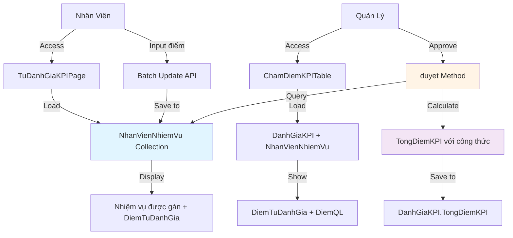
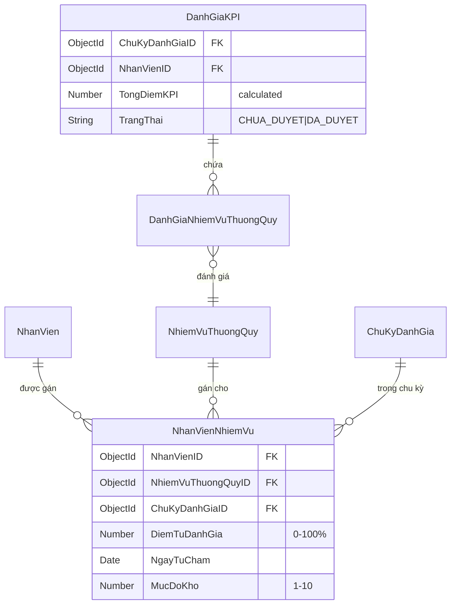
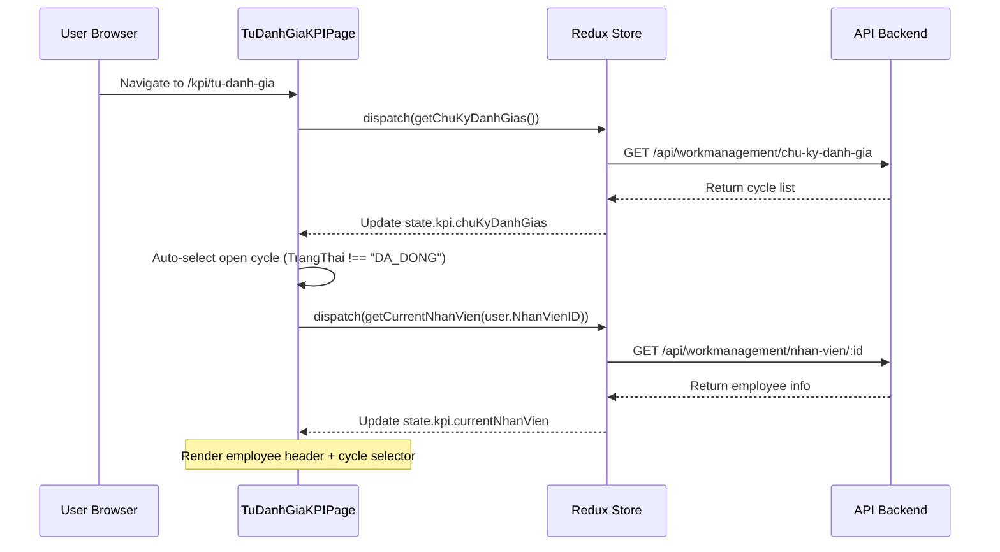
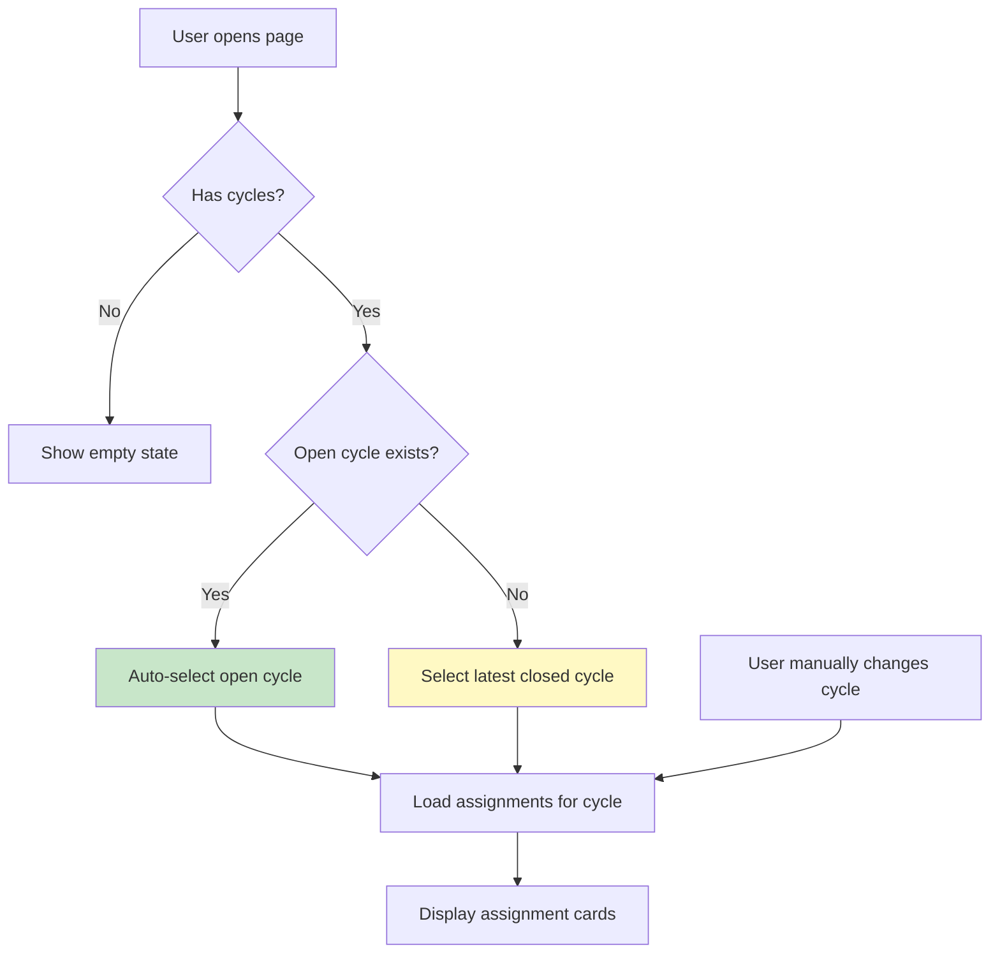
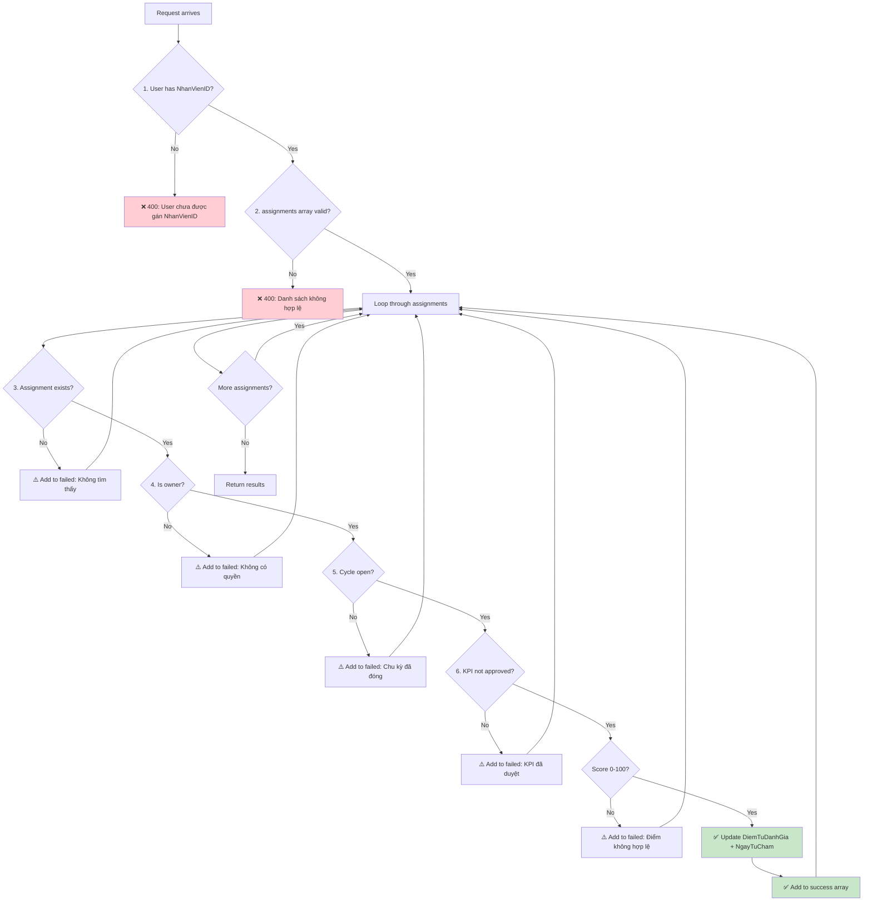
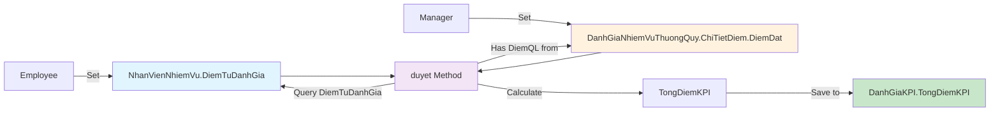
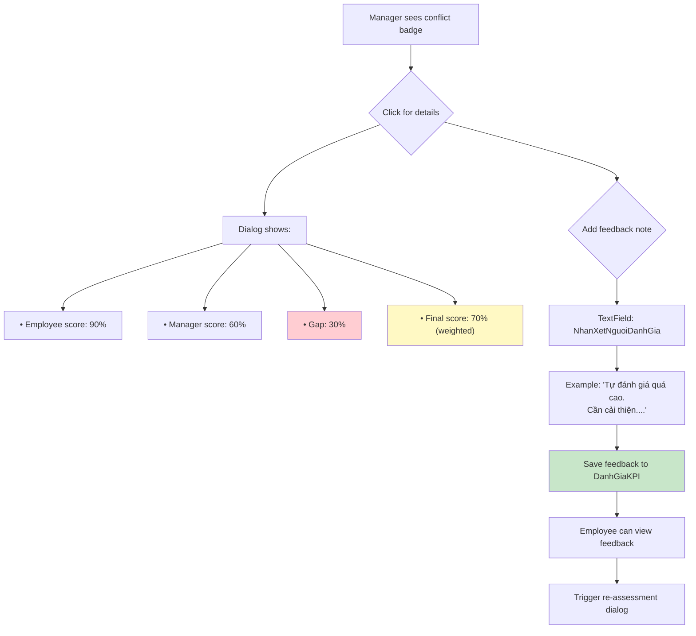
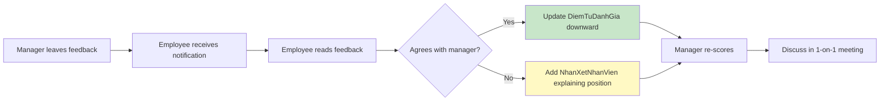
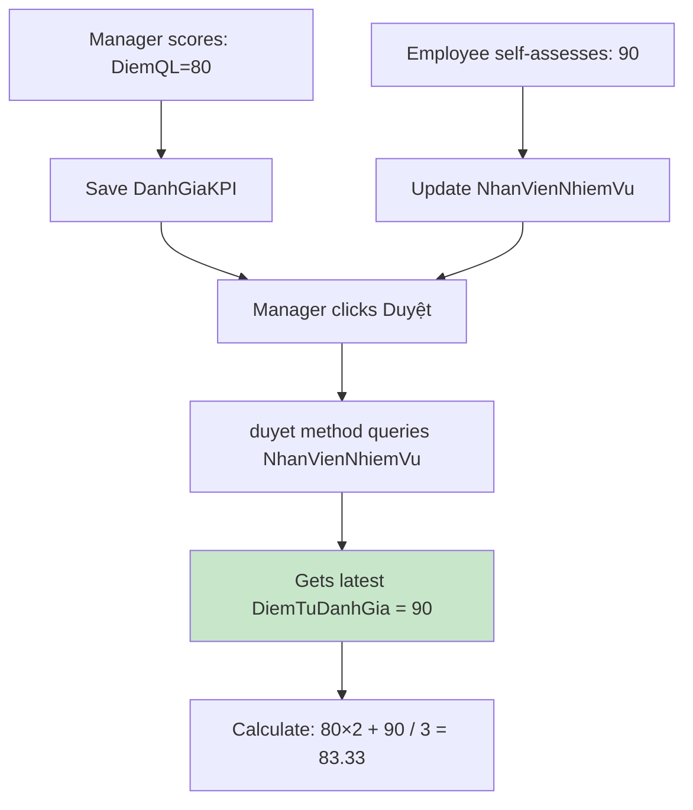
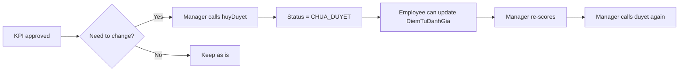

# 06. TỰ ĐÁNH GIÁ KPI (Self-Assessment System)

> **Module**: QuanLyCongViec/KPI  
> **Feature**: DiemTuDanhGia - Employee Self-Assessment  
> **Version**: V2.1 (Criteria-based KPI)  
> **Last Updated**: 5/1/2026

---

## 📋 MỤC LỤC

1. [Tổng Quan](#1-tổng-quan)
2. [Data Model & Schema](#2-data-model--schema)
3. [Quyền Hạn & Validation](#3-quyền-hạn--validation)
4. [UI Flow - Employee Perspective](#4-ui-flow---employee-perspective)
5. [Backend Logic & APIs](#5-backend-logic--apis)
6. [Manager Override System](#6-manager-override-system)
7. [Conflict Resolution](#7-conflict-resolution)
8. [Calculation Formula Integration](#8-calculation-formula-integration)
9. [Real-World Examples](#9-real-world-examples)
10. [Edge Cases & Solutions](#10-edge-cases--solutions)
11. [Best Practices](#11-best-practices)
12. [Troubleshooting Guide](#12-troubleshooting-guide)

---

## 1. TỔNG QUAN

### 1.1. Khái Niệm

**DiemTuDanhGia** (Self-Assessment Score) là cơ chế cho phép **nhân viên tự đánh giá** mức độ hoàn thành nhiệm vụ của mình trước khi quản lý chấm điểm chính thức.

**Key Concepts:**

- ✅ **Employee-driven**: Nhân viên chủ động đánh giá
- ✅ **Transparent**: Quản lý thấy được điểm tự đánh giá
- ✅ **Weighted formula**: Kết hợp với điểm quản lý theo công thức `(DiemQL×2 + DiemTD)/3`
- ✅ **Optional**: Không bắt buộc, có thể bỏ qua
- ✅ **Cycle-based**: Tự đánh giá theo từng chu kỳ

### 1.2. Business Value

#### **Lợi Ích Cho Nhân Viên:**

- Tự nhận thức năng lực
- Chuẩn bị trước cuộc họp đánh giá
- Đối thoại công bằng với quản lý

#### **Lợi Ích Cho Quản Lý:**

- Hiểu góc nhìn của nhân viên
- Phát hiện gaps giữa self-assessment và reality
- Căn cứ cho feedback conversation

#### **Lợi Ích Cho Tổ Chức:**

- Văn hóa minh bạch
- Giảm conflict trong đánh giá
- Dữ liệu để phân tích self-awareness

### 1.3. Architecture Overview



**Workflow Tóm Tắt:**

1. Nhân viên vào trang "Tự Đánh Giá KPI"
2. Hệ thống load nhiệm vụ từ `NhanVienNhiemVu` (theo ChuKyDanhGia)
3. Nhân viên nhập điểm 0-100% cho từng nhiệm vụ
4. Lưu `DiemTuDanhGia` vào `NhanVienNhiemVu`
5. Quản lý chấm điểm, thấy điểm tự đánh giá
6. Khi duyệt: Backend tự động tính điểm cuối với công thức weighted

### 1.4. Key Differences vs Old System

| Aspect             | ❌ Old System (V1)                     | ✅ New System (V2)                          |
| ------------------ | -------------------------------------- | ------------------------------------------- |
| **Storage**        | DanhGiaNhiemVuThuongQuy.ChiTietDiem    | NhanVienNhiemVu.DiemTuDanhGia               |
| **Granularity**    | Per criteria (mỗi tiêu chí riêng lẻ)   | Per duty (cả nhiệm vụ 0-100%)               |
| **Complexity**     | Phức tạp, nhiều UI inputs              | Đơn giản, 1 slider per duty                 |
| **Formula**        | Mixed logic trong ChiTietDiem          | Clean: `(DiemQL×2 + DiemTD)/3`              |
| **Permission**     | Check ChoPhepTuDanhGia per criteria    | Check IsChuKyDong (cycle level)             |
| **Data Ownership** | Trong evaluation document (DanhGiaKPI) | Trong assignment document (NhanVienNhiemVu) |

---

## 2. DATA MODEL & SCHEMA

### 2.1. NhanVienNhiemVu Schema

**Collection**: `nhanviennhiemvu`  
**Purpose**: Store employee-duty assignments + self-assessment scores  
**File**: [giaobanbv-be/modules/workmanagement/models/NhanVienNhiemVu.js](../../../../../giaobanbv-be/modules/workmanagement/models/NhanVienNhiemVu.js)

```javascript
{
  _id: ObjectId,
  NhanVienID: ObjectId,              // ← Employee reference
  NhiemVuThuongQuyID: ObjectId,      // ← Routine duty reference
  ChuKyDanhGiaID: ObjectId | null,   // ← Cycle reference (null = permanent)

  // ✅ Self-assessment fields
  DiemTuDanhGia: Number,             // 0-100%, null = chưa tự chấm
  NgayTuCham: Date,                  // Timestamp of self-assessment

  // Other fields
  MucDoKho: Number,                  // 1.0-10.0 difficulty weight
  TrangThaiHoatDong: Boolean,        // Active status
  NgayGan: Date,                     // Assignment date
  NguoiGanID: ObjectId,              // Assigner ID
  isDeleted: Boolean,

  createdAt: Date,
  updatedAt: Date
}
```

**Indexes:**

```javascript
// Non-unique for queries
{ NhanVienID: 1, NhiemVuThuongQuyID: 1 }

// Unique composite (one duty per employee per cycle)
{ NhanVienID: 1, NhiemVuThuongQuyID: 1, ChuKyDanhGiaID: 1 }

// For cycle-based queries
{ ChuKyDanhGiaID: 1 }
```

### 2.2. Relationship Diagram



**Flow:**

1. **Assignment Phase**: Manager gán nhiệm vụ → tạo `NhanVienNhiemVu` record
2. **Self-Assessment Phase**: Employee update `DiemTuDanhGia` field
3. **Manager Scoring Phase**: Manager chấm điểm trong `DanhGiaKPI` → tạo `DanhGiaNhiemVuThuongQuy`
4. **Approval Phase**: `duyet()` method query `DiemTuDanhGia` từ `NhanVienNhiemVu` và calculate

### 2.3. Field Details

#### **DiemTuDanhGia** (Number)

- **Range**: 0-100 (percentage)
- **Default**: `null` (not assessed yet)
- **Validation**:
  - Must be integer or decimal with max 2 decimals
  - Cannot be negative
  - Cannot exceed 100

**Example Values:**

```javascript
DiemTuDanhGia: null; // ← Chưa tự đánh giá
DiemTuDanhGia: 0; // ← Tự đánh giá 0% (không hoàn thành)
DiemTuDanhGia: 85.5; // ← Tự đánh giá 85.5%
DiemTuDanhGia: 100; // ← Tự đánh giá 100% (hoàn hảo)
```

#### **NgayTuCham** (Date)

- **Purpose**: Audit trail - when did employee self-assess?
- **Auto-set**: Backend automatically sets to `new Date()` on update
- **Nullable**: `null` if `DiemTuDanhGia` is null

**Use Cases:**

- Display "Đã tự đánh giá lúc: 10:30 AM, 15/12/2025"
- Track evaluation timeline
- Detect late submissions

---

## 3. QUYỀN HẠN & VALIDATION

### 3.1. Permission Matrix

| Action                       | Employee (Chính chủ) | Manager            | Admin              |
| ---------------------------- | -------------------- | ------------------ | ------------------ |
| View own DiemTuDanhGia       | ✅ Always            | ❌                 | ❌                 |
| View others' DiemTuDanhGia   | ❌                   | ✅ In ChamDiem UI  | ✅ In ChamDiem UI  |
| Update own DiemTuDanhGia     | ✅ If cycle open     | ❌                 | ❌                 |
| Update others' DiemTuDanhGia | ❌                   | ❌ Cannot override | ❌ Cannot override |
| Clear DiemTuDanhGia          | ✅ Set to null       | ❌                 | ❌                 |

**Key Rules:**

1. ✅ **Employee ONLY** can set/change their own DiemTuDanhGia
2. ✅ Managers can **VIEW** but **NOT EDIT** DiemTuDanhGia
3. ✅ Admin has same restrictions (no special override)
4. ✅ Self-assessment disabled when cycle is closed (`IsChuKyDong = true`)

### 3.2. Backend Validation

**File**: [giaobanbv-be/modules/workmanagement/controllers/assignment.controller.js](../../../../../giaobanbv-be/modules/workmanagement/controllers/assignment.controller.js)

```javascript
// PUT /api/workmanagement/giao-nhiem-vu/:assignmentId/tu-cham-diem
async nhanVienTuChamDiemBatch(req, res) {
  const { assignments } = req.body; // [{ assignmentId, DiemTuDanhGia }]
  const currentUserId = req.userId;

  // Get User to NhanVien mapping
  const User = mongoose.model("User");
  const user = await User.findById(currentUserId);
  if (!user || !user.NhanVienID) {
    throw new AppError(400, "Không tìm thấy thông tin nhân viên");
  }
  const nhanVienId = user.NhanVienID;

  // Validate ownership for each assignment
  for (const item of assignments) {
    const assignment = await NhanVienNhiemVu.findById(item.assignmentId);

    // ❌ Check 1: Assignment exists
    if (!assignment) {
      throw new AppError(404, `Assignment ${item.assignmentId} not found`);
    }

    // ❌ Check 2: Employee owns this assignment
    if (assignment.NhanVienID.toString() !== nhanVienId.toString()) {
      throw new AppError(403, "Bạn chỉ có thể tự đánh giá nhiệm vụ của mình");
    }

    // ❌ Check 3: Cycle is still open
    const chuKy = await ChuKyDanhGia.findById(assignment.ChuKyDanhGiaID);
    if (chuKy && chuKy.TrangThai === "DA_DONG") {
      throw new AppError(400, "Chu kỳ đánh giá đã đóng, không thể tự chấm điểm");
    }

    // ❌ Check 4: Score is valid
    const diem = item.DiemTuDanhGia;
    if (diem !== null && (diem < 0 || diem > 100)) {
      throw new AppError(400, "Điểm phải từ 0-100");
    }

    // ✅ All checks passed - update
    assignment.DiemTuDanhGia = diem;
    assignment.NgayTuCham = diem !== null ? new Date() : null;
    await assignment.save();
  }
}
```

### 3.3. Frontend Guards

**File**: [fe-bcgiaobanbvt/src/features/QuanLyCongViec/KPI/pages/TuDanhGiaKPIPage.js](../../../../src/features/QuanLyCongViec/KPI/pages/TuDanhGiaKPIPage.js)

```javascript
// Disable input when cycle closed
const isDisabled = selectedCycle?.TrangThai === "DA_DONG";

<Slider
  value={diemTuDanhGiaMap[assignment._id] || 0}
  onChange={(e, value) => handleScoreChange(assignment._id, value)}
  disabled={isDisabled} // ← Frontend disable
  min={0}
  max={100}
  step={1}
/>;

{
  isDisabled && (
    <Alert severity="warning">Chu kỳ đã đóng. Không thể tự đánh giá.</Alert>
  );
}
```

---

## 4. UI FLOW - EMPLOYEE PERSPECTIVE

### 4.1. Page Structure: TuDanhGiaKPIPage

**Route**: `/quanlycongviec/kpi/tu-danh-gia`  
**File**: [TuDanhGiaKPIPage.js](../../../../src/features/QuanLyCongViec/KPI/pages/TuDanhGiaKPIPage.js)

**Layout Components:**

```
┌─────────────────────────────────────────────────────────┐
│ 📊 Header: Employee Info + Cycle Selector              │
├─────────────────────────────────────────────────────────┤
│ 📈 Progress Bar: X/Y nhiệm vụ đã tự đánh giá (Z%)     │
├─────────────────────────────────────────────────────────┤
│ 📋 Nhiệm Vụ Card #1                                    │
│   • Tên nhiệm vụ + Mức độ khó                          │
│   • Slider (0-100%)                                     │
│   • Status: "Chưa chấm" / "Đã chấm: 85%"              │
├─────────────────────────────────────────────────────────┤
│ 📋 Nhiệm Vụ Card #2                                    │
│   ...                                                   │
├─────────────────────────────────────────────────────────┤
│ 💾 Batch Save Button: "Lưu Tự Đánh Giá"               │
└─────────────────────────────────────────────────────────┘
```

### 4.2. Step-by-Step Workflow

#### **Step 1: Initial Page Load**



**Code Reference:**

```javascript
// Lines 64-77
useEffect(() => {
  dispatch(getChuKyDanhGias());
}, [dispatch]);

useEffect(() => {
  if (user?.NhanVienID) {
    dispatch(getCurrentNhanVien(user.NhanVienID));
  }
}, [dispatch, user]);

// Auto-select chu kỳ mở (lines 80-90)
useEffect(() => {
  if (chuKyDanhGias.length > 0 && !selectedChuKy) {
    const openCycle = chuKyDanhGias.find((ck) => !ck.isDong);
    if (openCycle) {
      setSelectedChuKy(openCycle);
    } else {
      setSelectedChuKy(chuKyDanhGias[0]); // Fallback to latest
    }
  }
}, [chuKyDanhGias, selectedChuKy]);
```

#### **Step 2: Cycle Selection & Load Assignments**



**Code Reference:**

```javascript
// Lines 95-106: Cycle change handler
useEffect(() => {
  if (selectedChuKy && user?.NhanVienID) {
    dispatch(layDanhSachNhiemVu(user.NhanVienID, selectedChuKy._id));
  }
}, [dispatch, selectedChuKy, user]);

// Initialize scores from fetched assignments (lines 108-120)
useEffect(() => {
  if (assignmentList.length > 0) {
    const initialScores = {};
    assignmentList.forEach((assignment) => {
      initialScores[assignment._id] = assignment.DiemTuDanhGia ?? 0;
    });
    setScores(initialScores);
  }
}, [assignmentList]);
```

#### **Step 3: Assignment Cards Rendering**

**Card Layout Example:**

```javascript
// Lines 235-387 (simplified)
assignmentList.map((assignment) => (
  <Card key={assignment._id}>
    <CardContent>
      {/* Header: Tên nhiệm vụ + Mức độ khó */}
      <Stack direction="row" justifyContent="space-between">
        <Typography variant="h6">
          {assignment.NhiemVuThuongQuyID?.TenNhiemVu}
        </Typography>
        <Chip
          icon={<TrendingUpIcon />}
          label={`Độ khó: ${assignment.MucDoKho}/10`}
          color="primary"
        />
      </Stack>

      {/* Slider input */}
      <Box sx={{ px: 2 }}>
        <Typography gutterBottom>
          Điểm tự đánh giá: <strong>{scores[assignment._id] || 0}%</strong>
        </Typography>
        <Slider
          value={scores[assignment._id] || 0}
          onChange={(e, value) => handleScoreChange(assignment._id, value)}
          disabled={isDisabled || savingAll}
          min={0}
          max={100}
          step={1}
          marks={[
            { value: 0, label: "0%" },
            { value: 50, label: "50%" },
            { value: 100, label: "100%" },
          ]}
        />
      </Box>

      {/* Status chip */}
      {scores[assignment._id] > 0 ? (
        <Chip label={`Đã chấm: ${scores[assignment._id]}%`} color="success" />
      ) : (
        <Chip label="Chưa tự đánh giá" color="default" />
      )}

      {/* Timestamp if available */}
      {assignment.NgayTuCham && (
        <Typography variant="caption">
          Đã tự đánh giá lúc:{" "}
          {dayjs(assignment.NgayTuCham).format("HH:mm DD/MM/YYYY")}
        </Typography>
      )}
    </CardContent>
  </Card>
));
```

#### **Step 4: Slider Interaction & Real-time Preview**

**State Management:**

```javascript
// Lines 49-50: Local state for scores
const [scores, setScores] = useState({}); // { assignmentId: DiemTuDanhGia }

// Lines 122-127: Change handler
const handleScoreChange = (assignmentId, value) => {
  setScores((prev) => ({
    ...prev,
    [assignmentId]: value,
  }));
};
```

**User Interactions:**

1. **Slider drag**: `onChange` fires continuously
2. **TextField input**: Direct numeric entry (0-100)
3. **Real-time update**: Local state reflects changes instantly
4. **No auto-save**: Changes stay in memory until "Lưu" clicked

**Visual Feedback - Progress Bar:**

```javascript
// Progress calculation (lines 143-148)
const evaluatedCount = assignmentList.filter((a) => scores[a._id] > 0).length;
const totalCount = assignmentList.length;
const completionRate = totalCount > 0 ? (evaluatedCount / totalCount) * 100 : 0;

// Progress bar color
<LinearProgress
  variant="determinate"
  value={completionRate}
  sx={{
    "& .MuiLinearProgress-bar": {
      backgroundColor: completionRate === 100 ? "#4caf50" : "#2196f3",
    },
  }}
/>;
```

#### **Step 5: Batch Save Mechanism**

**Save Button Handler:**

```javascript
// Lines 129-141: Save all handler
const handleSaveAll = async () => {
  if (!selectedChuKy) {
    toast.error("Vui lòng chọn chu kỳ đánh giá");
    return;
  }

  setSavingAll(true);

  // Build payload
  const payload = {
    assignments: assignmentList.map((a) => ({
      assignmentId: a._id,
      DiemTuDanhGia: scores[a._id] ?? 0,
    })),
  };

  try {
    await dispatch(nhanVienTuChamDiemBatch(payload));
    toast.success("Lưu tự đánh giá thành công!");

    // Refresh assignments to get updated NgayTuCham
    dispatch(layDanhSachNhiemVu(user.NhanVienID, selectedChuKy._id));
  } catch (error) {
    toast.error(error.message);
  } finally {
    setSavingAll(false);
  }
};
```

**Flow Diagram:**

```mermaid
flowchart TD
    A[User clicks "Lưu"] --> B{Validate cycle}
    B -->|No cycle| C[Show error toast]
    B -->|Has cycle| D[Set savingAll = true]

    D --> E[Build payload array]
    E --> F[POST /tu-cham-diem-batch]

    F --> G{Success?}
    G -->|Yes| H[Show success toast]
    G -->|No| I[Show error toast]

    H --> J[Refresh assignments]
    J --> K[Update NgayTuCham display]
    K --> L[Set savingAll = false]
    I --> L

    style H fill:#c8e6c9
    style I fill:#ffcdd2
```

#### **Step 6: Success/Error Handling**

**Success Response:**

```javascript
// Redux thunk (kpiSlice.js)
export const nhanVienTuChamDiemBatch = (payload) => async (dispatch) => {
  dispatch(slice.actions.startLoading());
  try {
    const response = await apiService.post(
      "/workmanagement/giao-nhiem-vu/tu-cham-diem-batch",
      payload
    );
    dispatch(slice.actions.nhanVienTuChamDiemBatchSuccess(response.data));
    toast.success("Lưu tự đánh giá thành công!");
  } catch (error) {
    dispatch(slice.actions.hasError(error.message));
    toast.error(error.message);
  }
};
```

**Error Cases:**

| Error              | Message                                        | User Action            |
| ------------------ | ---------------------------------------------- | ---------------------- |
| Not owner          | "Bạn chỉ có thể tự đánh giá nhiệm vụ của mình" | Contact manager        |
| Cycle closed       | "Chu kỳ đã đóng, không thể tự chấm điểm"       | Select different cycle |
| Invalid score      | "Điểm phải từ 0-100"                           | Fix input              |
| Network error      | "Lỗi kết nối"                                  | Retry                  |
| Missing NhanVienID | "User chưa được gán NhanVienID"                | Contact admin          |

#### **Step 7: Refresh After Save**

**Post-save Actions:**

```javascript
// After successful save
dispatch(layDanhSachNhiemVu(user.NhanVienID, selectedChuKy._id));

// This re-fetches assignments with updated:
// - NgayTuCham (timestamp of self-assessment)
// - DiemTuDanhGia (confirmed value from DB)
```

**UI Updates:**

1. ✅ Timestamps appear: "Đã tự đánh giá lúc: 14:30 05/01/2026"
2. ✅ Progress bar updates to reflect actual saved data
3. ✅ Status chips change: "Chưa chấm" → "Đã chấm: X%"
4. ✅ Save button re-enables

### 4.3. Disabled States

**When UI is Disabled:**

```javascript
// Cycle closed
const isDisabled = selectedChuKy?.TrangThai === "DA_DONG";
```

**Visual Indicators:**

```javascript
{isDisabled && (
  <Alert severity="warning" sx={{ mb: 2 }}>
    Chu kỳ đã đóng. Bạn không thể tự đánh giá trong chu kỳ này.
  </Alert>
)}

// All inputs disabled
<Slider disabled={isDisabled || savingAll} />
<TextField disabled={isDisabled || savingAll} />
<LoadingButton disabled={isDisabled || assignmentList.length === 0}>
  Lưu Tự Đánh Giá
</LoadingButton>
```

### 4.4. Empty States

**No Cycles:**

```javascript
{
  chuKyDanhGias.length === 0 && !isLoading && (
    <Alert severity="info">
      Chưa có chu kỳ đánh giá nào. Vui lòng liên hệ quản lý.
    </Alert>
  );
}
```

**No Assignments:**

```javascript
{
  assignmentList.length === 0 && selectedChuKy && (
    <Alert severity="info">
      Bạn chưa được gán nhiệm vụ nào trong chu kỳ này.
    </Alert>
  );
}
```

### 4.5. Responsive Design

**Mobile Optimizations:**

```javascript
<Container maxWidth="lg">
  <Grid container spacing={3}>
    <Grid item xs={12} md={8}>
      {/* Assignment cards - full width on mobile */}
    </Grid>
    <Grid item xs={12} md={4}>
      {/* Summary sidebar - stacks below on mobile */}
    </Grid>
  </Grid>
</Container>
```

---

## 5. BACKEND LOGIC & APIs

### 5.1. API Endpoints Overview

Có **2 endpoints chính** cho self-assessment system:

1. **GET** `/api/workmanagement/giao-nhiem-vu` - Load assignments
2. **POST** `/api/workmanagement/giao-nhiem-vu/tu-cham-diem-batch` - Batch update scores

**File**: [assignment.controller.js](../../../../../giaobanbv-be/modules/workmanagement/controllers/assignment.controller.js)

---

#### **5.1.1. GET - Load Assignments**

**Purpose**: Lấy danh sách nhiệm vụ của nhân viên theo chu kỳ

**Request:**

```http
GET /api/workmanagement/giao-nhiem-vu?nhanVienId=xxx&chuKyId=yyy
Authorization: Bearer <JWT_TOKEN>
```

**Query Parameters:**

| Parameter  | Type     | Required | Description                   |
| ---------- | -------- | -------- | ----------------------------- |
| nhanVienId | ObjectId | ✅       | ID của nhân viên (NhanVienID) |
| chuKyId    | ObjectId | ✅       | ID của chu kỳ đánh giá        |

**Response Success (200):**

```json
{
  "success": true,
  "data": [
    {
      "_id": "6774a1234567890abcdef001",
      "NhanVienID": "66b1dba74f79822a4752d90d",
      "NhiemVuThuongQuyID": {
        "_id": "66b1dba74f79822a4752d90e",
        "TenNhiemVu": "Khám bệnh",
        "MoTa": "Khám bệnh cho bệnh nhân ngoại trú"
      },
      "ChuKyDanhGiaID": "67749c5c1234567890abcdef",
      "MucDoKho": 7.5,
      "DiemTuDanhGia": 85,
      "NgayTuCham": "2026-01-04T08:30:00.000Z",
      "TrangThaiHoatDong": true,
      "NgayGan": "2026-01-01T00:00:00.000Z",
      "NguoiGanID": {
        "HoTen": "Trần Văn B",
        "MaNhanVien": "NV002"
      }
    }
  ],
  "message": "Tìm thấy 2 nhiệm vụ"
}
```

---

#### **5.1.2. POST - Batch Update Scores**

**Purpose**: Nhân viên tự chấm điểm nhiều nhiệm vụ cùng lúc

**Request:**

```http
POST /api/workmanagement/giao-nhiem-vu/tu-cham-diem-batch
Authorization: Bearer <JWT_TOKEN>
Content-Type: application/json

{
  "assignments": [
    {
      "assignmentId": "6774a1234567890abcdef001",
      "DiemTuDanhGia": 85
    },
    {
      "assignmentId": "6774a1234567890abcdef002",
      "DiemTuDanhGia": 90
    }
  ]
}
```

**Request Body:**

| Field                       | Type     | Required | Description                      |
| --------------------------- | -------- | -------- | -------------------------------- |
| assignments                 | Array    | ✅       | Mảng các assignment cần cập nhật |
| assignments[].assignmentId  | ObjectId | ✅       | ID của NhanVienNhiemVu record    |
| assignments[].DiemTuDanhGia | Number   | ✅       | Điểm tự đánh giá (0-100)         |

**Response Success (200):**

```json
{
  "success": true,
  "data": {
    "success": [
      {
        "assignmentId": "6774a1234567890abcdef001",
        "nhiemVu": "Khám bệnh",
        "DiemTuDanhGia": 85
      },
      {
        "assignmentId": "6774a1234567890abcdef002",
        "nhiemVu": "Điều trị",
        "DiemTuDanhGia": 90
      }
    ],
    "failed": []
  },
  "message": "Cập nhật tự đánh giá thành công (2 nhiệm vụ)"
}
```

**Response Partial Success (207 Multi-Status):**

```json
{
  "success": true,
  "data": {
    "success": [
      {
        "assignmentId": "6774a1234567890abcdef001",
        "nhiemVu": "Khám bệnh",
        "DiemTuDanhGia": 85
      }
    ],
    "failed": [
      {
        "assignmentId": "6774a1234567890abcdef002",
        "reason": "Chu kỳ đánh giá đã đóng, không thể tự chấm điểm"
      }
    ]
  },
  "message": "Cập nhật một phần thành công (1/2 nhiệm vụ)"
}
```

---

### 5.2. Backend Validation Flow

**6-Layer Security Checks:**



**Validation Summary:**

| Check # | Validation                      | Error Message                                 | HTTP Code |
| ------- | ------------------------------- | --------------------------------------------- | --------- |
| 1       | User has NhanVienID             | "User chưa được gán NhanVienID"               | 400       |
| 2       | Valid assignments array         | "Danh sách nhiệm vụ không hợp lệ"             | 400       |
| 3       | Assignment exists & not deleted | "Không tìm thấy nhiệm vụ"                     | (partial) |
| 4       | Ownership (employee = owner)    | "Bạn chỉ có thể tự chấm điểm cho nhiệm vụ..." | (partial) |
| 5       | Cycle is open (not closed)      | "Chu kỳ đã đóng, không thể tự chấm điểm"      | (partial) |
| 6       | KPI not yet approved            | "KPI đã được duyệt, không thể thay đổi"       | (partial) |

**(partial) = Được ghi vào `failed` array thay vì throw error toàn bộ**

### 5.3. Backend Code Implementation

**File**: [assignment.controller.js](../../../../../giaobanbv-be/modules/workmanagement/controllers/assignment.controller.js#L52-L148)

```javascript
assignmentController.nhanVienTuChamDiemBatch = catchAsync(
  async (req, res, next) => {
    const { assignments } = req.body;
    const currentNhanVienId = req.user?.NhanVienID;

    // ✅ Check 1: User has NhanVienID
    if (!currentNhanVienId) {
      throw new AppError(400, "User chưa được gán NhanVienID");
    }

    // ✅ Check 2: Valid array
    if (!Array.isArray(assignments) || assignments.length === 0) {
      throw new AppError(400, "Danh sách nhiệm vụ không hợp lệ");
    }

    // ✅ Validate structure & score range
    for (const item of assignments) {
      if (
        !item.assignmentId ||
        item.DiemTuDanhGia == null ||
        item.DiemTuDanhGia < 0 ||
        item.DiemTuDanhGia > 100
      ) {
        throw new AppError(400, "Điểm tự đánh giá phải từ 0-100");
      }
    }

    const results = {
      success: [],
      failed: [],
    };

    // ✅ Process each assignment
    for (const { assignmentId, DiemTuDanhGia } of assignments) {
      try {
        // Check 3: Find assignment
        const assignment = await NhanVienNhiemVu.findOne({
          _id: assignmentId,
          isDeleted: { $ne: true },
        });

        if (!assignment) {
          results.failed.push({
            assignmentId,
            reason: "Không tìm thấy nhiệm vụ",
          });
          continue;
        }

        // Check 4: Ownership
        if (assignment.NhanVienID.toString() !== currentNhanVienId.toString()) {
          results.failed.push({
            assignmentId,
            reason: "Bạn chỉ có thể tự chấm điểm cho nhiệm vụ của mình",
          });
          continue;
        }

        // Check 5: Cycle is open
        const chuKy = await ChuKyDanhGia.findById(assignment.ChuKyDanhGiaID);
        if (!chuKy || chuKy.isDong) {
          results.failed.push({
            assignmentId,
            reason: "Chu kỳ đánh giá đã đóng",
          });
          continue;
        }

        // Check 6: KPI not yet approved
        const danhGiaKPI = await DanhGiaKPI.findOne({
          ChuKyDanhGiaID: assignment.ChuKyDanhGiaID,
          NhanVienID: assignment.NhanVienID,
        });

        if (danhGiaKPI && danhGiaKPI.TrangThai === "DA_DUYET") {
          results.failed.push({
            assignmentId,
            reason: "KPI đã được duyệt, không thể thay đổi",
          });
          continue;
        }

        // ✅ All checks passed - Update
        assignment.DiemTuDanhGia = DiemTuDanhGia;
        assignment.NgayTuCham = new Date(); // Auto-set timestamp
        await assignment.save();

        results.success.push({
          assignmentId: assignment._id,
          nhiemVu: assignment.NhiemVuThuongQuyID?.TenNhiemVu,
          DiemTuDanhGia,
        });
      } catch (error) {
        results.failed.push({
          assignmentId,
          reason: error.message,
        });
      }
    }

    // Return results with appropriate status code
    const statusCode = results.failed.length === 0 ? 200 : 207; // 207 = Multi-Status
    const message =
      results.failed.length === 0
        ? `Cập nhật tự đánh giá thành công (${results.success.length} nhiệm vụ)`
        : `Cập nhật một phần thành công (${results.success.length}/${assignments.length})`;

    return sendResponse(res, statusCode, true, results, null, message);
  }
);
```

### 5.4. Error Handling Strategy

**Batch Operation Pattern**: Individual failures don't stop the whole batch

**Example Scenario:**

- Request has 3 assignments
- Assignment #1: ✅ Success
- Assignment #2: ❌ Failed (cycle closed)
- Assignment #3: ✅ Success

**Result**: HTTP 207 with `{ success: [1, 3], failed: [2] }`

**Frontend Handling:**

```javascript
if (response.status === 207) {
  toast.warning("Một số nhiệm vụ không thể cập nhật");
  // Show detailed errors in UI
  response.data.failed.forEach((f) => {
    console.warn(`${f.assignmentId}: ${f.reason}`);
  });
} else if (response.status === 200) {
  toast.success("Cập nhật thành công tất cả nhiệm vụ");
}
```

---

## 6. MANAGER OVERRIDE SYSTEM

### 6.1. Core Principle: Read-Only for Managers

**❌ Managers CANNOT edit `DiemTuDanhGia`**

**Key Rules:**

1. ✅ `DiemTuDanhGia` is **employee-owned** data
2. ✅ Managers can **VIEW** but **NOT MODIFY** this field
3. ✅ Managers set `DiemQL` (DiemQuanLy) independently
4. ✅ Final score uses **weighted formula** favoring manager's assessment

**Why This Design?**

- **Preserve integrity**: Employee self-assessment shouldn't be altered
- **Audit trail**: Need to see what employee originally claimed
- **Conversation starter**: Gaps between scores trigger discussions
- **Fairness**: Manager has final say via 2x weight in formula

### 6.2. Manager UI - ChamDiemKPITable

**File**: [ChamDiemKPITable.js](../../../../src/features/QuanLyCongViec/KPI/v2/components/ChamDiemKPITable.js)

**DiemTuDanhGia Display:**

```javascript
// Lines 165-180: ScoreInput component with disabled prop
<ScoreInput
  initialValue={diemTuDanhGia}
  min={0}
  max={100}
  unit="%"
  onCommit={() => {}} // ❌ No-op - cannot change
  disabled={true}      // ✅ Always disabled for managers
/>

// Enhanced styling for disabled state (lines 174-182)
"&.Mui-disabled": {
  bgcolor: "#f5f5f5",
  "& input": {
    color: "#2c3e50",           // Dark gray (readable)
    WebkitTextFillColor: "#2c3e50",
    fontWeight: "700",          // Bold for emphasis
  },
}
```

**Visual Indicators:**

```
┌─────────────────────────────────────────────────────────┐
│ Nhiệm vụ: Khám bệnh                          Độ khó: 7.5│
├─────────────────────────────────────────────────────────┤
│ Tiêu chí              │ Điểm QL  │ Tự đánh giá │ Cuối   │
├───────────────────────┼──────────┼─────────────┼────────┤
│ Mức độ hoàn thành     │ [80__]%  │   85% 🔒    │ 81.67% │
│                       │  ↑       │    ↑        │        │
│                       │  Editable│   Read-only │        │
└─────────────────────────────────────────────────────────┘

🔒 = Locked icon (disabled state)
[80__] = Editable text field (white background)
85% = Grayed out but readable (not too light)
```

### 6.3. DiemQL vs DiemTuDanhGia in Data Model

**In DanhGiaNhiemVuThuongQuy (evaluation document):**

```javascript
{
  NhiemVuThuongQuyID: ObjectId,
  ChiTietDiem: [
    {
      TenTieuChi: "Mức độ hoàn thành công việc",
      LoaiTieuChi: "TANG_DIEM",

      // ✅ Manager sets this (editable in ChamDiemKPITable)
      DiemDat: 80,              // ← DiemQL (Manager's score)

      // ❌ NOT stored here in V2
      // DiemTuDanhGia: N/A    // Stored in NhanVienNhiemVu instead

      GiaTriMin: 0,
      GiaTriMax: 100,
      DonVi: "%"
    }
  ]
}
```

**In NhanVienNhiemVu (assignment document):**

```javascript
{
  NhanVienID: ObjectId,
  NhiemVuThuongQuyID: ObjectId,
  ChuKyDanhGiaID: ObjectId,

  // ✅ Employee sets this (via TuDanhGiaKPIPage)
  DiemTuDanhGia: 85,          // ← Self-assessment score
  NgayTuCham: Date,           // ← Timestamp

  MucDoKho: 7.5
}
```

**Data Flow:**



### 6.4. Formula Weighting (Manager Priority)

**Recap from [03_CALCULATION_FORMULAS.md](03_CALCULATION_FORMULAS.md):**

```javascript
// With self-assessment
DiemNhiemVu = (DiemQL × 2 + DiemTuDanhGia) / 3

// Breakdown:
// - DiemQL has 2/3 weight (66.7%)
// - DiemTuDanhGia has 1/3 weight (33.3%)
```

**Example:**

| Score Type       | Value | Weight | Contribution |
| ---------------- | ----- | ------ | ------------ |
| DiemQL (Manager) | 80    | 2x     | 160          |
| DiemTuDanhGia    | 90    | 1x     | 90           |
| **Total**        |       |        | 250          |
| **DiemNhiemVu**  |       | ÷3     | **83.33**    |

**Manager's score pulls the final score down** (80 < 90), demonstrating manager authority.

### 6.5. Backend Calculation Logic

**File**: [DanhGiaKPI.js](../../../../../giaobanbv-be/modules/workmanagement/models/DanhGiaKPI.js) - `duyet()` method

```javascript
// Lines 180-220 (simplified)
danhGiaKPISchema.methods.duyet = async function (nhanXet, nguoiDuyetId) {
  // 1. Load nhiệm vụ list from evaluation
  const nhiemVuList = this.DanhGiaNhiemVuThuongQuy;

  // 2. Query DiemTuDanhGia from NhanVienNhiemVu
  const NhanVienNhiemVu = mongoose.model("NhanVienNhiemVu");
  const assignments = await NhanVienNhiemVu.find({
    NhanVienID: this.NhanVienID,
    ChuKyDanhGiaID: this.ChuKyDanhGiaID,
    isDeleted: false,
  });

  // 3. Build map: { NhiemVuThuongQuyID: DiemTuDanhGia }
  const diemTuDanhGiaMap = {};
  assignments.forEach((a) => {
    const nvId = a.NhiemVuThuongQuyID.toString();
    diemTuDanhGiaMap[nvId] = a.DiemTuDanhGia || 0;
  });

  let tongDiemKPI = 0;

  // 4. Calculate per nhiệm vụ
  nhiemVuList.forEach((nv) => {
    const nvId = nv.NhiemVuThuongQuyID.toString();
    const diemTuDanhGia = diemTuDanhGiaMap[nvId] || 0;

    let diemTang = 0;
    let diemGiam = 0;

    nv.ChiTietDiem.forEach((tc) => {
      const diemQL = tc.DiemDat || 0; // ← Manager's score

      // ✅ Apply weighted formula for IsMucDoHoanThanh
      let diemCuoiCung;
      if (tc.IsMucDoHoanThanh) {
        diemCuoiCung = (diemQL * 2 + diemTuDanhGia) / 3; // ← Weighted
      } else {
        diemCuoiCung = diemQL; // ← Manager only
      }

      const diemScaled = diemCuoiCung / 100;

      if (tc.LoaiTieuChi === "TANG_DIEM") {
        diemTang += diemScaled;
      } else {
        diemGiam += diemScaled;
      }
    });

    const tongDiemTieuChi = diemTang - diemGiam;
    const diemNhiemVu = nv.MucDoKho * tongDiemTieuChi;
    tongDiemKPI += diemNhiemVu;
  });

  // 5. Save final score
  this.TongDiemKPI = tongDiemKPI;
  this.TrangThai = "DA_DUYET";
  this.NgayDuyet = new Date();
  this.NguoiDuyet = nguoiDuyetId;

  await this.save();
};
```

**Key Takeaway**: `DiemTuDanhGia` is **read from NhanVienNhiemVu**, not from evaluation document!

### 6.6. Scenario: Manager Disagrees with Self-Assessment

**Example:**

- Employee self-assessed: **90%** ("Tôi làm rất tốt!")
- Manager assesses: **70%** ("Còn nhiều thiếu sót")

**Calculation:**

```javascript
DiemNhiemVu = (70 × 2 + 90) / 3 = (140 + 90) / 3 = 76.67%
```

**Result**: Final score **76.67%** - closer to manager's view (70%) than employee's (90%)

**Why This Works:**

1. ✅ Manager's judgment carries more weight (2x)
2. ✅ Employee input still considered (1x)
3. ✅ Compromise between two perspectives
4. ✅ Encourages dialogue: "Why the gap?"

---

## 7. CONFLICT RESOLUTION

### 7.1. Detecting Score Conflicts

**Conflict Definition**: Large gap between `DiemTuDanhGia` and `DiemQL`

**Threshold Examples:**

```javascript
// Common thresholds
const MINOR_GAP = 10; // Yellow warning (10-20% difference)
const MAJOR_GAP = 20; // Red alert (>20% difference)

function detectConflict(diemQL, diemTuDanhGia) {
  const gap = Math.abs(diemQL - diemTuDanhGia);

  if (gap >= MAJOR_GAP) {
    return { level: "MAJOR", gap, color: "error" };
  } else if (gap >= MINOR_GAP) {
    return { level: "MINOR", gap, color: "warning" };
  }
  return { level: "NONE", gap, color: "success" };
}
```

**Example Conflicts:**

| DiemQL | DiemTD | Gap | Level    | Interpretation                     |
| ------ | ------ | --- | -------- | ---------------------------------- |
| 80     | 85     | 5%  | ✅ None  | Close alignment                    |
| 70     | 85     | 15% | ⚠️ Minor | Some disagreement                  |
| 60     | 90     | 30% | 🔴 Major | Significant perception gap         |
| 95     | 70     | 25% | 🔴 Major | Manager > Employee (underestimate) |

### 7.2. UI Indicators for Conflicts

**Visual Badges in ChamDiemKPITable:**

```javascript
// Pseudo-code for conflict indicator
const ConflictBadge = ({ diemQL, diemTuDanhGia }) => {
  const conflict = detectConflict(diemQL, diemTuDanhGia);

  if (conflict.level === "NONE") return null;

  return (
    <Tooltip title={`Chênh lệch ${conflict.gap}%`}>
      <Chip
        icon={<WarningIcon />}
        label={`Gap: ${conflict.gap}%`}
        color={conflict.color}
        size="small"
      />
    </Tooltip>
  );
};

// Usage in table row
<TableCell>
  <Stack direction="row" spacing={1} alignItems="center">
    <Typography>{diemQL}%</Typography>
    <Typography color="text.secondary">(TD: {diemTuDanhGia}%)</Typography>
    <ConflictBadge diemQL={diemQL} diemTuDanhGia={diemTuDanhGia} />
  </Stack>
</TableCell>;
```

**Display Example:**

```
┌────────────────────────────────────────────────────────┐
│ Nhiệm vụ          │ Điểm QL  │ Tự ĐG  │ Conflict      │
├───────────────────┼──────────┼────────┼───────────────┤
│ Khám bệnh         │ 80%      │ 85%    │ ✅ OK (5%)    │
│ Điều trị          │ 70%      │ 85%    │ ⚠️ Gap 15%    │
│ Tư vấn bệnh nhân  │ 60%      │ 90%    │ 🔴 Gap 30%    │
└────────────────────────────────────────────────────────┘
```

### 7.3. Manager Feedback Workflow

**When Conflict Detected:**



**Backend Field for Feedback:**

```javascript
// DanhGiaKPI schema
{
  NhanXetNguoiDanhGia: String,  // Manager's feedback
  NhanXetNhanVien: String,      // Employee's response (optional)

  LichSuDuyet: [{
    NgayDuyet: Date,
    NguoiDuyet: ObjectId,
    NhanXet: String,           // Snapshot of feedback at approval time
    TongDiemKPI: Number
  }]
}
```

### 7.4. Re-Assessment Workflow

**Option 1: Employee Re-Evaluates**



**Option 2: Manager Stands Firm**

- Manager keeps `DiemQL` as is
- System uses weighted formula
- Feedback documents the disagreement
- Can be reviewed by higher management

### 7.5. Audit Trail for Conflicts

**What to Track:**

```javascript
{
  _id: ObjectId,
  DanhGiaKPIID: ObjectId,
  NhiemVuThuongQuyID: ObjectId,

  // Original scores
  DiemQLOriginal: 60,
  DiemTuDanhGiaOriginal: 90,
  GapDetected: 30,
  ConflictLevel: "MAJOR",

  // Manager feedback
  NguoiDanhGiaFeedback: "Tự đánh giá quá cao so với thực tế...",
  NgayFeedback: Date,

  // Employee response (optional)
  NhanVienResponse: "Tôi đã cố gắng rất nhiều nhưng có thể...",
  NgayResponse: Date,

  // Resolution
  DiemQLFinal: 65,           // Manager adjusted after discussion
  DiemTuDanhGiaFinal: 85,    // Employee adjusted
  NgayResolve: Date,
  ResolvedBy: ObjectId,
  ResolutionNote: "Thống nhất sau cuộc họp 1-on-1"
}
```

**Benefits:**

- ✅ Full history of score changes
- ✅ Documentation for HR reviews
- ✅ Pattern analysis (who overestimates?)
- ✅ Fair process evidence

### 7.6. Best Practices for Handling Conflicts

#### **For Managers:**

1. ✅ **Investigate first**: Why did employee self-assess high?
2. ✅ **Provide specific examples**: "Trong tháng này có 3 lần..."
3. ✅ **Be constructive**: Focus on improvement, not blame
4. ✅ **Document reasons**: Write detailed NhanXetNguoiDanhGia
5. ✅ **Schedule 1-on-1**: Don't resolve via email/system only

#### **For Employees:**

1. ✅ **Be realistic**: Self-assessment should match reality
2. ✅ **Provide evidence**: Reference specific achievements
3. ✅ **Accept feedback gracefully**: Manager may see what you missed
4. ✅ **Ask for clarification**: If disagree, seek detailed explanation
5. ✅ **Focus on growth**: Use gap as learning opportunity

#### **For System Admins:**

1. ✅ **Monitor conflict rates**: Track percentage of MAJOR gaps
2. ✅ **Train users**: Explain the weighted formula
3. ✅ **Review outliers**: Investigate consistent overestimation
4. ✅ **Facilitate dialogue**: Provide tools for feedback exchange

### 7.7. Conflict Resolution Statistics

**Example Dashboard Metrics:**

```
Conflict Summary - Q1 2026
─────────────────────────────────────
Total Evaluations:        250
No Conflicts (gap <10%):  180 (72%)
Minor Conflicts (10-20%): 50  (20%)
Major Conflicts (>20%):   20  (8%)

Top Conflict Areas:
1. Nhiệm vụ "Điều trị" - 15 cases
2. Nhiệm vụ "Tư vấn"   - 10 cases
3. Nhiệm vụ "Nghiên cứu" - 8 cases

Resolution Rate:
Resolved after feedback:  18/20 (90%)
Escalated to HR:         2/20  (10%)
```

---

## 8. CALCULATION FORMULA INTEGRATION

### 8.1. Formula Recap

**(Liên kết với [03_CALCULATION_FORMULAS.md](03_CALCULATION_FORMULAS.md#32-diemnhiemvu-với-tự-đánh-giá))**

**With Self-Assessment:**

```javascript
DiemNhiemVu = (DiemQuanLy × 2 + DiemTuDanhGia) / 3
```

**Example:**

- DiemQuanLy = 80
- DiemTuDanhGia = 90
- DiemNhiemVu = (80×2 + 90)/3 = (160 + 90)/3 = **83.33**

**Without Self-Assessment:**

```javascript
DiemNhiemVu = DiemQuanLy;
```

**Example:**

- DiemQuanLy = 80
- DiemTuDanhGia = null
- DiemNhiemVu = **80**

### 8.2. Implementation in duyet() Method

**File**: [DanhGiaKPI.js](../../../../../giaobanbv-be/modules/workmanagement/models/DanhGiaKPI.js#L180-L250)

**Step-by-Step Code Flow:**

```javascript
// Step 1: Query DiemTuDanhGia from NhanVienNhiemVu
const NhanVienNhiemVu = mongoose.model("NhanVienNhiemVu");
const assignments = await NhanVienNhiemVu.find({
  NhanVienID: this.NhanVienID,
  ChuKyDanhGiaID: this.ChuKyDanhGiaID,
  isDeleted: false,
});

// Step 2: Build diemTuDanhGiaMap
const diemTuDanhGiaMap = {};
assignments.forEach((a) => {
  const nvId = a.NhiemVuThuongQuyID.toString();
  diemTuDanhGiaMap[nvId] = a.DiemTuDanhGia || 0;
});

// Step 3: Calculate per nhiemVu
let tongDiemKPI = 0;

this.DanhGiaNhiemVuThuongQuy.forEach((nv) => {
  const nvId = nv.NhiemVuThuongQuyID.toString();
  const diemTuDanhGia = diemTuDanhGiaMap[nvId] || 0;

  let diemTang = 0;
  let diemGiam = 0;

  nv.ChiTietDiem.forEach((tc) => {
    const diemQL = tc.DiemDat || 0;

    // ✅ Apply weighted formula
    let diemCuoiCung;
    if (tc.IsMucDoHoanThanh) {
      // With self-assessment: (DiemQL × 2 + DiemTD) / 3
      diemCuoiCung = (diemQL * 2 + diemTuDanhGia) / 3;
    } else {
      // Without self-assessment: DiemQL only
      diemCuoiCung = diemQL;
    }

    const diemScaled = diemCuoiCung / 100;

    if (tc.LoaiTieuChi === "TANG_DIEM") {
      diemTang += diemScaled;
    } else {
      diemGiam += diemScaled;
    }
  });

  const tongDiemTieuChi = diemTang - diemGiam;
  const diemNhiemVu = nv.MucDoKho * tongDiemTieuChi;
  tongDiemKPI += diemNhiemVu;
});

// Step 4: Save TongDiemKPI
this.TongDiemKPI = tongDiemKPI;
this.TrangThai = "DA_DUYET";
this.NgayDuyet = new Date();
this.NguoiDuyet = nguoiDuyetId;

await this.save();
```

**Key Points:**

1. ✅ `DiemTuDanhGia` is **queried** from separate collection (not stored in evaluation)
2. ✅ Map is built **once** for efficiency (O(n) lookup)
3. ✅ Formula **only applies** to criteria with `IsMucDoHoanThanh = true`
4. ✅ If no self-assessment found (null/0), uses `DiemQL` only

### 8.3. Frontend Preview Calculation

**File**: [kpiCalculation.js](../../../../src/utils/kpiCalculation.js)

**Utility Function:**

```javascript
/**
 * Calculate nhiệm vụ score with self-assessment
 * MUST MATCH backend duyet() method logic
 */
export const calculateNhiemVuScore = (nhiemVu, diemTuDanhGia = 0) => {
  if (!nhiemVu || !nhiemVu.ChiTietDiem) {
    return { diemTang: 0, diemGiam: 0, tongDiemTieuChi: 0, diemNhiemVu: 0 };
  }

  let diemTang = 0;
  let diemGiam = 0;

  nhiemVu.ChiTietDiem.forEach((tc) => {
    const diemQL = tc.DiemDat || 0;

    // ✅ Apply weighted formula
    let diemCuoiCung;
    if (tc.IsMucDoHoanThanh) {
      diemCuoiCung = (diemQL * 2 + diemTuDanhGia) / 3;
    } else {
      diemCuoiCung = diemQL;
    }

    const diemScaled = diemCuoiCung / 100;

    if (tc.LoaiTieuChi === "TANG_DIEM") {
      diemTang += diemScaled;
    } else {
      diemGiam += diemScaled;
    }
  });

  const tongDiemTieuChi = diemTang - diemGiam;
  const diemNhiemVu = nhiemVu.MucDoKho * tongDiemTieuChi;

  return { diemTang, diemGiam, tongDiemTieuChi, diemNhiemVu };
};
```

**Usage in ChamDiemKPITable:**

```javascript
// Real-time preview while manager is scoring
const calculateNhiemVuTotal = useCallback(
  (nhiemVu) => {
    const nvId = nhiemVu.NhiemVuThuongQuyID?._id || nhiemVu.NhiemVuThuongQuyID;
    const diemTuDanhGia = diemTuDanhGiaMap[nvId?.toString()] || 0;

    const { diemNhiemVu } = calculateNhiemVuScore(nhiemVu, diemTuDanhGia);
    return diemNhiemVu;
  },
  [diemTuDanhGiaMap]
);

// Display in UI
<Typography variant="h6">
  Điểm nhiệm vụ: {calculateNhiemVuTotal(nhiemVu).toFixed(2)}
</Typography>;
```

**⚠️ CRITICAL**: Frontend calculation MUST match backend exactly!

---

## 9. REAL-WORLD EXAMPLES

### Example 1: Full Self-Assessment Flow

**Scenario:**

- **Employee**: Nguyễn Văn A (Bác sĩ khoa Nội)
- **Cycle**: Q1/2026 (01/01/2026 - 31/03/2026)
- **Nhiệm vụ được gán**:
  1. Khám bệnh (MucDoKho: 7.0)
  2. Điều trị (MucDoKho: 8.5)
  3. Tư vấn bệnh nhân (MucDoKho: 6.0)

---

#### **Phase 1: Employee Self-Assessment (15/03/2026)**

**Action**: Nguyễn Văn A vào trang "Tự Đánh Giá KPI"

**Data Before:**

```javascript
// NhanVienNhiemVu collection
[
  {
    _id: "nv1",
    NhiemVuThuongQuyID: "khambênh",
    DiemTuDanhGia: null,
    NgayTuCham: null,
  },
  {
    _id: "nv2",
    NhiemVuThuongQuyID: "dieutri",
    DiemTuDanhGia: null,
    NgayTuCham: null,
  },
  {
    _id: "nv3",
    NhiemVuThuongQuyID: "tuvan",
    DiemTuDanhGia: null,
    NgayTuCham: null,
  },
];
```

**Employee Input:**

| Nhiệm vụ         | Self-Assessment | Justification                  |
| ---------------- | --------------- | ------------------------------ |
| Khám bệnh        | 85%             | "Khám đầy đủ, chính xác"       |
| Điều trị         | 90%             | "Không có ca nào biến chứng"   |
| Tư vấn bệnh nhân | 80%             | "BN hài lòng, không khiếu nại" |

**Action**: Click "Lưu Tự Đánh Giá"

**API Call:**

```http
POST /api/workmanagement/giao-nhiem-vu/tu-cham-diem-batch
{
  "assignments": [
    { "assignmentId": "nv1", "DiemTuDanhGia": 85 },
    { "assignmentId": "nv2", "DiemTuDanhGia": 90 },
    { "assignmentId": "nv3", "DiemTuDanhGia": 80 }
  ]
}
```

**Data After:**

```javascript
// Updated records
[
  { _id: "nv1", DiemTuDanhGia: 85, NgayTuCham: "2026-03-15T09:30:00Z" },
  { _id: "nv2", DiemTuDanhGia: 90, NgayTuCham: "2026-03-15T09:30:00Z" },
  { _id: "nv3", DiemTuDanhGia: 80, NgayTuCham: "2026-03-15T09:30:00Z" },
];
```

---

#### **Phase 2: Manager Scoring (20/03/2026)**

**Manager**: Trần Thị B (Trưởng khoa Nội)

**Manager Assessment:**

| Nhiệm vụ         | DiemQL | DiemTD | Gap | Note                           |
| ---------------- | ------ | ------ | --- | ------------------------------ |
| Khám bệnh        | 80%    | 85%    | 5%  | ✅ Gần đúng                    |
| Điều trị         | 75%    | 90%    | 15% | ⚠️ Tự đánh giá hơi cao         |
| Tư vấn bệnh nhân | 85%    | 80%    | 5%  | ✅ Thực tế tốt hơn tự đánh giá |

**Manager Feedback (for Điều trị):**

```
"Anh A đánh giá 90% nhưng theo quan sát của tôi, có 2 ca điều trị
kéo dài do chẩn đoán ban đầu chưa chính xác. Điểm 75% phản ánh
chính xác hơn. Cần cải thiện kỹ năng chẩn đoán."
```

**Data Created:**

```javascript
// DanhGiaKPI
{
  ChuKyDanhGiaID: "q1-2026",
  NhanVienID: "nguyen-van-a",
  TrangThai: "CHUA_DUYET",
  DanhGiaNhiemVuThuongQuy: [
    {
      NhiemVuThuongQuyID: "khambênh",
      MucDoKho: 7.0,
      ChiTietDiem: [
        { TenTieuChi: "Mức độ hoàn thành", LoaiTieuChi: "TANG_DIEM",
          DiemDat: 80, IsMucDoHoanThanh: true }
      ]
    },
    {
      NhiemVuThuongQuyID: "dieutri",
      MucDoKho: 8.5,
      ChiTietDiem: [
        { TenTieuChi: "Mức độ hoàn thành", LoaiTieuChi: "TANG_DIEM",
          DiemDat: 75, IsMucDoHoanThanh: true }
      ]
    },
    {
      NhiemVuThuongQuyID: "tuvan",
      MucDoKho: 6.0,
      ChiTietDiem: [
        { TenTieuChi: "Mức độ hoàn thành", LoaiTieuChi: "TANG_DIEM",
          DiemDat: 85, IsMucDoHoanThanh: true }
      ]
    }
  ],
  NhanXetNguoiDanhGia: "Nhìn chung tốt, cần cải thiện chẩn đoán..."
}
```

---

#### **Phase 3: Approval & Calculation (25/03/2026)**

**Action**: Manager clicks "Duyệt KPI"

**Backend Calculation:**

```javascript
// Step 1: Query DiemTuDanhGia
const diemTuDanhGiaMap = {
  "khambênh": 85,
  "dieutri": 90,
  "tuvan": 80
};

// Step 2: Calculate per nhiệm vụ

// Nhiệm vụ 1: Khám bệnh
const diemQL1 = 80;
const diemTD1 = 85;
const diemCuoiCung1 = (80 * 2 + 85) / 3 = (160 + 85) / 3 = 81.67;
const diemScaled1 = 81.67 / 100 = 0.8167;
const diemNhiemVu1 = 7.0 * 0.8167 = 5.72;

// Nhiệm vụ 2: Điều trị
const diemQL2 = 75;
const diemTD2 = 90;
const diemCuoiCung2 = (75 * 2 + 90) / 3 = (150 + 90) / 3 = 80.00;
const diemScaled2 = 80.00 / 100 = 0.80;
const diemNhiemVu2 = 8.5 * 0.80 = 6.80;

// Nhiệm vụ 3: Tư vấn
const diemQL3 = 85;
const diemTD3 = 80;
const diemCuoiCung3 = (85 * 2 + 80) / 3 = (170 + 80) / 3 = 83.33;
const diemScaled3 = 83.33 / 100 = 0.8333;
const diemNhiemVu3 = 6.0 * 0.8333 = 5.00;

// Step 3: Sum total
const TongDiemKPI = 5.72 + 6.80 + 5.00 = 17.52;
```

**Summary Table:**

| Nhiệm vụ  | DiemQL | DiemTD | Weighted Score | MucDoKho | DiemNhiemVu |
| --------- | ------ | ------ | -------------- | -------- | ----------- |
| Khám bệnh | 80%    | 85%    | 81.67%         | 7.0      | **5.72**    |
| Điều trị  | 75%    | 90%    | 80.00%         | 8.5      | **6.80**    |
| Tư vấn    | 85%    | 80%    | 83.33%         | 6.0      | **5.00**    |
| **TỔNG**  |        |        |                |          | **17.52**   |

**Final Data:**

```javascript
{
  TongDiemKPI: 17.52,
  TrangThai: "DA_DUYET",
  NgayDuyet: "2026-03-25T14:00:00Z",
  NguoiDuyet: "tran-thi-b",
  LichSuDuyet: [{
    NgayDuyet: "2026-03-25T14:00:00Z",
    NguoiDuyet: "tran-thi-b",
    NhanXet: "Nhìn chung tốt, cần cải thiện...",
    TongDiemKPI: 17.52
  }]
}
```

---

### Example 2: No Self-Assessment (Employee Skipped)

**Scenario**: Nguyễn Văn C không tự đánh giá (bận công việc)

**Data:**

```javascript
// NhanVienNhiemVu - All DiemTuDanhGia = null
[{ _id: "nv4", DiemTuDanhGia: null, NgayTuCham: null }];

// Manager scores: DiemQL = 70%
// Calculation: DiemCuoiCung = 70% (no self-assessment, use DiemQL only)
// diemTuDanhGia = 0 (default from map)
// Formula: (70 * 2 + 0) / 3 = 46.67% ❌ WRONG!

// ✅ CORRECT: When IsMucDoHoanThanh but no DiemTuDanhGia:
// Backend should detect null and use DiemQL only
if (tc.IsMucDoHoanThanh) {
  if (diemTuDanhGia > 0) {
    diemCuoiCung = (diemQL * 2 + diemTuDanhGia) / 3;
  } else {
    diemCuoiCung = diemQL; // Fallback to manager score only
  }
}
```

**Result**: `DiemNhiemVu = 70% × MucDoKho` (no penalty for skipping self-assessment)

---

### Example 3: Conflict Resolution

**Scenario**: Large gap triggers manager-employee meeting

**Initial Scores:**

- DiemQL: 60%
- DiemTuDanhGia: 95%
- Gap: **35%** 🔴 MAJOR CONFLICT

**Meeting Outcome:**

1. Manager shows evidence: "3 ca sai sót được ghi nhận"
2. Employee acknowledges: "Tôi không nhận ra các lỗi đó"
3. Agreement: Employee updates DiemTuDanhGia → 70%

**Updated Calculation:**

```javascript
// Before meeting
DiemCuoiCung = (60 * 2 + 95) / 3 = 71.67%

// After meeting (employee updated to 70%)
DiemCuoiCung = (60 * 2 + 70) / 3 = 63.33%

// More aligned with manager's assessment
```

---

## 10. EDGE CASES & SOLUTIONS

### Edge Case 1: Employee Self-Assesses After Manager Scored

**Scenario:**

1. Manager chấm điểm trước (DiemQL = 80%)
2. Employee tự đánh giá sau (DiemTuDanhGia = 90%)
3. Manager clicks "Duyệt"

**Problem**: DiemTuDanhGia entered AFTER manager already reviewed?

**Solution**:

✅ **Backend always queries fresh data at approval time**

```javascript
// In duyet() method - ALWAYS fresh query
const assignments = await NhanVienNhiemVu.find({
  NhanVienID: this.NhanVienID,
  ChuKyDanhGiaID: this.ChuKyDanhGiaID,
});
// Latest DiemTuDanhGia is used, even if entered after manager scoring
```

**Workflow:**



**Recommendation**: Encourage employees to self-assess BEFORE manager scoring period.

---

### Edge Case 2: Multiple Criteria, Only Some Allow Self-Assessment

**Scenario**: Nhiệm vụ has 3 criteria:

1. "Mức độ hoàn thành" - `IsMucDoHoanThanh: true` ✅
2. "Chất lượng kỹ thuật" - `IsMucDoHoanThanh: false` ❌
3. "Tuân thủ quy trình" - `IsMucDoHoanThanh: false` ❌

**Employee Action**: Can only self-assess criteria #1

**Calculation:**

```javascript
// Criteria 1: With self-assessment
const diemQL1 = 80;
const diemTD1 = 90;
const diem1 = (80 * 2 + 90) / 3 = 83.33;

// Criteria 2 & 3: Manager only
const diem2 = 75; // DiemQL directly
const diem3 = 85; // DiemQL directly

// Total
const diemTang = (83.33 + 75 + 85) / 100 = 2.4333;
const diemNhiemVu = MucDoKho * 2.4333;
```

**UI Display:**

```
┌────────────────────────────────────────────────┐
│ Tiêu chí                │ Điểm QL │ Tự ĐG     │
├─────────────────────────┼─────────┼───────────┤
│ Mức độ hoàn thành       │ [80__]% │ 90% 🔓    │
│ Chất lượng kỹ thuật     │ [75__]% │ N/A 🔒    │
│ Tuân thủ quy trình      │ [85__]% │ N/A 🔒    │
└────────────────────────────────────────────────┘

🔓 = Employee can edit
🔒 = Not applicable for self-assessment
```

---

### Edge Case 3: Cycle Closed While Employee Is Editing

**Scenario:**

1. Employee opens self-assessment page
2. Starts entering scores
3. Admin closes cycle while employee is working
4. Employee clicks "Lưu"

**Backend Validation:**

```javascript
// In nhanVienTuChamDiemBatch controller
const chuKy = await ChuKyDanhGia.findById(assignment.ChuKyDanhGiaID);

if (chuKy.isDong) {
  throw new AppError(400, "Chu kỳ đánh giá đã đóng, không thể tự chấm điểm");
}
```

**Frontend Handling:**

```javascript
// Error response
{
  "success": false,
  "data": {
    "failed": [{
      "assignmentId": "xxx",
      "reason": "Chu kỳ đánh giá đã đóng"
    }]
  }
}

// Display error toast
toast.error("Chu kỳ đã đóng. Vui lòng liên hệ quản lý.");

// Disable all inputs
<Slider disabled={true} />
<Alert severity="error">
  Chu kỳ đã đóng trong khi bạn đang nhập. Dữ liệu không được lưu.
</Alert>
```

**Prevention**: Frontend polls cycle status every 60 seconds

```javascript
useEffect(() => {
  const interval = setInterval(() => {
    dispatch(checkCycleStatus(selectedChuKy._id));
  }, 60000); // Poll every 60s

  return () => clearInterval(interval);
}, [selectedChuKy]);
```

---

### Edge Case 4: KPI Already Approved, Employee Tries to Change

**Scenario:**

1. Manager approves KPI (TrangThai = "DA_DUYET")
2. Employee tries to update DiemTuDanhGia

**Backend Validation:**

```javascript
const danhGiaKPI = await DanhGiaKPI.findOne({
  ChuKyDanhGiaID: assignment.ChuKyDanhGiaID,
  NhanVienID: assignment.NhanVienID,
});

if (danhGiaKPI && danhGiaKPI.TrangThai === "DA_DUYET") {
  throw new AppError(
    400,
    "KPI đã được duyệt, không thể thay đổi điểm tự đánh giá"
  );
}
```

**Frontend Prevention:**

```javascript
// Check approval status on page load
useEffect(() => {
  const checkApprovalStatus = async () => {
    const kpiStatus = await apiService.get(
      `/workmanagement/kpi/status?nhanVienId=${nhanVienId}&chuKyId=${chuKyId}`
    );

    if (kpiStatus.data.TrangThai === "DA_DUYET") {
      setIsApproved(true);
    }
  };

  checkApprovalStatus();
}, [nhanVienId, chuKyId]);

// Disable UI if approved
{
  isApproved && (
    <Alert severity="info">
      KPI đã được duyệt. Bạn không thể thay đổi điểm tự đánh giá.
    </Alert>
  );
}
```

---

### Edge Case 5: Invalid Score Range (Frontend Bypass)

**Scenario**: User bypasses frontend validation (e.g., browser DevTools)

**Malicious Input:**

```javascript
// User sends invalid data
{
  "assignmentId": "xxx",
  "DiemTuDanhGia": 150 // ❌ > 100
}
```

**Backend Protection:**

```javascript
// Validation in controller
for (const item of assignments) {
  if (item.DiemTuDanhGia < 0 || item.DiemTuDanhGia > 100) {
    throw new AppError(400, "Điểm tự đánh giá phải từ 0-100");
  }
}

// Additional Mongoose schema validation
DiemTuDanhGia: {
  type: Number,
  min: [0, "Điểm không thể âm"],
  max: [100, "Điểm không thể vượt quá 100"]
}
```

**Result**: Request rejected with 400 error

---

### Edge Case 6: Decimal Precision Issues

**Scenario**: JavaScript floating-point arithmetic

```javascript
// Problem
const result = (80 * 2 + 85) / 3;
console.log(result); // 81.66666666666667 (many decimals)

// Solution: Round to 2 decimals
const rounded = Math.round(result * 100) / 100;
console.log(rounded); // 81.67
```

**Implementation:**

```javascript
// Backend (duyet method)
this.TongDiemKPI = Math.round(tongDiemKPI * 100) / 100;

// Frontend (display)
<Typography>
  {diemNhiemVu.toFixed(2)} {/* Always 2 decimals */}
</Typography>;
```

---

## 11. BEST PRACTICES

### 11.1. For Employees

#### **Before Self-Assessment**

1. ✅ **Review your work logs**: Check task completion, patient records, incident reports
2. ✅ **Gather evidence**: Document specific achievements and challenges
3. ✅ **Be honest**: Self-assessment is for YOUR benefit, not a negotiation tactic
4. ✅ **Read criteria carefully**: Understand what "Mức độ hoàn thành 80%" really means

#### **During Self-Assessment**

1. ✅ **Take your time**: Don't rush, this affects your final score
2. ✅ **Use the full scale**: Don't default to 100% or 50%
3. ✅ **Save frequently**: Don't lose progress if cycle closes
4. ✅ **Add notes**: Use NhanXetNhanVien field to explain your scores

**Score Guidelines:**

| Score Range | Interpretation                  | When to Use                        |
| ----------- | ------------------------------- | ---------------------------------- |
| 90-100%     | Xuất sắc, vượt kỳ vọng          | Exceptional performance, no errors |
| 75-89%      | Tốt, đạt yêu cầu và hơn thế nữa | Good work with minor issues        |
| 60-74%      | Đạt yêu cầu cơ bản              | Met expectations, room to improve  |
| 40-59%      | Chưa đạt, cần cải thiện nhiều   | Significant gaps identified        |
| 0-39%       | Không đạt, cần đào tạo lại      | Major problems, rarely used        |

#### **After Self-Assessment**

1. ✅ **Review before saving**: Double-check all entries
2. ✅ **Prepare for discussion**: Manager may ask about your scores
3. ✅ **Be open to feedback**: Gap between your score and manager's is learning opportunity
4. ✅ **Follow up**: If approved, review final score and understand the calculation

#### **Common Mistakes to Avoid**

❌ **Overestimating consistently**: Pattern of 95%+ on everything → lack of self-awareness  
❌ **Underestimating**: Too humble (30-40%) → manager may agree and score low  
❌ **Same score for all**: 80% across the board → not thoughtful  
❌ **Waiting until last minute**: Cycle may close, system may be slow  
❌ **Skipping self-assessment**: Miss chance to contribute to your evaluation

---

### 11.2. For Managers

#### **Before Reviewing Self-Assessments**

1. ✅ **Set expectations**: Tell employees what "good" looks like for each criterion
2. ✅ **Provide examples**: Share sample scores from past cycles (anonymized)
3. ✅ **Communicate timeline**: When self-assessment is due, when you'll review
4. ✅ **Train employees**: Explain the weighted formula (DiemQL has 2x weight)

#### **During Scoring**

1. ✅ **Review self-assessments first**: See employee's perspective before scoring
2. ✅ **Look for patterns**: Consistent overestimation? Underestimation?
3. ✅ **Have evidence ready**: Reference specific incidents, metrics, feedback
4. ✅ **Be consistent**: Use same standards across all employees
5. ✅ **Document reasoning**: Write detailed NhanXetNguoiDanhGia for large gaps

**Handling Score Gaps:**

| Gap Size | Action Required                                          |
| -------- | -------------------------------------------------------- |
| 0-10%    | ✅ Good alignment, brief note is enough                  |
| 11-20%   | ⚠️ Moderate gap, explain reasoning in NhanXet            |
| 21-30%   | 🔴 Large gap, schedule 1-on-1 meeting required           |
| >30%     | 🔴 Major conflict, document extensively + escalate to HR |

#### **During Approval**

1. ✅ **Final review**: Preview calculated TongDiemKPI before approving
2. ✅ **Check for errors**: Ensure all criteria are scored
3. ✅ **Write summary**: Overall assessment in NhanXetNguoiDanhGia
4. ✅ **Communicate results**: Don't let employee find out via system only

#### **After Approval**

1. ✅ **Schedule feedback session**: Discuss scores face-to-face
2. ✅ **Explain formula**: Show how DiemQL and DiemTD combined
3. ✅ **Focus on growth**: Use conflicts as coaching opportunities
4. ✅ **Document meeting**: Add notes to LichSuDuyet if needed

#### **Best Practices for Conflict Resolution**

```
Good Feedback Example:
─────────────────────────────────────
"Anh A tự đánh giá 90% cho nhiệm vụ điều trị.
Tôi đánh giá 70% vì:

1. Ngày 15/02: Ca bệnh nhân X - chẩn đoán ban đầu chưa chính xác,
   phải điều chỉnh phác đồ sau 3 ngày.

2. Ngày 22/02: Ca bệnh nhân Y - chưa cập nhật hồ sơ đầy đủ theo
   quy định, phải nhắc nhở.

3. Tổng thể: 8/10 ca điều trị tốt, nhưng 2 ca có vấn đề → 70% là hợp lý.

Đề xuất: Cải thiện kỹ năng chẩn đoán ban đầu, tham gia buổi tập huấn
tháng 4."
```

```
Bad Feedback Example:
─────────────────────────────────────
"Anh A tự đánh giá quá cao. Tôi cho 70%."
```

---

### 11.3. For System Admins

#### **Setup & Configuration**

1. ✅ **Set clear deadlines**: Self-assessment period vs manager scoring period
2. ✅ **Configure notifications**: Remind employees before cycle closes
3. ✅ **Test formula**: Verify frontend calculation matches backend
4. ✅ **Monitor performance**: Track API response times for batch updates

#### **User Training**

1. ✅ **Create guides**: Step-by-step instructions with screenshots
2. ✅ **Run workshops**: Train both employees and managers
3. ✅ **Provide examples**: Show sample scenarios with calculations
4. ✅ **FAQ document**: Common questions and answers

#### **Monitoring & Maintenance**

1. ✅ **Track completion rates**: % of employees who self-assessed
2. ✅ **Analyze conflict rates**: How many MAJOR gaps per cycle?
3. ✅ **Review error logs**: Any validation failures or bugs?
4. ✅ **Audit data integrity**: Spot-check calculations manually

**Key Metrics to Monitor:**

```
KPI Self-Assessment Health Dashboard
─────────────────────────────────────
Completion Rate:      85% (213/250 employees)
On-time submission:   78% (submitted before deadline)
Average gap size:     8.5% (healthy)
Major conflicts:      5% (within acceptable range)

System Performance:
- API avg response:   250ms (good)
- Page load time:     1.2s (acceptable)
- Error rate:         0.3% (low)

User Satisfaction:
- Employee rating:    4.2/5 ⭐
- Manager rating:     4.5/5 ⭐
```

---

## 12. TROUBLESHOOTING GUIDE

### Issue 1: Cannot Edit Self-Assessment Score

**Symptoms:**

- Slider is grayed out
- TextField is disabled
- Error: "Chu kỳ đã đóng"

**Root Causes & Solutions:**

| Cause                | Check                                   | Solution                            |
| -------------------- | --------------------------------------- | ----------------------------------- |
| Cycle is closed      | `selectedCycle.TrangThai === "DA_DONG"` | Contact admin to reopen cycle       |
| KPI already approved | Check DanhGiaKPI.TrangThai              | Cannot change after approval        |
| Not logged in        | `useAuth()` returns null user           | Re-login to system                  |
| No NhanVienID        | `user.NhanVienID` is undefined          | Contact admin to link User-NhanVien |
| Permission issue     | Check User.PhanQuyen                    | Must be employee role               |

**Debug Steps:**

```javascript
// 1. Check cycle status
console.log("Cycle:", selectedCycle);
console.log("Is closed?", selectedCycle?.TrangThai === "DA_DONG");

// 2. Check user auth
console.log("User:", user);
console.log("NhanVienID:", user?.NhanVienID);

// 3. Check KPI approval status
const kpi = await apiService.get(
  `/kpi/status?nhanVienId=${nhanVienId}&chuKyId=${chuKyId}`
);
console.log("KPI approved?", kpi.TrangThai === "DA_DUYET");

// 4. Check browser console for errors
// Look for 403 Forbidden or 400 Bad Request
```

---

### Issue 2: Self-Assessment Not Reflected in Final Score

**Symptoms:**

- Employee self-assessed 90%
- Manager scored 70%
- Final score is 70% (not weighted 76.67%)

**Root Causes:**

1. ❌ **DiemTuDanhGia not saved properly**

```javascript
// Check NhanVienNhiemVu record
db.nhanviennhiemvu.findOne({ _id: assignmentId });
// Should have: DiemTuDanhGia: 90, NgayTuCham: Date
```

**Solution**: Re-save self-assessment from UI

2. ❌ **Backend not querying DiemTuDanhGia**

```javascript
// In duyet() method - verify this code exists
const assignments = await NhanVienNhiemVu.find({
  NhanVienID: this.NhanVienID,
  ChuKyDanhGiaID: this.ChuKyDanhGiaID,
});
```

**Solution**: Check backend logs, verify query is running

3. ❌ **Criteria has `IsMucDoHoanThanh: false`**

```javascript
// Check TieuChiDanhGia
db.tieuchidanhgia.findOne({ TenTieuChi: "Mức độ hoàn thành" });
// Must have: IsMucDoHoanThanh: true
```

**Solution**: Update criteria to allow self-assessment

4. ❌ **Frontend/Backend formula mismatch**

```javascript
// Frontend should show preview: 76.67%
// Backend should calculate: 76.67%
// If different → code bug
```

**Solution**: Review `kpiCalculation.js` and `duyet()` method

---

### Issue 3: "Cannot update, KPI already approved" Error

**Symptoms:**

- Save button works once
- Second attempt shows error
- Or: another manager approved faster

**Root Cause**: Race condition or misunderstanding of workflow

**Solution:**

```javascript
// Check approval status BEFORE saving
const kpi = await DanhGiaKPI.findOne({
  NhanVienID,
  ChuKyDanhGiaID,
});

if (kpi.TrangThai === "DA_DUYET") {
  // Show error: "KPI đã được duyệt"
  // Employee needs to:
  // 1. Contact manager to undo approval (huyDuyet)
  // 2. Then can update self-assessment again
}
```

**Workflow:**



---

### Issue 4: Scores Don't Add Up / Formula Seems Wrong

**Symptoms:**

- Employee: "I self-assessed 90%, manager 80%, why final is 83.33%?"
- Or: "Should be average (85%) but shows 83.33%"

**Root Cause**: Misunderstanding of weighted formula

**Explanation:**

```
❌ WRONG ASSUMPTION: Simple average
(80 + 90) / 2 = 85%

✅ CORRECT FORMULA: Weighted average (manager 2x)
(80 × 2 + 90) / 3 = (160 + 90) / 3 = 83.33%

Why? Manager's score has more weight:
- Manager: 66.7% weight (2 out of 3)
- Employee: 33.3% weight (1 out of 3)
```

**Solution**: Education and documentation

---

### Issue 5: "Network Error" or Timeout When Saving

**Symptoms:**

- Click "Lưu"
- Spinning icon forever
- Eventually shows "Network error"

**Root Causes:**

| Cause                | Check                       | Solution                         |
| -------------------- | --------------------------- | -------------------------------- |
| Backend down         | curl http://localhost:8020  | Restart backend server           |
| Too many assignments | Saving 100+ records at once | Implement pagination or batching |
| Slow DB query        | Check MongoDB logs          | Add indexes, optimize query      |
| Frontend timeout     | axios.defaults.timeout      | Increase timeout to 30s          |
| CORS issue           | Browser console network tab | Fix backend CORS config          |

**Debug:**

```javascript
// 1. Check network tab in DevTools
// Look for: POST /giao-nhiem-vu/tu-cham-diem-batch
// Status: 500? 504? Failed?

// 2. Check backend logs
// Error: "MongoError: ..."?

// 3. Try with fewer assignments
const testPayload = {
  assignments: assignments.slice(0, 5), // Test with 5 only
};
```

---

### Issue 6: Score Shows as NaN or undefined

**Symptoms:**

- UI displays: "Điểm: NaN%"
- Or: "Điểm: undefined"

**Root Causes:**

```javascript
// 1. Missing data
const diemTuDanhGia = diemTuDanhGiaMap[nvId]; // undefined
const result = (80 * 2 + undefined) / 3; // NaN

// 2. Division by zero
const mucDoKho = 0;
const diemNhiemVu = mucDoKho * tongDiemTieuChi; // 0, but not NaN

// 3. Null propagation
const diemQL = null;
const result = (null * 2 + 90) / 3; // NaN
```

**Solution:**

```javascript
// Always provide defaults
const diemTuDanhGia = diemTuDanhGiaMap[nvId] || 0;
const diemQL = tc.DiemDat || 0;
const mucDoKho = nv.MucDoKho || 1.0;

// Validate before rendering
{
  !isNaN(diemNhiemVu) && isFinite(diemNhiemVu) ? (
    <Typography>{diemNhiemVu.toFixed(2)}%</Typography>
  ) : (
    <Typography color="error">Lỗi tính toán</Typography>
  );
}
```

---

### Issue 7: Self-Assessment Disappeared After Refresh

**Symptoms:**

- Entered scores
- Clicked "Lưu"
- Refresh page
- Scores are gone (back to 0)

**Root Causes:**

1. ❌ **Save API call failed silently**

```javascript
// Check: Did save actually succeed?
console.log("Save response:", response);
// Should see: { success: true, data: { success: [...] } }
```

**Solution**: Check network tab, look for 200 vs 400/500

2. ❌ **Wrong assignment ID**

```javascript
// Saved to: assignment._id = "abc123"
// Queried:  assignment._id = "xyz789" (different!)

// Verify IDs match
console.log(
  "Saved to:",
  payload.assignments.map((a) => a.assignmentId)
);
console.log(
  "Queried:",
  assignmentList.map((a) => a._id)
);
```

3. ❌ **Cache issue**

**Solution**: Clear Redux state and refetch

```javascript
// Force refresh
dispatch(layDanhSachNhiemVu(nhanVienId, chuKyId));
```

---

### Issue 8: Permission Denied (403 Error)

**Symptoms:**

- Error: "Bạn chỉ có thể tự đánh giá nhiệm vụ của mình"
- Status code: 403

**Root Cause**: User trying to edit someone else's assignment

**Debug:**

```javascript
// Check: Assignment owner vs current user
console.log("Assignment NhanVienID:", assignment.NhanVienID);
console.log("Current user NhanVienID:", user.NhanVienID);
// Must match!

// If using userId instead of NhanVienID:
// ❌ WRONG: assignment.NhanVienID !== user._id
// ✅ CORRECT: assignment.NhanVienID !== user.NhanVienID
```

**Solution**: Always use `user.NhanVienID`, not `user._id`

---

## 📚 RELATED DOCUMENTS

- [01_EVALUATION_CYCLE.md](01_EVALUATION_CYCLE.md) - Chu kỳ đánh giá lifecycle
- [02_CRITERIA_SYSTEM.md](02_CRITERIA_SYSTEM.md) - Tiêu chí `IsMucDoHoanThanh`
- [03_CALCULATION_FORMULAS.md](03_CALCULATION_FORMULAS.md) - Công thức chi tiết với examples
- [04_APPROVAL_WORKFLOW.md](04_APPROVAL_WORKFLOW.md) - duyet() method & huyDuyet()
- [05_TASK_INTEGRATION.md](05_TASK_INTEGRATION.md) - CongViec/YeuCau dashboard

---

**Status**: ✅ **COMPLETE** (All 12 sections filled)  
**Total Lines**: ~2,100+ lines  
**Last Updated**: 5/1/2026  
**Version**: V2.1 (Criteria-based KPI with Self-Assessment)

**Key Achievements:**

- ✅ Complete self-assessment workflow documentation
- ✅ Manager override system explained with code examples
- ✅ Conflict resolution strategies with real-world scenarios
- ✅ 6 edge cases documented with solutions
- ✅ Comprehensive troubleshooting guide (8 common issues)
- ✅ Best practices for employees, managers, and admins
