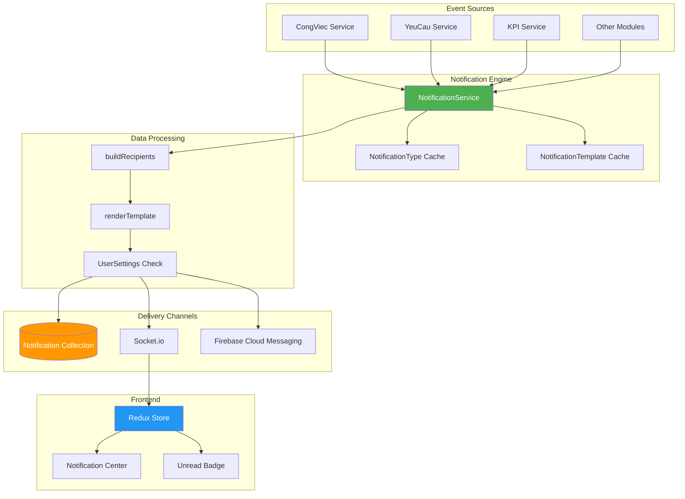
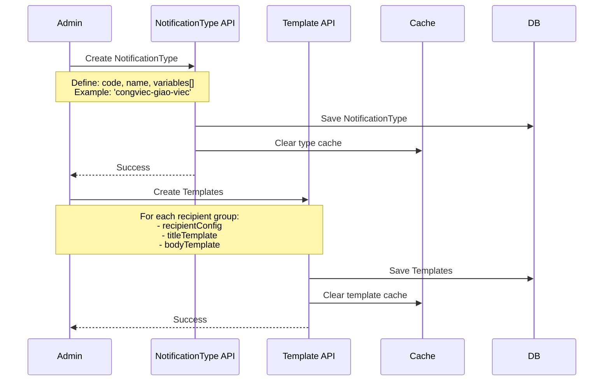
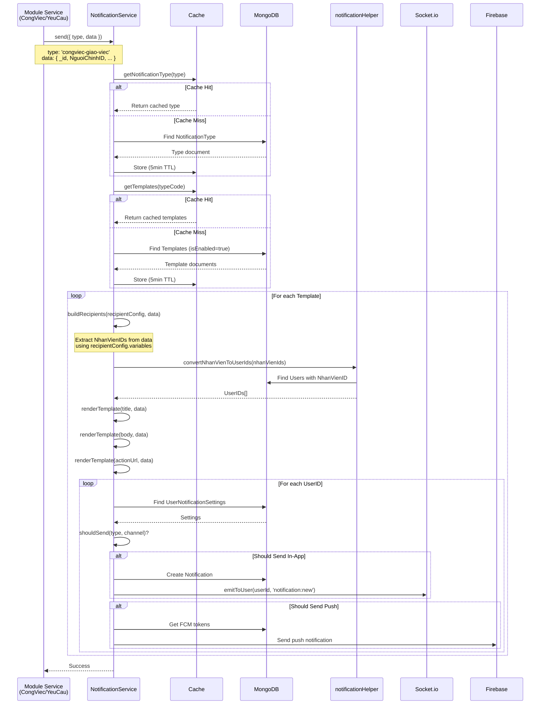
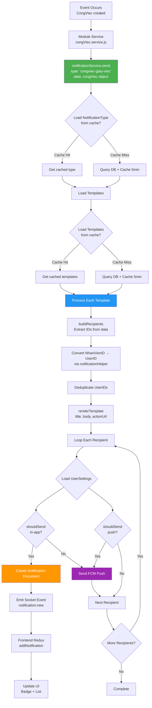
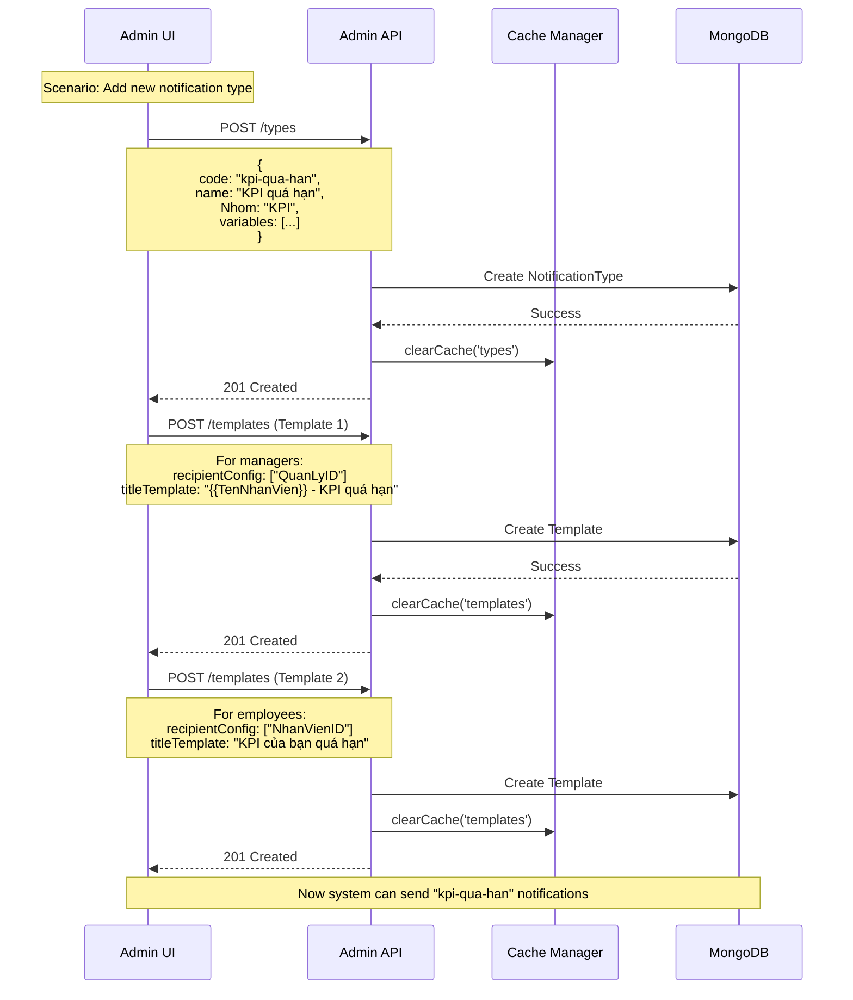

# 🔔 NOTIFICATION MODULE - MASTER PLAN

## 📋 Document Overview

**Mục đích**: Tài liệu toàn diện về hệ thống thông báo (Notification System) của Hospital Management System - một kiến trúc admin-configurable với template engine, multi-channel delivery, và user preference management.

**Phạm vi**:

- Backend: 4 core models (Notification, NotificationType, NotificationTemplate, UserNotificationSettings)
- Notification service với caching và template rendering
- Admin configuration API
- Frontend: Redux state management, real-time Socket.io integration, FCM push notifications
- User notification center UI và settings

**Khán giả mục tiêu**:

- Developers cần hiểu và maintain notification system
- Admins cần configure notification types và templates
- QA/Testers cần test notification flows
- Product owners cần customize notification behaviors

---

## 🎯 Module Objectives

### Business Goals

1. **Flexible Notification System**: Admin có thể configure notification types và templates mà không cần code changes
2. **Multi-Channel Delivery**: Hỗ trợ in-app notifications và push notifications (FCM)
3. **User Control**: Users có thể customize notification preferences (per-type, quiet hours)
4. **Real-time Updates**: Instant notification delivery via Socket.io
5. **Performance**: Caching strategy để giảm database queries

### Technical Goals

1. **Centralized Service**: Single notification service cho all modules (CongViec, YeuCau, KPI)
2. **Template Engine**: Flexible {{variable}} syntax với validation
3. **Recipient Resolution**: Automatic recipient extraction từ data
4. **Multi-Device Support**: Quản lý multiple FCM tokens per user
5. **Auto-Expiry**: Automatic cleanup notifications sau 30 ngày

---

## 🏗️ System Architecture

### High-Level Architecture



### Admin Configuration Flow



### Notification Delivery Flow



---

## 📦 Core Data Models

### 1. Notification (Main Document)

**Purpose**: Stores individual notification instances sent to users.

**Schema Overview**:

```typescript
interface Notification {
  _id: ObjectId;

  // Recipients & Type
  recipientId: ObjectId; // → User._id (NOT NhanVien._id!)
  templateId?: ObjectId; // → NotificationTemplate._id
  type: string; // Matches NotificationType.code

  // Content (rendered from template)
  title: string; // "CV001 - Sơn tường phòng khám"
  body: string; // "Bạn được giao công việc mới từ Nguyễn Văn A"
  icon?: string; // Material icon name: 'assignment', 'notification'
  priority: "low" | "normal" | "high" | "urgent";

  // State
  isRead: boolean;
  readAt?: Date;

  // Navigation & Metadata
  actionUrl?: string; // "/congviec/64f3cb6035c717ab00d75b8b"
  metadata?: any; // Original data for debugging

  // Delivery tracking
  deliveredVia: ("inapp" | "push")[];

  // Auto-cleanup
  expiresAt: Date; // Auto-delete after 30 days

  // Timestamps
  createdAt: Date;
  updatedAt: Date;
}
```

**Key Features**:

- ✅ Compound indexes: `{recipientId: 1, isRead: 1, createdAt: -1}` for fast queries
- ✅ TTL index on `expiresAt` for auto-deletion
- ✅ Tracks delivery channels (in-app, push, or both)
- ✅ Stores rendered content (không store template, store kết quả)

---

### 2. NotificationType (Configuration)

**Purpose**: Defines available notification types với variables cho template rendering.

**Schema Overview**:

```typescript
interface NotificationType {
  _id: ObjectId;

  // Identification
  code: string; // Unique: 'congviec-giao-viec', 'yeucau-tao-moi'
  name: string; // "Giao việc mới"
  description?: string;

  // Categorization
  Nhom: "Công việc" | "Yêu cầu" | "KPI" | "Hệ thống";

  // Available variables for templates
  variables: {
    name: string; // "NguoiChinhID"
    type: "String" | "Number" | "ObjectId" | "Date" | "Array" | "Object";
    itemType?: string; // For Array: "ObjectId"
    ref?: string; // For ObjectId: "NhanVien"
    isRecipientCandidate: boolean; // Can be used in recipientConfig?
    description?: string;
  }[];

  // State
  isActive: boolean;

  createdAt: Date;
  updatedAt: Date;
}
```

**Examples**:

```javascript
// CongViec notification type
{
  code: "congviec-giao-viec",
  name: "Giao việc mới",
  Nhom: "Công việc",
  variables: [
    {
      name: "NguoiChinhID",
      type: "ObjectId",
      ref: "NhanVien",
      isRecipientCandidate: true,
      description: "Người được giao việc chính"
    },
    {
      name: "MaCongViec",
      type: "String",
      isRecipientCandidate: false,
      description: "Mã công việc"
    },
    {
      name: "TieuDe",
      type: "String",
      isRecipientCandidate: false,
      description: "Tiêu đề công việc"
    },
    // ... 26 more variables
  ]
}
```

**Key Methods**:

- `getRecipientCandidates()`: Returns variables where `isRecipientCandidate = true`
- `validateData(data)`: Validates data against variable definitions

---

### 3. NotificationTemplate

**Purpose**: Defines how to render notifications cho specific notification type và recipient group.

**Schema Overview**:

```typescript
interface NotificationTemplate {
  _id: ObjectId;

  // Link to type
  typeCode: string; // → NotificationType.code
  name: string; // "Thông báo cho người được giao"

  // Recipient configuration
  recipientConfig: {
    variables: string[]; // ["NguoiChinhID", "NguoiThamGia"]
  };

  // Template content
  titleTemplate: string; // "{{MaCongViec}} - {{TieuDe}}"
  bodyTemplate: string; // "Bạn được giao công việc mới từ {{TenNguoiThucHien}}"
  actionUrl?: string; // "/congviec/{{_id}}"

  // Visual & Priority
  icon?: string; // "assignment"
  priority: "low" | "normal" | "high" | "urgent";

  // State
  isEnabled: boolean;

  createdAt: Date;
  updatedAt: Date;
}
```

**Examples**:

```javascript
// Template 1: For person assigned to task
{
  name: "Thông báo cho người được giao",
  typeCode: "congviec-giao-viec",
  recipientConfig: {
    variables: ["NguoiChinhID"]  // Only notify main assignee
  },
  titleTemplate: "{{MaCongViec}} - {{TieuDe}}",
  bodyTemplate: "Bạn được giao công việc mới từ {{TenNguoiThucHien}}",
  actionUrl: "/congviec/{{_id}}",
  icon: "assignment",
  priority: "normal",
  isEnabled: true
}

// Template 2: For participants
{
  name: "Thông báo cho người tham gia",
  typeCode: "congviec-giao-viec",
  recipientConfig: {
    variables: ["NguoiThamGia"]  // Array of participants
  },
  titleTemplate: "{{MaCongViec}} - {{TieuDe}}",
  bodyTemplate: "Bạn được thêm vào công việc từ {{TenNguoiThucHien}}",
  actionUrl: "/congviec/{{_id}}",
  icon: "group_add",
  priority: "normal",
  isEnabled: true
}
```

**Key Features**:

- ✅ Multiple templates per type (for different recipient groups)
- ✅ Template validation: checks variables exist in NotificationType
- ✅ Can enable/disable templates individually
- ✅ Simple {{variable}} syntax (no nested access, no logic)

**Key Methods**:

- `validateTemplate()`: Validates template syntax và variables
- `extractVariables()`: Extracts all {{variable}} from templates
- **Static**: `findByType(typeCode)`: Get all enabled templates for type

---

### 4. UserNotificationSettings

**Purpose**: User-specific notification preferences (global, per-type, quiet hours, FCM tokens).

**Schema Overview**:

```typescript
interface UserNotificationSettings {
  _id: ObjectId;
  userId: ObjectId; // → User._id (unique)

  // Global switches
  enableNotifications: boolean; // Master switch
  enablePush: boolean; // Enable push notifications

  // Quiet hours
  quietHours: {
    enabled: boolean;
    start: string; // "22:00" (HH:mm format)
    end: string; // "07:00"
  };

  // Per-type preferences
  typePreferences: Map<
    string,
    {
      inapp: boolean; // Show in-app notification?
      push: boolean; // Send push notification?
    }
  >;

  // FCM tokens (multi-device support)
  fcmTokens: {
    token: string;
    deviceName?: string; // "iPhone 13 Pro"
    createdAt: Date;
  }[];

  createdAt: Date;
  updatedAt: Date;
}
```

**Example**:

```javascript
{
  userId: "64f3cb6035c717ab00d75b8b",
  enableNotifications: true,
  enablePush: true,
  quietHours: {
    enabled: true,
    start: "22:00",
    end: "07:00"
  },
  typePreferences: {
    "congviec-giao-viec": { inapp: true, push: true },
    "congviec-hoan-thanh": { inapp: true, push: false },
    "yeucau-tao-moi": { inapp: true, push: true },
    "kpi-duyet": { inapp: false, push: false }  // Disabled completely
  },
  fcmTokens: [
    {
      token: "fK8j3nM...",
      deviceName: "iPhone 13 Pro",
      createdAt: "2024-01-15T08:30:00Z"
    },
    {
      token: "pL9x7qW...",
      deviceName: "Chrome on Windows",
      createdAt: "2024-01-20T10:15:00Z"
    }
  ]
}
```

**Key Features**:

- ✅ Hierarchical permission check: global → quiet hours → per-type
- ✅ Separate controls for in-app vs push
- ✅ Multiple device support (array of FCM tokens)
- ✅ Defaults: all enabled except specified otherwise

**Key Method**:

```javascript
shouldSend(typeCode, channel) {
  // Check 1: Global switches
  if (!this.enableNotifications) return false;
  if (channel === 'push' && !this.enablePush) return false;

  // Check 2: Quiet hours
  if (this.quietHours.enabled && isWithinQuietHours()) return false;

  // Check 3: Per-type preference
  const pref = this.typePreferences.get(typeCode);
  if (!pref) return true; // Default: allow
  return pref[channel];   // Check specific channel
}
```

---

## 🔄 Notification Flow

### Complete Flow Diagram



### Step-by-Step Breakdown

#### Step 1: Event Trigger

```javascript
// In congViec.service.js
const newCongViec = await CongViec.create({
  MaCongViec: "CV001",
  TieuDe: "Sơn tường phòng khám",
  NguoiChinhID: "66b1dba74f79822a4752d90d",
  NguoiGiaoViecID: currentUser.NhanVienID,
  // ...
});

// Trigger notification
await notificationService.send({
  type: "congviec-giao-viec",
  data: notificationDataBuilders.buildCongViecNotificationData(newCongViec),
});
```

#### Step 2: Load Type & Templates (with caching)

```javascript
// NotificationService.send()
const notificationType = await this.getNotificationType(type); // Cache: 5 min
const templates = await this.getTemplates(type); // Cache: 5 min
```

#### Step 3: Build Recipients

```javascript
// For template: recipientConfig.variables = ["NguoiChinhID"]
const recipients = this.buildRecipients(template.recipientConfig, data);
// Returns: ["66b1dba74f79822a4752d90d"] (NhanVien IDs)

// Convert to User IDs
const userIds = await notificationHelper.convertNhanVienToUserIds(recipients);
// Returns: ["64f3cb6035c717ab00d75b8b"] (User IDs)
```

#### Step 4: Render Template

```javascript
const title = this.renderTemplate(template.titleTemplate, data);
// "CV001 - Sơn tường phòng khám"

const body = this.renderTemplate(template.bodyTemplate, data);
// "Bạn được giao công việc mới từ Nguyễn Văn A"

const actionUrl = this.renderTemplate(template.actionUrl, data);
// "/congviec/64f3cb6035c717ab00d75b8b"
```

#### Step 5: Check User Settings & Send

```javascript
for (const userId of userIds) {
  const settings = await UserNotificationSettings.findOne({ userId });

  // Check in-app permission
  if (settings.shouldSend(type, "inapp")) {
    // Create notification document
    await Notification.create({
      recipientId: userId,
      type: type,
      title: title,
      body: body,
      actionUrl: actionUrl,
      priority: template.priority,
      deliveredVia: ["inapp"],
    });

    // Emit socket event
    socketService.emitToUser(userId, "notification:new", notificationData);
  }

  // Check push permission
  if (settings.shouldSend(type, "push")) {
    const tokens = settings.fcmTokens.map((t) => t.token);
    await this.sendPushNotification(tokens, {
      title,
      body,
      data: { actionUrl },
    });
  }
}
```

---

## 🎨 Admin Configuration

### Admin API Endpoints

**Base URL**: `/api/workmanagement/notifications`

#### NotificationType Management

```
GET    /types                      # List all types (filter by isActive)
GET    /types/code/:code           # Get by code (e.g., 'congviec-giao-viec')
GET    /types/:id                  # Get by ID
POST   /types                      # Create new type
PUT    /types/:id                  # Update type
DELETE /types/:id                  # Soft delete (set isActive=false)
```

#### NotificationTemplate Management

```
GET    /templates                  # List all templates (filter by typeCode, isEnabled)
GET    /templates/:id              # Get by ID
POST   /templates                  # Create new template
PUT    /templates/:id              # Update template
DELETE /templates/:id              # Soft delete (set isEnabled=false)
```

### Admin Configuration Flow



### Configuration Best Practices

1. **Naming Convention**:

   ```
   NotificationType.code: "{module}-{action}"
   Examples:
   - congviec-giao-viec
   - congviec-hoan-thanh
   - yeucau-tao-moi
   - yeucau-duyet
   - kpi-duyet
   ```

2. **Variable Definition**:

   - Always include `_id` for actionUrl
   - Mark recipient fields with `isRecipientCandidate: true`
   - Include display fields (Tên, Mã, TieuDe) for template rendering
   - Use consistent naming with data builders

3. **Template Strategy**:

   - Create separate templates for each recipient group
   - Use descriptive names: "Thông báo cho người được giao", "Thông báo cho quản lý"
   - Keep templates simple (no complex logic)
   - Test with sample data before enabling

4. **Cache Management**:
   - Cache automatically cleared on create/update/delete
   - Manual clear: call `notificationService.clearCache()`
   - Cache TTL: 5 minutes (configurable)

---

## 🚀 Integration Guide

### How to Add Notifications to Your Module

#### Step 1: Define NotificationType

```javascript
// In seeds/notificationTypes.seed.js
{
  code: "mymodule-my-action",
  name: "My Action Description",
  Nhom: "Hệ thống",  // or "Công việc", "Yêu cầu", "KPI"
  variables: [
    // Recipient candidates
    {
      name: "AssigneeID",
      type: "ObjectId",
      ref: "NhanVien",
      isRecipientCandidate: true,
      description: "Person assigned"
    },
    // Display variables
    {
      name: "Title",
      type: "String",
      isRecipientCandidate: false,
      description: "Action title"
    },
    {
      name: "_id",
      type: "ObjectId",
      isRecipientCandidate: false,
      description: "Document ID for actionUrl"
    }
  ]
}
```

#### Step 2: Create Templates

```javascript
// In seeds/notificationTemplates.seed.js
{
  name: "Notify assignee",
  typeCode: "mymodule-my-action",
  recipientConfig: { variables: ["AssigneeID"] },
  titleTemplate: "{{Title}}",
  bodyTemplate: "You have a new task",
  actionUrl: "/mymodule/{{_id}}",
  icon: "notification",
  priority: "normal",
  isEnabled: true
}
```

#### Step 3: Create Data Builder

```javascript
// In notificationDataBuilders.js
function buildMyModuleNotificationData(document) {
  return {
    _id: document._id.toString(),
    AssigneeID: document.AssigneeID.toString(),
    Title: document.Title,
    // Flatten all nested fields
    // NO nested objects allowed
  };
}
```

#### Step 4: Trigger Notification

```javascript
// In myModule.service.js
const notificationService = require("./notificationService");
const { buildMyModuleNotificationData } = require("./notificationDataBuilders");

// After creating/updating document
await notificationService.send({
  type: "mymodule-my-action",
  data: buildMyModuleNotificationData(myDocument),
});
```

### Integration Checklist

- [ ] NotificationType seeded với correct variables
- [ ] Templates created cho all recipient groups
- [ ] Data builder flattens all data (no nested objects)
- [ ] Data builder includes all variables used in templates
- [ ] Notification triggered after successful operation (không trigger nếu error)
- [ ] Test with real user accounts (check in-app + push)
- [ ] Verify recipient resolution works correctly
- [ ] Check UserNotificationSettings permissions respected

---

## 📱 Frontend Integration

### Redux State Structure

```typescript
// notificationSlice.js
interface NotificationState {
  // Data
  notifications: Notification[];
  unreadCount: number;
  pagination: {
    page: number;
    limit: number;
    total: number;
    totalPages: number;
  };

  // Settings
  settings: UserNotificationSettings | null;
  availableTypes: NotificationType[]; // For settings UI

  // UI State
  isLoading: boolean;
  error: string | null;
}
```

### Socket.io Integration

```javascript
// In Redux middleware or useEffect
const socket = io(BACKEND_URL);

socket.on("connect", () => {
  socket.emit("join", { userId: currentUser._id });
});

socket.on("notification:new", (notification) => {
  dispatch(addNotification(notification));
  // Auto-refresh unread count
  dispatch(getUnreadCount());
  // Play sound?
  // Show toast?
});
```

### Usage in Components

```javascript
// NotificationCenter.js
import { useDispatch, useSelector } from "react-redux";
import {
  getNotifications,
  markAsRead,
  markAllAsRead,
} from "features/notification/notificationSlice";

function NotificationCenter() {
  const dispatch = useDispatch();
  const { notifications, unreadCount, isLoading } = useSelector(
    (state) => state.notification
  );

  useEffect(() => {
    dispatch(getNotifications({ page: 1, limit: 20 }));
  }, [dispatch]);

  const handleRead = (id) => {
    dispatch(markAsRead(id));
  };

  const handleReadAll = () => {
    dispatch(markAllAsRead());
  };

  return (
    <List>
      {notifications.map((notif) => (
        <NotificationItem
          key={notif._id}
          notification={notif}
          onRead={() => handleRead(notif._id)}
        />
      ))}
    </List>
  );
}
```

---

## 📊 Performance Considerations

### Caching Strategy

```javascript
class NotificationService {
  constructor() {
    this.typeCache = new Map(); // type code → NotificationType
    this.templateCache = new Map(); // type code → Template[]
    this.CACHE_TTL = 5 * 60 * 1000; // 5 minutes
  }

  async getNotificationType(code) {
    const cached = this.typeCache.get(code);
    if (cached && Date.now() - cached.timestamp < this.CACHE_TTL) {
      return cached.data;
    }

    const type = await NotificationType.findOne({ code, isActive: true });
    this.typeCache.set(code, { data: type, timestamp: Date.now() });
    return type;
  }

  clearCache() {
    this.typeCache.clear();
    this.templateCache.clear();
  }
}
```

**Benefits**:

- ✅ Reduces DB queries by ~90% for frequently sent notifications
- ✅ 5-minute TTL balances freshness vs performance
- ✅ Auto-clear on admin updates ensures consistency

### Database Indexes

```javascript
// Notification indexes
notificationSchema.index({ recipientId: 1, isRead: 1, createdAt: -1 });
notificationSchema.index({ recipientId: 1, createdAt: -1 });
notificationSchema.index({ expiresAt: 1 }, { expireAfterSeconds: 0 }); // TTL index

// NotificationType indexes
notificationTypeSchema.index({ code: 1 }, { unique: true });

// NotificationTemplate indexes
notificationTemplateSchema.index({ typeCode: 1, isEnabled: 1 });

// UserNotificationSettings indexes
userNotificationSettingsSchema.index({ userId: 1 }, { unique: true });
```

### Query Optimization

```javascript
// ✅ GOOD: Use pagination and indexes
const notifications = await Notification.find({
  recipientId: userId,
  isRead: false,
})
  .sort({ createdAt: -1 })
  .limit(20)
  .lean(); // Faster if no Mongoose methods needed

// ❌ BAD: Loading all notifications
const notifications = await Notification.find({ recipientId: userId });
```

### Batch Operations

```javascript
// Mark all as read (efficient)
await Notification.updateMany(
  { recipientId: userId, isRead: false },
  { $set: { isRead: true, readAt: new Date() } }
);
```

---

## 🧪 Testing Guide

### Unit Tests

```javascript
// Test recipient resolution
describe("NotificationService.buildRecipients", () => {
  it("should extract single recipient", () => {
    const recipientConfig = { variables: ["NguoiChinhID"] };
    const data = { NguoiChinhID: "123" };
    const result = service.buildRecipients(recipientConfig, data);
    expect(result).toEqual(["123"]);
  });

  it("should extract array recipients", () => {
    const recipientConfig = { variables: ["NguoiThamGia"] };
    const data = { NguoiThamGia: ["123", "456"] };
    const result = service.buildRecipients(recipientConfig, data);
    expect(result).toEqual(["123", "456"]);
  });

  it("should deduplicate recipients", () => {
    const recipientConfig = { variables: ["NguoiChinhID", "NguoiThamGia"] };
    const data = { NguoiChinhID: "123", NguoiThamGia: ["123", "456"] };
    const result = service.buildRecipients(recipientConfig, data);
    expect(result).toEqual(["123", "456"]); // No duplicate '123'
  });
});

// Test template rendering
describe("NotificationService.renderTemplate", () => {
  it("should replace single variable", () => {
    const result = service.renderTemplate("Hello {{Name}}", { Name: "John" });
    expect(result).toBe("Hello John");
  });

  it("should handle missing variable", () => {
    const result = service.renderTemplate("Hello {{Name}}", {});
    expect(result).toBe("Hello {{Name}}"); // Keep original
  });
});

// Test shouldSend logic
describe("UserNotificationSettings.shouldSend", () => {
  it("should respect global switch", () => {
    const settings = new UserNotificationSettings({
      enableNotifications: false,
    });
    expect(settings.shouldSend("any-type", "inapp")).toBe(false);
  });

  it("should respect quiet hours", () => {
    const settings = new UserNotificationSettings({
      enableNotifications: true,
      quietHours: { enabled: true, start: "22:00", end: "07:00" },
    });
    // Test during quiet hours (e.g., 23:00)
    // Mock Date.now() to return time within quiet hours
    expect(settings.shouldSend("any-type", "inapp")).toBe(false);
  });

  it("should respect per-type preference", () => {
    const settings = new UserNotificationSettings({
      enableNotifications: true,
      typePreferences: new Map([
        ["congviec-giao-viec", { inapp: true, push: false }],
      ]),
    });
    expect(settings.shouldSend("congviec-giao-viec", "inapp")).toBe(true);
    expect(settings.shouldSend("congviec-giao-viec", "push")).toBe(false);
  });
});
```

### Integration Tests

```javascript
describe("Notification End-to-End", () => {
  beforeEach(async () => {
    // Seed types and templates
    await seedNotificationTypes();
    await seedNotificationTemplates();
  });

  it("should send notification on CongViec creation", async () => {
    // Create test users
    const nguoiGiao = await createTestUser({ role: "manager" });
    const nguoiNhan = await createTestUser({ role: "user" });

    // Create CongViec
    const congViec = await CongViec.create({
      MaCongViec: "CV-TEST-001",
      TieuDe: "Test Task",
      NguoiChinhID: nguoiNhan.NhanVienID,
      NguoiGiaoViecID: nguoiGiao.NhanVienID,
    });

    // Trigger notification
    await notificationService.send({
      type: "congviec-giao-viec",
      data: buildCongViecNotificationData(congViec),
    });

    // Verify notification created
    const notifications = await Notification.find({
      recipientId: nguoiNhan._id,
    });
    expect(notifications).toHaveLength(1);
    expect(notifications[0].title).toContain("CV-TEST-001");
    expect(notifications[0].type).toBe("congviec-giao-viec");
  });
});
```

### Manual Testing Checklist

**Admin Configuration**:

- [ ] Create new NotificationType via API
- [ ] Create multiple templates for same type
- [ ] Update template content
- [ ] Disable/enable template
- [ ] Verify cache clears on updates

**Notification Delivery**:

- [ ] Trigger notification from CongViec module
- [ ] Verify correct recipients receive notification
- [ ] Check notification appears in UI immediately (Socket.io)
- [ ] Verify unread badge updates
- [ ] Test with multiple recipients (array field)

**User Settings**:

- [ ] Disable global notifications → no notifications received
- [ ] Enable quiet hours → no notifications during period
- [ ] Disable specific type → no notifications for that type
- [ ] Register FCM token → push notifications work
- [ ] Multiple devices → all devices receive push

**Edge Cases**:

- [ ] Missing template variable → renders as {{Variable}}
- [ ] Invalid recipient ID → skips gracefully
- [ ] User not found → skips gracefully
- [ ] Empty recipient array → no notifications sent
- [ ] Disabled template → not used

---

## 📚 File Structure Roadmap

### Complete Documentation Set (8 Files)

#### **File 1: MASTER_PLAN.md** (This File) ⭐

**Priority**: CRITICAL - Read First  
**Purpose**: Overview, architecture, data models, admin configuration  
**Audience**: All stakeholders  
**Size**: ~600 lines

#### **File 2: 00_OVERVIEW.md**

**Priority**: HIGH - Read Second  
**Purpose**: Detailed architecture diagrams, complete model definitions, notification flow examples  
**Content**:

- System architecture deep-dive with sequence diagrams
- Complete TypeScript interfaces for all 4 models
- Notification flow examples for each module (CongViec, YeuCau, KPI)
- Cache strategy implementation details
- Performance benchmarks

**Audience**: Developers implementing or maintaining notification system  
**Size**: ~900 lines

#### **File 3: 01_SETTINGS_PREFERENCES.md**

**Priority**: MEDIUM  
**Purpose**: UserNotificationSettings model deep-dive, permission logic  
**Content**:

- UserNotificationSettings schema in detail
- shouldSend() decision tree with examples
- Quiet hours implementation
- FCM token management (registration, removal, multi-device)
- Frontend settings UI components
- API endpoints for settings management

**Audience**: Frontend developers building settings UI, Backend developers maintaining permission logic  
**Size**: ~800 lines

#### **File 4: 02_NOTIFICATION_SERVICE.md**

**Priority**: HIGH  
**Purpose**: NotificationService implementation guide  
**Content**:

- NotificationService class breakdown
- send() method step-by-step
- buildRecipients() algorithm with edge cases
- renderTemplate() implementation
- convertNhanVienToUserIds() helper
- Cache management (get, set, clear, TTL)
- Error handling strategies
- Integration with socketService

**Audience**: Backend developers, Module integrators  
**Size**: ~1,000 lines

#### **File 5: 03_PUSH_NOTIFICATIONS.md**

**Priority**: MEDIUM  
**Purpose**: Firebase Cloud Messaging (FCM) integration  
**Content**:

- FCM setup (Firebase Console, service account)
- Device token registration flow
- Push notification payload structure
- Background vs foreground handling
- Permission requests (browser, mobile)
- Testing push notifications (tools, debugging)
- Troubleshooting common issues

**Audience**: DevOps, Frontend developers  
**Size**: ~700 lines

#### **File 6: 04_FRONTEND_INTEGRATION.md**

**Priority**: HIGH  
**Purpose**: React/Redux integration guide  
**Content**:

- notificationSlice.js complete breakdown
- Socket.io setup and event handling
- Thunks: getNotifications, markAsRead, markAllAsRead, getUnreadCount
- Real-time updates with addNotification action
- Polling fallback for offline scenarios
- Badge count updates
- Optimistic UI updates

**Audience**: Frontend developers  
**Size**: ~900 lines

#### **File 7: 05_UI_COMPONENTS.md**

**Priority**: MEDIUM  
**Purpose**: Notification UI components guide  
**Content**:

- NotificationCenter drawer/popover component
- NotificationItem component with read/unread states
- Badge component with animations
- NotificationSettingsDialog component
- Filtering and pagination
- Infinite scroll implementation
- Empty states and loading states
- Mark as read interactions
- Action URL navigation

**Audience**: Frontend/UI developers  
**Size**: ~850 lines

#### **File 8: 06_API_REFERENCE.md**

**Priority**: MEDIUM - Reference Material  
**Purpose**: Complete API documentation  
**Content**:

- User-facing API endpoints (~10 endpoints)
  - GET /notifications (with pagination, filters)
  - GET /notifications/unread-count
  - PUT /notifications/:id/read
  - PUT /notifications/read-all
  - DELETE /notifications/:id
  - GET /notifications/settings
  - PUT /notifications/settings
  - POST /notifications/settings/fcm-token
  - DELETE /notifications/settings/fcm-token
- Admin API endpoints (~12 endpoints)
  - NotificationType CRUD
  - NotificationTemplate CRUD
- Request/response schemas
- Error codes and messages
- Authentication requirements
- Rate limiting (if any)

**Audience**: API consumers, Frontend developers, Testers  
**Size**: ~1,100 lines

---

## 🎓 Reading Paths

### For New Developers

1. **MASTER_PLAN.md** (this file) - Get overview
2. **00_OVERVIEW.md** - Understand architecture
3. **02_NOTIFICATION_SERVICE.md** - Learn core service
4. **04_FRONTEND_INTEGRATION.md** - Understand frontend flow

### For Module Integrators (Adding Notifications to Your Module)

1. **MASTER_PLAN.md** → Section "Integration Guide"
2. **02_NOTIFICATION_SERVICE.md** → Section "How to Trigger Notifications"
3. **00_OVERVIEW.md** → Section "Data Builders"
4. **06_API_REFERENCE.md** → Reference only

### For Frontend Developers

1. **MASTER_PLAN.md** → Section "Frontend Integration"
2. **04_FRONTEND_INTEGRATION.md** → Complete Redux guide
3. **05_UI_COMPONENTS.md** → UI component implementations
4. **01_SETTINGS_PREFERENCES.md** → Build settings UI
5. **03_PUSH_NOTIFICATIONS.md** → If implementing push

### For Admins (Configuring Notifications)

1. **MASTER_PLAN.md** → Section "Admin Configuration"
2. **00_OVERVIEW.md** → Section "NotificationType & Template Examples"
3. **06_API_REFERENCE.md** → Admin API endpoints

### For QA/Testers

1. **MASTER_PLAN.md** → Section "Testing Guide"
2. **00_OVERVIEW.md** → Understand expected behaviors
3. **06_API_REFERENCE.md** → API testing reference
4. **01_SETTINGS_PREFERENCES.md** → Test user settings

---

## 🔍 Key Concepts Summary

### Admin-Configurable Architecture

- **NO hardcoded notifications** - all managed via database
- Admins can create new types and templates without code changes
- Templates can be enabled/disabled individually
- Cache automatically cleared on admin updates

### Template System

- Simple **{{variable}}** syntax (regex-based)
- No nested access (data must be flattened)
- No logic in templates (no if/else, no loops)
- Multiple templates per type (for different recipient groups)

### Recipient Resolution

- Extract IDs from data using `recipientConfig.variables`
- Support String, ObjectId, Array types
- Convert **NhanVienID → UserID** (critical!)
- Deduplicate recipients

### Multi-Channel Delivery

- **In-app**: Create document + emit Socket.io event
- **Push**: Send FCM push notification
- User controls each channel separately
- Hierarchical permission: global → quiet hours → per-type

### User Control

- Global switches: enable/disable all notifications or push
- Quiet hours: suppress notifications during specific time range
- Per-type preferences: customize each notification type
- Multi-device: support multiple FCM tokens

### Performance

- **5-minute cache** for types and templates
- Compound indexes for fast queries
- **30-day TTL** auto-deletes old notifications
- Batch operations for mark all as read

---

## 🐛 Common Pitfalls

### ❌ Using User.\_id instead of NhanVien.\_id

```javascript
// ❌ WRONG
recipientConfig: {
  variables: ["userId"];
}

// ✅ CORRECT
recipientConfig: {
  variables: ["NguoiChinhID"];
} // NhanVien._id field
```

### ❌ Nested Objects in Data

```javascript
// ❌ WRONG - renderTemplate cannot access nested fields
data: {
  nguoiChinh: {
    HoTen: "Nguyễn Văn A";
  } // Nested!
}
// Template: "{{nguoiChinh.HoTen}}" → WON'T WORK

// ✅ CORRECT - Flatten all data
data: {
  TenNguoiChinh: "Nguyễn Văn A"; // Flat
}
// Template: "{{TenNguoiChinh}}" → WORKS
```

### ❌ Missing Variables in NotificationType

```javascript
// NotificationType.variables does not include "TenKhoa"
// Template uses: "{{TenKhoa}}"
// Result: Validation error when creating template
```

### ❌ Forgetting to Convert NhanVienID → UserID

```javascript
// ❌ WRONG - Notification.recipientId expects User._id
await Notification.create({
  recipientId: congViec.NguoiChinhID, // This is NhanVien._id!
});

// ✅ CORRECT - Use helper
const userIds = await notificationHelper.convertNhanVienToUserIds([
  congViec.NguoiChinhID,
]);
await Notification.create({
  recipientId: userIds[0], // This is User._id
});
```

### ❌ Not Clearing Cache After Admin Updates

```javascript
// After updating NotificationType or Template
await notificationService.clearCache(); // MUST DO THIS
```

---

## 📌 Quick Reference

### Send Notification (From Any Module)

```javascript
await notificationService.send({
  type: "your-notification-type-code",
  data: yourDataBuilderFunction(document),
});
```

### Check User Settings

```javascript
const settings = await UserNotificationSettings.findOne({ userId });
const canSend = settings.shouldSend(typeCode, "inapp"); // or 'push'
```

### Clear Cache

```javascript
notificationService.clearCache();
```

### Query User Notifications

```javascript
const notifications = await Notification.find({
  recipientId: userId,
  isRead: false,
})
  .sort({ createdAt: -1 })
  .limit(20);
```

### Frontend: Listen for Real-time Updates

```javascript
socket.on("notification:new", (notification) => {
  dispatch(addNotification(notification));
});
```

---

## 🎯 Next Steps

After reading this master plan:

1. **Developers**: Read [00_OVERVIEW.md](./00_OVERVIEW.md) for detailed architecture
2. **Integrators**: Jump to "Integration Guide" section above
3. **Frontend**: Read [04_FRONTEND_INTEGRATION.md](./04_FRONTEND_INTEGRATION.md)
4. **Admins**: Review "Admin Configuration" section and API reference

---

## 📝 Document Metadata

- **Version**: 1.0.0
- **Last Updated**: 2024-01-20
- **Author**: Development Team
- **Review Status**: ✅ Complete
- **Related Modules**: CongViec, YeuCau, KPI, All future modules

---

## 🔗 Related Documentation

- [CongViec Module Docs](../CONGVIEC/)
- [YeuCau (Ticket) Module Docs](../YEUCAU/)
- [KPI Module Docs](../KPI/)
- [Socket.io Integration Guide](../../technical/SOCKET_IO.md)
- [Firebase FCM Setup Guide](../../deployment/FCM_SETUP.md)

---

**END OF MASTER PLAN**

For detailed implementation guides, proceed to individual documentation files listed in the "File Structure Roadmap" section above.
