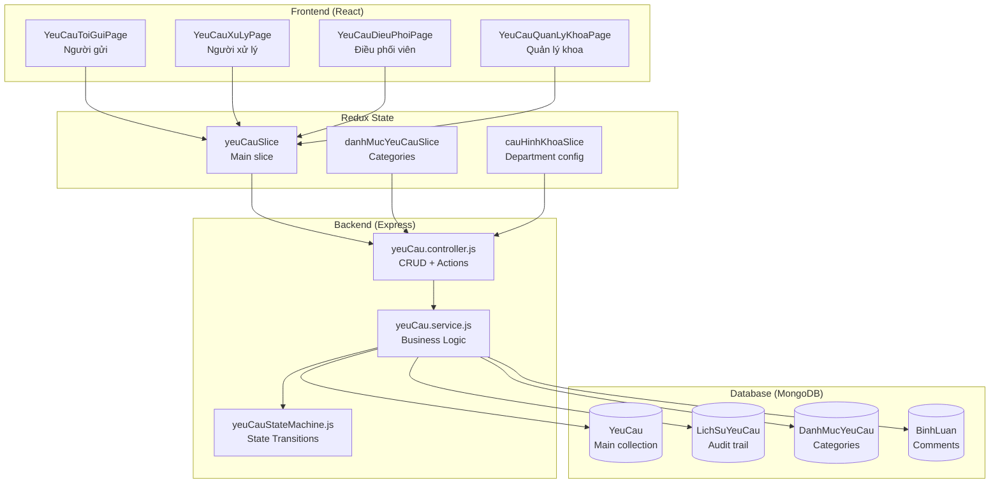
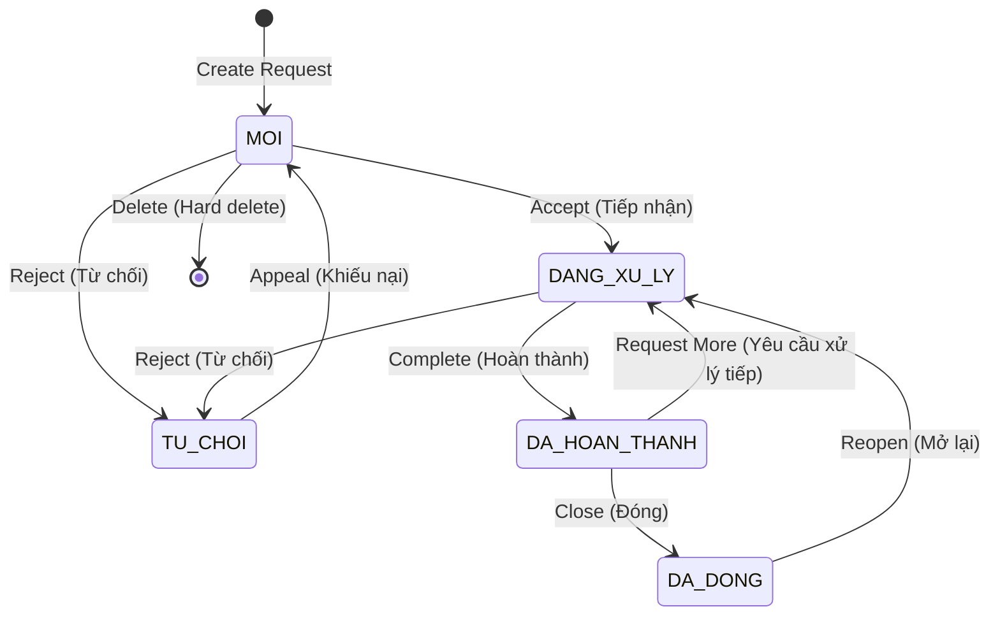
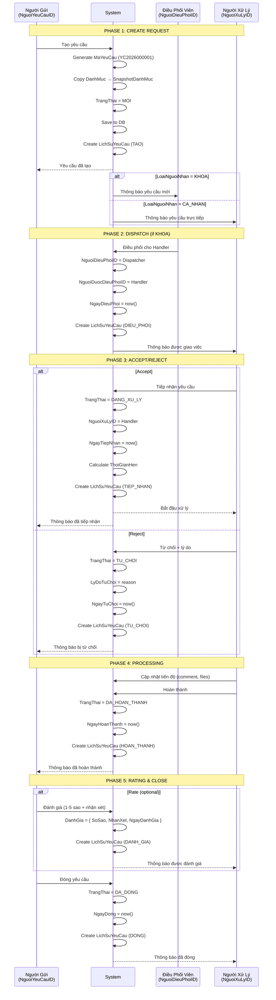

# 📋 00 - TICKET SYSTEM OVERVIEW

> **Module**: QuanLyCongViec/Ticket (Support Request System)  
> **Version**: 1.0.0  
> **Last Updated**: January 6, 2026

---

## 📖 MỤC LỤC

1. [System Overview](#1-system-overview)
2. [Data Models](#2-data-models)
3. [Core Concepts](#3-core-concepts)
4. [Request Flow](#4-request-flow)
5. [Role-Based Access](#5-role-based-access)
6. [Architecture](#6-architecture)
7. [Key Features](#7-key-features)

---

## 1. SYSTEM OVERVIEW

### 1.1. What is Ticket System?

**Ticket System (Hệ Thống Yêu Cầu)** là module quản lý các yêu cầu hỗ trợ giữa các khoa trong bệnh viện.

**Use Cases:**

- 🏥 **Liên khoa**: Khoa A cần hỗ trợ từ Khoa B (vật tư, nhân lực, thiết bị)
- 🔧 **Bảo trì**: Yêu cầu sửa chữa máy móc, thiết bị y tế
- 📄 **Hành chính**: Yêu cầu hồ sơ, giấy tờ, xác nhận
- 💼 **Dịch vụ**: Yêu cầu vệ sinh, vận chuyển, cung cấp

**Key Statistics:**

- **4 role-based views** với giao diện riêng biệt
- **17 tabs tổng cộng** cho các workflows khác nhau
- **5-state workflow** với validation nghiêm ngặt
- **7 core data models** hoạt động đồng bộ

### 1.2. Problem Solved

**Trước khi có hệ thống:**

- ❌ Yêu cầu liên khoa qua điện thoại, email → dễ thất lạc
- ❌ Không theo dõi được tiến độ xử lý
- ❌ Không có số liệu thống kê, đánh giá hiệu quả
- ❌ Khó xác định trách nhiệm khi có sự cố

**Sau khi có hệ thống:**

- ✅ Mọi yêu cầu được ghi nhận, theo dõi trên hệ thống
- ✅ Workflow rõ ràng: Tạo → Điều phối → Xử lý → Đánh giá → Đóng
- ✅ Thống kê KPI: Tỷ lệ đúng hạn, điểm đánh giá, thời gian xử lý
- ✅ Audit trail đầy đủ (LichSuYeuCau) cho mọi hành động

### 1.3. System Architecture Overview



---

## 2. DATA MODELS

### 2.1. YeuCau (Main Request Model)

**File:** `giaobanbv-be/modules/workmanagement/models/YeuCau.js` (550 lines)

**Purpose:** Core request document chứa tất cả thông tin về một yêu cầu

**Key Fields:**

```typescript
interface YeuCau {
  // ========== MÃ YÊU CẦU ==========
  _id: ObjectId;
  MaYeuCau: string; // Auto-generated: YC2025000001

  // ========== NGƯỜI GỬI ==========
  NguoiYeuCauID: ObjectId; // Ref: NhanVien
  KhoaNguonID: ObjectId; // Ref: Khoa (auto from NguoiYeuCau)

  // ========== NGƯỜI NHẬN ==========
  KhoaDichID: ObjectId; // Ref: Khoa
  LoaiNguoiNhan: "KHOA" | "CA_NHAN";
  NguoiNhanID?: ObjectId; // Ref: NhanVien (if CA_NHAN)

  // ========== DANH MỤC ==========
  DanhMucYeuCauID: ObjectId; // Ref: DanhMucYeuCau
  SnapshotDanhMuc: {
    // Snapshot tại thời điểm tạo
    TenLoaiYeuCau: string;
    ThoiGianDuKien: number;
    DonViThoiGian: "PHUT" | "GIO" | "NGAY";
  };

  // ========== NỘI DUNG ==========
  TieuDe: string; // Max 200 chars
  MoTa?: string; // Max 2000 chars

  // ========== ĐIỀU PHỐI ==========
  NguoiDieuPhoiID?: ObjectId; // Người giao việc
  NguoiDuocDieuPhoiID?: ObjectId; // Người được giao (chờ tiếp nhận)
  NgayDieuPhoi?: Date;

  // ========== NGƯỜI XỬ LÝ ==========
  NguoiXuLyID?: ObjectId; // Người thực tế xử lý
  NgayTiepNhan?: Date;
  NgayHoanThanh?: Date;
  NgayDong?: Date;

  // ========== THỜI GIAN HẸN ==========
  ThoiGianHen?: Date; // Auto-calculated từ SnapshotDanhMuc

  // ========== TỪ CHỐI ==========
  LyDoTuChoi?: string;
  NgayTuChoi?: Date;

  // ========== TRẠNG THÁI ==========
  TrangThai: "MOI" | "DANG_XU_LY" | "DA_HOAN_THANH" | "DA_DONG" | "TU_CHOI";

  // ========== ĐÁNH GIÁ ==========
  DanhGia?: {
    SoSao: number; // 1-5
    NhanXet?: string; // Bắt buộc nếu < 3 sao
    NgayDanhGia: Date;
  };

  // ========== METADATA ==========
  createdAt: Date;
  updatedAt: Date;
  isDeleted: boolean;
}
```

**Virtual Fields:**

```javascript
// Auto-calculated fields
QuaHan: boolean; // true nếu hiện tại > ThoiGianHen
SoNgayConLai: number; // Số ngày còn lại đến hạn (âm nếu quá hạn)
CoTheMoLai: boolean; // true nếu DA_DONG và chưa quá 7 ngày
```

**Methods:**

```javascript
yeuCau.laNguoiGui(nhanVienId); // Check người gửi
yeuCau.laNguoiNhan(nhanVienId); // Check người nhận
yeuCau.laNguoiDuocDieuPhoi(nhanVienId); // Check được điều phối
yeuCau.laNguoiXuLy(nhanVienId); // Check người xử lý
yeuCau.nguoiDungLienQuan(nhanVienId); // Check bất kỳ role nào
yeuCau.tinhThoiGianHen(tuNgay); // Tính deadline
```

### 2.2. YeuCauCounter (Auto-generate MaYeuCau)

**File:** `giaobanbv-be/modules/workmanagement/models/YeuCauCounter.js`

**Purpose:** Tạo mã yêu cầu tự động tăng theo năm

**Schema:**

```typescript
interface YeuCauCounter {
  _id: ObjectId;
  year: number; // 2025, 2026, ...
  counter: number; // 1, 2, 3, ...
}
```

**Format:** `YC{YYYY}{NNNNNN}`

**Examples:**

- YC2025000001
- YC2025000002
- YC2026000001 (reset khi sang năm mới)

### 2.3. DanhMucYeuCau (Request Categories)

**File:** `giaobanbv-be/modules/workmanagement/models/DanhMucYeuCau.js`

**Purpose:** Danh mục loại yêu cầu theo từng khoa

**Schema:**

```typescript
interface DanhMucYeuCau {
  _id: ObjectId;
  KhoaID: ObjectId; // Ref: Khoa
  TenLoaiYeuCau: string; // "Sửa máy X-Quang"
  MoTa?: string;
  ThoiGianDuKien: number; // 2, 4, 24
  DonViThoiGian: "PHUT" | "GIO" | "NGAY"; // GIO, NGAY, PHUT
  TrangThai: "HOAT_DONG" | "NGUNG_HOAT_DONG";
  ThuTu?: number; // Sort order
  isDeleted: boolean;
}
```

**Example:**

```json
{
  "KhoaID": "66c111...",
  "TenLoaiYeuCau": "Yêu cầu sửa máy móc",
  "ThoiGianDuKien": 2,
  "DonViThoiGian": "GIO",
  "TrangThai": "HOAT_DONG"
}
```

→ Khi tạo yêu cầu loại này: **ThoiGianHen = NgayTiepNhan + 2 giờ**

### 2.4. LichSuYeuCau (History/Audit Trail)

**File:** `giaobanbv-be/modules/workmanagement/models/LichSuYeuCau.js`

**Purpose:** Ghi lại mọi thay đổi của yêu cầu

**Schema:**

```typescript
interface LichSuYeuCau {
  _id: ObjectId;
  YeuCauID: ObjectId; // Ref: YeuCau
  HanhDong: string; // Enum 30+ actions
  NguoiThucHienID: ObjectId; // Ref: NhanVien
  TuGiaTri: any; // Old value
  DenGiaTri: any; // New value
  GhiChu?: string;
  ThoiGian: Date; // Default: now()
}
```

**Common Actions:**

```javascript
const HANH_DONG = {
  TAO: "TAO", // Tạo yêu cầu
  CHINH_SUA: "CHINH_SUA", // Sửa yêu cầu
  DIEU_PHOI: "DIEU_PHOI", // Điều phối cho người khác
  TIEP_NHAN: "TIEP_NHAN", // Tiếp nhận xử lý
  TU_CHOI: "TU_CHOI", // Từ chối
  HUY_TIEP_NHAN: "HUY_TIEP_NHAN", // Hủy tiếp nhận
  HOAN_THANH: "HOAN_THANH", // Hoàn thành
  DANH_GIA: "DANH_GIA", // Đánh giá sao
  DONG: "DONG", // Đóng yêu cầu
  MO_LAI: "MO_LAI", // Mở lại
  XOA: "XOA", // Xóa (soft delete)
  DOI_THOI_GIAN_HEN: "DOI_THOI_GIAN_HEN",
  NHAC_LAI: "NHAC_LAI",
  BAO_QUAN_LY: "BAO_QUAN_LY",
  APPEAL: "APPEAL", // Khiếu nại
  // ... 30+ actions total
};
```

**Example History Entry:**

```json
{
  "YeuCauID": "67890abc...",
  "HanhDong": "DIEU_PHOI",
  "NguoiThucHienID": "66b1dba7...",
  "TuGiaTri": { "NguoiDuocDieuPhoiID": null },
  "DenGiaTri": { "NguoiDuocDieuPhoiID": "66b2222..." },
  "GhiChu": "Giao cho Nguyễn Văn A xử lý",
  "ThoiGian": "2026-01-06T10:30:00.000Z"
}
```

### 2.5. BinhLuan (Comments)

**File:** `giaobanbv-be/modules/workmanagement/models/BinhLuan.js`

**Purpose:** Bình luận thảo luận trong yêu cầu

**Schema:**

```typescript
interface BinhLuan {
  _id: ObjectId;
  YeuCauID: ObjectId; // Ref: YeuCau
  NguoiBinhLuanID: ObjectId; // Ref: NhanVien
  NoiDung: string; // Max 1000 chars
  ParentID?: ObjectId; // Ref: BinhLuan (for threading)
  isDeleted: boolean;
  createdAt: Date;
  updatedAt: Date;
}
```

**Threading Pattern:**

```
Comment 1 (ParentID: null)
├── Reply 1.1 (ParentID: Comment 1)
└── Reply 1.2 (ParentID: Comment 1)

Comment 2 (ParentID: null)
└── Reply 2.1 (ParentID: Comment 2)
```

**Note:** Chỉ support 1 level nesting (không có reply của reply)

### 2.6. TepTin (File Attachments)

**File:** `giaobanbv-be/modules/workmanagement/models/TepTin.js`

**Purpose:** Quản lý file đính kèm

**Schema:**

```typescript
interface TepTin {
  _id: ObjectId;
  YeuCauID: ObjectId; // Ref: YeuCau
  NguoiTaiLenID: ObjectId; // Ref: NhanVien
  TenGoc: string; // Original filename
  TenLuuTru: string; // Storage filename
  DuongDan: string; // File path/URL
  KichThuoc: number; // Bytes
  LoaiFile: string; // MIME type
  CloudinaryPublicId?: string; // For Cloudinary
  isDeleted: boolean;
  createdAt: Date;
}
```

**Supported File Types:**

- 📄 Documents: PDF, DOC, DOCX, XLS, XLSX
- 🖼️ Images: JPG, PNG, GIF
- 📦 Archives: ZIP, RAR

**Max Size:** 10MB per file

### 2.7. CauHinhThongBaoKhoa (Department Notification Config)

**File:** `giaobanbv-be/modules/workmanagement/models/CauHinhThongBaoKhoa.js`

**Purpose:** Cấu hình điều phối viên và người nhận thông báo theo khoa

**Schema:**

```typescript
interface CauHinhThongBaoKhoa {
  _id: ObjectId;
  KhoaID: ObjectId; // Ref: Khoa

  // Danh sách điều phối viên (có quyền giao việc)
  DanhSachDieuPhoiVien: ObjectId[]; // Ref: NhanVien[]

  // Người nhận thông báo CC (FYI only)
  NguoiNhanThongBao: ObjectId[]; // Ref: NhanVien[]

  // Cấu hình thời gian
  ThoiGianNhacTruoc?: number; // Nhắc trước X giờ (default: 24)
  TanSuatNhac?: "HOURLY" | "DAILY"; // Tần suất nhắc (default: DAILY)

  createdAt: Date;
  updatedAt: Date;
}
```

**Use Cases:**

- 🎯 **Dispatcher List**: Ai có quyền điều phối yêu cầu gửi đến khoa
- 📧 **CC List**: Ai được nhận thông báo FYI (không cần action)
- ⏰ **Reminder Config**: Thời gian nhắc trước deadline

---

## 3. CORE CONCEPTS

### 3.1. LoaiNguoiNhan Pattern

**Concept:** Yêu cầu có thể gửi theo 2 cách:

#### Option 1: Gửi đến KHOA (Department-level)

```typescript
{
  LoaiNguoiNhan: "KHOA",
  KhoaDichID: ObjectId,      // Target department
  NguoiNhanID: null          // No specific person
}
```

**Flow:**

1. Yêu cầu đến khoa
2. Điều phối viên của khoa nhận thông báo
3. Điều phối viên giao việc cho người cụ thể (NguoiDuocDieuPhoiID)
4. Người được giao tiếp nhận → trở thành NguoiXuLyID

#### Option 2: Gửi trực tiếp CÁ NHÂN (Person-to-Person)

```typescript
{
  LoaiNguoiNhan: "CA_NHAN",
  KhoaDichID: ObjectId,      // Person's department
  NguoiNhanID: ObjectId      // Specific person
}
```

**Flow:**

1. Yêu cầu gửi trực tiếp đến người cụ thể
2. Người đó tiếp nhận → trở thành NguoiXuLyID
3. Không qua điều phối viên

**When to use:**

- **KHOA**: Không biết người cụ thể, để khoa tự phân công
- **CA_NHAN**: Biết rõ người cần xử lý, gửi trực tiếp

### 3.2. State Machine (5 States)



**State Descriptions:**

| State           | Vietnamese    | Description                   | Next States                      |
| --------------- | ------------- | ----------------------------- | -------------------------------- |
| `MOI`           | Mới           | Vừa tạo, chờ tiếp nhận        | DANG_XU_LY, TU_CHOI, [DELETE]    |
| `DANG_XU_LY`    | Đang xử lý    | Đã tiếp nhận, đang làm việc   | DA_HOAN_THANH, TU_CHOI           |
| `DA_HOAN_THANH` | Đã hoàn thành | Xử lý xong, chờ đánh giá/đóng | DA_DONG, DANG_XU_LY (reopen)     |
| `DA_DONG`       | Đã đóng       | Kết thúc hoàn toàn            | DANG_XU_LY (reopen trong 7 ngày) |
| `TU_CHOI`       | Từ chối       | Bị từ chối, có thể khiếu nại  | MOI (appeal)                     |

### 3.3. Auto-Deadline Calculation

**Formula:**

```javascript
ThoiGianHen = NgayTiepNhan + (ThoiGianDuKien × DonViThoiGian)
```

**Example:**

```javascript
// DanhMucYeuCau config
{
  TenLoaiYeuCau: "Sửa máy X-Quang",
  ThoiGianDuKien: 2,
  DonViThoiGian: "GIO"
}

// Request accepted at: 2026-01-06 10:00:00
NgayTiepNhan = "2026-01-06 10:00:00"

// Deadline calculated:
ThoiGianHen = "2026-01-06 12:00:00"  // +2 hours
```

**Unit Conversions:**

- `PHUT`: Minutes → `+ ThoiGianDuKien minutes`
- `GIO`: Hours → `+ ThoiGianDuKien hours`
- `NGAY`: Days → `+ ThoiGianDuKien days`

### 3.4. Snapshot Pattern

**Problem:** Danh mục có thể thay đổi sau khi tạo yêu cầu (ThoiGianDuKien từ 2 giờ → 4 giờ)

**Solution:** Lưu snapshot tại thời điểm tạo

```javascript
// When creating request
const danhMuc = await DanhMucYeuCau.findById(data.DanhMucYeuCauID);

const yeuCau = new YeuCau({
  DanhMucYeuCauID: danhMuc._id,
  SnapshotDanhMuc: {
    TenLoaiYeuCau: danhMuc.TenLoaiYeuCau,
    ThoiGianDuKien: danhMuc.ThoiGianDuKien,
    DonViThoiGian: danhMuc.DonViThoiGian,
  },
});
```

**Benefits:**

- ✅ Yêu cầu không bị ảnh hưởng khi danh mục thay đổi
- ✅ Đảm bảo deadline đúng như cam kết ban đầu
- ✅ Audit trail chính xác

---

## 4. REQUEST FLOW

### 4.1. Complete Flow Diagram



### 4.2. Alternative Flows

#### Flow 1: Direct Assignment (CA_NHAN)

```
Create (CA_NHAN) → Handler Notified → Accept → Process → Complete → Rate → Close
                                    ↓
                                  Reject → TU_CHOI
```

#### Flow 2: Rejection → Appeal

```
Create → Accept → Process → Complete → Rate → Close
                    ↓
                  Reject
                    ↓
                  Appeal → Back to MOI → Accept again...
```

#### Flow 3: Reopen After Close

```
DA_DONG (within 7 days) → Reopen → DANG_XU_LY → Process → Complete → Close
```

---

## 5. ROLE-BASED ACCESS

### 5.1. Four Main Roles

| Role           | Vietnamese     | Primary View         | Actions                                                 | Badge Tabs                         |
| -------------- | -------------- | -------------------- | ------------------------------------------------------- | ---------------------------------- |
| **Requester**  | Người gửi      | YeuCauToiGuiPage     | Create, Edit (MOI only), Delete (MOI only), Rate, Close | toi-gui (5 tabs)                   |
| **Handler**    | Người xử lý    | YeuCauXuLyPage       | Accept, Reject, Process, Complete                       | toi-xu-ly (4 tabs + KPI)           |
| **Dispatcher** | Điều phối viên | YeuCauDieuPhoiPage   | Dispatch, Reassign                                      | can-dieu-phoi (5 tabs + Dashboard) |
| **Manager**    | Quản lý khoa   | YeuCauQuanLyKhoaPage | View all, Reports, Analytics                            | quan-ly-khoa (4 tabs + Summary)    |

### 5.2. Permission Matrix

| Action         | Requester       | Handler          | Dispatcher      | Manager    |
| -------------- | --------------- | ---------------- | --------------- | ---------- |
| Create Request | ✅              | ✅               | ✅              | ✅         |
| Edit Request   | ✅ (MOI only)   | ❌               | ❌              | ❌         |
| Delete Request | ✅ (MOI only)   | ❌               | ❌              | ✅ (admin) |
| Dispatch       | ❌              | ❌               | ✅              | ✅         |
| Accept/Reject  | ❌              | ✅ (if assigned) | ❌              | ❌         |
| Complete       | ❌              | ✅ (if assigned) | ❌              | ❌         |
| Rate           | ✅ (if sender)  | ❌               | ❌              | ❌         |
| Close          | ✅ (if sender)  | ❌               | ❌              | ✅         |
| Reopen         | ✅ (if sender)  | ❌               | ❌              | ✅         |
| View Comments  | ✅ (if related) | ✅ (if related)  | ✅ (if related) | ✅ (all)   |
| Add Comments   | ✅ (if related) | ✅ (if related)  | ✅ (if related) | ✅ (all)   |
| Upload Files   | ✅ (if related) | ✅ (if related)  | ✅ (if related) | ✅ (all)   |

### 5.3. Tab Configurations

Mỗi role có tabs riêng với filter logic khác nhau:

#### Requester (YeuCauToiGuiPage - 5 tabs)

```javascript
{
  pageKey: "YEU_CAU_TOI_GUI",
  tabs: [
    { key: "tat-ca", label: "Tất cả", badge: "all" },
    { key: "moi", label: "Mới", badge: "new", filter: { TrangThai: "MOI" } },
    { key: "dang-xu-ly", label: "Đang xử lý", badge: "processing", filter: { TrangThai: "DANG_XU_LY" } },
    { key: "hoan-thanh", label: "Hoàn thành", badge: "completed", filter: { TrangThai: ["DA_HOAN_THANH", "DA_DONG"] } },
    { key: "tu-choi", label: "Từ chối", badge: "rejected", filter: { TrangThai: "TU_CHOI" } }
  ]
}
```

#### Handler (YeuCauXuLyPage - 4 tabs + KPI)

```javascript
{
  pageKey: "YEU_CAU_XU_LY",
  tabs: [
    { key: "cho-tiep-nhan", label: "Chờ tiếp nhận", badge: "pending" },
    { key: "dang-xu-ly", label: "Đang xử lý", badge: "processing" },
    { key: "da-hoan-thanh", label: "Đã hoàn thành", badge: "completed" },
    { key: "KPI", label: "KPI", showMetrics: true }
  ]
}
```

#### Dispatcher (YeuCauDieuPhoiPage - 5 tabs + Dashboard)

```javascript
{
  pageKey: "YEU_CAU_DIEU_PHOI",
  tabs: [
    { key: "cho-dieu-phoi", label: "Chờ điều phối", badge: "pending" },
    { key: "dang-xu-ly", label: "Đang xử lý", badge: "processing" },
    { key: "hoan-thanh", label: "Hoàn thành", badge: "completed" },
    { key: "tu-choi", label: "Từ chối", badge: "rejected" },
    { key: "dashboard", label: "Dashboard", showStats: true }
  ]
}
```

---

## 6. ARCHITECTURE

### 6.1. Frontend Architecture

```
QuanLyCongViec/Ticket/
├── Redux State (yeuCauSlice.js)
│   ├── State: { yeuCaus, currentYeuCau, badges, isLoading, error }
│   ├── Thunks: CRUD + 15 action thunks
│   └── Reducers: State updates
│
├── Pages (4 role-based views)
│   ├── YeuCauToiGuiPage (Requester - 5 tabs)
│   ├── YeuCauXuLyPage (Handler - 4 tabs + KPI)
│   ├── YeuCauDieuPhoiPage (Dispatcher - 5 tabs + Dashboard)
│   └── YeuCauQuanLyKhoaPage (Manager - 4 tabs + Summary)
│
├── Components (Reusable UI)
│   ├── YeuCauList (Table/Card display)
│   ├── YeuCauFormDialog (Create/Edit)
│   ├── YeuCauActionButtons (Context-aware actions)
│   └── Dialogs (TiepNhan, TuChoi, DieuPhoi, etc.)
│
├── Config (Single Source of Truth)
│   └── yeuCauTabConfig.js (Tab definitions, filters, badges)
│
└── Hooks (Custom logic)
    ├── useYeuCauRoles (Permission checks)
    └── useYeuCauTabs (Tab management)
```

### 6.2. Backend Architecture

```
modules/workmanagement/
├── Models (7 data models)
│   ├── YeuCau.js (Main model - 550 lines)
│   ├── YeuCauCounter.js (Auto-generate codes)
│   ├── DanhMucYeuCau.js (Categories)
│   ├── LichSuYeuCau.js (History)
│   ├── BinhLuan.js (Comments)
│   ├── TepTin.js (Files)
│   └── CauHinhThongBaoKhoa.js (Config)
│
├── Controllers (Request handlers)
│   ├── yeuCau.controller.js (~800 lines)
│   ├── danhMucYeuCau.controller.js
│   └── binhLuan.controller.js
│
├── Services (Business logic)
│   ├── yeuCau.service.js (1,001 lines - CRUD + queries)
│   ├── yeuCauStateMachine.js (702 lines - State transitions)
│   ├── yeuCauTransition.service.js (Transition handlers)
│   ├── notificationService.js (Notification triggers)
│   └── file.service.js (File handling)
│
├── Routes (API endpoints)
│   ├── yeuCau.api.js (40+ endpoints)
│   ├── danhMucYeuCau.api.js
│   └── binhLuan.api.js
│
└── Validators (Input validation)
    └── yeuCau.validator.js (Joi schemas)
```

### 6.3. Database Indexes

**Performance-critical indexes:**

```javascript
// YeuCau collection indexes
yeuCauSchema.index({ KhoaDichID: 1, TrangThai: 1 });
yeuCauSchema.index({ NguoiYeuCauID: 1, TrangThai: 1 });
yeuCauSchema.index({ NguoiXuLyID: 1, TrangThai: 1 });
yeuCauSchema.index({ NguoiDieuPhoiID: 1, TrangThai: 1 });
yeuCauSchema.index({ NguoiDuocDieuPhoiID: 1, TrangThai: 1 });
yeuCauSchema.index({ createdAt: -1 });
yeuCauSchema.index({ NgayDong: 1 });
yeuCauSchema.index({ TrangThai: 1, NgayHoanThanh: 1 });
yeuCauSchema.index({ isDeleted: 1, TrangThai: 1 });
yeuCauSchema.index({ NhiemVuThuongQuyID: 1, NguoiXuLyID: 1, createdAt: 1 });
```

**Total: 11 indexes for optimal query performance**

---

## 7. KEY FEATURES

### 7.1. Real-time Badge Counts

**Update Frequency:** Every 30 seconds (configurable)

**Badge Types:**

- `all`: Tổng số yêu cầu
- `new`: Yêu cầu mới (TrangThai = MOI)
- `processing`: Đang xử lý (TrangThai = DANG_XU_LY)
- `completed`: Hoàn thành (TrangThai = DA_HOAN_THANH | DA_DONG)
- `rejected`: Từ chối (TrangThai = TU_CHOI)
- `pending`: Chờ tiếp nhận (NguoiDuocDieuPhoiID = me, TrangThai = MOI)

**Implementation:**

```javascript
// Redux thunk
export const fetchBadgeCounts = (pageKey) => async (dispatch, getState) => {
  const params = { page: pageKey };
  const response = await apiService.get(
    "/api/workmanagement/yeu-cau/badge-counts",
    { params }
  );
  dispatch(setBadgeCounts({ pageKey, counts: response.data.data }));
};

// Auto-refresh every 30s
useEffect(() => {
  const interval = setInterval(() => {
    dispatch(fetchBadgeCounts(pageKey));
  }, 30000);
  return () => clearInterval(interval);
}, [pageKey]);
```

### 7.2. Dashboard Metrics

**Requester KPI:**

- Tổng yêu cầu đã gửi
- Tỷ lệ hoàn thành
- Thời gian xử lý trung bình

**Handler KPI:**

- Tổng yêu cầu đã xử lý
- Điểm đánh giá trung bình (sao)
- Tỷ lệ đúng hạn
- Tỷ lệ quá hạn

**Department Dashboard:**

- Yêu cầu đến/từ khoa
- Top handlers (by volume, rating)
- Yêu cầu quá hạn
- Thống kê theo danh mục

### 7.3. Timeline & History

**Features:**

- 📅 Visual timeline of all actions
- 👤 User avatars and names
- 🕐 Timestamps with relative time
- 📝 Action descriptions in Vietnamese
- 🔍 Expandable details

**Example Timeline Entry:**

```
🎯 Điều phối
   Nguyễn Văn B → Trần Thị C
   6 giờ trước (2026-01-06 10:30:00)
   "Giao cho Trần Thị C xử lý vì có kinh nghiệm về máy X-Quang"
```

### 7.4. Comments & Collaboration

**Features:**

- 💬 Flat comment structure with ParentID threading
- 📎 File attachments per comment
- ✏️ Edit/Delete own comments
- 🔔 Real-time notifications on new comments
- @Mentions (planned feature)

### 7.5. File Management

**Features:**

- 📤 Upload multiple files (max 10MB each)
- 📥 Download files
- 🗑️ Soft delete files
- 🔗 Cloudinary integration
- 👁️ Image preview

---

## 🔗 RELATED DOCUMENTS

**Next Steps:**

- [01_WORKFLOW_STATES.md](./01_WORKFLOW_STATES.md) - State machine chi tiết
- [02_DISPATCH_SYSTEM.md](./02_DISPATCH_SYSTEM.md) - Hệ thống điều phối
- [04_ASSIGNMENT_FLOW.md](./04_ASSIGNMENT_FLOW.md) - Quy trình xử lý

**Implementation Guides:**

- `/Ticket/README.md` - Module overview
- `/Ticket/FILTER_LOGIC_DOCUMENTATION.md` - Filter logic details
- `/implementation-guides/03-Ticket-System/` - Step-by-step guides

---

**END OF OVERVIEW** 📋
