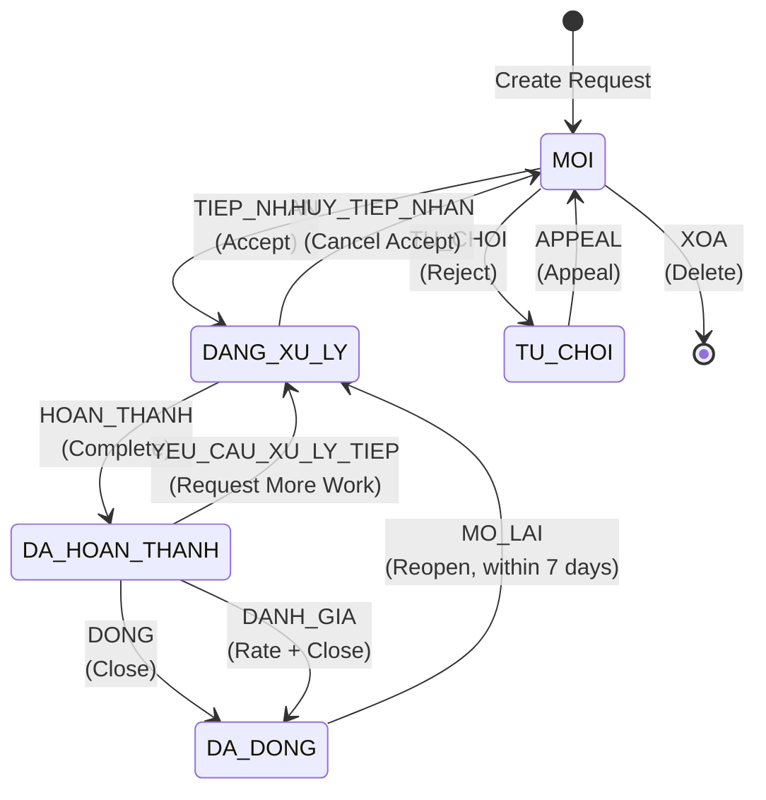

# 📋 01 - WORKFLOW STATES & TRANSITIONS

> **Module**: QuanLyCongViec/Ticket (Support Request System)  
> **Version**: 1.0.0  
> **Last Updated**: January 6, 2026

---

## 📖 MỤC LỤC

1. [State Machine Overview](#1-state-machine-overview)
2. [State Definitions](#2-state-definitions)
3. [Transition Rules](#3-transition-rules)
4. [Permission Matrix](#4-permission-matrix)
5. [Validation Rules](#5-validation-rules)
6. [Side Effects](#6-side-effects)
7. [Error Handling](#7-error-handling)

---

## 1. STATE MACHINE OVERVIEW

### 1.1. Five-State Workflow

Hệ thống Ticket sử dụng **5 trạng thái** để quản lý lifecycle của yêu cầu:



### 1.2. State Enumeration

```javascript
const TRANG_THAI = {
  MOI: "MOI", // New request, awaiting acceptance
  DANG_XU_LY: "DANG_XU_LY", // Accepted, being processed
  DA_HOAN_THANH: "DA_HOAN_THANH", // Completed, awaiting rating/close
  DA_DONG: "DA_DONG", // Closed, finalized
  TU_CHOI: "TU_CHOI", // Rejected
};
```

### 1.3. State Color Coding

| State           | Vietnamese    | Color              | Icon | Badge Style |
| --------------- | ------------- | ------------------ | ---- | ----------- |
| `MOI`           | Mới           | `info` (blue)      | 🆕   | Chip blue   |
| `DANG_XU_LY`    | Đang xử lý    | `warning` (orange) | ⚙️   | Chip orange |
| `DA_HOAN_THANH` | Đã hoàn thành | `success` (green)  | ✅   | Chip green  |
| `DA_DONG`       | Đã đóng       | `default` (gray)   | 🔒   | Chip gray   |
| `TU_CHOI`       | Từ chối       | `error` (red)      | ❌   | Chip red    |

---

## 2. STATE DEFINITIONS

### 2.1. MOI (New)

**Description:** Yêu cầu vừa được tạo, chờ tiếp nhận xử lý

**Entry Conditions:**

- ✅ Người gửi tạo yêu cầu mới
- ✅ Yêu cầu bị từ chối được appeal thành công

**Key Fields:**

```typescript
{
  TrangThai: "MOI",
  NguoiYeuCauID: ObjectId,           // Người tạo
  KhoaNguonID: ObjectId,             // Khoa người tạo
  KhoaDichID: ObjectId,              // Khoa nhận yêu cầu
  LoaiNguoiNhan: "KHOA" | "CA_NHAN",
  NguoiNhanID?: ObjectId,            // Nếu CA_NHAN
  NguoiDuocDieuPhoiID?: ObjectId,    // Nếu đã điều phối
  createdAt: Date
}
```

**Available Actions:**

- **TIEP_NHAN**: Tiếp nhận xử lý
- **TU_CHOI**: Từ chối yêu cầu
- **XOA**: Xóa yêu cầu (hard delete)
- **DIEU_PHOI**: Giao việc cho người khác
- **GUI_VE_KHOA**: Gửi về khoa (không xử lý được)
- **NHAC_LAI**: Nhắc lại yêu cầu
- **BAO_QUAN_LY**: Báo cáo cho quản lý

**UI Display:**

- Badge: 🆕 Mới (blue)
- Priority indicator visible
- Countdown timer to ThoiGianHen (if dispatched)
- Action buttons: [Tiếp nhận] [Từ chối] [Điều phối]

### 2.2. DANG_XU_LY (Processing)

**Description:** Yêu cầu đã được tiếp nhận và đang được xử lý

**Entry Conditions:**

- ✅ Người xử lý tiếp nhận yêu cầu (từ MOI)
- ✅ Người gửi yêu cầu xử lý tiếp (từ DA_HOAN_THANH)
- ✅ Quản lý mở lại yêu cầu (từ DA_DONG)

**Key Fields:**

```typescript
{
  TrangThai: "DANG_XU_LY",
  NguoiXuLyID: ObjectId,             // Người đang xử lý
  NgayTiepNhan: Date,                // Thời điểm tiếp nhận
  ThoiGianHen: Date,                 // Deadline
  updatedAt: Date
}
```

**Available Actions:**

- **HOAN_THANH**: Hoàn thành xử lý
- **HUY_TIEP_NHAN**: Hủy tiếp nhận (trả về MOI)
- **DOI_THOI_GIAN_HEN**: Đổi deadline

**UI Display:**

- Badge: ⚙️ Đang xử lý (orange)
- Progress indicator
- Deadline countdown (QuaHan warning if overdue)
- Action buttons: [Hoàn thành] [Hủy tiếp nhận]

**Auto-Calculated Fields:**

```javascript
QuaHan: boolean; // true if now > ThoiGianHen
SoNgayConLai: number; // Days remaining (negative if overdue)
```

### 2.3. DA_HOAN_THANH (Completed)

**Description:** Yêu cầu đã được xử lý xong, chờ người gửi đánh giá/đóng

**Entry Conditions:**

- ✅ Người xử lý hoàn thành công việc (từ DANG_XU_LY)

**Key Fields:**

```typescript
{
  TrangThai: "DA_HOAN_THANH",
  NguoiXuLyID: ObjectId,
  NgayHoanThanh: Date,               // Completion timestamp
  updatedAt: Date
}
```

**Available Actions:**

- **DANH_GIA**: Đánh giá + Đóng (1-5 sao)
- **DONG**: Đóng không đánh giá
- **YEU_CAU_XU_LY_TIEP**: Yêu cầu xử lý thêm
- **TU_DONG_DONG**: Auto-close (SYSTEM only, sau 7 ngày)

**UI Display:**

- Badge: ✅ Đã hoàn thành (green)
- Completion date shown
- Action buttons: [Đánh giá] [Đóng] [Yêu cầu xử lý tiếp]

**Auto-Close Logic:**

```javascript
// Agenda job runs daily
if (TrangThai === "DA_HOAN_THANH" &&
    NgayHoanThanh < now - 7 days) {
  TU_DONG_DONG → DA_DONG
}
```

### 2.4. DA_DONG (Closed)

**Description:** Yêu cầu đã đóng, kết thúc workflow (có thể mở lại trong 7 ngày)

**Entry Conditions:**

- ✅ Người gửi đóng yêu cầu (từ DA_HOAN_THANH)
- ✅ Người gửi đánh giá + đóng (từ DA_HOAN_THANH)
- ✅ Hệ thống tự động đóng (từ DA_HOAN_THANH sau 7 ngày)

**Key Fields:**

```typescript
{
  TrangThai: "DA_DONG",
  NgayDong: Date,                    // Close timestamp
  DanhGia?: {                        // Optional rating
    SoSao: number,                   // 1-5
    NhanXet?: string,
    NgayDanhGia: Date
  },
  updatedAt: Date
}
```

**Available Actions:**

- **MO_LAI**: Mở lại yêu cầu (trong vòng 7 ngày)

**UI Display:**

- Badge: 🔒 Đã đóng (gray)
- Close date shown
- Rating displayed if exists
- Action buttons: [Mở lại] (if within 7 days)

**Reopen Logic:**

```javascript
CoTheMoLai: boolean = (now - NgayDong) <= 7 days
```

### 2.5. TU_CHOI (Rejected)

**Description:** Yêu cầu bị từ chối, có thể khiếu nại

**Entry Conditions:**

- ✅ Người xử lý từ chối yêu cầu (từ MOI)

**Key Fields:**

```typescript
{
  TrangThai: "TU_CHOI",
  LyDoTuChoiID: ObjectId,            // Ref: LyDoTuChoi
  NgayTuChoi: Date,
  updatedAt: Date
}
```

**Available Actions:**

- **APPEAL**: Khiếu nại (trả về MOI)

**UI Display:**

- Badge: ❌ Từ chối (red)
- Rejection reason shown
- Rejection date shown
- Action buttons: [Khiếu nại]

---

## 3. TRANSITION RULES

### 3.1. Transition Configuration

**File:** `giaobanbv-be/modules/workmanagement/services/yeuCauStateMachine.js`

```javascript
const TRANSITIONS = {
  [TRANG_THAI.MOI]: {
    TIEP_NHAN: {
      nextState: TRANG_THAI.DANG_XU_LY,
      hanhDong: HANH_DONG.TIEP_NHAN,
      requiredFields: ["ThoiGianHen"],
      notificationType: "YEUCAU_DA_TIEP_NHAN",
    },
    TU_CHOI: {
      nextState: TRANG_THAI.TU_CHOI,
      hanhDong: HANH_DONG.TU_CHOI,
      requiredFields: ["LyDoTuChoiID"],
      notificationType: "YEUCAU_BI_TU_CHOI",
    },
    // ... more transitions
  },
  // ... other states
};
```

### 3.2. Complete Transition Matrix

| From State        | Action             | To State      | Required Fields | Time Limit | Rate Limit |
| ----------------- | ------------------ | ------------- | --------------- | ---------- | ---------- |
| **MOI**           | TIEP_NHAN          | DANG_XU_LY    | ThoiGianHen     | -          | -          |
| MOI               | TU_CHOI            | TU_CHOI       | LyDoTuChoiID    | -          | -          |
| MOI               | XOA                | [DELETE]      | -               | -          | -          |
| MOI               | DIEU_PHOI          | MOI           | NhanVienXuLyID  | -          | -          |
| MOI               | GUI_VE_KHOA        | MOI           | GhiChu          | -          | -          |
| MOI               | NHAC_LAI           | MOI           | -               | -          | 3/day      |
| MOI               | BAO_QUAN_LY        | MOI           | -               | -          | 1/day      |
| **DANG_XU_LY**    | HOAN_THANH         | DA_HOAN_THANH | -               | -          | -          |
| DANG_XU_LY        | HUY_TIEP_NHAN      | MOI           | -               | -          | -          |
| DANG_XU_LY        | DOI_THOI_GIAN_HEN  | DANG_XU_LY    | ThoiGianHen     | -          | -          |
| **DA_HOAN_THANH** | DANH_GIA           | DA_DONG       | DanhGia.SoSao   | -          | -          |
| DA_HOAN_THANH     | DONG               | DA_DONG       | -               | -          | -          |
| DA_HOAN_THANH     | YEU_CAU_XU_LY_TIEP | DANG_XU_LY    | -               | -          | -          |
| DA_HOAN_THANH     | TU_DONG_DONG       | DA_DONG       | -               | 7 days     | -          |
| **DA_DONG**       | MO_LAI             | DANG_XU_LY    | LyDoMoLai       | 7 days     | -          |
| **TU_CHOI**       | APPEAL             | MOI           | LyDoAppeal      | -          | -          |

### 3.3. Transition Examples

#### Example 1: Normal Flow (Accept → Complete → Rate → Close)

```javascript
// Step 1: Accept request
POST /api/workmanagement/yeu-cau/:id/tiep-nhan
Body: {
  ThoiGianHen: "2026-01-08T12:00:00.000Z"
}

// State: MOI → DANG_XU_LY
// Side effects:
// - NguoiXuLyID = currentUserId
// - NgayTiepNhan = now()
// - ThoiGianHen = provided value

// Step 2: Complete work
POST /api/workmanagement/yeu-cau/:id/hoan-thanh

// State: DANG_XU_LY → DA_HOAN_THANH
// Side effects:
// - NgayHoanThanh = now()

// Step 3: Rate and close
POST /api/workmanagement/yeu-cau/:id/danh-gia
Body: {
  SoSao: 5,
  NhanXet: "Xử lý nhanh chóng, chuyên nghiệp"
}

// State: DA_HOAN_THANH → DA_DONG
// Side effects:
// - DanhGia = { SoSao, NhanXet, NgayDanhGia: now() }
// - NgayDong = now()
```

#### Example 2: Rejection → Appeal

```javascript
// Step 1: Reject request
POST /api/workmanagement/yeu-cau/:id/tu-choi
Body: {
  LyDoTuChoiID: "66c111222333..."
}

// State: MOI → TU_CHOI
// Side effects:
// - LyDoTuChoiID = provided
// - NgayTuChoi = now()

// Step 2: Appeal rejection
POST /api/workmanagement/yeu-cau/:id/appeal
Body: {
  LyDoAppeal: "Đây là yêu cầu khẩn cấp, xin xem xét lại"
}

// State: TU_CHOI → MOI
// Side effects:
// - Clear LyDoTuChoiID, NgayTuChoi
// - Add LyDoAppeal to history
```

#### Example 3: Reopen After Close

```javascript
// Precondition: DA_DONG state, within 7 days from NgayDong

POST /api/workmanagement/yeu-cau/:id/mo-lai
Body: {
  LyDoMoLai: "Phát hiện lỗi cần xử lý thêm"
}

// State: DA_DONG → DANG_XU_LY
// Side effects:
// - Clear NgayDong
// - Keep NgayHoanThanh (history)
```

---

## 4. PERMISSION MATRIX

### 4.1. Role Definitions

```typescript
interface UserRoles {
  isNguoiGui: boolean; // Created the request
  isNguoiNhan: boolean; // Direct recipient (CA_NHAN)
  isNguoiDuocDieuPhoi: boolean; // Dispatched to
  isNguoiXuLy: boolean; // Current handler
  isDieuPhoi: boolean; // Dispatcher (in CauHinhThongBaoKhoa)
  isAdmin: boolean; // Admin/SuperAdmin
}
```

### 4.2. Permission Table

| Action                  | NguoiGui | NguoiNhan | NguoiDuocDieuPhoi | NguoiXuLy | DieuPhoi | Admin |
| ----------------------- | -------- | --------- | ----------------- | --------- | -------- | ----- |
| **MOI State**           |
| TIEP_NHAN               | ❌       | ✅        | ✅                | ❌        | ✅       | ❌    |
| TU_CHOI                 | ❌       | ✅        | ✅                | ❌        | ✅       | ❌    |
| XOA                     | ✅       | ❌        | ❌                | ❌        | ❌       | ✅    |
| DIEU_PHOI               | ❌       | ❌        | ❌                | ❌        | ✅       | ❌    |
| GUI_VE_KHOA             | ❌       | ✅        | ✅                | ❌        | ❌       | ❌    |
| NHAC_LAI                | ✅       | ❌        | ❌                | ❌        | ❌       | ❌    |
| BAO_QUAN_LY             | ✅       | ❌        | ❌                | ❌        | ❌       | ❌    |
| **DANG_XU_LY State**    |
| HOAN_THANH              | ❌       | ❌        | ❌                | ✅        | ❌       | ❌    |
| HUY_TIEP_NHAN           | ❌       | ❌        | ❌                | ✅        | ❌       | ❌    |
| DOI_THOI_GIAN_HEN       | ❌       | ❌        | ❌                | ✅        | ❌       | ❌    |
| **DA_HOAN_THANH State** |
| DANH_GIA                | ✅       | ❌        | ❌                | ❌        | ❌       | ❌    |
| DONG                    | ✅       | ❌        | ❌                | ✅        | ❌       | ✅    |
| YEU_CAU_XU_LY_TIEP      | ❌       | ❌        | ❌                | ✅        | ❌       | ❌    |
| **DA_DONG State**       |
| MO_LAI                  | ✅       | ❌        | ❌                | ✅        | ❌       | ❌    |
| **TU_CHOI State**       |
| APPEAL                  | ✅       | ❌        | ❌                | ❌        | ❌       | ❌    |

### 4.3. Permission Check Implementation

**Backend:**

```javascript
// yeuCauStateMachine.js
async function checkPermission(yeuCau, action, nguoiThucHienId, userRole) {
  const nguoiThucHienIdStr = nguoiThucHienId.toString();
  const isAdmin = ["admin", "superadmin"].includes(userRole?.toLowerCase());

  // Admin override for XOA
  if (action === "XOA" && isAdmin) return true;

  // Check user relationships
  const isNguoiGui = yeuCau.laNguoiGui(nguoiThucHienId);
  const isNguoiNhan = yeuCau.laNguoiNhan(nguoiThucHienId);
  const isNguoiDuocDieuPhoi = yeuCau.laNguoiDuocDieuPhoi(nguoiThucHienId);
  const isNguoiXuLy = yeuCau.laNguoiXuLy(nguoiThucHienId);

  // Check dispatcher role
  let isDieuPhoi = false;
  if (yeuCau.LoaiNguoiNhan === "KHOA") {
    const config = await CauHinhThongBaoKhoa.findOne({
      KhoaID: yeuCau.KhoaDichID,
    });
    isDieuPhoi = config?.laNguoiDieuPhoi(nguoiThucHienId) || false;
  }

  // Permission map
  const permissionMap = {
    TIEP_NHAN: isDieuPhoi || isNguoiNhan || isNguoiDuocDieuPhoi,
    TU_CHOI: isDieuPhoi || isNguoiNhan || isNguoiDuocDieuPhoi,
    XOA: isNguoiGui,
    HOAN_THANH: isNguoiXuLy,
    DANH_GIA: isNguoiGui,
    // ... more permissions
  };

  return permissionMap[action] || false;
}
```

**Frontend:**

```javascript
// yeuCau.utils.js
export function getAvailableActions(yeuCau, roles = []) {
  const { isNguoiGui, isNguoiXuLy, isDieuPhoi, isAdmin } = roles;

  if (yeuCau.TrangThai === "MOI") {
    return [
      isDieuPhoi && "DIEU_PHOI",
      (isDieuPhoi || isNguoiNhan) && "TIEP_NHAN",
      (isDieuPhoi || isNguoiNhan) && "TU_CHOI",
      isNguoiGui && "XOA",
      isNguoiGui && "NHAC_LAI",
    ].filter(Boolean);
  }

  if (yeuCau.TrangThai === "DANG_XU_LY") {
    return [
      isNguoiXuLy && "HOAN_THANH",
      isNguoiXuLy && "HUY_TIEP_NHAN",
      isNguoiXuLy && "DOI_THOI_GIAN_HEN",
    ].filter(Boolean);
  }

  // ... more states
}
```

---

## 5. VALIDATION RULES

### 5.1. Required Field Validation

```javascript
function validateRequiredFields(action, data, transitionConfig) {
  const missing = [];

  if (transitionConfig.requiredFields) {
    for (const field of transitionConfig.requiredFields) {
      // Support nested fields like "DanhGia.SoSao"
      const parts = field.split(".");
      let value = data;
      for (const part of parts) {
        value = value?.[part];
      }
      if (value === undefined || value === null || value === "") {
        missing.push(field);
      }
    }
  }

  // Special case: NhanXet required when SoSao < 3
  if (action === "DANH_GIA" && data.DanhGia?.SoSao < 3) {
    if (!data.DanhGia?.NhanXet?.trim()) {
      missing.push("DanhGia.NhanXet (required for rating < 3 stars)");
    }
  }

  if (missing.length > 0) {
    throw new AppError(400, `Missing required fields: ${missing.join(", ")}`);
  }
}
```

**Required Fields Table:**

| Action            | Required Fields  | Additional Validation      |
| ----------------- | ---------------- | -------------------------- |
| TIEP_NHAN         | `ThoiGianHen`    | Must be future date        |
| TU_CHOI           | `LyDoTuChoiID`   | Must exist in LyDoTuChoi   |
| DIEU_PHOI         | `NhanVienXuLyID` | Must be valid NhanVien     |
| GUI_VE_KHOA       | `GhiChu`         | Min 10 chars               |
| DANH_GIA          | `DanhGia.SoSao`  | 1-5, NhanXet if < 3        |
| DOI_THOI_GIAN_HEN | `ThoiGianHen`    | Must be > current deadline |
| MO_LAI            | `LyDoMoLai`      | Min 20 chars               |
| APPEAL            | `LyDoAppeal`     | Min 50 chars               |

### 5.2. Time Limit Validation

**Only applies to MO_LAI action:**

```javascript
function validateTimeLimit(yeuCau, transitionConfig) {
  if (!transitionConfig.timeLimit) return;

  const { days, from } = transitionConfig.timeLimit; // { days: 7, from: "NgayDong" }
  const fromDate = yeuCau[from]; // yeuCau.NgayDong

  if (!fromDate) {
    throw new AppError(400, "Cannot determine source date");
  }

  const now = new Date();
  const diffDays = (now - fromDate) / (1000 * 60 * 60 * 24);

  if (diffDays > days) {
    throw new AppError(400, `Exceeded ${days} days time limit`);
  }
}
```

**Example:**

```
NgayDong: 2026-01-01 10:00:00
Now: 2026-01-09 10:00:00
diffDays = 8 days

→ REJECT: Exceeded 7 days time limit
→ MO_LAI action not available
```

### 5.3. Rate Limit Validation

**Applies to NHAC_LAI and BAO_QUAN_LY:**

```javascript
async function validateRateLimit(yeuCauId, nguoiThucHienId, action, config) {
  if (!config.rateLimit) return;

  const result = await LichSuYeuCau.kiemTraRateLimit(
    yeuCauId,
    nguoiThucHienId,
    config.hanhDong
  );

  if (!result.allowed) {
    throw new AppError(429, `Rate limit exceeded: ${result.limit} times/day`);
  }
}
```

**Rate Limits:**

| Action      | Limit | Window | Reason             |
| ----------- | ----- | ------ | ------------------ |
| NHAC_LAI    | 3     | 1 day  | Prevent spam       |
| BAO_QUAN_LY | 1     | 1 day  | Escalation control |

**Implementation:**

```javascript
// LichSuYeuCau model
yeuCauSchema.statics.kiemTraRateLimit = async function (
  yeuCauId,
  nguoiThucHienId,
  hanhDong
) {
  const today = dayjs().startOf("day").toDate();

  const count = await this.countDocuments({
    YeuCauID: yeuCauId,
    NguoiThucHienID: nguoiThucHienId,
    HanhDong: hanhDong,
    ThoiGian: { $gte: today },
  });

  const limits = {
    NHAC_LAI: 3,
    BAO_QUAN_LY: 1,
  };

  const limit = limits[hanhDong];
  return {
    allowed: count < limit,
    current: count,
    limit,
  };
};
```

---

## 6. SIDE EFFECTS

### 6.1. Field Updates Per Action

```javascript
function applySideEffects(yeuCau, action, data, nguoiThucHienId) {
  const now = new Date();

  switch (action) {
    case "TIEP_NHAN":
      yeuCau.NguoiXuLyID = nguoiThucHienId;
      yeuCau.NgayTiepNhan = now;
      yeuCau.ThoiGianHen = data.ThoiGianHen || yeuCau.tinhThoiGianHen(now);
      break;

    case "TU_CHOI":
      yeuCau.LyDoTuChoiID = data.LyDoTuChoiID;
      yeuCau.NgayTuChoi = now;
      break;

    case "DIEU_PHOI":
      yeuCau.NguoiDieuPhoiID = nguoiThucHienId;
      yeuCau.NguoiDuocDieuPhoiID = data.NhanVienXuLyID;
      yeuCau.NgayDieuPhoi = now;
      break;

    case "HOAN_THANH":
      yeuCau.NgayHoanThanh = now;
      break;

    case "DANH_GIA":
      yeuCau.DanhGia = {
        SoSao: data.DanhGia.SoSao,
        NhanXet: data.DanhGia.NhanXet,
        NgayDanhGia: now,
      };
      yeuCau.NgayDong = now;
      break;

    case "DONG":
      yeuCau.NgayDong = now;
      break;

    case "MO_LAI":
      yeuCau.NgayDong = null; // Clear close date
      yeuCau.LyDoMoLai = data.LyDoMoLai;
      break;

    case "HUY_TIEP_NHAN":
      yeuCau.NguoiXuLyID = null;
      yeuCau.NgayTiepNhan = null;
      yeuCau.ThoiGianHen = null;
      break;

    case "APPEAL":
      yeuCau.LyDoTuChoiID = null;
      yeuCau.NgayTuChoi = null;
      yeuCau.LyDoAppeal = data.LyDoAppeal;
      break;

    case "DOI_THOI_GIAN_HEN":
      yeuCau.ThoiGianHen = data.ThoiGianHen;
      yeuCau.LyDoDoiThoiGianHen = data.LyDoDoiThoiGianHen;
      break;
  }
}
```

### 6.2. History Logging

**Every transition creates a LichSuYeuCau entry:**

```javascript
await LichSuYeuCau.create({
  YeuCauID: yeuCau._id,
  HanhDong: transitionConfig.hanhDong,
  NguoiThucHienID: nguoiThucHienId,
  TuGiaTri: {
    TrangThai: oldTrangThai,
    // ... other old values
  },
  DenGiaTri: {
    TrangThai: newTrangThai,
    // ... other new values
  },
  GhiChu: data.GhiChu,
  ThoiGian: new Date(),
});
```

**History Entry Example:**

```json
{
  "YeuCauID": "67890abc...",
  "HanhDong": "TIEP_NHAN",
  "NguoiThucHienID": "66b1dba7...",
  "TuGiaTri": {
    "TrangThai": "MOI",
    "NguoiXuLyID": null,
    "NgayTiepNhan": null
  },
  "DenGiaTri": {
    "TrangThai": "DANG_XU_LY",
    "NguoiXuLyID": "66b1dba7...",
    "NgayTiepNhan": "2026-01-06T10:30:00.000Z",
    "ThoiGianHen": "2026-01-08T10:30:00.000Z"
  },
  "GhiChu": "Tiếp nhận xử lý yêu cầu",
  "ThoiGian": "2026-01-06T10:30:00.000Z"
}
```

### 6.3. Notification Triggers

**Each transition can trigger notifications:**

```javascript
const notificationConfig = {
  TIEP_NHAN: {
    recipients: [yeuCau.NguoiYeuCauID], // Notify requester
    type: "YEUCAU_DA_TIEP_NHAN",
    template: "Yêu cầu {{MaYeuCau}} đã được tiếp nhận bởi {{NguoiXuLy}}",
  },
  HOAN_THANH: {
    recipients: [yeuCau.NguoiYeuCauID],
    type: "YEUCAU_DA_HOAN_THANH",
    template: "Yêu cầu {{MaYeuCau}} đã hoàn thành",
  },
  TU_CHOI: {
    recipients: [yeuCau.NguoiYeuCauID],
    type: "YEUCAU_BI_TU_CHOI",
    template: "Yêu cầu {{MaYeuCau}} bị từ chối: {{LyDoTuChoi}}",
  },
  // ... more notifications
};
```

**Non-blocking trigger:**

```javascript
function fireNotificationTrigger(
  yeuCau,
  action,
  config,
  nguoiThucHienId,
  data
) {
  // Async, non-blocking
  notificationService
    .sendYeuCauNotification(
      config.notificationType,
      yeuCau,
      nguoiThucHienId,
      data
    )
    .catch((err) => {
      console.error("Notification error:", err);
      // Don't fail transaction
    });
}
```

---

## 7. ERROR HANDLING

### 7.1. Common Errors

| Error Code                | HTTP Status | Message                                     | Cause                         |
| ------------------------- | ----------- | ------------------------------------------- | ----------------------------- |
| `INVALID_TRANSITION`      | 400         | "Cannot transition from {{from}} to {{to}}" | Invalid state transition      |
| `PERMISSION_DENIED`       | 403         | "You don't have permission for this action" | Permission check failed       |
| `MISSING_REQUIRED_FIELDS` | 400         | "Missing required fields: {{fields}}"       | Validation failed             |
| `TIME_LIMIT_EXCEEDED`     | 400         | "Exceeded {{days}} days time limit"         | MO_LAI after 7 days           |
| `RATE_LIMIT_EXCEEDED`     | 429         | "Rate limit exceeded: {{limit}} times/day"  | Too many NHAC_LAI/BAO_QUAN_LY |
| `YEUCAU_NOT_FOUND`        | 404         | "Request not found"                         | Invalid yeuCauId              |
| `INVALID_DATE`            | 400         | "Invalid date value"                        | ThoiGianHen in past           |

### 7.2. Error Response Format

```json
{
  "success": false,
  "message": "Cannot transition from DANG_XU_LY to MOI",
  "errors": {
    "code": "INVALID_TRANSITION",
    "from": "DANG_XU_LY",
    "to": "MOI",
    "availableActions": ["HOAN_THANH", "HUY_TIEP_NHAN", "DOI_THOI_GIAN_HEN"]
  }
}
```

### 7.3. Frontend Error Handling

```javascript
// yeuCauSlice.js
export const tiepNhanYeuCau = (yeuCauId, data) => async (dispatch) => {
  dispatch(setActionLoading({ type: "tiepNhan", loading: true }));

  try {
    const response = await apiService.post(
      `/api/workmanagement/yeu-cau/${yeuCauId}/tiep-nhan`,
      data
    );

    dispatch(updateYeuCauInList(response.data.data));
    toast.success("Tiếp nhận yêu cầu thành công");
    return response.data.data;
  } catch (error) {
    const message = error.response?.data?.message || "Có lỗi xảy ra";
    toast.error(message);

    // Special handling for permission error
    if (error.response?.data?.errors?.code === "PERMISSION_DENIED") {
      dispatch(fetchAvailableActions(yeuCauId)); // Refresh actions
    }

    throw error;
  } finally {
    dispatch(setActionLoading({ type: "tiepNhan", loading: false }));
  }
};
```

---

## 🔗 RELATED DOCUMENTS

**Next Steps:**

- [02_DISPATCH_SYSTEM.md](./02_DISPATCH_SYSTEM.md) - Hệ thống điều phối
- [04_ASSIGNMENT_FLOW.md](./04_ASSIGNMENT_FLOW.md) - Quy trình xử lý chi tiết

**Implementation:**

- `giaobanbv-be/modules/workmanagement/services/yeuCauStateMachine.js` - State machine
- `fe-bcgiaobanbvt/src/features/QuanLyCongViec/Ticket/yeuCauSlice.js` - Redux actions

---

**END OF WORKFLOW STATES** 🔄
