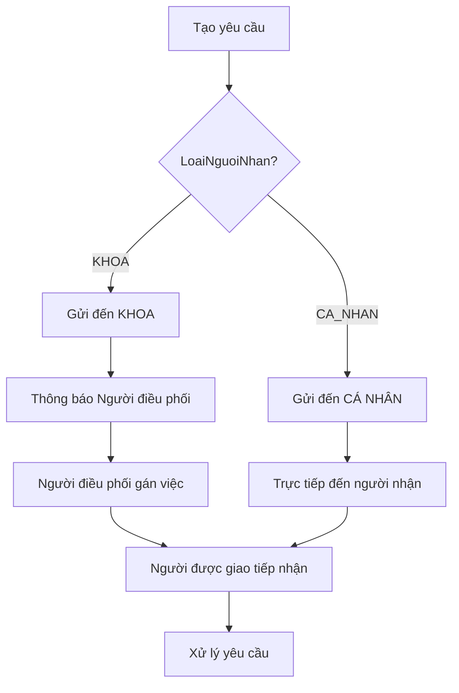
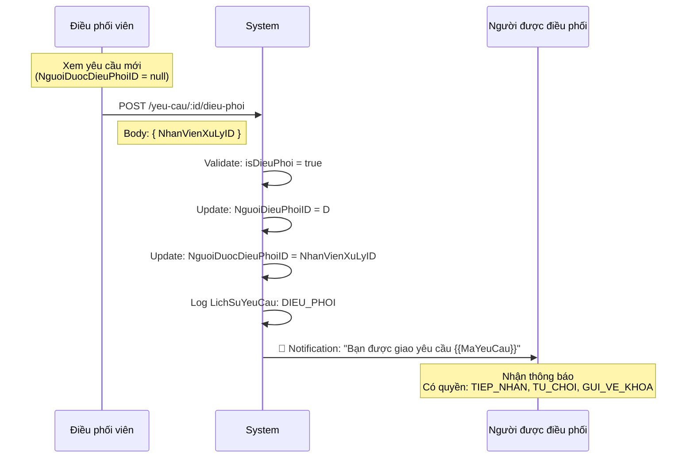

# 📬 02 - DISPATCH SYSTEM & ASSIGNMENT LOGIC

> **Module**: QuanLyCongViec/Ticket (Support Request System)  
> **Version**: 1.0.0  
> **Last Updated**: January 5, 2026

---

## 📖 MỤC LỤC

1. [Overview](#1-overview)
2. [CauHinhThongBaoKhoa Model](#2-cauhinhthongbaokhoa-model)
3. [Dispatcher Role](#3-dispatcher-role)
4. [Assignment Logic](#4-assignment-logic)
5. [Notification Rules](#5-notification-rules)
6. [Frontend Integration](#6-frontend-integration)
7. [Error Handling](#7-error-handling)

---

## 1. OVERVIEW

### 1.1. Dispatch System Purpose

Hệ thống điều phối (Dispatch System) quản lý **phân công yêu cầu** giữa các khoa, đảm bảo mỗi yêu cầu được giao cho đúng người xử lý.

**Hai chế độ gửi yêu cầu:**



### 1.2. Key Concepts

| Khái niệm                        | Ý nghĩa                                   | Role                      |
| -------------------------------- | ----------------------------------------- | ------------------------- |
| **LoaiNguoiNhan**                | Loại người nhận                           | KHOA / CA_NHAN            |
| **Người điều phối** (Dispatcher) | Người có quyền phân công yêu cầu đến khoa | Gán NguoiDuocDieuPhoiID   |
| **Người được điều phối**         | Người được giao việc (chờ tiếp nhận)      | NguoiDuocDieuPhoiID field |
| **Quản lý khoa**                 | Người cấu hình danh mục, điều phối viên   | Admin role cho khoa       |

---

## 2. CAUHINHTHONGBAOKHOA MODEL

### 2.1. Schema Definition

**File:** `giaobanbv-be/modules/workmanagement/models/CauHinhThongBaoKhoa.js`

```typescript
interface CauHinhThongBaoKhoa {
  _id: ObjectId;
  KhoaID: ObjectId; // Unique per khoa

  // 👑 QUẢN LÝ KHOA
  DanhSachQuanLyKhoa: [
    {
      NhanVienID: ObjectId; // Ref: NhanVien
    }
  ];

  // 📬 NGƯỜI ĐIỀU PHỐI
  DanhSachNguoiDieuPhoi: [
    {
      NhanVienID: ObjectId; // Ref: NhanVien
    }
  ];

  createdAt: Date;
  updatedAt: Date;
}
```

**Critical Fields:**

- **KhoaID**: Unique constraint - mỗi khoa chỉ có 1 cấu hình
- **DanhSachQuanLyKhoa**: Quyền cấu hình danh mục yêu cầu (DanhMucYeuCau), thay đổi danh sách điều phối
- **DanhSachNguoiDieuPhoi**: Nhận thông báo + quyền tiếp nhận/từ chối/điều phối yêu cầu

⚠️ **LƯU Ý**: Quản lý khoa **KHÔNG tự động** là người điều phối. Phải cấu hình riêng.

### 2.2. Model Methods

```javascript
// ========== PERMISSION CHECKS ==========

/**
 * Kiểm tra NhanVien có phải là quản lý khoa không
 */
cauHinhThongBaoKhoaSchema.methods.laQuanLyKhoa = function (nhanVienId) {
  const nhanVienIdStr = nhanVienId.toString();
  return this.DanhSachQuanLyKhoa.some(
    (ql) => ql.NhanVienID.toString() === nhanVienIdStr
  );
};

/**
 * Kiểm tra NhanVien có phải là người điều phối không
 */
cauHinhThongBaoKhoaSchema.methods.laNguoiDieuPhoi = function (nhanVienId) {
  const nhanVienIdStr = nhanVienId.toString();
  return this.DanhSachNguoiDieuPhoi.some(
    (dp) => dp.NhanVienID.toString() === nhanVienIdStr
  );
};

// ========== NOTIFICATION HELPERS ==========

/**
 * Lấy danh sách NhanVienID của người điều phối
 * Dùng để gửi notification
 */
cauHinhThongBaoKhoaSchema.methods.layDanhSachNguoiDieuPhoiIDs = function () {
  return this.DanhSachNguoiDieuPhoi.map((dp) => dp.NhanVienID);
};

/**
 * Lấy danh sách NhanVienID của quản lý khoa
 * Dùng để gửi notification khi escalate (BAO_QUAN_LY)
 */
cauHinhThongBaoKhoaSchema.methods.layDanhSachQuanLyKhoaIDs = function () {
  return this.DanhSachQuanLyKhoa.map((ql) => ql.NhanVienID);
};

// ========== CRUD METHODS ==========

/**
 * Thêm quản lý khoa
 */
cauHinhThongBaoKhoaSchema.methods.themQuanLyKhoa = function (nhanVienId) {
  if (!this.laQuanLyKhoa(nhanVienId)) {
    this.DanhSachQuanLyKhoa.push({ NhanVienID: nhanVienId });
  }
  return this.save();
};

/**
 * Xóa quản lý khoa
 */
cauHinhThongBaoKhoaSchema.methods.xoaQuanLyKhoa = function (nhanVienId) {
  const nhanVienIdStr = nhanVienId.toString();
  this.DanhSachQuanLyKhoa = this.DanhSachQuanLyKhoa.filter(
    (ql) => ql.NhanVienID.toString() !== nhanVienIdStr
  );
  return this.save();
};

/**
 * Thêm người điều phối
 */
cauHinhThongBaoKhoaSchema.methods.themNguoiDieuPhoi = function (nhanVienId) {
  if (!this.laNguoiDieuPhoi(nhanVienId)) {
    this.DanhSachNguoiDieuPhoi.push({ NhanVienID: nhanVienId });
  }
  return this.save();
};

/**
 * Xóa người điều phối
 */
cauHinhThongBaoKhoaSchema.methods.xoaNguoiDieuPhoi = function (nhanVienId) {
  const nhanVienIdStr = nhanVienId.toString();
  this.DanhSachNguoiDieuPhoi = this.DanhSachNguoiDieuPhoi.filter(
    (dp) => dp.NhanVienID.toString() !== nhanVienIdStr
  );
  return this.save();
};
```

### 2.3. Static Methods

```javascript
/**
 * Lấy cấu hình theo khoa (với populate)
 * Trả về null nếu khoa chưa được cấu hình
 */
cauHinhThongBaoKhoaSchema.statics.layTheoKhoa = async function (khoaId) {
  const config = await this.findOne({ KhoaID: khoaId })
    .populate(
      "DanhSachQuanLyKhoa.NhanVienID",
      "Ten MaNhanVien Email ChucDanh ChucVu"
    )
    .populate(
      "DanhSachNguoiDieuPhoi.NhanVienID",
      "Ten MaNhanVien Email ChucDanh ChucVu"
    );

  if (!config) return null;

  // Map Ten -> HoTen for frontend compatibility
  const mapNhanVien = (list) =>
    list.map((item) => ({
      NhanVienID: item.NhanVienID
        ? {
            _id: item.NhanVienID._id,
            HoTen: item.NhanVienID.Ten, // Map Ten -> HoTen
            MaNhanVien: item.NhanVienID.MaNhanVien,
            Email: item.NhanVienID.Email,
            ChucDanh: item.NhanVienID.ChucDanh,
            ChucVu: item.NhanVienID.ChucVu,
          }
        : null,
    }));

  return {
    ...config.toObject(),
    DanhSachQuanLyKhoa: mapNhanVien(config.DanhSachQuanLyKhoa),
    DanhSachNguoiDieuPhoi: mapNhanVien(config.DanhSachNguoiDieuPhoi),
  };
};

/**
 * Kiểm tra khoa đã được cấu hình chưa
 */
cauHinhThongBaoKhoaSchema.statics.khoaDaCauHinh = async function (khoaId) {
  const config = await this.findOne({ KhoaID: khoaId });
  return !!config;
};

/**
 * Kiểm tra khoa có người điều phối không
 * ⚠️ CRITICAL: Dùng để validate TRƯỚC khi gửi yêu cầu đến khoa
 */
cauHinhThongBaoKhoaSchema.statics.khoaCoNguoiDieuPhoi = async function (
  khoaId
) {
  const config = await this.findOne({ KhoaID: khoaId });
  return config && config.DanhSachNguoiDieuPhoi.length > 0;
};

/**
 * Tạo cấu hình mới cho khoa
 */
cauHinhThongBaoKhoaSchema.statics.taoCauHinh = async function (
  khoaId,
  quanLyKhoaIds = [],
  nguoiDieuPhoiIds = []
) {
  const config = new this({
    KhoaID: khoaId,
    DanhSachQuanLyKhoa: quanLyKhoaIds.map((id) => ({ NhanVienID: id })),
    DanhSachNguoiDieuPhoi: nguoiDieuPhoiIds.map((id) => ({ NhanVienID: id })),
  });
  return config.save();
};
```

---

## 3. DISPATCHER ROLE

### 3.1. Permission Matrix

**Người điều phối (Dispatcher) có các quyền:**

| Quyền                    | MOI State | DANG_XU_LY | DA_HOAN_THANH | DA_DONG | TU_CHOI |
| ------------------------ | --------- | ---------- | ------------- | ------- | ------- |
| **Xem yêu cầu đến khoa** | ✅        | ✅         | ✅            | ✅      | ✅      |
| **TIEP_NHAN**            | ✅        | ❌         | ❌            | ❌      | ❌      |
| **TU_CHOI**              | ✅        | ❌         | ❌            | ❌      | ❌      |
| **DIEU_PHOI**            | ✅        | ❌         | ❌            | ❌      | ❌      |
| **GUI_VE_KHOA**          | ❌        | ❌         | ❌            | ❌      | ❌      |
| **XOA**                  | ❌        | ❌         | ❌            | ❌      | ❌      |

**Người được điều phối có các quyền:**

| Quyền           | MOI State | Điều kiện                          |
| --------------- | --------- | ---------------------------------- |
| **TIEP_NHAN**   | ✅        | NguoiDuocDieuPhoiID = myNhanVienId |
| **TU_CHOI**     | ✅        | NguoiDuocDieuPhoiID = myNhanVienId |
| **GUI_VE_KHOA** | ✅        | NguoiDuocDieuPhoiID = myNhanVienId |

### 3.2. Permission Check Implementation

**Backend:**

```javascript
// yeuCauStateMachine.js - checkPermission function
async function checkPermission(yeuCau, action, nguoiThucHienId, userRole) {
  // ... other checks ...

  // Check dispatcher role
  let isDieuPhoi = false;
  if (yeuCau.LoaiNguoiNhan === "KHOA") {
    const config = await CauHinhThongBaoKhoa.findOne({
      KhoaID: yeuCau.KhoaDichID,
    });
    isDieuPhoi = config?.laNguoiDieuPhoi(nguoiThucHienId) || false;
  }

  const permissionMap = {
    TIEP_NHAN: isDieuPhoi || isNguoiNhan || isNguoiDuocDieuPhoi,
    TU_CHOI: isDieuPhoi || isNguoiNhan || isNguoiDuocDieuPhoi,
    DIEU_PHOI: isDieuPhoi, // Only dispatcher can assign
    // ... other permissions
  };

  return permissionMap[action] || false;
}
```

**Frontend:**

```javascript
// yeuCauSlice.js - fetchAvailableActions
export const fetchAvailableActions =
  (yeuCauId) => async (dispatch, getState) => {
    const response = await apiService.get(
      `/workmanagement/yeu-cau/${yeuCauId}/available-actions`
    );

    // Backend returns array like: ["TIEP_NHAN", "TU_CHOI", "DIEU_PHOI"]
    dispatch(setAvailableActions({ yeuCauId, actions: response.data.data }));
  };
```

### 3.3. Dashboard Metrics

**Dispatcher Dashboard:**

```javascript
// yeuCau.service.js - layDashboardDieuPhoi
exports.layDashboardDieuPhoi = async function (nhanVienId) {
  const nhanVien = await NhanVien.findById(nhanVienId);
  const khoaId = nhanVien.KhoaID;

  // Base filter: YC đến khoa của dispatcher
  const baseFilter = {
    KhoaDichID: khoaId,
    isDeleted: false,
  };

  const [moiHomNay, quaHan, choDieuPhoi, dangXuLy] = await Promise.all([
    // Mới hôm nay
    YeuCau.countDocuments({
      ...baseFilter,
      TrangThai: TRANG_THAI.MOI,
      createdAt: {
        $gte: dayjs().startOf("day").toDate(),
      },
    }),

    // Quá hạn (DANG_XU_LY + ThoiGianHen < now)
    YeuCau.countDocuments({
      ...baseFilter,
      TrangThai: TRANG_THAI.DANG_XU_LY,
      ThoiGianHen: { $lt: new Date() },
    }),

    // Chờ điều phối (MOI + NguoiDuocDieuPhoiID = null)
    YeuCau.countDocuments({
      ...baseFilter,
      TrangThai: TRANG_THAI.MOI,
      NguoiDuocDieuPhoiID: null,
    }),

    // Đang xử lý
    YeuCau.countDocuments({
      ...baseFilter,
      TrangThai: TRANG_THAI.DANG_XU_LY,
    }),
  ]);

  return { moiHomNay, quaHan, choDieuPhoi, dangXuLy };
};
```

---

## 4. ASSIGNMENT LOGIC

### 4.1. LoaiNguoiNhan Pattern

**Two modes of request assignment:**

```typescript
enum LoaiNguoiNhan {
  KHOA = "KHOA", // Gửi đến khoa (cần dispatcher phân công)
  CA_NHAN = "CA_NHAN", // Gửi trực tiếp đến cá nhân (skip dispatcher)
}

interface YeuCauFields {
  LoaiNguoiNhan: "KHOA" | "CA_NHAN";
  NguoiNhanID: ObjectId | null; // null nếu KHOA, có giá trị nếu CA_NHAN
  NguoiDieuPhoiID: ObjectId | null; // Người thực hiện điều phối
  NguoiDuocDieuPhoiID: ObjectId | null; // Người được điều phối (chờ tiếp nhận)
  NguoiXuLyID: ObjectId | null; // Người xử lý (sau khi tiếp nhận)
}
```

### 4.2. Request Creation Flow

**Mode 1: KHOA (Department-level)**

```javascript
// yeuCau.service.js - taoYeuCau
async function taoYeuCau(data, nguoiYeuCauId) {
  // 1. Validate: Khoa đích đã được cấu hình
  const cauHinh = await CauHinhThongBaoKhoa.findOne({ KhoaID: khoaDichId });
  if (!cauHinh) {
    throw new AppError(
      400,
      "Khoa đích chưa được cấu hình để nhận yêu cầu. Vui lòng liên hệ quản trị viên.",
      "KHOA_CHUA_CAU_HINH"
    );
  }

  // 2. Validate: Nếu gửi đến KHOA, kiểm tra có người điều phối không
  if (data.LoaiNguoiNhan === LOAI_NGUOI_NHAN.KHOA) {
    if (cauHinh.DanhSachNguoiDieuPhoi.length === 0) {
      throw new AppError(
        400,
        "Khoa đích chưa có người điều phối để nhận yêu cầu. Vui lòng liên hệ quản trị viên.",
        "KHOA_KHONG_CO_DIEU_PHOI"
      );
    }
  }

  // 3. Tạo yêu cầu
  const yeuCau = new YeuCau({
    // ... other fields ...
    LoaiNguoiNhan: "KHOA",
    NguoiNhanID: null, // null khi gửi đến khoa
    NguoiDieuPhoiID: null, // Chưa có người điều phối
    NguoiDuocDieuPhoiID: null, // Chưa được điều phối
    TrangThai: TRANG_THAI.MOI,
  });

  await yeuCau.save();

  // 4. Gửi thông báo đến TẤT CẢ người điều phối của khoa đích
  const cauHinhKhoaDich = await CauHinhThongBaoKhoa.findOne({
    KhoaID: yeuCau.KhoaDichID,
  });
  const arrNguoiDieuPhoiID = cauHinhKhoaDich
    ? cauHinhKhoaDich.layDanhSachNguoiDieuPhoiIDs()
    : [];

  await notificationService.send({
    type: "yeucau-tao-moi",
    data: {
      yeuCau,
      arrNguoiDieuPhoiID, // Multiple recipients
    },
  });

  return yeuCau;
}
```

**Mode 2: CA_NHAN (Person-to-person)**

```javascript
// Frontend - YeuCauFormDialog.js
const onSubmit = async (data) => {
  const payload = {
    ...data,
    LoaiNguoiNhan: "CA_NHAN",      // Direct assignment mode
    NguoiNhanID: selectedNhanVienId, // Direct recipient
  };

  dispatch(createYeuCau(payload, callback));
};

// Backend creates with:
{
  LoaiNguoiNhan: "CA_NHAN",
  NguoiNhanID: ObjectId("..."),     // Direct recipient
  NguoiDieuPhoiID: null,            // No dispatcher involved
  NguoiDuocDieuPhoiID: null,        // No dispatch needed
  TrangThai: TRANG_THAI.MOI,
}

// Notification sent to NguoiNhanID only (not to dispatchers)
```

### 4.3. DIEU_PHOI Action

**State Machine Transition:**

```javascript
// yeuCauStateMachine.js - TRANSITIONS
[TRANG_THAI.MOI]: {
  DIEU_PHOI: {
    nextState: TRANG_THAI.MOI,         // Stays in MOI state
    hanhDong: HANH_DONG.DIEU_PHOI,
    requiredFields: ["NhanVienXuLyID"], // Must specify who to assign to
    notificationType: "YEUCAU_DUOC_DIEU_PHOI",
  },
}

// Side effects
function applySideEffects(yeuCau, action, data, nguoiThucHienId) {
  if (action === "DIEU_PHOI") {
    yeuCau.NguoiDieuPhoiID = nguoiThucHienId;           // Track who dispatched
    yeuCau.NguoiDuocDieuPhoiID = data.NhanVienXuLyID;   // Assign to this person
    yeuCau.NgayDieuPhoi = new Date();
  }
}
```

**Dispatch Workflow:**



### 4.4. Frontend Filter Logic

**Tab Configuration:**

```javascript
// yeuCauTabConfig.js - YEU_CAU_DIEU_PHOI_CONFIG
export const YEU_CAU_DIEU_PHOI_CONFIG = {
  pageKey: "YEU_CAU_DIEU_PHOI",
  title: "Điều phối yêu cầu",
  requireRole: "isNguoiDieuPhoi",

  getBaseParams: (user) => ({
    khoaDichId: user?.nhanVienInfo?.khoaId, // Filter by destination department
  }),

  tabs: [
    {
      key: "moi-den",
      label: "Mới đến",
      params: {
        trangThai: TRANG_THAI.MOI,
        chuaDieuPhoi: true, // NguoiDuocDieuPhoiID = null
      },
      badgeType: "urgent",
    },
    {
      key: "da-dieu-phoi",
      label: "Đã điều phối",
      params: {
        trangThai: TRANG_THAI.MOI,
        daDieuPhoi: true, // NguoiDuocDieuPhoiID != null
      },
    },
    // ... other tabs
  ],
};
```

**Backend Filter Implementation:**

```javascript
// yeuCau.service.js - layDanhSach
async function layDanhSach(filters) {
  const filter = { isDeleted: false };

  // ... other filters ...

  // Chưa điều phối filter
  if (filters.chuaDieuPhoi === true || filters.chuaDieuPhoi === "true") {
    filter.LoaiNguoiNhan = "KHOA";
    filter.NguoiDuocDieuPhoiID = null;
  }

  // Đã điều phối filter
  if (filters.daDieuPhoi === true || filters.daDieuPhoi === "true") {
    filter.LoaiNguoiNhan = "KHOA";
    filter.NguoiDuocDieuPhoiID = { $ne: null };
  }

  return await YeuCau.find(filter)
    .populate("NguoiDieuPhoiID", "Ten MaNhanVien")
    .populate("NguoiDuocDieuPhoiID", "Ten MaNhanVien")
    .sort({ createdAt: -1 });
}
```

---

## 5. NOTIFICATION RULES

### 5.1. Notification Types

| Event           | Type                    | Recipients                               | Trigger      |
| --------------- | ----------------------- | ---------------------------------------- | ------------ |
| **Yêu cầu mới** | `yeucau-tao-moi`        | arrNguoiDieuPhoiID (all dispatchers)     | createYeuCau |
| **Điều phối**   | `yeucau-duoc-dieu-phoi` | NguoiDuocDieuPhoiID                      | DIEU_PHOI    |
| **Tiếp nhận**   | `yeucau-da-tiep-nhan`   | NguoiYeuCauID (requester)                | TIEP_NHAN    |
| **Hoàn thành**  | `yeucau-da-hoan-thanh`  | NguoiYeuCauID                            | HOAN_THANH   |
| **Từ chối**     | `yeucau-bi-tu-choi`     | NguoiYeuCauID                            | TU_CHOI      |
| **Nhắc lại**    | `yeucau-nhac-lai`       | arrNguoiDieuPhoiID + NguoiDuocDieuPhoiID | NHAC_LAI     |
| **Báo quản lý** | `yeucau-bao-quan-ly`    | arrQuanLyKhoaIDs                         | BAO_QUAN_LY  |

### 5.2. Notification Data Builder

**File:** `giaobanbv-be/modules/workmanagement/helpers/notificationDataBuilders.js`

```javascript
async function buildYeuCauNotificationData(yeuCau, context = {}) {
  const {
    arrNguoiDieuPhoiID = [],
    arrQuanLyKhoaIDs = [],
    populated,
    snapshotDanhMuc,
  } = context;

  // Determine recipients based on LoaiNguoiNhan
  let recipients = [];
  if (yeuCau.LoaiNguoiNhan === "KHOA") {
    recipients = arrNguoiDieuPhoiID;
  } else if (yeuCau.LoaiNguoiNhan === "CA_NHAN") {
    recipients = [yeuCau.NguoiNhanID];
  }

  return {
    yeuCauId: yeuCau._id,
    maYeuCau: yeuCau.MaYeuCau,
    tieuDe: yeuCau.TieuDe,
    tenNguoiGui: populated?.NguoiYeuCauID?.Ten || "N/A",
    tenKhoaNguon: populated?.KhoaNguonID?.TenKhoa || "N/A",
    tenKhoaDich: populated?.KhoaDichID?.TenKhoa || "N/A",
    tenLoaiYeuCau: snapshotDanhMuc?.TenLoaiYeuCau || "N/A",
    recipients, // Array of NhanVienID to notify
    arrQuanLyKhoaIDs, // For escalation
  };
}
```

### 5.3. Notification Examples

**Example 1: Yêu cầu mới gửi đến KHOA**

```javascript
// Backend sends notification after createYeuCau
await notificationService.send({
  type: "yeucau-tao-moi",
  data: {
    yeuCauId: "67890abc...",
    maYeuCau: "YC2026000123",
    tieuDe: "Yêu cầu hỗ trợ kỹ thuật máy tính",
    tenNguoiGui: "Nguyễn Văn A",
    tenKhoaNguon: "Khoa Nội",
    tenKhoaDich: "Khoa Công nghệ thông tin",
    tenLoaiYeuCau: "Hỗ trợ kỹ thuật",
    recipients: [
      "66b1dba74f79822a4752d90d", // Dispatcher 1
      "66b1dba74f79822a4752d90e", // Dispatcher 2
    ],
  },
});

// Frontend notification displays:
// 🔔 "[Yêu cầu mới] Khoa Nội → Khoa CNTT: Yêu cầu hỗ trợ kỹ thuật máy tính (YC2026000123)"
```

**Example 2: Điều phối yêu cầu**

```javascript
// Backend sends notification after DIEU_PHOI action
await notificationService.send({
  type: "yeucau-duoc-dieu-phoi",
  data: {
    yeuCauId: "67890abc...",
    maYeuCau: "YC2026000123",
    tieuDe: "Yêu cầu hỗ trợ kỹ thuật máy tính",
    tenNguoiDieuPhoi: "Trần Thị B",
    recipients: ["66b1dba74f79822a4752d90f"], // NguoiDuocDieuPhoiID
  },
});

// Frontend notification displays:
// 🔔 "Bạn được giao yêu cầu YC2026000123: Yêu cầu hỗ trợ kỹ thuật máy tính"
```

**Example 3: Báo quản lý khoa**

```javascript
// Backend sends notification after BAO_QUAN_LY action
await notificationService.send({
  type: "yeucau-bao-quan-ly",
  data: {
    yeuCauId: "67890abc...",
    maYeuCau: "YC2026000123",
    tieuDe: "Yêu cầu hỗ trợ kỹ thuật máy tính",
    tenNguoiGui: "Nguyễn Văn A",
    lyDoBaoQuanLy: "Quá hạn 3 ngày, chưa có phản hồi",
    recipients: [
      "66b1dba74f79822a4752d910", // Quản lý khoa 1
      "66b1dba74f79822a4752d911", // Quản lý khoa 2
    ],
  },
});

// Frontend notification displays:
// ⚠️ "[Báo quản lý] YC2026000123 cần xem xét: Quá hạn 3 ngày, chưa có phản hồi"
```

---

## 6. FRONTEND INTEGRATION

### 6.1. Dispatcher Permission Check

**File:** `fe-bcgiaobanbvt/src/features/QuanLyCongViec/Ticket/components/YeuCauTable.js`

```javascript
// Get dispatcher status from user context
const { user } = useAuth();
const myKhoaId = user?.nhanVienInfo?.khoaId;
const myNhanVienId = user?.NhanVienID;

// Check if user is dispatcher for specific request
const isDispatcherForYeuCau = useCallback(
  (yeuCau) => {
    if (!yeuCau || !myNhanVienId) return false;

    // Must be KHOA type and same department
    if (yeuCau.LoaiNguoiNhan !== "KHOA") return false;
    if (yeuCau.KhoaDichID?._id !== myKhoaId) return false;

    // Check if in dispatcher list (from CauHinhThongBaoKhoa)
    const cauHinh = yeuCau.cauHinhThongBao; // Populated field
    return cauHinh?.DanhSachNguoiDieuPhoi?.some(
      (dp) => dp.NhanVienID?._id === myNhanVienId
    );
  },
  [myKhoaId, myNhanVienId]
);

// Show dispatch button conditionally
const showDispatchButton =
  yeuCau.TrangThai === "MOI" &&
  !yeuCau.NguoiDuocDieuPhoiID &&
  isDispatcherForYeuCau(yeuCau);
```

### 6.2. Dispatch Action Dialog

**File:** `fe-bcgiaobanbvt/src/features/QuanLyCongViec/Ticket/components/DieuPhoiDialog.js`

```javascript
function DieuPhoiDialog({ open, onClose, yeuCau, nhanVienOptions }) {
  const dispatch = useDispatch();
  const [selectedNhanVien, setSelectedNhanVien] = useState(null);

  const handleDispatch = async () => {
    if (!selectedNhanVien) {
      toast.error("Vui lòng chọn người xử lý");
      return;
    }

    await dispatch(
      dieuPhoiYeuCau(yeuCau._id, {
        NhanVienXuLyID: selectedNhanVien._id,
        GhiChu: "Điều phối xử lý yêu cầu",
      })
    );

    onClose();
  };

  return (
    <Dialog open={open} onClose={onClose} maxWidth="sm" fullWidth>
      <DialogTitle>Điều phối yêu cầu {yeuCau?.MaYeuCau}</DialogTitle>
      <DialogContent>
        <Stack spacing={2} sx={{ mt: 1 }}>
          <Alert severity="info">
            Chọn nhân viên để giao việc xử lý yêu cầu này
          </Alert>

          <Autocomplete
            options={nhanVienOptions}
            getOptionLabel={(nv) => `${nv.HoTen} (${nv.MaNhanVien})`}
            value={selectedNhanVien}
            onChange={(e, newValue) => setSelectedNhanVien(newValue)}
            renderInput={(params) => (
              <TextField {...params} label="Người xử lý *" />
            )}
          />

          {selectedNhanVien && (
            <Box sx={{ p: 2, bgcolor: "background.neutral", borderRadius: 1 }}>
              <Typography variant="body2">
                <strong>Họ tên:</strong> {selectedNhanVien.HoTen}
              </Typography>
              <Typography variant="body2">
                <strong>Chức vụ:</strong> {selectedNhanVien.ChucVu || "N/A"}
              </Typography>
              <Typography variant="body2">
                <strong>Email:</strong> {selectedNhanVien.Email || "N/A"}
              </Typography>
            </Box>
          )}
        </Stack>
      </DialogContent>
      <DialogActions>
        <Button onClick={onClose}>Hủy</Button>
        <LoadingButton
          variant="contained"
          onClick={handleDispatch}
          disabled={!selectedNhanVien}
        >
          Điều phối
        </LoadingButton>
      </DialogActions>
    </Dialog>
  );
}
```

### 6.3. Redux Action

**File:** `fe-bcgiaobanbvt/src/features/QuanLyCongViec/Ticket/yeuCauSlice.js`

```javascript
/**
 * Điều phối yêu cầu
 */
export const dieuPhoiYeuCau = (yeuCauId, data) => async (dispatch) => {
  dispatch(setActionLoading({ type: "dieuPhoi", loading: true }));

  try {
    const response = await apiService.post(
      `/workmanagement/yeu-cau/${yeuCauId}/dieu-phoi`,
      data
    );

    // Update yêu cầu in list
    dispatch(updateYeuCauInList(response.data.data));

    // Update detail if viewing
    dispatch(setYeuCauDetail(response.data.data));

    toast.success("Điều phối yêu cầu thành công");
    return response.data.data;
  } catch (error) {
    const message = error.response?.data?.message || "Có lỗi xảy ra";
    toast.error(message);
    throw error;
  } finally {
    dispatch(setActionLoading({ type: "dieuPhoi", loading: false }));
  }
};
```

---

## 7. ERROR HANDLING

### 7.1. Common Errors

| Error Code                | HTTP | Message                                        | Cause                               |
| ------------------------- | ---- | ---------------------------------------------- | ----------------------------------- |
| `KHOA_CHUA_CAU_HINH`      | 400  | "Khoa đích chưa được cấu hình để nhận yêu cầu" | No CauHinhThongBaoKhoa record       |
| `KHOA_KHONG_CO_DIEU_PHOI` | 400  | "Khoa đích chưa có người điều phối"            | DanhSachNguoiDieuPhoi empty         |
| `PERMISSION_DENIED`       | 403  | "Bạn không có quyền điều phối yêu cầu này"     | Not isDieuPhoi                      |
| `INVALID_NHANVIEN`        | 400  | "Nhân viên không hợp lệ"                       | NhanVienXuLyID not found            |
| `KHOA_MISMATCH`           | 400  | "Nhân viên không thuộc khoa đích"              | NhanVien.KhoaID ≠ yeuCau.KhoaDichID |

### 7.2. Validation Flow

**Before creating request:**

```javascript
// yeuCau.service.js - taoYeuCau
async function taoYeuCau(data, nguoiYeuCauId) {
  // 1. Check if department is configured
  const cauHinh = await CauHinhThongBaoKhoa.findOne({
    KhoaID: data.KhoaDichID,
  });

  if (!cauHinh) {
    throw new AppError(
      400,
      "Khoa đích chưa được cấu hình để nhận yêu cầu. Vui lòng liên hệ quản trị viên.",
      "KHOA_CHUA_CAU_HINH"
    );
  }

  // 2. If KHOA mode, check for dispatchers
  if (data.LoaiNguoiNhan === "KHOA") {
    if (cauHinh.DanhSachNguoiDieuPhoi.length === 0) {
      throw new AppError(
        400,
        "Khoa đích chưa có người điều phối để nhận yêu cầu. Vui lòng liên hệ quản trị viên.",
        "KHOA_KHONG_CO_DIEU_PHOI"
      );
    }
  }

  // Proceed with creation
  // ...
}
```

**Before dispatching:**

```javascript
// yeuCauStateMachine.js - checkPermission for DIEU_PHOI
async function checkPermission(yeuCau, action, nguoiThucHienId, userRole) {
  if (action !== "DIEU_PHOI") return; // Only check for dispatch

  // Must be KHOA type
  if (yeuCau.LoaiNguoiNhan !== "KHOA") {
    throw new AppError(
      400,
      "Chỉ có thể điều phối yêu cầu gửi đến khoa",
      "INVALID_LOAI_NGUOI_NHAN"
    );
  }

  // Check dispatcher permission
  const config = await CauHinhThongBaoKhoa.findOne({
    KhoaID: yeuCau.KhoaDichID,
  });

  const isDieuPhoi = config?.laNguoiDieuPhoi(nguoiThucHienId) || false;

  if (!isDieuPhoi) {
    throw new AppError(
      403,
      "Bạn không có quyền điều phối yêu cầu này",
      "PERMISSION_DENIED"
    );
  }

  // Validate NhanVienXuLyID
  const nhanVien = await NhanVien.findById(data.NhanVienXuLyID);
  if (!nhanVien) {
    throw new AppError(400, "Nhân viên không hợp lệ", "INVALID_NHANVIEN");
  }

  // Optional: Check if NhanVien belongs to destination department
  if (nhanVien.KhoaID.toString() !== yeuCau.KhoaDichID.toString()) {
    throw new AppError(400, "Nhân viên không thuộc khoa đích", "KHOA_MISMATCH");
  }
}
```

### 7.3. Frontend Error Display

```javascript
// yeuCauSlice.js - dieuPhoiYeuCau error handling
try {
  const response = await apiService.post(/* ... */);
  toast.success("Điều phối yêu cầu thành công");
} catch (error) {
  const errorCode = error.response?.data?.errors?.code;
  const message = error.response?.data?.message;

  // Custom messages for specific errors
  if (errorCode === "KHOA_KHONG_CO_DIEU_PHOI") {
    toast.error(
      "Khoa chưa được cấu hình người điều phối. Vui lòng liên hệ quản lý khoa."
    );
  } else if (errorCode === "PERMISSION_DENIED") {
    toast.error("Bạn không có quyền điều phối yêu cầu này.");
  } else {
    toast.error(message || "Có lỗi xảy ra khi điều phối yêu cầu");
  }

  throw error;
}
```

---

## 🔗 RELATED DOCUMENTS

**Prerequisites:**

- [00_OVERVIEW.md](./00_OVERVIEW.md) - Tổng quan hệ thống
- [01_WORKFLOW_STATES.md](./01_WORKFLOW_STATES.md) - State machine

**Next Steps:**

- [03_CATEGORY_SYSTEM.md](./03_CATEGORY_SYSTEM.md) - DanhMucYeuCau & auto-deadline
- [04_ASSIGNMENT_FLOW.md](./04_ASSIGNMENT_FLOW.md) - End-to-end flow chi tiết

**Implementation:**

- Backend: `giaobanbv-be/modules/workmanagement/models/CauHinhThongBaoKhoa.js`
- Backend: `giaobanbv-be/modules/workmanagement/services/yeuCau.service.js`
- Backend: `giaobanbv-be/modules/workmanagement/services/yeuCauStateMachine.js`
- Frontend: `fe-bcgiaobanbvt/src/features/QuanLyCongViec/Ticket/config/yeuCauTabConfig.js`

---

**END OF DISPATCH SYSTEM** 📬
