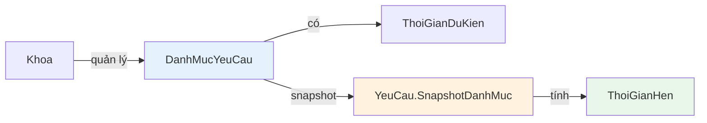
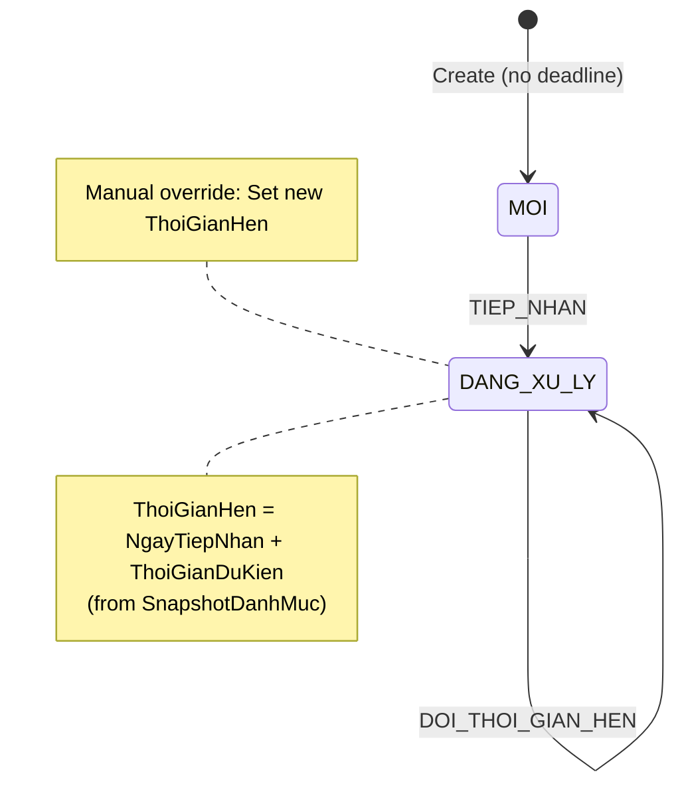

# 📂 03 - CATEGORY SYSTEM & AUTO-DEADLINE

> **Module**: QuanLyCongViec/Ticket (Support Request System)  
> **Version**: 1.0.0  
> **Last Updated**: January 5, 2026

---

## 📖 MỤC LỤC

1. [Overview](#1-overview)
2. [DanhMucYeuCau Model](#2-danhmucyeucau-model)
3. [Snapshot Pattern](#3-snapshot-pattern)
4. [Auto-Deadline Calculation](#4-auto-deadline-calculation)
5. [CRUD Operations](#5-crud-operations)
6. [Frontend Integration](#6-frontend-integration)
7. [Best Practices](#7-best-practices)

---

## 1. OVERVIEW

### 1.1. Purpose

**DanhMucYeuCau** (Request Category) là hệ thống phân loại yêu cầu theo khoa, cho phép:

- Mỗi khoa tự quản lý các loại yêu cầu mà khoa có thể tiếp nhận
- Tự động tính deadline dựa trên thời gian dự kiến
- Sử dụng **snapshot pattern** để đảm bảo data integrity khi danh mục thay đổi

### 1.2. Key Concepts



| Concept            | Description                   | Example                               |
| ------------------ | ----------------------------- | ------------------------------------- |
| **DanhMucYeuCau**  | Template loại yêu cầu         | "Hỗ trợ kỹ thuật", "Vệ sinh phòng"    |
| **ThoiGianDuKien** | Expected completion time      | 2 giờ, 1 ngày                         |
| **Snapshot**       | Frozen copy tại thời điểm tạo | Không bị ảnh hưởng khi DanhMuc update |
| **ThoiGianHen**    | Calculated deadline           | NgayTiepNhan + ThoiGianDuKien         |

### 1.3. Per-Department Management

**Mỗi khoa độc lập:**

```
┌─────────────────────┐
│ Khoa Công nghệ TT   │
├─────────────────────┤
│ ✓ Hỗ trợ kỹ thuật   │ → 2 giờ
│ ✓ Sửa máy in        │ → 1 ngày
│ ✓ Cài đặt phần mềm  │ → 4 giờ
└─────────────────────┘

┌─────────────────────┐
│ Khoa Hành chính     │
├─────────────────────┤
│ ✓ Vệ sinh phòng     │ → 30 phút
│ ✓ Sửa chữa thiết bị │ → 1 ngày
│ ✓ Cung cấp văn phòng phẩm │ → 2 giờ
└─────────────────────┘
```

---

## 2. DANHMUCYEUCAU MODEL

### 2.1. Schema Definition

**File:** `giaobanbv-be/modules/workmanagement/models/DanhMucYeuCau.js`

```typescript
interface DanhMucYeuCau {
  _id: ObjectId;

  // ========== OWNERSHIP ==========
  KhoaID: ObjectId; // Ref: Khoa (unique per khoa, indexed)

  // ========== BASIC INFO ==========
  TenLoaiYeuCau: string; // Category name (max 255 chars)
  MoTa?: string; // Description (max 1000 chars)

  // ========== TIME SETTINGS ==========
  ThoiGianDuKien: number; // Expected completion time (>= 1)
  DonViThoiGian: "PHUT" | "GIO" | "NGAY"; // Time unit

  // ========== STATUS ==========
  TrangThai: "HOAT_DONG" | "NGUNG_HOAT_DONG";

  // ========== DISPLAY ORDER ==========
  ThuTu: number; // For drag-drop reordering

  // ========== SOFT DELETE ==========
  isDeleted: boolean;

  // ========== TIMESTAMPS ==========
  createdAt: Date;
  updatedAt: Date;
}
```

**Indexes:**

```javascript
// Performance optimization
danhMucYeuCauSchema.index({ KhoaID: 1, TrangThai: 1 });
danhMucYeuCauSchema.index({ KhoaID: 1, ThuTu: 1 });
danhMucYeuCauSchema.index({ KhoaID: 1, isDeleted: 1 });
```

### 2.2. Virtual Fields

```javascript
/**
 * Virtual: ThoiGianDuKienFormat
 * Returns: "2 giờ", "1 ngày", "30 phút"
 */
danhMucYeuCauSchema.virtual("ThoiGianDuKienFormat").get(function () {
  const donVi = {
    PHUT: "phút",
    GIO: "giờ",
    NGAY: "ngày",
  };
  return `${
    this.ThoiGianDuKien
  } ${donVi[this.DonViThoiGian] || this.DonViThoiGian}`;
});

// Usage:
const danhMuc = await DanhMucYeuCau.findById(id);
console.log(danhMuc.ThoiGianDuKienFormat); // "2 giờ"
```

### 2.3. Instance Methods

```javascript
/**
 * Ngừng hoạt động danh mục (soft disable)
 */
danhMucYeuCauSchema.methods.ngungHoatDong = function () {
  this.TrangThai = "NGUNG_HOAT_DONG";
  return this.save();
};

/**
 * Kích hoạt lại danh mục
 */
danhMucYeuCauSchema.methods.kichHoat = function () {
  this.TrangThai = "HOAT_DONG";
  return this.save();
};

/**
 * Convert thời gian dự kiến sang phút (để tính toán)
 * - PHUT: giữ nguyên
 * - GIO: × 60
 * - NGAY: × 60 × 24
 */
danhMucYeuCauSchema.methods.tinhThoiGianPhut = function () {
  switch (this.DonViThoiGian) {
    case "GIO":
      return this.ThoiGianDuKien * 60;
    case "NGAY":
      return this.ThoiGianDuKien * 60 * 24;
    default: // PHUT
      return this.ThoiGianDuKien;
  }
};

// Example usage:
const danhMuc = { ThoiGianDuKien: 2, DonViThoiGian: "GIO" };
console.log(danhMuc.tinhThoiGianPhut()); // 120 minutes
```

### 2.4. Static Methods

```javascript
/**
 * Tìm danh mục theo khoa
 * @param {ObjectId} khoaId - ID khoa
 * @param {boolean} chiLayHoatDong - Chỉ lấy danh mục đang hoạt động (default: true)
 */
danhMucYeuCauSchema.statics.timTheoKhoa = function (
  khoaId,
  chiLayHoatDong = true
) {
  const filter = {
    KhoaID: khoaId,
    isDeleted: false,
  };
  if (chiLayHoatDong) {
    filter.TrangThai = "HOAT_DONG";
  }
  return this.find(filter).sort({ ThuTu: 1, createdAt: 1 });
};

/**
 * Kiểm tra danh mục có đang được sử dụng không
 * @param {ObjectId} danhMucId - ID danh mục
 * @returns {boolean} true nếu có yêu cầu đang dùng danh mục này
 */
danhMucYeuCauSchema.statics.kiemTraDangDuocSuDung = async function (danhMucId) {
  const YeuCau = mongoose.model("YeuCau");
  const count = await YeuCau.countDocuments({
    DanhMucYeuCauID: danhMucId,
    isDeleted: false,
  });
  return count > 0;
};
```

---

## 3. SNAPSHOT PATTERN

### 3.1. Why Snapshot?

**Problem Without Snapshot:**

```
Time: T1 - User creates request
├─ DanhMuc: "Hỗ trợ kỹ thuật" → 2 giờ
├─ YeuCau.ThoiGianHen: 2026-01-05 14:00

Time: T2 - Admin updates DanhMuc
├─ DanhMuc: "Hỗ trợ kỹ thuật" → 4 giờ  ⚠️ CHANGED
├─ YeuCau.ThoiGianHen: Still 14:00 (inconsistent!)
└─ Problem: Can't recalculate deadline accurately
```

**Solution With Snapshot:**

```
Time: T1 - User creates request
├─ DanhMuc: "Hỗ trợ kỹ thuật" → 2 giờ
├─ YeuCau.SnapshotDanhMuc: { TenLoaiYeuCau: "Hỗ trợ kỹ thuật", ThoiGianDuKien: 2, DonViThoiGian: "GIO" }
└─ YeuCau.ThoiGianHen: Calculated from snapshot

Time: T2 - Admin updates DanhMuc
├─ DanhMuc: "Hỗ trợ kỹ thuật" → 4 giờ  ✅ Changed
├─ YeuCau.SnapshotDanhMuc: Still { ... 2 giờ ... }  ✅ Preserved
└─ YeuCau.ThoiGianHen: Still accurate (based on original 2 giờ)
```

### 3.2. Snapshot Schema

**Embedded in YeuCau model:**

```javascript
// YeuCau.js
const snapshotDanhMucSchema = new Schema(
  {
    TenLoaiYeuCau: {
      type: String,
      required: true,
    },
    ThoiGianDuKien: {
      type: Number,
      required: true,
    },
    DonViThoiGian: {
      type: String,
      required: true,
    },
  },
  { _id: false } // No separate _id for embedded schema
);

const yeuCauSchema = new Schema({
  // ... other fields ...

  DanhMucYeuCauID: {
    type: Schema.ObjectId,
    ref: "DanhMucYeuCau",
    required: true,
  },

  // Snapshot tại thời điểm tạo
  SnapshotDanhMuc: {
    type: snapshotDanhMucSchema,
    required: true,
  },
});
```

### 3.3. Creating Snapshot

**Backend - yeuCau.service.js:**

```javascript
// taoYeuCau function
async function taoYeuCau(data, nguoiYeuCauId) {
  // 1. Validate danh mục
  const danhMuc = await DanhMucYeuCau.findById(data.DanhMucYeuCauID);

  if (!danhMuc) {
    throw new AppError(
      404,
      "Không tìm thấy danh mục yêu cầu",
      "DANHMUC_NOT_FOUND"
    );
  }

  if (danhMuc.KhoaID.toString() !== khoaDichId.toString()) {
    throw new AppError(
      400,
      "Danh mục yêu cầu không thuộc khoa đích",
      "DANHMUC_INVALID_KHOA"
    );
  }

  if (danhMuc.TrangThai !== "HOAT_DONG") {
    throw new AppError(
      400,
      "Danh mục yêu cầu đã ngừng hoạt động",
      "DANHMUC_INACTIVE"
    );
  }

  // 2. Tạo snapshot (freeze current values)
  const snapshotDanhMuc = {
    TenLoaiYeuCau: danhMuc.TenLoaiYeuCau,
    ThoiGianDuKien: danhMuc.ThoiGianDuKien,
    DonViThoiGian: danhMuc.DonViThoiGian,
  };

  // 3. Tạo yêu cầu với snapshot
  const yeuCau = new YeuCau({
    // ... other fields ...
    DanhMucYeuCauID: data.DanhMucYeuCauID,
    SnapshotDanhMuc: snapshotDanhMuc, // ✅ Saved snapshot
    TrangThai: TRANG_THAI.MOI,
  });

  await yeuCau.save();

  return yeuCau;
}
```

### 3.4. Using Snapshot for Calculations

**YeuCau model - tinhThoiGianHen method:**

```javascript
/**
 * Tính thời gian hẹn dựa trên snapshot
 * @param {Date} tuNgay - Ngày bắt đầu (mặc định là now)
 * @returns {Date} Calculated deadline
 */
yeuCauSchema.methods.tinhThoiGianHen = function (tuNgay = new Date()) {
  // ⚠️ CRITICAL: Always use snapshot, NOT DanhMucYeuCauID
  const { ThoiGianDuKien, DonViThoiGian } = this.SnapshotDanhMuc;

  const result = new Date(tuNgay);

  switch (DonViThoiGian) {
    case "PHUT":
      result.setMinutes(result.getMinutes() + ThoiGianDuKien);
      break;
    case "GIO":
      result.setHours(result.getHours() + ThoiGianDuKien);
      break;
    case "NGAY":
      result.setDate(result.getDate() + ThoiGianDuKien);
      break;
  }

  return result;
};

// Usage in TIEP_NHAN action:
yeuCau.NgayTiepNhan = new Date();
yeuCau.ThoiGianHen = yeuCau.tinhThoiGianHen(yeuCau.NgayTiepNhan);
```

---

## 4. AUTO-DEADLINE CALCULATION

### 4.1. Calculation Formula

**Formula:**

```
ThoiGianHen = NgayTiepNhan + ThoiGianDuKien (converted to time unit)
```

**Conversion Table:**

| DonViThoiGian | ThoiGianDuKien | Calculation | Result      |
| ------------- | -------------- | ----------- | ----------- |
| PHUT          | 30             | +30 minutes | 00:30 later |
| GIO           | 2              | +2 hours    | 02:00 later |
| NGAY          | 1              | +1 day      | 24:00 later |

### 4.2. Calculation Examples

**Example 1: PHUT (Minutes)**

```javascript
const yeuCau = {
  SnapshotDanhMuc: {
    TenLoaiYeuCau: "Vệ sinh phòng",
    ThoiGianDuKien: 30,
    DonViThoiGian: "PHUT",
  },
  NgayTiepNhan: new Date("2026-01-05T10:00:00.000Z"),
};

const thoiGianHen = yeuCau.tinhThoiGianHen(yeuCau.NgayTiepNhan);
// Result: 2026-01-05T10:30:00.000Z (30 minutes later)
```

**Example 2: GIO (Hours)**

```javascript
const yeuCau = {
  SnapshotDanhMuc: {
    TenLoaiYeuCau: "Hỗ trợ kỹ thuật",
    ThoiGianDuKien: 2,
    DonViThoiGian: "GIO",
  },
  NgayTiepNhan: new Date("2026-01-05T10:00:00.000Z"),
};

const thoiGianHen = yeuCau.tinhThoiGianHen(yeuCau.NgayTiepNhan);
// Result: 2026-01-05T12:00:00.000Z (2 hours later)
```

**Example 3: NGAY (Days)**

```javascript
const yeuCau = {
  SnapshotDanhMuc: {
    TenLoaiYeuCau: "Sửa chữa thiết bị",
    ThoiGianDuKien: 1,
    DonViThoiGian: "NGAY",
  },
  NgayTiepNhan: new Date("2026-01-05T10:00:00.000Z"),
};

const thoiGianHen = yeuCau.tinhThoiGianHen(yeuCau.NgayTiepNhan);
// Result: 2026-01-06T10:00:00.000Z (1 day later)
```

### 4.3. When Deadline is Calculated



**State-by-State:**

| State         | ThoiGianHen | Calculated When           | Can Change?                |
| ------------- | ----------- | ------------------------- | -------------------------- |
| MOI           | `null`      | Not calculated yet        | -                          |
| DANG_XU_LY    | `Date`      | During TIEP_NHAN action   | ✅ Yes (DOI_THOI_GIAN_HEN) |
| DA_HOAN_THANH | `Date`      | Preserved from DANG_XU_LY | ❌ No                      |
| DA_DONG       | `Date`      | Preserved                 | ❌ No                      |
| TU_CHOI       | `null`      | N/A                       | -                          |

### 4.4. Side Effects in TIEP_NHAN

**yeuCauStateMachine.js - applySideEffects:**

```javascript
function applySideEffects(yeuCau, action, data, nguoiThucHienId) {
  const now = new Date();

  if (action === "TIEP_NHAN") {
    // 1. Set người xử lý
    yeuCau.NguoiXuLyID = nguoiThucHienId;

    // 2. Set thời gian tiếp nhận
    yeuCau.NgayTiepNhan = now;

    // 3. Calculate deadline
    if (data.ThoiGianHen) {
      // Manual deadline provided
      yeuCau.ThoiGianHen = data.ThoiGianHen;
    } else {
      // Auto-calculate from snapshot
      yeuCau.ThoiGianHen = yeuCau.tinhThoiGianHen(now);
    }
  }
}
```

### 4.5. Manual Deadline Override

**DOI_THOI_GIAN_HEN action:**

```javascript
// User can manually change deadline
POST /api/workmanagement/yeu-cau/:id/doi-thoi-gian-hen
Body: {
  ThoiGianHen: "2026-01-08T15:00:00.000Z",  // New deadline
  LyDoDoiThoiGianHen: "Cần thêm thời gian do vấn đề phức tạp"
}

// Side effects:
yeuCau.ThoiGianHen = data.ThoiGianHen;  // Override auto-calculated value
yeuCau.LyDoDoiThoiGianHen = data.LyDoDoiThoiGianHen;
```

---

## 5. CRUD OPERATIONS

### 5.1. Permission Check

**Only Quản lý khoa can manage categories:**

```javascript
// danhMucYeuCau.controller.js
async function checkQuanLyPermission(req, khoaId) {
  const user = await User.findById(req.userId).lean();

  if (!user?.NhanVienID) {
    throw new AppError(
      400,
      "Tài khoản chưa liên kết với nhân viên",
      "USER_NO_NHANVIEN"
    );
  }

  // Admin bypass
  const isAdmin = ["admin", "superadmin"].includes(
    (user.PhanQuyen || "").toLowerCase()
  );
  if (isAdmin) {
    return { nhanVienId: user.NhanVienID, isAdmin: true };
  }

  // Check if user is department manager
  const config = await CauHinhThongBaoKhoa.findOne({ KhoaID: khoaId });
  if (!config || !config.laQuanLyKhoa(user.NhanVienID)) {
    throw new AppError(
      403,
      "Bạn không có quyền quản lý danh mục của khoa này",
      "PERMISSION_DENIED"
    );
  }

  return { nhanVienId: user.NhanVienID, isAdmin: false };
}
```

### 5.2. Create (POST)

**API Endpoint:**

```javascript
POST /api/workmanagement/danh-muc-yeu-cau
Content-Type: application/json

{
  "KhoaID": "66b1dba74f79822a4752d90d",
  "TenLoaiYeuCau": "Hỗ trợ kỹ thuật",
  "MoTa": "Hỗ trợ sửa chữa, cài đặt thiết bị công nghệ thông tin",
  "ThoiGianDuKien": 2,
  "DonViThoiGian": "GIO",
  "ThuTu": 1
}
```

**Controller:**

```javascript
controller.tao = catchAsync(async (req, res, next) => {
  const { KhoaID } = req.body;

  if (!KhoaID) {
    throw new AppError(400, "Thiếu thông tin khoa", "MISSING_KHOA_ID");
  }

  // Check permission
  await checkQuanLyPermission(req, KhoaID);

  // Create
  const danhMuc = new DanhMucYeuCau(req.body);
  await danhMuc.save();

  return sendResponse(
    res,
    201,
    true,
    danhMuc,
    null,
    "Tạo danh mục yêu cầu thành công"
  );
});
```

### 5.3. Read (GET)

**Get by Department:**

```javascript
GET /api/workmanagement/danh-muc-yeu-cau?khoaId=66b1dba74f79822a4752d90d&chiLayHoatDong=true

Response:
{
  "success": true,
  "data": [
    {
      "_id": "67890abc...",
      "KhoaID": "66b1dba74f79822a4752d90d",
      "TenLoaiYeuCau": "Hỗ trợ kỹ thuật",
      "MoTa": "Hỗ trợ sửa chữa, cài đặt thiết bị công nghệ thông tin",
      "ThoiGianDuKien": 2,
      "DonViThoiGian": "GIO",
      "TrangThai": "HOAT_DONG",
      "ThuTu": 1,
      "createdAt": "2026-01-01T00:00:00.000Z",
      "updatedAt": "2026-01-01T00:00:00.000Z"
    },
    // ... more categories
  ],
  "message": "Lấy danh mục yêu cầu thành công"
}
```

**Get Departments with Categories:**

```javascript
GET /api/workmanagement/danh-muc-yeu-cau/khoa-co-danh-muc

Response:
{
  "success": true,
  "data": [
    { "_id": "66b1dba7...", "TenKhoa": "Khoa Công nghệ thông tin", "MaKhoa": "CNTT" },
    { "_id": "66b1dba8...", "TenKhoa": "Khoa Hành chính", "MaKhoa": "HC" }
  ],
  "message": "Lấy danh sách khoa có danh mục thành công"
}
```

### 5.4. Update (PUT)

**API Endpoint:**

```javascript
PUT /api/workmanagement/danh-muc-yeu-cau/:id
Content-Type: application/json

{
  "TenLoaiYeuCau": "Hỗ trợ kỹ thuật máy tính",
  "ThoiGianDuKien": 4,
  "DonViThoiGian": "GIO",
  "TrangThai": "HOAT_DONG"
}
```

**Controller:**

```javascript
controller.capNhat = catchAsync(async (req, res, next) => {
  const { id } = req.params;

  const danhMuc = await DanhMucYeuCau.findById(id);
  if (!danhMuc || danhMuc.isDeleted) {
    throw new AppError(404, "Không tìm thấy danh mục", "DANHMUC_NOT_FOUND");
  }

  // Check permission
  await checkQuanLyPermission(req, danhMuc.KhoaID);

  // Update allowed fields
  const allowedFields = [
    "TenLoaiYeuCau",
    "MoTa",
    "ThoiGianDuKien",
    "DonViThoiGian",
    "TrangThai",
    "ThuTu",
  ];

  for (const field of allowedFields) {
    if (req.body[field] !== undefined) {
      danhMuc[field] = req.body[field];
    }
  }

  await danhMuc.save();

  return sendResponse(
    res,
    200,
    true,
    danhMuc,
    null,
    "Cập nhật danh mục thành công"
  );
});
```

**⚠️ IMPORTANT**: Updating DanhMuc **does NOT affect** existing YeuCau (snapshot pattern protects them).

### 5.5. Delete (DELETE)

**Soft Delete with Usage Check:**

```javascript
controller.xoa = catchAsync(async (req, res, next) => {
  const { id } = req.params;

  const danhMuc = await DanhMucYeuCau.findById(id);
  if (!danhMuc || danhMuc.isDeleted) {
    throw new AppError(404, "Không tìm thấy danh mục", "DANHMUC_NOT_FOUND");
  }

  await checkQuanLyPermission(req, danhMuc.KhoaID);

  // Check if in use
  const dangSuDung = await DanhMucYeuCau.kiemTraDangDuocSuDung(id);
  if (dangSuDung) {
    throw new AppError(
      400,
      "Không thể xóa danh mục đang được sử dụng. Vui lòng chuyển sang trạng thái Ngừng hoạt động.",
      "DANHMUC_IN_USE"
    );
  }

  // Soft delete
  danhMuc.isDeleted = true;
  await danhMuc.save();

  return sendResponse(res, 200, true, null, null, "Xóa danh mục thành công");
});
```

**Lifecycle:**

```
HOAT_DONG → (toggle status) → NGUNG_HOAT_DONG
    ↓                                ↓
(can't delete if used)      (can delete if not used)
```

### 5.6. Reorder (PUT)

**Drag-drop support:**

```javascript
PUT /api/workmanagement/danh-muc-yeu-cau/sapxep
Content-Type: application/json

{
  "khoaId": "66b1dba74f79822a4752d90d",
  "items": [
    { "id": "67890abc...", "thuTu": 1 },
    { "id": "67890abd...", "thuTu": 2 },
    { "id": "67890abe...", "thuTu": 3 }
  ]
}
```

**Controller:**

```javascript
controller.sapXep = catchAsync(async (req, res, next) => {
  const { khoaId, items } = req.body;

  if (!khoaId || !items || !Array.isArray(items)) {
    throw new AppError(400, "Dữ liệu không hợp lệ", "INVALID_DATA");
  }

  await checkQuanLyPermission(req, khoaId);

  // Bulk update
  const bulkOps = items.map((item) => ({
    updateOne: {
      filter: { _id: item.id, KhoaID: khoaId },
      update: { $set: { ThuTu: item.thuTu } },
    },
  }));

  await DanhMucYeuCau.bulkWrite(bulkOps);

  return sendResponse(
    res,
    200,
    true,
    null,
    null,
    "Sắp xếp danh mục thành công"
  );
});
```

---

## 6. FRONTEND INTEGRATION

### 6.1. Redux Slice

**File:** `fe-bcgiaobanbvt/src/features/QuanLyCongViec/Ticket/danhMucYeuCauSlice.js`

```javascript
const initialState = {
  danhMucList: [],
  isLoadingDanhMuc: false,
  error: null,
};

const slice = createSlice({
  name: "danhMucYeuCau",
  initialState,
  reducers: {
    startDanhMucLoading(state) {
      state.isLoadingDanhMuc = true;
    },
    getDanhMucSuccess(state, action) {
      state.isLoadingDanhMuc = false;
      state.danhMucList = action.payload;
    },
    hasError(state, action) {
      state.isLoadingDanhMuc = false;
      state.error = action.payload;
    },
  },
});

// Thunk
export const getDanhMucByKhoa = (khoaId) => async (dispatch) => {
  dispatch(slice.actions.startDanhMucLoading());
  try {
    const response = await apiService.get(
      `/workmanagement/danh-muc-yeu-cau?khoaId=${khoaId}`
    );
    dispatch(slice.actions.getDanhMucSuccess(response.data.data));
  } catch (error) {
    dispatch(slice.actions.hasError(error.message));
    toast.error(error.message);
  }
};
```

### 6.2. Admin Page

**File:** `fe-bcgiaobanbvt/src/features/QuanLyCongViec/Ticket/DanhMucYeuCauAdminPage.js`

**Features:**

- Select department (Autocomplete)
- Table display with ThuTu, TenLoaiYeuCau, ThoiGianDuKien, TrangThai
- Create/Edit dialog with validation
- Delete with confirmation
- Drag-drop reordering

**Key Components:**

```javascript
function DanhMucYeuCauAdminPage() {
  const dispatch = useDispatch();
  const danhMucList = useSelector(selectDanhMucList);
  const [selectedKhoa, setSelectedKhoa] = useState(null);

  // Load categories when department selected
  useEffect(() => {
    if (selectedKhoa) {
      dispatch(getDanhMucByKhoa(selectedKhoa._id));
    }
  }, [dispatch, selectedKhoa]);

  return (
    <Container maxWidth="lg">
      {/* Department selector */}
      <Autocomplete
        options={khoaOptions}
        getOptionLabel={(opt) => opt.TenKhoa}
        value={selectedKhoa}
        onChange={(e, newValue) => setSelectedKhoa(newValue)}
        renderInput={(params) => <TextField {...params} label="Chọn khoa" />}
      />

      {/* Category table */}
      {selectedKhoa && (
        <TableContainer component={Paper}>
          <Table>
            <TableHead>
              <TableRow>
                <TableCell>STT</TableCell>
                <TableCell>Tên danh mục</TableCell>
                <TableCell>Thời gian dự kiến</TableCell>
                <TableCell>Trạng thái</TableCell>
                <TableCell>Thao tác</TableCell>
              </TableRow>
            </TableHead>
            <TableBody>
              {danhMucList.map((item, index) => (
                <TableRow key={item._id}>
                  <TableCell>{index + 1}</TableCell>
                  <TableCell>{item.TenLoaiYeuCau}</TableCell>
                  <TableCell>
                    <Chip
                      icon={<TimeIcon />}
                      label={formatThoiGianDuKien(
                        item.ThoiGianDuKien,
                        item.DonViThoiGian
                      )}
                      size="small"
                    />
                  </TableCell>
                  <TableCell>
                    <Chip
                      label={
                        item.TrangThai === "HOAT_DONG" ? "Hoạt động" : "Ngừng"
                      }
                      color={
                        item.TrangThai === "HOAT_DONG" ? "success" : "default"
                      }
                      size="small"
                    />
                  </TableCell>
                  <TableCell>
                    <IconButton onClick={() => handleEdit(item)}>
                      <EditIcon />
                    </IconButton>
                    <IconButton onClick={() => handleDelete(item._id)}>
                      <DeleteIcon />
                    </IconButton>
                  </TableCell>
                </TableRow>
              ))}
            </TableBody>
          </Table>
        </TableContainer>
      )}
    </Container>
  );
}
```

### 6.3. Form Validation

**Yup schema:**

```javascript
const danhMucSchema = Yup.object().shape({
  TenLoaiYeuCau: Yup.string()
    .required("Tên danh mục là bắt buộc")
    .min(2, "Tên danh mục phải có ít nhất 2 ký tự")
    .max(255, "Tên danh mục không quá 255 ký tự"),

  MoTa: Yup.string().max(1000, "Mô tả không quá 1000 ký tự"),

  ThoiGianDuKien: Yup.number()
    .transform((value) => (isNaN(value) ? undefined : value))
    .required("Thời gian dự kiến là bắt buộc")
    .min(1, "Thời gian dự kiến phải >= 1"),

  DonViThoiGian: Yup.string()
    .oneOf(["PHUT", "GIO", "NGAY"], "Đơn vị không hợp lệ")
    .default("PHUT"),

  ThuTu: Yup.number()
    .transform((value) => (isNaN(value) ? 0 : value))
    .min(0, "Thứ tự phải >= 0"),
});
```

### 6.4. Usage in YeuCauForm

**Select category when creating request:**

```javascript
// YeuCauFormDialog.js
function YeuCauFormDialog({ open, onClose }) {
  const danhMucList = useSelector(selectDanhMucList);
  const watchKhoaDichID = watch("KhoaDichID");

  // Load categories when department selected
  useEffect(() => {
    if (watchKhoaDichID) {
      dispatch(getDanhMucByKhoa(watchKhoaDichID));
    }
  }, [dispatch, watchKhoaDichID]);

  return (
    <Dialog open={open} onClose={onClose}>
      <FormProvider methods={methods} onSubmit={handleSubmit(onSubmit)}>
        {/* Department selector */}
        <Autocomplete
          options={khoaOptions}
          getOptionLabel={(opt) => opt.TenKhoa}
          value={selectedKhoa}
          onChange={(e, newValue) => {
            methods.setValue("KhoaDichID", newValue?._id || "");
            methods.setValue("DanhMucYeuCauID", ""); // Reset category
          }}
          renderInput={(params) => (
            <TextField {...params} label="Khoa xử lý *" />
          )}
        />

        {/* Category selector (only shows after department selected) */}
        {watchKhoaDichID && (
          <Autocomplete
            options={danhMucList}
            getOptionLabel={(dm) => dm.TenLoaiYeuCau}
            value={danhMucList.find((dm) => dm._id === watchDanhMucID) || null}
            onChange={(e, newValue) => {
              methods.setValue("DanhMucYeuCauID", newValue?._id || "");
            }}
            renderOption={(props, option) => (
              <Box component="li" {...props}>
                <Stack
                  direction="row"
                  spacing={1}
                  alignItems="center"
                  sx={{ width: "100%" }}
                >
                  <Box sx={{ flex: 1 }}>
                    <Typography variant="body2">
                      {option.TenLoaiYeuCau}
                    </Typography>
                    {option.MoTa && (
                      <Typography variant="caption" color="text.secondary">
                        {option.MoTa}
                      </Typography>
                    )}
                  </Box>
                  <Chip
                    icon={<TimeIcon />}
                    label={formatThoiGianDuKien(
                      option.ThoiGianDuKien,
                      option.DonViThoiGian
                    )}
                    size="small"
                  />
                </Stack>
              </Box>
            )}
            renderInput={(params) => (
              <TextField {...params} label="Loại yêu cầu *" />
            )}
          />
        )}
      </FormProvider>
    </Dialog>
  );
}
```

---

## 7. BEST PRACTICES

### 7.1. Category Design Guidelines

**✅ DO:**

```
✓ Tên rõ ràng: "Hỗ trợ kỹ thuật máy tính"
✓ Thời gian thực tế: 2 giờ (không quá lạc quan)
✓ Mô tả chi tiết scope: "Hỗ trợ sửa chữa, cài đặt phần mềm, troubleshooting"
✓ Sắp xếp theo mức độ ưu tiên (ThuTu)
✓ Ngừng hoạt động thay vì xóa khi không dùng nữa
```

**❌ DON'T:**

```
✗ Tên mơ hồ: "Yêu cầu khác"
✗ Thời gian không thực tế: 5 phút cho hỗ trợ phức tạp
✗ Không có mô tả
✗ Xóa danh mục đang được sử dụng
✗ Tạo quá nhiều danh mục tương tự nhau
```

### 7.2. Time Estimation Best Practices

| Loại yêu cầu                    | Đơn vị khuyến nghị | Lý do             |
| ------------------------------- | ------------------ | ----------------- |
| Vệ sinh, giao văn phòng phẩm    | PHUT (30-60)       | Tác vụ nhanh      |
| Hỗ trợ kỹ thuật, sửa chữa nhỏ   | GIO (1-4)          | Tác vụ trong ngày |
| Sửa chữa lớn, cung cấp thiết bị | NGAY (1-3)         | Cần thời gian dài |

### 7.3. Snapshot Pattern Best Practices

**✅ Always use SnapshotDanhMuc for calculations:**

```javascript
// ✅ CORRECT: Use snapshot
const thoiGianHen = yeuCau.tinhThoiGianHen();

// ❌ WRONG: Don't fetch DanhMucYeuCau again
const danhMuc = await DanhMucYeuCau.findById(yeuCau.DanhMucYeuCauID);
const thoiGianHen = calculateDeadline(danhMuc.ThoiGianDuKien); // ❌ Wrong!
```

**✅ Update snapshot only when absolutely necessary:**

```javascript
// Rare case: Admin manually fixes broken snapshot
async function suaSnapshot(yeuCauId, newSnapshot) {
  const yeuCau = await YeuCau.findById(yeuCauId);

  // Validate yêu cầu chưa bắt đầu xử lý
  if (yeuCau.TrangThai !== "MOI") {
    throw new AppError(400, "Không thể sửa snapshot sau khi đã tiếp nhận");
  }

  yeuCau.SnapshotDanhMuc = newSnapshot;
  await yeuCau.save();
}
```

### 7.4. Permission Best Practices

**✅ Restrict category management:**

```
Only Quản lý khoa + Admin can:
- Create categories
- Edit categories
- Delete/disable categories
- Reorder categories

Everyone can:
- View active categories (when creating request)
```

**✅ Check in-use before delete:**

```javascript
// Always check before delete
const dangSuDung = await DanhMucYeuCau.kiemTraDangDuocSuDung(id);
if (dangSuDung) {
  // Suggest NGUNG_HOAT_DONG instead
  throw new AppError(400, "Vui lòng chuyển sang trạng thái Ngừng hoạt động");
}
```

### 7.5. Performance Optimization

**✅ Index usage:**

```javascript
// Efficient queries
await DanhMucYeuCau.find({
  KhoaID: khoaId, // Uses index { KhoaID: 1, TrangThai: 1 }
  TrangThai: "HOAT_DONG",
}).sort({ ThuTu: 1 }); // Uses index { KhoaID: 1, ThuTu: 1 }
```

**✅ Caching strategies:**

```javascript
// Frontend: Cache categories per department
const categoryCache = {
  [khoaId]: danhMucList,
};

// Only refetch if khoaId changes
if (!categoryCache[khoaId]) {
  dispatch(getDanhMucByKhoa(khoaId));
}
```

---

## 🔗 RELATED DOCUMENTS

**Prerequisites:**

- [00_OVERVIEW.md](./00_OVERVIEW.md) - System architecture
- [02_DISPATCH_SYSTEM.md](./02_DISPATCH_SYSTEM.md) - CauHinhThongBaoKhoa for permissions

**Next Steps:**

- [04_ASSIGNMENT_FLOW.md](./04_ASSIGNMENT_FLOW.md) - How categories are used in request flow

**Implementation:**

- Backend: `giaobanbv-be/modules/workmanagement/models/DanhMucYeuCau.js`
- Backend: `giaobanbv-be/modules/workmanagement/controllers/danhMucYeuCau.controller.js`
- Backend: `giaobanbv-be/modules/workmanagement/models/YeuCau.js` (SnapshotDanhMuc)
- Frontend: `fe-bcgiaobanbvt/src/features/QuanLyCongViec/Ticket/DanhMucYeuCauAdminPage.js`

---

**END OF CATEGORY SYSTEM** 📂
