# 🔄 04 - ASSIGNMENT FLOW & END-TO-END SCENARIOS

> **Module**: QuanLyCongViec/Ticket (Support Request System)  
> **Version**: 1.0.0  
> **Last Updated**: January 5, 2026

---

## 📖 MỤC LỤC

1. [Overview](#1-overview)
2. [Happy Path Flow](#2-happy-path-flow)
3. [Alternative Scenarios](#3-alternative-scenarios)
4. [Error & Edge Cases](#4-error--edge-cases)
5. [Detailed Phase Breakdown](#5-detailed-phase-breakdown)
6. [Integration Points](#6-integration-points)

---

## 1. OVERVIEW

### 1.1. Complete Request Lifecycle

**7 Major Phases:**


### 1.2. Key Decision Points

| Phase        | Decision             | Outcome A                   | Outcome B                   |
| ------------ | -------------------- | --------------------------- | --------------------------- |
| **Create**   | LoaiNguoiNhan?       | KHOA → Dispatchers notified | CA_NHAN → Direct to handler |
| **Dispatch** | isDieuPhoi?          | Can assign to handler       | Must wait for dispatcher    |
| **Accept**   | Handler decision?    | TIEP_NHAN → DANG_XU_LY      | TU_CHOI → TU_CHOI state     |
| **Process**  | On time?             | Normal complete             | QuaHan flag = true          |
| **Complete** | Requester satisfied? | Rate + Close                | YEU_CAU_XU_LY_TIEP          |
| **Close**    | Within 7 days?       | Can MO_LAI                  | Cannot reopen               |

---

## 2. HAPPY PATH FLOW

### 2.1. Scenario: Department-Level Request (KHOA)

**Actors:** Requester, Dispatcher, Handler

**Preconditions:**

- Khoa đích có cấu hình (CauHinhThongBaoKhoa)
- Khoa đích có ít nhất 1 người điều phối
- Danh mục yêu cầu đang hoạt động

**Flow Sequence:**

```mermaid
sequenceDiagram
    autonumber
    participant R as Requester<br/>(Khoa A)
    participant S as System
    participant D as Dispatcher<br/>(Khoa B)
    participant H as Handler<br/>(Khoa B)

    Note over R,H: PHASE 1: CREATE REQUEST

    R->>S: POST /yeucau<br/>{LoaiNguoiNhan: "KHOA", KhoaDichID, ...}

    S->>S: Validate: Khoa đích có người điều phối?
    S->>S: Get DanhMucYeuCau (snapshot)
    S->>S: Generate MaYeuCau (YC2026000123)
    S->>S: Create YeuCau (TrangThai: MOI)
    S->>S: Create LichSuYeuCau (TAO_MOI)

    S-->>R: 201 Created {yeuCau}

    Note over R,H: PHASE 2: NOTIFICATION

    S->>D: 🔔 Notification: "Yêu cầu mới YC2026000123"
    D->>D: See notification in "Mới đến" tab

    Note over R,H: PHASE 3: DISPATCH

    D->>S: POST /yeucau/:id/dieu-phoi<br/>{NhanVienXuLyID: Handler}

    S->>S: Validate: isDieuPhoi = true
    S->>S: Update: NguoiDieuPhoiID = Dispatcher
    S->>S: Update: NguoiDuocDieuPhoiID = Handler
    S->>S: Update: NgayDieuPhoi = now()
    S->>S: Create LichSuYeuCau (DIEU_PHOI)

    S-->>D: 200 OK
    S->>H: 🔔 Notification: "Bạn được giao YC2026000123"

    Note over R,H: PHASE 4: ACCEPT

    H->>S: POST /yeucau/:id/tiep-nhan<br/>{ThoiGianHen: "2026-01-08T10:00"}

    S->>S: Validate: isNguoiDuocDieuPhoi = true
    S->>S: Transition: MOI → DANG_XU_LY
    S->>S: Update: NguoiXuLyID = Handler
    S->>S: Update: NgayTiepNhan = now()
    S->>S: Calculate: ThoiGianHen (from snapshot or manual)
    S->>S: Create LichSuYeuCau (TIEP_NHAN)

    S-->>H: 200 OK
    S->>R: 🔔 Notification: "YC2026000123 đã được tiếp nhận"

    Note over R,H: PHASE 5: PROCESS

    loop Work Progress
        H->>S: POST /yeucau/:id/binh-luan<br/>{NoiDung: "Đang xử lý..."}
        S->>S: Create BinhLuan
        S->>S: Create LichSuYeuCau (THEM_BINH_LUAN)
        S-->>R: 🔔 Notification: "Handler đã comment"

        H->>S: POST /yeucau/:id/file/upload<br/>(Attach evidence)
        S->>S: Upload to Cloudinary
        S->>S: Create TepTin record
        S->>S: Create LichSuYeuCau (THEM_FILE)
    end

    Note over R,H: PHASE 6: COMPLETE

    H->>S: POST /yeucau/:id/hoan-thanh

    S->>S: Validate: isNguoiXuLy = true
    S->>S: Transition: DANG_XU_LY → DA_HOAN_THANH
    S->>S: Update: NgayHoanThanh = now()
    S->>S: Calculate: QuaHan = (now > ThoiGianHen)
    S->>S: Create LichSuYeuCau (HOAN_THANH)

    S-->>H: 200 OK
    S->>R: 🔔 Notification: "YC2026000123 đã hoàn thành"

    Note over R,H: PHASE 7: RATE & CLOSE

    R->>S: POST /yeucau/:id/danh-gia<br/>{SoSao: 5, NhanXet: "Tuyệt vời!"}

    S->>S: Validate: isNguoiGui = true
    S->>S: Validate: SoSao 1-5, NhanXet required if < 3
    S->>S: Transition: DA_HOAN_THANH → DA_DONG
    S->>S: Update: DanhGia = {SoSao, NhanXet, NgayDanhGia}
    S->>S: Update: NgayDong = now()
    S->>S: Create LichSuYeuCau (DANH_GIA)

    S-->>R: 200 OK
    S->>H: 🔔 Notification: "YC2026000123 được đánh giá 5⭐"

    Note over R,H: ✅ REQUEST CLOSED
```



### 2.2. Timeline Example

```
T0 (10:00): Create request → MOI
T1 (10:05): Dispatcher assigns → Still MOI, but NguoiDuocDieuPhoiID set
T2 (10:30): Handler accepts → DANG_XU_LY (ThoiGianHen = T2 + 2 hours = 12:30)
T3 (11:00): Handler adds comment
T4 (11:45): Handler uploads file
T5 (12:15): Handler completes → DA_HOAN_THANH (QuaHan = false, on time!)
T6 (12:20): Requester rates 5⭐ → DA_DONG

Total duration: 2h 20m
On-time completion: ✅
```

---

## 3. ALTERNATIVE SCENARIOS

### 3.1. Direct Assignment (CA_NHAN Mode)

**Scenario:** Gửi trực tiếp đến cá nhân, skip dispatcher


**Key Differences:**

| Aspect               | KHOA Mode                         | CA_NHAN Mode      |
| -------------------- | --------------------------------- | ----------------- |
| **NguoiNhanID**      | null                              | Handler ObjectId  |
| **Dispatch needed**  | ✅ Yes                            | ❌ No (direct)    |
| **Notification**     | All dispatchers                   | Direct to handler |
| **Permission check** | isDieuPhoi OR isNguoiDuocDieuPhoi | isNguoiNhan       |

### 3.2. Rejection → Appeal Flow

**Scenario:** Handler từ chối, requester khiếu nại

```mermaid
sequenceDiagram
    autonumber
    participant R as Requester
    participant S as System
    participant H as Handler
    participant D as Dispatcher

    Note over R,D: Handler rejects request

    H->>S: POST /yeucau/:id/tu-choi<br/>{LyDoTuChoiID, GhiChu}

    S->>S: Transition: MOI → TU_CHOI
    S->>S: Update: LyDoTuChoiID, NgayTuChoi
    S->>S: Create LichSuYeuCau (TU_CHOI)

    S-->>H: 200 OK
    S->>R: 🔔 "YC bị từ chối: {{LyDo}}"

    Note over R,D: Requester appeals rejection

    R->>S: POST /yeucau/:id/appeal<br/>{LyDoAppeal: "Đây là khẩn cấp..."}

    S->>S: Validate: isNguoiGui = true
    S->>S: Validate: LyDoAppeal min 50 chars
    S->>S: Transition: TU_CHOI → MOI
    S->>S: Clear: LyDoTuChoiID, NgayTuChoi
    S->>S: Store: LyDoAppeal in history
    S->>S: Create LichSuYeuCau (APPEAL)

    S-->>R: 200 OK
    S->>D: 🔔 "YC2026000123 khiếu nại: {{LyDoAppeal}}"

    Note over R,D: Dispatcher reviews and re-assigns

    D->>S: POST /yeucau/:id/dieu-phoi<br/>(Assign to different handler)

    Note over R,D: Flow continues from dispatch phase
```



**Appeal Constraints:**

```javascript
// LyDoAppeal validation
{
  LyDoAppeal: {
    type: String,
    required: true,
    minlength: [50, "Lý do khiếu nại phải ít nhất 50 ký tự"],
    maxlength: [1000, "Lý do khiếu nại không quá 1000 ký tự"]
  }
}
```

### 3.3. Request More Work (YEU_CAU_XU_LY_TIEP)

**Scenario:** Requester không hài lòng, yêu cầu xử lý tiếp

```mermaid
sequenceDiagram
    autonumber
    participant R as Requester
    participant S as System
    participant H as Handler

    Note over R,H: Request completed

    S->>S: TrangThai = DA_HOAN_THANH
    S->>R: 🔔 Notification

    Note over R,H: Requester checks and not satisfied

    R->>S: POST /yeucau/:id/yeu-cau-xu-ly-tiep<br/>{GhiChu: "Còn vấn đề chưa giải quyết"}

    S->>S: Validate: isNguoiGui = true
    S->>S: Transition: DA_HOAN_THANH → DANG_XU_LY
    S->>S: Clear: NgayHoanThanh
    S->>S: Keep: ThoiGianHen (or extend if needed)
    S->>S: Create LichSuYeuCau (YEU_CAU_XU_LY_TIEP)

    S-->>R: 200 OK
    S->>H: 🔔 "YC2026000123 cần xử lý tiếp"

    Note over R,H: Handler continues processing

    H->>S: Continue working...
    H->>S: POST /yeucau/:id/hoan-thanh (again)

    Note over R,H: Second attempt at completion
```



### 3.4. Reopen After Close (MO_LAI)

**Scenario:** Mở lại yêu cầu đã đóng (trong 7 ngày)

```mermaid
sequenceDiagram
    autonumber
    participant R as Requester
    participant S as System
    participant H as Handler

    Note over R,H: Request closed

    S->>S: TrangThai = DA_DONG
    S->>S: NgayDong = T0

    Note over R,H: Day 3: Issue found

    R->>S: POST /yeucau/:id/mo-lai<br/>{LyDoMoLai: "Phát hiện lỗi mới"}

    S->>S: Validate: isNguoiGui OR isNguoiXuLy = true
    S->>S: Validate: (now - NgayDong) <= 7 days ✅
    S->>S: Transition: DA_DONG → DANG_XU_LY
    S->>S: Clear: NgayDong
    S->>S: Keep: NgayHoanThanh (history)
    S->>S: Create LichSuYeuCau (MO_LAI)

    S-->>R: 200 OK
    S->>H: 🔔 "YC2026000123 được mở lại"

    Note over R,H: Handler resumes work
```



**Reopen Validation:**

```javascript
// Time limit check in yeuCauStateMachine.js
function validateTimeLimit(yeuCau, transitionConfig) {
  const { days, from } = transitionConfig.timeLimit; // { days: 7, from: "NgayDong" }
  const fromDate = yeuCau[from]; // yeuCau.NgayDong

  const now = new Date();
  const diffDays = (now - fromDate) / (1000 * 60 * 60 * 24);

  if (diffDays > days) {
    throw new AppError(
      400,
      `Đã quá ${days} ngày, không thể mở lại`,
      "TIME_LIMIT_EXCEEDED"
    );
  }
}
```

### 3.5. Escalation (NHAC_LAI & BAO_QUAN_LY)

**Scenario:** Yêu cầu quá hạn, requester escalate

```mermaid
sequenceDiagram
    autonumber
    participant R as Requester
    participant S as System
    participant D as Dispatcher
    participant M as Manager

    Note over R,M: Request overdue (ThoiGianHen passed)

    S->>S: QuaHan = true (computed field)

    Note over R,M: Day 1: Requester reminds (max 3/day)

    R->>S: POST /yeucau/:id/nhac-lai

    S->>S: Validate rate limit: NHAC_LAI (3/day)
    S->>S: Count today's NHAC_LAI in LichSuYeuCau
    S->>S: Check: count < 3 ✅
    S->>S: Create LichSuYeuCau (NHAC_LAI)

    S-->>R: 200 OK
    S->>D: 🔔 "Nhắc nhở: YC2026000123 quá hạn"

    Note over R,M: Day 3: Still not resolved, escalate to manager

    R->>S: POST /yeucau/:id/bao-quan-ly<br/>{LyDo: "Quá hạn 3 ngày"}

    S->>S: Validate rate limit: BAO_QUAN_LY (1/day)
    S->>S: Check: count < 1 ✅
    S->>S: Get: arrQuanLyKhoaIDs from CauHinhThongBaoKhoa
    S->>S: Create LichSuYeuCau (BAO_QUAN_LY)

    S-->>R: 200 OK
    S->>M: 🔔 "Cần xem xét: YC2026000123 quá hạn 3 ngày"

    Note over R,M: Manager intervenes
```



**Rate Limits:**

| Action      | Limit | Period | Reason                      |
| ----------- | ----- | ------ | --------------------------- |
| NHAC_LAI    | 3     | 1 day  | Prevent spam to dispatchers |
| BAO_QUAN_LY | 1     | 1 day  | Escalation should be rare   |

---

## 4. ERROR & EDGE CASES

### 4.1. Validation Errors

**Error 1: Khoa chưa cấu hình**

```javascript
// Creating request to department without config
POST /yeucau
Body: { KhoaDichID: "xxx...", LoaiNguoiNhan: "KHOA" }

Response: 400 Bad Request
{
  "success": false,
  "message": "Khoa đích chưa được cấu hình để nhận yêu cầu",
  "errors": { "code": "KHOA_CHUA_CAU_HINH" }
}
```

**Error 2: Danh mục ngừng hoạt động**

```javascript
// Using inactive category
POST /yeucau
Body: { DanhMucYeuCauID: "yyy..." }

Response: 400 Bad Request
{
  "success": false,
  "message": "Danh mục yêu cầu đã ngừng hoạt động",
  "errors": { "code": "DANHMUC_INACTIVE" }
}
```

**Error 3: Rate limit exceeded**

```javascript
// 4th NHAC_LAI in same day
POST /yeucau/:id/nhac-lai

Response: 429 Too Many Requests
{
  "success": false,
  "message": "Đã vượt quá giới hạn 3 lần/ngày",
  "errors": {
    "code": "RATE_LIMIT_EXCEEDED",
    "current": 3,
    "limit": 3
  }
}
```

### 4.2. Permission Errors

**Error 4: Not dispatcher**

```javascript
// Non-dispatcher trying to dispatch
POST /yeucau/:id/dieu-phoi
Body: { NhanVienXuLyID: "zzz..." }

Response: 403 Forbidden
{
  "success": false,
  "message": "Bạn không có quyền điều phối yêu cầu này",
  "errors": { "code": "PERMISSION_DENIED" }
}
```

**Error 5: Wrong state**

```javascript
// Trying to TIEP_NHAN when already DANG_XU_LY
POST /yeucau/:id/tiep-nhan

Response: 400 Bad Request
{
  "success": false,
  "message": "Không thể chuyển từ DANG_XU_LY sang DANG_XU_LY",
  "errors": {
    "code": "INVALID_TRANSITION",
    "currentState": "DANG_XU_LY",
    "availableActions": ["HOAN_THANH", "HUY_TIEP_NHAN", "DOI_THOI_GIAN_HEN"]
  }
}
```

### 4.3. Edge Cases

**Case 1: Auto-close after 7 days**

```javascript
// Agenda job runs daily
async function autoCloseOverdueRequests() {
  const sevenDaysAgo = dayjs().subtract(7, "days").toDate();

  const overdueRequests = await YeuCau.find({
    TrangThai: "DA_HOAN_THANH",
    NgayHoanThanh: { $lt: sevenDaysAgo },
    isDeleted: false,
  });

  for (const yeuCau of overdueRequests) {
    await yeuCauStateMachine.executeTransition(
      yeuCau._id,
      "TU_DONG_DONG",
      {},
      "SYSTEM" // Special nguoiThucHienId
    );
  }
}
```

**Case 2: Deadline extension**

```javascript
// Handler requests deadline extension
POST /yeucau/:id/doi-thoi-gian-hen
Body: {
  ThoiGianHen: "2026-01-10T15:00:00.000Z",
  LyDoDoiThoiGianHen: "Vấn đề phức tạp hơn dự kiến"
}

// Side effects:
yeuCau.ThoiGianHen = newDeadline;
yeuCau.LyDoDoiThoiGianHen = reason;

// Notification sent to requester
```

**Case 3: Delete request (MOI only)**

```javascript
// Hard delete when MOI state
DELETE /yeucau/:id

// Checks:
if (yeuCau.TrangThai !== "MOI") {
  throw new AppError(400, "Chỉ có thể xóa yêu cầu ở trạng thái Mới");
}

if (!isNguoiGui && !isAdmin) {
  throw new AppError(403, "Không có quyền xóa yêu cầu này");
}

// Log before delete
await LichSuYeuCau.ghiLog({
  yeuCauId: yeuCau._id,
  hanhDong: "XOA",
  nguoiThucHienId,
  tuGiaTri: { TrangThai: "MOI" },
});

await YeuCau.deleteOne({ _id: yeuCau._id }); // Hard delete
```

---

## 5. DETAILED PHASE BREAKDOWN

### 5.1. Phase 1: Create Request

**Backend:** `yeuCau.service.js - taoYeuCau()`

```javascript
async function taoYeuCau(data, nguoiYeuCauId) {
  // Step 1: Get nguoi yeu cau info
  const nguoiYeuCau = await NhanVien.findById(nguoiYeuCauId).populate("KhoaID");

  const khoaNguonId = nguoiYeuCau.KhoaID._id;
  const khoaDichId = data.KhoaDichID;

  // Step 2: Validate destination department
  const cauHinh = await CauHinhThongBaoKhoa.findOne({ KhoaID: khoaDichId });
  if (!cauHinh) {
    throw new AppError(
      400,
      "Khoa đích chưa được cấu hình",
      "KHOA_CHUA_CAU_HINH"
    );
  }

  // Step 3: If KHOA mode, check for dispatchers
  if (data.LoaiNguoiNhan === "KHOA") {
    if (cauHinh.DanhSachNguoiDieuPhoi.length === 0) {
      throw new AppError(
        400,
        "Khoa đích chưa có người điều phối",
        "KHOA_KHONG_CO_DIEU_PHOI"
      );
    }
  }

  // Step 4: Validate category
  const danhMuc = await DanhMucYeuCau.findById(data.DanhMucYeuCauID);
  if (!danhMuc || danhMuc.TrangThai !== "HOAT_DONG") {
    throw new AppError(400, "Danh mục không hợp lệ", "DANHMUC_INVALID");
  }

  // Step 5: Generate MaYeuCau
  const maYeuCau = await YeuCauCounter.generateMaYeuCau();

  // Step 6: Create snapshot
  const snapshotDanhMuc = {
    TenLoaiYeuCau: danhMuc.TenLoaiYeuCau,
    ThoiGianDuKien: danhMuc.ThoiGianDuKien,
    DonViThoiGian: danhMuc.DonViThoiGian,
  };

  // Step 7: Create YeuCau
  const yeuCau = new YeuCau({
    MaYeuCau: maYeuCau,
    NguoiYeuCauID: nguoiYeuCauId,
    KhoaNguonID: khoaNguonId,
    KhoaDichID: khoaDichId,
    LoaiNguoiNhan: data.LoaiNguoiNhan,
    NguoiNhanID: data.LoaiNguoiNhan === "CA_NHAN" ? data.NguoiNhanID : null,
    DanhMucYeuCauID: data.DanhMucYeuCauID,
    SnapshotDanhMuc: snapshotDanhMuc,
    TieuDe: data.TieuDe,
    MoTa: data.MoTa,
    TrangThai: "MOI",
  });

  await yeuCau.save();

  // Step 8: Log history
  await LichSuYeuCau.ghiLog({
    yeuCauId: yeuCau._id,
    hanhDong: "TAO_MOI",
    nguoiThucHienId: nguoiYeuCauId,
    denGiaTri: { TrangThai: "MOI" },
  });

  // Step 9: Send notification
  const arrNguoiDieuPhoiID = cauHinh.layDanhSachNguoiDieuPhoiIDs();
  await notificationService.send({
    type: "yeucau-tao-moi",
    data: { yeuCau, arrNguoiDieuPhoiID },
  });

  return yeuCau;
}
```

### 5.2. Phase 2: Dispatch

**Backend:** `yeuCauStateMachine.js - executeTransition("DIEU_PHOI")`

```javascript
// DIEU_PHOI action
case "DIEU_PHOI":
  // Permission check
  const config = await CauHinhThongBaoKhoa.findOne({
    KhoaID: yeuCau.KhoaDichID,
  });
  const isDieuPhoi = config?.laNguoiDieuPhoi(nguoiThucHienId);

  if (!isDieuPhoi) {
    throw new AppError(403, "Không có quyền điều phối", "PERMISSION_DENIED");
  }

  // Validate NhanVienXuLyID
  const nhanVien = await NhanVien.findById(data.NhanVienXuLyID);
  if (!nhanVien) {
    throw new AppError(400, "Nhân viên không hợp lệ");
  }

  // Side effects
  yeuCau.NguoiDieuPhoiID = nguoiThucHienId;
  yeuCau.NguoiDuocDieuPhoiID = data.NhanVienXuLyID;
  yeuCau.NgayDieuPhoi = new Date();

  // State stays MOI
  await yeuCau.save();

  // Log
  await LichSuYeuCau.ghiLog({
    yeuCauId: yeuCau._id,
    hanhDong: "DIEU_PHOI",
    nguoiThucHienId,
    denGiaTri: {
      NguoiDieuPhoiID: nguoiThucHienId,
      NguoiDuocDieuPhoiID: data.NhanVienXuLyID,
    },
  });

  // Notification
  await notificationService.send({
    type: "yeucau-duoc-dieu-phoi",
    data: { yeuCau, nguoiDuocDieuPhoiId: data.NhanVienXuLyID },
  });
```

### 5.3. Phase 3: Accept (TIEP_NHAN)

**Backend:** `yeuCauStateMachine.js - executeTransition("TIEP_NHAN")`

```javascript
// TIEP_NHAN action
case "TIEP_NHAN":
  // Permission check
  const canAccept =
    isDieuPhoi ||
    isNguoiNhan ||
    isNguoiDuocDieuPhoi;

  if (!canAccept) {
    throw new AppError(403, "Không có quyền tiếp nhận");
  }

  // Validate required fields
  if (!data.ThoiGianHen) {
    throw new AppError(400, "Thiếu ThoiGianHen");
  }

  // State transition
  const oldTrangThai = yeuCau.TrangThai;
  yeuCau.TrangThai = "DANG_XU_LY";

  // Side effects
  yeuCau.NguoiXuLyID = nguoiThucHienId;
  yeuCau.NgayTiepNhan = new Date();

  if (data.ThoiGianHen) {
    yeuCau.ThoiGianHen = data.ThoiGianHen; // Manual
  } else {
    yeuCau.ThoiGianHen = yeuCau.tinhThoiGianHen(); // Auto from snapshot
  }

  await yeuCau.save();

  // Log
  await LichSuYeuCau.ghiLog({
    yeuCauId: yeuCau._id,
    hanhDong: "TIEP_NHAN",
    nguoiThucHienId,
    tuGiaTri: { TrangThai: oldTrangThai },
    denGiaTri: {
      TrangThai: "DANG_XU_LY",
      NguoiXuLyID: nguoiThucHienId,
      ThoiGianHen: yeuCau.ThoiGianHen,
    },
  });

  // Notification
  await notificationService.send({
    type: "yeucau-da-tiep-nhan",
    data: { yeuCau, nguoiYeuCauId: yeuCau.NguoiYeuCauID },
  });
```

### 5.4. Phase 4: Complete (HOAN_THANH)

**Backend:** `yeuCauStateMachine.js - executeTransition("HOAN_THANH")`

```javascript
// HOAN_THANH action
case "HOAN_THANH":
  // Permission check
  if (!isNguoiXuLy) {
    throw new AppError(403, "Chỉ người xử lý mới có thể hoàn thành");
  }

  // State transition
  yeuCau.TrangThai = "DA_HOAN_THANH";

  // Side effects
  yeuCau.NgayHoanThanh = new Date();

  // Calculate QuaHan (virtual field computed on read)
  // QuaHan = (NgayHoanThanh > ThoiGianHen)

  await yeuCau.save();

  // Log
  await LichSuYeuCau.ghiLog({
    yeuCauId: yeuCau._id,
    hanhDong: "HOAN_THANH",
    nguoiThucHienId,
    tuGiaTri: { TrangThai: "DANG_XU_LY" },
    denGiaTri: {
      TrangThai: "DA_HOAN_THANH",
      NgayHoanThanh: yeuCau.NgayHoanThanh,
    },
  });

  // Notification
  await notificationService.send({
    type: "yeucau-da-hoan-thanh",
    data: { yeuCau },
  });
```

### 5.5. Phase 5: Rate & Close (DANH_GIA)

**Backend:** `yeuCauStateMachine.js - executeTransition("DANH_GIA")`

```javascript
// DANH_GIA action
case "DANH_GIA":
  // Permission check
  if (!isNguoiGui) {
    throw new AppError(403, "Chỉ người gửi mới có thể đánh giá");
  }

  // Validate rating
  const { SoSao, NhanXet } = data.DanhGia;

  if (!SoSao || SoSao < 1 || SoSao > 5) {
    throw new AppError(400, "Số sao phải từ 1-5");
  }

  // Special rule: NhanXet required when SoSao < 3
  if (SoSao < 3 && !NhanXet?.trim()) {
    throw new AppError(400, "Nhận xét bắt buộc khi đánh giá < 3 sao");
  }

  // State transition
  yeuCau.TrangThai = "DA_DONG";

  // Side effects
  yeuCau.DanhGia = {
    SoSao,
    NhanXet,
    NgayDanhGia: new Date(),
  };
  yeuCau.NgayDong = new Date();

  await yeuCau.save();

  // Log
  await LichSuYeuCau.ghiLog({
    yeuCauId: yeuCau._id,
    hanhDong: "DANH_GIA",
    nguoiThucHienId,
    tuGiaTri: { TrangThai: "DA_HOAN_THANH" },
    denGiaTri: {
      TrangThai: "DA_DONG",
      DanhGia: yeuCau.DanhGia,
    },
  });

  // Notification
  await notificationService.send({
    type: "yeucau-duoc-danh-gia",
    data: { yeuCau, rating: SoSao },
  });
```

---

## 6. INTEGRATION POINTS

### 6.1. LichSuYeuCau Audit Trail

**Every action creates history record:**

```javascript
interface LichSuYeuCau {
  YeuCauID: ObjectId;
  HanhDong: HANH_DONG; // TAO_MOI, TIEP_NHAN, HOAN_THANH, etc.
  NguoiThucHienID: ObjectId;
  TuGiaTri: Mixed; // Old values
  DenGiaTri: Mixed; // New values
  GhiChu?: string;
  ThoiGian: Date;
}
```

**Complete history example:**

```javascript
[
  {
    HanhDong: "TAO_MOI",
    TuGiaTri: {},
    DenGiaTri: { TrangThai: "MOI" },
    ThoiGian: T0,
  },
  {
    HanhDong: "DIEU_PHOI",
    DenGiaTri: { NguoiDuocDieuPhoiID: "xxx" },
    ThoiGian: T1,
  },
  {
    HanhDong: "TIEP_NHAN",
    TuGiaTri: { TrangThai: "MOI" },
    DenGiaTri: { TrangThai: "DANG_XU_LY" },
    ThoiGian: T2,
  },
  { HanhDong: "THEM_BINH_LUAN", GhiChu: "Đang xử lý...", ThoiGian: T3 },
  { HanhDong: "THEM_FILE", GhiChu: "File: evidence.pdf", ThoiGian: T4 },
  {
    HanhDong: "HOAN_THANH",
    TuGiaTri: { TrangThai: "DANG_XU_LY" },
    DenGiaTri: { TrangThai: "DA_HOAN_THANH" },
    ThoiGian: T5,
  },
  {
    HanhDong: "DANH_GIA",
    DenGiaTri: { DanhGia: { SoSao: 5 }, TrangThai: "DA_DONG" },
    ThoiGian: T6,
  },
];
```

### 6.2. Notification System

**Notification types mapped to actions:**

| Action      | Notification Type     | Recipients                        |
| ----------- | --------------------- | --------------------------------- |
| TAO_MOI     | yeucau-tao-moi        | arrNguoiDieuPhoiID or NguoiNhanID |
| DIEU_PHOI   | yeucau-duoc-dieu-phoi | NguoiDuocDieuPhoiID               |
| TIEP_NHAN   | yeucau-da-tiep-nhan   | NguoiYeuCauID                     |
| HOAN_THANH  | yeucau-da-hoan-thanh  | NguoiYeuCauID                     |
| TU_CHOI     | yeucau-bi-tu-choi     | NguoiYeuCauID                     |
| DANH_GIA    | yeucau-duoc-danh-gia  | NguoiXuLyID                       |
| NHAC_LAI    | yeucau-nhac-lai       | arrNguoiDieuPhoiID                |
| BAO_QUAN_LY | yeucau-bao-quan-ly    | arrQuanLyKhoaIDs                  |

### 6.3. KPI Integration

**Metrics calculated from YeuCau:**

```javascript
// Tỷ lệ đúng hạn (on-time rate)
const onTimeRate =
  (countDA_DONG where !QuaHan) /
  (totalDA_DONG) * 100;

// Điểm đánh giá trung bình
const avgRating =
  SUM(DanhGia.SoSao) /
  COUNT(YeuCau where DanhGia exists);

// Thời gian xử lý trung bình
const avgProcessTime =
  AVG(NgayHoanThanh - NgayTiepNhan);

// Tỷ lệ từ chối
const rejectionRate =
  COUNT(TU_CHOI) /
  COUNT(all requests) * 100;
```

---

## 🔗 RELATED DOCUMENTS

**Prerequisites:**

- [01_WORKFLOW_STATES.md](./01_WORKFLOW_STATES.md) - State machine details
- [02_DISPATCH_SYSTEM.md](./02_DISPATCH_SYSTEM.md) - Dispatch logic
- [03_CATEGORY_SYSTEM.md](./03_CATEGORY_SYSTEM.md) - Category & deadline

**Next Steps:**

- [05_COMMENTS_FILES.md](./05_COMMENTS_FILES.md) - Comments & file attachments
- [06_RATING_FEEDBACK.md](./06_RATING_FEEDBACK.md) - Rating system details

**Implementation:**

- Backend: `giaobanbv-be/modules/workmanagement/services/yeuCau.service.js`
- Backend: `giaobanbv-be/modules/workmanagement/services/yeuCauStateMachine.js`
- Backend: `giaobanbv-be/modules/workmanagement/models/LichSuYeuCau.js`

---

**END OF ASSIGNMENT FLOW** 🔄
