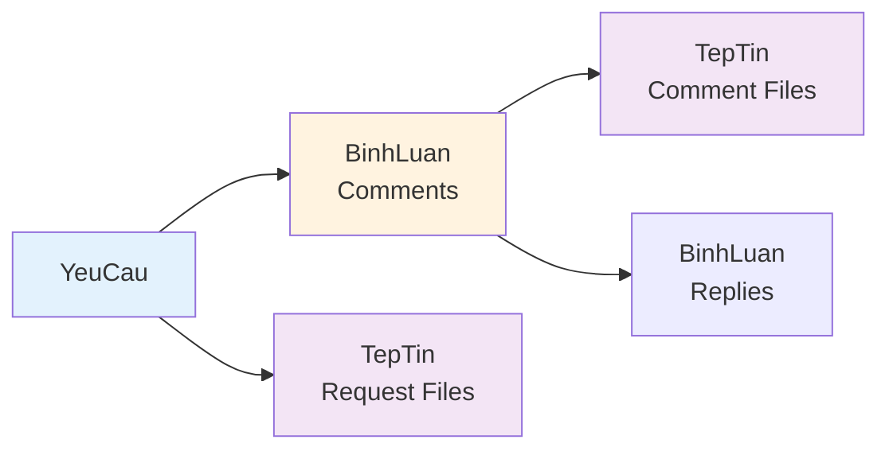
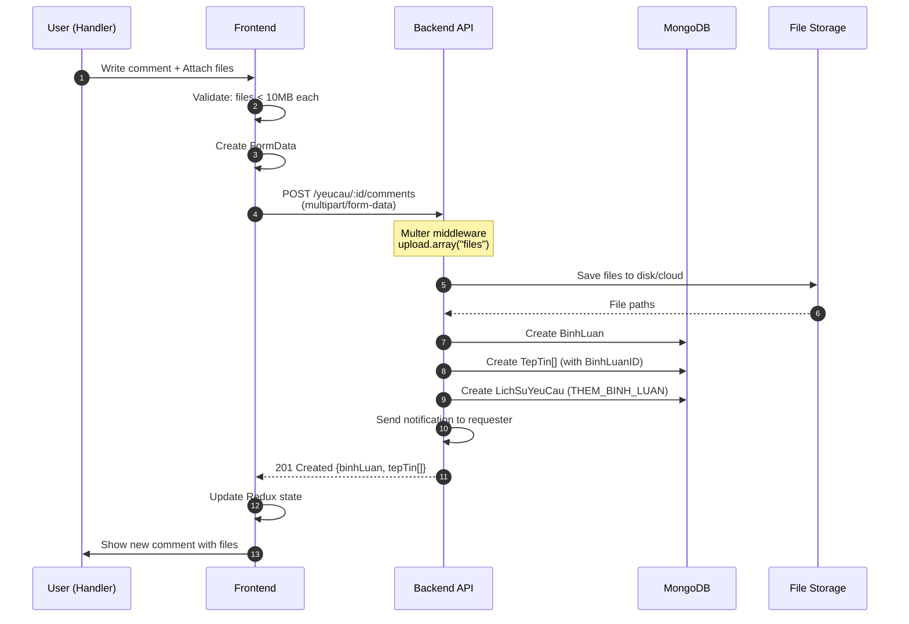
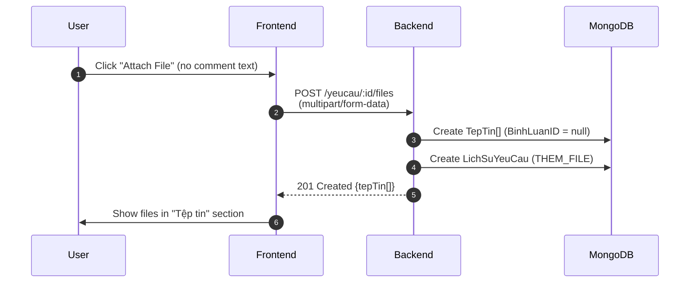

# 💬 05 - COMMENTS & FILE ATTACHMENTS

> **Module**: QuanLyCongViec/Ticket (Support Request System)  
> **Version**: 1.0.0  
> **Last Updated**: January 5, 2026

---

## 📖 MỤC LỤC

1. [Overview](#1-overview)
2. [BinhLuan Model](#2-binhluan-model)
3. [TepTin Model](#3-teptin-model)
4. [Comment Threading](#4-comment-threading)
5. [File Upload Flow](#5-file-upload-flow)
6. [Frontend Integration](#6-frontend-integration)
7. [Best Practices](#7-best-practices)

---

## 1. OVERVIEW

### 1.1. System Architecture

**Two-Model Design:**



**Key Features:**

| Feature              | BinhLuan                            | TepTin                       |
| -------------------- | ----------------------------------- | ---------------------------- |
| **Threading**        | ✅ Parent-child structure           | ❌ Flat list                 |
| **Soft delete**      | ✅ TrangThai: ACTIVE/DELETED/HIDDEN | ✅ TrangThai: ACTIVE/DELETED |
| **Attachments**      | ✅ Via TepTin relationship          | ✅ Multiple per entity       |
| **History tracking** | ✅ LichSuYeuCau (THEM_BINH_LUAN)    | ✅ LichSuYeuCau (THEM_FILE)  |
| **Notifications**    | ✅ Sent to relevant parties         | ❌ No direct notification    |

### 1.2. Use Cases

**Comment Scenarios:**

```
1. Progress Update:
   Handler → "Đang xử lý, dự kiến 2 giờ nữa xong"

2. Question & Answer:
   Requester → "Cần hỗ trợ thêm X không?"
   └─ Handler Reply → "Có, cần X và Y"

3. Feedback:
   Dispatcher → "Vui lòng cập nhật tiến độ hàng ngày"

4. Solution Documentation:
   Handler → "Đã khắc phục bằng cách: ..." + attach evidence files
```

**File Scenarios:**

```
1. Evidence/Proof:
   - Screenshot of error
   - Photo of equipment failure
   - Video recording of issue

2. Documentation:
   - PDF report
   - Excel data
   - Word document

3. Results:
   - Completion photos
   - Test results
   - Final report
```

---

## 2. BINHLUAN MODEL

### 2.1. Schema Definition

**MongoDB Schema** (`BinhLuan.js`):

```javascript
const binhLuanSchema = Schema(
  {
    // Content
    NoiDung: {
      type: String,
      required: false, // Cho phép bình luận chỉ có file
      maxlength: 5000,
      default: "",
    },

    // Parent Entity (one of these must be set)
    CongViecID: {
      type: Schema.ObjectId,
      ref: "CongViec", // Task management
    },
    YeuCauID: {
      type: Schema.ObjectId,
      ref: "YeuCau", // Ticket system ← Focus
    },

    // Author
    NguoiBinhLuanID: {
      type: Schema.ObjectId,
      required: true,
      ref: "NhanVien",
    },

    // Threading
    BinhLuanChaID: {
      type: Schema.ObjectId,
      ref: "BinhLuan", // Parent comment (null = root)
    },

    // Classification
    LoaiBinhLuan: {
      type: String,
      enum: ["COMMENT", "FEEDBACK", "QUESTION", "SOLUTION"],
      default: "COMMENT",
    },

    // Status
    TrangThai: {
      type: String,
      enum: ["ACTIVE", "DELETED", "HIDDEN"],
      default: "ACTIVE",
    },

    // Timestamps
    NgayBinhLuan: {
      type: Date,
      default: Date.now,
    },
    NgayCapNhat: {
      type: Date,
    },
  },
  {
    timestamps: true, // createdAt, updatedAt
    collection: "binhluan",
  }
);
```

### 2.2. Indexes

**Performance Optimization:**

```javascript
// Primary queries
binhLuanSchema.index({ YeuCauID: 1, NgayBinhLuan: -1 }); // List by request
binhLuanSchema.index({ CongViecID: 1, NgayBinhLuan: -1 }); // List by task
binhLuanSchema.index({ NguoiBinhLuanID: 1 }); // User's comments
binhLuanSchema.index({ BinhLuanChaID: 1 }); // Get replies
binhLuanSchema.index({ TrangThai: 1 }); // Filter active
```

### 2.3. Virtual Fields

**Populate relationships dynamically:**

```javascript
// Virtual for replies (lazy-loaded)
binhLuanSchema.virtual("TraLoi", {
  ref: "BinhLuan",
  localField: "_id",
  foreignField: "BinhLuanChaID",
});

// Virtual for file attachments
binhLuanSchema.virtual("TepTin", {
  ref: "TepTin",
  localField: "_id",
  foreignField: "BinhLuanID",
});

// Usage:
const comment = await BinhLuan.findById(id)
  .populate("TraLoi") // Get all replies
  .populate("TepTin"); // Get all files
```

### 2.4. Instance Methods

**Permission & Actions:**

```javascript
// Check if user can update comment
binhLuanSchema.methods.coTheCapNhat = function (nhanVienId) {
  // Chỉ người tạo mới có thể cập nhật
  return this.NguoiBinhLuanID.toString() === nhanVienId.toString();
};

// Check if user can delete comment
binhLuanSchema.methods.coTheXoa = function (nhanVienId, vaiTro) {
  const vaiTroNormalized = vaiTro ? vaiTro.toLowerCase() : "";
  return (
    this.NguoiBinhLuanID.toString() === nhanVienId.toString() ||
    ["admin", "manager", "superadmin"].includes(vaiTroNormalized)
  );
};

// Soft delete
binhLuanSchema.methods.xoa = function () {
  this.TrangThai = "DELETED";
  this.NgayCapNhat = new Date();
  return this.save();
};

// Hide comment (moderation)
binhLuanSchema.methods.an = function () {
  this.TrangThai = "HIDDEN";
  this.NgayCapNhat = new Date();
  return this.save();
};

// Get replies
binhLuanSchema.methods.layTraLoi = function () {
  return mongoose
    .model("BinhLuan")
    .find({
      BinhLuanChaID: this._id,
      TrangThai: "ACTIVE",
    })
    .populate("NguoiBinhLuanID", "Ten HoTen Email AnhDaiDien MaNhanVien")
    .sort({ NgayBinhLuan: 1 }); // Oldest first for threading
};
```

### 2.5. Static Methods

**Query Builders:**

```javascript
// Get comments by YeuCau (with threading)
binhLuanSchema.statics.timTheoYeuCau = function (yeuCauId) {
  return this.find({
    YeuCauID: yeuCauId,
    TrangThai: "ACTIVE",
    BinhLuanChaID: null, // Only root comments
  })
    .populate("NguoiBinhLuanID", "Ten HoTen Email AnhDaiDien MaNhanVien")
    .populate({
      path: "TepTin",
      match: { TrangThai: "ACTIVE" },
    })
    .populate({
      path: "TraLoi", // Nested replies
      match: { TrangThai: "ACTIVE" },
      populate: [
        {
          path: "NguoiBinhLuanID",
          select: "Ten HoTen Email AnhDaiDien MaNhanVien",
        },
        {
          path: "TepTin",
          match: { TrangThai: "ACTIVE" },
        },
      ],
    })
    .sort({ NgayBinhLuan: -1 }); // Newest first at root level
};

// Soft delete with cascading file deletion
binhLuanSchema.statics.softDeleteWithFiles = async function (binhLuanId) {
  const TepTin = mongoose.model("TepTin");

  // Mark comment as deleted
  await this.updateOne(
    { _id: binhLuanId },
    { $set: { TrangThai: "DELETED", NgayCapNhat: new Date() } }
  );

  // Cascade delete files
  await TepTin.updateMany(
    { BinhLuanID: binhLuanId },
    { $set: { TrangThai: "DELETED" } }
  );
};

// Statistics
binhLuanSchema.statics.thongKeTheoLoai = function (tuNgay, denNgay) {
  const match = { TrangThai: "ACTIVE" };
  if (tuNgay || denNgay) {
    match.NgayBinhLuan = {};
    if (tuNgay) match.NgayBinhLuan.$gte = tuNgay;
    if (denNgay) match.NgayBinhLuan.$lte = denNgay;
  }

  return this.aggregate([
    { $match: match },
    {
      $group: {
        _id: "$LoaiBinhLuan",
        soLuong: { $sum: 1 },
      },
    },
    { $sort: { soLuong: -1 } },
  ]);
};
```

### 2.6. TypeScript Interface

**For Frontend:**

```typescript
interface BinhLuan {
  _id: string;
  NoiDung: string;
  YeuCauID: string;
  CongViecID?: string;
  NguoiBinhLuanID: {
    _id: string;
    HoTen: string;
    MaNhanVien: string;
    AnhDaiDien?: string;
  };
  BinhLuanChaID?: string;
  LoaiBinhLuan: "COMMENT" | "FEEDBACK" | "QUESTION" | "SOLUTION";
  TrangThai: "ACTIVE" | "DELETED" | "HIDDEN";
  NgayBinhLuan: string; // ISO date
  NgayCapNhat?: string;

  // Virtuals
  TraLoi?: BinhLuan[]; // Nested replies
  TepTin?: TepTin[]; // File attachments

  // Timestamps
  createdAt: string;
  updatedAt: string;
}
```

---

## 3. TEPTIN MODEL

### 3.1. Schema Definition

**MongoDB Schema** (`TepTin.js`):

```javascript
const tepTinSchema = Schema(
  {
    // File info
    TenFile: {
      type: String,
      required: true,
      maxlength: 255, // Generated filename (unique)
    },
    TenGoc: {
      type: String,
      required: true,
      maxlength: 255, // Original filename from user
    },
    LoaiFile: {
      type: String,
      required: true,
      maxlength: 100, // MIME type or category
    },
    KichThuoc: {
      type: Number,
      required: true,
      min: 0, // Bytes
    },
    DuongDan: {
      type: String,
      required: true,
      maxlength: 500, // Full path or URL
    },

    // Generic owner-based linking (flexible)
    OwnerType: {
      type: String,
      maxlength: 100,
      default: null, // e.g., "NhanVien", "CauHinhKhoa"
    },
    OwnerID: {
      type: String, // String for flexibility
      maxlength: 100,
      default: null,
    },
    OwnerField: {
      type: String,
      maxlength: 100,
      default: "default", // e.g., "AnhDaiDien", "Logo"
    },

    // Specific entity links (recommended for YeuCau)
    CongViecID: {
      type: Schema.ObjectId,
      ref: "CongViec",
    },
    YeuCauID: {
      type: Schema.ObjectId,
      ref: "YeuCau", // Direct file attachment to request
    },
    BinhLuanID: {
      type: Schema.ObjectId,
      ref: "BinhLuan", // File attached to comment
    },

    // Metadata
    NguoiTaiLenID: {
      type: Schema.ObjectId,
      required: true,
      ref: "NhanVien",
    },
    MoTa: {
      type: String,
      maxlength: 1000,
    },

    // Status
    TrangThai: {
      type: String,
      enum: ["ACTIVE", "DELETED"],
      default: "ACTIVE",
    },

    // Timestamp
    NgayTaiLen: {
      type: Date,
      default: Date.now,
    },
  },
  {
    timestamps: true,
    collection: "teptin",
  }
);
```

### 3.2. Indexes

**Optimized Queries:**

```javascript
tepTinSchema.index({ YeuCauID: 1, TrangThai: 1, NgayTaiLen: -1 });
tepTinSchema.index({ BinhLuanID: 1 });
tepTinSchema.index({ CongViecID: 1, TrangThai: 1, NgayTaiLen: -1 });
tepTinSchema.index({ NguoiTaiLenID: 1 });
tepTinSchema.index({ OwnerType: 1, OwnerID: 1, OwnerField: 1 });
```

### 3.3. Virtual Fields

**Computed Properties:**

```javascript
// Human-readable file size
tepTinSchema.virtual("KichThuocFormat").get(function () {
  const size = this.KichThuoc;
  if (size < 1024) return size + " B";
  if (size < 1024 * 1024) return (size / 1024).toFixed(2) + " KB";
  if (size < 1024 * 1024 * 1024)
    return (size / (1024 * 1024)).toFixed(2) + " MB";
  return (size / (1024 * 1024 * 1024)).toFixed(2) + " GB";
});

// File extension
tepTinSchema.virtual("DuoiFile").get(function () {
  return this.TenGoc.split(".").pop().toLowerCase();
});

// Usage:
const file = await TepTin.findById(id);
console.log(file.KichThuocFormat); // "2.5 MB"
console.log(file.DuoiFile); // "pdf"
```

### 3.4. Instance Methods

```javascript
// Soft delete
tepTinSchema.methods.xoa = function () {
  this.TrangThai = "DELETED";
  return this.save();
};

// Get file URL
tepTinSchema.methods.laUrl = function () {
  // If stored on local server
  return `/uploads/${this.TenFile}`;

  // If using cloud storage (e.g., Cloudinary)
  // return this.DuongDan; // Already full URL
};

// Permission check: Can user view file?
tepTinSchema.methods.coTheXem = function (nguoiDungId) {
  // Simple check: uploader can view
  return this.NguoiTaiLenID.toString() === nguoiDungId.toString();

  // TODO: Check if user involved in YeuCau/CongViec
};

// Permission check: Can user delete file?
tepTinSchema.methods.coTheXoa = function (nguoiDungId) {
  // Only uploader can delete
  return this.NguoiTaiLenID.toString() === nguoiDungId.toString();
};
```

### 3.5. Pre-save Middleware

**Auto-detect file type:**

```javascript
tepTinSchema.pre("save", function (next) {
  if (!this.LoaiFile && this.TenGoc) {
    const extension = this.TenGoc.split(".").pop().toLowerCase();

    const imageTypes = ["jpg", "jpeg", "png", "gif", "bmp", "svg"];
    const documentTypes = ["pdf", "doc", "docx", "xls", "xlsx", "ppt", "pptx"];
    const videoTypes = ["mp4", "avi", "mov", "wmv", "flv", "mkv"];
    const audioTypes = ["mp3", "wav", "flac", "aac", "ogg"];

    if (imageTypes.includes(extension)) {
      this.LoaiFile = "image";
    } else if (documentTypes.includes(extension)) {
      this.LoaiFile = "document";
    } else if (videoTypes.includes(extension)) {
      this.LoaiFile = "video";
    } else if (audioTypes.includes(extension)) {
      this.LoaiFile = "audio";
    } else {
      this.LoaiFile = "other";
    }
  }

  next();
});
```

### 3.6. TypeScript Interface

```typescript
interface TepTin {
  _id: string;
  TenFile: string; // "abc123.pdf"
  TenGoc: string; // "Báo cáo.pdf"
  LoaiFile: string; // "document"
  KichThuoc: number; // 1048576 (bytes)
  DuongDan: string; // "/uploads/abc123.pdf"

  YeuCauID?: string;
  BinhLuanID?: string;
  CongViecID?: string;

  NguoiTaiLenID: {
    _id: string;
    HoTen: string;
    MaNhanVien: string;
  };

  MoTa?: string;
  TrangThai: "ACTIVE" | "DELETED";
  NgayTaiLen: string;

  // Virtuals
  KichThuocFormat: string; // "1.00 MB"
  DuoiFile: string; // "pdf"

  createdAt: string;
  updatedAt: string;
}
```

---

## 4. COMMENT THREADING

### 4.1. Thread Structure

**Parent-Child Relationship:**

```
Root Comment (BinhLuanChaID = null)
├─ Reply 1 (BinhLuanChaID = Root._id)
├─ Reply 2 (BinhLuanChaID = Root._id)
│  └─ Reply 2.1 (BinhLuanChaID = Reply2._id) ← Nested threading
└─ Reply 3 (BinhLuanChaID = Root._id)
```

**Note:** Current implementation supports **2-level threading** (root + replies), but schema allows infinite nesting.

### 4.2. Loading Strategy

**Optimized Query:**

```javascript
// Backend: Load root comments with nested replies
const comments = await BinhLuan.find({
  YeuCauID: yeuCauId,
  TrangThai: "ACTIVE",
  BinhLuanChaID: null, // ← Root comments only
})
  .populate("NguoiBinhLuanID", "Ten HoTen Email AnhDaiDien MaNhanVien")
  .populate({
    path: "TraLoi", // ← Virtual field for replies
    match: { TrangThai: "ACTIVE" },
    populate: {
      path: "NguoiBinhLuanID",
      select: "Ten HoTen Email AnhDaiDien MaNhanVien",
    },
  })
  .populate({
    path: "TepTin", // ← Files for root comment
    match: { TrangThai: "ACTIVE" },
  })
  .sort({ NgayBinhLuan: -1 }); // ← Newest first

// Result structure:
[
  {
    _id: "comment1",
    NoiDung: "Root comment",
    NgayBinhLuan: "2026-01-05T10:00:00Z",
    TraLoi: [
      // ← Nested array
      {
        _id: "reply1",
        NoiDung: "Reply to root",
        BinhLuanChaID: "comment1",
        NgayBinhLuan: "2026-01-05T10:05:00Z",
      },
    ],
    TepTin: [],
  },
];
```

### 4.3. Creating Threaded Comments

**API Flow:**

```javascript
// Create root comment
POST /api/workmanagement/yeucau/:yeuCauId/comments
Body: {
  NoiDung: "This is a root comment",
  LoaiBinhLuan: "COMMENT",
}

// Create reply
POST /api/workmanagement/yeucau/:yeuCauId/comments
Body: {
  NoiDung: "This is a reply",
  BinhLuanChaID: "comment1_id",  // ← Parent comment
  LoaiBinhLuan: "COMMENT",
}
```

### 4.4. Display Pattern (Frontend)

**React Component Structure:**

```jsx
<CommentSection yeuCauId={yeuCauId}>
  {comments.map((rootComment) => (
    <CommentItem key={rootComment._id} comment={rootComment}>
      {/* Root comment content */}
      <CommentContent>
        <Avatar user={rootComment.NguoiBinhLuanID} />
        <Text>{rootComment.NoiDung}</Text>
        <FileList files={rootComment.TepTin} />
      </CommentContent>

      {/* Nested replies */}
      {rootComment.TraLoi?.length > 0 && (
        <RepliesContainer>
          {rootComment.TraLoi.map((reply) => (
            <ReplyItem key={reply._id} comment={reply}>
              <Avatar user={reply.NguoiBinhLuanID} />
              <Text>{reply.NoiDung}</Text>
            </ReplyItem>
          ))}
        </RepliesContainer>
      )}

      {/* Reply input */}
      <ReplyButton onClick={() => openReplyForm(rootComment._id)} />
    </CommentItem>
  ))}
</CommentSection>
```

---

## 5. FILE UPLOAD FLOW

### 5.1. Scenario 1: Files with Comment

**Use Case:** Handler adds progress update with screenshot evidence



**Backend Implementation:**

```javascript
// yeucau.api.js
const { upload } = require("../middlewares/upload.middleware");

router.post(
  "/:id/comments",
  upload.array("files"), // ← Multer middleware (max 10 files)
  yeuCauController.themBinhLuan
);

// yeuCau.controller.js
const themBinhLuan = catchAsync(async (req, res, next) => {
  const { id: yeuCauId } = req.params;
  const { NoiDung, LoaiBinhLuan, BinhLuanChaID } = req.body;
  const files = req.files || []; // ← From multer
  const nguoiBinhLuanId = req.nhanVienId; // ← From auth middleware

  // Validate YeuCau exists
  const yeuCau = await YeuCau.findById(yeuCauId);
  if (!yeuCau) {
    throw new AppError(404, "Không tìm thấy yêu cầu", "YEUCAU_NOT_FOUND");
  }

  // Create comment
  const binhLuan = new BinhLuan({
    NoiDung,
    YeuCauID: yeuCauId,
    NguoiBinhLuanID: nguoiBinhLuanId,
    BinhLuanChaID: BinhLuanChaID || null,
    LoaiBinhLuan: LoaiBinhLuan || "COMMENT",
  });
  await binhLuan.save();

  // Create file records
  const tepTinRecords = [];
  for (const file of files) {
    const tepTin = new TepTin({
      TenFile: file.filename, // Generated by multer
      TenGoc: file.originalname,
      LoaiFile: file.mimetype,
      KichThuoc: file.size,
      DuongDan: file.path,
      YeuCauID: yeuCauId,
      BinhLuanID: binhLuan._id, // ← Link to comment
      NguoiTaiLenID: nguoiBinhLuanId,
    });
    await tepTin.save();
    tepTinRecords.push(tepTin);
  }

  // Log history
  await LichSuYeuCau.ghiLog({
    yeuCauId,
    hanhDong: "THEM_BINH_LUAN",
    nguoiThucHienId: nguoiBinhLuanId,
    ghiChu: `Thêm bình luận${
      files.length > 0 ? ` với ${files.length} file` : ""
    }`,
  });

  // Send notification
  await notificationService.send({
    type: "yeucau-comment-moi",
    data: { yeuCau, binhLuan },
  });

  // Populate for response
  await binhLuan.populate("NguoiBinhLuanID", "HoTen MaNhanVien AnhDaiDien");

  return sendResponse(
    res,
    201,
    true,
    { binhLuan, tepTin: tepTinRecords },
    null,
    "Đã thêm bình luận"
  );
});
```

### 5.2. Scenario 2: Files without Comment

**Use Case:** Quick file upload during processing (no comment needed)



**Backend Implementation:**

```javascript
// yeucau.api.js
router.post("/:id/files", upload.array("files"), yeuCauController.uploadFiles);

// yeuCau.controller.js
const uploadFiles = catchAsync(async (req, res, next) => {
  const { id: yeuCauId } = req.params;
  const files = req.files || [];
  const nguoiTaiLenId = req.nhanVienId;

  if (files.length === 0) {
    throw new AppError(400, "Không có file nào được tải lên");
  }

  // Validate YeuCau
  const yeuCau = await YeuCau.findById(yeuCauId);
  if (!yeuCau) {
    throw new AppError(404, "Không tìm thấy yêu cầu");
  }

  // Create TepTin records
  const tepTinRecords = [];
  for (const file of files) {
    const tepTin = new TepTin({
      TenFile: file.filename,
      TenGoc: file.originalname,
      LoaiFile: file.mimetype,
      KichThuoc: file.size,
      DuongDan: file.path,
      YeuCauID: yeuCauId,
      BinhLuanID: null, // ← No comment linkage
      NguoiTaiLenID: nguoiTaiLenId,
    });
    await tepTin.save();
    tepTinRecords.push(tepTin);
  }

  // Log history
  await LichSuYeuCau.ghiLog({
    yeuCauId,
    hanhDong: "THEM_FILE",
    nguoiThucHienId: nguoiTaiLenId,
    ghiChu: `Tải lên ${files.length} file`,
  });

  return sendResponse(
    res,
    201,
    true,
    { tepTin: tepTinRecords },
    null,
    `Đã tải lên ${files.length} file`
  );
});
```

### 5.3. Multer Configuration

**Upload Middleware** (`upload.middleware.js`):

```javascript
const multer = require("multer");
const path = require("path");
const { v4: uuidv4 } = require("uuid");

// Storage configuration
const storage = multer.diskStorage({
  destination: (req, file, cb) => {
    cb(null, "uploads/yeucau/"); // Upload directory
  },
  filename: (req, file, cb) => {
    const uniqueName = `${uuidv4()}${path.extname(file.originalname)}`;
    cb(null, uniqueName);
  },
});

// File filter
const fileFilter = (req, file, cb) => {
  // Allowed types
  const allowedTypes = [
    "image/jpeg",
    "image/png",
    "image/gif",
    "application/pdf",
    "application/msword",
    "application/vnd.openxmlformats-officedocument.wordprocessingml.document",
    "application/vnd.ms-excel",
    "application/vnd.openxmlformats-officedocument.spreadsheetml.sheet",
  ];

  if (allowedTypes.includes(file.mimetype)) {
    cb(null, true);
  } else {
    cb(new Error("Loại file không được hỗ trợ"), false);
  }
};

// Multer instance
const upload = multer({
  storage,
  fileFilter,
  limits: {
    fileSize: 10 * 1024 * 1024, // 10MB per file
  },
});

module.exports = { upload };
```

### 5.4. File Download Flow

**Serving Files:**

```javascript
// yeucau.api.js
router.get("/files/:fileId/download", yeuCauController.downloadFile);

// yeuCau.controller.js
const downloadFile = catchAsync(async (req, res, next) => {
  const { fileId } = req.params;
  const nguoiDungId = req.nhanVienId;

  // Get file record
  const tepTin = await TepTin.findById(fileId);
  if (!tepTin || tepTin.TrangThai !== "ACTIVE") {
    throw new AppError(404, "Không tìm thấy file");
  }

  // Permission check (optional - customize based on requirements)
  // const canView = tepTin.coTheXem(nguoiDungId);
  // if (!canView) {
  //   throw new AppError(403, "Không có quyền xem file này");
  // }

  // Set headers for download
  res.setHeader("Content-Type", tepTin.LoaiFile);
  res.setHeader(
    "Content-Disposition",
    `attachment; filename="${encodeURIComponent(tepTin.TenGoc)}"`
  );

  // Send file
  res.sendFile(path.resolve(tepTin.DuongDan));
});
```

---

## 6. FRONTEND INTEGRATION

### 6.1. Redux State Management

**yeuCauSlice.js:**

```javascript
const initialState = {
  // Comment state
  binhLuanList: [],
  binhLuanLoading: false,

  // File state
  tepTinList: [],
  tepTinLoading: false,

  // ...
};

const slice = createSlice({
  name: "yeuCau",
  initialState,
  reducers: {
    // Comments
    startBinhLuanLoading: (state) => {
      state.binhLuanLoading = true;
    },
    getBinhLuanSuccess: (state, action) => {
      state.binhLuanLoading = false;
      state.binhLuanList = action.payload;
    },

    // Files
    startTepTinLoading: (state) => {
      state.tepTinLoading = true;
    },
    getTepTinSuccess: (state, action) => {
      state.tepTinLoading = false;
      state.tepTinList = action.payload;
    },
  },
});
```

### 6.2. Thunk Actions

**Load Comments:**

```javascript
export const getBinhLuan = (yeuCauId) => async (dispatch) => {
  dispatch(slice.actions.startBinhLuanLoading());
  try {
    const response = await apiService.get(
      `/workmanagement/yeucau/${yeuCauId}/binh-luan`
    );
    dispatch(slice.actions.getBinhLuanSuccess(response.data.data));
  } catch (error) {
    dispatch(slice.actions.hasError(error.message));
    toast.error(error.message);
  }
};
```

**Add Comment with Files:**

```javascript
export const addYeuCauCommentWithFiles =
  (yeuCauId, { NoiDung, LoaiBinhLuan, BinhLuanChaID, files }) =>
  async (dispatch) => {
    dispatch(slice.actions.startBinhLuanLoading());
    try {
      // Create FormData
      const formData = new FormData();
      formData.append("NoiDung", NoiDung);
      if (LoaiBinhLuan) formData.append("LoaiBinhLuan", LoaiBinhLuan);
      if (BinhLuanChaID) formData.append("BinhLuanChaID", BinhLuanChaID);

      // Append files
      if (files && files.length > 0) {
        files.forEach((file) => {
          formData.append("files", file); // ← "files" matches Multer field name
        });
      }

      await apiService.post(
        `/workmanagement/yeucau/${yeuCauId}/comments`,
        formData,
        {
          headers: { "Content-Type": "multipart/form-data" },
        }
      );

      // Refresh comments
      await dispatch(getBinhLuan(yeuCauId));
      toast.success("Đã thêm bình luận");
    } catch (error) {
      dispatch(slice.actions.hasError(error.message));
      toast.error(error.message);
    }
  };
```

**Delete Comment:**

```javascript
export const recallYeuCauComment =
  (yeuCauId, commentId) => async (dispatch) => {
    dispatch(slice.actions.startBinhLuanLoading());
    try {
      await apiService.delete(
        `/workmanagement/yeucau/${yeuCauId}/binh-luan/${commentId}`
      );

      // Refresh comment list
      dispatch(getBinhLuan(yeuCauId));
      toast.success("Đã xóa bình luận");
    } catch (error) {
      dispatch(slice.actions.hasError(error.message));
      toast.error(error.message);
    }
  };
```

### 6.3. Component Examples

**CommentSection.js:**

```jsx
import { useEffect } from "react";
import { useDispatch, useSelector } from "react-redux";
import { getBinhLuan } from "./yeuCauSlice";
import CommentItem from "./CommentItem";
import AddCommentForm from "./AddCommentForm";

function CommentSection({ yeuCauId }) {
  const dispatch = useDispatch();
  const { binhLuanList, binhLuanLoading } = useSelector(
    (state) => state.yeuCau
  );

  useEffect(() => {
    dispatch(getBinhLuan(yeuCauId));
  }, [dispatch, yeuCauId]);

  if (binhLuanLoading) {
    return <CircularProgress />;
  }

  return (
    <Box>
      <Typography variant="h6">Bình luận ({binhLuanList.length})</Typography>

      {/* Add comment form */}
      <AddCommentForm yeuCauId={yeuCauId} />

      {/* Comment list */}
      <Stack spacing={2} mt={2}>
        {binhLuanList.map((comment) => (
          <CommentItem
            key={comment._id}
            comment={comment}
            yeuCauId={yeuCauId}
          />
        ))}
      </Stack>
    </Box>
  );
}
```

**CommentItem.js:**

```jsx
import {
  Avatar,
  Box,
  Card,
  IconButton,
  Stack,
  Typography,
} from "@mui/material";
import { ReplyOutlined, DeleteOutline } from "@mui/icons-material";
import { formatDistanceToNow } from "date-fns";
import { vi } from "date-fns/locale";
import FileList from "./FileList";
import ReplyList from "./ReplyList";

function CommentItem({ comment, yeuCauId }) {
  const dispatch = useDispatch();
  const { user } = useAuth();

  const canDelete =
    comment.NguoiBinhLuanID._id === user?.NhanVienID ||
    ["admin", "manager"].includes(user?.PhanQuyen);

  const handleDelete = () => {
    if (confirm("Xác nhận xóa bình luận?")) {
      dispatch(recallYeuCauComment(yeuCauId, comment._id));
    }
  };

  return (
    <Card sx={{ p: 2 }}>
      <Stack direction="row" spacing={2}>
        {/* Avatar */}
        <Avatar
          src={comment.NguoiBinhLuanID.AnhDaiDien}
          alt={comment.NguoiBinhLuanID.HoTen}
        />

        {/* Content */}
        <Box flex={1}>
          {/* Header */}
          <Stack
            direction="row"
            justifyContent="space-between"
            alignItems="center"
          >
            <Box>
              <Typography variant="subtitle2">
                {comment.NguoiBinhLuanID.HoTen}
              </Typography>
              <Typography variant="caption" color="text.secondary">
                {formatDistanceToNow(new Date(comment.NgayBinhLuan), {
                  addSuffix: true,
                  locale: vi,
                })}
              </Typography>
            </Box>

            {/* Actions */}
            <Stack direction="row">
              <IconButton
                size="small"
                onClick={() => openReplyForm(comment._id)}
              >
                <ReplyOutlined fontSize="small" />
              </IconButton>
              {canDelete && (
                <IconButton size="small" color="error" onClick={handleDelete}>
                  <DeleteOutline fontSize="small" />
                </IconButton>
              )}
            </Stack>
          </Stack>

          {/* Comment text */}
          <Typography variant="body2" mt={1}>
            {comment.NoiDung}
          </Typography>

          {/* Files */}
          {comment.TepTin && comment.TepTin.length > 0 && (
            <FileList files={comment.TepTin} />
          )}

          {/* Replies */}
          {comment.TraLoi && comment.TraLoi.length > 0 && (
            <ReplyList replies={comment.TraLoi} yeuCauId={yeuCauId} />
          )}
        </Box>
      </Stack>
    </Card>
  );
}
```

**AddCommentForm.js:**

```jsx
import { useState } from "react";
import { useForm } from "react-hook-form";
import { yupResolver } from "@hookform/resolvers/yup";
import * as Yup from "yup";
import { Box, Button, Stack } from "@mui/material";
import { AttachFile, Send } from "@mui/icons-material";
import FTextField from "components/form/FTextField";
import FormProvider from "components/form/FormProvider";

const schema = Yup.object().shape({
  NoiDung: Yup.string().max(5000, "Nội dung tối đa 5000 ký tự"),
});

function AddCommentForm({ yeuCauId, parentCommentId = null }) {
  const dispatch = useDispatch();
  const [files, setFiles] = useState([]);

  const methods = useForm({
    resolver: yupResolver(schema),
    defaultValues: { NoiDung: "" },
  });

  const onSubmit = (data) => {
    dispatch(
      addYeuCauCommentWithFiles(yeuCauId, {
        ...data,
        BinhLuanChaID: parentCommentId,
        files,
      })
    );
    methods.reset();
    setFiles([]);
  };

  const handleFileSelect = (e) => {
    const selectedFiles = Array.from(e.target.files);
    setFiles([...files, ...selectedFiles]);
  };

  return (
    <FormProvider methods={methods} onSubmit={methods.handleSubmit(onSubmit)}>
      <Stack spacing={2}>
        <FTextField
          name="NoiDung"
          label="Viết bình luận..."
          multiline
          rows={3}
          placeholder="Nhập nội dung bình luận (không bắt buộc nếu có file đính kèm)"
        />

        {/* File list */}
        {files.length > 0 && (
          <Box>
            {files.map((file, idx) => (
              <Chip
                key={idx}
                label={file.name}
                onDelete={() => setFiles(files.filter((_, i) => i !== idx))}
              />
            ))}
          </Box>
        )}

        {/* Actions */}
        <Stack direction="row" spacing={1}>
          <Button
            variant="outlined"
            component="label"
            startIcon={<AttachFile />}
          >
            Đính kèm
            <input type="file" hidden multiple onChange={handleFileSelect} />
          </Button>

          <Button
            type="submit"
            variant="contained"
            startIcon={<Send />}
            disabled={!methods.watch("NoiDung") && files.length === 0}
          >
            Gửi
          </Button>
        </Stack>
      </Stack>
    </FormProvider>
  );
}
```

---

## 7. BEST PRACTICES

### 7.1. Performance Optimization

**1. Lazy Loading for Replies:**

```javascript
// Frontend: Only load replies when user expands thread
const [showReplies, setShowReplies] = useState(false);

{
  showReplies ? (
    <ReplyList replies={comment.TraLoi} />
  ) : (
    <Button onClick={() => setShowReplies(true)}>
      Xem {comment.TraLoi?.length} phản hồi
    </Button>
  );
}
```

**2. Pagination for Long Threads:**

```javascript
// Backend: Limit replies per request
binhLuanSchema.methods.layTraLoi = function (page = 1, limit = 10) {
  return mongoose
    .model("BinhLuan")
    .find({ BinhLuanChaID: this._id, TrangThai: "ACTIVE" })
    .skip((page - 1) * limit)
    .limit(limit)
    .sort({ NgayBinhLuan: 1 });
};
```

**3. File Size Validation:**

```javascript
// Frontend: Validate before upload
const validateFileSize = (file) => {
  const maxSize = 10 * 1024 * 1024; // 10MB
  if (file.size > maxSize) {
    toast.error(`File "${file.name}" vượt quá 10MB`);
    return false;
  }
  return true;
};
```

### 7.2. Security Considerations

**1. Sanitize User Input:**

```javascript
// Backend: Prevent XSS attacks
const sanitizeHtml = require("sanitize-html");

binhLuanSchema.pre("save", function (next) {
  if (this.isModified("NoiDung")) {
    this.NoiDung = sanitizeHtml(this.NoiDung, {
      allowedTags: [], // Strip all HTML
      allowedAttributes: {},
    });
  }
  next();
});
```

**2. Virus Scanning (Optional):**

```javascript
// Integration with ClamAV or similar
const scanFile = async (filePath) => {
  // Scan file for malware
  const result = await virusScanner.scan(filePath);
  if (!result.isClean) {
    throw new AppError(400, "File chứa virus", "VIRUS_DETECTED");
  }
};
```

**3. Rate Limiting:**

```javascript
// Prevent comment spam
const commentLimiter = rateLimit({
  windowMs: 1 * 60 * 1000, // 1 minute
  max: 5, // Max 5 comments per minute
  message: "Quá nhiều bình luận, vui lòng thử lại sau",
});

router.post("/:id/comments", commentLimiter, yeuCauController.themBinhLuan);
```

### 7.3. Error Handling

**1. Failed File Upload Recovery:**

```javascript
// Cleanup on error
const uploadFiles = catchAsync(async (req, res, next) => {
  try {
    // ... upload logic
  } catch (error) {
    // Rollback: Delete uploaded files if DB operation fails
    for (const file of req.files) {
      fs.unlinkSync(file.path);
    }
    throw error;
  }
});
```

**2. Comment Conflicts:**

```javascript
// Handle concurrent edits
binhLuanSchema.index({ _id: 1, updatedAt: 1 });

// Check version before update
const updateComment = async (commentId, newContent, lastModified) => {
  const comment = await BinhLuan.findOne({
    _id: commentId,
    updatedAt: { $lte: lastModified }, // ← Optimistic locking
  });

  if (!comment) {
    throw new AppError(409, "Bình luận đã được cập nhật bởi người khác");
  }

  comment.NoiDung = newContent;
  await comment.save();
};
```

### 7.4. UX Enhancements

**1. Optimistic UI Updates:**

```javascript
// Frontend: Show comment immediately, rollback if fails
dispatch(addCommentOptimistic(tempComment));

try {
  const result = await api.post("/comments", data);
  dispatch(confirmComment(result.data));
} catch (error) {
  dispatch(rollbackComment(tempComment.id));
  toast.error(error.message);
}
```

**2. Real-time Updates (Socket.io):**

```javascript
// Listen for new comments from other users
socket.on("yeucau:new-comment", (data) => {
  if (data.yeuCauId === currentYeuCauId) {
    dispatch(addCommentFromSocket(data.comment));
    toast.info(`${data.comment.NguoiBinhLuanID.HoTen} đã bình luận`);
  }
});
```

**3. File Preview:**

```javascript
// Show image/PDF preview before upload
const [previewUrls, setPreviewUrls] = useState([]);

const handleFileSelect = (e) => {
  const files = Array.from(e.target.files);

  // Generate previews for images
  const previews = files.map((file) => {
    if (file.type.startsWith("image/")) {
      return URL.createObjectURL(file);
    }
    return null;
  });

  setPreviewUrls(previews);
  setFiles(files);
};
```

---

## 🔗 RELATED DOCUMENTS

**Prerequisites:**

- [01_WORKFLOW_STATES.md](./01_WORKFLOW_STATES.md) - State transitions trigger notifications
- [04_ASSIGNMENT_FLOW.md](./04_ASSIGNMENT_FLOW.md) - THEM_BINH_LUAN action in flow

**Next Steps:**

- [06_RATING_FEEDBACK.md](./06_RATING_FEEDBACK.md) - Rating system after completion
- [07_DASHBOARD_METRICS.md](./07_DASHBOARD_METRICS.md) - Comment statistics

**Implementation:**

- Backend: `giaobanbv-be/modules/workmanagement/models/BinhLuan.js`
- Backend: `giaobanbv-be/modules/workmanagement/models/TepTin.js`
- Backend: `giaobanbv-be/modules/workmanagement/controllers/yeuCau.controller.js`
- Frontend: `fe-bcgiaobanbvt/src/features/QuanLyCongViec/Ticket/yeuCauSlice.js`

---

**END OF COMMENTS & FILES** 💬📎
