# ⭐ 06 - RATING & FEEDBACK SYSTEM

> **Module**: QuanLyCongViec/Ticket (Support Request System)  
> **Version**: 1.0.0  
> **Last Updated**: January 5, 2026

---

## 📖 MỤC LỤC

1. [Overview](#1-overview)
2. [Rating Schema](#2-rating-schema)
3. [Rating Flow](#3-rating-flow)
4. [Validation Rules](#4-validation-rules)
5. [Auto-Rating System](#5-auto-rating-system)
6. [Statistics & Aggregation](#6-statistics--aggregation)
7. [Frontend Implementation](#7-frontend-implementation)

---

## 1. OVERVIEW

### 1.1. Purpose & Significance

**Rating System** đánh giá chất lượng xử lý yêu cầu hỗ trợ giữa các khoa, góp phần:

✅ **Cải thiện dịch vụ**: Phản hồi trực tiếp từ người yêu cầu  
✅ **KPI Integration**: Rating trở thành chỉ số đánh giá hiệu suất nhân viên  
✅ **Truy xuất chất lượng**: Thống kê trung bình rating theo khoa/nhân viên/thời gian  
✅ **Động viên**: Rating cao khuyến khích nhân viên xử lý tốt hơn

### 1.2. Rating Lifecycle

```mermaid
graph LR
    A[Request<br/>Created] --> B[Processing]
    B --> C[DA_HOAN_THANH]
    C --> D{Requester<br/>Action?}
    D -->|Rate + Close| E[DA_DONG<br/>with rating]
    D -->|Close only| F[DA_DONG<br/>no rating]
    D -->|No action<br/>7 days| G[TU_DONG_DONG<br/>auto 5⭐]

    style C fill:#fff3e0
    style E fill:#e8f5e9
    style G fill:#e3f2fd
```



**Key States:**

| State             | Rating Status   | Action Available                             |
| ----------------- | --------------- | -------------------------------------------- |
| **DA_HOAN_THANH** | Not rated yet   | DANH_GIA (rate + close) OR DONG (close only) |
| **DA_DONG**       | May have rating | MO_LAI (reopen within 7 days)                |
| **TU_DONG_DONG**  | Auto-rated 5⭐  | -                                            |

### 1.3. Rating Scale

**1-5 Star System:**

| Stars        | Label              | Description        | NhanXet Required? |
| ------------ | ------------------ | ------------------ | ----------------- |
| ⭐ 1         | Rất không hài lòng | Very poor service  | ✅ **Required**   |
| ⭐⭐ 2       | Không hài lòng     | Poor service       | ✅ **Required**   |
| ⭐⭐⭐ 3     | Bình thường        | Acceptable service | ❌ Optional       |
| ⭐⭐⭐⭐ 4   | Hài lòng           | Good service       | ❌ Optional       |
| ⭐⭐⭐⭐⭐ 5 | Rất hài lòng       | Excellent service  | ❌ Optional       |

**Critical Rule:** NhanXet (feedback text) **bắt buộc khi rating < 3 sao** để người xử lý hiểu nguyên nhân.

---

## 2. RATING SCHEMA

### 2.1. Embedded Schema in YeuCau

**MongoDB Schema** (`YeuCau.js`):

```javascript
/**
 * Embedded schema cho DanhGia
 */
const danhGiaSchema = new Schema(
  {
    SoSao: {
      type: Number,
      min: [1, "Số sao tối thiểu là 1"],
      max: [5, "Số sao tối đa là 5"],
    },
    NhanXet: {
      type: String,
      maxlength: [500, "Nhận xét không được vượt quá 500 ký tự"],
      // ⚠️ Bắt buộc khi SoSao < 3 (validate ở service layer)
    },
    NgayDanhGia: Date,
  },
  { _id: false } // No separate _id for embedded doc
);

// Main YeuCau schema
const yeuCauSchema = new Schema({
  // ... other fields

  // ========== ĐÁNH GIÁ ==========
  DanhGia: {
    type: danhGiaSchema,
    default: null, // null = chưa đánh giá
  },

  NgayDong: {
    type: Date, // Set when DANH_GIA or DONG action
  },

  // ...
});
```

### 2.2. TypeScript Interface

**For Frontend:**

```typescript
interface DanhGia {
  SoSao: number; // 1-5
  NhanXet?: string; // Max 500 chars, required if SoSao < 3
  NgayDanhGia: string; // ISO date
}

interface YeuCau {
  _id: string;
  // ... other fields

  TrangThai: "MOI" | "DANG_XU_LY" | "DA_HOAN_THANH" | "DA_DONG" | "TU_CHOI";
  DanhGia: DanhGia | null; // null if not rated
  NgayDong: string | null;

  // Virtuals (computed on backend)
  QuaHan?: boolean; // true if completed after ThoiGianHen
}
```

### 2.3. Data Examples

**Example 1: Good Service (5 stars, no feedback required)**

```json
{
  "_id": "64f3...",
  "MaYeuCau": "YC2026000123",
  "TrangThai": "DA_DONG",
  "DanhGia": {
    "SoSao": 5,
    "NhanXet": "Xử lý nhanh, chuyên nghiệp!",
    "NgayDanhGia": "2026-01-05T14:30:00.000Z"
  },
  "NgayHoanThanh": "2026-01-05T14:00:00.000Z",
  "NgayDong": "2026-01-05T14:30:00.000Z"
}
```

**Example 2: Poor Service (2 stars, feedback mandatory)**

```json
{
  "_id": "64f4...",
  "MaYeuCau": "YC2026000124",
  "TrangThai": "DA_DONG",
  "DanhGia": {
    "SoSao": 2,
    "NhanXet": "Xử lý chậm, thái độ không tốt. Cần cải thiện thời gian phản hồi.",
    "NgayDanhGia": "2026-01-05T15:00:00.000Z"
  },
  "NgayHoanThanh": "2026-01-05T12:00:00.000Z",
  "NgayDong": "2026-01-05T15:00:00.000Z",
  "QuaHan": true
}
```

**Example 3: No Rating (closed without rating)**

```json
{
  "_id": "64f5...",
  "MaYeuCau": "YC2026000125",
  "TrangThai": "DA_DONG",
  "DanhGia": null,
  "NgayHoanThanh": "2026-01-05T10:00:00.000Z",
  "NgayDong": "2026-01-05T10:05:00.000Z"
}
```

---

## 3. RATING FLOW

### 3.1. Manual Rating Flow (DANH_GIA)

**Scenario:** Requester manually rates after completion


### 3.2. Close Without Rating (DONG)

**Scenario:** Requester closes without rating (acceptable but discouraged)

```mermaid
sequenceDiagram
    autonumber
    participant R as Requester
    participant F as Frontend
    participant B as Backend
    participant SM as State Machine

    Note over R,SM: YeuCau in DA_HOAN_THANH

    R->>F: Click "Đóng yêu cầu" (skip rating)
    F->>F: Show confirmation dialog

    R->>F: Confirm close

    F->>B: POST /yeucau/:id/dong

    B->>SM: executeTransition(id, "DONG", {})

    SM->>SM: Transition: DA_HOAN_THANH → DA_DONG
    SM->>SM: Side effect: NgayDong = now()
    SM->>SM: DanhGia remains null

    SM-->>B: Return yeuCau
    B-->>F: 200 OK

    F->>R: Show: "Đã đóng yêu cầu"

    Note over R,SM: DA_DONG without rating (acceptable)
```



### 3.3. Permission Matrix

| User           | Can DANH_GIA? | Can DONG? | Can MO_LAI?            |
| -------------- | ------------- | --------- | ---------------------- |
| **Requester**  | ✅ Yes        | ✅ Yes    | ✅ Yes (within 7 days) |
| **Handler**    | ❌ No         | ❌ No     | ✅ Yes (within 7 days) |
| **Dispatcher** | ❌ No         | ❌ No     | ❌ No                  |
| **Manager**    | ❌ No         | ❌ No     | ❌ No                  |
| **Admin**      | ✅ Yes        | ✅ Yes    | ✅ Yes                 |

---

## 4. VALIDATION RULES

### 4.1. Backend Validation (State Machine)

**yeuCauStateMachine.js:**

```javascript
const TRANSITIONS = {
  [TRANG_THAI.DA_HOAN_THANH]: {
    DANH_GIA: {
      nextState: TRANG_THAI.DA_DONG,
      hanhDong: HANH_DONG.DANH_GIA,
      requiredFields: ["DanhGia.SoSao"], // ← Must have
      notificationType: "YEUCAU_DUOC_DANH_GIA",
    },
  },
};

// applySideEffects function
function applySideEffects(yeuCau, action, data, nguoiThucHienId) {
  const now = new Date();

  switch (action) {
    case "DANH_GIA":
      // Validate SoSao range (additional layer)
      if (data.DanhGia.SoSao < 1 || data.DanhGia.SoSao > 5) {
        throw new AppError(400, "Số sao phải từ 1-5", "INVALID_RATING");
      }

      // Validate NhanXet required when SoSao < 3
      if (data.DanhGia.SoSao < 3) {
        if (!data.DanhGia.NhanXet || data.DanhGia.NhanXet.trim().length === 0) {
          throw new AppError(
            400,
            "Nhận xét bắt buộc khi đánh giá dưới 3 sao",
            "NHANXET_REQUIRED"
          );
        }
      }

      // Apply rating
      yeuCau.DanhGia = {
        SoSao: data.DanhGia.SoSao,
        NhanXet: data.DanhGia.NhanXet || null,
        NgayDanhGia: now,
      };
      yeuCau.NgayDong = now;
      break;
  }
}
```

### 4.2. Frontend Validation (Yup Schema)

**RatingForm.js:**

```javascript
import * as Yup from "yup";

const ratingSchema = Yup.object().shape({
  SoSao: Yup.number()
    .required("Vui lòng chọn số sao")
    .min(1, "Số sao tối thiểu là 1")
    .max(5, "Số sao tối đa là 5"),

  NhanXet: Yup.string()
    .max(500, "Nhận xét không được vượt quá 500 ký tự")
    .when("SoSao", {
      is: (val) => val < 3,
      then: (schema) =>
        schema
          .required("Nhận xét bắt buộc khi đánh giá dưới 3 sao")
          .min(10, "Nhận xét phải có ít nhất 10 ký tự"),
      otherwise: (schema) => schema.notRequired(),
    }),
});
```

### 4.3. Validation Error Examples

**Error 1: Missing NhanXet for low rating**

```javascript
// Request
POST /api/workmanagement/yeucau/64f3.../danh-gia
Body: {
  DanhGia: {
    SoSao: 2,
    NhanXet: ""  // ← Empty!
  }
}

// Response
400 Bad Request
{
  "success": false,
  "message": "Nhận xét bắt buộc khi đánh giá dưới 3 sao",
  "errors": { "code": "NHANXET_REQUIRED" }
}
```

**Error 2: Invalid SoSao value**

```javascript
// Request
POST /api/workmanagement/yeucau/64f3.../danh-gia
Body: {
  DanhGia: {
    SoSao: 6  // ← Out of range!
  }
}

// Response
400 Bad Request
{
  "success": false,
  "message": "Số sao phải từ 1-5",
  "errors": { "code": "INVALID_RATING" }
}
```

**Error 3: Wrong state**

```javascript
// Request (YeuCau in DANG_XU_LY state)
POST /api/workmanagement/yeucau/64f3.../danh-gia

// Response
400 Bad Request
{
  "success": false,
  "message": "Hành động 'DANH_GIA' không hợp lệ cho trạng thái 'DANG_XU_LY'",
  "errors": {
    "code": "INVALID_TRANSITION",
    "currentState": "DANG_XU_LY"
  }
}
```

---

## 5. AUTO-RATING SYSTEM

### 5.1. Auto-Close After 7 Days (TU_DONG_DONG)

**Business Rule:** Nếu yêu cầu **DA_HOAN_THANH** không được đánh giá sau **7 ngày**, hệ thống tự động:

1. ✅ Đóng yêu cầu (TrangThai = DA_DONG)
2. ✅ Tự động rating **5 sao** (assume excellent if no complaint)
3. ✅ Thêm nhận xét mặc định

### 5.2. Agenda Job Configuration

**Backend Cron Job** (chạy hàng ngày 00:00):

```javascript
// agenda job definition
agenda.define("auto-close-overdue-tickets", async (job) => {
  try {
    const sevenDaysAgo = dayjs().subtract(7, "days").toDate();

    // Find DA_HOAN_THANH tickets older than 7 days
    const overdueTickets = await YeuCau.find({
      TrangThai: TRANG_THAI.DA_HOAN_THANH,
      NgayHoanThanh: { $lt: sevenDaysAgo },
      isDeleted: false,
    });

    console.log(`[Auto-close] Found ${overdueTickets.length} overdue tickets`);

    for (const yeuCau of overdueTickets) {
      try {
        await yeuCauStateMachine.executeTransition(
          yeuCau._id,
          "TU_DONG_DONG",
          {},
          "SYSTEM", // Special nguoiThucHienId
          "system" // Special userRole
        );

        console.log(`[Auto-close] Closed ${yeuCau.MaYeuCau}`);
      } catch (error) {
        console.error(
          `[Auto-close] Failed for ${yeuCau.MaYeuCau}:`,
          error.message
        );
      }
    }
  } catch (error) {
    console.error("[Auto-close] Job failed:", error);
  }
});

// Schedule job
agenda.every("0 0 * * *", "auto-close-overdue-tickets"); // Daily at midnight
```

### 5.3. TU_DONG_DONG Logic

**State Machine Configuration:**

```javascript
const TRANSITIONS = {
  [TRANG_THAI.DA_HOAN_THANH]: {
    TU_DONG_DONG: {
      nextState: TRANG_THAI.DA_DONG,
      hanhDong: HANH_DONG.TU_DONG_DONG,
      notificationType: "YEUCAU_TU_DONG_DONG",
    },
  },
};

// Side effects
function applySideEffects(yeuCau, action, data, nguoiThucHienId) {
  switch (action) {
    case "TU_DONG_DONG":
      // Auto-generate 5-star rating
      yeuCau.DanhGia = {
        SoSao: 5,
        NhanXet: "Tự động đánh giá 5 sao do không phản hồi trong 7 ngày",
        NgayDanhGia: new Date(),
      };
      yeuCau.NgayDong = new Date();
      break;
  }
}
```

### 5.4. Auto-Close Notification

**Email Template** (`YEUCAU_TU_DONG_DONG`):

```
Subject: Yêu cầu YC2026000123 đã được tự động đóng

Xin chào {{requester.name}},

Yêu cầu {{maYeuCau}} đã được tự động đóng do không có phản hồi sau 7 ngày hoàn thành.

Hệ thống đã tự động đánh giá: ⭐⭐⭐⭐⭐ (5/5 sao)

Nếu cần mở lại yêu cầu, vui lòng truy cập:
{{link}}

Trân trọng,
Hệ thống quản lý công việc
```

---

## 6. STATISTICS & AGGREGATION

### 6.1. Dashboard Metrics

**Key Metrics:**

```javascript
// Service: yeuCau.service.js - layDashboardMetrics()

// 1. Average rating
const thongKeDanhGia = await YeuCau.aggregate([
  {
    $match: {
      ...matchBase,
      "DanhGia.SoSao": { $exists: true, $ne: null },
    },
  },
  {
    $group: {
      _id: null,
      avgRating: { $avg: "$DanhGia.SoSao" },
      totalRated: { $sum: 1 },
    },
  },
]);

const avgRating = thongKeDanhGia[0]?.avgRating?.toFixed(1) || "N/A";
const totalRated = thongKeDanhGia[0]?.totalRated || 0;

// 2. Rating breakdown (1-5 stars)
const ratingBreakdown = await YeuCau.aggregate([
  {
    $match: {
      ...matchBase,
      "DanhGia.SoSao": { $exists: true },
    },
  },
  {
    $group: {
      _id: "$DanhGia.SoSao",
      count: { $sum: 1 },
    },
  },
  { $sort: { _id: 1 } },
]);

// Result:
// [
//   { _id: 1, count: 2 },   // 2 tickets with 1 star
//   { _id: 2, count: 5 },   // 5 tickets with 2 stars
//   { _id: 3, count: 10 },  // ...
//   { _id: 4, count: 30 },
//   { _id: 5, count: 53 },  // 53 tickets with 5 stars
// ]

// 3. Rating by handler
const ratingByHandler = await YeuCau.aggregate([
  {
    $match: {
      ...matchBase,
      "DanhGia.SoSao": { $exists: true },
      NguoiXuLyID: { $exists: true },
    },
  },
  {
    $group: {
      _id: "$NguoiXuLyID",
      avgRating: { $avg: "$DanhGia.SoSao" },
      totalRated: { $sum: 1 },
    },
  },
  {
    $lookup: {
      from: "nhanvien",
      localField: "_id",
      foreignField: "_id",
      as: "handler",
    },
  },
  { $unwind: "$handler" },
  { $sort: { avgRating: -1 } },
]);

// Result:
// [
//   {
//     _id: "64f3...",
//     handler: { HoTen: "Nguyễn Văn A" },
//     avgRating: 4.8,
//     totalRated: 25
//   },
//   {
//     _id: "64f4...",
//     handler: { HoTen: "Trần Thị B" },
//     avgRating: 4.5,
//     totalRated: 18
//   },
// ]
```

### 6.2. KPI Integration

**Rating Metrics for Employee Evaluation:**

```javascript
// Get KPI rating metrics for an employee in a cycle
async function getKPIRatingMetrics(nhanVienID, chuKyDanhGiaID) {
  const chuKy = await ChuKyDanhGia.findById(chuKyDanhGiaID);
  if (!chuKy) throw new AppError(404, "Không tìm thấy chu kỳ đánh giá");

  const matchCondition = {
    NguoiXuLyID: nhanVienID,
    TrangThai: { $in: ["DA_DONG"] },
    NgayDong: {
      $gte: chuKy.NgayBatDau,
      $lte: chuKy.NgayKetThuc,
    },
  };

  // Rating statistics
  const ratingStats = await YeuCau.aggregate([
    {
      $match: {
        ...matchCondition,
        "DanhGia.SoSao": { $exists: true, $ne: null },
      },
    },
    {
      $group: {
        _id: null,
        avgRating: { $avg: "$DanhGia.SoSao" },
        totalRated: { $sum: 1 },
        sum1Star: {
          $sum: { $cond: [{ $eq: ["$DanhGia.SoSao", 1] }, 1, 0] },
        },
        sum2Star: {
          $sum: { $cond: [{ $eq: ["$DanhGia.SoSao", 2] }, 1, 0] },
        },
        sum3Star: {
          $sum: { $cond: [{ $eq: ["$DanhGia.SoSao", 3] }, 1, 0] },
        },
        sum4Star: {
          $sum: { $cond: [{ $eq: ["$DanhGia.SoSao", 4] }, 1, 0] },
        },
        sum5Star: {
          $sum: { $cond: [{ $eq: ["$DanhGia.SoSao", 5] }, 1, 0] },
        },
      },
    },
  ]);

  const stats = ratingStats[0] || {
    avgRating: 0,
    totalRated: 0,
    sum1Star: 0,
    sum2Star: 0,
    sum3Star: 0,
    sum4Star: 0,
    sum5Star: 0,
  };

  return {
    avgRating: stats.avgRating.toFixed(2),
    totalRated: stats.totalRated,
    breakdown: {
      _1Star: stats.sum1Star,
      _2Star: stats.sum2Star,
      _3Star: stats.sum3Star,
      _4Star: stats.sum4Star,
      _5Star: stats.sum5Star,
    },
    satisfactionRate: (
      ((stats.sum4Star + stats.sum5Star) / stats.totalRated) *
      100
    ).toFixed(1), // % of 4-5 stars
  };
}
```

### 6.3. Statistics Display

**Dashboard Card Example:**

```
┌─────────────────────────────────────────┐
│  📊 RATING STATISTICS - Q1 2026        │
├─────────────────────────────────────────┤
│  Average Rating:        4.6 ⭐         │
│  Total Rated:           120 requests    │
│                                         │
│  Breakdown:                             │
│  ⭐⭐⭐⭐⭐ (5 stars)     68 (56.7%)    │
│  ⭐⭐⭐⭐ (4 stars)      35 (29.2%)    │
│  ⭐⭐⭐ (3 stars)        12 (10.0%)    │
│  ⭐⭐ (2 stars)          4  (3.3%)     │
│  ⭐ (1 star)             1  (0.8%)     │
│                                         │
│  Satisfaction Rate:     85.9%           │
│  (4-5 stars)                            │
└─────────────────────────────────────────┘
```

---

## 7. FRONTEND IMPLEMENTATION

### 7.1. Redux Action

**yeuCauSlice.js:**

```javascript
// Thunk action for rating
export const danhGiaYeuCau = (yeuCauId, danhGiaData) => async (dispatch) => {
  dispatch(slice.actions.startActionLoading("danhGia"));
  try {
    const response = await apiService.post(
      `/workmanagement/yeucau/${yeuCauId}/danh-gia`,
      { DanhGia: danhGiaData }
    );

    dispatch(slice.actions.executeActionSuccess(response.data.data));
    dispatch(getYeuCauDetail(yeuCauId)); // Refresh detail
    toast.success("Đánh giá thành công");
  } catch (error) {
    dispatch(slice.actions.hasError(error.message));
    toast.error(error.message);
  }
};
```

### 7.2. Rating Dialog Component

**RatingDialog.js:**

```jsx
import { useState } from "react";
import { useDispatch } from "react-redux";
import { useForm } from "react-hook-form";
import { yupResolver } from "@hookform/resolvers/yup";
import * as Yup from "yup";
import {
  Dialog,
  DialogTitle,
  DialogContent,
  DialogActions,
  Button,
  Rating,
  Stack,
  Typography,
  Alert,
} from "@mui/material";
import FTextField from "components/form/FTextField";
import FormProvider from "components/form/FormProvider";
import { danhGiaYeuCau } from "./yeuCauSlice";

const ratingSchema = Yup.object().shape({
  SoSao: Yup.number().required("Vui lòng chọn số sao").min(1).max(5),
  NhanXet: Yup.string()
    .max(500, "Nhận xét không được vượt quá 500 ký tự")
    .when("SoSao", {
      is: (val) => val < 3,
      then: (schema) =>
        schema
          .required("Nhận xét bắt buộc khi đánh giá dưới 3 sao")
          .min(10, "Nhận xét phải có ít nhất 10 ký tự"),
      otherwise: (schema) => schema.notRequired(),
    }),
});

const RATING_LABELS = {
  1: "Rất không hài lòng",
  2: "Không hài lòng",
  3: "Bình thường",
  4: "Hài lòng",
  5: "Rất hài lòng",
};

function RatingDialog({ open, onClose, yeuCau }) {
  const dispatch = useDispatch();
  const [hover, setHover] = useState(-1);

  const methods = useForm({
    resolver: yupResolver(ratingSchema),
    defaultValues: {
      SoSao: 5,
      NhanXet: "",
    },
  });

  const { watch, setValue } = methods;
  const currentRating = watch("SoSao");

  const onSubmit = (data) => {
    dispatch(danhGiaYeuCau(yeuCau._id, data));
    onClose();
  };

  return (
    <Dialog open={open} onClose={onClose} maxWidth="sm" fullWidth>
      <DialogTitle>Đánh giá yêu cầu {yeuCau.MaYeuCau}</DialogTitle>

      <FormProvider methods={methods} onSubmit={methods.handleSubmit(onSubmit)}>
        <DialogContent>
          <Stack spacing={3}>
            {/* Rating Stars */}
            <Box textAlign="center">
              <Typography variant="subtitle2" gutterBottom>
                Mức độ hài lòng
              </Typography>

              <Rating
                name="SoSao"
                size="large"
                value={currentRating}
                onChange={(e, newValue) => {
                  setValue("SoSao", newValue, { shouldValidate: true });
                }}
                onChangeActive={(e, newHover) => {
                  setHover(newHover);
                }}
              />

              {currentRating !== null && (
                <Typography variant="body2" color="text.secondary" mt={1}>
                  {RATING_LABELS[hover !== -1 ? hover : currentRating]}
                </Typography>
              )}
            </Box>

            {/* Feedback Text */}
            <FTextField
              name="NhanXet"
              label="Nhận xét"
              multiline
              rows={4}
              placeholder={
                currentRating < 3
                  ? "Vui lòng cho biết lý do đánh giá thấp để chúng tôi cải thiện..."
                  : "Nhận xét của bạn (không bắt buộc)"
              }
            />

            {/* Warning for low rating */}
            {currentRating < 3 && (
              <Alert severity="warning">
                <strong>Lưu ý:</strong> Nhận xét bắt buộc khi đánh giá dưới 3
                sao (tối thiểu 10 ký tự).
              </Alert>
            )}
          </Stack>
        </DialogContent>

        <DialogActions>
          <Button onClick={onClose}>Hủy</Button>
          <Button
            type="submit"
            variant="contained"
            disabled={methods.formState.isSubmitting}
          >
            Gửi đánh giá
          </Button>
        </DialogActions>
      </FormProvider>
    </Dialog>
  );
}

export default RatingDialog;
```

### 7.3. Rating Display Component

**RatingDisplay.js:**

```jsx
import { Box, Chip, Rating, Stack, Typography } from "@mui/material";
import { formatDistanceToNow } from "date-fns";
import { vi } from "date-fns/locale";

function RatingDisplay({ danhGia }) {
  if (!danhGia) {
    return <Chip label="Chưa đánh giá" size="small" color="default" />;
  }

  const getRatingColor = (stars) => {
    if (stars >= 4) return "success";
    if (stars === 3) return "warning";
    return "error";
  };

  return (
    <Box>
      <Stack direction="row" spacing={1} alignItems="center">
        <Rating value={danhGia.SoSao} readOnly size="small" />
        <Chip
          label={`${danhGia.SoSao}/5`}
          size="small"
          color={getRatingColor(danhGia.SoSao)}
        />
      </Stack>

      {danhGia.NhanXet && (
        <Typography variant="body2" color="text.secondary" mt={1}>
          "{danhGia.NhanXet}"
        </Typography>
      )}

      <Typography
        variant="caption"
        color="text.secondary"
        display="block"
        mt={0.5}
      >
        Đánh giá{" "}
        {formatDistanceToNow(new Date(danhGia.NgayDanhGia), {
          addSuffix: true,
          locale: vi,
        })}
      </Typography>
    </Box>
  );
}

export default RatingDisplay;
```

### 7.4. Statistics Chart Component

**RatingBreakdownChart.js:**

```jsx
import {
  BarChart,
  Bar,
  XAxis,
  YAxis,
  Tooltip,
  ResponsiveContainer,
} from "recharts";
import { Card, CardContent, Typography } from "@mui/material";

function RatingBreakdownChart({ breakdown }) {
  const data = [
    { name: "⭐", count: breakdown._1Star || 0 },
    { name: "⭐⭐", count: breakdown._2Star || 0 },
    { name: "⭐⭐⭐", count: breakdown._3Star || 0 },
    { name: "⭐⭐⭐⭐", count: breakdown._4Star || 0 },
    { name: "⭐⭐⭐⭐⭐", count: breakdown._5Star || 0 },
  ];

  return (
    <Card>
      <CardContent>
        <Typography variant="h6" gutterBottom>
          Phân bổ đánh giá
        </Typography>

        <ResponsiveContainer width="100%" height={250}>
          <BarChart data={data}>
            <XAxis dataKey="name" />
            <YAxis />
            <Tooltip />
            <Bar dataKey="count" fill="#1976d2" />
          </BarChart>
        </ResponsiveContainer>
      </CardContent>
    </Card>
  );
}

export default RatingBreakdownChart;
```

### 7.5. Usage in Detail Page

**YeuCauDetailPage.js:**

```jsx
function YeuCauDetailPage() {
  const { yeuCauDetail } = useSelector((state) => state.yeuCau);
  const [showRatingDialog, setShowRatingDialog] = useState(false);

  const canRate =
    yeuCauDetail?.TrangThai === "DA_HOAN_THANH" &&
    yeuCauDetail?.availableActions?.includes("danhGia");

  return (
    <Box>
      {/* ... other sections */}

      {/* Rating Section */}
      <Card>
        <CardHeader title="Đánh giá" />
        <CardContent>
          {yeuCauDetail.DanhGia ? (
            <RatingDisplay danhGia={yeuCauDetail.DanhGia} />
          ) : (
            <>
              <Typography color="text.secondary">
                Yêu cầu chưa được đánh giá
              </Typography>

              {canRate && (
                <Button
                  variant="contained"
                  startIcon={<Star />}
                  onClick={() => setShowRatingDialog(true)}
                  sx={{ mt: 2 }}
                >
                  Đánh giá ngay
                </Button>
              )}
            </>
          )}
        </CardContent>
      </Card>

      {/* Rating Dialog */}
      <RatingDialog
        open={showRatingDialog}
        onClose={() => setShowRatingDialog(false)}
        yeuCau={yeuCauDetail}
      />
    </Box>
  );
}
```

---

## 🔗 RELATED DOCUMENTS

**Prerequisites:**

- [01_WORKFLOW_STATES.md](./01_WORKFLOW_STATES.md) - DANH_GIA state transition
- [04_ASSIGNMENT_FLOW.md](./04_ASSIGNMENT_FLOW.md) - Phase 7: Rate & Close flow

**Next Steps:**

- [07_DASHBOARD_METRICS.md](./07_DASHBOARD_METRICS.md) - Rating statistics integration
- [08_API_REFERENCE.md](./08_API_REFERENCE.md) - Rating API endpoints

**Implementation:**

- Backend: `giaobanbv-be/modules/workmanagement/models/YeuCau.js` (DanhGia schema)
- Backend: `giaobanbv-be/modules/workmanagement/services/yeuCauStateMachine.js` (DANH_GIA logic)
- Frontend: `fe-bcgiaobanbvt/src/features/QuanLyCongViec/Ticket/yeuCauSlice.js` (danhGiaYeuCau action)

---

**END OF RATING & FEEDBACK** ⭐
