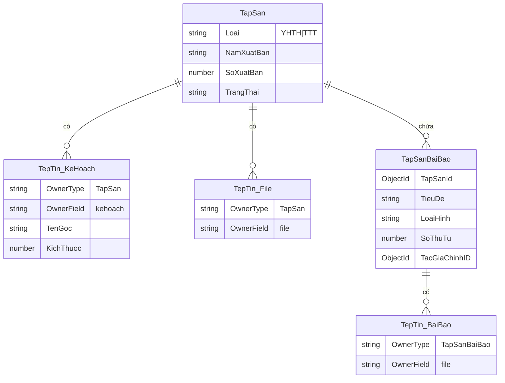
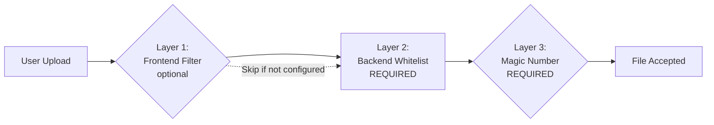
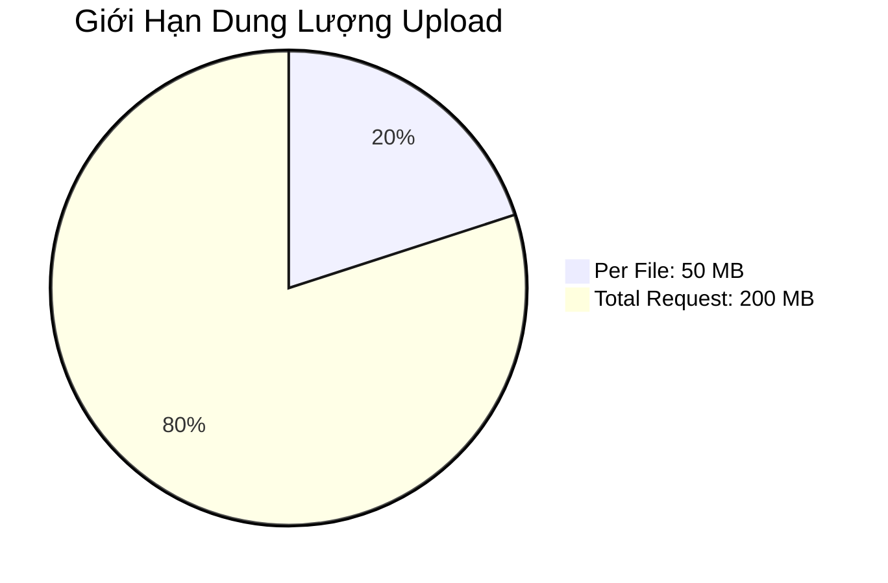
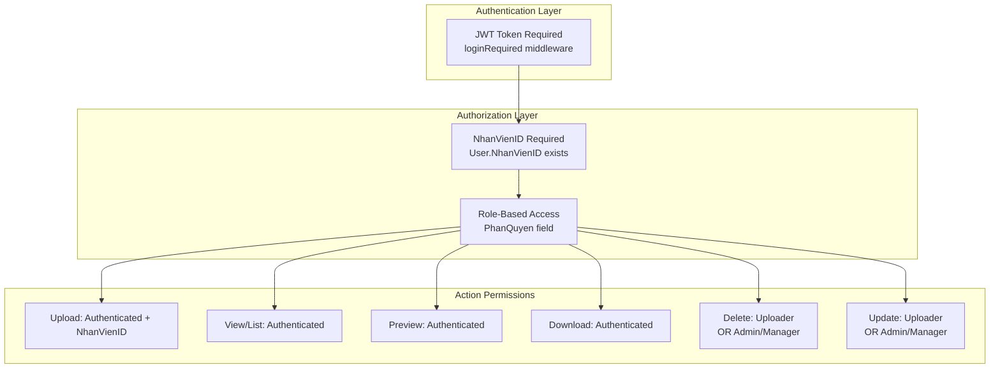
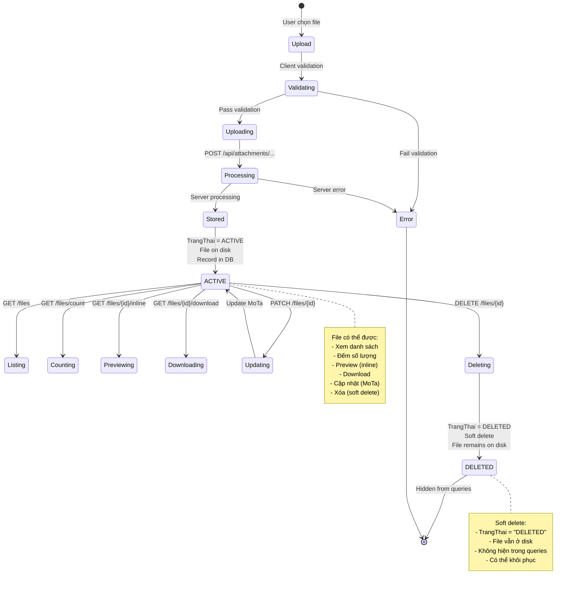
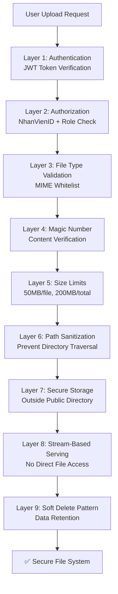
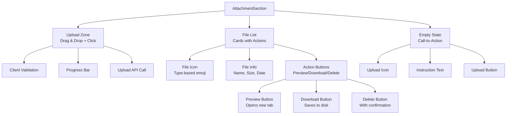
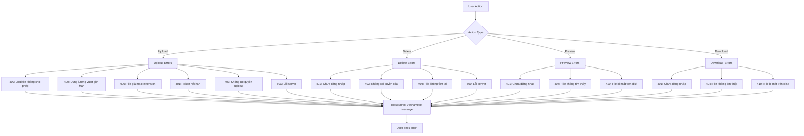
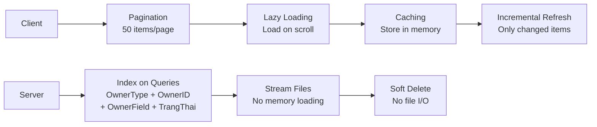

# Hướng Dẫn Trực Quan: Xử Lý Tài Liệu Đính Kèm (Attachment Handling)

> **Module**: TapSan & BaiBao (Nghiên Cứu Khoa Học)  
> **Ngày cập nhật**: 5/1/2026

---

## 📋 Tổng Quan Hệ Thống

Hệ thống quản lý tài liệu đính kèm cho phép upload, quản lý và tải xuống các file liên quan đến Tập San và Bài Báo khoa học với validation đầy đủ và phân quyền rõ ràng.

### Các Thực Thể Chính



**Attachment Fields**:

- **TapSan**: 2 trường đính kèm (`kehoach` - Kế hoạch, `file` - Tập san)
- **TapSanBaiBao**: 1 trường đính kèm (`file` - Bài báo)

---

## 🔄 Luồng Upload Tài Liệu (Upload Flow)

```mermaid
flowchart TD
    Start([User chọn file<br/>Drag & Drop/Click]) --> ClientValidate{Client-side<br/>Validation}

    ClientValidate -->|❌ Fail| Reject[Hiển thị lỗi:<br/>- Loại file không hợp lệ<br/>- Dung lượng quá lớn]
    ClientValidate -->|✅ Pass| CreateFormData[Tạo FormData<br/>+ files array<br/>+ ownerType, ownerId, field]

    CreateFormData --> APICall[POST /api/attachments<br/>{ownerType}/{ownerId}/{field}/files]
    APICall --> Progress[Hiển thị progress bar<br/>0-100%]

    APICall --> Auth{JWT Authentication<br/>loginRequired middleware}
    Auth -->|❌ 401| AuthError[Unauthorized]
    Auth -->|✅ Pass| Multer{Multer Middleware<br/>upload.array}

    Multer -->|❌ Fail| MulterError[File upload error]
    Multer -->|✅ Pass| ServerValidate[validateAttachmentsBody]

    ServerValidate --> CheckMIME{MIME Type<br/>Whitelist Check}
    CheckMIME -->|❌| TypeError[400: Loại file không cho phép]
    CheckMIME -->|✅| MagicNumber{Magic Number<br/>Verification<br/>file-type library}

    MagicNumber -->|❌ Spoofing| SpoofError[400: File giả mạo]
    MagicNumber -->|✅| SizeCheck{Size Limit Check<br/>Per-file: 50MB<br/>Total: 200MB}

    SizeCheck -->|❌| SizeError[400: Dung lượng vượt giới hạn]
    SizeCheck -->|✅| Permission{Permission Check<br/>canAccessGeneric}

    Permission -->|❌ No NhanVienID| PermError[403: Cần tài khoản nhân viên]
    Permission -->|✅| SaveDB[Tạo TepTin record<br/>+ TenFile unique<br/>+ TenGoc, LoaiFile<br/>+ NguoiTaiLenID]

    SaveDB --> FileSystem[Lưu file vào disk<br/>uploads/attachments/<br/>{ownerType}/{ownerId}/<br/>{field}/YYYY/MM/]

    FileSystem --> Populate[Populate NguoiTaiLenID<br/>HoTen, Email]
    Populate --> Response[200: Trả về DTO<br/>+ downloadUrl<br/>+ previewUrl]

    Response --> RefreshUI[Refresh danh sách file<br/>+ Update count]
    RefreshUI --> End([Hoàn thành])

    Reject --> End
    AuthError --> End
    MulterError --> End
    TypeError --> End
    SpoofError --> End
    SizeError --> End
    PermError --> End
```

---

## 📁 Loại File Được Phép (Allowed File Types)

### Validation 2 Lớp (Two-Layer Validation)



### Danh Sách MIME Types

| Loại File      | MIME Type                                                                                                       | Extension             | Size Limit |
| -------------- | --------------------------------------------------------------------------------------------------------------- | --------------------- | ---------- |
| **Hình ảnh**   | `image/*`                                                                                                       | .jpg, .png, .gif, ... | 50 MB/file |
| **PDF**        | `application/pdf`                                                                                               | .pdf                  | 50 MB/file |
| **Word**       | `application/msword`<br/>`application/vnd.openxmlformats-officedocument.wordprocessingml.document`              | .doc<br/>.docx        | 50 MB/file |
| **Excel**      | `application/vnd.ms-excel`<br/>`application/vnd.openxmlformats-officedocument.spreadsheetml.sheet`              | .xls<br/>.xlsx        | 50 MB/file |
| **PowerPoint** | `application/vnd.ms-powerpoint`<br/>`application/vnd.openxmlformats-officedocument.presentationml.presentation` | .ppt<br/>.pptx        | 50 MB/file |
| **Text**       | `text/plain`                                                                                                    | .txt                  | 50 MB/file |

### Giới Hạn Upload (Upload Limits)



**Cấu hình qua Environment Variables**:

- `MAX_FILE_SIZE_MB=50` (per file)
- `MAX_TOTAL_UPLOAD_MB=200` (per request)
- `ALLOWED_MIME=image/*,application/pdf,...` (comma-separated)

---

## 🔐 Ma Trận Phân Quyền (Permission Matrix)



### Bảng Chi Tiết Phân Quyền

| Thao Tác       | Yêu Cầu Cơ Bản                        | Yêu Cầu Bổ Sung                  | Kiểm Tra Trong Code                                                                              |
| -------------- | ------------------------------------- | -------------------------------- | ------------------------------------------------------------------------------------------------ |
| **Upload**     | ✅ JWT Token<br/>✅ NhanVienID exists | -                                | `canAccessGeneric()`<br/>+ NhanVienID check                                                      |
| **List/Count** | ✅ JWT Token                          | -                                | `loginRequired` middleware                                                                       |
| **Preview**    | ✅ JWT Token                          | -                                | `loginRequired` middleware                                                                       |
| **Download**   | ✅ JWT Token                          | -                                | `loginRequired` middleware                                                                       |
| **Delete**     | ✅ JWT Token                          | ✅ Uploader<br/>OR Admin/Manager | `canDelete()` function:<br/>`NguoiTaiLenID === userId`<br/>OR `PhanQuyen in ['admin','manager']` |
| **Update**     | ✅ JWT Token                          | ✅ Uploader<br/>OR Admin/Manager | Same as Delete                                                                                   |

### Logic Phân Quyền Delete/Update

```mermaid
flowchart LR
    Start[User request Delete/Update] --> GetFile[Lấy TepTin từ DB]
    GetFile --> CheckUser{User.NhanVienID<br/>===<br/>TepTin.NguoiTaiLenID?}
    CheckUser -->|✅ Yes| Allow[Allow Action]
    CheckUser -->|❌ No| CheckRole{User.PhanQuyen<br/>in ['admin', 'manager']?}
    CheckRole -->|✅ Yes| Allow
    CheckRole -->|❌ No| Deny[403 Forbidden]
```

---

## 🔄 Lifecycle Hoàn Chỉnh (Complete Lifecycle)



### API Endpoints Summary

```mermaid
graph TB
    subgraph "Upload & Management"
        A[POST /api/attachments/{ownerType}/{ownerId}/{field}/files<br/>Upload files multipart]
        B[DELETE /api/attachments/files/{id}<br/>Soft delete]
        C[PATCH /api/attachments/files/{id}<br/>Update metadata]
    end

    subgraph "Listing & Counting"
        D[GET /api/attachments/{ownerType}/{ownerId}/{field}/files<br/>List with pagination]
        E[GET /api/attachments/{ownerType}/{ownerId}/{field}/files/count<br/>Get count]
        F[POST /api/attachments/batch/count<br/>Bulk count for multiple owners]
    end

    subgraph "Access & Download"
        G[GET /api/attachments/files/{id}/inline<br/>Preview in browser]
        H[GET /api/attachments/files/{id}/download<br/>Download to disk]
        I[POST /api/attachments/batch/preview<br/>Bulk preview info]
    end
```

---

## 🛡️ Các Lớp Bảo Mật (Security Layers)



### Chi Tiết Các Lớp Bảo Mật

#### 1️⃣ Authentication (JWT)

- Tất cả endpoints yêu cầu JWT token hợp lệ
- Token được gửi tự động qua `apiService` (axios instance)
- Middleware: `authentication.loginRequired`

#### 2️⃣ Authorization (Role-Based)

- **Upload**: Yêu cầu `User.NhanVienID` tồn tại
- **Delete/Update**: Chỉ uploader hoặc admin/manager
- Function: `canAccessGeneric()`, `canDelete()`

#### 3️⃣ File Type Validation (Whitelist)

- MIME type whitelist configurable qua `.env`
- Chỉ chấp nhận các loại file được định nghĩa
- Reject tất cả các loại không có trong whitelist

#### 4️⃣ Magic Number Verification

- Sử dụng thư viện `file-type` để kiểm tra nội dung file thực tế
- Ngăn chặn file giả mạo extension (e.g., `.exe` đổi thành `.pdf`)
- Độc lập với client-side validation

#### 5️⃣ Size Limits

- **Per-file**: 50 MB (default, configurable)
- **Per-request**: 200 MB (default, configurable)
- Kiểm tra cả frontend (UX) và backend (security)

#### 6️⃣ Path Sanitization

- Loại bỏ ký tự nguy hiểm trong filename
- Validate relative path không vượt khỏi `UPLOAD_ROOT`
- Ngăn chặn directory traversal attacks (`../../../etc/passwd`)

#### 7️⃣ Secure Storage

- File được lưu ngoài public directory
- Cấu trúc thư mục: `uploads/attachments/{ownerType}/{ownerId}/{field}/YYYY/MM/`
- Không thể truy cập trực tiếp qua URL tĩnh

#### 8️⃣ Stream-Based Serving

- File được serve qua authenticated streaming endpoints
- Content-Disposition header tùy chỉnh (inline/attachment)
- UTF-8 filename encoding với ASCII fallback
- Kiểm tra file existence trước khi stream

#### 9️⃣ Soft Delete Pattern

- Xóa chỉ set `TrangThai = "DELETED"`
- File vẫn tồn tại trên disk
- Không hiển thị trong queries (filter `TrangThai = "ACTIVE"`)
- Có thể khôi phục nếu cần

---

## 📊 Cấu Trúc Lưu Trữ (Storage Structure)

```mermaid
graph TD
    A[UPLOAD_ROOT<br/>uploads/] --> B[attachments/]
    B --> C1[TapSan/]
    B --> C2[TapSanBaiBao/]

    C1 --> D1[{tapSanId}/]
    C2 --> D2[{baiBaoId}/]

    D1 --> E1[kehoach/]
    D1 --> E2[file/]
    D2 --> E3[file/]

    E1 --> F1[2025/]
    E2 --> F2[2026/]
    E3 --> F3[2026/]

    F1 --> G1[01/]
    F1 --> G2[12/]
    F2 --> G3[01/]
    F3 --> G4[01/]

    G1 --> H1[timestamp-random-filename.pdf]
    G2 --> H2[timestamp-random-filename.docx]
    G3 --> H3[timestamp-random-filename.jpg]
    G4 --> H4[timestamp-random-filename.pdf]
```

**Pattern**: `{UPLOAD_ROOT}/attachments/{ownerType}/{ownerId}/{field}/YYYY/MM/{timestamp}-{random}-{sanitized-name}.ext`

**Ví dụ thực tế**:

```
D:/project/webBV/giaobanbv-be/uploads/
└── attachments/
    ├── TapSan/
    │   └── 67a123456789abcdef012345/
    │       ├── kehoach/
    │       │   └── 2026/
    │       │       └── 01/
    │       │           └── 1736054321123-x7k9p2-ke-hoach-xuat-ban.pdf
    │       └── file/
    │           └── 2026/
    │               └── 01/
    │                   └── 1736054400000-a3m5n8-tap-san-so-1-2026.pdf
    └── TapSanBaiBao/
        └── 67b987654321fedcba098765/
            └── file/
                └── 2026/
                    └── 01/
                        └── 1736055000000-p9q2r4-bai-bao-nghien-cuu.docx
```

---

## 🎨 Frontend Component: AttachmentSection

### Component Architecture



### Props Configuration

| Prop           | Type     | Default        | Mô Tả                                    |
| -------------- | -------- | -------------- | ---------------------------------------- |
| `ownerType`    | string   | -              | **Required**: "TapSan" \| "TapSanBaiBao" |
| `ownerId`      | string   | -              | **Required**: MongoDB ObjectId           |
| `field`        | string   | "file"         | Field name (kehoach \| file)             |
| `title`        | string   | "Tệp đính kèm" | Section title                            |
| `canUpload`    | boolean  | true           | Enable upload zone                       |
| `canPreview`   | boolean  | true           | Show preview button                      |
| `canDownload`  | boolean  | true           | Show download button                     |
| `canDelete`    | boolean  | true           | Show delete button                       |
| `allowedTypes` | string[] | null           | Client-side filter (null = all)          |
| `maxSizeMB`    | number   | null           | Client-side limit (null = no limit)      |
| `onChange`     | function | -              | Callback: `({items, total}) => void`     |
| `onError`      | function | -              | Error callback: `(message) => void`      |
| `labels`       | object   | -              | Custom text labels                       |

### Usage Examples

#### TapSan - Tab Kế Hoạch

```jsx
<AttachmentSection
  ownerType="TapSan"
  ownerId={tapsanId}
  field="kehoach"
  title="Kế hoạch xuất bản"
  allowedTypes={["application/pdf", ".docx", ".xlsx"]}
  maxSizeMB={50}
  onChange={({ items, total }) => console.log(`Uploaded ${total} files`)}
/>
```

#### TapSan - Tab File Tập San

```jsx
<AttachmentSection
  ownerType="TapSan"
  ownerId={tapsanId}
  field="file"
  title="File tập san xuất bản"
/>
```

#### TapSanBaiBao - Tab File Bài Báo

```jsx
<AttachmentSection
  ownerType="TapSanBaiBao"
  ownerId={baiBaoId}
  field="file"
  title="File bài báo"
  allowedTypes={["application/pdf", ".docx"]}
/>
```

---

## 🔍 Error Handling Flow



### Thông Báo Lỗi Thân Thiện (Vietnamese Messages)

| HTTP Code | Tình Huống             | Thông Báo Hiển Thị                                              |
| --------- | ---------------------- | --------------------------------------------------------------- |
| 400       | File type không hợp lệ | "Loại file không được phép. Vui lòng chọn file đúng định dạng." |
| 400       | File size quá lớn      | "Dung lượng file vượt quá giới hạn cho phép (50MB/file)."       |
| 400       | Total size quá lớn     | "Tổng dung lượng tải lên vượt quá 200MB."                       |
| 400       | File giả mạo           | "File không đúng định dạng thực tế. Vui lòng kiểm tra lại."     |
| 401       | Token hết hạn          | "Phiên đăng nhập đã hết hạn. Vui lòng đăng nhập lại."           |
| 403       | Không có quyền         | "Bạn không có quyền thực hiện thao tác này."                    |
| 404       | File không tồn tại     | "Không tìm thấy file. File có thể đã bị xóa."                   |
| 410       | File mất trên disk     | "File đã mất trên hệ thống. Vui lòng liên hệ quản trị viên."    |
| 500       | Lỗi server             | "Đã xảy ra lỗi. Vui lòng thử lại sau."                          |

---

## 📈 Performance & Optimization

### Chiến Lược Tối Ưu



### Database Indexes

```javascript
// TepTin collection
{
  OwnerType: 1,
  OwnerID: 1,
  OwnerField: 1,
  TrangThai: 1,
  NgayTaiLen: -1
}
// Compound index for efficient queries
```

---

## 🎯 Best Practices

### ✅ DO (Nên làm)

1. **Always validate client-side first** → Better UX, giảm tải server
2. **Use streaming for file serving** → Tránh load toàn bộ file vào memory
3. **Implement soft delete** → Data retention, có thể khôi phục
4. **Populate uploader info** → Hiển thị thông tin người tải lên
5. **Use magic number verification** → Ngăn file giả mạo
6. **Set proper Content-Disposition** → `inline` vs `attachment`
7. **Handle UTF-8 filenames** → Support Vietnamese filename
8. **Index database queries** → Performance cho list operations
9. **Use transaction if needed** → Atomic operations with multiple models
10. **Log important actions** → Audit trail cho security

### ❌ DON'T (Không nên làm)

1. **Don't store files in database** → Dùng file system, chỉ lưu metadata
2. **Don't trust client validation** → Always validate server-side
3. **Don't allow direct file access** → Serve qua authenticated endpoints
4. **Don't hard delete files** → Dùng soft delete pattern
5. **Don't load entire file to memory** → Stream for large files
6. **Don't expose internal paths** → Return relative URLs only
7. **Don't skip magic number check** → Extension không đủ tin cậy
8. **Don't allow unlimited file size** → Set reasonable limits
9. **Don't forget error handling** → User-friendly messages
10. **Don't ignore security layers** → Every layer is important

---

## 📝 Configuration Checklist

### Backend Environment Variables

```bash
# File upload configuration
WM_UPLOAD_ROOT=/path/to/uploads                  # Upload root directory
MAX_FILE_SIZE_MB=50                               # Per-file limit (MB)
MAX_TOTAL_UPLOAD_MB=200                           # Per-request limit (MB)

# Allowed MIME types (comma-separated)
ALLOWED_MIME=image/*,application/pdf,application/msword,application/vnd.openxmlformats-officedocument.wordprocessingml.document,application/vnd.ms-excel,application/vnd.openxmlformats-officedocument.spreadsheetml.sheet,application/vnd.ms-powerpoint,application/vnd.openxmlformats-officedocument.presentationml.presentation,text/plain

# Authentication
JWT_SECRET_KEY=your_secret_key_here               # JWT signing key

# Database
MONGODB_URI=mongodb://127.0.0.1:27017/giaoban_bvt # MongoDB connection
```

### Required NPM Packages

**Backend**:

```json
{
  "multer": "^1.4.x", // File upload middleware
  "file-type": "^16.x", // Magic number detection
  "express": "^4.x", // Web framework
  "mongoose": "^7.x" // MongoDB ODM
}
```

**Frontend**:

```json
{
  "react": "^18.x", // UI library
  "axios": "^1.x", // HTTP client
  "@mui/material": "^5.x", // Material-UI components
  "react-dropzone": "^14.x" // Optional: Drag-drop support
}
```

---

## 🚀 Quick Start Guide

### 1. Setup Backend

```bash
# Install dependencies
cd giaobanbv-be
npm install

# Configure .env
cp .env.example .env
# Edit .env with your values

# Create upload directory
mkdir -p uploads/attachments

# Start server
npm run dev
```

### 2. Setup Frontend

```bash
# Install dependencies
cd fe-bcgiaobanbvt
npm install

# Configure .env
cp .env.example .env
# Set REACT_APP_BACKEND_API=http://localhost:8020/api

# Start development server
npm start
```

### 3. Test Upload Flow

1. Đăng nhập với tài khoản có NhanVienID
2. Tạo hoặc chỉnh sửa TapSan
3. Vào tab "Kế hoạch" hoặc "File"
4. Drag & drop hoặc click để upload file
5. Xác nhận file hiển thị trong danh sách
6. Test Preview/Download/Delete

---

## 🐛 Troubleshooting

### Common Issues

#### Issue 1: Upload failed - "Không có quyền upload"

**Nguyên nhân**: User chưa có NhanVienID  
**Giải pháp**: Liên kết User với NhanVien trong QuanLyNhanVien module

#### Issue 2: "File giả mạo" error

**Nguyên nhân**: File extension không khớp với nội dung thực tế  
**Giải pháp**: Đảm bảo file đúng định dạng, không đổi extension

#### Issue 3: 410 Gone khi preview/download

**Nguyên nhân**: File record trong DB nhưng mất trên disk  
**Giải pháp**: Kiểm tra `UPLOAD_ROOT` path, restore file từ backup

#### Issue 4: "Dung lượng vượt giới hạn"

**Nguyên nhân**: File hoặc tổng upload > configured limits  
**Giải pháp**: Tăng `MAX_FILE_SIZE_MB` hoặc `MAX_TOTAL_UPLOAD_MB` trong .env

#### Issue 5: Vietnamese filename bị lỗi encoding

**Nguyên nhân**: Server không xử lý UTF-8 đúng cách  
**Giải pháp**: Đã implement RFC 5987 encoding + ASCII fallback

---

## 📚 References

### Related Documentation

- [Business Specification](./docs/baibao-business-spec.md) - Chi tiết yêu cầu nghiệp vụ
- [Agent Implementation Plan](./docs/baibao-agent-plan.md) - Kế hoạch triển khai
- [Instructions](./intructions_this_foder_TapSan.md) - Hướng dẫn cấu trúc folder

### Backend Code References

- **Controllers**: `giaobanbv-be/modules/workmanagement/controllers/attachments.controller.js`
- **Services**: `giaobanbv-be/modules/workmanagement/services/attachments.service.js`
- **Models**: `giaobanbv-be/modules/workmanagement/models/TepTin.js`
- **Routes**: `giaobanbv-be/modules/workmanagement/routes/attachments.routes.js`
- **Validators**: `giaobanbv-be/modules/workmanagement/validators/attachments.validators.js`
- **Middleware**: `giaobanbv-be/middlewares/authentication.js`

### Frontend Code References

- **Component**: `fe-bcgiaobanbvt/src/shared/components/AttachmentSection.jsx`
- **API Service**: `fe-bcgiaobanbvt/src/features/NghienCuuKhoaHoc/TapSan/services/attachments.api.js`
- **Slices**:
  - `fe-bcgiaobanbvt/src/features/NghienCuuKhoaHoc/TapSan/slices/tapSanSlice.js`
  - `fe-bcgiaobanbvt/src/features/NghienCuuKhoaHoc/TapSan/slices/baiBaoSlice.js`

---

## 📞 Support & Contact

Nếu gặp vấn đề hoặc cần hỗ trợ, vui lòng:

1. Kiểm tra [Troubleshooting](#-troubleshooting) section
2. Review code references ở trên
3. Liên hệ team development

---

**Last Updated**: 5/1/2026  
**Version**: 1.0.0  
**Author**: Hospital Management System Team
