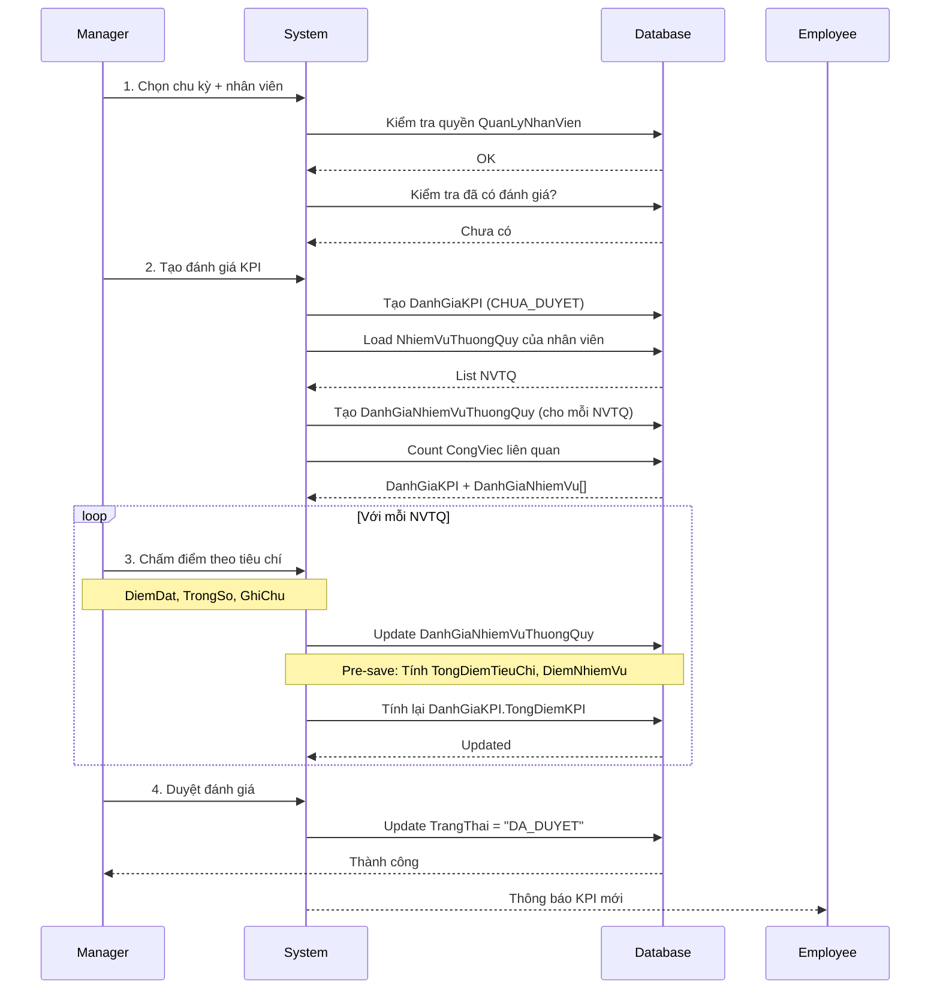
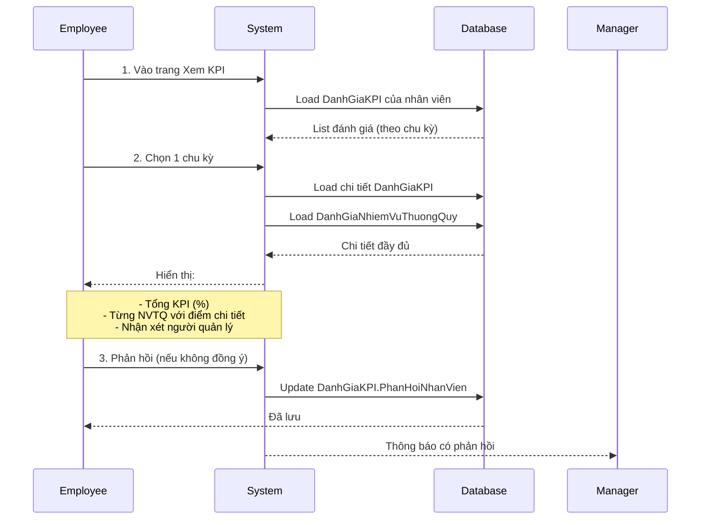

# Logic Nghiệp vụ Hệ thống Đánh giá KPI

**Phiên bản:** 2.0  
**Ngày cập nhật:** October 6, 2025

---

## 📋 Mục lục

1. [Tổng quan nghiệp vụ](#1-tổng-quan-nghiệp-vụ)
2. [Các thực thể chính](#2-các-thực-thể-chính)
3. [Quy tắc nghiệp vụ](#3-quy-tắc-nghiệp-vụ)
4. [Luồng xử lý](#4-luồng-xử-lý)
5. [Cases đặc biệt](#5-cases-đặc-biệt)

---

## 1. Tổng quan nghiệp vụ

### 1.1 Mục đích

Hệ thống đánh giá KPI giúp:

- Đo lường hiệu suất làm việc của nhân viên
- Dựa trên **nhiệm vụ thường quy** đã được giao
- Áp dụng **tiêu chí đánh giá linh hoạt** (không fix cứng)
- Tính toán **tự động** theo công thức chuẩn
- Theo **chu kỳ** đánh giá rõ ràng

### 1.2 Phạm vi

- **Đối tượng đánh giá:** Nhân viên có gán nhiệm vụ thường quy
- **Người đánh giá:** Người quản lý có quyền KPI (theo `QuanLyNhanVien.LoaiQuanLy = "KPI"`)
- **Chu kỳ:** Theo tháng/quý/năm do Admin tạo
- **Duyệt:** Người tạo đánh giá chính là người duyệt (không qua cấp khác)

---

## 2. Các thực thể chính

### 2.1 TieuChiDanhGia (Tiêu chí đánh giá)

**Mục đích:** Danh mục tiêu chí để chấm điểm, cấu hình linh hoạt.

**Thuộc tính:**

```javascript
{
  TenTieuChi: String,        // VD: "Mức độ hoàn thành", "Điểm tích cực"
  MoTa: String,              // Mô tả chi tiết
  LoaiTieuChi: String,       // "TANG_DIEM" | "GIAM_DIEM"
  GiaTriMin: Number,         // Giá trị tối thiểu (VD: 0)
  GiaTriMax: Number,         // Giá trị tối đa (VD: 100)
  TrongSoMacDinh: Number,    // Trọng số mặc định (VD: 1.0)
  TrangThaiHoatDong: Boolean // true/false
}
```

**Quy tắc:**

- Admin/Manager tạo và quản lý
- Có thể tạo nhiều tiêu chí tùy ý
- **TANG_DIEM:** Điểm cộng (VD: Mức độ hoàn thành, Điểm tích cực)
- **GIAM_DIEM:** Điểm trừ (VD: Điểm trừ quá hạn, Vi phạm quy định)
- Không bắt buộc tổng trọng số = 100%

**Ví dụ:**

```javascript
[
  {
    TenTieuChi: "Mức độ hoàn thành",
    LoaiTieuChi: "TANG_DIEM",
    GiaTriMax: 100,
    TrongSoMacDinh: 1.0,
  },
  {
    TenTieuChi: "Điểm tích cực",
    LoaiTieuChi: "TANG_DIEM",
    GiaTriMax: 10,
    TrongSoMacDinh: 1.0,
  },
  {
    TenTieuChi: "Điểm sáng tạo",
    LoaiTieuChi: "TANG_DIEM",
    GiaTriMax: 10,
    TrongSoMacDinh: 0.5,
  },
  {
    TenTieuChi: "Điểm trừ quá hạn",
    LoaiTieuChi: "GIAM_DIEM",
    GiaTriMax: 10,
    TrongSoMacDinh: 1.0,
  },
];
```

---

### 2.2 ChuKyDanhGia (Chu kỳ đánh giá)

**Mục đích:** Quản lý các kỳ đánh giá KPI.

**Thuộc tính:**

```javascript
{
  TenChuKy: String,          // "KPI Tháng 10/2025"
  LoaiChuKy: String,         // "HANG_THANG" | "QUY" | "NAM" | "TUY_CHINH"
  NgayBatDau: Date,
  NgayKetThuc: Date,
  TrangThai: String,         // "CHUAN_BI" | "DANG_HOAT_DONG" | "DANH_GIA" | "HOAN_THANH"
  NguoiTaoID: ObjectId
}
```

**Quy tắc:**

- Chỉ Admin tạo chu kỳ
- Không cho phép tạo chu kỳ trùng lặp (cùng Thang/Quy/Nam)
- `NgayBatDau` < `NgayKetThuc`
- Chỉ có thể chấm KPI khi chu kỳ ở trạng thái "DANG_HOAT_DONG" hoặc "DANH_GIA"

**Lifecycle:**

```
CHUAN_BI → DANG_HOAT_DONG → DANH_GIA → HOAN_THANH
```

---

### 2.3 DanhGiaKPI (Đánh giá KPI tổng thể)

**Mục đích:** Lưu kết quả đánh giá KPI của 1 nhân viên trong 1 chu kỳ.

**Thuộc tính:**

```javascript
{
  ChuKyID: ObjectId,         // Chu kỳ đánh giá
  NhanVienID: ObjectId,      // Nhân viên được đánh giá
  NguoiDanhGiaID: ObjectId,  // Người chấm KPI (= người duyệt)

  TongDiemKPI: Number,       // Tổng điểm % (tính tự động)

  TrangThai: String,         // "CHUA_DUYET" | "DA_DUYET"

  NhanXetNguoiDanhGia: String,
  PhanHoiNhanVien: String,   // Nhân viên có thể phản hồi
  NgayDuyet: Date
}
```

**Quy tắc:**

- **1 nhân viên chỉ có 1 đánh giá KPI trong 1 chu kỳ** (unique constraint)
- Người tạo = người duyệt (không qua workflow phức tạp)
- Chỉ sửa được khi `TrangThai = "CHUA_DUYET"`
- `TongDiemKPI` tính tự động khi chấm điểm các nhiệm vụ

---

### 2.4 DanhGiaNhiemVuThuongQuy (Đánh giá từng NVTQ)

**Mục đích:** Lưu điểm đánh giá chi tiết cho từng nhiệm vụ thường quy.

**Thuộc tính:**

```javascript
{
  DanhGiaKPIID: ObjectId,
  NhiemVuThuongQuyID: ObjectId,
  NhanVienID: ObjectId,

  MucDoKho: Number,          // 1-10 (có thể điều chỉnh từ NVTQ.MucDoKho)

  ChiTietDiem: [
    {
      TieuChiID: ObjectId,
      TenTieuChi: String,
      LoaiTieuChi: String,
      DiemDat: Number,       // Điểm người quản lý chấm
      TrongSo: Number,       // Trọng số áp dụng
      GhiChu: String
    }
  ],

  TongDiemTieuChi: Number,   // % (tính tự động)
  DiemNhiemVu: Number,       // MucDoKho × (TongDiemTieuChi/100)

  SoCongViecLienQuan: Number, // Tham khảo từ CongViec
  GhiChu: String
}
```

**Quy tắc:**

- Tự động tạo khi bắt đầu đánh giá KPI
- Load từ `NhanVienNhiemVu` (các nhiệm vụ đã gán cho nhân viên)
- `ChiTietDiem` ban đầu rỗng, người quản lý chấm sau
- `TongDiemTieuChi` và `DiemNhiemVu` tính tự động (pre-save hook)

---

## 3. Quy tắc nghiệp vụ

### 3.1 Quyền đánh giá

**Rule 1:** Chỉ được đánh giá nhân viên nếu:

```javascript
QuanLyNhanVien {
  NhanVienQuanLy: userId,           // Người đăng nhập
  NhanVienDuocQuanLy: targetUserId, // Nhân viên được đánh giá
  LoaiQuanLy: "KPI",                // Loại quản lý KPI
  isDeleted: false
}
```

**Exception:** Admin có quyền đánh giá tất cả nhân viên.

---

### 3.2 Tạo đánh giá KPI

**Điều kiện:**

1. Chu kỳ phải tồn tại và đang mở (TrangThai = "DANG_HOAT_DONG" hoặc "DANH_GIA")
2. Nhân viên chưa có đánh giá trong chu kỳ này
3. Người đánh giá có quyền (theo Rule 1)

**Quy trình tự động:**

```javascript
1. Tạo bản ghi DanhGiaKPI
2. Load danh sách NhiemVuThuongQuy của nhân viên (từ NhanVienNhiemVu)
3. Với mỗi NVTQ:
   - Tạo DanhGiaNhiemVuThuongQuy
   - MucDoKho = NVTQ.MucDoKho (có thể điều chỉnh sau)
   - ChiTietDiem = [] (rỗng, chưa chấm)
   - SoCongViecLienQuan = count(CongViec trong chu kỳ)
4. Trả về danh sách để người quản lý chấm điểm
```

---

### 3.3 Chấm điểm nhiệm vụ

**Input:**

```javascript
{
  ChiTietDiem: [
    {
      TieuChiID: "...",
      DiemDat: 85,        // Phải nằm trong [GiaTriMin, GiaTriMax]
      TrongSo: 1.0        // Mặc định từ TieuChiDanhGia.TrongSoMacDinh
    },
    {
      TieuChiID: "...",
      DiemDat: 3,
      TrongSo: 1.0
    },
    {
      TieuChiID: "...",
      DiemDat: 2,
      TrongSo: 1.0
    }
  ],
  MucDoKho: 5,           // Có thể điều chỉnh
  GhiChu: "Nhân viên làm việc tốt..."
}
```

**Validation:**

- `DiemDat` phải nằm trong khoảng `[TieuChiDanhGia.GiaTriMin, TieuChiDanhGia.GiaTriMax]`
- `MucDoKho` phải từ 1-10
- Chỉ sửa được khi `DanhGiaKPI.TrangThai = "CHUA_DUYET"`

**Auto-calculation (Pre-save hook):**

```javascript
// Tính TongDiemTieuChi
let tongTang = 0;
let tongGiam = 0;

ChiTietDiem.forEach((tc) => {
  const diemCoTrongSo = tc.DiemDat * tc.TrongSo;

  if (tc.LoaiTieuChi === "TANG_DIEM") {
    tongTang += diemCoTrongSo;
  } else if (tc.LoaiTieuChi === "GIAM_DIEM") {
    tongGiam += diemCoTrongSo;
  }
});

TongDiemTieuChi = tongTang - tongGiam;
DiemNhiemVu = MucDoKho * (TongDiemTieuChi / 100);
```

**Trigger:**

- Sau khi save `DanhGiaNhiemVuThuongQuy`, gọi `DanhGiaKPI.tinhTongDiemKPI()`
- Cập nhật `TongDiemKPI` = Σ(DiemNhiemVu)

---

### 3.4 Duyệt đánh giá

**Điều kiện:**

- `TrangThai = "CHUA_DUYET"`
- Người duyệt = `NguoiDanhGiaID` (người tạo)

**Thực hiện:**

```javascript
DanhGiaKPI.TrangThai = "DA_DUYET";
DanhGiaKPI.NgayDuyet = new Date();
DanhGiaKPI.save();
```

**Hậu quả:**

- Không thể sửa điểm sau khi duyệt
- Admin có thể "Hủy duyệt" để cho phép sửa lại

---

### 3.5 Hủy duyệt

**Quyền:**

- Người tạo đánh giá
- Hoặc Admin

**Thực hiện:**

```javascript
DanhGiaKPI.TrangThai = "CHUA_DUYET";
DanhGiaKPI.NgayDuyet = null;
DanhGiaKPI.save();
```

---

### 3.6 Xóa đánh giá

**Điều kiện:**

- `TrangThai = "CHUA_DUYET"` (không cho xóa đã duyệt)
- Người xóa = `NguoiDanhGiaID` hoặc Admin

**Thực hiện:**

```javascript
DanhGiaKPI.isDeleted = true;
DanhGiaKPI.save();

// Cascade delete
DanhGiaNhiemVuThuongQuy.updateMany(
  { DanhGiaKPIID: danhGiaKPIId },
  { isDeleted: true }
);
```

---

## 4. Luồng xử lý

### 4.1 Luồng chấm KPI (Happy Path)



---

### 4.2 Luồng nhân viên xem KPI



---

## 5. Cases đặc biệt

### 5.1 Nhân viên chưa có nhiệm vụ thường quy

**Vấn đề:** Nhân viên mới hoặc chưa được gán NVTQ.

**Giải pháp:**

```javascript
if (nhanVienNhiemVu.length === 0) {
  throw new Error(
    "Nhân viên chưa được gán nhiệm vụ thường quy nào. Vui lòng gán NVTQ trước khi đánh giá."
  );
}
```

**UI:** Hiển thị warning và link đến trang gán nhiệm vụ.

---

### 5.2 Tiêu chí đánh giá thay đổi giữa chừng

**Vấn đề:** Admin thêm/xóa tiêu chí trong lúc đang chấm KPI.

**Giải pháp:**

- **Cache** `TenTieuChi`, `LoaiTieuChi` trong `ChiTietDiem`
- Khi hiển thị, ưu tiên dùng cache
- Nếu tiêu chí bị xóa, vẫn hiển thị được tên cũ

**Code:**

```javascript
// Khi chấm điểm
ChiTietDiem.forEach((tc) => {
  const tieuChi = await TieuChiDanhGia.findById(tc.TieuChiID);
  tc.TenTieuChi = tieuChi?.TenTieuChi || tc.TenTieuChi; // Fallback
  tc.LoaiTieuChi = tieuChi?.LoaiTieuChi || tc.LoaiTieuChi;
});
```

---

### 5.3 Mức độ khó điều chỉnh khác với NVTQ gốc

**Tình huống:** Người quản lý thấy nhiệm vụ thực tế khó hơn hoặc dễ hơn mức độ khó đã cấu hình.

**Giải pháp:**

- Cho phép điều chỉnh `MucDoKho` khi chấm điểm
- Ghi log để kiểm tra sau:
  ```javascript
  if (MucDoKho !== nhiemVuGoc.MucDoKho) {
    GhiChu += `\n[Điều chỉnh độ khó: ${nhiemVuGoc.MucDoKho} → ${MucDoKho}]`;
  }
  ```

---

### 5.4 Không có công việc nào trong chu kỳ

**Vấn đề:** Nhân viên không có `CongViec` liên quan đến NVTQ trong chu kỳ.

**Giải pháp:**

- Vẫn cho phép chấm KPI (đánh giá định tính)
- `SoCongViecLienQuan = 0` → Chỉ là thông tin tham khảo
- Người quản lý chấm điểm theo quan sát thực tế

---

### 5.5 Tổng điểm KPI âm

**Vấn đề:** Điểm trừ quá nhiều → `TongDiemKPI < 0`.

**Giải pháp:**

- **Không giới hạn** (cho phép âm)
- Hoặc **Clamp về 0:**
  ```javascript
  TongDiemKPI = Math.max(0, tongDiem);
  ```

**Quyết định:** Cho phép âm để phản ánh đúng hiệu suất kém.

---

### 5.6 Chu kỳ đã đóng nhưng chưa duyệt hết

**Vấn đề:** Admin đóng chu kỳ (HOAN_THANH) nhưng còn đánh giá chưa duyệt.

**Giải pháp:**

- **Warning:** Khi đóng chu kỳ, kiểm tra số đánh giá `CHUA_DUYET`
- **Option 1:** Không cho đóng nếu còn chưa duyệt
- **Option 2:** Cho đóng nhưng vẫn sửa được (exception)

**Recommended:** Option 2 (linh hoạt hơn).

---

## 6. Validation Rules

### 6.1 Validation khi tạo đánh giá

```javascript
// 1. Chu kỳ hợp lệ
if (!chuKy || chuKy.TrangThai === "HOAN_THANH") {
  throw new Error("Chu kỳ không hợp lệ hoặc đã đóng");
}

// 2. Quyền đánh giá
const quanLy = await QuanLyNhanVien.findOne({
  NhanVienQuanLy: userId,
  NhanVienDuocQuanLy: targetUserId,
  LoaiQuanLy: "KPI",
});
if (!quanLy && !isAdmin) {
  throw new Error("Không có quyền đánh giá nhân viên này");
}

// 3. Chưa có đánh giá
const existing = await DanhGiaKPI.findOne({ ChuKyID, NhanVienID });
if (existing) {
  throw new Error("Nhân viên đã có đánh giá trong chu kỳ này");
}

// 4. Có nhiệm vụ thường quy
const nhiemVu = await NhanVienNhiemVu.find({ NhanVienID });
if (nhiemVu.length === 0) {
  throw new Error("Nhân viên chưa được gán nhiệm vụ thường quy");
}
```

---

### 6.2 Validation khi chấm điểm

```javascript
// 1. Đánh giá còn sửa được
if (danhGiaKPI.TrangThai === "DA_DUYET") {
  throw new Error("Không thể sửa đánh giá đã duyệt");
}

// 2. Quyền sửa
if (danhGiaKPI.NguoiDanhGiaID !== userId && !isAdmin) {
  throw new Error("Không có quyền sửa đánh giá này");
}

// 3. Điểm hợp lệ
ChiTietDiem.forEach((tc) => {
  const tieuChi = await TieuChiDanhGia.findById(tc.TieuChiID);

  if (tc.DiemDat < tieuChi.GiaTriMin || tc.DiemDat > tieuChi.GiaTriMax) {
    throw new Error(
      `Điểm "${tieuChi.TenTieuChi}" phải từ ${tieuChi.GiaTriMin} đến ${tieuChi.GiaTriMax}`
    );
  }
});

// 4. Mức độ khó
if (MucDoKho < 1 || MucDoKho > 10) {
  throw new Error("Mức độ khó phải từ 1-10");
}
```

---

## 7. Performance Considerations

### 7.1 Indexes cần thiết

```javascript
// DanhGiaKPI
{ ChuKyID: 1, NhanVienID: 1 } // unique
{ ChuKyID: 1, TrangThai: 1 }  // filter theo chu kỳ + trạng thái
{ NguoiDanhGiaID: 1 }          // filter theo người đánh giá
{ TongDiemKPI: -1 }            // sort top nhân viên

// DanhGiaNhiemVuThuongQuy
{ DanhGiaKPIID: 1 }            // populate chi tiết
{ NhiemVuThuongQuyID: 1, NhanVienID: 1 } // lookup
```

---

### 7.2 Populate selective

```javascript
// Chỉ lấy fields cần thiết
await DanhGiaKPI.find({ ChuKyID })
  .populate("NhanVienID", "HoTen MaNhanVien") // Chỉ lấy tên
  .populate("NguoiDanhGiaID", "HoTen UserName")
  .populate({
    path: "ChuKyID",
    select: "TenChuKy NgayBatDau NgayKetThuc",
  });
```

---

### 7.3 Batch processing

```javascript
// Khi tạo đánh giá cho nhiều nhân viên
const promises = nhanVienIds.map((nvId) =>
  dispatch(taoDanhGiaKPI({ ChuKyID, NhanVienID: nvId }))
);

await Promise.all(promises);
```

---

## 8. Error Handling

### 8.1 Frontend error messages

```javascript
const ERROR_MESSAGES = {
  PERMISSION_DENIED: "Bạn không có quyền thực hiện thao tác này",
  ALREADY_EXISTS: "Nhân viên đã có đánh giá KPI trong chu kỳ này",
  NO_NVTQ: "Nhân viên chưa được gán nhiệm vụ thường quy nào",
  CYCLE_CLOSED: "Chu kỳ đã đóng, không thể chấm KPI",
  ALREADY_APPROVED: "Không thể sửa đánh giá đã duyệt",
  INVALID_SCORE: "Điểm không hợp lệ (phải từ {min} đến {max})",
};
```

---

## 9. Notifications

### 9.1 Khi nào gửi thông báo

| Sự kiện            | Người nhận     | Nội dung                                                        |
| ------------------ | -------------- | --------------------------------------------------------------- |
| Tạo đánh giá mới   | Nhân viên      | "Bạn có đánh giá KPI mới trong chu kỳ {TenChuKy}"               |
| Duyệt đánh giá     | Nhân viên      | "Đánh giá KPI của bạn đã được duyệt. Tổng điểm: {TongDiemKPI}%" |
| Nhân viên phản hồi | Người đánh giá | "{TenNhanVien} đã phản hồi về đánh giá KPI"                     |
| Hủy duyệt          | Nhân viên      | "Đánh giá KPI của bạn đã được hủy duyệt để điều chỉnh"          |

---

## 10. Tóm tắt Business Rules

| Rule       | Mô tả                                                           |
| ---------- | --------------------------------------------------------------- |
| **BR-001** | 1 nhân viên chỉ có 1 đánh giá KPI trong 1 chu kỳ                |
| **BR-002** | Chỉ đánh giá nhân viên có trong QuanLyNhanVien.LoaiQuanLy="KPI" |
| **BR-003** | Người tạo đánh giá = người duyệt (không qua cấp khác)           |
| **BR-004** | Chỉ sửa được khi TrangThai = "CHUA_DUYET"                       |
| **BR-005** | TongDiemKPI tính tự động = Σ(DiemNhiemVu)                       |
| **BR-006** | DiemNhiemVu = MucDoKho × (TongDiemTieuChi / 100)                |
| **BR-007** | TongDiemTieuChi = Σ(TANG_DIEM) - Σ(GIAM_DIEM)                   |
| **BR-008** | DiemDat phải nằm trong [GiaTriMin, GiaTriMax] của tiêu chí      |
| **BR-009** | Nhân viên phải có ít nhất 1 NVTQ mới đánh giá được              |
| **BR-010** | Admin có thể hủy duyệt bất kỳ đánh giá nào                      |

---

**Tài liệu liên quan:**

- [`KPI_FORMULA.md`](./KPI_FORMULA.md) - Chi tiết công thức tính
- [`KPI_WORKFLOW.md`](./KPI_WORKFLOW.md) - Luồng nghiệp vụ chi tiết
- [`KPI_API_SPEC.md`](./KPI_API_SPEC.md) - API endpoints

**Last Updated:** October 6, 2025
