# Quy trình Nghiệp vụ Đánh giá KPI

**Phiên bản:** 2.0  
**Ngày cập nhật:** October 6, 2025

---

## 📋 Mục lục

1. [Tổng quan quy trình](#1-tổng-quan-quy-trình)
2. [Workflow chính](#2-workflow-chính)
3. [User Stories](#3-user-stories)
4. [Flowcharts](#4-flowcharts)
5. [Checklist](#5-checklist)

---

## 1. Tổng quan quy trình

### 1.1 Actors (Người tham gia)

| Actor        | Vai trò           | Trách nhiệm                                                           |
| ------------ | ----------------- | --------------------------------------------------------------------- |
| **Admin**    | Quản trị hệ thống | - Tạo chu kỳ đánh giá<br>- Cấu hình tiêu chí<br>- Hủy duyệt (nếu cần) |
| **Manager**  | Người quản lý KPI | - Chấm KPI cho nhân viên dưới quyền<br>- Duyệt đánh giá               |
| **Employee** | Nhân viên         | - Xem KPI của mình<br>- Phản hồi (nếu cần)                            |

### 1.2 Chu trình đánh giá

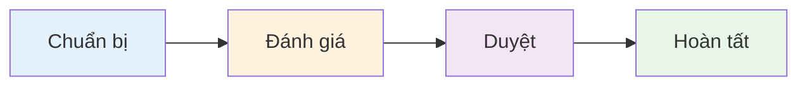

**Thời gian:** 1 chu kỳ (tháng/quý/năm)

---

## 2. Workflow chính

### 2.1 Phase 1: Chuẩn bị (Admin)

#### Step 1.1: Tạo chu kỳ đánh giá

**Actor:** Admin

**Input:**

- Loại chu kỳ (Tháng/Quý/Năm)
- Thời gian (Ngày bắt đầu - Ngày kết thúc)
- Phạm vi (Toàn bộ/Theo khoa)

**Process:**

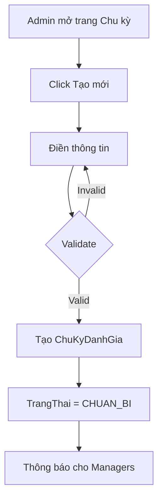

**Output:**

- `ChuKyDanhGia` với TrangThai = "CHUAN_BI"
- Thông báo đến Managers

**Validation:**

- Ngày bắt đầu < Ngày kết thúc
- Không trùng lặp chu kỳ (cùng Thang/Quy/Nam/KhoaID)

---

#### Step 1.2: Cấu hình tiêu chí (nếu cần)

**Actor:** Admin

**Input:**

- Tên tiêu chí
- Loại (TANG_DIEM/GIAM_DIEM)
- Giá trị Min/Max
- Trọng số mặc định

**Process:**

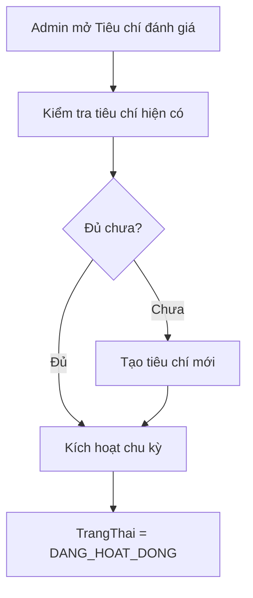

**Output:**

- Danh sách `TieuChiDanhGia` đầy đủ
- Chu kỳ chuyển sang "DANG_HOAT_DONG"

---

### 2.2 Phase 2: Đánh giá (Manager)

#### Step 2.1: Tạo đánh giá KPI

**Actor:** Manager

**Precondition:**

- Manager có quyền KPI cho nhân viên (trong `QuanLyNhanVien`)
- Chu kỳ đang mở (DANG_HOAT_DONG)
- Nhân viên chưa có đánh giá trong chu kỳ

**Process:**

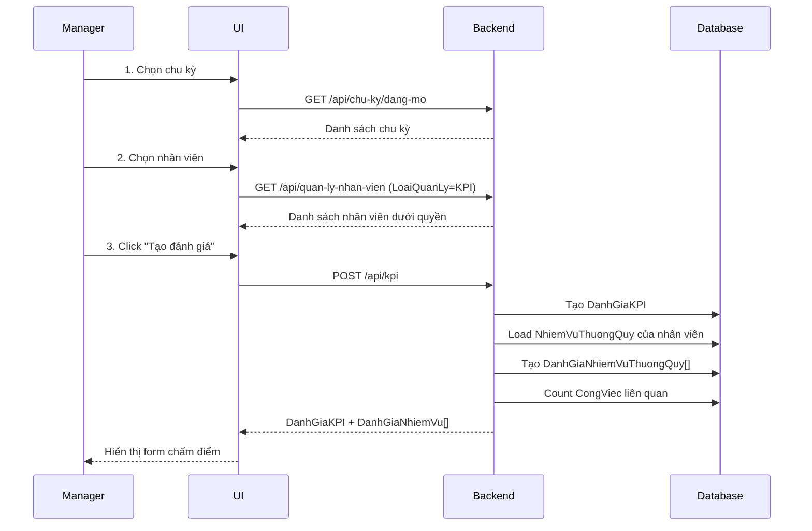

**Output:**

- `DanhGiaKPI` (TrangThai = "CHUA_DUYET")
- Danh sách `DanhGiaNhiemVuThuongQuy` (chưa chấm điểm)

---

#### Step 2.2: Chấm điểm từng nhiệm vụ

**Actor:** Manager

**Input (cho mỗi NVTQ):**

- Điểm theo từng tiêu chí
- Điều chỉnh Mức độ khó (optional)
- Ghi chú

**Process:**

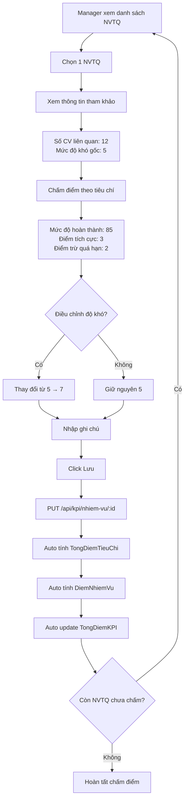

**Real-time calculation:**

```javascript
// Khi Manager nhập điểm, UI hiển thị ngay:
TongDiemTieuChi = (85×1 + 3×1) - (2×1) = 86%
DiemNhiemVu = 5 × 0.86 = 4.3
TongDiemKPI = Σ DiemNhiemVu = 4.3 + 2.85 + 1.76 = 8.91
```

**UI Display:**

```
┌─────────────────────────────────────┐
│ Quản lý hạ tầng mạng         [Edit] │
├─────────────────────────────────────┤
│ Độ khó: 5 │ Số CV: 12 │ Điểm: 4.3  │
│                                     │
│ Tiêu chí:                           │
│ ☑ Mức độ hoàn thành    85  (×1.0)  │
│ ☑ Điểm tích cực         3  (×1.0)  │
│ ☑ Điểm trừ quá hạn     -2  (×1.0)  │
│                                     │
│ Tổng tiêu chí: 86%                  │
│ Ghi chú: [________________]         │
│                                     │
│           [Hủy]  [Lưu]              │
└─────────────────────────────────────┘

TỔNG KPI: 8.91 / 10 (89.1%) ████████░░
```

---

#### Step 2.3: Xem tổng hợp & duyệt

**Actor:** Manager

**Process:**

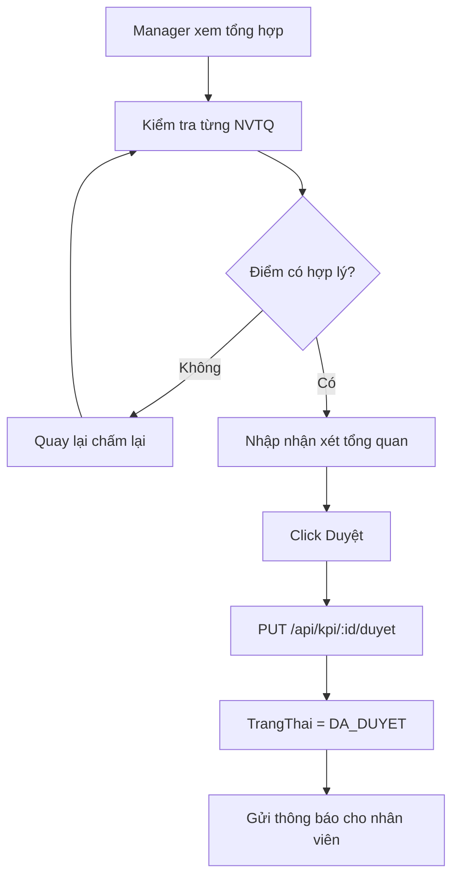

**Checklist trước khi duyệt:**

- [ ] Đã chấm điểm tất cả NVTQ
- [ ] Điểm phản ánh đúng thực tế
- [ ] Đã nhập nhận xét (recommended)
- [ ] Kiểm tra lại TongDiemKPI

**Output:**

- `DanhGiaKPI.TrangThai = "DA_DUYET"`
- `NgayDuyet` được ghi nhận
- Thông báo đến nhân viên

---

### 2.3 Phase 3: Xem & Phản hồi (Employee)

#### Step 3.1: Nhân viên xem KPI

**Actor:** Employee

**Process:**

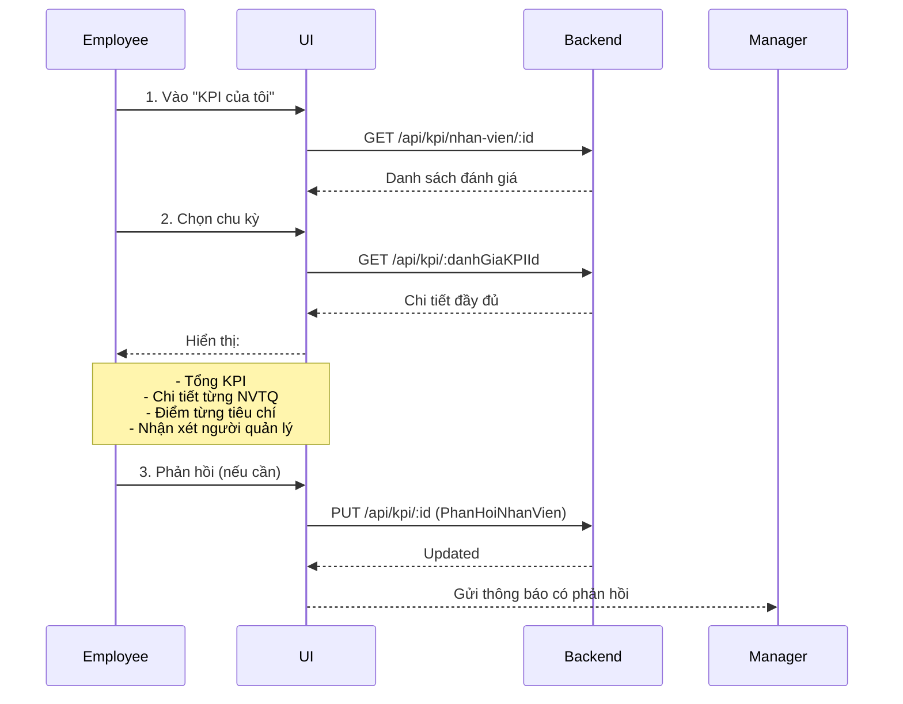

**UI Display (Employee view):**

```
╔═════════════════════════════════════════╗
║  KPI THÁNG 10/2025                      ║
╠═════════════════════════════════════════╣
║  Tổng điểm: 8.91 / 10 (89.1%)          ║
║  Trạng thái: ✓ Đã duyệt                 ║
║  Ngày duyệt: 06/10/2025                 ║
╚═════════════════════════════════════════╝

┌─ CHI TIẾT ĐÁNH GIÁ ──────────────────┐
│                                       │
│ 1. Quản lý hạ tầng mạng      4.3/5   │
│    Độ khó: 5 │ Tổng TC: 86%          │
│    ✓ Mức độ hoàn thành: 85%          │
│    ✓ Điểm tích cực: 3                │
│    ✗ Điểm trừ quá hạn: -2            │
│                                       │
│ 2. Bảo mật hệ thống          2.85/3  │
│    Độ khó: 3 │ Tổng TC: 95%          │
│    ...                                │
│                                       │
└───────────────────────────────────────┘

┌─ NHẬN XÉT NGƯỜI QUẢN LÝ ─────────────┐
│ Nhân viên làm việc rất tốt, hoàn     │
│ thành xuất sắc nhiệm vụ. Cần phát    │
│ huy hơn nữa trong tháng tới.         │
└───────────────────────────────────────┘

┌─ PHẢN HỒI CỦA TÔI ───────────────────┐
│ [Nhập phản hồi...]                   │
│                          [Gửi]       │
└───────────────────────────────────────┘
```

---

### 2.4 Phase 4: Hoàn tất (Admin)

#### Step 4.1: Theo dõi tiến độ

**Actor:** Admin

**Process:**

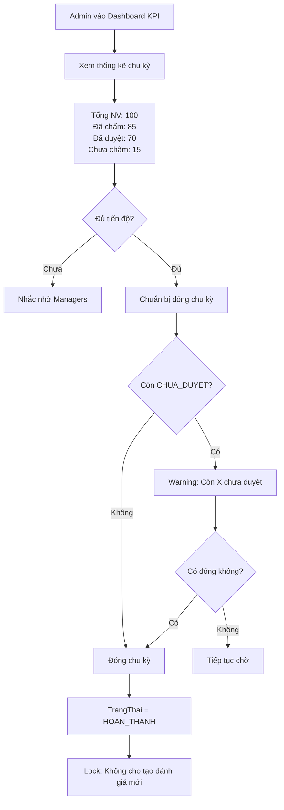

---

#### Step 4.2: Báo cáo tổng hợp

**Actor:** Admin

**Output:**

- Top 10 nhân viên xuất sắc
- Phân bố KPI theo khoa
- Trend so với các kỳ trước
- Export Excel/PDF

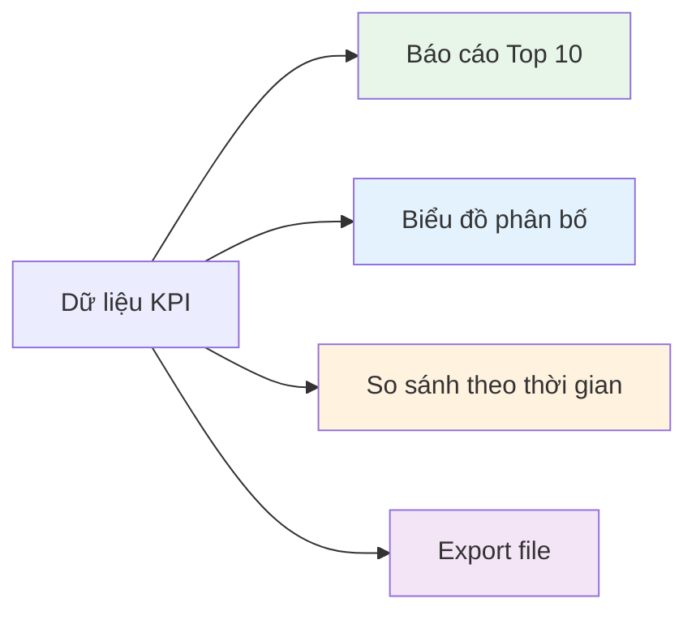

---

## 3. User Stories

### 3.1 Manager Stories

**US-001: Tạo đánh giá KPI**

```gherkin
Given Manager đã đăng nhập
And Có chu kỳ đang mở
And Manager có quyền KPI cho nhân viên A
When Manager chọn chu kỳ và nhân viên A
And Click "Tạo đánh giá"
Then Hệ thống tạo DanhGiaKPI mới
And Hiển thị danh sách NVTQ của nhân viên A
And Hiển thị form chấm điểm
```

**US-002: Chấm điểm NVTQ**

```gherkin
Given Đã có DanhGiaKPI (CHUA_DUYET)
And Manager đang xem 1 NVTQ
When Manager nhập điểm cho từng tiêu chí
And Click "Lưu"
Then Hệ thống tính TongDiemTieuChi tự động
And Tính DiemNhiemVu tự động
And Cập nhật TongDiemKPI
And Hiển thị kết quả ngay lập tức
```

**US-003: Duyệt KPI**

```gherkin
Given Đã chấm điểm tất cả NVTQ
And Manager kiểm tra lại tổng hợp
When Manager nhập nhận xét
And Click "Duyệt"
Then TrangThai = "DA_DUYET"
And Gửi thông báo cho nhân viên
And Không thể sửa điểm nữa
```

---

### 3.2 Employee Stories

**US-004: Xem KPI của mình**

```gherkin
Given Employee đã đăng nhập
When Employee vào "KPI của tôi"
Then Hiển thị danh sách KPI theo chu kỳ
And Khi chọn 1 chu kỳ
Then Hiển thị chi tiết đầy đủ:
  - Tổng KPI
  - Chi tiết từng NVTQ
  - Điểm từng tiêu chí
  - Nhận xét người quản lý
```

**US-005: Phản hồi về KPI**

```gherkin
Given Employee xem KPI đã duyệt
And Employee không đồng ý với điểm
When Employee nhập phản hồi
And Click "Gửi"
Then Lưu PhanHoiNhanVien
And Gửi thông báo cho Manager
```

---

### 3.3 Admin Stories

**US-006: Tạo chu kỳ đánh giá**

```gherkin
Given Admin đã đăng nhập
When Admin tạo chu kỳ mới
And Điền thông tin:
  - Loại: HANG_THANG
  - Tháng: 10, Năm: 2025
  - Từ ngày: 01/10/2025
  - Đến ngày: 31/10/2025
And Click "Tạo"
Then Hệ thống validate không trùng
And Tạo ChuKyDanhGia mới
And TrangThai = "CHUAN_BI"
And Thông báo cho Managers
```

**US-007: Hủy duyệt KPI**

```gherkin
Given Admin xem KPI đã duyệt
And Phát hiện sai sót
When Admin click "Hủy duyệt"
Then TrangThai = "CHUA_DUYET"
And Manager có thể sửa lại
And Gửi thông báo cho Manager + Employee
```

---

## 4. Flowcharts

### 4.1 Decision Tree: Có nên tạo đánh giá?

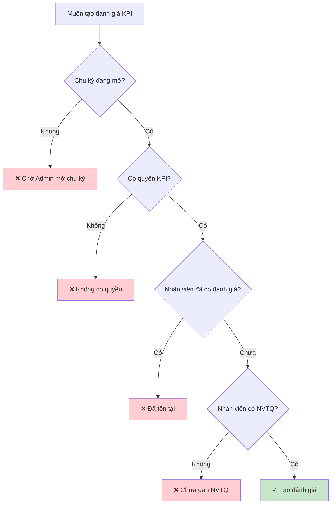

---

### 4.2 State Diagram: DanhGiaKPI

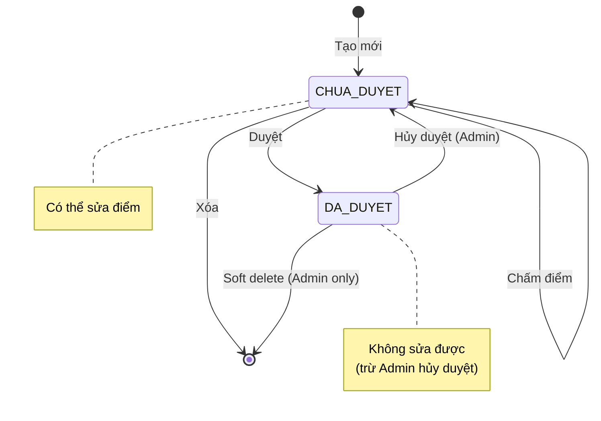

---

## 5. Checklist

### 5.1 Checklist cho Manager

#### Trước khi tạo đánh giá:

- [ ] Đã chọn đúng chu kỳ
- [ ] Đã chọn đúng nhân viên
- [ ] Nhân viên đã có nhiệm vụ thường quy
- [ ] Đã xem danh sách công việc tham khảo

#### Khi chấm điểm:

- [ ] Đã xem số công việc liên quan
- [ ] Điểm phản ánh đúng thực tế
- [ ] Đã nhập ghi chú cho từng NVTQ
- [ ] Đã kiểm tra lại TongDiemKPI

#### Trước khi duyệt:

- [ ] Đã chấm điểm tất cả NVTQ
- [ ] Đã nhập nhận xét tổng quan
- [ ] Đã kiểm tra lại toàn bộ
- [ ] Xác nhận muốn duyệt (không sửa được sau này)

---

### 5.2 Checklist cho Admin

#### Khi tạo chu kỳ:

- [ ] Đã chọn đúng loại chu kỳ
- [ ] Ngày bắt đầu/kết thúc hợp lý
- [ ] Không trùng với chu kỳ khác
- [ ] Đã thông báo cho Managers

#### Khi cấu hình tiêu chí:

- [ ] Tên tiêu chí rõ ràng
- [ ] Loại (TANG/GIAM) đúng
- [ ] Giá trị Min/Max hợp lý
- [ ] Trọng số phù hợp

#### Khi đóng chu kỳ:

- [ ] Đa số đánh giá đã duyệt (>80%)
- [ ] Đã nhắc nhở Managers chưa hoàn thành
- [ ] Đã export báo cáo
- [ ] Đã backup dữ liệu

---

### 5.3 Checklist cho Employee

#### Khi xem KPI:

- [ ] Đã đọc kỹ nhận xét
- [ ] Đã xem chi tiết từng NVTQ
- [ ] Hiểu rõ các tiêu chí đánh giá
- [ ] Ghi nhận điểm cần cải thiện

#### Khi phản hồi:

- [ ] Phản hồi khách quan, xây dựng
- [ ] Có dẫn chứng cụ thể (nếu không đồng ý)
- [ ] Đã kiểm tra lại trước khi gửi

---

## 6. Timeline Example

### Chu kỳ tháng 10/2025

```
01/10  ███ Admin tạo chu kỳ, mở cho đánh giá
│
02-10  ██████████ Managers chấm KPI
│      │
│      ├─ 02/10: Chấm 20 nhân viên
│      ├─ 05/10: Chấm thêm 30 nhân viên
│      ├─ 08/10: Chấm thêm 25 nhân viên
│      └─ 10/10: Hoàn tất 75/100 nhân viên
│
11-15  ████ Nhắc nhở + hoàn tất còn lại
│      │
│      ├─ 11/10: Admin nhắc nhở
│      ├─ 13/10: Chấm thêm 20 nhân viên
│      └─ 15/10: Hoàn tất 95/100 nhân viên
│
16-20  ██ Nhân viên xem + phản hồi
│      │
│      ├─ 5 nhân viên phản hồi
│      └─ Managers giải thích
│
21-25  █ Chỉnh sửa (nếu cần)
│      │
│      └─ Hủy duyệt 2 trường hợp, chấm lại
│
26-31  ██ Hoàn tất + Báo cáo
       │
       ├─ 26/10: Đóng chu kỳ
       ├─ 28/10: Export báo cáo
       └─ 31/10: Trình ban giám đốc
```

---

## 7. Best Practices

### 7.1 Cho Manager

✅ **DO:**

- Chấm điểm dựa trên dữ liệu cụ thể (CongViec, thống kê)
- Nhập ghi chú chi tiết cho từng NVTQ
- Trao đổi trực tiếp với nhân viên trước khi duyệt
- Phản hồi nhanh khi nhân viên có ý kiến

❌ **DON'T:**

- Chấm điểm cảm tính, thiếu căn cứ
- Duyệt vội vàng mà chưa kiểm tra kỹ
- Bỏ qua phản hồi của nhân viên
- Chấm điểm quá cao/thấp so với thực tế

---

### 7.2 Cho Employee

✅ **DO:**

- Xem KPI ngay khi nhận thông báo
- Đối chiếu với công việc thực tế đã làm
- Phản hồi xây dựng nếu có điểm chưa hợp lý
- Ghi nhận để cải thiện trong kỳ tiếp

❌ **DON'T:**

- Phản hồi thiếu lịch sự
- Chỉ tập trung vào điểm số mà không hiểu lý do
- Bỏ qua nhận xét của người quản lý

---

### 7.3 Cho Admin

✅ **DO:**

- Tạo chu kỳ sớm (trước ít nhất 3-5 ngày)
- Nhắc nhở Managers theo dõi tiến độ
- Hỗ trợ khi có vấn đề kỹ thuật
- Backup dữ liệu trước khi đóng chu kỳ

❌ **DON'T:**

- Đóng chu kỳ khi còn nhiều chưa duyệt
- Hủy duyệt tùy tiện mà không thông báo
- Thay đổi tiêu chí khi đang chấm KPI

---

**Tài liệu liên quan:**

- [`KPI_BUSINESS_LOGIC.md`](./KPI_BUSINESS_LOGIC.md) - Logic nghiệp vụ
- [`KPI_FORMULA.md`](./KPI_FORMULA.md) - Công thức tính
- [`KPI_API_SPEC.md`](./KPI_API_SPEC.md) - API endpoints

**Last Updated:** October 6, 2025
