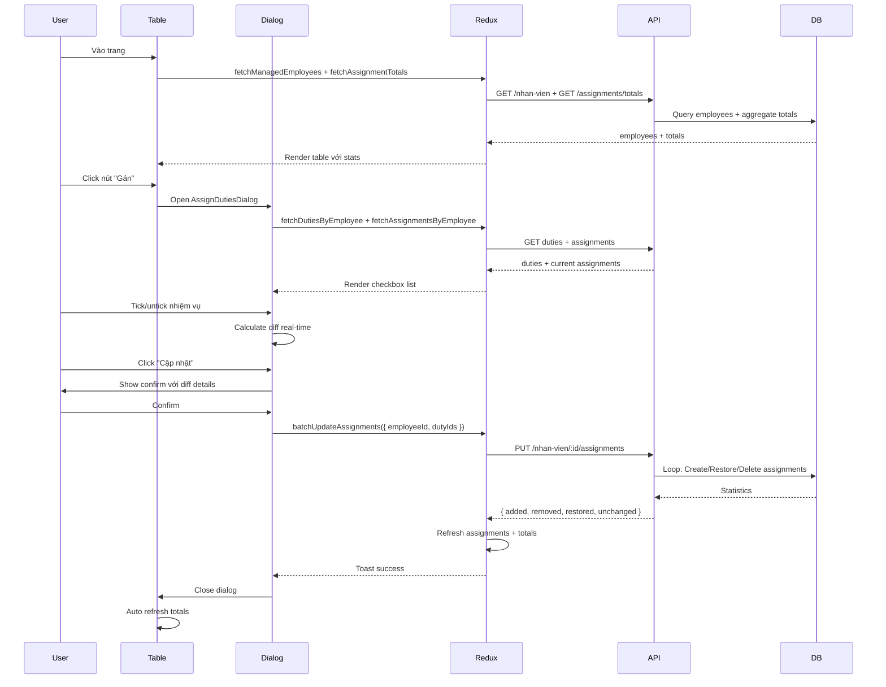

# 📌 Cập nhật chức năng Giao Nhiệm Vụ - Version 2.0

## 🎯 Tổng quan thay đổi

### **Trước đây (Old UI):**

- Chọn 1 nhân viên từ sidebar → Xem nhiệm vụ khả dụng → Gán từng cái
- Phải switch qua lại giữa các nhân viên
- Không có overview tổng quát

### **Hiện tại (New UI):**

- **Table hiển thị tất cả nhân viên** với thống kê (số nhiệm vụ, tổng điểm)
- **Dialog gán nhiệm vụ** với checkbox list đầy đủ
- **Confirm dialog** hiển thị diff (thêm/xóa/giữ nguyên)
- **Lazy load** - chỉ fetch data khi cần

---

## 📂 Files đã thay đổi

### Backend (100% hoàn thành)

#### 1. **Service Layer** - `giaoNhiemVu.service.js`

```javascript
// ✅ NEW: Batch update assignments cho 1 nhân viên
service.batchUpdateEmployeeAssignments = async (req, employeeId, dutyIds) => {
  // Logic:
  // - Validate input
  // - Get current assignments
  // - Calculate diff (toAdd, toRemove, unchanged)
  // - Add new OR restore deleted assignments (Option A)
  // - Soft delete removed assignments
  // - Return statistics
};
```

**Đặc điểm:**

- ✅ Khi restore (nhiệm vụ đã xóa): Tạo mới với `NgayGan = now` (Option A)
- ✅ Khi giữ nguyên: Không update gì cả (giữ `NgayGan` cũ)
- ✅ Xử lý atomic với loop (không dùng bulkWrite để tránh race condition)

#### 2. **Controller** - `giaoNhiemVu.controller.js`

```javascript
// ✅ NEW endpoint
ctrl.batchUpdateEmployeeAssignments = catchAsync(async (req, res) => {
  const { employeeId } = req.params;
  const { dutyIds } = req.body; // Array of duty IDs
  const data = await service.batchUpdateEmployeeAssignments(
    req,
    employeeId,
    dutyIds
  );
  return sendResponse(
    res,
    200,
    true,
    data,
    null,
    "Cập nhật nhiệm vụ thành công"
  );
});
```

#### 3. **Routes** - `giaoNhiemVu.api.js`

```javascript
// ✅ NEW route
router.put(
  "/nhan-vien/:employeeId/assignments",
  ctrl.batchUpdateEmployeeAssignments
);
```

**API Endpoint mới:**

```
PUT /api/workmanagement/giao-nhiem-vu/nhan-vien/:employeeId/assignments
Body: { dutyIds: [id1, id2, id3] }
Response: {
  success: true,
  added: 2,
  removed: 1,
  restored: 0,
  unchanged: 3,
  message: "Thêm: 2, Khôi phục: 0, Xóa: 1, Giữ nguyên: 3"
}
```

---

### Frontend (100% hoàn thành)

#### 4. **Redux Slice** - `giaoNhiemVuSlice.js`

```javascript
// ✅ NEW action creator
export const batchUpdateAssignments =
  ({ employeeId, dutyIds }) =>
  async (dispatch) => {
    // 1. Call API
    // 2. Show toast with statistics
    // 3. Refresh: assignments + duties + totals
  };
```

#### 5. **New Components**

##### **A. EmployeeOverviewTable.js** - Main table

```javascript
// Features:
// - Search bar (tên, mã NV, khoa)
// - CommonTable with columns: STT | Mã | Tên | Khoa | Số NV | Tổng điểm | Actions
// - Actions: 👁️ Xem | ✏️ Gán | 🗑️ Gỡ tất cả
// - Warning icon cho nhân viên chưa có nhiệm vụ
// - Opens dialogs: AssignDutiesDialog, ViewAssignmentsDialog
```

##### **B. AssignDutiesDialog.js** - Core logic

```javascript
// Features:
// 1. Fetch duties by employee's KhoaID
// 2. Fetch current assignments
// 3. Checkbox list với search
// 4. Real-time diff calculation
// 5. Alert hiển thị thay đổi (+/- count)
// 6. Visual highlight: xanh=thêm, đỏ=xóa
// 7. Confirm dialog trước khi submit
// 8. Call batchUpdateAssignments action
```

**Diff Logic:**

```javascript
const toAdd = selectedDutyIds.filter(
  (id) => !currentAssignmentIds.includes(id)
);
const toRemove = currentAssignmentIds.filter(
  (id) => !selectedDutyIds.includes(id)
);
const unchanged = selectedDutyIds.filter((id) =>
  currentAssignmentIds.includes(id)
);
```

**Confirm Dialog Content:**

```
⚠️ Xác nhận thay đổi gán nhiệm vụ
Nhân viên: Nguyễn Văn A

➕ Thêm mới (2):
  • Kiểm tra hồ sơ (Mức độ: 5)
  • Báo cáo định kỳ (Mức độ: 3)

➖ Gỡ bỏ (1):
  • Kiểm kê vật tư (Mức độ: 2)

✅ Giữ nguyên (3)

Tổng điểm: 15 → 21 (+6)
```

##### **C. ViewAssignmentsDialog.js** - View only

```javascript
// Features:
// - List nhiệm vụ đã gán
// - Hiển thị: Tên NV, Mức độ, Ngày gán, Người gán
// - Tổng số nhiệm vụ và điểm
// - Read-only mode
```

#### 6. **New Page** - `GiaoNhiemVuPageNew.js`

```javascript
// Layout:
// 1. Header Card: Avatar + Title + Manager info
// 2. Stats Cards: Tổng NV | Tổng điểm | Trung bình
// 3. MainCard: EmployeeOverviewTable

// Load strategy:
// - Initial: Fetch employees + manager info
// - After employees loaded: Fetch totals for all
// - Lazy load: Duties + assignments chỉ fetch khi click "Gán"
```

#### 7. **Routes** - `GiaoNhiemVuRoutes.js`

```javascript
// ✅ Main route uses new version
<Route path="/quanlycongviec/giao-nhiem-vu/:NhanVienID" element={<GiaoNhiemVuPageNew />} />

// ✅ Old version available for reference
<Route path="/quanlycongviec/giao-nhiem-vu-old/:NhanVienID" element={<GiaoNhiemVuPage />} />
```

---

## 🔄 Data Flow

### **Scenario: Manager gán nhiệm vụ cho nhân viên**



---

## 🎨 UI/UX Highlights

### **1. Overview Table**

- **Responsive**: CommonTable với pagination
- **Search**: Real-time filter
- **Visual feedback**: Warning icon cho nhân viên chưa có NV
- **Color-coded chips**: Success/default cho số nhiệm vụ

### **2. Assign Dialog**

- **Smart diff**: Highlight thêm (xanh) vs xóa (đỏ)
- **Live stats**: Chip hiển thị số đã chọn + tổng điểm
- **Alert banner**: Show +/- count
- **Disabled submit**: Khi không có thay đổi

### **3. Confirm Dialog**

- **Grouped changes**: Thêm/Xóa/Giữ nguyên
- **Detailed list**: Tên NV + Mức độ khó
- **Score delta**: "15 → 21 (+6)"

### **4. Toast Notifications**

```javascript
// Success toast hiển thị statistics
"Thêm: 2 | Khôi phục: 0 | Xóa: 1 | Giữ nguyên: 3";
```

---

## 🔐 Security & Validation

### Backend

- ✅ Authentication required
- ✅ Role check: Admin bypass, Manager check `QuanLyNhanVien`
- ✅ Validate `dutyIds` phải là array
- ✅ Validate nhiệm vụ phải cùng `KhoaID` với nhân viên
- ✅ Soft delete (không xóa vĩnh viễn)

### Frontend

- ✅ Confirm trước khi submit
- ✅ Loading states
- ✅ Error handling với friendly messages
- ✅ Disable buttons khi loading

---

## 📊 Performance Optimization

### **Lazy Loading Strategy**

```javascript
// ✅ Initial load (light)
- fetchManagedEmployees (10-30 records)
- fetchManagerInfo (1 record)
- fetchAssignmentTotals (aggregate query)

// ✅ On-demand load (only when click "Gán")
- fetchDutiesByEmployee (5-20 records)
- fetchAssignmentsByEmployee (0-10 records)
```

### **Caching**

- Redux state cache totals: `totalsByEmployeeId` map
- No need to refetch duties if already in state

### **Batch Operations**

- Single API call để update nhiều assignments
- Atomic operations trong service layer

---

## 🧪 Testing Checklist

### Backend

- [ ] Test với nhân viên chưa có assignment nào
- [ ] Test restore assignment đã xóa mềm
- [ ] Test giữ nguyên assignment (NgayGan không đổi)
- [ ] Test permission: Manager chỉ thao tác được nhân viên thuộc quyền
- [ ] Test permission: Admin có full access
- [ ] Test nhiệm vụ khác khoa → reject
- [ ] Test statistics trả về đúng

### Frontend

- [ ] Table load đầy đủ nhân viên
- [ ] Search hoạt động
- [ ] Dialog mở đúng nhân viên
- [ ] Checkbox list sync với current assignments
- [ ] Diff calculation real-time
- [ ] Confirm dialog hiển thị đúng changes
- [ ] Toast hiển thị statistics
- [ ] Auto refresh sau update
- [ ] Loading states hiển thị
- [ ] Error handling

---

## 🚀 Migration Guide

### **Để sử dụng version mới:**

1. URL hiện tại tự động dùng new version
2. Old version vẫn available tại `/giao-nhiem-vu-old/:NhanVienID`

### **Rollback (nếu cần):**

```javascript
// In GiaoNhiemVuRoutes.js
<Route
  path="/quanlycongviec/giao-nhiem-vu/:NhanVienID"
  element={<GiaoNhiemVuPage />}
/>
```

---

## 📝 Known Limitations

1. **Delete All**: Button "Gỡ tất cả" chưa implement API (hiện tại chỉ show toast)
2. **Bulk assign**: Chức năng gán 1 nhiệm vụ cho nhiều người vẫn dùng old logic
3. **Copy assignments**: Tính năng copy từ nhân viên khác chưa có

---

## 🔮 Future Enhancements

1. **Template assignments**: Lưu bộ nhiệm vụ mẫu để gán nhanh
2. **Workload balance**: Cảnh báo khi 1 nhân viên quá nhiều/ít nhiệm vụ
3. **History tracking**: Xem lịch sử thay đổi assignments
4. **Export**: Xuất báo cáo Excel phân công nhiệm vụ
5. **Notification**: Thông báo cho nhân viên khi được gán nhiệm vụ mới

---

## 📞 Support

Nếu gặp vấn đề:

1. Check console logs (FE + BE)
2. Verify API response format
3. Check Redux state in DevTools
4. Test với data sample trước

---

**Version:** 2.0  
**Last Updated:** 2025-10-02  
**Author:** AI Assistant + User  
**Status:** ✅ Production Ready
