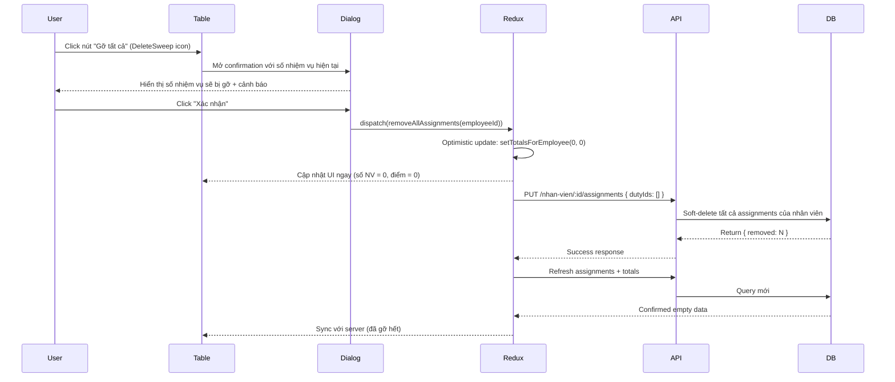

# 🗑️ Tính năng Gỡ Tất Cả Nhiệm Vụ

## Tổng quan

Cho phép quản lý gỡ bỏ toàn bộ nhiệm vụ đã gán cho một nhân viên bằng một thao tác duy nhất.

## Luồng hoạt động



## Implementation Details

### 1. Redux Action

**File**: `giaoNhiemVuSlice.js`

```javascript
export const removeAllAssignments = (employeeId) => async (dispatch) => {
  // 1. Call batch update API với dutyIds rỗng
  const res = await apiService.put(
    `/workmanagement/giao-nhiem-vu/nhan-vien/${employeeId}/assignments`,
    { dutyIds: [] }
  );

  // 2. Optimistic update: set totals = 0 ngay lập tức
  dispatch(
    slice.actions.setTotalsForEmployee({
      employeeId,
      assignments: 0,
      totalMucDoKho: 0,
    })
  );

  // 3. Toast success với số lượng đã gỡ
  const removed = data?.removed || 0;
  toast.success(`Đã gỡ tất cả ${removed} nhiệm vụ`);

  // 4. Refresh từ server để sync
  await dispatch(fetchAssignmentsByEmployee(employeeId));
  await dispatch(fetchAssignmentTotals([employeeId]));
};
```

**Ưu điểm**:
- ✅ Tái sử dụng endpoint batch update sẵn có
- ✅ Optimistic update → UX mượt mà
- ✅ Server refresh → đảm bảo data consistency

### 2. UI Component

**File**: `EmployeeOverviewTable.js`

**Button Action Column**:
```javascript
<Tooltip title="Gỡ tất cả">
  <IconButton
    size="small"
    color="error"
    onClick={() => handleDeleteAll(row.original)}
    disabled={row.original.assignments === 0} // Disabled khi chưa có NV
  >
    <DeleteSweep fontSize="small" />
  </IconButton>
</Tooltip>
```

**Confirmation Dialog**:
```javascript
const handleDeleteAll = async (row) => {
  setConfirmData({
    title: "⚠️ Xác nhận gỡ tất cả nhiệm vụ",
    description: (
      <Box>
        <Typography>
          Bạn có chắc muốn gỡ tất cả <strong>{row.assignments} nhiệm vụ</strong> 
          của nhân viên <strong>"{row.Ten}"</strong>?
        </Typography>
        <Typography color="error.main">
          ⚠️ Hành động này sẽ xóa tất cả nhiệm vụ đã gán. 
          Dữ liệu có thể được khôi phục sau nếu gán lại.
        </Typography>
      </Box>
    ),
    onConfirm: async () => {
      await dispatch(removeAllAssignments(row._id));
      setConfirmOpen(false);
      onRefresh?.(); // Optional callback to parent
    },
  });
  setConfirmOpen(true);
};
```

### 3. Backend Logic

**Endpoint**: `PUT /api/workmanagement/giao-nhiem-vu/nhan-vien/:employeeId/assignments`

**Body**: `{ dutyIds: [] }`

**Service Logic** (`giaoNhiemVu.service.js`):
```javascript
service.batchUpdateEmployeeAssignments = async (req, employeeId, dutyIds) => {
  // ...permission checks...

  const uniqueDutyIdsToAssign = [...new Set(dutyIds.map(String))];

  // Xử lý removal: Soft-delete các assignment không còn trong danh sách
  const toRemove = await NhanVienNhiemVu.updateMany(
    {
      NhanVienID: employeeId,
      NhiemVuThuongQuyID: { $nin: uniqueDutyIdsToAssign.map(toObjectId) },
      isDeleted: false,
    },
    {
      $set: { isDeleted: true, TrangThaiHoatDong: false },
    }
  );

  return {
    added: 0,
    removed: toRemove.modifiedCount,
    unchanged: 0,
    restored: 0,
  };
};
```

**Khi `dutyIds = []`**:
- `$nin` check tất cả assignments hiện tại
- Tất cả đều bị soft-delete
- `removed` = số assignments đã gỡ

## Security & Permissions

### Authorization

- ✅ Yêu cầu đăng nhập (`authentication.loginRequired`)
- ✅ Admin bypass: có thể gỡ nhiệm vụ của bất kỳ nhân viên
- ✅ Manager: chỉ gỡ được nhiệm vụ của nhân viên thuộc quyền quản lý

**Backend check**:
```javascript
if (!isAdminUser(user)) {
  await ensureManagerPermission(user, null, employeeId);
}
```

### Validation

- ✅ Check employeeId hợp lệ
- ✅ Check nhân viên tồn tại trong hệ thống
- ✅ Chỉ soft-delete (không xóa vĩnh viễn)

## User Experience

### Visual Feedback

1. **Button state**: Disabled khi `assignments === 0` (chưa có nhiệm vụ nào)
2. **Confirmation dialog**: Hiển thị số nhiệm vụ cụ thể + cảnh báo rõ ràng
3. **Toast notification**: "Đã gỡ tất cả N nhiệm vụ"
4. **Optimistic update**: Cột "Số nhiệm vụ" và "Tổng điểm" = 0 ngay lập tức

### Error Handling

```javascript
try {
  await dispatch(removeAllAssignments(employeeId));
} catch (error) {
  // Error toast đã được hiển thị trong thunk
  // Dialog tự động đóng
  setConfirmOpen(false);
}
```

**Các lỗi có thể xảy ra**:
- 403: Không có quyền thao tác với nhân viên này
- 404: Không tìm thấy nhân viên
- 500: Lỗi server

## Testing Checklist

### Happy Path
- [ ] Click "Gỡ tất cả" → hiện dialog với đúng số nhiệm vụ
- [ ] Xác nhận → số nhiệm vụ đổi về 0 ngay lập tức
- [ ] Toast hiển thị: "Đã gỡ tất cả N nhiệm vụ"
- [ ] Refresh trang → vẫn là 0 (đã sync với server)

### Edge Cases
- [ ] Nhân viên chưa có nhiệm vụ → button disabled
- [ ] Mạng chậm → vẫn thấy optimistic update, sau đó sync
- [ ] Gỡ xong, gán lại → khôi phục các assignment cũ (soft-delete logic)

### Permissions
- [ ] Admin: có thể gỡ tất cả nhiệm vụ của bất kỳ nhân viên
- [ ] Manager: chỉ gỡ được của nhân viên thuộc quyền quản lý
- [ ] User thường: không có quyền (403 error)

### Concurrent Operations
- [ ] Gỡ tất cả + đồng thời người khác gán mới → eventual consistency
- [ ] Gỡ tất cả nhiều nhân viên cùng lúc → mỗi request độc lập

## Performance Considerations

### Optimizations
- ✅ **Batch operation**: Một API call duy nhất thay vì N lần unassign
- ✅ **Optimistic update**: UI phản hồi ngay, không chờ server
- ✅ **Soft delete**: Không xóa vĩnh viễn, có thể khôi phục

### Database Impact
```javascript
// Single updateMany query, indexed by NhanVienID
await NhanVienNhiemVu.updateMany(
  { NhanVienID: employeeId, isDeleted: false },
  { $set: { isDeleted: true, TrangThaiHoatDong: false } }
);
```

**Index sử dụng**:
- Compound index: `(NhanVienID, isDeleted)`
- Unique index: `(NhanVienID, NhiemVuThuongQuyID)` không bị ảnh hưởng

## Related Features

- **Batch Update**: Sử dụng cùng endpoint `PUT /nhan-vien/:id/assignments`
- **Copy Assignments**: Có thể copy rồi gỡ tất cả để swap assignments
- **Soft Delete**: Tất cả assignments dùng `isDeleted` flag

## Future Enhancements

- [ ] **Undo/Redo**: Cho phép hoàn tác trong 5 phút
- [ ] **Bulk operations**: Gỡ tất cả cho nhiều nhân viên cùng lúc
- [ ] **Archive**: Lưu snapshot trước khi gỡ để audit trail
- [ ] **Notification**: Gửi email thông báo cho nhân viên khi bị gỡ nhiệm vụ

## Troubleshooting

### Vấn đề: UI không cập nhật sau khi gỡ
**Nguyên nhân**: Refresh API bị lỗi hoặc cache

**Giải pháp**:
1. Check cache-busting param trong `fetchAssignmentTotals`
2. Xác nhận `onRefresh` callback được gọi
3. Hard refresh trang (Ctrl+F5)

### Vấn đề: Toast hiển thị "Đã gỡ tất cả 0 nhiệm vụ"
**Nguyên nhân**: Nhân viên không có assignments hoặc đã gỡ trước đó

**Giải pháp**: Button đã disable khi `assignments === 0`, không nên xảy ra

### Vấn đề: 403 Error khi gỡ nhiệm vụ
**Nguyên nhân**: User không có quyền quản lý nhân viên này

**Giải pháp**: Check `QuanLyNhanVien` collection, đảm bảo relationship tồn tại

---

**Version**: 2.0  
**Last Updated**: 2025-10-02  
**Author**: GitHub Copilot  
**Related Docs**: CHANGELOG_V2.md, QUICK_REFERENCE.md, COPY_FEATURE_DOC.md
